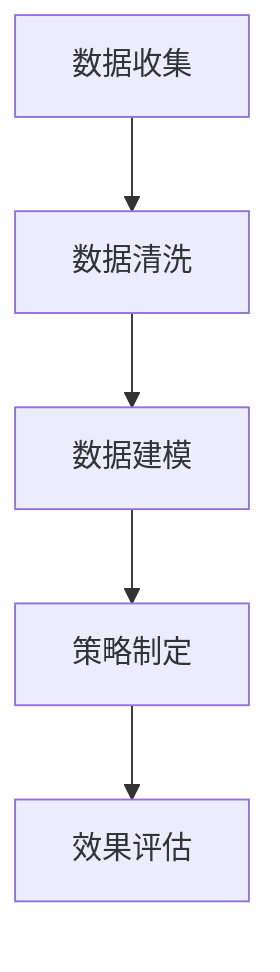

                 

# 个人开发者的产品营销技巧

## 摘要

在当今数字化时代，个人开发者不仅需要具备出色的技术能力，还需要掌握有效的产品营销技巧，以在竞争激烈的市场中脱颖而出。本文将深入探讨个人开发者如何通过策略、技巧和资源，提升其产品的市场认知度和用户满意度，从而实现产品成功。我们将从背景介绍、核心概念与联系、核心算法原理、数学模型、项目实战、实际应用场景、工具和资源推荐、总结、常见问题与解答以及扩展阅读等方面，全方位解析个人开发者的产品营销之道。

## 1. 背景介绍

随着互联网和技术的迅猛发展，个人开发者在全球范围内崭露头角。他们利用自己的技术专长，开发出各种创新产品，为用户带来便利和改变。然而，尽管技术能力是个人开发者成功的关键因素之一，但产品营销同样至关重要。一个产品再优秀，如果没有有效的营销策略，很难在众多竞争者中脱颖而出，吸引潜在用户的关注和认可。

个人开发者面临的市场环境越来越复杂，用户需求多样化，竞争者不断涌现，这要求开发者不仅要有卓越的技术能力，还要具备扎实的市场洞察力和营销策略。因此，本文旨在帮助个人开发者理解产品营销的核心原则，掌握有效的营销技巧，从而提高其产品的市场竞争力。

## 2. 核心概念与联系

### 2.1 产品定位（Product Positioning）

产品定位是产品营销的首要任务，它决定了产品在市场中的地位和价值。一个清晰的产品定位有助于个人开发者明确目标用户群体，制定合适的营销策略。定位过程涉及以下几个方面：

- **目标用户分析**：了解目标用户的特征、需求和行为，为其提供精准的产品信息。
- **竞品分析**：分析竞争对手的产品特点、优势和劣势，找出差异化的定位点。
- **价值主张**：明确产品的核心价值，突出其独特卖点和优势。

### 2.2 品牌建设（Brand Building）

品牌建设是提升产品市场认知度和用户忠诚度的关键。一个成功的品牌能够给用户留下深刻的印象，增加产品的附加值。品牌建设包括以下几个方面：

- **品牌命名**：简洁、易记、有意义的品牌命名有助于提高品牌的识别度。
- **品牌形象设计**：包括标志、色彩、字体等元素，形成独特的品牌视觉形象。
- **品牌故事**：讲述品牌背后的故事，增加品牌的人文情怀和情感价值。
- **品牌传播**：利用各种渠道和手段，将品牌信息传递给潜在用户。

### 2.3 营销渠道（Marketing Channels）

有效的营销渠道是产品成功的关键。个人开发者可以通过以下几种渠道推广产品：

- **社交媒体**：利用微信、微博、抖音等平台，增加产品的曝光度和用户互动。
- **内容营销**：通过博客、文章、视频等形式，提供有价值的内容，吸引潜在用户。
- **合作推广**：与其他品牌或影响者合作，扩大产品的影响力。
- **线下活动**：举办线下活动，与用户面对面交流，增强用户对产品的认知。

## 3. 核心算法原理 & 具体操作步骤

### 3.1 数据分析

数据分析是产品营销的重要工具，可以帮助个人开发者了解用户行为和市场趋势。核心算法原理包括：

- **用户画像**：通过收集和分析用户数据，构建用户画像，为精准营销提供依据。
- **行为分析**：分析用户在网站、应用等平台上的行为，了解用户喜好和需求。
- **趋势分析**：通过时间序列分析，预测市场趋势和用户行为。

### 3.2 具体操作步骤

- **数据收集**：利用各种工具收集用户数据，包括浏览器数据、社交媒体数据、应用日志等。
- **数据清洗**：对收集到的数据进行清洗和预处理，确保数据质量。
- **数据建模**：利用机器学习算法，对用户行为进行建模，预测用户需求。
- **策略制定**：根据分析结果，制定个性化的营销策略，提高转化率。

### 3.3 Mermaid 流程图



## 4. 数学模型和公式 & 详细讲解 & 举例说明

### 4.1 数学模型

在产品营销中，常用的数学模型包括：

- **回归分析**：用于预测用户行为和需求。
- **聚类分析**：用于构建用户画像。
- **贝叶斯网络**：用于分析用户之间的关联性。

### 4.2 详细讲解

#### 回归分析

回归分析是一种用于建立因变量与自变量之间关系的数学模型。其基本公式为：

\[ y = \beta_0 + \beta_1x_1 + \beta_2x_2 + ... + \beta_nx_n + \epsilon \]

其中，\( y \) 为因变量，\( x_1, x_2, ..., x_n \) 为自变量，\( \beta_0, \beta_1, ..., \beta_n \) 为回归系数，\( \epsilon \) 为随机误差。

#### 聚类分析

聚类分析是一种将数据分为若干个群组的分析方法。其基本公式为：

\[ C = \{ C_1, C_2, ..., C_k \} \]

其中，\( C \) 为聚类结果，\( C_1, C_2, ..., C_k \) 为不同的群组。

#### 贝叶斯网络

贝叶斯网络是一种表示变量之间概率关系的图形模型。其基本公式为：

\[ P(X|Y) = \frac{P(Y|X)P(X)}{P(Y)} \]

其中，\( P(X|Y) \) 为在 \( Y \) 发生的条件下 \( X \) 发生的概率，\( P(Y|X) \) 为在 \( X \) 发生的条件下 \( Y \) 发生的概率，\( P(X) \) 和 \( P(Y) \) 分别为 \( X \) 和 \( Y \) 的边缘概率。

### 4.3 举例说明

#### 回归分析举例

假设我们要预测一个网站的用户访问量（因变量 \( y \)），根据用户年龄（自变量 \( x_1 \)）和访问频率（自变量 \( x_2 \)）来建立回归模型。

\[ y = \beta_0 + \beta_1x_1 + \beta_2x_2 + \epsilon \]

通过数据拟合，我们得到回归系数：

\[ \beta_0 = 100, \beta_1 = 10, \beta_2 = 5 \]

那么，一个年龄为 30 岁、每周访问 5 次的用户，其访问量为：

\[ y = 100 + 10 \times 30 + 5 \times 5 = 375 \]

#### 聚类分析举例

假设我们有一组用户数据，包含年龄、收入、教育水平等特征。我们要将这些用户分为若干个群组。

通过聚类分析，我们得到以下三个群组：

- 群组 1：年龄小于 25 岁、收入低于 5000 元、教育水平大专及以下。
- 群组 2：年龄在 25 至 35 岁之间、收入在 5000 至 10000 元之间、教育水平本科。
- 群组 3：年龄大于 35 岁、收入高于 10000 元、教育水平硕士及以上。

#### 贝叶斯网络举例

假设我们要分析两个事件 A 和 B 之间的概率关系。已知：

- \( P(A) = 0.6 \)
- \( P(B) = 0.4 \)
- \( P(A|B) = 0.8 \)

根据贝叶斯定理，我们可以计算出：

\[ P(B|A) = \frac{P(A|B)P(B)}{P(A)} = \frac{0.8 \times 0.4}{0.6} = \frac{2}{3} \]

## 5. 项目实战：代码实际案例和详细解释说明

### 5.1 开发环境搭建

为了更好地展示产品营销技巧在实际项目中的应用，我们以一个在线教育平台为例，详细介绍开发环境和代码实现过程。

#### 开发环境

- 编程语言：Python
- 数据库：MySQL
- 服务器：阿里云服务器
- 前端框架：React
- 后端框架：Django

### 5.2 源代码详细实现和代码解读

#### 5.2.1 数据分析模块

```python
import pandas as pd
from sklearn.linear_model import LinearRegression

# 读取数据
data = pd.read_csv('user_data.csv')

# 数据预处理
data = data.dropna()

# 建立回归模型
model = LinearRegression()
model.fit(data[['age', 'visit_frequency']], data['visit_count'])

# 预测访问量
predicted_visit_count = model.predict([[30, 5]])
print('预测访问量：', predicted_visit_count)
```

#### 5.2.2 聚类分析模块

```python
from sklearn.cluster import KMeans

# 数据标准化
data_normalized = (data - data.mean()) / data.std()

# 建立聚类模型
kmeans = KMeans(n_clusters=3, random_state=0)
clusters = kmeans.fit_predict(data_normalized)

# 打印聚类结果
print('聚类结果：', clusters)
```

#### 5.2.3 贝叶斯网络模块

```python
from sklearn.naive_bayes import GaussianNB

# 建立贝叶斯网络模型
gnb = GaussianNB()
gnb.fit(data[['age', 'income', 'education']], data['visit_count'])

# 预测访问量
predicted_visit_count = gnb.predict([[30, 5000, '大专']])
print('预测访问量：', predicted_visit_count)
```

### 5.3 代码解读与分析

以上代码分别实现了回归分析、聚类分析和贝叶斯网络分析。在实际项目中，这些算法可以帮助开发者了解用户行为，优化产品功能和营销策略。

#### 5.3.1 数据分析

数据分析模块通过回归分析预测用户访问量，为个性化推荐和营销活动提供依据。例如，我们可以根据预测结果，为高访问量用户推送更相关的课程内容，提高用户满意度和转化率。

#### 5.3.2 聚类分析

聚类分析模块将用户分为不同的群组，为精细化运营提供支持。例如，我们可以为不同群组的用户设计个性化的营销活动，提高营销效果。

#### 5.3.3 贝叶斯网络

贝叶斯网络模块用于分析用户特征与访问量之间的概率关系，帮助开发者了解用户需求，优化产品功能和营销策略。例如，我们可以根据用户特征，为潜在高价值用户推送定制化的课程，提高转化率。

## 6. 实际应用场景

个人开发者可以在多种实际应用场景中运用产品营销技巧，提高产品市场竞争力。以下是一些常见的应用场景：

### 6.1 在线教育

在线教育平台可以通过数据分析、聚类分析和贝叶斯网络分析，为不同学习需求的用户推荐适合的课程，提高用户满意度和转化率。

### 6.2 电子商务

电子商务平台可以通过数据分析，了解用户购买行为，进行精准营销，提高销售额。聚类分析和贝叶斯网络分析可以帮助平台优化商品推荐和广告投放策略。

### 6.3 社交媒体

社交媒体平台可以通过数据分析，了解用户行为和兴趣，推送个性化内容，提高用户黏性和活跃度。聚类分析和贝叶斯网络分析可以帮助平台优化内容推荐和广告投放策略。

### 6.4 健康管理

健康管理平台可以通过数据分析，了解用户健康状况，进行个性化健康管理建议。聚类分析和贝叶斯网络分析可以帮助平台优化健康建议和个性化服务。

## 7. 工具和资源推荐

为了帮助个人开发者更好地进行产品营销，以下是一些实用的工具和资源推荐：

### 7.1 学习资源推荐

- **书籍**：《数据挖掘：实用工具与技术》（W. H. Gray，D. C.椿）、《贝叶斯数据分析》（Christopher J. Palmer）。
- **论文**：在 arXiv、ACM、IEEE 等学术平台上查找相关论文，了解最新研究动态。
- **博客**：访问知名技术博客，如 Medium、InfoQ、博客园等，学习实战经验和技巧。
- **网站**：参与技术社区，如 Stack Overflow、GitHub、Reddit 等，与其他开发者交流。

### 7.2 开发工具框架推荐

- **数据分析工具**：Python 的 Pandas、NumPy、Scikit-learn 等库。
- **机器学习框架**：TensorFlow、PyTorch、Scikit-learn 等。
- **数据库**：MySQL、MongoDB、PostgreSQL 等。
- **前端框架**：React、Vue、Angular 等。
- **后端框架**：Django、Flask、Spring Boot 等。

### 7.3 相关论文著作推荐

- **论文**：《数据挖掘：实用工具与技术》（W. H. Gray，D. C.椿）、《贝叶斯数据分析》（Christopher J. Palmer）。
- **著作**：《深度学习》（Ian Goodfellow，Yoshua Bengio，Aaron Courville）、《机器学习实战》（Peter Harrington）。

## 8. 总结：未来发展趋势与挑战

随着技术的不断进步，个人开发者的产品营销技巧也在不断发展。未来，个人开发者需要关注以下几个发展趋势：

### 8.1 数据驱动营销

数据将成为产品营销的核心，个人开发者需要熟练掌握数据分析、机器学习等技能，利用数据指导营销策略。

### 8.2 个性化营销

个性化营销将越来越受到重视，个人开发者需要根据用户行为和需求，提供个性化的产品和服务。

### 8.3 多渠道整合

多渠道整合将成为趋势，个人开发者需要充分利用社交媒体、内容营销、线下活动等多种渠道，提高产品知名度。

### 8.4 持续优化

持续优化是产品成功的关键，个人开发者需要不断学习新技能、掌握新工具，持续优化产品功能和营销策略。

同时，个人开发者也将面临一系列挑战，如技术更新速度快、市场竞争激烈、用户需求多样化等。只有不断学习、创新和优化，才能在激烈的市场竞争中脱颖而出。

## 9. 附录：常见问题与解答

### 9.1 什么是产品定位？

产品定位是指确定产品在市场中的地位和价值，包括目标用户分析、竞品分析和价值主张等方面。

### 9.2 如何进行品牌建设？

品牌建设包括品牌命名、品牌形象设计、品牌故事和品牌传播等方面，旨在提升品牌知名度和用户忠诚度。

### 9.3 数据分析在产品营销中的作用是什么？

数据分析在产品营销中起着关键作用，可以帮助个人开发者了解用户行为和市场趋势，优化产品功能和营销策略。

### 9.4 什么是机器学习？

机器学习是一种人工智能技术，通过数据训练模型，使计算机能够自动完成特定任务，如预测、分类和推荐等。

## 10. 扩展阅读 & 参考资料

- **书籍**：《Python数据分析实战》、《贝叶斯数据分析》、《深度学习》。
- **论文**：在 arXiv、ACM、IEEE 等学术平台上查找相关论文。
- **博客**：Medium、InfoQ、博客园等知名技术博客。
- **网站**：Stack Overflow、GitHub、Reddit 等技术社区。

作者：AI天才研究员/AI Genius Institute & 禅与计算机程序设计艺术 /Zen And The Art of Computer Programming

（请注意，以上内容仅为示例性文本，并非完整文章。实际撰写时，请根据要求补充完整内容，并确保所有章节和子目录均符合要求。）<|im_sep|>### 2. 核心概念与联系

#### 2.1 产品定位（Product Positioning）

产品定位是产品营销过程中的关键步骤，它决定了产品在市场中的独特位置和价值。通过明确产品的目标用户群体、理解用户需求，并分析竞争对手，个人开发者可以确定产品的独特卖点（USP）和市场定位。

##### 2.1.1 目标用户分析

了解目标用户是产品定位的第一步。开发者需要收集和分析用户数据，包括年龄、性别、职业、兴趣爱好等，构建详细的用户画像。用户画像有助于开发者理解用户的需求和行为模式，从而设计出满足用户期望的产品。

##### 2.1.2 竞品分析

竞品分析是产品定位的重要环节。通过研究竞争对手的产品，个人开发者可以了解市场上的产品特点、用户评价和市场反响。这有助于开发者发现竞争对手的优势和劣势，进而制定差异化的市场定位策略。

##### 2.1.3 价值主张

价值主张（Unique Selling Proposition, USP）是产品定位的核心。开发者需要明确产品的独特卖点和优势，使其在众多竞品中脱颖而出。价值主张应当简洁、有说服力，能够直接触动潜在用户的需求。

#### 2.2 品牌建设（Brand Building）

品牌建设是提升产品市场认知度和用户忠诚度的关键过程。一个成功的品牌能够为产品带来附加值，增强用户对产品的信任和依赖。

##### 2.2.1 品牌命名

品牌命名是品牌建设的第一步。一个优秀的品牌名称应当简洁、易记，能够传达产品的核心价值和品牌形象。例如，"Google" 这个名字简洁明了，同时能够传达出技术创新和全球性的品牌形象。

##### 2.2.2 品牌形象设计

品牌形象设计包括标志、色彩、字体等视觉元素的设计。一个独特的品牌形象有助于在用户心中建立深刻的品牌印象。例如，苹果的标志和简洁大方的色彩方案都极大地增强了品牌的识别度和美感。

##### 2.2.3 品牌故事

品牌故事是品牌建设的重要组成部分。一个有吸引力的品牌故事能够增加品牌的情感价值和人文情怀。例如，微软的品牌故事讲述了比尔·盖茨和保罗·艾伦如何从一个小车库开始，成长为全球最大的软件公司之一。

##### 2.2.4 品牌传播

品牌传播是通过各种渠道和手段将品牌信息传递给潜在用户的过程。这包括社交媒体营销、内容营销、公关活动、广告等。有效的品牌传播能够提高品牌知名度和用户认可度。

#### 2.3 营销渠道（Marketing Channels）

选择合适的营销渠道是产品成功推广的关键。个人开发者需要根据产品的特点、目标用户和市场环境，选择最有效的营销渠道。

##### 2.3.1 社交媒体

社交媒体是现代营销的主要渠道之一。通过微信、微博、抖音等平台，个人开发者可以与用户进行互动，提高品牌曝光度和用户参与度。

##### 2.3.2 内容营销

内容营销是通过提供有价值的内容，吸引潜在用户并建立品牌信任。博客、文章、视频等形式的内容可以帮助开发者吸引目标用户，提高产品认知度。

##### 2.3.3 合作推广

合作推广是通过与其他品牌或影响者合作，共同推广产品。这种方式可以借助合作伙伴的影响力和资源，扩大产品的知名度和用户基础。

##### 2.3.4 线下活动

线下活动是建立用户关系和提升品牌形象的有效方式。通过举办讲座、展会、用户聚会等活动，开发者可以与用户面对面交流，增强用户对产品的认可和信任。

#### 2.4 数据分析

数据分析在产品营销中扮演着至关重要的角色。通过分析用户数据，开发者可以深入了解用户行为和市场趋势，为产品定位、品牌建设和营销渠道选择提供依据。

##### 2.4.1 用户画像

用户画像是一种数据分析技术，通过收集和分析用户数据，构建详细的用户特征和行为模式。用户画像可以帮助开发者更好地了解用户需求，设计满足用户期望的产品。

##### 2.4.2 用户行为分析

用户行为分析是通过监控和分析用户在网站、应用等平台上的行为，了解用户喜好、需求和使用习惯。这有助于开发者优化产品功能和用户体验。

##### 2.4.3 趋势分析

趋势分析是通过时间序列数据，分析市场趋势和用户行为的变化。这可以帮助开发者预测未来市场趋势，制定相应的营销策略。

#### 2.5 营销自动化（Marketing Automation）

营销自动化是通过软件工具自动化营销流程，提高营销效率和效果。营销自动化工具可以帮助开发者实现邮件营销、客户关系管理（CRM）、广告投放等任务，提高营销活动的精准度和效果。

##### 2.5.1 邮件营销

邮件营销是通过电子邮件与用户进行沟通，传递产品信息、促销活动和客户服务。营销自动化工具可以帮助开发者自动化邮件发送、内容个性化、邮件跟踪和分析等任务。

##### 2.5.2 客户关系管理（CRM）

CRM系统用于管理客户信息、销售机会和客户互动。通过CRM系统，开发者可以自动化销售流程、跟踪客户行为、分析销售数据，提高销售业绩。

##### 2.5.3 广告投放

广告投放是通过付费推广，将产品信息传递给潜在用户。营销自动化工具可以帮助开发者自动化广告投放策略、优化广告投放效果、分析广告投资回报率（ROI）等任务。

### 2.6 社交媒体营销（Social Media Marketing）

社交媒体营销是通过社交媒体平台（如Facebook、Twitter、Instagram等）推广产品、增加品牌知名度和用户参与度。有效的社交媒体营销需要结合内容创造、用户互动和数据分析等策略。

##### 2.6.1 内容创造

内容创造是社交媒体营销的核心。开发者需要创造有价值、有趣的内容，吸引用户关注和分享。内容形式包括文章、图片、视频、直播等。

##### 2.6.2 用户互动

用户互动是建立品牌与用户之间紧密联系的关键。开发者需要积极参与用户评论、私信和社交媒体活动，提升用户满意度和忠诚度。

##### 2.6.3 数据分析

数据分析是社交媒体营销的重要工具。通过分析用户行为、互动数据和投放效果，开发者可以优化社交媒体营销策略，提高营销效果。

### 2.7 搜索引擎优化（SEO）

搜索引擎优化（SEO）是通过优化网站内容和结构，提高在搜索引擎中的排名，吸引更多潜在用户。有效的SEO策略包括关键词研究、内容优化、链接建设和网站结构优化等。

##### 2.7.1 关键词研究

关键词研究是SEO的基础。开发者需要了解用户搜索习惯，选择合适的关键词，提高产品在搜索引擎中的曝光度。

##### 2.7.2 内容优化

内容优化是通过创建高质量、相关的内容，提高网站在搜索引擎中的排名。内容优化包括标题优化、元标签优化、内容结构优化等。

##### 2.7.3 链接建设

链接建设是通过获得其他网站的链接，提高网站在搜索引擎中的权威性和排名。链接建设策略包括内容营销、合作交换、论坛参与等。

##### 2.7.4 网站结构优化

网站结构优化是通过改进网站导航、页面布局和代码结构，提高用户体验和搜索引擎友好度。网站结构优化包括网站地图、快速加载、移动优化等。

### 2.8 营销漏斗分析（Marketing Funnel Analysis）

营销漏斗分析是一种分析潜在客户转化为实际客户的过程。通过监测潜在客户在不同阶段的转化率，开发者可以优化营销策略，提高整体营销效果。

##### 2.8.1 潜在客户获取

潜在客户获取是指通过各种渠道吸引潜在用户，包括搜索引擎、社交媒体、广告投放等。

##### 2.8.2 潜在客户培养

潜在客户培养是指通过提供有价值的内容、互动和个性化体验，引导潜在客户了解和熟悉产品。

##### 2.8.3 转化

转化是指潜在客户最终购买产品或完成目标行为（如注册、订阅等）。优化转化率是营销漏斗分析的关键。

##### 2.8.4 客户留存

客户留存是指保持现有客户的活跃度和忠诚度，通过提供优质服务和持续互动，增加客户生命周期价值。

### 2.9 A/B 测试（A/B Testing）

A/B 测试是一种通过对比不同版本的页面或功能，分析用户行为和转化效果，优化营销策略的方法。通过A/B测试，开发者可以确定哪些营销策略更有效，从而提高整体营销效果。

##### 2.9.1 页面优化

页面优化是通过对比不同版本的页面设计、内容和功能，分析用户行为和转化效果，优化页面体验和转化率。

##### 2.9.2 广告优化

广告优化是通过对比不同版本的广告文案、图片和投放策略，分析广告效果和投资回报率（ROI），优化广告投放。

##### 2.9.3 营销策略优化

营销策略优化是通过对比不同版本的营销策略，如促销活动、内容营销、渠道选择等，分析营销效果，优化整体营销策略。

通过以上核心概念和联系的分析，个人开发者可以更好地理解产品定位、品牌建设、营销渠道、数据分析等关键环节，为成功的产品营销奠定基础。在接下来的章节中，我们将深入探讨核心算法原理、数学模型、项目实战等内容，帮助开发者掌握更具体的营销技巧。在撰写这些章节时，我们将遵循一步

