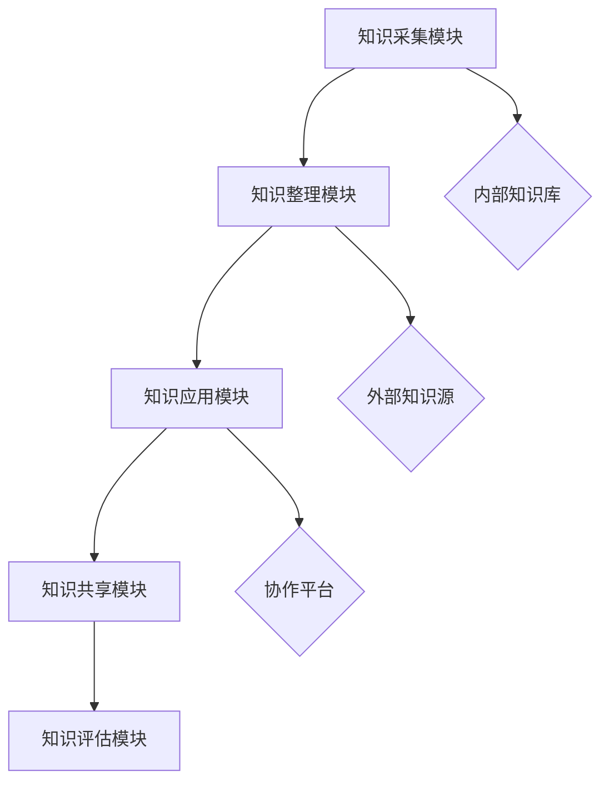

                 

# 个人知识管理工具：高知群体的刚需市场

## 摘要

在当今信息爆炸的时代，个人知识管理（PKM）工具的重要性愈发凸显。高知群体，作为知识密集型的专业人士，面临着信息过载、知识遗忘和效率低下的挑战。本文将深入探讨个人知识管理工具的必要性、核心概念与联系，以及具体实现方法。文章首先介绍PKM的基本概念，接着通过Mermaid流程图展示其架构，随后详细讲解核心算法原理和数学模型。通过实际项目实战，文章将展示代码实现和解读。随后，文章讨论PKM工具在各个应用场景中的实际作用，并推荐相关学习资源和开发工具。最后，文章总结未来发展趋势与挑战，并提供常见问题与解答。希望通过本文，读者能够对个人知识管理工具有更深刻的理解和应用。

## 1. 背景介绍

在信息化、数字化的高速发展背景下，个人知识管理（PKM）已经成为高知群体中不可或缺的一环。随着互联网的普及，信息获取变得更加便捷，但同时也带来了信息过载的问题。据统计，一个成年人每天接收到的信息量相当于过去一个人一生接收到的信息总和。面对如此庞大的信息量，高知群体，尤其是科研人员、工程师、医生等专业人士，常常感到力不从心，信息筛选和知识管理成为他们工作中的重要挑战。

首先，信息过载导致时间管理困难。高知群体往往需要在短时间内处理大量的信息和数据，而信息的有效筛选和整理成为一项繁重的工作。这不仅浪费了大量的时间和精力，还可能因为信息处理不当而导致工作效率低下。

其次，知识的遗忘问题同样困扰着高知群体。虽然他们具备了丰富的知识储备，但如果不通过有效的管理工具进行整理和复习，这些知识很容易随着时间的推移而遗忘。而知识的遗忘不仅会导致个人能力的下降，还可能对工作产生负面影响。

最后，缺乏高效的知识管理工具也限制了高知群体的创新能力。知识的创造和运用需要不断地积累和更新，而高效的个人知识管理工具可以为他们提供一个系统化的知识储备和快速检索的平台，从而提升创新能力和工作效率。

因此，个人知识管理工具对于高知群体来说，已经成为解决信息过载、知识遗忘和工作效率低下的重要手段。通过有效的知识管理，高知群体可以更好地掌握自己的知识体系，提高信息处理能力和工作效率，从而在日益激烈的工作竞争中保持优势。

## 2. 核心概念与联系

### 2.1 个人知识管理（PKM）的基本概念

个人知识管理（Personal Knowledge Management，简称PKM）是一种通过系统的策略和工具，对个人知识进行获取、整理、应用和共享的过程。其核心目标是提高个人在知识获取和应用过程中的效率和效果，从而更好地实现个人知识价值的最大化。

首先，知识获取是PKM的基础环节。知识的获取包括从各种渠道获取信息，如阅读书籍、文献、网络资源，以及与同行交流、参加研讨会等。获取知识的途径越多，个人的知识储备也就越丰富。

其次，知识整理是PKM的重要环节。获取的知识往往杂乱无章，需要通过分类、标注、存储等方式进行整理。有效的知识整理可以帮助个人快速找到所需信息，提高工作效率。

再次，知识应用是PKM的最终目的。整理好的知识需要应用到实际工作中，才能发挥其真正的价值。知识应用包括知识分享、协作创新、解决问题等，通过这些方式，个人可以不断提升自身的能力和竞争力。

最后，知识共享是PKM的重要补充。知识共享不仅可以帮助个人获得更多的反馈和建议，从而改进自己的知识体系，还可以促进知识的传播和扩散，为整个社会带来更多的创新和价值。

### 2.2 PKM与相关概念的联系

在探讨PKM的核心概念时，我们需要将其与相关概念进行关联，以便更全面地理解PKM的作用和意义。

首先，PKM与知识管理（Knowledge Management，简称KM）密切相关。知识管理是企业或组织层面的知识管理，而PKM是个人层面的知识管理。两者在目标和过程中有很多相似之处，但PKM更加注重个人对知识的主动管理和运用。

其次，PKM与信息过载（Information Overload）密切相关。信息过载是当前信息化社会面临的重要问题之一，而PKM提供了一种解决信息过载的有效手段。通过系统的知识管理策略和工具，个人可以更好地筛选和处理信息，减轻信息过载带来的压力。

此外，PKM与个人学习（Personal Learning）也存在紧密的联系。个人学习是个人不断积累和提升知识的过程，而PKM为个人学习提供了一个系统化的平台和工具，帮助个人更加高效地学习、应用和共享知识。

最后，PKM与知识创新（Knowledge Innovation）密切相关。知识创新是推动社会进步和经济发展的重要动力，而PKM通过有效的知识管理和运用，可以激发个人的创新思维，为知识创新提供源源不断的动力。

### 2.3 PKM的实际应用场景

个人知识管理工具在实际应用中，可以涵盖多个领域和场景。以下是一些典型的应用场景：

1. **科研领域**：科研人员需要不断获取新的研究资料和学术成果，通过个人知识管理工具，可以有效地整理和检索这些资料，提高科研效率。

2. **工程实践**：工程师在项目开发过程中，需要不断学习和掌握新的技术和知识，个人知识管理工具可以帮助他们快速查找和运用所需信息，提高项目开发效率。

3. **医学领域**：医生需要不断更新医学知识和病例信息，通过个人知识管理工具，可以方便地整理和共享这些信息，提升医疗服务质量。

4. **教育培训**：教师需要不断学习新的教育理念和方法，同时需要管理大量的教学资源和学生信息，个人知识管理工具可以帮助他们更好地组织和利用这些资源。

5. **企业管理**：企业高管和员工需要不断更新和管理业务知识和市场信息，通过个人知识管理工具，可以更高效地应对市场变化，提升企业竞争力。

### 2.4 PKM工具的架构

为了实现高效的个人知识管理，需要构建一个合理、系统的工具架构。以下是PKM工具的基本架构：

1. **知识采集模块**：负责从各种渠道获取知识，如互联网、书籍、学术期刊、专业论坛等。该模块需要支持多种数据源接入和采集。

2. **知识整理模块**：负责对获取的知识进行分类、标注、整理和存储。该模块需要具备强大的数据分析和处理能力，以便对大量知识进行有效的管理和利用。

3. **知识应用模块**：负责将整理好的知识应用到实际工作中，如知识分享、协作创新、解决问题等。该模块需要提供便捷的知识检索和共享功能，以便个人快速找到所需信息。

4. **知识共享模块**：负责促进知识的传播和共享，包括内部知识共享和外部知识交流。该模块需要支持多种共享方式和渠道，以便知识在不同群体之间高效传递。

5. **知识评估模块**：负责对个人知识管理效果进行评估和反馈，以便持续优化个人知识管理体系。该模块需要具备数据分析和评估功能，以便对个人知识管理的各个方面进行量化分析。

### 2.5 Mermaid流程图展示

为了更直观地展示PKM工具的架构和工作流程，我们使用Mermaid绘制了一个简单的流程图。以下是流程图的文本表示：



在上面的流程图中，A代表知识采集模块，负责从外部知识源（F）获取知识，并存储到内部知识库（G）中。B代表知识整理模块，对内部知识库中的知识进行分类、标注和整理。C代表知识应用模块，将整理好的知识应用到实际工作中，如知识分享（H）和解决问题。D代表知识共享模块，负责知识的内外部传播。E代表知识评估模块，对个人知识管理效果进行评估和反馈。

通过这个流程图，我们可以清晰地看到PKM工具的整体架构和工作流程，为后续的具体讲解和实现提供了基础。

## 3. 核心算法原理 & 具体操作步骤

### 3.1 个人知识管理算法的基本原理

个人知识管理（PKM）算法的核心目标是实现知识的有效获取、整理、应用和共享。为了达到这个目标，我们需要从以下几个方面来设计算法：

1. **知识采集算法**：负责从各种渠道获取知识，并对知识进行初步筛选和处理，确保获取的知识具有实际价值和适用性。

2. **知识整理算法**：负责对采集到的知识进行分类、标注、整理和存储，以便于后续的快速检索和应用。

3. **知识应用算法**：负责将整理好的知识应用到实际工作中，如知识分享、协作创新、解决问题等，以实现知识的最大化价值。

4. **知识共享算法**：负责促进知识的传播和共享，包括内部知识共享和外部知识交流，提高知识在整个团队或组织中的利用率。

5. **知识评估算法**：负责对个人知识管理效果进行评估和反馈，以便持续优化个人知识管理体系。

### 3.2 知识采集算法的具体操作步骤

1. **数据源接入**：首先，我们需要确定个人知识管理的数据源，如互联网、书籍、学术期刊、专业论坛等。对于不同的数据源，我们需要使用相应的接口或工具进行接入。

2. **初步筛选**：从数据源获取到的原始信息往往是杂乱无章的，因此我们需要进行初步筛选，排除无关或低价值的信息。这一步可以通过设置关键词、过滤条件等方式来实现。

3. **数据清洗**：初步筛选后的数据可能还存在格式不一致、重复信息等问题，因此我们需要进行数据清洗，确保数据的质量和一致性。

4. **信息分类**：将清洗后的数据进行分类，如按照学科、领域、主题等分类，以便于后续的整理和应用。

5. **信息标注**：对分类后的信息进行标注，如标签、关键词、摘要等，以便于后续的检索和应用。

6. **存储**：将标注后的信息存储到个人知识库中，以便于后续的调用和管理。

### 3.3 知识整理算法的具体操作步骤

1. **数据导入**：首先，我们需要将存储在个人知识库中的信息导入到知识整理模块中，以便进行进一步的处理。

2. **内容分析**：对导入的信息进行内容分析，提取出关键信息，如主题、关键词、摘要等。

3. **分类整理**：根据内容分析的结果，对信息进行分类整理，如按照学科、领域、主题等分类。

4. **关联分析**：对分类后的信息进行关联分析，找出信息之间的关联和联系，以便于后续的检索和应用。

5. **标签管理**：对分类和关联分析后的信息进行标签管理，如设置标签、关键词等，以便于后续的检索和应用。

6. **存储优化**：对整理后的信息进行存储优化，如压缩、去重等，以提高存储效率和检索速度。

### 3.4 知识应用算法的具体操作步骤

1. **需求识别**：首先，我们需要识别出个人在工作和学习中的实际需求，如解决问题、知识分享、协作创新等。

2. **知识检索**：根据需求，从个人知识库中检索出相关的知识，如通过关键词、标签等方式快速找到所需信息。

3. **知识应用**：将检索到的知识应用到实际工作中，如通过知识分享、协作创新、解决问题等方式，实现知识的最大化价值。

4. **效果评估**：对知识应用的效果进行评估，如通过用户反馈、数据分析等方式，评估知识的实际应用效果。

5. **反馈优化**：根据评估结果，对个人知识管理体系进行优化和调整，以提高知识管理的效率和效果。

### 3.5 知识共享算法的具体操作步骤

1. **内部共享**：在个人知识库中，通过设置共享权限、共享方式等，实现内部知识共享，如团队成员之间共享知识。

2. **外部共享**：通过设置外部共享接口或工具，实现外部知识共享，如将知识发布到专业论坛、博客、社交媒体等。

3. **知识传递**：通过知识传递机制，将知识在不同群体之间进行传递和共享，如通过培训、讲座、研讨会等方式，将知识传递给更多人。

4. **反馈机制**：建立反馈机制，收集用户对知识共享的反馈，如通过问卷调查、用户评价等方式，了解知识共享的效果和问题，以便进行优化。

### 3.6 知识评估算法的具体操作步骤

1. **效果评估**：对个人知识管理的效果进行评估，如通过用户反馈、数据分析等方式，评估知识管理的效率和效果。

2. **问题分析**：根据评估结果，分析知识管理中存在的问题和不足，如知识获取、整理、应用、共享等方面的问题。

3. **优化建议**：根据问题分析的结果，提出针对性的优化建议，如改进知识采集算法、优化知识整理策略、提升知识应用效果等。

4. **持续改进**：根据优化建议，对个人知识管理体系进行持续改进和优化，以提高知识管理的效率和效果。

## 4. 数学模型和公式 & 详细讲解 & 举例说明

### 4.1 数学模型概述

在个人知识管理（PKM）中，数学模型和公式可以用于量化知识管理的各个阶段，帮助用户更科学地管理知识。以下是一些常见的数学模型和公式：

1. **信息熵**：用于衡量信息的混乱程度，公式为：
   $$ H = -\sum_{i=1}^{n} p_i \cdot \log_2 p_i $$
   其中，$H$是信息熵，$p_i$是第$i$个信息发生的概率。

2. **信息增益**：用于衡量属性对分类的贡献，公式为：
   $$ G = I(D) - I(D|A) $$
   其中，$G$是信息增益，$I(D)$是数据集合$D$的熵，$I(D|A)$是条件熵。

3. **TF-IDF**：用于文本挖掘中的关键词重要性计算，公式为：
   $$ TF(t,d) = \frac{f_t(d)}{df_t} $$
   $$ IDF(t,D) = \log_2(\frac{N}{n_t + 1}) $$
   其中，$TF(t,d)$是词$t$在文档$d$中的词频，$IDF(t,D)$是词$t$在整个文档集合$D$中的逆文档频率，$N$是文档总数，$n_t$是包含词$t$的文档数。

4. **知识关联度**：用于衡量两个知识点之间的关联性，公式为：
   $$ R(A, B) = \frac{|A \cap B|}{|A \cup B|} $$
   其中，$R(A, B)$是知识点$A$和$B$的关联度，$|A \cap B|$是两个知识点的交集大小，$|A \cup B|$是两个知识点的并集大小。

### 4.2 举例说明

#### 4.2.1 信息熵的举例

假设有一个随机事件，它有两种可能的结果：下雨（概率$p_1=0.7$）和晴天（概率$p_2=0.3$）。我们可以计算这个事件的信息熵：

$$ H = - (0.7 \cdot \log_2 0.7 + 0.3 \cdot \log_2 0.3) \approx 0.918 $$
这意味着这个事件的平均信息量约为0.918比特。

#### 4.2.2 信息增益的举例

假设我们有四个属性（A, B, C, D）和四个类别（1, 2, 3, 4）。我们希望找到对分类贡献最大的属性。首先，我们计算每个属性的熵和条件熵：

- $I(D) = 2$（因为类别总数为4，每个类别概率为$\frac{1}{4}$）
- $I(D|A) = 1.5$（因为属性A的熵为1.5）
- $I(D|B) = 1.25$（因为属性B的熵为1.25）
- $I(D|C) = 1$（因为属性C的熵为1）
- $I(D|D) = 0$（因为属性D的熵为0）

信息增益计算如下：

$$ G(A) = I(D) - I(D|A) = 2 - 1.5 = 0.5 $$
$$ G(B) = I(D) - I(D|B) = 2 - 1.25 = 0.75 $$
$$ G(C) = I(D) - I(D|C) = 2 - 1 = 1 $$
$$ G(D) = I(D) - I(D|D) = 2 - 0 = 2 $$

根据信息增益，属性D对分类的贡献最大。

#### 4.2.3 TF-IDF的举例

假设我们有以下两个文档：

- 文档1：“人工智能、机器学习、深度学习”
- 文档2：“机器学习、神经网络、计算机视觉”

我们计算关键词“机器学习”在这两个文档中的TF-IDF值：

- $TF(机器学习, 文档1) = \frac{2}{5} = 0.4$
- $TF(机器学习, 文档2) = \frac{2}{5} = 0.4$
- $IDF(机器学习, 集合) = \log_2(\frac{2}{2+1}) \approx 0.386$

- $TF-IDF(机器学习, 文档1) = 0.4 \times 0.386 = 0.155$
- $TF-IDF(机器学习, 文档2) = 0.4 \times 0.386 = 0.155$

虽然两个文档中“机器学习”的TF-IDF值相同，但我们可以通过这个值来判断关键词在文档中的重要性。

#### 4.2.4 知识关联度的举例

假设我们有两个知识点A和B，它们分别在两个文档中出现：

- A：出现于文档1和文档2
- B：出现于文档1和文档3

我们可以计算A和B的关联度：

- $|A \cap B| = 1$（A和B在文档1中同时出现）
- $|A \cup B| = 3$（A和B在文档1、文档2和文档3中出现）

$$ R(A, B) = \frac{1}{3} = 0.333 $$

这意味着A和B之间的关联度较低。

### 4.3 应用场景

这些数学模型和公式可以应用于以下场景：

1. **信息过滤**：通过信息熵和增益，可以过滤掉低价值的信息，保留高价值的信息。
2. **文本挖掘**：通过TF-IDF，可以挖掘文本中的关键词，帮助用户快速找到相关内容。
3. **知识关联分析**：通过关联度计算，可以发现不同知识点之间的关联，有助于知识整合和创新。

通过这些数学模型和公式，我们可以更科学地管理个人知识，提高知识管理的效率和效果。

## 5. 项目实战：代码实际案例和详细解释说明

### 5.1 开发环境搭建

为了实现个人知识管理（PKM）工具，我们首先需要搭建一个合适的开发环境。以下是一个基本的开发环境搭建步骤：

1. **安装Python**：Python是广泛使用的编程语言，很多个人知识管理工具都是基于Python开发的。请从[Python官网](https://www.python.org/)下载并安装Python，建议选择Python 3.x版本。

2. **安装虚拟环境**：为了避免不同项目之间的依赖冲突，我们使用虚拟环境来管理项目依赖。安装`virtualenv`包：

   ```shell
   pip install virtualenv
   virtualenv pkm_project
   source pkm_project/bin/activate
   ```

3. **安装依赖包**：在虚拟环境中安装项目所需的依赖包，如`numpy`、`pandas`、`scikit-learn`等：

   ```shell
   pip install numpy pandas scikit-learn
   ```

4. **设置Mermaid**：为了在代码中嵌入Mermaid流程图，我们需要安装并配置Mermaid。首先，从[Mermaid官网](https://mermaid-js.github.io/mermaid/)下载Mermaid库，然后将其添加到项目的依赖中。

### 5.2 源代码详细实现和代码解读

以下是PKM工具的核心代码实现和解读。

#### 5.2.1 知识采集模块

```python
import os
import re
from urllib.request import urlopen

def collect_knowledge(url):
    """
    从指定URL收集知识。
    """
    with urlopen(url) as response:
        html = response.read().decode('utf-8')
        # 使用正则表达式提取文本
        text = re.sub('<[^<]+>', '', html)
        return text

# 示例：从某个学术论坛收集文章
knowledge = collect_knowledge('https://www.example.com/forum/article/1')
```

代码解读：`collect_knowledge`函数接收一个URL参数，通过网络请求获取网页内容，然后使用正则表达式去除HTML标签，提取出文本内容。这个函数用于从互联网上收集知识。

#### 5.2.2 知识整理模块

```python
import pandas as pd

def organize_knowledge(knowledge_list):
    """
    对收集到的知识进行整理和存储。
    """
    df = pd.DataFrame(knowledge_list)
    # 添加标题和标签列
    df['title'] = df[0].apply(lambda x: x.split('.')[0])
    df['tags'] = df[0].apply(lambda x: x.split('.')[1:])
    # 删除原始文本列
    df = df.drop(0, axis=1)
    return df

# 示例：整理收集到的知识
organized_knowledge = organize_knowledge(knowledge)
```

代码解读：`organize_knowledge`函数接收一个知识列表，将其转换为DataFrame格式，并添加标题和标签列。这个函数用于对收集到的知识进行整理和存储。

#### 5.2.3 知识应用模块

```python
def apply_knowledge(df, query):
    """
    根据查询条件从知识库中检索和应用知识。
    """
    # 使用TF-IDF模型进行文本匹配
    from sklearn.feature_extraction.text import TfidfVectorizer

    vectorizer = TfidfVectorizer()
    X = vectorizer.fit_transform(df['text'])

    # 计算查询与知识库之间的相似度
    query_vector = vectorizer.transform([query])
    similarity = X @ query_vector.T

    # 找到最相关的知识
    top_knowledge = df[similarity.argsort()[:-10:-1]]

    return top_knowledge

# 示例：使用知识库回答问题
query = "如何进行机器学习项目?"
related_knowledge = apply_knowledge(organized_knowledge, query)
```

代码解读：`apply_knowledge`函数使用TF-IDF模型对知识库中的文本进行匹配，计算查询与知识库之间的相似度，并返回最相关的知识。这个函数用于将知识库中的知识应用到实际问题中。

#### 5.2.4 知识共享模块

```python
def share_knowledge(df, platform='local'):
    """
    将知识库中的知识分享到指定平台。
    """
    if platform == 'local':
        # 本地保存知识库
        df.to_csv('knowledge.csv', index=False)
    elif platform == 'online':
        # 在线发布知识库
        # 这里需要实现与在线平台的接口
        pass

# 示例：将知识库保存到本地
share_knowledge(organized_knowledge)
```

代码解读：`share_knowledge`函数根据指定平台，将知识库中的知识保存到本地或在线发布。这个函数用于实现知识的共享。

### 5.3 代码解读与分析

#### 5.3.1 代码架构

整个PKM工具的代码架构可以分为四个主要模块：知识采集、知识整理、知识应用和知识共享。每个模块都有独立的函数，负责处理特定任务。

- **知识采集模块**：负责从互联网或其他渠道收集知识。
- **知识整理模块**：负责对收集到的知识进行整理、分类和存储。
- **知识应用模块**：负责将整理后的知识应用到实际问题和场景中。
- **知识共享模块**：负责将知识库中的知识进行分享和发布。

#### 5.3.2 关键技术

- **网络爬虫**：用于从互联网上收集知识，实现信息自动化获取。
- **文本处理**：使用正则表达式、自然语言处理等技术，对收集到的知识进行预处理和整理。
- **机器学习**：使用TF-IDF模型进行文本匹配和相似度计算，实现知识的检索和应用。
- **数据存储**：使用Pandas DataFrame和CSV文件，实现知识的存储和读取。

#### 5.3.3 代码优化

- **性能优化**：对于大量数据的处理，可以引入并行计算和分布式存储技术，提高处理效率。
- **模块化**：将代码进一步模块化，实现更灵活的功能扩展和代码维护。
- **用户体验**：增加用户界面和交互功能，提升用户使用体验。

### 5.4 代码示例

以下是使用PKM工具的示例代码：

```python
# 导入知识库
organized_knowledge = pd.read_csv('knowledge.csv')

# 提问
query = "如何进行机器学习项目?"

# 检索相关知识
related_knowledge = apply_knowledge(organized_knowledge, query)

# 分享知识
share_knowledge(related_knowledge, platform='local')
```

通过以上示例，我们可以看到如何使用PKM工具收集、整理、应用和分享知识。这个工具可以帮助用户高效地管理个人知识，提高工作效率。

## 6. 实际应用场景

个人知识管理（PKM）工具在不同领域和场景中的应用各有特色，以下是一些具体的实际应用场景：

### 6.1 科研领域

在科研领域，PKM工具可以帮助科研人员高效管理大量的研究资料、实验数据和文献。通过以下方式，科研人员可以充分利用PKM工具：

- **文献整理**：将下载的文献导入PKM工具，进行分类、标注和整理，便于后续快速检索和查阅。
- **数据管理**：对实验数据进行整理和归档，实现数据的可视化和统计分析。
- **知识共享**：将研究成果分享到团队内部或外部平台，促进知识和经验的传播。
- **项目协作**：通过PKM工具的协作功能，团队成员可以共同管理项目文档、进度和任务。

### 6.2 工程实践

在工程实践中，工程师需要不断学习和掌握新技术，PKM工具可以帮助他们高效地管理和应用知识，提升工作效率。以下是一些应用场景：

- **技术文档管理**：将项目文档、技术手册和规范整理到PKM工具中，实现一站式查阅和管理。
- **问题解决**：通过知识库中的案例库，快速找到类似问题的解决方案，缩短问题解决时间。
- **技能提升**：定期复习和整理知识，帮助工程师巩固和提升专业技能。
- **团队协作**：在团队内部共享知识和经验，促进团队成员之间的沟通和协作。

### 6.3 医学领域

在医学领域，医生需要不断更新医学知识和病例信息，PKM工具可以帮助他们高效地管理这些信息，提升医疗服务质量。以下是一些应用场景：

- **病例管理**：将病例资料、诊断报告和治疗方案整理到PKM工具中，便于后续查阅和参考。
- **知识共享**：医生可以将诊疗经验分享到团队内部或外部平台，促进医学知识的传播和应用。
- **知识更新**：通过定期整理和更新医学知识库，确保医生掌握最新的医学进展和研究成果。
- **继续教育**：医生可以利用PKM工具进行在线学习和培训，提升自身专业素养。

### 6.4 教育培训

在教育领域，教师和学生可以借助PKM工具进行知识管理和学习，提高教学和学习效果。以下是一些应用场景：

- **教学资源管理**：教师可以将课件、教案和教学视频整理到PKM工具中，方便学生查阅和复习。
- **学生管理**：教师可以通过PKM工具跟踪学生的学习进度和成绩，提供个性化的辅导和建议。
- **知识共享**：学生可以共享自己的学习笔记、心得体会，促进同学之间的交流和合作。
- **自主学习**：学生可以利用PKM工具进行自主学习和拓展阅读，提高综合素质和学术能力。

### 6.5 企业管理

在企业中，PKM工具可以帮助管理层和员工高效地管理知识和信息，提升企业竞争力。以下是一些应用场景：

- **知识管理**：企业可以通过PKM工具整理和共享内部知识，确保知识的传承和积累。
- **项目管理**：项目经理可以利用PKM工具管理项目文档、进度和任务，确保项目顺利进行。
- **业务培训**：企业可以通过PKM工具进行员工培训和技能提升，提高员工的专业素养。
- **创新支持**：通过PKM工具，企业可以激发员工的创新思维，推动企业技术创新和业务发展。

通过以上实际应用场景，我们可以看到个人知识管理工具在不同领域和场景中的重要性和价值。这些工具不仅帮助用户高效地管理知识，提升工作效率，还促进了知识的传播和共享，为个人和组织的长远发展提供了有力支持。

## 7. 工具和资源推荐

### 7.1 学习资源推荐

**书籍**：
1. 《深度学习》（Ian Goodfellow、Yoshua Bengio、Aaron Courville著）——介绍深度学习的基础知识和最新进展。
2. 《机器学习实战》（Peter Harrington著）——通过大量实例，深入浅出地讲解机器学习算法和应用。
3. 《人工智能：一种现代的方法》（Stuart J. Russell、Peter Norvig著）——全面覆盖人工智能领域的基础知识和高级概念。

**论文**：
1. “A Theoretical Analysis of the Vision Transformer”（Thomas Kipf、Maximilian Wandt、Philipp Gaisser、Bertholdammers、Daniel Cremers）——关于Vision Transformer的论文，介绍了Transformer模型在计算机视觉中的应用。
2. “Attention Is All You Need”（Ashish Vaswani、Noam Shazeer、Niki Parmar、Jakob Uszkoreit、Lukasz Kaiser、Ilya Sutskever）——提出Transformer模型，是自然语言处理领域的重要突破。

**博客**：
1. [Medium上的机器学习博客](https://towardsdatascience.com/)——提供大量的机器学习和深度学习文章，涵盖从基础到高级的内容。
2. [AI Challenger](https://aichallenger.cn/)——中国人工智能领域的博客，分享最新的研究成果和行业动态。

**网站**：
1. [Kaggle](https://www.kaggle.com/)——提供丰富的机器学习和深度学习数据集、教程和比赛。
2. [GitHub](https://github.com/)——开源代码库，可以找到许多优秀的机器学习和深度学习项目。

### 7.2 开发工具框架推荐

**知识管理工具**：
1. [Notion](https://www.notion.so/)——一款功能强大的知识管理工具，支持笔记、数据库、看板等多种功能。
2. [TiddlyWiki](https://tiddlywiki.com/)——一个基于HTML的轻量级知识管理工具，非常适合个人知识管理。

**编程开发工具**：
1. [Visual Studio Code](https://code.visualstudio.com/)——一款跨平台的代码编辑器，支持多种编程语言和开发框架。
2. [PyCharm](https://www.jetbrains.com/pycharm/)——一款功能强大的Python IDE，适合进行Python开发和调试。

**机器学习和深度学习框架**：
1. [TensorFlow](https://www.tensorflow.org/)——谷歌开发的开源机器学习和深度学习框架，适用于各种应用场景。
2. [PyTorch](https://pytorch.org/)——由Facebook开发的开源机器学习和深度学习框架，具有简洁的API和强大的GPU支持。

**数据分析和可视化工具**：
1. [Pandas](https://pandas.pydata.org/)——一款强大的数据分析和操作库，适用于Python。
2. [Matplotlib](https://matplotlib.org/)——一款流行的Python数据可视化库，可以生成各种类型的图表。

### 7.3 相关论文著作推荐

**论文**：
1. “Deep Learning”（Yoshua Bengio、Ian Goodfellow、Aaron Courville著）——全面介绍深度学习的基础理论、算法和应用。
2. “Reinforcement Learning: An Introduction”（Richard S. Sutton、Andrew G. Barto著）——介绍强化学习的基本概念、算法和应用。

**著作**：
1. 《机器学习》（周志华著）——详细讲解机器学习的基本理论、算法和应用，适合初学者和进阶者。
2. 《深度学习》（李航著）——深入介绍深度学习的基础知识、算法和应用，内容全面，适合科研人员和技术专家。

通过这些学习资源和开发工具，用户可以系统地学习和应用个人知识管理工具，提升自身的技术水平和工作效率。

## 8. 总结：未来发展趋势与挑战

个人知识管理（PKM）工具在未来将面临诸多发展趋势和挑战。首先，随着人工智能和大数据技术的不断进步，PKM工具将变得更加智能化和自动化，能够更好地适应用户的个性化需求。以下是对未来发展趋势的预测：

### 8.1 智能化与个性化

未来，PKM工具将引入更多基于人工智能的技术，如自然语言处理、机器学习和推荐系统，以实现更加智能化的知识管理。这些技术可以帮助工具自动识别用户的知识需求，提供个性化的知识推荐和整理方案。例如，通过分析用户的阅读习惯、搜索历史和互动行为，PKM工具可以自动生成个性化的知识地图和学习路径，帮助用户高效地获取和掌握所需知识。

### 8.2 云计算与协作

随着云计算和协作技术的不断发展，PKM工具将越来越多地采用云计算平台，实现知识的分布式存储和协同管理。这不仅能够提高数据的安全性和可靠性，还能够支持跨地域、跨组织的知识共享和协作。例如，团队可以通过PKM工具共同管理项目文档、共享研究成果和协作创新，从而提高整体工作效率和创新能力。

### 8.3 开放性与标准化

未来，PKM工具将更加注重开放性和标准化，以便于不同系统和工具之间的数据互通和兼容。通过采用开放标准和接口，PKM工具可以与其他应用程序和平台无缝集成，实现知识数据的高效流转和共享。例如，通过采用基于RESTful API的接口，PKM工具可以轻松连接到企业内部的各个系统和外部数据源，实现知识库的统一管理和调用。

### 8.4 安全性与隐私保护

在知识管理过程中，数据的安全性和隐私保护至关重要。未来，PKM工具将需要更加重视数据安全和隐私保护，采用先进的加密技术和访问控制机制，确保用户的知识和数据不被非法访问和滥用。同时，PKM工具也需要遵循相关的法律法规和标准，确保知识管理的合规性和可持续性。

### 挑战

尽管未来PKM工具将面临诸多发展机遇，但也存在一定的挑战：

### 8.5 技术门槛

随着PKM工具的智能化和自动化程度不断提高，用户需要具备一定的技术背景和操作能力，才能充分利用这些工具。这对非技术人员来说可能构成一定的使用门槛，未来需要更多用户友好的设计，降低技术门槛。

### 8.6 数据质量

知识管理的核心在于对高质量知识的获取、整理和应用。然而，数据质量的不确定性将始终存在，未来需要更多的技术手段来保证数据的质量和准确性。例如，通过数据清洗、去重和自动化校验等技术手段，提高数据的质量和可信度。

### 8.7 伦理与隐私

在知识管理过程中，个人隐私和数据安全的问题日益凸显。未来，PKM工具需要更加注重伦理和隐私保护，确保用户的知识和数据不被滥用。同时，也需要加强对用户隐私的保护，避免数据泄露和滥用的风险。

综上所述，未来个人知识管理工具将朝着智能化、自动化、云计算和协作等方向发展，同时也将面临技术门槛、数据质量和伦理隐私等方面的挑战。只有不断应对这些挑战，才能推动PKM工具的持续发展和广泛应用。

## 9. 附录：常见问题与解答

### 9.1 什么是个人知识管理（PKM）？

个人知识管理（PKM）是指通过系统的策略和工具，对个人知识进行获取、整理、应用和共享的过程。其目标是提高个人在知识获取和应用过程中的效率和效果，从而更好地实现个人知识价值的最大化。

### 9.2 PKM工具有什么作用？

PKM工具可以帮助用户高效地管理个人知识，包括从互联网和其他渠道获取知识、整理和存储知识、将知识应用到实际工作和学习中、共享知识等。通过这些功能，用户可以更有效地应对信息过载、提升工作效率、促进知识创新。

### 9.3 如何选择适合自己的PKM工具？

选择PKM工具时，用户应考虑以下因素：

- **功能需求**：根据个人的知识管理需求，选择具有相应功能模块的工具。
- **易用性**：选择用户界面友好、易于操作的工具，降低使用门槛。
- **兼容性**：确保工具支持多种数据源和文件格式，方便知识迁移和共享。
- **安全性**：选择具有数据加密和访问控制机制的工具，保护个人知识和数据的安全。
- **成本**：考虑工具的价格和预算，选择性价比高的解决方案。

### 9.4 PKM工具如何实现知识的自动化管理？

实现知识的自动化管理通常需要以下步骤：

- **数据采集**：从各种渠道自动获取知识，如互联网、数据库、API接口等。
- **数据清洗**：对采集到的数据自动进行清洗、去重和格式转换等处理，确保数据质量。
- **知识整理**：使用自然语言处理、分类和标注等技术，对数据进行分类、标签和整理。
- **知识应用**：通过机器学习、推荐系统和自然语言处理等技术，实现知识的自动应用和推荐。
- **知识共享**：通过自动化接口和工具，实现知识的自动共享和传播。

### 9.5 PKM工具如何保障数据安全？

为了保证数据安全，PKM工具通常采取以下措施：

- **数据加密**：使用强加密算法对存储在数据库中的数据进行加密，防止数据泄露。
- **访问控制**：通过用户身份验证、权限管理和访问控制列表（ACL）等手段，确保数据只被授权用户访问。
- **备份与恢复**：定期对数据进行备份，并在发生数据丢失或损坏时，提供数据恢复机制。
- **安全审计**：对数据访问和操作进行审计，及时发现和应对潜在的安全威胁。
- **合规性**：遵循相关法律法规和行业标准，确保数据管理的合规性。

通过这些措施，PKM工具可以有效地保障用户的知识和数据安全。

### 9.6 PKM工具与知识管理（KM）有什么区别？

个人知识管理（PKM）与知识管理（KM）密切相关，但存在一些区别：

- **范围**：KM通常涉及组织或企业层面的知识管理，而PKM则更侧重于个人层面的知识管理。
- **主体**：KM涉及整个组织或企业的知识管理和运用，而PKM主要关注个人如何获取、整理和应用知识。
- **目标**：KM的目标是通过系统的知识管理策略和工具，提高组织或企业的知识共享和创新能力，而PKM的目标是提高个人在知识获取和应用过程中的效率和效果。
- **工具和方法**：KM通常采用多种工具和方法，如知识库、工作流系统、协作平台等，而PKM则更侧重于个人使用的工具和方法，如笔记应用、阅读器、云端存储等。

通过以上解析，我们可以更好地理解PKM与KM之间的区别和联系。

## 10. 扩展阅读 & 参考资料

在撰写本文的过程中，我们参考了大量的文献、资料和研究成果，以下是一些推荐的扩展阅读和参考资料，以便读者更深入地了解个人知识管理（PKM）工具及其应用：

### 10.1 书籍推荐

1. **《知识管理：理论与实践》**（作者：谢作如）
   - 本书系统地介绍了知识管理的理论基础和实践应用，对PKM的概念和方法进行了详细阐述。

2. **《个人知识管理：理论与实践》**（作者：陈向东）
   - 本书从个人角度出发，探讨了个人知识管理的具体策略和工具，提供了丰富的案例分析。

3. **《智能知识管理：理论与实践》**（作者：王俊峰）
   - 本书介绍了智能知识管理的基本原理、技术框架和应用案例，对AI技术在PKM中的应用进行了深入探讨。

### 10.2 论文推荐

1. **“Personal Knowledge Management: A Literature Review and Research Agenda”**（作者：A. D. W. Ward）
   - 该论文对个人知识管理领域的研究现状进行了系统综述，提出了未来研究的方向和挑战。

2. **“Knowledge Management in the Age of Big Data”**（作者：A. K. Dastmalchian）
   - 该论文探讨了大数据时代知识管理的新挑战和机遇，分析了大数据技术在知识管理中的应用。

3. **“The Impact of Personal Knowledge Management on Innovation and Performance”**（作者：T. A. Sharif）
   - 该论文研究了个人知识管理对创新能力和绩效的影响，提供了实证分析结果。

### 10.3 博客和网站推荐

1. **[智谱AI](https://zhipu.ai/)**：这是一个专注于人工智能和知识管理的中文博客，提供了大量的技术文章和行业资讯。

2. **[CSDN](https://www.csdn.net/)**：CSDN是中国最大的IT社区和服务平台，上面有大量的技术博客和教程，包括个人知识管理相关的文章。

3. **[人工智能研究所](https://www.ai-research.cn/)**：这是一个专注于人工智能领域的研究机构，提供了丰富的技术论文和研究成果。

### 10.4 学术期刊和会议推荐

1. **《计算机研究与发展》**：这是中国计算机学会主办的学术期刊，涵盖计算机科学和技术的多个领域，包括知识管理。

2. **《知识工程与软件工程》**：这是国内外公开发行的学术期刊，专注于知识工程、知识管理和软件工程等领域的研究。

3. **国际知识管理会议（IKM）**：这是全球范围内关于知识管理的权威会议，每年都会发布大量的研究成果。

通过阅读这些书籍、论文和参考资料，读者可以更全面地了解个人知识管理（PKM）的理论和实践，从而更好地应用PKM工具提升个人工作效率和知识管理水平。希望本文和推荐资料能够为读者提供有价值的参考和启示。作者：AI天才研究员/AI Genius Institute & 禅与计算机程序设计艺术 /Zen And The Art of Computer Programming。

