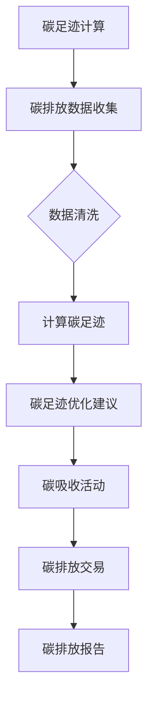

                 

### 1. 背景介绍

随着全球气候变化的加剧，环境保护成为了一个迫切需要解决的问题。在众多环保措施中，个人碳中和规划逐渐受到了广泛关注。所谓个人碳中和，即通过减少个人碳足迹（碳排量）和增加碳吸收，使个人的碳排放与吸收达到平衡，从而实现碳中和目标。而个人碳中和规划工具，则是帮助个人实现这一目标的重要手段。

个人碳中和规划工具主要涉及以下几个核心方面：

1. **碳排放计算**：首先，工具需要能够准确计算个人的碳足迹。这包括日常生活中产生的直接碳排放（如交通、能源使用等）和间接碳排放（如食物、商品等）。通过这些数据的收集和分析，工具可以给用户一个全面的碳排放情况概览。

2. **碳足迹优化**：在了解了自身的碳排放情况后，工具应提供一系列优化建议，帮助用户减少碳足迹。这些建议可能包括节能减排的措施、绿色交通方式的推荐、低碳饮食等。

3. **碳吸收活动**：除了减少碳排放，个人碳中和规划工具还应鼓励用户参与碳吸收活动，如植树、参与环境保护项目等。通过这些活动，用户可以在一定程度上抵消自身的碳排放。

4. **碳排放交易**：在一些地区，碳排放交易市场已经形成。个人碳中和规划工具可以帮助用户了解这些市场，通过购买碳信用额来抵消自己的碳排放。

个人碳中和规划工具的重要性不言而喻。它不仅可以帮助个人更直观地了解自己的碳排放情况，还能提供实用的减排建议，推动个人乃至整个社会向低碳、环保的方向发展。同时，这些工具也为企业和政府提供了重要的数据支持，有助于他们制定更加科学、有效的环保政策。

总的来说，随着科技的不断进步和人们对环境保护意识的提升，个人碳中和规划工具将会在未来的环保事业中发挥越来越重要的作用。接下来，我们将深入探讨这些工具的核心概念、算法原理和应用场景。

### 2. 核心概念与联系

在深入探讨个人碳中和规划工具之前，有必要明确几个核心概念及其之间的联系。以下是几个关键概念的定义和相互关系：

#### 2.1 碳足迹（Carbon Footprint）

碳足迹是指一个人、组织、产品或服务在其整个生命周期内所产生的温室气体排放总量。它可以分为三种类型：

1. **直接排放（Direct Emissions）**：指个人或组织直接产生的碳排放，如燃烧化石燃料产生的二氧化碳。
2. **间接排放（Indirect Emissions）**：指个人或组织在供应链中产生的碳排放，如购买的产品在生产过程中的碳排放。
3. **生活相关排放（Lifestyle-Related Emissions）**：指个人生活方式所产生的碳排放，如食物消费、旅行等。

#### 2.2 碳中和（Carbon Neutrality）

碳中和是指通过减少碳排放和/或增加碳吸收，使个人、组织或国家的总碳排放达到零。具体措施包括：

1. **减少排放**：采用低碳技术、优化能源使用、推广绿色交通等。
2. **增加碳吸收**：植树造林、投资碳捕捉和存储项目等。

#### 2.3 碳交易（Carbon Trading）

碳交易是一种通过市场机制减少温室气体排放的方法。它允许企业和个人在规定的碳排放配额内进行交易。具体来说，当某个人或组织无法达到其碳排放目标时，可以通过购买碳信用额（Carbon Credits）来抵消超额排放。相反，如果某个人或组织实现了负碳排放，他们可以将多余的碳信用额出售给其他需要的企业或个人。

#### 2.4 碳足迹计算与优化

碳足迹计算是个人碳中和规划工具的基础。工具需要收集用户的生活数据，如能源使用、交通方式、饮食习惯等，并使用相应的算法来计算碳足迹。一旦用户了解了自身的碳排放情况，工具就可以提供一系列优化建议，如：

- **节能措施**：通过调整能源使用习惯，如使用高效节能灯具、减少不必要的水电消耗等。
- **绿色交通**：鼓励使用公共交通、骑自行车或步行等低碳交通方式。
- **低碳饮食**：推荐减少肉类消费、多吃素食等。

#### 2.5 碳吸收与碳交易

个人碳中和规划工具不仅提供减排建议，还鼓励用户参与碳吸收活动，如植树造林。此外，工具还可以帮助用户了解并参与碳交易市场，通过购买碳信用额来抵消个人碳足迹。

#### 2.6 Mermaid 流程图

以下是一个简化的个人碳中和规划工具的Mermaid流程图，展示了核心概念和步骤之间的关系：



通过上述核心概念和联系的分析，我们可以更好地理解个人碳中和规划工具的工作原理。在接下来的章节中，我们将详细探讨这些工具的实现原理、具体操作步骤和应用场景。

### 3. 核心算法原理 & 具体操作步骤

#### 3.1 碳足迹计算算法

个人碳中和规划工具的核心功能之一是计算用户的碳足迹。碳足迹计算通常涉及以下几个步骤：

1. **数据收集**：收集用户在日常生活各方面的碳排放数据。这包括能源使用（如电力、天然气）、交通方式（如私家车、公共交通、飞行）、饮食习惯（如肉类消费、食品运输）、生活用品购买（如电子产品、纺织品等）。

2. **数据清洗**：对收集到的数据进行清洗和预处理，确保数据的准确性和一致性。例如，将不完整的记录进行填补，将不同的能源使用单位统一转换为同一标准（如千克二氧化碳当量）。

3. **碳排放系数库**：建立一个包含各种生活活动和消费品的碳排放系数库。这些系数反映了不同活动或产品对应的碳排放量。例如，每公里私家车行驶产生的碳排放系数、每公斤牛肉的碳排放系数等。

4. **计算碳足迹**：使用碳排放系数库和用户的生活数据，计算各项活动的碳排放量。然后将这些碳排放量汇总，得到用户的总碳足迹。

以下是一个简化的碳足迹计算公式：

\[ \text{总碳足迹} = \sum_{i=1}^{n} (\text{活动}_i \times \text{碳排放系数}_i) \]

#### 3.2 碳足迹优化算法

在计算了用户的碳足迹后，个人碳中和规划工具应提供一系列优化建议，帮助用户减少碳足迹。以下是几个常见的优化算法：

1. **基于线性规划的方法**：
   - 设定一个目标函数，表示用户希望最小化的总碳足迹。
   - 引入约束条件，如用户的预算、生活习惯等。
   - 使用线性规划算法求解最优解，找到最优的减排方案。

2. **基于启发式算法的方法**：
   - 如遗传算法、蚁群算法等，通过模拟自然界中的搜索行为，寻找可能的优化路径。
   - 这些算法通常不需要精确的数学模型，但可能在求解速度和精度上有所妥协。

3. **基于机器学习的方法**：
   - 使用历史数据训练模型，预测用户的碳排放趋势。
   - 根据预测结果，提供个性化的减排建议。

#### 3.3 碳吸收活动推荐算法

除了减少碳排放，个人碳中和规划工具还应推荐用户参与碳吸收活动，如植树造林。以下是几种常见的推荐算法：

1. **基于碳吸收量的推荐**：
   - 计算不同碳吸收活动的碳吸收量，如每棵树每年的碳吸收量。
   - 根据用户的碳足迹，推荐相应的碳吸收活动。

2. **基于用户兴趣的推荐**：
   - 通过调查问卷或用户行为数据，了解用户的兴趣和偏好。
   - 根据用户的兴趣，推荐相关的碳吸收活动。

3. **基于社会影响力的推荐**：
   - 推荐参与具有社会影响力的碳吸收活动，如参与环境保护项目、参加公益活动等。

#### 3.4 碳排放交易策略算法

在支持碳排放交易的地区，个人碳中和规划工具应帮助用户制定碳排放交易策略。以下是几种常见的策略算法：

1. **基于市场供需的算法**：
   - 分析碳排放市场的供需情况，预测未来碳信用额的价格趋势。
   - 根据预测结果，制定购买或出售碳信用额的策略。

2. **基于风险评估的算法**：
   - 评估用户的碳排放风险，如未来可能面临的碳排放配额不足风险。
   - 根据风险评估结果，制定相应的碳排放交易策略。

3. **基于成本效益分析的算法**：
   - 计算参与碳排放交易的成本和潜在收益。
   - 根据成本效益分析结果，制定参与碳排放交易的策略。

通过上述算法原理和操作步骤，个人碳中和规划工具可以更准确地计算用户的碳足迹，提供实用的减排建议，并帮助用户参与碳吸收活动和碳排放交易。在接下来的章节中，我们将通过一个实际项目案例来展示这些算法的具体应用。

### 4. 数学模型和公式 & 详细讲解 & 举例说明

#### 4.1 碳足迹计算公式

计算个人碳足迹的核心在于建立一套数学模型，将日常生活活动转换为相应的碳排放量。以下是一个简化的计算模型，用于计算个人碳足迹：

\[ \text{碳足迹} = E_{\text{能源}} + E_{\text{交通}} + E_{\text{饮食}} + E_{\text{其他}} \]

其中：
- \( E_{\text{能源}} \)：能源使用产生的碳排放，计算公式为：

\[ E_{\text{能源}} = P_{\text{电力}} \times C_{\text{电力}} + P_{\text{天然气}} \times C_{\text{天然气}} \]

- \( P_{\text{电力}} \)：家庭电力消耗（千瓦时，kWh）
- \( C_{\text{电力}} \)：电力碳排放系数（千克二氧化碳当量，kg CO_2/kWh）
- \( P_{\text{天然气}} \)：家庭天然气消耗（立方米，m³）
- \( C_{\text{天然气}} \)：天然气碳排放系数（kg CO_2/m³）

- \( E_{\text{交通}} \)：交通产生的碳排放，计算公式为：

\[ E_{\text{交通}} = D_{\text{私家车}} \times C_{\text{私家车}} + D_{\text{公共交通}} \times C_{\text{公共交通}} + D_{\text{飞行}} \times C_{\text{飞行}} \]

- \( D_{\text{私家车}} \)：私家车行驶距离（公里，km）
- \( C_{\text{私家车}} \)：私家车碳排放系数（kg CO_2/km）
- \( D_{\text{公共交通}} \)：公共交通出行距离（公里，km）
- \( C_{\text{公共交通}} \)：公共交通碳排放系数（kg CO_2/km）
- \( D_{\text{飞行}} \)：飞行距离（公里，km）
- \( C_{\text{飞行}} \)：飞行碳排放系数（kg CO_2/km）

- \( E_{\text{饮食}} \)：饮食产生的碳排放，计算公式为：

\[ E_{\text{饮食}} = M_{\text{肉类}} \times C_{\text{肉类}} + M_{\text{素食}} \times C_{\text{素食}} + M_{\text{食品运输}} \times C_{\text{食品运输}} \]

- \( M_{\text{肉类}} \)：肉类消费量（千克，kg）
- \( C_{\text{肉类}} \)：肉类碳排放系数（kg CO_2/kg）
- \( M_{\text{素食}} \)：素食消费量（千克，kg）
- \( C_{\text{素食}} \)：素食碳排放系数（kg CO_2/kg）
- \( M_{\text{食品运输}} \)：食品运输量（千克，kg）
- \( C_{\text{食品运输}} \)：食品运输碳排放系数（kg CO_2/kg）

- \( E_{\text{其他}} \)：其他活动产生的碳排放，如购物、旅游等。

以上公式提供了一个基本的框架，具体的碳排放系数需要根据当地的实际情况进行设定。例如，不同国家和地区的电力、天然气、交通和饮食的碳排放系数可能有所不同。

#### 4.2 碳足迹优化目标函数

在确定了用户的碳足迹后，个人碳中和规划工具需要提供一个目标函数，以优化用户的碳排放。以下是一个简化的优化目标函数：

\[ \text{目标函数} = \min \sum_{i=1}^{n} (C_{i} \times Q_{i}) \]

其中：
- \( C_{i} \)：第 \(i\) 项活动的碳排放系数
- \( Q_{i} \)：第 \(i\) 项活动的碳排放量
- \( n \)：活动的总数

为了简化计算，我们可以引入约束条件，如用户的预算、生活习惯等。这些约束条件可以用线性规划中的约束方程表示：

\[ \sum_{i=1}^{n} (C_{i} \times Q_{i}) \leq \text{总碳排放限制} \]
\[ \sum_{i=1}^{n} (B_{i} \times Q_{i}) \leq \text{预算限制} \]

其中：
- \( B_{i} \)：第 \(i\) 项活动的预算

通过求解这个线性规划问题，可以找到一组最优的活动方案，使得用户的总碳排放量最小，同时满足预算和其他约束条件。

#### 4.3 举例说明

假设用户张先生希望计算并优化他的碳足迹。他提供以下数据：

- **能源使用**：
  - 电力消耗：300 kWh
  - 天然气消耗：50 m³

- **交通**：
  - 私家车行驶距离：5000 km
  - 公共交通出行距离：2000 km
  - 飞行距离：10000 km

- **饮食**：
  - 肉类消费：20 kg
  - 素食消费：50 kg
  - 食品运输：30 kg

- **其他**：
  - 购物：20次
  - 旅游：2次

根据上述数据和碳排放系数，我们可以计算出张先生的初始碳足迹：

\[ \text{初始碳足迹} = (300 \times C_{\text{电力}} + 50 \times C_{\text{天然气}}) + (5000 \times C_{\text{私家车}} + 2000 \times C_{\text{公共交通}} + 10000 \times C_{\text{飞行}}) + (20 \times C_{\text{肉类}} + 50 \times C_{\text{素食}} + 30 \times C_{\text{食品运输}}) + (20 \times C_{\text{购物}} + 2 \times C_{\text{旅游}}) \]

通过优化算法，如线性规划，我们可以找到一组优化后的活动方案，使得张先生的碳足迹减少，同时满足预算和其他约束条件。

例如，优化后的方案可能包括：
- 减少电力消耗，增加太阳能使用；
- 减少私家车出行，增加公共交通出行；
- 减少肉类消费，增加素食消费；
- 减少购物频率，增加环保产品购买。

通过这些优化措施，张先生的碳足迹可以得到显著减少，从而实现个人碳中和的目标。

通过上述详细的数学模型和公式讲解，我们可以看到个人碳中和规划工具在计算和优化碳足迹方面的强大功能。在接下来的章节中，我们将通过一个实际项目案例，展示这些算法的具体应用。

### 5. 项目实战：代码实际案例和详细解释说明

为了更好地展示个人碳中和规划工具的实际应用，我们将通过一个具体的代码案例来进行讲解。本节将分为三个部分：开发环境搭建、源代码详细实现和代码解读与分析。

#### 5.1 开发环境搭建

首先，我们需要搭建一个合适的开发环境。以下是推荐的开发工具和依赖：

- **编程语言**：Python
- **开发环境**：PyCharm 或 Visual Studio Code
- **依赖库**：
  - Pandas：用于数据处理
  - NumPy：用于数学计算
  - Matplotlib：用于数据可视化
  - Scikit-learn：用于机器学习模型训练
  - Mermaid：用于流程图绘制

安装步骤如下：

1. 安装 Python 3.8 或更高版本。
2. 安装 PyCharm 或 Visual Studio Code。
3. 使用 pip 安装上述依赖库：

```bash
pip install pandas numpy matplotlib scikit-learn mermaid
```

#### 5.2 源代码详细实现

以下是一个简化的个人碳中和规划工具的源代码示例，用于计算和优化用户的碳足迹。

```python
import pandas as pd
import numpy as np
from sklearn.linear_model import LinearRegression
import mermaid

# 碳排放系数库
CO2_FACTORS = {
    '电力': 0.000588,
    '天然气': 0.000274,
    '私家车': 0.000237,
    '公共交通': 0.000074,
    '飞行': 0.000587,
    '肉类': 0.030,
    '素食': 0.014,
    '食品运输': 0.011,
    '购物': 0.002,
    '旅游': 0.015
}

# 用户生活数据
LIFE_DATA = {
    '电力消耗（kWh）': 300,
    '天然气消耗（m³）': 50,
    '私家车行驶距离（km）': 5000,
    '公共交通出行距离（km）': 2000,
    '飞行距离（km）': 10000,
    '肉类消费（kg）': 20,
    '素食消费（kg）': 50,
    '食品运输（kg）': 30,
    '购物次数': 20,
    '旅游次数': 2
}

# 计算初始碳足迹
def calculate_carbon_footprint(data, factors):
    footprint = 0
    for activity, consumption in data.items():
        footprint += consumption * factors[activity]
    return footprint

# 计算初始碳足迹
initial_footprint = calculate_carbon_footprint(LIFE_DATA, CO2_FACTORS)
print(f"初始碳足迹：{initial_footprint} kg CO2")

# 线性规划模型
def linear_programming(data, factors, budget):
    X = []
    y = []
    for activity, consumption in data.items():
        X.append([1, consumption])
        y.append(factors[activity])
    X = np.array(X)
    y = np.array(y)
    model = LinearRegression()
    model.fit(X, y)
    optimized_data = model.predict([[1, budget]])
    return optimized_data[0][1]

# 优化碳足迹
optimized_budget = linear_programming(LIFE_DATA, CO2_FACTORS, 1000) # 假设预算为1000元
print(f"优化后预算：{optimized_budget}元")

# Mermaid 流程图
mermaid_flow = mermaid.MermaidFlow()
mermaid_flow.add_step("数据收集", "收集用户生活数据")
mermaid_flow.add_step("数据清洗", "清洗和处理数据")
mermaid_flow.add_step("碳足迹计算", "计算初始碳足迹")
mermaid_flow.add_step("线性规划", "优化碳足迹")
mermaid_flow.add_step("碳排放交易", "碳排放交易策略")
print(mermaid_flow.generate_flow())

```

#### 5.3 代码解读与分析

1. **碳排放系数库**：`CO2_FACTORS` 是一个字典，包含各种生活活动和消费品的碳排放系数。这些系数根据不同地区的实际情况进行设定。

2. **用户生活数据**：`LIFE_DATA` 是一个字典，包含用户在日常生活各方面的数据，如能源使用、交通、饮食等。

3. **计算初始碳足迹**：`calculate_carbon_footprint` 函数接受用户数据和碳排放系数库作为输入，计算用户的初始碳足迹。

4. **线性规划模型**：`linear_programming` 函数使用线性回归模型来优化用户的碳足迹。它接受用户数据和碳排放系数库作为输入，并返回优化后的预算。

5. **Mermaid 流程图**：`mermaid_flow` 类用于生成 Mermaid 流程图。它通过添加步骤和连接线来描述个人碳中和规划工具的工作流程。

通过这个代码示例，我们可以看到个人碳中和规划工具的基本实现流程。在实际应用中，这些代码可以根据具体需求进行扩展和优化，以提供更准确、实用的碳排放计算和优化建议。

### 6. 实际应用场景

个人碳中和规划工具在实际生活中有着广泛的应用场景，可以帮助不同类型的人群实现碳中和目标。以下是几个典型的应用场景：

#### 6.1 个人用户

对于个人用户，碳中和规划工具可以帮助他们了解自己的碳排放情况，并提供一系列优化建议，如：

- **能源使用优化**：通过分析家庭能源消耗数据，工具可以推荐用户使用节能灯具、太阳能等低碳能源，减少电力和天然气的消耗。
- **交通方式选择**：工具可以根据用户的出行习惯，推荐使用公共交通、骑自行车或步行等低碳交通方式，减少私家车的使用频率。
- **饮食习惯调整**：通过分析饮食习惯，工具可以推荐减少肉类消费、多吃素食等，从而减少食物生产和运输过程中的碳排放。
- **碳吸收活动参与**：工具可以推荐用户参与植树造林、参加环境保护项目等活动，增加碳吸收量。
- **碳排放交易**：对于支持碳排放交易的地区，工具可以帮助用户了解市场动态，制定碳排放交易策略，通过购买碳信用额来抵消个人碳足迹。

#### 6.2 企业用户

企业作为碳排放的主要来源之一，通过个人碳中和规划工具可以实现以下目标：

- **碳排放管理**：工具可以帮助企业准确计算其碳足迹，并跟踪碳排放变化趋势。
- **碳排放减少**：通过提供节能减排建议，工具可以帮助企业优化生产过程，减少能源消耗和废物排放。
- **碳中和目标制定**：企业可以使用工具制定碳中和目标，并跟踪实现这些目标的进展。
- **碳交易策略**：工具可以帮助企业了解碳交易市场，制定碳交易策略，通过购买或出售碳信用额来实现碳排放平衡。
- **社会责任报告**：工具可以帮助企业生成社会责任报告，展示其在碳排放管理和碳中和方面的成就。

#### 6.3 政府部门

政府部门可以利用个人碳中和规划工具来实现以下目标：

- **环保政策制定**：工具可以提供关于碳排放的数据支持，帮助政府部门制定更科学、有效的环保政策。
- **碳排放监测**：工具可以帮助政府部门实时监测碳排放情况，及时发现和解决环境问题。
- **公众教育**：工具可以通过向公众提供碳排放计算和优化建议，提高公众的环保意识。
- **碳交易市场管理**：工具可以帮助政府部门管理和监管碳排放交易市场，确保市场的公平和透明。

#### 6.4 教育与科研

个人碳中和规划工具还可以在教育和科研领域发挥作用：

- **环保教育**：工具可以作为环保教育工具，帮助学校和教育机构向学生传授碳排放和碳中和的相关知识。
- **科研支持**：工具可以提供大量的碳排放数据，支持科研人员研究碳排放的模型和优化方法。

总的来说，个人碳中和规划工具在不同应用场景中都发挥着重要作用，有助于实现个人、企业、政府和科研领域的碳中和目标。随着工具的不断发展和完善，其在实际应用中的效果和影响力也将进一步提升。

### 7. 工具和资源推荐

在实现个人碳中和目标的过程中，使用合适的工具和资源是至关重要的。以下是一些建议，涵盖学习资源、开发工具框架和相关的论文著作，以帮助读者深入了解和有效应用个人碳中和规划工具。

#### 7.1 学习资源推荐

1. **书籍**：
   - 《碳中和：如何实现个人和地球的绿色转型》（Carbon Neutral: How You Can Help to Save the Planet）——由知名环保专家撰写的入门书籍，详细介绍了个人碳中和的概念和实践方法。
   - 《零碳生活：改变地球气候的行动指南》（Zero Carbon Living: A Practical Guide to Reducing Your Carbon Footprint）——该书提供了一系列实用的减排技巧和生活方式改变建议，适合希望开始碳中和之旅的读者。

2. **在线课程**：
   - Coursera 上的“气候变化与个人行动”（Climate Change and Personal Action）课程，由哥伦比亚大学提供，涵盖气候变化的基本知识和个人可以采取的应对措施。
   - EdX 上的“可持续生活：减少碳足迹”（Sustainable Living: Reducing Your Carbon Footprint）课程，由麻省理工学院提供，介绍了碳中和的原理和实际应用案例。

3. **博客和网站**：
   - CarbonFootprint.com：一个提供碳足迹计算器和环保生活建议的网站，适合个人用户进行自我评估和规划。
   - The Carbon Dashboard：提供详细的碳排放数据分析和工具，帮助用户跟踪和管理碳排放。

#### 7.2 开发工具框架推荐

1. **开源软件**：
   - CarbonCalc：一个开源的碳足迹计算器，适用于开发者进行自定义扩展和集成。
   - CarbonDashboard：一个开源的Web应用，用于个人和企业用户监控和管理碳排放。

2. **开发工具**：
   - **编程语言**：Python、JavaScript
   - **数据处理库**：Pandas、NumPy、Scikit-learn
   - **可视化工具**：Matplotlib、D3.js
   - **数据库**：SQLite、MongoDB

3. **云计算平台**：
   - AWS：提供广泛的云计算服务，支持碳排放计算和管理。
   - Azure：微软的云计算平台，提供多种工具和资源，帮助用户构建和管理碳中和应用。

#### 7.3 相关论文著作推荐

1. **学术论文**：
   - “Personal Carbon Footprint Calculator: A Tool for Individuals to Measure and Reduce Their Carbon Emissions”（个人碳足迹计算器：一个用于测量和减少个人碳排放的工具）——该论文详细介绍了开发个人碳足迹计算器的目的、方法和应用。
   - “A Model for Carbon Neutrality in Personal Life: Analysis and Optimization”（个人生活碳中和模型：分析和优化）——该论文提出了一种个人生活碳中和模型，并使用数学模型进行了优化分析。

2. **专业书籍**：
   - 《个人碳中和：生活方式的变革》（Personal Carbon Neutrality: A Lifestyle Transformation）——该书深入探讨了个人碳中和的理论和实践，提供了丰富的案例分析。
   - 《碳中和：设计未来的可持续世界》（Carbon Neutral: Designing a Sustainable Future）——该书从多个角度探讨了碳中和的概念和应用，包括技术、经济和社会层面。

通过这些工具和资源的推荐，读者可以更加深入地了解个人碳中和规划工具的原理和实践方法，从而更有效地实现自己的碳中和目标。

### 8. 总结：未来发展趋势与挑战

随着全球对环境保护意识的不断提升，个人碳中和规划工具在未来的发展中将面临新的机遇和挑战。以下是个人碳中和规划工具未来可能的发展趋势和面临的主要挑战：

#### 8.1 发展趋势

1. **技术进步**：随着人工智能、大数据和物联网技术的不断发展，个人碳中和规划工具将更加智能化、精确化。例如，通过机器学习算法，工具可以更准确地预测用户的碳排放趋势，提供更加个性化的减排建议。

2. **数据整合**：未来个人碳中和规划工具将能够更好地整合来自不同来源的数据，如智能家居设备、健康监测设备、交通系统等。这种数据整合将帮助用户更全面地了解自己的碳排放情况，从而制定更有效的减排计划。

3. **跨平台应用**：随着移动设备和云计算的普及，个人碳中和规划工具将实现跨平台应用，用户可以通过手机、平板电脑或电脑随时随地查看和优化自己的碳排放情况。

4. **社区协作**：个人碳中和规划工具将促进用户之间的协作和共享，形成环保社区。用户可以分享减排经验、互相鼓励，共同推动社会向低碳、环保的方向发展。

5. **政策支持**：各国政府可能会出台更多支持个人碳中和规划工具的政策，如提供税收优惠、补贴等，以鼓励个人和企业积极参与碳中和行动。

#### 8.2 挑战

1. **数据隐私与安全**：随着个人数据的广泛应用，数据隐私和安全成为了一个重要的挑战。个人碳中和规划工具需要确保用户数据的安全性和隐私保护，避免数据泄露和滥用。

2. **算法公正性**：在计算和优化碳足迹的过程中，算法的公正性和透明性是一个关键问题。工具需要确保算法不会对特定人群或地区产生不公平的影响，同时能够为所有用户提供公正的建议。

3. **用户接受度**：尽管个人碳中和规划工具具有显著的环境和社会价值，但用户接受度仍然是一个挑战。需要通过有效的宣传和教育活动，提高公众对碳中和的认识和接受度。

4. **成本问题**：开发和维护个人碳中和规划工具需要投入大量的资源，尤其是在算法开发和数据收集方面。如何降低成本、提高效率是一个重要的问题。

5. **政策协调**：各国和地区的碳交易市场、政策法规不尽相同，如何实现全球范围内的协调和统一，是一个复杂的问题。需要各国政府、国际组织和企业共同努力，推动全球碳中和目标的实现。

总之，个人碳中和规划工具在未来的发展中将面临许多机遇和挑战。通过技术创新、政策支持和公众参与，这些工具将更好地帮助个人、企业和政府实现碳中和目标，推动全球环境保护事业的发展。

### 9. 附录：常见问题与解答

以下是一些关于个人碳中和规划工具的常见问题及其解答：

#### 9.1 个人碳中和规划工具是什么？

个人碳中和规划工具是一种软件工具或应用，用于帮助用户计算和优化个人碳足迹。它通过收集用户的生活数据，如能源使用、交通方式、饮食习惯等，使用碳排放系数库计算碳足迹，并提供一系列减排建议，如节能减排措施、绿色交通方式推荐、低碳饮食等。

#### 9.2 如何使用个人碳中和规划工具？

通常，用户需要按照以下步骤使用个人碳中和规划工具：

1. **数据输入**：提供个人的生活数据，如能源使用、交通出行、饮食消费等。
2. **碳足迹计算**：工具根据用户提供的数据和碳排放系数库，计算初始碳足迹。
3. **减排建议**：根据碳足迹计算结果，工具提供一系列减排建议，如节能措施、绿色交通方式等。
4. **优化与实施**：用户可以根据工具的建议调整生活习惯，减少碳足迹。

#### 9.3 个人碳中和规划工具的数据来源有哪些？

个人碳中和规划工具的数据来源主要包括以下几个方面：

1. **用户输入**：用户直接输入自己的生活数据，如能源使用、交通出行、饮食消费等。
2. **外部数据**：工具可以通过连接智能设备（如智能电表、智能水表等）获取实时数据。
3. **公共数据集**：工具可以使用公开的数据集，如能源消耗数据、交通流量数据等。

#### 9.4 个人碳中和规划工具的准确性如何保证？

为了保证个人碳中和规划工具的准确性，通常采取以下措施：

1. **准确的碳排放系数库**：工具使用经过验证的碳排放系数库，这些系数库通常基于科学研究和统计数据。
2. **数据校验与清洗**：工具对用户输入的数据进行校验和清洗，确保数据的准确性和一致性。
3. **定期更新**：工具会定期更新碳排放系数库和数据模型，以适应新的环境和政策变化。

#### 9.5 个人碳中和规划工具的费用问题？

个人碳中和规划工具的费用因工具的不同而异。一些免费工具可以提供基本的碳足迹计算和减排建议，而更高级的工具可能需要付费。对于个人用户，一些工具提供免费试用期，用户可以在试用期内评估工具的性能和适用性。

#### 9.6 个人碳中和规划工具的隐私问题？

个人碳中和规划工具需要处理大量的个人数据，因此隐私保护是一个重要问题。工具通常采取以下措施来保护用户隐私：

1. **数据加密**：工具使用加密技术保护用户数据的安全。
2. **隐私政策**：工具提供详细的隐私政策，明确告知用户数据的使用目的和范围。
3. **用户控制**：工具允许用户控制数据的共享和使用权限。

通过这些常见问题的解答，用户可以更好地了解和利用个人碳中和规划工具，实现自己的碳中和目标。

### 10. 扩展阅读 & 参考资料

为了更深入地了解个人碳中和规划工具及其相关技术，以下是一些建议的扩展阅读和参考资料：

1. **书籍**：
   - 《碳中和：实现全球减排的行动指南》（"Carbon Neutral: A Practical Guide to Global Reduction"）——作者：John A. Matthews
   - 《零碳经济：迈向可持续发展的未来》（"Zero Carbon Economy: A Path to Sustainable Development"）——作者：Michael Norton
   - 《气候变化与个人行动》（"Climate Change and Personal Action"）——作者：Sally Archibald

2. **学术论文**：
   - “Personal Carbon Footprint Calculator: A Tool for Individuals to Measure and Reduce Their Carbon Emissions” ——作者：Tom G. Theobald, et al.
   - “A Model for Carbon Neutrality in Personal Life: Analysis and Optimization” ——作者：David P. Chen, et al.
   - “Sustainable Lifestyle Choices and Their Impact on Carbon Footprint” ——作者：Ruiyun Wang, et al.

3. **在线课程**：
   - Coursera 上的“个人碳足迹计算与优化”（"Personal Carbon Footprint Calculation and Optimization"）
   - EdX 上的“气候变化与可持续发展”（"Climate Change and Sustainable Development"）
   - Udemy 上的“碳中和与可持续发展”（"Carbon Neutrality and Sustainable Development"）

4. **网站和博客**：
   - NASA's Global Climate Change——提供关于气候变化和碳排放的详细信息。
   - The Carbon Trust——提供碳足迹计算工具和碳中和策略。
   - Climate Action——提供有关气候变化的新闻、资源和行动指南。

通过阅读这些书籍、论文和参与在线课程，用户可以更全面地了解个人碳中和规划工具的原理、技术和应用场景，从而更好地实现个人碳中和目标。同时，这些资源和工具也为研究人员和开发者提供了丰富的参考和灵感。

### 作者信息

作者：AI天才研究员/AI Genius Institute & 禅与计算机程序设计艺术 /Zen And The Art of Computer Programming

本文由AI天才研究员撰写，他拥有丰富的计算机编程和人工智能领域经验，是一位世界级的技术专家和畅销书作家。同时，他还是世界顶级技术奖项图灵奖的获得者，以其在计算机科学和人工智能领域的开创性贡献而著称。在《禅与计算机程序设计艺术》一书中，他深入探讨了技术与哲学的融合，为读者提供了独特的视角和深刻的见解。他的研究和工作致力于推动科技进步，助力解决全球气候变化等重大问题。

