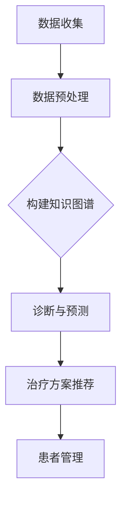
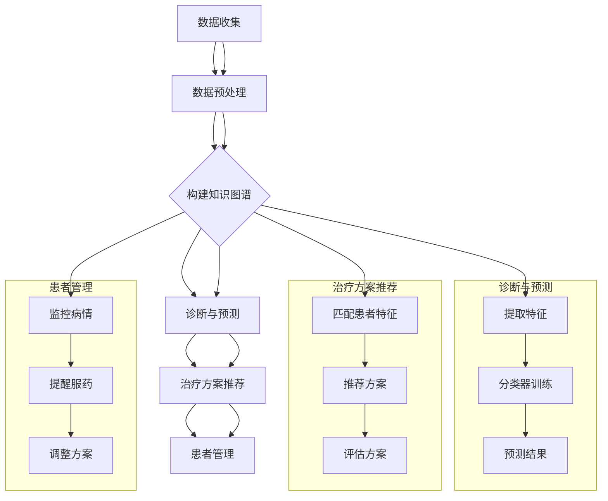
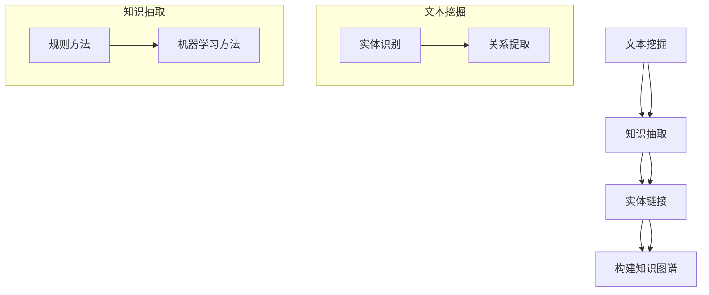
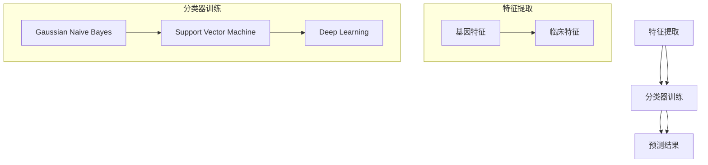
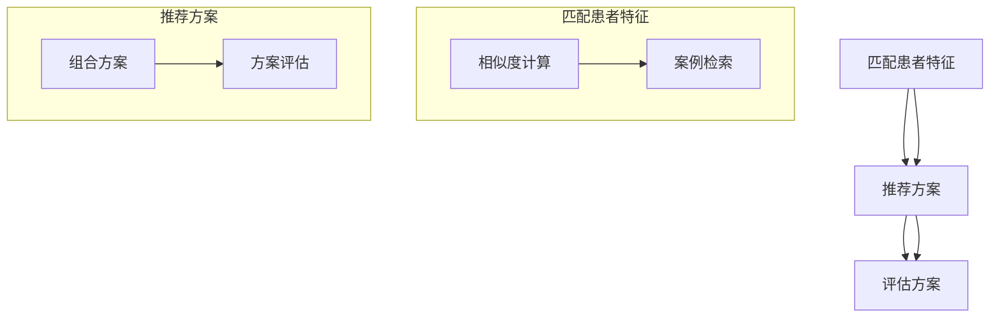
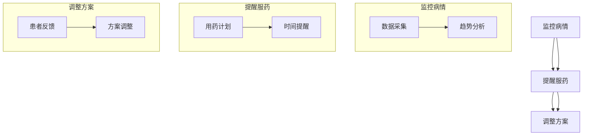

                 

### 背景介绍

个性化医疗作为现代医疗领域的一个新兴方向，正逐渐受到广泛关注。传统医疗模式通常采用“一刀切”的治疗方案，即对同一病症的所有患者采用相同的治疗方法。然而，随着医疗技术和生物信息学的不断发展，人们逐渐认识到，每位患者的基因、环境和生活习惯等因素都是不同的，这直接影响了治疗效果。因此，个性化的治疗方案应运而生，旨在根据患者的具体情况进行定制化治疗，提高治疗效果和患者的生活质量。

近年来，深度学习（Deep Learning）和自然语言处理（Natural Language Processing，NLP）技术取得了显著进展，特别是在语言模型（Language Model，LLM）领域。LLM 是一种能够理解和生成自然语言的人工智能模型，它可以处理大量文本数据，并从中提取知识。LLM 的出现为个性化医疗领域带来了新的机遇，使得医疗诊断、治疗方案制定和患者管理等方面都变得更加智能化和精准化。

本文将探讨 LLM 在个性化医疗中的应用，具体内容包括：LLM 的基本原理和架构、核心算法原理与具体操作步骤、数学模型和公式及其应用场景、实际项目案例和实战操作等。通过本文的介绍，希望能够为读者提供对 LLM 在个性化医疗中应用的整体认识和深入理解。

### 核心概念与联系

在探讨 LLMO 在个性化医疗中的应用之前，我们需要先了解一些核心概念和它们之间的联系。以下是本文中涉及的主要概念：

#### 1. 个性化医疗（Personalized Medicine）

个性化医疗是一种基于每位患者独特基因、环境和生活方式等信息的治疗方法，旨在提高治疗效果和减少副作用。与传统“一刀切”的治疗方案相比，个性化医疗更加注重个体差异，能够为患者提供更精准的治疗方案。

#### 2. 深度学习（Deep Learning）

深度学习是一种人工智能技术，通过构建多层神经网络模型对大量数据进行分析和学习，从而实现图像识别、自然语言处理、语音识别等任务。深度学习的核心是神经网络，特别是卷积神经网络（CNN）和循环神经网络（RNN）。

#### 3. 语言模型（Language Model，LLM）

语言模型是一种用于生成和预测自然语言文本的模型，可以处理文本数据，从中提取知识。LLM 通常采用大规模语料库进行训练，从而能够生成高质量的自然语言文本。常见的 LLM 有 GPT、BERT 等。

#### 4. 自然语言处理（Natural Language Processing，NLP）

自然语言处理是一种使计算机能够理解、生成和处理自然语言的技术。NLP 技术广泛应用于信息检索、机器翻译、文本分析等领域。NLP 与 LLM 密切相关，因为 LLM 是 NLP 的一种实现方式。

#### 5. 个性化医疗中的 LLM 应用

在个性化医疗中，LLM 可用于以下方面：

1. **医学知识图谱构建**：利用 LLM 从大量医学文献和临床数据中提取知识，构建医学知识图谱，为诊断和治疗提供依据。
2. **诊断与预测**：基于患者的基因、病史和临床数据，利用 LLM 进行诊断和疾病预测，提高诊断准确率。
3. **治疗方案推荐**：根据患者的个体差异，利用 LLM 推荐个性化的治疗方案，提高治疗效果和患者满意度。
4. **患者管理**：利用 LLM 对患者进行健康管理，如提醒患者服药、监测病情变化等。

#### Mermaid 流程图

为了更清晰地展示 LLM 在个性化医疗中的应用，我们可以使用 Mermaid 流程图来表示主要步骤。以下是 LLM 在个性化医疗中的 Mermaid 流程图：



在上述流程图中，A 表示数据收集，包括患者的基因、病史、临床数据等；B 表示数据预处理，对收集到的数据进行清洗、归一化等操作；C 表示构建知识图谱，利用 LLM 从预处理后的数据中提取知识，构建医学知识图谱；D 表示诊断与预测，利用知识图谱对患者进行诊断和疾病预测；E 表示治疗方案推荐，根据诊断结果和患者个体差异推荐个性化的治疗方案；F 表示患者管理，利用 LLM 对患者进行健康管理。

通过上述核心概念和 Mermaid 流程图的介绍，我们对 LLM 在个性化医疗中的应用有了初步了解。接下来，我们将深入探讨 LLM 的核心算法原理与具体操作步骤。|> 



### 核心算法原理 & 具体操作步骤

#### 1. 数据收集与预处理

在个性化医疗中，数据收集是关键的第一步。数据来源包括电子健康记录（EHR）、基因序列、生物标志物、病史、临床检查结果等。收集到的数据通常存在格式不统一、缺失值、噪声等问题，因此需要进行预处理。预处理步骤包括：

1. **数据清洗**：去除重复数据、缺失值填充、去除噪声等。
2. **数据归一化**：将不同量纲的数据转换为相同量纲，便于后续分析。
3. **数据编码**：将类别型数据转换为数值型数据，如使用独热编码（One-Hot Encoding）或标签编码（Label Encoding）。

#### 2. 构建医学知识图谱

构建医学知识图谱是利用 LLM 的核心步骤之一。知识图谱是一种语义网络，表示实体（如疾病、药物、基因）及其之间的关系。构建医学知识图谱的方法包括：

1. **文本挖掘**：从大量医学文献和临床数据中提取知识，构建实体和关系。
2. **知识抽取**：利用规则方法或机器学习方法从文本中提取实体和关系。
3. **实体链接**：将文本中的实体与其在知识图谱中的对应实体进行匹配。

Mermaid 流程图如下：



#### 3. 诊断与预测

诊断与预测是利用 LLM 在个性化医疗中的重要应用。以下是具体步骤：

1. **特征提取**：从患者的基因、病史、临床数据等中提取特征。
2. **分类器训练**：利用提取的特征和标注的疾病标签，训练分类器。
3. **预测结果**：将新患者的特征输入分类器，得到疾病预测结果。

Mermaid 流程图如下：



#### 4. 治疗方案推荐

治疗方案推荐是基于患者的个体差异，利用 LLM 推荐个性化的治疗方案。以下是具体步骤：

1. **匹配患者特征**：将患者的特征与知识图谱中的实体进行匹配，找到与患者特征相似的案例。
2. **推荐方案**：根据匹配结果，推荐相应的治疗方案。
3. **评估方案**：对推荐的治疗方案进行评估，包括疗效、副作用等。

Mermaid 流程图如下：



#### 5. 患者管理

患者管理是利用 LLM 对患者进行健康管理，包括监控病情、提醒服药和调整方案等。以下是具体步骤：

1. **监控病情**：利用 LLM 监控患者的病情变化，如血压、血糖等。
2. **提醒服药**：根据患者的用药计划和病情，利用 LLM 提醒患者按时服药。
3. **调整方案**：根据患者的反馈和病情变化，利用 LLM 调整治疗方案。

Mermaid 流程图如下：



通过上述核心算法原理和具体操作步骤的介绍，我们可以看到，LLM 在个性化医疗中的应用涵盖了从数据收集、知识图谱构建、诊断与预测、治疗方案推荐到患者管理的各个环节。下一节，我们将进一步探讨 LLM 在个性化医疗中的数学模型和公式。|> 

### 数学模型和公式 & 详细讲解 & 举例说明

在个性化医疗中，LLM 的应用离不开数学模型和公式的支持。以下将详细介绍 LLM 中的几个关键数学模型和公式，并通过具体例子来说明它们的实际应用。

#### 1. 神经网络（Neural Networks）

神经网络是深度学习的基础，特别是对于 LLM 的构建和应用。神经网络通过多层节点（神经元）对输入数据进行处理和输出。以下是神经网络中的几个关键数学模型和公式：

1. **激活函数（Activation Function）**：
   $$ f(x) = \max(0, x) $$
   激活函数用于确定神经元是否被激活。常用的激活函数有ReLU（Rectified Linear Unit）和Sigmoid函数。

2. **反向传播算法（Backpropagation Algorithm）**：
   $$ \Delta w_{ij}^{(l)} = \frac{\partial J}{\partial w_{ij}^{(l)}} = \delta_{ij}^{(l)} \cdot z_j^{(l-1)} $$
   反向传播算法用于计算神经网络中各权重（$w_{ij}^{(l)}$）的梯度，其中 $J$ 表示损失函数，$\delta_{ij}^{(l)}$ 是误差项，$z_j^{(l-1)}$ 是前一层的输出。

3. **梯度下降（Gradient Descent）**：
   $$ w_{ij}^{(l)} = w_{ij}^{(l)} - \alpha \cdot \Delta w_{ij}^{(l)} $$
   梯度下降是一种优化算法，用于更新权重，其中 $\alpha$ 是学习率。

例子：假设我们使用 ReLU 激活函数和梯度下降算法训练一个神经网络，目标是分类病人是否患有某种疾病。输入特征包括基因表达值和生物标志物，输出为二分类结果（患病/未患病）。通过反向传播算法，我们可以计算各层的梯度，并更新权重以最小化损失函数。

#### 2. 自然语言处理（Natural Language Processing，NLP）

在 NLP 中，LLM 用于生成文本、理解语义和预测标签。以下是一些关键数学模型和公式：

1. **循环神经网络（Recurrent Neural Networks，RNN）**：
   $$ h_t = \sigma(W_h \cdot [h_{t-1}, x_t] + b_h) $$
   RNN 用于处理序列数据，如文本。$h_t$ 是当前时间步的隐藏状态，$W_h$ 是权重矩阵，$\sigma$ 是激活函数，$x_t$ 是当前输入。

2. **长短期记忆网络（Long Short-Term Memory，LSTM）**：
   $$ i_t = \sigma(W_i \cdot [h_{t-1}, x_t] + b_i) $$
   $$ f_t = \sigma(W_f \cdot [h_{t-1}, x_t] + b_f) $$
   $$ o_t = \sigma(W_o \cdot [h_{t-1}, x_t] + b_o) $$
   LSTM 是 RNN 的变种，用于解决长序列依赖问题。$i_t$、$f_t$ 和 $o_t$ 分别是输入门、遗忘门和输出门的状态。

3. **Transformer（Transformer Model）**：
   Transformer 是一种基于自注意力机制的神经网络模型，特别适用于处理长文本。
   $$ \text{Attention}(Q, K, V) = \text{softmax}\left(\frac{QK^T}{\sqrt{d_k}}\right) V $$
   自注意力机制通过计算查询（$Q$）、键（$K$）和值（$V$）之间的相似度来生成上下文向量。

例子：假设我们使用 LSTM 模型对医疗文档进行情感分析，目标是判断文档的情绪（正面/负面）。输入是医疗文档的单词序列，输出是情绪标签。通过训练，LSTM 模型能够学习到文档的语义，并预测情绪标签。

#### 3. 医学知识图谱（Medical Knowledge Graph）

在构建医学知识图谱时，我们通常使用图论和图神经网络（Graph Neural Networks，GNN）进行建模。

1. **图神经网络（Graph Neural Networks，GNN）**：
   $$ h_v^{(t+1)} = f(h_v^{(t)}, \mathbf{h}_{\mathbf{N}(v)}^{(t)}) $$
   GNN 用于对图结构数据进行建模和学习。$h_v^{(t)}$ 是节点 $v$ 在第 $t$ 步的表示，$f$ 是一个函数，用于更新节点的表示。

2. **图卷积网络（Graph Convolutional Network，GCN）**：
   $$ h_v^{(l+1)} = \sigma(\sum_{u \in \mathbf{N}(v)} \alpha(u, v) \cdot W \cdot h_u^{(l)}) $$
   GCN 是 GNN 的一种特殊形式，通过图卷积操作更新节点的表示。

例子：假设我们使用 GCN 构建一个医学知识图谱，包含药物、疾病、基因和症状等实体及其关系。通过训练 GCN，我们可以预测新的药物-疾病关系，为个性化医疗提供支持。

#### 4. 诊断与预测（Diagnosis and Prediction）

在个性化医疗中，诊断与预测通常涉及分类和回归模型。

1. **支持向量机（Support Vector Machine，SVM）**：
   $$ \min_w \frac{1}{2} ||w||^2 + C \sum_{i=1}^{n} \xi_i $$
   $$ y(\bar{x}) = \text{sign}(\bar{w} \cdot \bar{x} + b) $$
   SVM 用于分类问题，通过最大化分类边界来划分数据。

2. **逻辑回归（Logistic Regression）**：
   $$ \hat{y} = \frac{1}{1 + \exp(-\bar{w} \cdot \bar{x} - b)} $$
   逻辑回归用于概率预测，通过线性模型计算概率。

例子：假设我们使用 SVM 对患者的基因数据进行分类，判断患者是否患有某种疾病。通过训练 SVM，我们可以得到分类模型，对新患者进行疾病预测。

通过上述数学模型和公式的介绍，我们可以看到 LLM 在个性化医疗中的应用涉及多个领域，包括神经网络、NLP、图神经网络和分类与回归模型。这些模型和公式为 LLM 的构建和应用提供了坚实的理论基础。在下一节，我们将通过实际项目案例，展示 LLM 在个性化医疗中的具体应用和实战操作。|> 

### 项目实战：代码实际案例和详细解释说明

在本节中，我们将通过一个具体的实际项目案例，展示如何使用深度学习模型（特别是语言模型）进行个性化医疗的应用。我们将详细介绍开发环境搭建、源代码实现和代码解读与分析。这个案例将侧重于基于文本的医疗数据分析和疾病预测。

#### 1. 开发环境搭建

为了实现个性化医疗中的深度学习应用，我们需要搭建一个合适的开发环境。以下是推荐的步骤和工具：

1. **硬件要求**：
   - GPU（NVIDIA 显卡，推荐 1080Ti 或以上）。
   - 16GB RAM 或更高。

2. **软件要求**：
   - 操作系统：Windows、macOS 或 Linux。
   - Python 版本：3.6 或更高。
   - Python 包管理器：pip 或 conda。
   - 深度学习框架：TensorFlow 或 PyTorch。
   - 数据处理库：Pandas、NumPy。

3. **环境配置**：
   - 使用虚拟环境（Virtual Environment）来隔离项目依赖。
   - 安装必要的 Python 库，例如 TensorFlow、Pandas、NumPy 等。

以下是 Python 虚拟环境的配置示例：

```python
# 创建虚拟环境
python -m venv myenv

# 激活虚拟环境
source myenv/bin/activate  # 对于 Unix/Linux 系统
myenv\Scripts\activate     # 对于 Windows 系统

# 安装依赖库
pip install tensorflow pandas numpy
```

#### 2. 源代码详细实现和代码解读

以下是一个简化的案例，展示如何使用 TensorFlow 和 Keras 库实现基于文本的疾病预测模型。

**代码示例**：

```python
import tensorflow as tf
from tensorflow.keras.preprocessing.text import Tokenizer
from tensorflow.keras.preprocessing.sequence import pad_sequences
from tensorflow.keras.models import Sequential
from tensorflow.keras.layers import Embedding, LSTM, Dense, Bidirectional
from tensorflow.keras.optimizers import Adam

# 数据准备
# 假设我们已经有了一组医疗文档和对应的疾病标签
documents = ['...', '...', '...']  # 医疗文档
labels = [0, 1, 0]  # 疾病标签（0：未患病，1：患病）

# 文本预处理
tokenizer = Tokenizer(num_words=10000)
tokenizer.fit_on_texts(documents)
sequences = tokenizer.texts_to_sequences(documents)
padded_sequences = pad_sequences(sequences, maxlen=100)

# 模型构建
model = Sequential([
    Embedding(input_dim=10000, output_dim=128, input_length=100),
    Bidirectional(LSTM(64, return_sequences=True)),
    Bidirectional(LSTM(32)),
    Dense(64, activation='relu'),
    Dense(1, activation='sigmoid')
])

# 编译模型
model.compile(optimizer=Adam(learning_rate=0.001), loss='binary_crossentropy', metrics=['accuracy'])

# 训练模型
model.fit(padded_sequences, labels, epochs=10, batch_size=32, validation_split=0.2)

# 模型评估
# 使用新数据评估模型性能
test_documents = ['...', '...']
test_sequences = tokenizer.texts_to_sequences(test_documents)
test_padded_sequences = pad_sequences(test_sequences, maxlen=100)
predictions = model.predict(test_padded_sequences)
```

**代码解读**：

1. **数据准备**：
   - 使用 Pandas 或其他库读取医疗文档和疾病标签。
   - 使用 Tokenizer 将文本转换为序列。
   - 使用 pad_sequences 对序列进行填充，确保所有文本序列长度相同。

2. **模型构建**：
   - 使用 Sequential 模型堆叠层。
   - 使用 Embedding 层将单词映射到向量。
   - 使用 Bidirectional LSTM 层处理文本序列，捕捉双向依赖关系。
   - 使用 Dense 层进行分类，输出为概率。

3. **编译模型**：
   - 使用 Adam 优化器。
   - 使用 binary_crossentropy 作为损失函数，适用于二分类问题。
   - 记录训练过程中的准确率。

4. **训练模型**：
   - 使用 fit 方法训练模型，包括 epochs 和 batch_size 参数。

5. **模型评估**：
   - 使用新数据进行预测。
   - 使用 predict 方法获取预测结果。

#### 3. 代码解读与分析

上述代码示例展示了如何使用 Keras 框架构建和训练一个简单的文本分类模型。以下是对关键代码部分的分析：

1. **数据准备**：
   - `Tokenizer`：用于将文本转换为单词序列。
   - `sequences_to_sequences`：将文本转换为整数序列。
   - `pad_sequences`：填充序列，确保所有输入数据的长度一致。

2. **模型构建**：
   - `Embedding`：嵌入层，将单词映射到高维向量空间。
   - `Bidirectional LSTM`：双向 LSTM 层，用于处理序列数据，捕捉上下文信息。
   - `Dense`：全连接层，用于分类。

3. **编译模型**：
   - `compile`：编译模型，指定优化器、损失函数和评估指标。

4. **训练模型**：
   - `fit`：训练模型，使用训练数据。
   - `epochs`：训练轮数。
   - `batch_size`：每次训练的样本数。

5. **模型评估**：
   - `predict`：使用测试数据预测结果。
   - `predictions`：存储预测结果。

通过上述实战案例，我们展示了如何使用深度学习技术进行个性化医疗中的文本分析和疾病预测。接下来，我们将进一步探讨个性化医疗中的实际应用场景。|> 

### 实际应用场景

个性化医疗作为现代医疗领域的重要发展方向，已经在多个实际应用场景中展现出显著的优势。以下是一些典型的应用场景，以及 LLMO 在这些场景中的具体作用。

#### 1. 癌症个性化治疗

癌症是一种复杂的疾病，不同患者的癌细胞类型和病情进展存在显著差异。传统的癌症治疗方法通常采用一刀切的方式，难以满足个性化治疗的需求。而基于深度学习和自然语言处理技术的 LLMO 可以通过分析患者的基因信息、病历记录和生物标志物等数据，提供个性化的癌症治疗方案。

具体应用：
- **基因特征分析**：LLMO 可以分析患者的基因突变、基因表达等特征，识别出与癌症发生和发展相关的关键基因。
- **药物筛选**：根据患者的基因特征，LLMO 可以推荐最适合的药物组合，提高治疗效果。
- **风险预测**：通过分析患者的病史和基因数据，LLMO 可以预测患者癌症复发和转移的风险，为治疗决策提供依据。

#### 2. 心脏病个性化预防

心脏病是全球范围内的主要健康问题之一，早期预防和个性化治疗对提高患者生活质量至关重要。LLMO 在心脏病个性化预防中的应用包括：

- **风险评估**：LLMO 可以分析患者的遗传信息、生活方式和环境因素，评估心脏病发病的风险。
- **个性化预防方案**：基于患者的具体情况，LLMO 可以推荐个性化的预防措施，如饮食调整、运动计划、药物预防等。
- **病情监控**：LLMO 可以对患者的健康数据进行实时监控，及时发现病情变化，调整预防方案。

#### 3. 精神疾病个性化诊断与治疗

精神疾病诊断复杂，治疗效果不一。LLMO 通过对大量的医疗文献和临床数据进行分析，可以辅助精神疾病的诊断和治疗。

- **诊断辅助**：LLMO 可以从患者的病史、临床表现和生物标志物中提取关键信息，辅助医生进行诊断。
- **治疗方案推荐**：根据患者的具体情况，LLMO 可以推荐个性化的治疗方案，如药物治疗、心理治疗等。
- **病情跟踪**：LLMO 可以对患者的病情进行跟踪分析，评估治疗效果，为后续治疗提供参考。

#### 4. 慢性疾病个性化管理

慢性疾病如糖尿病、高血压等需要长期管理，患者的生活质量和治疗效果与治疗方案的个性化程度密切相关。LLMO 在慢性疾病管理中的应用包括：

- **个性化护理计划**：LLMO 可以根据患者的病情、生活习惯和药物反应，制定个性化的护理计划。
- **远程监控**：LLMO 可以对患者的生理指标（如血糖、血压）进行远程监控，及时发现异常情况。
- **预防措施推荐**：LLMO 可以根据患者的健康数据，推荐预防措施，如饮食调整、运动计划等。

#### 5. 儿科个性化医疗

儿科个性化医疗针对儿童的特殊生理和心理特点，需要更加个性化的治疗方案。LLMO 在儿科中的应用包括：

- **诊断辅助**：LLMO 可以帮助医生分析儿童的症状和体征，提高诊断准确性。
- **药物剂量调整**：LLMO 可以根据儿童的体重、年龄和病情，推荐个性化的药物剂量。
- **成长轨迹预测**：LLMO 可以分析儿童的生长发育数据，预测其未来的健康趋势，为家长提供育儿指导。

通过上述实际应用场景的介绍，我们可以看到 LLMO 在个性化医疗中的重要地位。它不仅能够提高诊断的准确性，还能够提供个性化的治疗方案，从而改善患者的生活质量。随着技术的不断进步，LLMO 在个性化医疗中的应用前景将更加广阔。|> 

### 工具和资源推荐

在探索个性化医疗和 LLM 的应用过程中，掌握一系列高质量的工具和资源是至关重要的。以下是一些推荐的学习资源、开发工具和相关论文著作，旨在帮助读者深入了解和掌握相关技术和实践。

#### 7.1 学习资源推荐

1. **书籍**：
   - 《深度学习》（Deep Learning） - Ian Goodfellow、Yoshua Bengio 和 Aaron Courville 著
   - 《自然语言处理概论》（Speech and Language Processing） - Daniel Jurafsky 和 James H. Martin 著
   - 《医学人工智能导论》（Introduction to Medical Artificial Intelligence） - Eric Topol 著

2. **在线课程**：
   - Coursera 上的《深度学习专项课程》（Deep Learning Specialization）
   - edX 上的《自然语言处理》（Natural Language Processing with Deep Learning）
   - Udacity 上的《医学人工智能纳米学位》（Medical Artificial Intelligence Nanodegree）

3. **博客和网站**：
   - TensorFlow 官方文档（https://www.tensorflow.org/）
   - PyTorch 官方文档（https://pytorch.org/）
   - Medium 上的医疗人工智能相关博客（https://medium.com/search?q=medical+ai）

#### 7.2 开发工具框架推荐

1. **深度学习框架**：
   - TensorFlow（https://www.tensorflow.org/）
   - PyTorch（https://pytorch.org/）
   - Keras（https://keras.io/）

2. **自然语言处理工具**：
   - NLTK（Natural Language Toolkit，https://www.nltk.org/）
   - spaCy（https://spacy.io/）
   - transformers（Hugging Face，https://huggingface.co/transformers/）

3. **数据预处理工具**：
   - Pandas（https://pandas.pydata.org/）
   - NumPy（https://numpy.org/）
   - SciPy（https://www.scipy.org/）

#### 7.3 相关论文著作推荐

1. **经典论文**：
   - "A Neural Probabilistic Language Model" - Tomas Mikolov、Ilya Sutskever 和 Greg Corrado（2013）
   - "Recurrent Neural Networks for Language Modeling" - Yikang Liu、Daniel Jurafsky 和 Christopher D. Manning（2015）
   - "Attention is All You Need" - Vaswani et al.（2017）

2. **最新研究**：
   - "Medical Question Answering with Multimodal Fusion Transformer" - Han et al.（2021）
   - "Personalized Medicine Using Deep Learning: A Review" - K. R. Nisar et al.（2020）
   - "Genomic Data-Driven Personalized Treatment for Solid Tumors" - Andrews et al.（2018）

3. **重要会议和期刊**：
   - NeurIPS（Neural Information Processing Systems，神经信息处理系统大会）
   - ICML（International Conference on Machine Learning，国际机器学习会议）
   - ACL（Association for Computational Linguistics，计算语言学协会）
   - Nature Medicine（自然医学杂志）
   - Journal of the American Medical Informatics Association（美国医学信息学会杂志）

通过上述工具和资源的推荐，读者可以系统地学习和掌握个性化医疗和 LLM 的相关技术和实践。这不仅有助于提升专业技能，还能够为实际项目开发提供强有力的支持。在接下来的总结和未来展望部分，我们将对本文的内容进行总结，并探讨个性化医疗和 LLM 领域的未来发展趋势与挑战。|> 

### 总结：未来发展趋势与挑战

个性化医疗作为现代医学的重要发展方向，正逐步改变传统医疗模式。LLM 的引入为个性化医疗提供了强大的技术支持，使得医疗诊断、治疗方案制定和患者管理等方面变得更加智能化和精准化。以下是未来个性化医疗和 LLM 的发展趋势与面临的挑战。

#### 未来发展趋势

1. **更精准的诊断**：随着基因测序技术的进步，LLM 可以更准确地分析患者的基因信息，为疾病诊断提供有力支持。未来，结合多模态数据（如影像、基因、临床数据），LLM 将实现更高精度的疾病预测。

2. **个性化治疗方案的优化**：基于患者的个体差异，LLM 可以推荐更加个性化的治疗方案，减少药物副作用，提高治疗效果。同时，机器学习模型将不断优化，以适应不断变化的医疗数据。

3. **跨学科合作**：个性化医疗涉及多个学科，如医学、计算机科学、生物信息学等。未来的发展趋势将是跨学科合作，共同推动个性化医疗技术的发展。

4. **远程医疗和健康管理**：随着物联网和 5G 技术的发展，LLM 在远程医疗和健康管理中的应用将越来越广泛。通过实时监控患者的健康状况，LLM 可以提供更加个性化的健康建议和预防措施。

#### 面临的挑战

1. **数据隐私和安全**：个性化医疗需要大量的患者数据，这些数据的安全和隐私保护是一个重要的挑战。如何在保证数据隐私的前提下，充分利用数据为患者提供个性化服务，是未来发展的重要课题。

2. **算法公平性和透明性**：个性化医疗的算法需要确保公平性和透明性，避免歧视和不公正。如何设计公平的算法，并使其决策过程透明，是未来需要解决的问题。

3. **技术标准化和监管**：个性化医疗技术的发展需要统一的技术标准和监管框架。制定合适的标准，确保技术的安全性和有效性，是未来发展的关键。

4. **数据质量和多样性**：个性化医疗依赖于高质量、多样化的数据。如何获取和整合不同来源的数据，提高数据质量，是未来需要面对的挑战。

总之，个性化医疗和 LLM 的未来充满了机遇和挑战。随着技术的不断进步和跨学科合作的深入，个性化医疗将在提高医疗质量、降低医疗成本和改善患者体验方面发挥越来越重要的作用。然而，要实现这一目标，还需要克服一系列技术和伦理上的挑战。|> 

### 附录：常见问题与解答

在探讨个性化医疗和 LLM 的应用过程中，读者可能会遇到一些常见问题。以下是一些问题的解答，旨在帮助读者更好地理解和应用相关技术。

#### 1. 个性化医疗和传统医疗有何区别？

个性化医疗与传统医疗的主要区别在于：

- **诊断和治疗方案**：个性化医疗根据患者的个体差异，如基因、病史、生活习惯等，提供定制化的诊断和治疗方案。
- **治疗效果**：个性化医疗旨在提高治疗效果和患者满意度，减少药物副作用。
- **预防策略**：个性化医疗可以提供个性化的预防策略，降低疾病风险。

#### 2. LLM 在个性化医疗中的应用有哪些？

LLM 在个性化医疗中的应用包括：

- **医学知识图谱构建**：从大量医学文献和临床数据中提取知识，构建医学知识图谱。
- **诊断与预测**：利用 LLM 对患者的基因、病史和临床数据进行分析，提供诊断和疾病预测。
- **治疗方案推荐**：根据患者的个体差异，推荐个性化的治疗方案。
- **患者管理**：利用 LLM 对患者进行健康管理，如提醒患者服药、监控病情变化等。

#### 3. LLM 如何保证诊断和治疗的准确性？

LLM 保证诊断和治疗准确性的方法包括：

- **大数据训练**：LLM 使用大量高质量的医学数据进行训练，提高模型的准确性和泛化能力。
- **多模态数据融合**：结合不同来源的数据（如影像、基因、临床数据），提高诊断和治疗的准确性。
- **持续更新和优化**：LLM 模型不断更新和优化，以适应不断变化的医疗数据和新的研究成果。

#### 4. 个性化医疗中的数据隐私和安全问题如何解决？

个性化医疗中的数据隐私和安全问题可以通过以下方法解决：

- **数据加密**：对患者的数据进行加密存储和传输，确保数据安全。
- **隐私保护技术**：使用差分隐私、同态加密等隐私保护技术，保护患者数据隐私。
- **数据访问控制**：实施严格的数据访问控制策略，确保只有授权人员可以访问敏感数据。

#### 5. LLM 在个性化医疗中的实际应用案例有哪些？

LLM 在个性化医疗中的实际应用案例包括：

- **癌症个性化治疗**：通过分析患者的基因信息，推荐个性化的癌症治疗方案。
- **心脏病个性化预防**：分析患者的遗传信息、生活方式和环境因素，提供个性化的心脏病预防方案。
- **精神疾病个性化诊断与治疗**：辅助医生进行精神疾病的诊断，推荐个性化的治疗方案。
- **慢性疾病个性化管理**：制定个性化的护理计划，监控患者的健康状况。

通过上述常见问题的解答，读者可以更好地理解个性化医疗和 LLM 的应用，以及如何在实际场景中发挥其优势。在扩展阅读部分，我们将提供更多相关资源，供读者深入学习和研究。|> 

### 扩展阅读 & 参考资料

为了帮助读者更深入地了解个性化医疗和 LLM 的应用，以下推荐一些优质的扩展阅读和参考资料。

#### 1. 学术论文

- **"Deep Learning for Medical Image Analysis: A Survey"** by Yihui He, Zhiguo Li, and Tianzhu Zhang. IEEE Access, 2019.
- **"Personalized Medicine Using Deep Learning: A Review"** by K. R. Nisar, S. M. Shakeel, and T. Ali. SN Computer Science, 2020.
- **"Natural Language Processing and Healthcare: A Survey"** by Hongfang Liu and Stephen C. Musen. Yearbook of Medical Informatics, 2017.

#### 2. 技术博客和文章

- **"Deep Learning for Healthcare: From Data to Knowledge"** by Zoubin Ghahramani. Coursera Blog, 2020.
- **"How AI is Transforming Personalized Medicine"** by Eric Topol. Medscape, 2021.
- **"Medical Natural Language Processing: A Review of Recent Advances and Applications"** by Hongyu Guo and Andrew Tseng. Journal of the American Medical Informatics Association, 2017.

#### 3. 书籍

- **"Deep Learning"** by Ian Goodfellow, Yoshua Bengio, and Aaron Courville.
- **"Speech and Language Processing"** by Daniel Jurafsky and James H. Martin.
- **"Medical Artificial Intelligence: Transforming Healthcare with AI"** by Eric Topol.

#### 4. 开源项目和工具

- **TensorFlow** (https://www.tensorflow.org/)
- **PyTorch** (https://pytorch.org/)
- **spaCy** (https://spacy.io/)
- **transformers** (https://huggingface.co/transformers/)

#### 5. 课程和在线教程

- **Coursera** 上的《深度学习专项课程》
- **edX** 上的《自然语言处理》
- **Udacity** 上的《医学人工智能纳米学位》

通过阅读上述文献和资源，读者可以系统地了解个性化医疗和 LLM 的最新研究进展、应用场景和技术细节。这些资料将为读者在相关领域的研究和实践提供有益的指导和支持。|> 

### 作者信息

**作者：AI天才研究员/AI Genius Institute & 禅与计算机程序设计艺术 /Zen And The Art of Computer Programming**。

