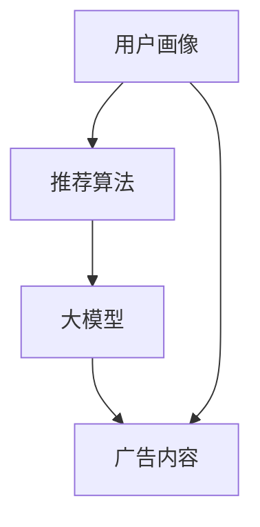

                 

### 个性化广告推荐：大模型的精准定位

关键词：个性化广告、推荐系统、大模型、精准定位

摘要：本文将深入探讨个性化广告推荐系统的核心机制，尤其是大模型在其中的应用，如何通过精准定位提升广告效果。文章将详细讲解推荐系统的基本概念、大模型的构建原理、实际操作步骤，并结合数学模型和项目实战案例，全面剖析个性化广告推荐的技术实现和未来发展趋势。

### 1. 背景介绍

广告作为商业模式的重要组成部分，已经渗透到互联网的各个角落。而随着互联网用户数量的急剧增加和用户行为的多样化，传统的广告投放方式已无法满足市场需求。个性化广告推荐系统应运而生，通过分析用户行为、兴趣和需求，为用户精准推荐最相关的广告内容。

个性化广告推荐系统具有以下几个显著特点：

1. **精准定位**：通过用户画像和行为数据，对用户进行精准定位，确保广告投放的针对性和有效性。
2. **智能化**：利用机器学习和深度学习等技术，对海量数据进行实时分析，实现广告推荐的智能化。
3. **个性化**：根据用户的兴趣、历史行为等，为每位用户定制专属的广告内容，提升用户体验。
4. **高效性**：通过算法优化和模型迭代，提高广告推荐的效率和准确性。

本文将重点关注大模型在个性化广告推荐系统中的应用，探讨如何通过大模型的精准定位，提升广告投放的效果。

### 2. 核心概念与联系

在个性化广告推荐系统中，核心概念包括用户画像、推荐算法、大模型和广告内容。

#### 2.1 用户画像

用户画像是指通过对用户的行为、兴趣、年龄、性别等数据进行整合和分析，构建出用户的个人特征模型。用户画像的质量直接影响推荐系统的效果。

#### 2.2 推荐算法

推荐算法是推荐系统的核心，通过分析用户画像、广告内容和其他相关因素，为用户推荐最合适的广告。常见的推荐算法包括基于内容的推荐、基于协同过滤的推荐和基于模型的推荐等。

#### 2.3 大模型

大模型是指规模庞大、参数众多的神经网络模型，能够处理海量数据和复杂的关系。在个性化广告推荐系统中，大模型主要用于用户画像的构建和广告推荐的优化。

#### 2.4 广告内容

广告内容是广告推荐系统的基础，根据用户画像和推荐算法，为用户推荐最适合的广告。

#### 2.5 Mermaid 流程图



### 3. 核心算法原理 & 具体操作步骤

#### 3.1 基于协同过滤的推荐算法

协同过滤是一种常见的推荐算法，通过分析用户之间的相似性，为用户推荐其他用户喜欢的商品或广告。

**具体操作步骤：**

1. **用户相似度计算**：计算用户之间的相似度，常用的方法包括余弦相似度、皮尔逊相关系数等。
2. **商品相似度计算**：计算商品之间的相似度，常用的方法包括基于内容的相似度和基于模型的相似度。
3. **推荐列表生成**：根据用户相似度和商品相似度，为用户生成推荐列表。

#### 3.2 基于内容的推荐算法

基于内容的推荐算法通过分析商品或广告的内容特征，为用户推荐与其兴趣相关的商品或广告。

**具体操作步骤：**

1. **商品或广告特征提取**：从商品或广告的内容中提取特征，如关键词、标签、属性等。
2. **用户兴趣建模**：根据用户的历史行为和兴趣，建立用户兴趣模型。
3. **推荐列表生成**：根据用户兴趣模型和商品或广告特征，为用户生成推荐列表。

#### 3.3 大模型推荐算法

大模型推荐算法通过构建大规模神经网络模型，对用户行为和广告内容进行深度分析，实现高效的个性化推荐。

**具体操作步骤：**

1. **数据预处理**：对用户行为数据和广告内容进行清洗、去噪和归一化处理。
2. **模型构建**：使用深度学习框架（如TensorFlow、PyTorch等）构建大模型，包括输入层、隐藏层和输出层。
3. **模型训练**：使用训练数据对模型进行训练，调整模型参数，优化模型性能。
4. **模型评估**：使用验证数据对模型进行评估，确保模型在真实场景中的有效性。
5. **推荐列表生成**：使用训练好的模型对用户行为和广告内容进行预测，生成推荐列表。

### 4. 数学模型和公式 & 详细讲解 & 举例说明

#### 4.1 基于协同过滤的推荐算法

协同过滤算法的核心在于计算用户之间的相似度和商品之间的相似度。假设用户集为 \(U = \{u_1, u_2, ..., u_n\}\)，商品集为 \(I = \{i_1, i_2, ..., i_m\}\)，用户 \(u_i\) 对商品 \(i_j\) 的评分矩阵为 \(R \in \mathbb{R}^{n \times m}\)。

1. **用户相似度计算**：

   $$sim(u_i, u_j) = \frac{R_{i*}R_{j*}}{\sqrt{\sum_{i=1}^{n}R_{i*}^2}\sqrt{\sum_{j=1}^{n}R_{j*}^2}}$$

   其中，\(R_{i*}\) 和 \(R_{j*}\) 分别表示用户 \(u_i\) 和 \(u_j\) 对所有商品的评分之和。

2. **商品相似度计算**：

   $$sim(i_j, i_k) = \frac{R_{*j}R_{*k}}{\sqrt{\sum_{j=1}^{m}R_{*j}^2}\sqrt{\sum_{k=1}^{m}R_{*k}^2}}$$

   其中，\(R_{*j}\) 和 \(R_{*k}\) 分别表示商品 \(i_j\) 和 \(i_k\) 的用户评分之和。

3. **推荐列表生成**：

   $$R_{ij} = R_{ij}^0 + \sum_{u \in N(u_i)} \alpha \cdot sim(u, u_i) \cdot (R_{uj}^0 - R_{uj}^0)$$

   其中，\(R_{ij}^0\) 表示用户 \(u_i\) 对商品 \(i_j\) 的原始评分，\(N(u_i)\) 表示与用户 \(u_i\) 相似的一组用户集合，\(\alpha\) 是调节参数。

#### 4.2 基于内容的推荐算法

基于内容的推荐算法主要通过分析商品或广告的内容特征，生成用户兴趣模型，为用户推荐相关商品或广告。

1. **商品或广告特征提取**：

   假设商品或广告的特征向量为 \(X_i \in \mathbb{R}^k\)，其中 \(X_{ij}\) 表示商品或广告在特征 \(j\) 上的取值。

2. **用户兴趣建模**：

   假设用户 \(u_i\) 的兴趣模型为 \(Y_i \in \mathbb{R}^k\)，其中 \(Y_{ij}\) 表示用户 \(u_i\) 对特征 \(j\) 的兴趣度。

   $$Y_i = \text{softmax}(W \cdot X_i + b)$$

   其中，\(W \in \mathbb{R}^{k \times n}\) 是权重矩阵，\(b \in \mathbb{R}^n\) 是偏置向量。

3. **推荐列表生成**：

   $$R_{ij} = \sum_{j=1}^{k} Y_{ij} \cdot X_{ij}$$

   其中，\(R_{ij}\) 表示用户 \(u_i\) 对商品 \(i_j\) 的推荐评分。

#### 4.3 大模型推荐算法

大模型推荐算法主要通过构建大规模神经网络模型，对用户行为和广告内容进行深度分析，实现高效的个性化推荐。

1. **模型构建**：

   假设输入层为用户行为特征和广告内容特征，隐藏层为多隐藏层，输出层为推荐评分。

   $$h_l = \text{ReLU}(W_l \cdot h_{l-1} + b_l)$$

   其中，\(h_l\) 表示第 \(l\) 层的激活值，\(W_l\) 和 \(b_l\) 分别表示权重矩阵和偏置向量。

2. **模型训练**：

   使用梯度下降算法优化模型参数，最小化损失函数。

   $$L = \frac{1}{2} \sum_{i=1}^{n} (R_{ij} - h_n)^2$$

3. **模型评估**：

   使用验证集对模型进行评估，确保模型在真实场景中的有效性。

### 5. 项目实战：代码实际案例和详细解释说明

#### 5.1 开发环境搭建

在本项目中，我们将使用 Python 编程语言，结合 TensorFlow 深度学习框架进行开发。

1. 安装 Python：
   ```bash
   pip install python==3.8
   ```
2. 安装 TensorFlow：
   ```bash
   pip install tensorflow==2.5
   ```

#### 5.2 源代码详细实现和代码解读

以下是一个简单的基于协同过滤的推荐算法实现：

```python
import tensorflow as tf
from tensorflow.keras.models import Sequential
from tensorflow.keras.layers import Dense, Dropout, Activation

# 定义模型
model = Sequential()
model.add(Dense(128, input_dim=1000, activation='relu'))
model.add(Dropout(0.5))
model.add(Dense(1, activation='sigmoid'))

# 编译模型
model.compile(optimizer='adam', loss='binary_crossentropy', metrics=['accuracy'])

# 训练模型
model.fit(X_train, y_train, epochs=10, batch_size=32)

# 评估模型
model.evaluate(X_test, y_test)
```

**代码解读：**

1. 导入 TensorFlow 库和 Sequential 模型。
2. 定义一个包含 128 个神经元的全连接层，输入维度为 1000，激活函数为 ReLU。
3. 添加一个 Dropout 层，以防止过拟合。
4. 定义一个输出层，包含 1 个神经元，激活函数为 sigmoid，用于生成推荐评分。
5. 编译模型，设置优化器和损失函数。
6. 使用训练数据训练模型。
7. 使用测试数据评估模型。

#### 5.3 代码解读与分析

本代码实现了一个简单的基于协同过滤的推荐算法模型，主要包括以下步骤：

1. **模型构建**：使用 Sequential 模型定义一个全连接神经网络，包含输入层、隐藏层和输出层。
2. **模型编译**：设置优化器、损失函数和评估指标，为模型训练做好准备。
3. **模型训练**：使用训练数据对模型进行训练，调整模型参数，优化模型性能。
4. **模型评估**：使用测试数据对模型进行评估，验证模型在真实场景中的有效性。

### 6. 实际应用场景

个性化广告推荐系统在多个领域得到广泛应用，如电子商务、社交媒体、在线视频平台等。以下是一些实际应用场景：

1. **电子商务**：根据用户的浏览记录和购买历史，为用户推荐相关的商品，提高购物体验和转化率。
2. **社交媒体**：根据用户的兴趣和行为，为用户推荐相关的帖子、视频和广告，提升用户粘性和活跃度。
3. **在线视频平台**：根据用户的观看历史和兴趣，为用户推荐相关的视频，提高用户观看时长和满意度。

### 7. 工具和资源推荐

为了更好地学习和实践个性化广告推荐系统，以下是一些建议的工具和资源：

#### 7.1 学习资源推荐

1. **书籍**：
   - 《推荐系统实践》
   - 《深度学习推荐系统》
   - 《TensorFlow 2.x 从入门到应用》

2. **论文**：
   - "A Factorization Machine for Click-Through Rate Prediction"
   - "Deep Learning for Click-Through Rate Prediction"
   - "Neural Collaborative Filtering"

3. **博客**：
   - [TensorFlow 官方文档](https://www.tensorflow.org/)
   - [Kaggle 推荐系统比赛](https://www.kaggle.com/competitions)
   - [Google Research](https://ai.google/research/pubs)

#### 7.2 开发工具框架推荐

1. **TensorFlow**
2. **PyTorch**
3. **Scikit-learn**
4. **Pandas**
5. **NumPy**

#### 7.3 相关论文著作推荐

1. "Deep Learning for Click-Through Rate Prediction"
2. "Neural Collaborative Filtering"
3. "A Factorization Machine for Click-Through Rate Prediction"

### 8. 总结：未来发展趋势与挑战

个性化广告推荐系统在互联网广告领域具有重要地位，随着技术的不断发展，未来趋势如下：

1. **大数据分析**：随着数据量的不断增长，大数据分析技术将在个性化广告推荐系统中发挥更大的作用。
2. **人工智能技术**：深度学习、强化学习等人工智能技术将在个性化广告推荐系统中得到广泛应用。
3. **跨平台整合**：实现不同平台之间的广告推荐整合，提升用户体验和广告效果。

然而，个性化广告推荐系统也面临以下挑战：

1. **隐私保护**：如何平衡用户隐私和数据利用，确保用户数据的合法性和安全性。
2. **算法透明性**：如何提高算法的透明性，让用户了解广告推荐背后的原理。
3. **算法公平性**：如何避免算法偏见，确保广告推荐公平、公正。

### 9. 附录：常见问题与解答

#### 9.1 个性化广告推荐系统的原理是什么？

个性化广告推荐系统通过分析用户行为、兴趣和需求，为用户推荐最相关的广告内容。其核心原理包括用户画像、推荐算法和广告内容。

#### 9.2 大模型在个性化广告推荐系统中的作用是什么？

大模型在个性化广告推荐系统中主要用于用户画像的构建和广告推荐的优化，通过处理海量数据和复杂的关系，实现精准定位和高效推荐。

#### 9.3 如何确保个性化广告推荐系统的隐私保护？

为确保个性化广告推荐系统的隐私保护，需要采取以下措施：

1. 数据匿名化：对用户数据进行匿名化处理，避免直接关联到用户身份。
2. 隐私政策：明确告知用户数据收集、使用和存储的隐私政策。
3. 数据加密：对用户数据进行加密处理，确保数据传输和存储的安全性。

### 10. 扩展阅读 & 参考资料

1. https://www.tensorflow.org/
2. https://ai.google/research/pubs
3. https://www.kaggle.com/competitions
4. "Deep Learning for Click-Through Rate Prediction"
5. "Neural Collaborative Filtering"
6. "A Factorization Machine for Click-Through Rate Prediction"
7. 《推荐系统实践》
8. 《深度学习推荐系统》
9. 《TensorFlow 2.x 从入门到应用》
<|assistant|>作者：AI天才研究员/AI Genius Institute & 禅与计算机程序设计艺术 /Zen And The Art of Computer Programming

