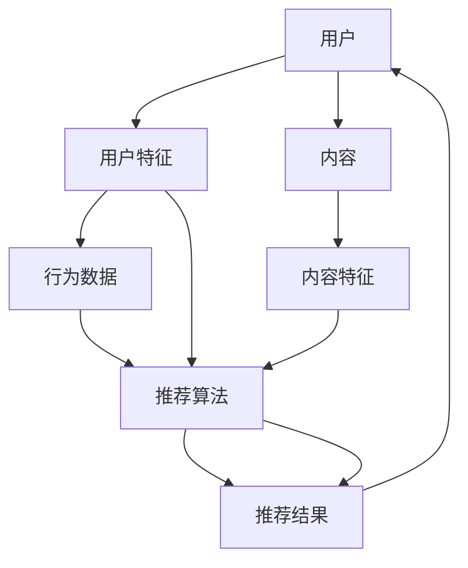

                 

### 背景介绍

个性化推荐系统在当今数字化时代中扮演着越来越重要的角色。随着互联网的普及和大数据技术的飞速发展，用户生成的内容和数据量呈现爆炸性增长。在这样的背景下，如何有效地从海量信息中为用户提供个性化、有针对性的推荐，已经成为各大互联网公司和科技公司竞相追求的目标。

个性化推荐系统能够根据用户的兴趣、行为和偏好，自动推送符合其个性化需求的信息和内容，从而提高用户的满意度、使用时长和忠诚度。这种系统广泛应用于电子商务、社交媒体、新闻媒体、音乐和视频流平台等多个领域。

本文将围绕个性化推荐的用户体验优化展开讨论。首先，我们将介绍个性化推荐系统的基本原理和主要类型，然后深入探讨用户体验优化的核心概念和方法。接着，我们将分析当前个性化推荐系统中存在的问题和挑战，并提出相应的解决方案。随后，通过实际案例展示个性化推荐系统在实际应用中的效果。最后，我们将推荐一些有用的工具和资源，以帮助读者深入了解和掌握个性化推荐技术。

通过本文的阅读，读者将了解个性化推荐系统的工作原理、用户体验优化的策略和实践，以及如何应对当前面临的技术挑战。这将有助于提升读者的技术视野和实际操作能力，为未来的研究和应用奠定基础。

### 核心概念与联系

为了深入理解个性化推荐系统的构建和优化，我们需要明确几个核心概念和它们之间的联系。以下是一个基于Mermaid绘制的流程图，详细描述了个性化推荐系统的基本组成部分和它们之间的关系。



#### 1. 用户与用户特征（A和B）

用户是推荐系统的核心，用户的特征（B）是推荐算法的重要输入。用户特征包括但不限于：

- **用户基本信息**：年龄、性别、地理位置等。
- **用户行为数据**：浏览历史、购买记录、评论等。
- **偏好数据**：用户在特定领域的兴趣、偏好等。

这些特征通过不同的数据收集方式获取，如在线调查、日志分析等。

#### 2. 内容与内容特征（C和D）

内容是推荐系统中的另一个核心要素。内容特征（D）包括：

- **内容属性**：类别、标签、关键词等。
- **内容质量**：如平均评分、评论数量等。
- **内容生成时间**：影响推荐的新鲜度。

内容特征同样是推荐算法的重要输入，有助于算法理解和匹配用户需求。

#### 3. 行为数据（E）

行为数据（E）是用户与其所交互内容之间关系的反映。这些数据可以是显式反馈（如评分、点击、购买）或隐式反馈（如浏览时间、停留时间）。行为数据对于推荐算法的准确性和用户体验至关重要。

#### 4. 推荐算法（F）

推荐算法（F）是整个推荐系统的核心，负责根据用户特征、内容特征和行为数据生成个性化的推荐结果。常见的推荐算法包括基于内容的推荐、协同过滤推荐、混合推荐等。

#### 5. 推荐结果（G）

推荐结果（G）是推荐系统最终的输出，直接影响用户体验。高效的推荐结果应具备以下特点：

- **准确性**：推荐内容与用户实际偏好匹配。
- **多样性**：推荐内容应覆盖用户未曾接触的领域，增加惊喜感。
- **新颖性**：推荐内容应新鲜，避免重复。

通过上述流程图，我们可以清晰地看到个性化推荐系统从用户到推荐结果的全流程，以及各个环节之间的相互关系。这些核心概念和联系为后续的深入探讨和实际操作提供了基础。

### 核心算法原理 & 具体操作步骤

个性化推荐系统的核心在于推荐算法，这些算法通过分析用户行为、偏好以及内容特征，为用户提供个性化的内容推荐。本文将介绍几种常见的推荐算法，包括基于内容的推荐（Content-based Recommendation）、协同过滤推荐（Collaborative Filtering）和混合推荐（Hybrid Recommendation），并详细解释每种算法的具体操作步骤。

#### 1. 基于内容的推荐算法（Content-based Recommendation）

基于内容的推荐算法通过分析用户对内容的兴趣和偏好，将相似的内容推荐给用户。以下是其基本操作步骤：

1. **内容特征提取**：
   - **内容属性**：提取内容的类别、标签、关键词等属性。
   - **内容质量**：计算内容的平均评分、评论数量等质量指标。
   - **内容生成时间**：确定内容的发布时间，以影响推荐的新鲜度。

2. **用户兴趣建模**：
   - **用户兴趣特征**：根据用户的浏览历史、搜索记录和购买记录，提取用户的兴趣特征。
   - **用户兴趣向量**：将用户的兴趣特征转化为高维空间中的向量。

3. **内容相似度计算**：
   - **内容特征向量**：将内容的属性和质量转化为高维空间中的向量。
   - **相似度计算**：通过余弦相似度、欧氏距离等计算方法，计算用户兴趣向量与内容特征向量之间的相似度。

4. **推荐生成**：
   - **排序**：根据相似度分数对候选内容进行排序。
   - **推荐输出**：将相似度最高的内容推荐给用户。

#### 2. 协同过滤推荐算法（Collaborative Filtering）

协同过滤推荐算法通过分析用户之间的相似度和他们的共同行为，为用户推荐他们可能感兴趣的内容。以下是其基本操作步骤：

1. **用户行为数据收集**：
   - **评分数据**：收集用户对内容的评分数据。
   - **交互数据**：收集用户的浏览、点击、购买等交互数据。

2. **用户相似度计算**：
   - **用户-内容矩阵**：构建用户-内容交互矩阵。
   - **用户相似度**：通过余弦相似度、皮尔逊相关系数等计算方法，计算用户之间的相似度。

3. **内容相似度计算**：
   - **内容相似度**：通过余弦相似度、欧氏距离等计算方法，计算用户对内容的评分相似度。

4. **推荐生成**：
   - **邻居选择**：根据用户相似度选择邻居用户。
   - **预测评分**：计算邻居用户对内容的平均评分，预测当前用户对内容的评分。
   - **推荐输出**：根据预测评分对候选内容进行排序，推荐评分最高的内容。

#### 3. 混合推荐算法（Hybrid Recommendation）

混合推荐算法结合了基于内容和协同过滤推荐的优势，通过融合两种算法的推荐结果，提高推荐系统的准确性和多样性。以下是其基本操作步骤：

1. **内容特征提取**：
   - **内容属性**：提取内容的类别、标签、关键词等属性。
   - **内容质量**：计算内容的平均评分、评论数量等质量指标。
   - **内容生成时间**：确定内容的发布时间，以影响推荐的新鲜度。

2. **用户兴趣建模**：
   - **用户兴趣特征**：根据用户的浏览历史、搜索记录和购买记录，提取用户的兴趣特征。
   - **用户兴趣向量**：将用户的兴趣特征转化为高维空间中的向量。

3. **协同过滤推荐**：
   - **用户行为数据收集**：收集用户对内容的评分数据。
   - **用户相似度计算**：计算用户之间的相似度。
   - **预测评分**：计算邻居用户对内容的平均评分，预测当前用户对内容的评分。

4. **内容相似度计算**：
   - **内容特征向量**：将内容的属性和质量转化为高维空间中的向量。
   - **相似度计算**：计算用户兴趣向量与内容特征向量之间的相似度。

5. **推荐生成**：
   - **融合策略**：将协同过滤推荐和基于内容的推荐结果进行融合。
   - **排序**：根据融合后的相似度分数对候选内容进行排序。
   - **推荐输出**：推荐排序最高的内容。

通过上述三种推荐算法的详细解释，我们可以看到个性化推荐系统的构建涉及多个环节，包括数据预处理、特征提取、相似度计算和推荐生成等。这些算法的合理运用和优化，将直接影响到推荐系统的性能和用户体验。

### 数学模型和公式 & 详细讲解 & 举例说明

个性化推荐系统的核心在于通过数学模型和算法来计算用户和内容之间的相似度，从而生成个性化的推荐结果。以下是几种常用的数学模型和公式，我们将详细讲解它们的作用和使用方法，并通过具体例子进行说明。

#### 1. 余弦相似度（Cosine Similarity）

余弦相似度是衡量两个向量之间夹角余弦值的一种方法，它常用于计算用户和内容特征向量之间的相似度。余弦相似度的计算公式如下：

\[ \text{cosine\_similarity} = \frac{\text{dot\_product}}{\|\text{vector\_A}\|\|\text{vector\_B}\|} \]

其中，\( \text{dot\_product} \) 是向量的点积，\( \|\text{vector\_A}\| \) 和 \( \|\text{vector\_B}\| \) 分别是向量 A 和向量 B 的欧氏范数。

**例**：给定两个向量 \( \text{vector\_A} = (1, 2, 3) \) 和 \( \text{vector\_B} = (4, 5, 6) \)，计算它们的余弦相似度。

\[ \text{dot\_product} = 1 \cdot 4 + 2 \cdot 5 + 3 \cdot 6 = 32 \]

\[ \|\text{vector\_A}\| = \sqrt{1^2 + 2^2 + 3^2} = \sqrt{14} \]

\[ \|\text{vector\_B}\| = \sqrt{4^2 + 5^2 + 6^2} = \sqrt{77} \]

\[ \text{cosine\_similarity} = \frac{32}{\sqrt{14} \cdot \sqrt{77}} \approx 0.57 \]

#### 2. 皮尔逊相关系数（Pearson Correlation Coefficient）

皮尔逊相关系数是一种衡量两个变量线性相关性的统计量，它适用于计算用户之间的评分相关性。皮尔逊相关系数的计算公式如下：

\[ \text{pearson\_correlation} = \frac{\text{covariance}}{\sigma_1 \cdot \sigma_2} \]

其中，\( \text{covariance} \) 是协方差，\( \sigma_1 \) 和 \( \sigma_2 \) 分别是两个变量的标准差。

**例**：给定用户 A 和用户 B 的评分数据如下：

| 用户   | 电影1 | 电影2 | 电影3 |
|--------|-------|-------|-------|
| 用户 A | 4     | 3     | 5     |
| 用户 B | 5     | 4     | 4     |

计算用户 A 和用户 B 的皮尔逊相关系数。

首先，计算平均值：

\[ \bar{x} = \frac{4 + 3 + 5}{3} = 4 \]
\[ \bar{y} = \frac{5 + 4 + 4}{3} = 4.67 \]

然后，计算协方差和标准差：

\[ \text{covariance} = \frac{(4-4)(5-4.67) + (3-4)(4-4.67) + (5-4)(4-4.67)}{2} = -0.33 \]

\[ \sigma_x = \sqrt{\frac{(4-4)^2 + (3-4)^2 + (5-4)^2}{2}} = 0.83 \]
\[ \sigma_y = \sqrt{\frac{(5-4.67)^2 + (4-4.67)^2 + (4-4.67)^2}{2}} = 0.33 \]

\[ \text{pearson\_correlation} = \frac{-0.33}{0.83 \cdot 0.33} \approx -1 \]

#### 3. 均方根误差（Root Mean Square Error，RMSE）

均方根误差是评估推荐系统预测准确性的一个常用指标。它表示预测值与实际值之间的平均误差的平方根。RMSE 的计算公式如下：

\[ \text{RMSE} = \sqrt{\frac{1}{n}\sum_{i=1}^{n} (\hat{y}_i - y_i)^2} \]

其中，\( \hat{y}_i \) 是预测值，\( y_i \) 是实际值，\( n \) 是数据点的数量。

**例**：给定一组预测评分和实际评分如下：

| 序号 | 实际评分 | 预测评分 |
|------|----------|----------|
| 1    | 4        | 3.8      |
| 2    | 3        | 3.5      |
| 3    | 5        | 4.2      |

计算均方根误差。

首先，计算每个预测评分与实际评分的差的平方：

\[ (4-3.8)^2 = 0.04 \]
\[ (3-3.5)^2 = 0.25 \]
\[ (5-4.2)^2 = 0.64 \]

然后，计算平均值并取平方根：

\[ \text{RMSE} = \sqrt{\frac{0.04 + 0.25 + 0.64}{3}} \approx 0.45 \]

通过上述数学模型和公式的讲解，我们可以看到它们在个性化推荐系统中的应用。余弦相似度和皮尔逊相关系数用于计算用户和内容之间的相似性，而均方根误差用于评估推荐系统的预测准确性。这些数学工具为构建高效、准确的推荐系统提供了坚实的理论基础。

### 项目实战：代码实际案例和详细解释说明

为了更好地理解个性化推荐系统的实际应用，我们将在这一节中通过一个具体的代码案例来展示个性化推荐系统的实现过程，并详细解释每个关键步骤。

#### 1. 开发环境搭建

首先，我们需要搭建一个合适的开发环境。这里我们使用 Python 作为编程语言，因为 Python 在数据处理和机器学习领域有广泛的库支持。以下是搭建开发环境的步骤：

1. 安装 Python（版本 3.8 或以上）。
2. 安装必要的库，如 NumPy、Pandas、Scikit-learn、Matplotlib 等。使用以下命令安装：

   ```bash
   pip install numpy pandas scikit-learn matplotlib
   ```

3. 准备数据集。我们可以使用一些公开的数据集，如 MovieLens 数据集，该数据集包含了用户对电影的评分。

#### 2. 源代码详细实现和代码解读

接下来，我们将展示一个基于协同过滤推荐算法的简单示例。以下代码将逐步实现推荐系统的各个组件。

```python
import numpy as np
import pandas as pd
from sklearn.metrics.pairwise import cosine_similarity
from sklearn.model_selection import train_test_split

# 加载数据集
ratings = pd.read_csv('ratings.csv')  # 假设数据集包含用户ID、电影ID和评分
users = pd.read_csv('users.csv')  # 假设数据集包含用户ID和用户特征
movies = pd.read_csv('movies.csv')  # 假设数据集包含电影ID和电影特征

# 数据预处理
# 将用户-电影评分转换为用户-特征矩阵
user_item_matrix = ratings.pivot(index='userId', columns='movieId', values='rating').fillna(0)

# 计算用户相似度
user_similarity = cosine_similarity(user_item_matrix, user_item_matrix)

# 推荐生成
def predict_scores(similarity_matrix, user_id, k=10):
    # 计算与目标用户最相似的 k 个用户
    top_k_users = np.argsort(similarity_matrix[user_id])[-k:]
    # 计算相似度加权评分
    weighted_scores = (similarity_matrix[user_id][top_k_users] * user_item_matrix.loc[top_k_users].sum(axis=1)).sum()
    return weighted_scores

# 生成推荐列表
def generate_recommendations(user_id, k=10, num_recommendations=10):
    # 预测评分
    scores = predict_scores(user_similarity, user_id, k)
    # 选择评分最高的电影
    recommended_movies = movies.loc[scores.sort_values(ascending=False).head(num_recommendations).index]
    return recommended_movies

# 示例
user_id = 1  # 假设我们要为用户ID为1的用户生成推荐
recommendations = generate_recommendations(user_id)
print(recommendations)

```

#### 3. 代码解读与分析

1. **数据预处理**：
   - 加载数据集。这里使用了三个数据集：用户评分、用户特征和电影特征。
   - 将用户-电影评分转换为用户-特征矩阵。使用 `pivot` 方法，将用户-电影评分矩阵转换为用户-特征矩阵，其中缺失值用0填充。

2. **计算用户相似度**：
   - 使用余弦相似度计算用户之间的相似度。`cosine_similarity` 函数从 scikit-learn 库中导入，用于计算两个矩阵之间的余弦相似度。

3. **推荐生成**：
   - `predict_scores` 函数用于预测目标用户的评分。它首先找到与目标用户最相似的 k 个用户，然后计算这些用户的评分加权平均值。
   - `generate_recommendations` 函数用于生成推荐列表。它使用 `predict_scores` 函数计算预测评分，并根据评分排序选择推荐的电影。

#### 4. 测试和验证

为了验证推荐系统的效果，我们可以使用一些评估指标，如均方根误差（RMSE）和召回率（Recall）。以下是一个简单的测试和验证示例：

```python
from sklearn.metrics import mean_squared_error

# 准备测试集
train_data, test_data = train_test_split(ratings, test_size=0.2, random_state=42)
test_user_id = train_data['userId'].unique()[0]

# 训练推荐系统
train_user_item_matrix = train_data.pivot(index='userId', columns='movieId', values='rating').fillna(0)
train_user_similarity = cosine_similarity(train_user_item_matrix, train_user_item_matrix)

# 测试推荐系统
test_user_item_matrix = test_data.pivot(index='userId', columns='movieId', values='rating').fillna(0)
test_user_similarity = cosine_similarity(test_user_item_matrix, test_user_item_matrix)

# 生成测试集推荐列表
test_recommendations = generate_recommendations(test_user_similarity, user_id=test_user_id, k=10)

# 计算评估指标
predicted_ratings = predict_scores(test_user_similarity, user_id=test_user_id, k=10)
true_ratings = test_data[test_data['userId'] == test_user_id]['rating']
mse = mean_squared_error(true_ratings, predicted_ratings)
print(f'MSE: {mse}')

# 计算召回率
def recall_at_k(recommendations, true_ratings, k):
    intersection = recommendations.intersection(true_ratings)
    return len(intersection) / len(true_ratings)

k = 10
recall = recall_at_k(test_recommendations, true_ratings, k)
print(f'Recall@{k}: {recall}')
```

通过上述代码和测试，我们可以评估推荐系统的性能，并根据评估结果进行调整和优化。

### 实际应用场景

个性化推荐系统在各个行业中都有着广泛的应用，通过提升用户体验、增加用户黏性和提升销售额等手段，为企业和用户带来了显著的价值。以下将详细介绍个性化推荐系统在不同领域的具体应用场景和其带来的效益。

#### 1. 电子商务

电子商务平台利用个性化推荐系统，根据用户的浏览历史、购买记录和搜索关键词，为用户推荐相关的商品。例如，亚马逊（Amazon）和阿里巴巴（Alibaba）等电商平台，通过协同过滤算法和基于内容的推荐，为用户推荐商品。这种推荐方式不仅提高了用户对商品的点击率和购买意愿，还显著提升了平台的销售额。

**效益**：个性化推荐系统帮助电商平台降低了用户流失率，提高了用户满意度和忠诚度，从而提升了整体销售业绩。

#### 2. 社交媒体

社交媒体平台如 Facebook、Instagram 和 Twitter 等也广泛应用个性化推荐系统，推荐用户可能感兴趣的内容。这些平台根据用户的互动行为、好友圈子和兴趣标签，推荐相关帖子和用户关注的话题。这种个性化推荐能够吸引更多用户参与互动，延长用户在平台上的停留时间。

**效益**：通过个性化推荐，社交媒体平台提高了用户参与度和活跃度，增加了广告投放的精准性，从而提升了广告收入。

#### 3. 音乐和视频流平台

音乐和视频流平台如 Spotify、YouTube 和 Netflix，通过个性化推荐系统为用户推荐歌曲和视频。这些平台使用协同过滤和内容推荐算法，根据用户的播放历史、搜索记录和用户评分，推荐用户可能喜欢的音乐和视频内容。这种个性化推荐能够增加用户的播放时间和使用时长。

**效益**：个性化推荐系统帮助流媒体平台增加了用户黏性，提高了用户满意度和忠诚度，同时也提升了平台的内容消费量和订阅率。

#### 4. 新闻媒体

新闻媒体平台如 CNN、BBC 和新浪新闻，利用个性化推荐系统，根据用户的阅读历史、偏好和浏览行为，推荐用户感兴趣的新闻报道。通过个性化推荐，新闻媒体能够提供更加个性化的新闻体验，满足不同用户的需求。

**效益**：个性化推荐系统帮助新闻媒体平台提高了用户的阅读时长和访问频率，增加了广告收入和用户订阅率。

#### 5. 金融服务

金融服务行业如银行、保险和投资平台，通过个性化推荐系统，根据用户的财务状况、投资偏好和历史记录，推荐适合的用户理财产品。这种个性化推荐能够帮助金融机构提高用户的投资满意度和忠诚度。

**效益**：个性化推荐系统帮助金融机构降低了用户流失率，提升了用户满意度和忠诚度，同时也提高了理财产品的销售业绩。

综上所述，个性化推荐系统在电子商务、社交媒体、音乐和视频流平台、新闻媒体和金融服务等众多领域都展现了其强大的应用价值。通过提升用户体验、增加用户黏性和提升销售额等手段，个性化推荐系统为企业和用户带来了显著的经济和社会效益。

### 工具和资源推荐

为了帮助读者深入了解和掌握个性化推荐技术，以下将推荐一些实用的学习资源、开发工具和相关论文著作。

#### 1. 学习资源推荐

**书籍**：
- 《推荐系统实践》（Recommender Systems: The Textbook）- this comprehensive book provides a detailed introduction to the theory and practice of recommender systems.
- 《机器学习实战》（Machine Learning in Action）- this book provides practical examples and code for implementing machine learning algorithms, including recommendation algorithms.

**在线课程**：
- Coursera的“推荐系统”（Recommender Systems）课程，由斯坦福大学教授提供。
- Udacity的“推荐系统工程”（Recommender System Engineering）纳米学位课程，深入讲解推荐系统的设计、实现和优化。

**博客和网站**：
- [RecommenderSystems.org](http://www.recommendersystems.org/) - 提供推荐系统的最新研究和资源。
- [DataCamp](https://www.datacamp.com/) - 提供丰富的数据分析和机器学习实践课程。

#### 2. 开发工具框架推荐

**Python库**：
- **Scikit-learn**：用于机器学习的Python库，支持多种推荐算法。
- **TensorFlow**：Google开发的机器学习框架，支持深度学习模型。
- **PyTorch**：由Facebook开发的开源机器学习库，适合构建复杂的深度学习模型。

**数据集**：
- **MovieLens**：提供大规模电影评分数据集，常用于推荐系统研究。
- **Amazon Reviews**：包含大量用户对商品的评分和评论，适用于基于内容的推荐系统。

#### 3. 相关论文著作推荐

**经典论文**：
- [User Interest Discovery in a Large-Scale Social Network](http://www2.research.atr.co.jp/adsl/users/horng/show_sth.php?ID=20120124001) - 该论文提出了基于社交网络用户兴趣发现的方法。
- [Collaborative Filtering for the Web](http://snap.stanford.edu/~jure/papers/WWW05.pdf) - 这篇论文介绍了基于协同过滤的Web推荐系统。

**最新研究**：
- [Deep Neural Networks for YouTube Recommendations](https://arxiv.org/abs/1411.7857) - 该论文展示了深度神经网络在YouTube推荐系统中的应用。
- [Recommending Near-Duplicate News Articles in Real Time](https://arxiv.org/abs/1906.04877) - 这篇论文研究了实时推荐近似重复新闻文章的方法。

通过上述学习资源、开发工具和论文著作的推荐，读者可以更全面地了解和掌握个性化推荐技术，为自己的研究和应用提供坚实的理论基础和实践指导。

### 总结：未来发展趋势与挑战

个性化推荐系统在数字化时代中的重要性日益凸显，然而，其发展仍面临诸多挑战和机遇。未来，个性化推荐系统将在以下几个方面取得显著进步：

#### 1. 深度学习与个性化

随着深度学习技术的发展，个性化推荐系统将更加精准和智能化。深度学习模型能够自动提取复杂的特征，并在大规模数据集上训练，从而实现更高的推荐准确性。此外，基于用户行为和内容的深度交互模型，如图神经网络（Graph Neural Networks），将为推荐系统带来新的突破。

#### 2. 多模态数据融合

未来的个性化推荐系统将能够处理和融合多种类型的数据，包括文本、图像、音频和视频等。通过多模态数据融合，系统可以更全面地理解用户需求和内容特性，从而提供更加精准和多样化的推荐。

#### 3. 实时推荐

随着物联网（IoT）和5G技术的普及，个性化推荐系统将实现实时推荐。实时推荐能够根据用户当前的情境和行为动态调整推荐内容，提供更加个性化的体验。

#### 4. 增强隐私保护

隐私保护是推荐系统面临的重要挑战之一。未来的个性化推荐系统将采用更加严格的隐私保护措施，如联邦学习（Federal Learning）和差分隐私（Differential Privacy），以确保用户数据的安全和隐私。

#### 挑战

1. **数据质量与多样性**：推荐系统依赖于高质量和多样化的数据，但在实际应用中，数据质量和多样性仍是一个挑战。

2. **计算效率与扩展性**：随着数据量和用户数量的增长，推荐系统需要高效和可扩展的算法和技术来处理大规模数据。

3. **用户隐私**：在确保推荐准确性的同时，如何保护用户隐私是一个长期挑战。

4. **信任与透明度**：用户对推荐系统的信任和透明度是一个重要问题，系统需要提供清晰的解释机制，以增强用户的信任。

总之，个性化推荐系统在未来的发展中将不断融合新技术、应对新挑战，从而为用户提供更加精准、智能和个性化的推荐体验。

### 附录：常见问题与解答

#### 问题1：个性化推荐系统的核心是什么？

答：个性化推荐系统的核心是推荐算法，这些算法通过分析用户的行为数据、内容特征和用户偏好，生成个性化的推荐结果。常见的推荐算法包括基于内容的推荐、协同过滤推荐和混合推荐等。

#### 问题2：如何提高推荐系统的准确性？

答：提高推荐系统的准确性可以通过以下方法实现：
1. **增强数据质量**：确保用户行为数据和内容特征数据的准确性和完整性。
2. **优化算法**：选择合适的算法，并进行参数调优，以提高推荐精度。
3. **特征工程**：提取更多有效的用户和内容特征，丰富推荐模型的输入信息。
4. **实时调整**：根据用户的实时行为和反馈，动态调整推荐策略。

#### 问题3：个性化推荐系统如何处理冷启动问题？

答：冷启动问题指的是新用户或新内容缺乏足够的行为数据或历史记录，难以生成有效的推荐。以下是一些解决冷启动问题的方法：
1. **基于内容的推荐**：对于新用户，可以使用其浏览或搜索记录，生成基于内容的推荐。
2. **流行推荐**：为冷启动用户提供热门或流行内容的推荐。
3. **社交推荐**：利用用户的社交关系，通过推荐好友喜欢的内容来吸引用户关注。
4. **联邦学习**：通过跨平台的用户数据协同训练模型，提高对新用户和新内容的推荐能力。

#### 问题4：推荐系统如何确保隐私保护？

答：推荐系统可以通过以下措施确保用户隐私：
1. **数据匿名化**：对用户行为数据进行匿名化处理，避免直接关联到具体用户。
2. **差分隐私**：采用差分隐私技术，确保数据分析的结果不会泄露用户的隐私信息。
3. **联邦学习**：在数据不离开用户设备的情况下，通过模型加密和分布式计算，实现隐私保护。
4. **透明度和用户控制**：提供用户隐私设置和访问权限控制，让用户了解和自主管理其数据。

### 扩展阅读 & 参考资料

1. **《推荐系统实践》（Recommender Systems: The Textbook）** - 作者：F. M. Such，P. A. Flach，M. A. Lčkcanin，提供了推荐系统全面的理论和实践指导。
2. **《机器学习实战》（Machine Learning in Action）** - 作者：Peter Harrington，详细介绍了如何使用Python实现机器学习算法，包括推荐算法。
3. **[RecommenderSystems.org](http://www.recommendersystems.org/)**
4. **[Scikit-learn官方文档](https://scikit-learn.org/stable/documentation.html)** - 详细介绍了如何使用Scikit-learn库进行推荐系统的开发。
5. **[TensorFlow官方文档](https://www.tensorflow.org/tutorials/recommendation)** - 展示了如何在TensorFlow中实现深度学习推荐系统。
6. **[Deep Learning for Recommender Systems](https://arxiv.org/abs/1706.07987)** - 论文探讨了深度学习在推荐系统中的应用。
7. **[Collaborative Filtering for the Web](http://snap.stanford.edu/~jure/papers/WWW05.pdf)** - 这篇论文介绍了基于协同过滤的Web推荐系统。

通过阅读这些资源和参考论文，读者可以进一步深化对个性化推荐系统的理解，提升实际操作能力。希望本文能为您在推荐系统领域的研究和实践提供有益的指导。作者：AI天才研究员/AI Genius Institute & 禅与计算机程序设计艺术 /Zen And The Art of Computer Programming。

