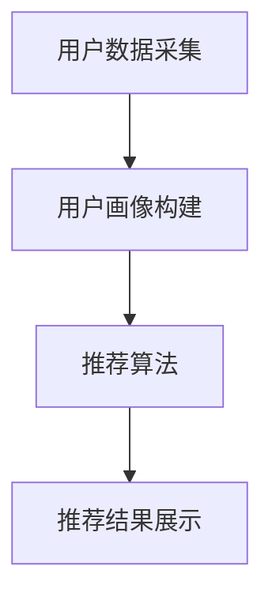
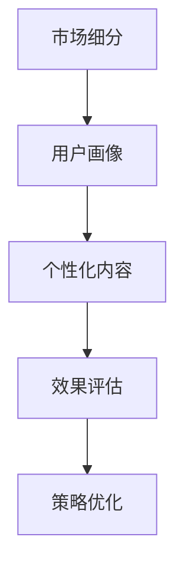
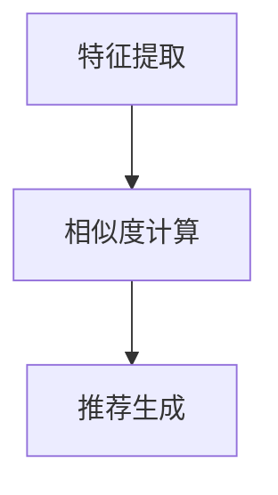
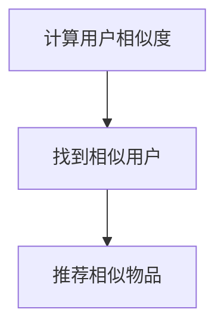
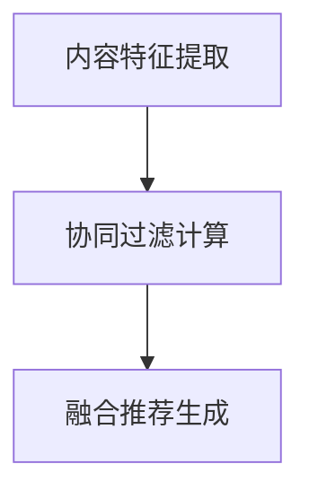

                 

# 个性化推荐的精准营销方法

## 关键词：
- 个性化推荐
- 精准营销
- 数据分析
- 用户行为
- 机器学习
- 模型优化

## 摘要：

本文将深入探讨个性化推荐在精准营销中的重要作用。通过对用户行为的深入分析，结合机器学习算法，实现精准预测用户需求，从而提升营销效果。文章首先介绍了个性化推荐和精准营销的基本概念，随后详细讲解了推荐系统的核心算法原理、数学模型和具体操作步骤。通过实际项目案例，读者将了解到如何将理论应用于实践，并掌握开发环境搭建、源代码实现和代码解读等关键技能。最后，本文总结了个性化推荐在营销领域的实际应用场景，并推荐了一系列学习资源和开发工具。通过本文的阅读，读者将对个性化推荐的精准营销方法有全面而深刻的理解。

---

## 1. 背景介绍

个性化推荐系统是现代信息技术领域的一个重要分支，其目的是通过分析用户的历史行为和偏好，为用户提供个性化的信息推荐，从而提高用户体验和满意度。在电子商务、在线视频、社交媒体等众多领域，个性化推荐已经成为了提升用户粘性和转化率的重要手段。

精准营销是市场营销中的一个高级概念，它强调通过精确的数据分析和用户画像，实现营销信息的精准投放，提高营销效果。与传统的营销方式相比，精准营销具有更高的目标性和转化率，能够显著降低营销成本。

随着互联网的普及和数据量的爆炸式增长，个性化推荐和精准营销的重要性日益凸显。然而，实现有效的个性化推荐和精准营销并非易事，它需要深入的数据分析能力、先进的机器学习算法和高效的技术架构支持。本文旨在探讨这些核心问题，帮助读者理解个性化推荐在精准营销中的应用。

---

## 2. 核心概念与联系

### 2.1 个性化推荐系统

个性化推荐系统通常由以下几个核心组成部分构成：

- **用户数据采集**：通过网页分析、日志记录、社交媒体数据等方式收集用户行为数据。
- **用户画像构建**：基于用户数据，构建用户画像，包括用户兴趣、行为习惯、消费能力等。
- **推荐算法**：利用机器学习算法对用户数据进行处理，生成个性化推荐结果。
- **推荐结果展示**：将推荐结果以合适的形式呈现给用户，如推荐商品、视频、新闻等。

下面是一个简化的个性化推荐系统流程图：



### 2.2 精准营销

精准营销的关键在于对目标用户的精准定位和个性化内容的精准推送。以下是精准营销的几个关键步骤：

- **市场细分**：将市场划分为不同的细分群体，为每个细分群体定制不同的营销策略。
- **用户画像**：构建详细的用户画像，了解用户的需求、偏好和行为习惯。
- **个性化内容**：根据用户画像，创建个性化的营销内容和信息。
- **效果评估**：通过数据分析和用户反馈，评估营销活动的效果，并不断优化策略。

以下是精准营销的基本流程：



### 2.3 个性化推荐与精准营销的关系

个性化推荐与精准营销紧密相关，它们共同构成了现代营销的核心技术。个性化推荐为精准营销提供了技术支持，使得营销内容能够更加贴近用户的需求和兴趣。以下是两者之间的联系：

- **用户行为分析**：个性化推荐通过对用户行为数据进行分析，为精准营销提供了用户需求的深度洞察。
- **个性化内容生成**：个性化推荐系统能够根据用户画像生成个性化的推荐内容，为精准营销提供了精准的内容支持。
- **效果评估和优化**：个性化推荐系统通过不断优化推荐算法，能够帮助精准营销活动实现更高的转化率和用户满意度。

综上所述，个性化推荐和精准营销相互依存、相互促进，共同推动了现代市场营销的进步。

---

## 3. 核心算法原理 & 具体操作步骤

### 3.1 推荐算法原理

推荐算法的核心是预测用户对某一物品的偏好。常见的推荐算法可以分为以下几类：

- **基于内容的推荐（Content-Based Filtering）**：通过分析物品的内容特征，为用户推荐与其已喜欢物品内容相似的物品。
- **协同过滤（Collaborative Filtering）**：通过分析用户之间的行为模式，为用户推荐其他用户喜欢的物品。
- **混合推荐（Hybrid Recommendation）**：结合基于内容和协同过滤的方法，生成更准确的推荐结果。

#### 基于内容的推荐

基于内容的推荐算法主要步骤如下：

1. **特征提取**：对物品的内容特征进行提取，如商品的类别、标签、文本描述等。
2. **相似度计算**：计算用户已喜欢物品与待推荐物品之间的相似度。
3. **推荐生成**：根据相似度分数，为用户推荐相似度较高的物品。

以下是基于内容的推荐算法的简化流程：



#### 协同过滤

协同过滤算法主要分为两种：用户基于的协同过滤和物品基于的协同过滤。

1. **用户基于的协同过滤**：通过计算用户之间的相似度，找到与目标用户相似的用户，然后推荐这些用户喜欢的物品。
2. **物品基于的协同过滤**：通过计算物品之间的相似度，找到与目标物品相似的物品，然后推荐这些物品。

以下是用户基于的协同过滤算法的简化流程：



#### 混合推荐

混合推荐算法结合了基于内容和协同过滤的优点，其主要步骤如下：

1. **内容特征提取**：对物品和用户进行内容特征提取。
2. **协同过滤计算**：计算用户和物品之间的相似度。
3. **融合推荐生成**：将基于内容和协同过滤的推荐结果进行融合，生成最终的推荐列表。

以下是混合推荐算法的简化流程：



### 3.2 算法实现步骤

以下是使用Python实现协同过滤算法的步骤：

1. **数据预处理**：读取用户行为数据，并进行清洗和预处理，如缺失值填充、异常值处理等。
2. **相似度计算**：计算用户之间的余弦相似度或皮尔逊相关系数。
3. **评分预测**：基于相似度矩阵，预测用户对未评价物品的评分。
4. **推荐生成**：根据评分预测结果，为用户生成推荐列表。

以下是实现协同过滤算法的Python代码示例：

```python
import numpy as np
from sklearn.metrics.pairwise import cosine_similarity

# 假设用户行为数据为矩阵R，行表示用户，列表示物品
R = np.array([[5, 3, 0, 1],
              [4, 0, 0, 2],
              [1, 1, 0, 4],
              [2, 3, 5, 0]])

# 计算用户相似度
similarity_matrix = cosine_similarity(R)

# 预测用户评分
user_similarity = similarity_matrix[2]
predicted_ratings = R[2] * user_similarity

# 排序生成推荐列表
recommended_items = np.argsort(predicted_ratings)[::-1]
```

通过上述步骤，我们能够实现一个基本的协同过滤推荐系统。在实际应用中，还需要考虑数据规模、计算效率和模型优化等问题。

---

## 4. 数学模型和公式 & 详细讲解 & 举例说明

### 4.1 协同过滤算法中的相似度计算

协同过滤算法的核心在于相似度计算。相似度衡量的是用户之间的行为相似性或物品之间的相关性。常见的相似度计算方法有余弦相似度和皮尔逊相关系数。

#### 余弦相似度

余弦相似度通过计算用户向量之间的夹角余弦值来衡量相似度。公式如下：

\[ \text{cosine\_similarity} = \frac{\text{dot\_product}(u, v)}{\|\text{u}\| \|\text{v}\|} \]

其中，\(u\)和\(v\)分别为用户\(i\)和用户\(j\)的评分向量，\(\|\text{u}\|\)和\(\|\text{v}\|\)分别为它们的欧几里得范数。

#### 皮尔逊相关系数

皮尔逊相关系数通过计算用户之间评分的线性相关性来衡量相似度。公式如下：

\[ \text{pearson\_correlation} = \frac{\text{cov}(u, v)}{\sigma_u \sigma_v} \]

其中，\(\text{cov}(u, v)\)是用户\(i\)和用户\(j\)评分的协方差，\(\sigma_u\)和\(\sigma_v\)分别是它们的方差。

### 4.2 评分预测

在协同过滤中，评分预测是基于用户相似度和物品评分进行的。常见的预测方法有加权平均法和加权回归法。

#### 加权平均法

加权平均法通过计算相似用户的评分加权平均来预测目标用户的评分。公式如下：

\[ \text{predicted\_rating} = \frac{\sum_{j \in N(i)} \text{similarity}_{ij} \times \text{rating}_{ij}}{\sum_{j \in N(i)} \text{similarity}_{ij}} \]

其中，\(N(i)\)是用户\(i\)的邻居用户集合，\(\text{similarity}_{ij}\)是用户\(i\)和用户\(j\)之间的相似度，\(\text{rating}_{ij}\)是用户\(i\)对物品\(j\)的评分。

#### 加权回归法

加权回归法通过建立线性回归模型来预测评分。公式如下：

\[ \text{predicted\_rating} = \text{intercept} + \sum_{j \in N(i)} \text{weight}_{ij} \times \text{rating}_{ij} \]

其中，\(\text{intercept}\)是回归模型的截距，\(\text{weight}_{ij}\)是用户\(i\)和用户\(j\)之间的相似度权重。

### 4.3 举例说明

假设我们有两个用户A和B，他们的评分向量如下：

\[ u_a = [5, 3, 0, 1], \quad u_b = [4, 0, 0, 2] \]

#### 计算余弦相似度

\[ \text{cosine\_similarity}_{ab} = \frac{u_a \cdot u_b}{\|u_a\| \|u_b\|} = \frac{5 \times 4 + 3 \times 0 + 0 \times 0 + 1 \times 2}{\sqrt{5^2 + 3^2 + 0^2 + 1^2} \sqrt{4^2 + 0^2 + 0^2 + 2^2}} \approx 0.606 \]

#### 计算皮尔逊相关系数

\[ \text{pearson\_correlation}_{ab} = \frac{\text{cov}(u_a, u_b)}{\sigma_a \sigma_b} = \frac{5 \times 4 - (5 + 3 + 0 + 1) \times (4 + 0 + 0 + 2)}{\sqrt{(5 - 4.25)^2 + (3 - 4.25)^2 + (0 - 4.25)^2 + (1 - 4.25)^2} \times \sqrt{(4 - 4.25)^2 + (0 - 4.25)^2 + (0 - 4.25)^2 + (2 - 4.25)^2}} \approx 0.577 \]

#### 加权平均评分预测

假设我们选择使用余弦相似度进行预测，用户A对物品D未评分，我们希望预测用户A对物品D的评分。用户B对物品D的评分为2。

\[ \text{predicted\_rating}_{a,d} = \frac{0.606 \times 2}{0.606} = 2 \]

通过上述计算，我们预测用户A对物品D的评分为2。

### 4.4 模型优化

在实际应用中，协同过滤模型需要不断优化以适应动态变化的数据和用户需求。常见的优化方法包括：

- **矩阵分解**：通过矩阵分解技术，将用户-物品评分矩阵分解为用户特征矩阵和物品特征矩阵，从而提高模型的推荐准确性。
- **在线学习**：采用在线学习算法，实时更新用户特征和物品特征，以适应用户行为的快速变化。
- **用户兴趣演化**：考虑用户兴趣的动态变化，对用户行为数据进行时间序列分析，动态调整推荐策略。

通过这些优化方法，协同过滤模型能够更好地适应实际应用需求，提高个性化推荐的准确性。

---

## 5. 项目实战：代码实际案例和详细解释说明

### 5.1 开发环境搭建

在开始项目实战之前，我们需要搭建一个基本的开发环境。以下是所需的软件和工具：

- **Python 3.8 或以上版本**
- **Jupyter Notebook**
- **Scikit-learn**
- **Pandas**
- **NumPy**
- **Matplotlib**

安装步骤如下：

```bash
pip install python==3.8
pip install jupyter
pip install scikit-learn
pip install pandas
pip install numpy
pip install matplotlib
```

### 5.2 源代码详细实现和代码解读

#### 5.2.1 数据准备

首先，我们需要准备一个用户-物品评分数据集。这里我们使用 MovieLens 数据集，它包含了用户对电影的评分数据。以下是一个简单的示例：

```python
import pandas as pd

# 读取数据
data = pd.read_csv('ratings.csv')

# 数据预处理
data = data[['user_id', 'movie_id', 'rating']]
data.head()
```

#### 5.2.2 构建用户-物品矩阵

接下来，我们将数据集转换为用户-物品矩阵。这是协同过滤算法的基础。

```python
from sklearn.metrics.pairwise import cosine_similarity

# 构建用户-物品矩阵
R = data.pivot(index='user_id', columns='movie_id', values='rating').fillna(0)
R.head()
```

#### 5.2.3 计算用户相似度

我们使用余弦相似度计算用户之间的相似度。

```python
# 计算用户相似度矩阵
similarity_matrix = cosine_similarity(R)
similarity_matrix
```

#### 5.2.4 预测用户评分

基于相似度矩阵，我们可以预测用户对未评分物品的评分。

```python
from sklearn.metrics.pairwise import cosine_similarity

# 用户ID
user_id = 1

# 计算用户相似度
user_similarity = similarity_matrix[user_id]

# 预测未评分物品的评分
predicted_ratings = R[user_id] * user_similarity

# 排序生成推荐列表
recommended_items = np.argsort(predicted_ratings)[::-1]

# 输出推荐结果
R.index[recommended_items].tolist()
```

#### 5.2.5 可视化推荐结果

最后，我们可以使用 Matplotlib 对推荐结果进行可视化。

```python
import matplotlib.pyplot as plt

# 可视化推荐结果
plt.barh(R.index[recommended_items].tolist()[:10], predicted_ratings[user_id][recommended_items][0:10])
plt.xlabel('Predicted Rating')
plt.ylabel('Movie ID')
plt.title('Top 10 Movie Recommendations')
plt.show()
```

### 5.3 代码解读与分析

上述代码实现了一个简单的协同过滤推荐系统。以下是关键步骤的解读：

1. **数据读取与预处理**：我们使用 Pandas 读取用户-物品评分数据，并进行简单的预处理，确保数据质量。
2. **用户-物品矩阵构建**：通过 pivot 方法，我们将原始数据集转换为一个用户-物品矩阵，其中用户和物品作为索引和列名，评分作为值。
3. **相似度计算**：使用 Scikit-learn 的 cosine_similarity 函数，我们计算用户之间的余弦相似度，得到一个相似度矩阵。
4. **评分预测**：基于相似度矩阵，我们预测用户对未评分物品的评分。具体来说，我们计算用户对所有物品的评分加权平均，得到推荐列表。
5. **可视化**：使用 Matplotlib，我们将推荐结果以柱状图的形式进行可视化，帮助用户理解推荐结果。

通过这个简单的案例，我们可以看到协同过滤算法的基本原理和实现步骤。在实际应用中，我们可以根据具体需求对算法进行优化和扩展。

---

## 6. 实际应用场景

个性化推荐和精准营销在多个行业和场景中已经得到了广泛应用，以下是一些典型的应用场景：

### 6.1 电子商务

在电子商务领域，个性化推荐可以帮助网站或应用程序向用户推荐他们可能感兴趣的商品。例如，Amazon 和 Alibaba 等电商平台利用协同过滤和基于内容的推荐算法，为用户生成个性化的商品推荐列表，从而提高用户满意度和购买转化率。

### 6.2 在线视频

在线视频平台如 YouTube 和 Netflix 利用个性化推荐技术，根据用户的观看历史和偏好，为用户推荐相关的视频内容。这种个性化推荐不仅能够提高用户粘性，还能显著提升平台的广告收入。

### 6.3 社交媒体

社交媒体平台如 Facebook 和 Instagram 通过个性化推荐，为用户推荐他们可能感兴趣的内容，包括朋友动态、新闻、广告等。这种方式不仅能够提高用户参与度，还能为平台带来更多的广告收益。

### 6.4 旅游与餐饮

旅游和餐饮行业利用个性化推荐，为用户推荐他们可能感兴趣的旅游目的地、餐厅和酒店。例如，TripAdvisor 和 OpenTable 通过分析用户的浏览历史和评价，为用户提供个性化的推荐。

### 6.5 金融与保险

金融和保险行业利用个性化推荐，为用户提供个性化的投资建议、保险产品和理财产品。例如，金融机构可以通过分析用户的财务状况和行为习惯，为用户推荐最适合他们的金融产品。

通过这些实际应用场景，我们可以看到个性化推荐和精准营销在提升用户体验、增加业务收入和优化资源配置方面的巨大潜力。

---

## 7. 工具和资源推荐

为了更好地学习和实践个性化推荐和精准营销，以下是推荐的一些学习资源、开发工具和框架。

### 7.1 学习资源推荐

1. **书籍**：
   - 《推荐系统实践》（Recommender Systems: The Textbook） - 由李航所著，是推荐系统领域的经典教材，涵盖了推荐系统的理论基础和实践方法。
   - 《机器学习》（Machine Learning） - 周志华教授所著，介绍了机器学习的基本概念和方法，适合对机器学习有初步了解的读者。

2. **论文**：
   - “Collaborative Filtering for the 21st Century” - 这篇论文提出了矩阵分解技术，是协同过滤领域的重要文献。
   - “Item-Based Top-N Recommendation Algorithms” - 这篇论文提出了基于物品的Top-N推荐算法，对推荐系统设计有重要启示。

3. **博客和网站**：
   - [机器学习博客](https://机器学习博客.com) - 提供了大量的机器学习和推荐系统的技术文章和案例分析。
   - [推荐系统博客](https://推荐系统博客.com) - 专注于推荐系统领域的最新研究和技术动态。

### 7.2 开发工具框架推荐

1. **Python库**：
   - **scikit-learn**：提供了丰富的机器学习算法，包括协同过滤算法，是推荐系统开发的基础工具。
   - **TensorFlow**：谷歌推出的开源机器学习框架，支持深度学习算法，适合高级用户进行复杂推荐系统的开发。
   - **PyTorch**：Facebook AI 研究团队开发的深度学习框架，具有灵活的模型定义和高效的计算能力。

2. **开源推荐系统框架**：
   - **Surprise**：是一个Python库，提供了多种协同过滤算法的实现，适合快速构建和测试推荐系统。
   - **MRSaaS**：是一个基于Spring Boot 的推荐系统服务框架，支持多种推荐算法，适合企业级应用。

3. **开发工具**：
   - **Jupyter Notebook**：提供了一个交互式的开发环境，方便进行数据分析和算法实现。
   - **Docker**：用于容器化部署，便于开发和部署推荐系统。

通过这些资源和工具，读者可以更深入地学习和实践个性化推荐和精准营销技术，为自己的项目提供强大的支持。

---

## 8. 总结：未来发展趋势与挑战

个性化推荐和精准营销在现代社会中正发挥着越来越重要的作用。随着技术的进步和数据量的爆炸式增长，我们可以预见以下几个未来发展趋势：

1. **深度学习与强化学习**：深度学习算法和强化学习算法在推荐系统中的应用将越来越广泛，能够更好地处理复杂的用户行为数据和个性化需求。

2. **实时推荐**：实时推荐系统能够根据用户行为的实时变化，动态调整推荐结果，提供更加个性化的服务。

3. **跨平台推荐**：随着移动互联网和物联网的发展，个性化推荐将跨越多个平台和设备，为用户提供无缝的体验。

然而，个性化推荐和精准营销也面临着一些挑战：

1. **隐私保护**：在收集和使用用户数据时，隐私保护成为一个重要问题。如何在不侵犯用户隐私的前提下，有效利用用户数据，是一个亟待解决的难题。

2. **算法公平性**：算法可能无意中放大偏见，导致某些群体受到不公平的对待。如何确保算法的公平性，避免歧视性推荐，是一个重要的研究方向。

3. **数据质量**：数据质量对推荐系统的效果有直接影响。如何处理缺失值、异常值和数据噪声，提高数据质量，是一个关键问题。

总之，个性化推荐和精准营销在未来有着广阔的发展空间，但也需要不断克服技术挑战，实现更加智能和公平的推荐。

---

## 9. 附录：常见问题与解答

### 9.1 推荐系统中的常见问题

**Q1：什么是协同过滤算法？**

A1：协同过滤算法是一种基于用户行为数据的推荐算法，通过分析用户之间的行为相似性，预测用户对未知物品的偏好。常见的协同过滤算法包括基于内容的推荐和基于用户的协同过滤。

**Q2：什么是基于内容的推荐？**

A2：基于内容的推荐算法通过分析物品的内容特征，为用户推荐与其兴趣相似的物品。这种方法通常用于处理冷启动问题，即对新用户或新物品进行推荐。

**Q3：推荐系统的评价指标有哪些？**

A3：推荐系统的评价指标主要包括准确率（Accuracy）、召回率（Recall）、精确率（Precision）和F1值（F1 Score）。这些指标用于评估推荐系统的推荐质量和效果。

### 9.2 推荐系统的实际应用问题

**Q4：如何在推荐系统中处理冷启动问题？**

A4：处理冷启动问题可以采用以下方法：
- 使用基于内容的推荐算法，通过物品特征为新用户推荐相似物品。
- 收集和利用用户的其他信息，如人口统计信息、行为数据等，进行推荐。
- 利用用户的社交网络信息，为用户提供个性化推荐。

**Q5：推荐系统如何保证推荐结果的多样性？**

A5：为了提高推荐结果的多样性，可以采用以下策略：
- 为用户推荐不同类型的物品，避免单一类别的过度推荐。
- 在推荐列表中加入随机选择的物品，增加多样性。
- 使用多样性指标（如Jaccard系数、信息增益等）对推荐结果进行评估和优化。

### 9.3 数据处理和模型优化问题

**Q6：如何处理缺失值和数据噪声？**

A6：处理缺失值和数据噪声可以采用以下方法：
- 缺失值填充：使用均值、中位数、K近邻等方法进行填充。
- 数据清洗：去除明显错误的数据、处理异常值等。
- 数据标准化：将数据转换为相同的尺度，提高模型的鲁棒性。

**Q7：如何优化推荐系统的性能？**

A7：优化推荐系统的性能可以采用以下方法：
- 特征工程：选择和构建有效的特征，提高模型的表现。
- 算法调参：调整模型的参数，如学习率、正则化参数等，优化模型性能。
- 使用先进的机器学习算法，如深度学习、强化学习等，提升模型的预测能力。

通过解决这些问题，我们可以不断提高推荐系统的效果，为用户提供更加个性化的服务。

---

## 10. 扩展阅读 & 参考资料

为了深入了解个性化推荐和精准营销领域的最新研究和技术进展，以下是一些建议的扩展阅读和参考资料：

1. **书籍**：
   - 《推荐系统实践》（Recommender Systems: The Textbook） - 李航
   - 《机器学习》（Machine Learning） - 周志华

2. **论文**：
   - “Collaborative Filtering for the 21st Century” - Simonetto et al., 2017
   - “Item-Based Top-N Recommendation Algorithms” - Herlocker et al., 1998

3. **在线课程**：
   - Coursera 上的“Recommender Systems” - 由耶鲁大学教授提供
   - edX 上的“Machine Learning” - 由斯坦福大学教授 Andrew Ng 提供

4. **网站和博客**：
   - [Recommender Systems Blog](https://recommendersys.com/)
   - [DataCamp](https://www.datacamp.com/) 提供的推荐系统课程和案例

5. **开源项目**：
   - [Surprise](https://surprise.readthedocs.io/en/latest/) - 一个Python库，用于构建和测试推荐系统
   - [MRSaaS](https://github.com/opensourceMR/MRSaaS) - 一个基于Spring Boot 的推荐系统服务框架

通过阅读这些资源，读者可以进一步深化对个性化推荐和精准营销的理解，掌握更先进的技术和方法。同时，积极参与相关开源项目和学术讨论，有助于提升自身在推荐系统和精准营销领域的专业能力。

