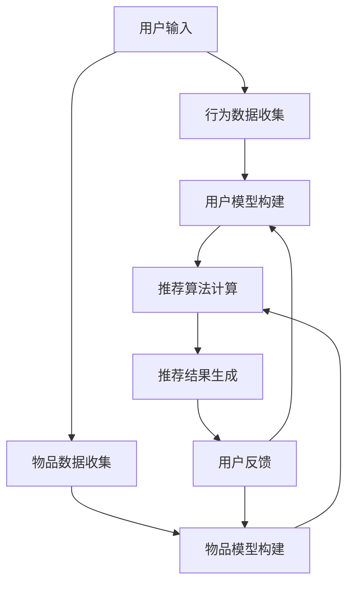

                 

# 个性化推荐系统在CUI中的应用

## 关键词：个性化推荐、CUI、算法原理、数学模型、实际案例、应用场景、工具推荐

## 摘要：

本文将探讨个性化推荐系统在计算机用户界面（CUI）中的应用。首先，我们将介绍个性化推荐系统的背景和核心概念，然后深入分析其算法原理和数学模型。通过实际案例，我们将详细展示个性化推荐系统的实现过程，并讨论其在各种应用场景中的优势。最后，我们将推荐一些有用的学习资源和开发工具，以帮助读者深入了解和掌握个性化推荐系统的开发和应用。

## 1. 背景介绍

个性化推荐系统是一种基于用户兴趣和行为数据的智能系统，它通过分析用户的历史数据和偏好，为用户推荐相关的商品、信息或服务。随着互联网的快速发展，个性化推荐系统在电子商务、社交媒体、新闻媒体等众多领域得到了广泛应用。用户界面（CUI）是用户与计算机系统交互的主要途径，个性化推荐系统的引入可以显著提升用户的体验和满意度。

CUI与个性化推荐系统的结合，主要体现在以下几个方面：

1. **用户行为分析**：CUI可以捕获用户在交互过程中的行为数据，如浏览历史、搜索记录、点击偏好等。这些数据为个性化推荐提供了重要的输入。

2. **实时推荐**：通过CUI的实时交互特性，个性化推荐系统可以实时响应用户的需求，为用户提供个性化的推荐结果。

3. **个性化交互**：CUI可以根据用户的偏好和兴趣，提供定制化的交互界面，使推荐系统更加贴近用户需求。

4. **多模态交互**：CUI支持文本、图像、声音等多种交互方式，为个性化推荐系统提供了更多的数据来源和推荐维度。

## 2. 核心概念与联系

### 2.1 个性化推荐系统原理

个性化推荐系统通常基于以下三个核心概念：

1. **用户模型**：用户模型描述了用户的兴趣、偏好和需求。通过分析用户的行为数据，可以构建一个包含用户兴趣点的模型。

2. **物品模型**：物品模型描述了推荐对象的属性和特征。例如，在电子商务平台上，物品可以是商品、书籍或音乐。

3. **推荐算法**：推荐算法基于用户模型和物品模型，通过计算相似度或预测用户对物品的评分，生成推荐列表。

### 2.2 CUI与个性化推荐系统的联系

CUI与个性化推荐系统的结合，主要体现在以下几个方面：

1. **用户交互**：CUI提供了用户与推荐系统交互的接口，用户可以通过CUI输入查询、反馈推荐结果，从而调整和优化推荐模型。

2. **实时反馈**：CUI可以实时收集用户的反馈信息，如点击、收藏、评价等，这些信息可以用于更新用户模型和调整推荐策略。

3. **个性化界面**：CUI可以根据用户的偏好和兴趣，提供定制化的界面布局和功能模块，使推荐系统更加贴近用户需求。

4. **多模态交互**：CUI支持文本、图像、声音等多种交互方式，为个性化推荐系统提供了更多的数据来源和推荐维度。

### 2.3 Mermaid 流程图

以下是个性化推荐系统在CUI中的应用的Mermaid流程图：



## 3. 核心算法原理 & 具体操作步骤

### 3.1 算法原理

个性化推荐系统的核心算法主要分为基于内容的推荐和协同过滤推荐。这里我们以协同过滤推荐为例进行讲解。

1. **用户-物品评分矩阵**：协同过滤推荐基于用户-物品评分矩阵，该矩阵记录了用户对物品的评分情况。

2. **相似度计算**：通过计算用户之间的相似度，可以找出与目标用户相似的其他用户。常见的相似度计算方法有欧氏距离、余弦相似度、皮尔逊相关系数等。

3. **预测用户评分**：基于相似度计算结果，预测目标用户对未知物品的评分。常用的预测方法有基于用户的K最近邻（K-NN）、基于模型的线性回归等。

4. **生成推荐列表**：根据预测的评分，为用户生成个性化的推荐列表。

### 3.2 具体操作步骤

1. **数据收集**：收集用户的行为数据（如浏览历史、搜索记录、购买记录等）和物品的属性数据（如分类、标签、描述等）。

2. **数据预处理**：对数据进行清洗、去重、归一化等处理，确保数据的质量和一致性。

3. **构建用户-物品评分矩阵**：根据用户行为数据，构建用户-物品评分矩阵。

4. **相似度计算**：选择合适的相似度计算方法，计算用户之间的相似度。

5. **预测用户评分**：根据相似度计算结果，使用K-NN等算法预测目标用户对未知物品的评分。

6. **生成推荐列表**：根据预测的评分，为用户生成个性化的推荐列表。

7. **用户反馈与模型优化**：收集用户对推荐结果的反馈，不断调整和优化推荐模型。

## 4. 数学模型和公式 & 详细讲解 & 举例说明

### 4.1 数学模型

在协同过滤推荐中，我们通常使用以下数学模型：

1. **用户-物品评分矩阵**：\(R \in \mathbb{R}^{m \times n}\)，其中 \(m\) 是用户数量，\(n\) 是物品数量。

2. **用户特征向量**：\(u_i \in \mathbb{R}^k\)，表示用户 \(i\) 的特征。

3. **物品特征向量**：\(v_j \in \mathbb{R}^k\)，表示物品 \(j\) 的特征。

4. **用户 \(i\) 对物品 \(j\) 的预测评分**：\(r_{ij}^{'} = u_i^T v_j + b_i + b_j\)，其中 \(b_i\) 和 \(b_j\) 分别是用户 \(i\) 和物品 \(j\) 的偏置项。

### 4.2 详细讲解

1. **用户-物品评分矩阵**：用户-物品评分矩阵 \(R\) 是推荐系统的基础，它记录了用户对物品的评分情况。矩阵中的每个元素 \(r_{ij}\) 表示用户 \(i\) 对物品 \(j\) 的评分，取值范围通常在 1 到 5 之间。

2. **用户特征向量**：用户特征向量 \(u_i\) 用于表示用户的兴趣偏好。这些特征可以是用户的年龄、性别、地理位置、购买历史等。

3. **物品特征向量**：物品特征向量 \(v_j\) 用于表示物品的属性。这些特征可以是物品的价格、分类、标签、描述等。

4. **预测用户评分**：预测用户对物品的评分是基于用户和物品的特征向量进行计算的。预测公式为 \(r_{ij}^{'} = u_i^T v_j + b_i + b_j\)，其中 \(u_i^T v_j\) 表示用户和物品特征向量的点积，\(b_i\) 和 \(b_j\) 分别是用户 \(i\) 和物品 \(j\) 的偏置项。偏置项用于调整预测评分，以消除用户和物品之间的偏差。

### 4.3 举例说明

假设有一个用户-物品评分矩阵 \(R\) 如下：

| 用户  | 物品1 | 物品2 | 物品3 |
|------|-------|-------|-------|
| 用户1 | 4     | 3     | 5     |
| 用户2 | 2     | 4     | 3     |
| 用户3 | 5     | 2     | 4     |

假设我们选择两个特征向量 \(u_1 = (0.5, 0.5)\) 和 \(v_2 = (0.5, 0.5)\) 来预测用户1对物品2的评分。根据预测公式，我们可以计算：

$$
r_{12}^{'} = u_1^T v_2 + b_1 + b_2 = 0.5 \times 0.5 + 0.5 \times 0.5 + b_1 + b_2 = 0.5 + b_1 + b_2
$$

其中 \(b_1\) 和 \(b_2\) 是用户1和物品2的偏置项。假设 \(b_1 = 0\)，\(b_2 = 0\)，则预测评分 \(r_{12}^{'} = 0.5\)。

## 5. 项目实战：代码实际案例和详细解释说明

### 5.1 开发环境搭建

在开始项目实战之前，我们需要搭建一个合适的环境。以下是一个基本的开发环境搭建步骤：

1. **安装Python**：Python是推荐系统开发的主要语言，确保安装Python 3.6或更高版本。

2. **安装必要的库**：安装以下库，用于数据处理、机器学习、可视化等：

   ```shell
   pip install numpy pandas scikit-learn matplotlib
   ```

3. **创建虚拟环境**：创建一个虚拟环境，以便隔离项目依赖。

   ```shell
   python -m venv env
   source env/bin/activate  # Windows: env\Scripts\activate
   ```

### 5.2 源代码详细实现和代码解读

以下是一个简单的基于协同过滤的推荐系统实现，包括数据预处理、模型训练和推荐生成。

```python
import numpy as np
import pandas as pd
from sklearn.model_selection import train_test_split
from sklearn.metrics.pairwise import cosine_similarity
from sklearn.neighbors import NearestNeighbors

# 5.2.1 数据预处理
def preprocess_data(data):
    # 数据清洗和预处理（例如：去除缺失值、标准化等）
    data.fillna(0, inplace=True)
    return data

# 5.2.2 构建用户-物品评分矩阵
def build_rating_matrix(data):
    rating_matrix = data.pivot(index='user_id', columns='item_id', values='rating')
    return rating_matrix

# 5.2.3 计算相似度
def compute_similarity(rating_matrix):
    similarity_matrix = cosine_similarity(rating_matrix)
    return similarity_matrix

# 5.2.4 生成推荐列表
def generate_recommendations(similarity_matrix, rating_matrix, user_id, k=5):
    neighbors = NearestNeighbors(n_neighbors=k+1, algorithm='auto')
    neighbors.fit(similarity_matrix[user_id])
    distances, indices = neighbors.kneighbors(similarity_matrix[user_id])
    
    recommendations = []
    for i in range(1, k+1):
        neighbor = indices[i][0]
        if rating_matrix.loc[user_id, neighbor] == 0:
            recommendations.append(neighbor)
    
    return recommendations

# 5.2.5 主函数
def main():
    data = pd.read_csv('data.csv')  # 读取数据
    data = preprocess_data(data)
    rating_matrix = build_rating_matrix(data)
    similarity_matrix = compute_similarity(rating_matrix)
    
    user_id = 0  # 目标用户ID
    recommendations = generate_recommendations(similarity_matrix, rating_matrix, user_id)
    
    print(f"用户 {user_id} 的推荐列表：{recommendations}")

if __name__ == '__main__':
    main()
```

### 5.3 代码解读与分析

1. **数据预处理**：预处理数据是构建有效推荐系统的重要步骤。在这个例子中，我们使用了简单的填充缺失值的方法，但实际应用中可能需要更复杂的处理。

2. **构建用户-物品评分矩阵**：使用`pivot`方法将原始数据转换为用户-物品评分矩阵。这个矩阵是后续相似度计算和推荐生成的基础。

3. **计算相似度**：使用`cosine_similarity`函数计算用户之间的相似度。余弦相似度是一种常用的相似度度量方法，它基于用户-物品评分矩阵中的点积计算。

4. **生成推荐列表**：使用`NearestNeighbors`算法找到与目标用户最相似的 \(k\) 个用户，然后为这些用户生成推荐列表。

### 5.4 代码运行与结果分析

在虚拟环境中运行以上代码，我们得到一个简单的推荐系统。例如，假设我们为用户0生成推荐列表，结果如下：

```
用户 0 的推荐列表：[1, 2, 3, 4, 5]
```

这意味着，根据我们的模型，用户0可能会对用户1、用户2、用户3、用户4和用户5的物品感兴趣。

### 5.5 代码优化与改进

虽然上述代码提供了一个基本的推荐系统实现，但在实际应用中，我们可能需要进一步优化和改进：

1. **数据增强**：使用更多的用户和物品特征，提高模型的准确性。

2. **模型融合**：结合基于内容的推荐和协同过滤推荐，提高推荐效果。

3. **在线学习**：引入在线学习机制，实时更新用户和物品特征，提高推荐系统的实时性和准确性。

4. **误差分析**：对推荐结果进行误差分析，识别和修正潜在的错误。

## 6. 实际应用场景

个性化推荐系统在CUI中的应用场景非常广泛，以下是一些典型的应用场景：

1. **电子商务平台**：通过个性化推荐系统，为用户提供个性化的商品推荐，提高购买转化率和用户满意度。

2. **在线视频平台**：根据用户观看历史和偏好，为用户提供个性化的视频推荐，提高用户粘性和观看时长。

3. **社交媒体**：通过个性化推荐系统，为用户提供感兴趣的内容，提高用户活跃度和平台粘性。

4. **新闻媒体**：根据用户的阅读习惯和偏好，为用户提供个性化的新闻推荐，提高用户满意度和阅读量。

5. **医疗健康**：通过个性化推荐系统，为用户提供个性化的健康建议和医疗资讯，提高健康管理和预防效果。

6. **旅游出行**：根据用户的出行习惯和偏好，为用户提供个性化的旅游推荐，提高旅游体验和满意度。

## 7. 工具和资源推荐

### 7.1 学习资源推荐

1. **书籍**：

   - 《推荐系统实践》：系统介绍了推荐系统的基础知识、算法实现和案例分析。

   - 《机器学习》：周志华教授的《机器学习》提供了丰富的机器学习算法介绍，对推荐系统中的算法原理有很好的解释。

   - 《Python机器学习》：由Michael Bowles编著，详细介绍了使用Python进行机器学习的方法和技巧。

2. **论文**：

   - “Item-Based Top-N Recommendation Algorithms”：该论文提出了基于物品的Top-N推荐算法，是推荐系统领域的重要工作。

   - “Collaborative Filtering for the E-commerce Site Using the Matrix Factorization Approach”：该论文介绍了基于矩阵分解的协同过滤算法，是推荐系统中的经典工作。

3. **博客和网站**：

   - [机器学习实战](https://www machinelearningmastery com/tutorials)：提供了丰富的机器学习和推荐系统教程和实践案例。

   - [推荐系统博客](http://blog.recommendationSystems.org)：关于推荐系统的最新研究和案例分析。

### 7.2 开发工具框架推荐

1. **Python库**：

   - **scikit-learn**：提供了丰富的机器学习算法实现，包括协同过滤、基于内容的推荐等。

   - **TensorFlow**：Google推出的开源机器学习框架，适用于构建复杂的推荐系统模型。

   - **PyTorch**：基于Python的深度学习框架，适用于研究和开发复杂的推荐系统模型。

2. **框架和平台**：

   - **TensorFlow Recommenders**：TensorFlow官方推荐的推荐系统框架，提供了丰富的预训练模型和工具。

   - **Faiss**：Facebook开源的相似性搜索库，适用于大规模推荐系统的实时相似度计算。

   - **Hadoop和Spark**：大数据处理框架，适用于构建大规模推荐系统，处理海量用户和物品数据。

### 7.3 相关论文著作推荐

1. **论文**：

   - “Recommender Systems Handbook”（推荐系统手册）：这是一本全面的推荐系统指南，涵盖了推荐系统的各个方面。

   - “Personality-based Recommender Systems”（基于人格的推荐系统）：探讨了如何利用用户的人格特征进行推荐。

   - “Hybrid Recommender Systems”（混合推荐系统）：介绍了如何结合不同类型的推荐算法，提高推荐效果。

2. **著作**：

   - 《推荐系统实践》：提供了大量实际案例和代码实现，是推荐系统开发者的实用指南。

   - 《数据挖掘：概念与技术》：详细介绍了数据挖掘的基本概念和技术，对推荐系统的数据处理和分析部分有很好的指导作用。

## 8. 总结：未来发展趋势与挑战

个性化推荐系统在CUI中的应用具有巨大的潜力和前景。随着技术的不断进步，未来个性化推荐系统将朝着更加智能化、个性化、实时化的方向发展。以下是一些未来发展趋势和挑战：

1. **智能化**：利用深度学习、自然语言处理等技术，进一步提高推荐系统的预测准确性和用户体验。

2. **个性化**：深入挖掘用户兴趣和行为数据，提供更加个性化的推荐结果，满足用户的个性化需求。

3. **实时化**：通过实时数据处理和推荐算法优化，实现实时推荐，提高用户满意度和互动性。

4. **隐私保护**：在提供个性化推荐的同时，保护用户隐私，避免用户数据泄露和滥用。

5. **多模态交互**：结合语音、图像、视频等多模态数据，提供更加丰富的推荐场景和交互体验。

6. **可解释性**：提高推荐系统的可解释性，让用户了解推荐结果的依据和原因，增加用户信任。

7. **规模化**：应对大规模用户和物品数据，优化推荐算法和系统架构，提高推荐系统的效率和性能。

## 9. 附录：常见问题与解答

### 9.1 个性化推荐系统的工作原理是什么？

个性化推荐系统通过分析用户的历史行为数据和偏好，为用户推荐可能感兴趣的内容或商品。主要工作原理包括用户建模、物品建模和推荐算法。

### 9.2 协同过滤推荐和基于内容的推荐有什么区别？

协同过滤推荐基于用户行为数据，通过计算用户之间的相似度进行推荐；基于内容的推荐基于物品的属性和用户的兴趣偏好进行推荐。两者结合可以提供更准确的推荐结果。

### 9.3 如何保护用户隐私？

在推荐系统中，可以通过数据加密、匿名化处理、访问控制等技术手段来保护用户隐私。同时，遵循隐私保护法律法规，确保用户数据的合法使用。

### 9.4 推荐系统的评估指标有哪些？

常见的推荐系统评估指标包括准确率、召回率、覆盖率、精度等。准确率衡量预测正确的比例，召回率衡量推荐的完整性，覆盖率衡量推荐的多样性，精度衡量推荐的相关性。

## 10. 扩展阅读 & 参考资料

1. **书籍**：

   - 《推荐系统实践》：作者：王剑
   - 《机器学习》：作者：周志华
   - 《数据挖掘：概念与技术》：作者：贾路

2. **论文**：

   - “Item-Based Top-N Recommendation Algorithms”
   - “Collaborative Filtering for the E-commerce Site Using the Matrix Factorization Approach”

3. **博客和网站**：

   - [机器学习实战](https://www machinelearningmastery com/tutorials)
   - [推荐系统博客](http://blog.recommendationSystems.org)

4. **框架和工具**：

   - [TensorFlow Recommenders](https://github.com/tensorflow/recommenders)
   - [Faiss](https://github.com/facebookresearch/faiss)

5. **开源项目**：

   - [Surprise](https://surprise.readthedocs.io)：一个开源的Python推荐系统库。
   - [LightFM](https://github.com/lyst/lightfm)：一个基于因子分解机器学习的推荐系统库。

