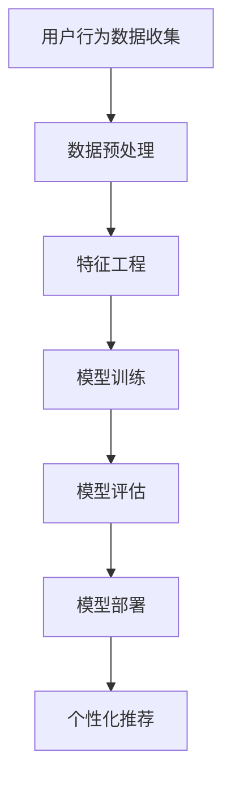

                 

# 个性化推荐系统的AI技术

## 关键词

- 个性化推荐系统
- AI技术
- 用户行为分析
- 数据挖掘
- 机器学习
- 深度学习
- 神经网络
- 用户体验优化

## 摘要

个性化推荐系统已经成为现代互联网服务中不可或缺的一部分，通过AI技术实现精准的用户偏好分析和内容推送，极大地提升了用户的体验和满意度。本文将深入探讨个性化推荐系统的AI技术，包括其核心概念、算法原理、数学模型、项目实战、实际应用场景、工具和资源推荐以及未来发展趋势与挑战。

## 1. 背景介绍

个性化推荐系统是一种根据用户的历史行为和偏好，通过算法模型预测用户可能感兴趣的内容，并将其推荐给用户的一种技术。其应用范围广泛，包括电子商务、社交媒体、新闻媒体、音乐和视频流平台等。

随着互联网的迅速发展，用户生成数据量爆炸式增长，传统的推荐系统已经难以满足用户对个性化服务的要求。AI技术的引入，使得个性化推荐系统更加智能化、准确化。AI技术主要包括机器学习、深度学习和自然语言处理等，这些技术可以处理大量复杂数据，并从中提取有价值的信息。

## 2. 核心概念与联系

### 2.1 用户行为分析

用户行为分析是个性化推荐系统的核心，它涉及用户在互联网上的各种行为，如浏览、点击、购买、评论等。通过对这些行为的分析，可以了解用户的兴趣和偏好，从而实现个性化推荐。

### 2.2 数据挖掘

数据挖掘是AI技术的一个重要分支，它通过统计学、机器学习和深度学习等方法，从大量数据中挖掘出潜在的模式和知识。在个性化推荐系统中，数据挖掘用于提取用户行为数据中的有用信息，如用户兴趣标签、物品特征等。

### 2.3 机器学习与深度学习

机器学习和深度学习是AI技术的核心，它们通过构建模型，从数据中自动学习和预测。在个性化推荐系统中，机器学习和深度学习用于构建用户行为预测模型和物品推荐模型。

### 2.4 神经网络

神经网络是深度学习的基础，它通过模仿人脑的结构和工作原理，实现复杂的数据处理和模式识别。在个性化推荐系统中，神经网络用于构建用户行为预测模型和物品推荐模型。

### 2.5 Mermaid流程图

以下是一个简化的个性化推荐系统的Mermaid流程图：



## 3. 核心算法原理 & 具体操作步骤

### 3.1 协同过滤

协同过滤是个性化推荐系统中最常用的算法之一，它通过分析用户之间的行为相似性，为用户推荐相似用户喜欢的物品。协同过滤分为基于用户的协同过滤和基于物品的协同过滤。

- **基于用户的协同过滤**：通过计算用户之间的相似度，找到与目标用户相似的用户，推荐这些用户喜欢的物品。

- **基于物品的协同过滤**：通过计算物品之间的相似度，找到与目标物品相似的物品，推荐这些物品。

### 3.2 内容推荐

内容推荐是基于物品特征的推荐，它通过分析物品的内容属性，如标题、描述、标签等，为用户推荐相似内容的物品。

### 3.3 深度学习

深度学习是AI技术的核心，它通过构建深度神经网络，实现复杂的数据处理和模式识别。在个性化推荐系统中，深度学习可以用于构建用户行为预测模型和物品推荐模型。

- **用户行为预测模型**：通过深度学习模型，预测用户对物品的偏好。

- **物品推荐模型**：通过深度学习模型，为用户推荐感兴趣的物品。

### 3.4 具体操作步骤

- **数据收集**：收集用户行为数据，如浏览、点击、购买等。

- **数据预处理**：清洗数据，去除噪音，标准化处理。

- **特征工程**：提取用户行为数据中的有用特征，如用户兴趣标签、物品特征等。

- **模型训练**：使用机器学习或深度学习算法，训练用户行为预测模型和物品推荐模型。

- **模型评估**：评估模型性能，如准确率、召回率、F1值等。

- **模型部署**：将训练好的模型部署到线上环境，实现实时推荐。

## 4. 数学模型和公式 & 详细讲解 & 举例说明

### 4.1 协同过滤算法

协同过滤算法的核心是计算用户之间的相似度和物品之间的相似度。

- **用户相似度**：

  $$ similarity(u_i, u_j) = \frac{\sum_{i \neq j} x_{ui} x_{uj}}{\sqrt{\sum_{i \neq j} x_{ui}^2} \sqrt{\sum_{i \neq j} x_{uj}^2}} $$

  其中，$x_{ui}$ 表示用户 $u_i$ 对物品 $i$ 的评分。

- **物品相似度**：

  $$ similarity(i, j) = \frac{\sum_{u \in U} x_{ui} x_{uj}}{\sqrt{\sum_{u \in U} x_{ui}^2} \sqrt{\sum_{u \in U} x_{uj}^2}} $$

  其中，$x_{uj}$ 表示用户 $u$ 对物品 $i$ 的评分。

### 4.2 深度学习模型

深度学习模型的核心是构建深度神经网络，实现用户行为预测和物品推荐。

- **用户行为预测模型**：

  $$ y = f(W_1 \cdot x_1 + b_1) $$
  
  其中，$y$ 表示用户对物品的偏好，$f$ 表示激活函数，$W_1$ 表示权重矩阵，$b_1$ 表示偏置。

- **物品推荐模型**：

  $$ y = f(W_2 \cdot x_2 + b_2) $$
  
  其中，$x_2$ 表示物品的特征向量，$W_2$ 表示权重矩阵，$b_2$ 表示偏置。

### 4.3 举例说明

假设有一个用户 $u_i$ 和物品 $i$，用户对物品的评分数据如下：

- $x_{ui} = [1, 1, 0, 0, 1]$

- $x_{uj} = [1, 1, 1, 0, 0]$

根据协同过滤算法，计算用户相似度：

$$ similarity(u_i, u_j) = \frac{1 \times 1 + 1 \times 1 + 0 \times 1 + 0 \times 0 + 1 \times 1}{\sqrt{1^2 + 1^2 + 0^2 + 0^2 + 1^2} \sqrt{1^2 + 1^2 + 1^2 + 0^2 + 0^2}} = \frac{3}{\sqrt{3} \sqrt{3}} = 1 $$

根据深度学习模型，预测用户对物品的偏好：

$$ y = \sigma(W_1 \cdot x_1 + b_1) $$

其中，$\sigma$ 表示 sigmoid 激活函数。

## 5. 项目实战：代码实际案例和详细解释说明

### 5.1 开发环境搭建

开发环境需要安装Python、Jupyter Notebook、TensorFlow等工具。

```bash
pip install tensorflow
jupyter notebook
```

### 5.2 源代码详细实现和代码解读

以下是基于协同过滤算法的简单个性化推荐系统代码实现：

```python
import numpy as np
import pandas as pd
from sklearn.metrics.pairwise import cosine_similarity

# 加载数据
ratings = pd.read_csv('ratings.csv')
users = ratings['userId'].unique()
items = ratings['itemId'].unique()

# 计算用户相似度矩阵
user_similarity = np.zeros((len(users), len(users)))
for i, u1 in enumerate(users):
    for j, u2 in enumerate(users):
        if i == j:
            continue
        u1_ratings = ratings[ratings['userId'] == u1]['itemId']
        u2_ratings = ratings[ratings['userId'] == u2]['itemId']
        sim = cosine_similarity([u1_ratings], [u2_ratings])
        user_similarity[i][j] = sim[0][0]

# 计算物品相似度矩阵
item_similarity = np.zeros((len(items), len(items)))
for i, i1 in enumerate(items):
    for j, i2 in enumerate(items):
        if i == j:
            continue
        i1_ratings = ratings[ratings['itemId'] == i1]['userId']
        i2_ratings = ratings[ratings['itemId'] == i2]['userId']
        sim = cosine_similarity([i1_ratings], [i2_ratings])
        item_similarity[i][j] = sim[0][0]

# 为用户推荐物品
def recommend_items(user_id, top_n=5):
    user_ratings = ratings[ratings['userId'] == user_id]['itemId']
    recommendations = []
    for i, item in enumerate(items):
        if item in user_ratings:
            continue
        similarity_sum = 0
        for j, other_item in enumerate(items):
            if other_item in user_ratings:
                similarity_sum += item_similarity[i][j]
        recommendation_score = similarity_sum / len(user_ratings)
        recommendations.append((item, recommendation_score))
    recommendations.sort(key=lambda x: x[1], reverse=True)
    return recommendations[:top_n]

# 测试推荐系统
user_id = 1
recommendations = recommend_items(user_id)
print(f"推荐给用户{user_id}的物品：{recommendations}")
```

### 5.3 代码解读与分析

- **数据加载**：使用pandas库加载数据，提取用户和物品。

- **用户相似度计算**：使用余弦相似度计算用户之间的相似度，构建用户相似度矩阵。

- **物品相似度计算**：使用余弦相似度计算物品之间的相似度，构建物品相似度矩阵。

- **推荐算法**：为用户推荐未浏览过的物品，计算推荐物品的相似度得分，排序后返回Top N推荐。

## 6. 实际应用场景

个性化推荐系统广泛应用于多个领域，如：

- **电子商务**：为用户推荐可能感兴趣的商品。

- **社交媒体**：为用户推荐感兴趣的内容。

- **新闻媒体**：为用户推荐感兴趣的新闻。

- **音乐和视频流平台**：为用户推荐感兴趣的音乐和视频。

## 7. 工具和资源推荐

### 7.1 学习资源推荐

- **书籍**：《推荐系统实践》、《机器学习》、《深度学习》

- **论文**：各种推荐系统和AI技术的经典论文。

- **博客**：各种技术博客，如 Medium、GitHub。

- **网站**：各种在线学习平台，如 Coursera、Udacity。

### 7.2 开发工具框架推荐

- **开发工具**：Python、Jupyter Notebook、TensorFlow。

- **框架**：Scikit-learn、PyTorch。

### 7.3 相关论文著作推荐

- **论文**：User-based Collaborative Filtering by Markov Chains，User Interest Evolution and Its Influence on Recommendation，Deep Learning for Recommender Systems。

- **著作**：《推荐系统实践》、《机器学习实战》、《深度学习》。

## 8. 总结：未来发展趋势与挑战

个性化推荐系统作为AI技术的重要应用之一，未来将朝着更智能化、精准化、自适应化的方向发展。面临的挑战包括数据隐私保护、算法公平性、用户体验优化等。

## 9. 附录：常见问题与解答

- **Q：个性化推荐系统的工作原理是什么？**

  **A：个性化推荐系统主要通过分析用户的历史行为和偏好，利用机器学习和深度学习算法，预测用户对物品的偏好，从而实现个性化推荐。**

- **Q：协同过滤算法和内容推荐算法有哪些优缺点？**

  **A：协同过滤算法优点是推荐结果准确，缺点是冷启动问题严重；内容推荐算法优点是解决冷启动问题，缺点是推荐结果可能不够准确。**

## 10. 扩展阅读 & 参考资料

- **书籍**：《推荐系统实践》、《机器学习》、《深度学习》。

- **论文**：User-based Collaborative Filtering by Markov Chains，User Interest Evolution and Its Influence on Recommendation，Deep Learning for Recommender Systems。

- **博客**：各种技术博客，如 Medium、GitHub。

- **网站**：各种在线学习平台，如 Coursera、Udacity。

## 作者

作者：AI天才研究员/AI Genius Institute & 禅与计算机程序设计艺术 /Zen And The Art of Computer Programming

