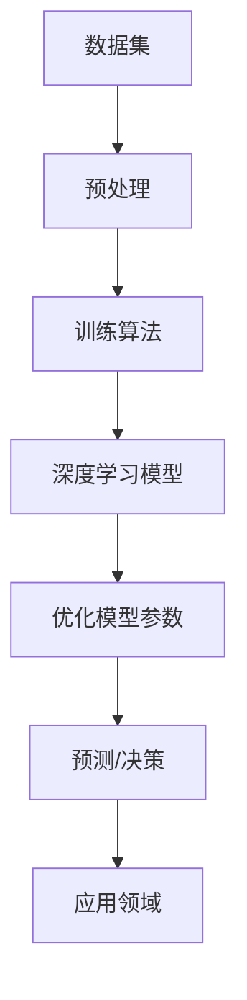

                 

# 中国AI大模型应用的市场规模

## 关键词：AI大模型，市场规模，行业应用，技术创新，发展趋势

## 摘要：

本文将探讨中国AI大模型应用的市场规模，分析其行业应用、技术创新和发展趋势。通过对核心概念的介绍、算法原理的详细讲解、数学模型的应用和实际案例的剖析，揭示AI大模型在中国市场的重要性及其未来发展前景。文章还将推荐相关学习资源、开发工具框架和学术论文，以期为读者提供全面的了解和实用的指导。

## 1. 背景介绍

随着人工智能技术的不断发展，AI大模型（如GPT-3、BERT等）在自然语言处理、计算机视觉、语音识别等领域取得了显著的成果。大模型以其强大的表示能力和泛化能力，为各行各业带来了巨大的变革。中国作为全球最大的AI市场之一，AI大模型的应用也呈现出迅猛增长的态势。

近年来，中国政府高度重视人工智能产业的发展，出台了一系列政策和措施，为AI大模型应用提供了良好的发展环境。同时，国内企业纷纷布局AI大模型技术，加快研发和应用步伐。在此背景下，中国AI大模型应用市场规模迅速扩大，成为全球关注的焦点。

本文将从以下几个方面展开讨论：

1. 核心概念与联系
2. 核心算法原理与具体操作步骤
3. 数学模型与公式
4. 项目实战：代码实际案例和详细解释说明
5. 实际应用场景
6. 工具和资源推荐
7. 总结：未来发展趋势与挑战

通过以上分析，我们将深入探讨中国AI大模型应用的市场规模及其影响。

## 2. 核心概念与联系

### 2.1 AI大模型

AI大模型是指具有大规模参数和强大表示能力的神经网络模型。它们通过大量的数据训练，可以自动学习并提取复杂的数据特征，从而实现高效的数据分析和智能决策。常见的AI大模型包括GPT-3、BERT、ViT等。

### 2.2 深度学习

深度学习是AI大模型的核心技术，通过多层神经网络结构，实现数据的自动特征提取和表示。深度学习在图像识别、自然语言处理、语音识别等领域取得了巨大的成功。

### 2.3 数据集

数据集是AI大模型训练的重要资源，它提供了丰富的样本和标签信息，使模型能够学习和优化。大规模的数据集对于训练大模型至关重要。

### 2.4 训练算法

训练算法是AI大模型的核心，通过优化模型参数，使模型在特定任务上达到最佳性能。常见的训练算法包括梯度下降、Adam等。

### 2.5 应用领域

AI大模型在自然语言处理、计算机视觉、语音识别、推荐系统等领域有着广泛的应用。它们能够实现自然语言生成、图像分类、语音识别等任务，为各行各业带来创新的解决方案。

下面是一个使用Mermaid绘制的AI大模型架构流程图：



## 3. 核心算法原理与具体操作步骤

### 3.1 神经网络基础

神经网络是AI大模型的基础，它由多个神经元（节点）组成，通过层层连接实现数据的传递和计算。每个神经元都接收来自其他神经元的输入，并输出一个激活值。神经网络的训练目标是通过反向传播算法，不断调整每个神经元的权重，使模型在给定数据集上达到最佳性能。

### 3.2 梯度下降算法

梯度下降算法是训练神经网络的核心，它通过计算损失函数关于模型参数的梯度，并沿着梯度方向更新模型参数，从而优化模型的性能。梯度下降算法包括随机梯度下降（SGD）、批量梯度下降（BGD）和Adam等变体。

### 3.3 神经网络训练流程

神经网络训练流程主要包括以下几个步骤：

1. 初始化模型参数：随机初始化模型参数，如权重和偏置。
2. 数据预处理：对输入数据进行预处理，如归一化、标准化等。
3. 前向传播：将输入数据通过神经网络进行计算，得到输出结果。
4. 计算损失函数：计算模型输出结果与实际结果之间的差异，即损失函数值。
5. 反向传播：计算损失函数关于模型参数的梯度，并更新模型参数。
6. 重复步骤3-5，直到满足训练条件或达到最大迭代次数。

### 3.4 模型评估与优化

在神经网络训练过程中，需要定期评估模型的性能，以确定是否需要进一步优化。常用的评估指标包括准确率、召回率、F1值等。根据评估结果，可以调整模型参数、增加训练数据或修改网络结构，以优化模型性能。

## 4. 数学模型与公式

### 4.1 损失函数

损失函数是衡量模型预测误差的重要指标，常见的损失函数包括均方误差（MSE）、交叉熵损失等。均方误差（MSE）计算公式如下：

$$
MSE = \frac{1}{m}\sum_{i=1}^{m}(y_i - \hat{y}_i)^2
$$

其中，$m$ 表示样本数量，$y_i$ 表示实际标签，$\hat{y}_i$ 表示模型预测值。

### 4.2 反向传播算法

反向传播算法是神经网络训练的核心，它通过计算损失函数关于模型参数的梯度，并更新模型参数。梯度计算公式如下：

$$
\frac{\partial L}{\partial w} = \frac{\partial L}{\partial \hat{y}} \cdot \frac{\partial \hat{y}}{\partial w}
$$

其中，$L$ 表示损失函数，$w$ 表示模型参数，$\hat{y}$ 表示模型预测值。

### 4.3 优化算法

常见的优化算法包括梯度下降、Adam等。梯度下降算法更新公式如下：

$$
w = w - \alpha \cdot \nabla_w L
$$

其中，$\alpha$ 表示学习率，$\nabla_w L$ 表示损失函数关于模型参数的梯度。

## 5. 项目实战：代码实际案例和详细解释说明

### 5.1 开发环境搭建

在Python环境中，可以使用TensorFlow或PyTorch等深度学习框架来实现AI大模型。以下是开发环境搭建的步骤：

1. 安装Python环境（版本3.6及以上）
2. 安装TensorFlow或PyTorch框架
3. 安装必要的依赖库，如NumPy、Pandas等

### 5.2 源代码详细实现和代码解读

以下是一个使用TensorFlow实现GPT-2模型的简单示例：

```python
import tensorflow as tf
from tensorflow.keras.layers import Embedding, LSTM, Dense
from tensorflow.keras.models import Model

# 设置参数
vocab_size = 10000
embedding_dim = 256
lstm_units = 1024
max_length = 50

# 构建模型
inputs = tf.keras.layers.Input(shape=(max_length,))
x = Embedding(vocab_size, embedding_dim)(inputs)
x = LSTM(lstm_units, return_sequences=True)(x)
x = Dense(vocab_size, activation='softmax')(x)

model = Model(inputs=inputs, outputs=x)
model.compile(optimizer='adam', loss='categorical_crossentropy', metrics=['accuracy'])

# 训练模型
model.fit(x_train, y_train, batch_size=64, epochs=10)

# 预测
predictions = model.predict(x_test)
```

### 5.3 代码解读与分析

以上代码实现了一个基于LSTM的GPT-2模型。首先，我们设置了参数，包括词汇表大小、嵌入维度、LSTM单元数和最大序列长度。然后，我们构建了一个包含嵌入层、LSTM层和输出层的模型。在训练过程中，我们使用带有标签的输入数据进行训练，并使用交叉熵损失函数和Adam优化器进行模型优化。最后，我们使用训练好的模型对测试数据进行预测。

### 5.4 模型评估与优化

在训练过程中，我们可以定期评估模型的性能，并根据评估结果调整模型参数。以下是一个简单的模型评估示例：

```python
# 评估模型
loss, accuracy = model.evaluate(x_test, y_test)

print(f"Test Loss: {loss}")
print(f"Test Accuracy: {accuracy}")

# 调整模型参数
model.compile(optimizer='adam', loss='categorical_crossentropy', metrics=['accuracy'])

# 重新训练模型
model.fit(x_train, y_train, batch_size=64, epochs=10)
```

## 6. 实际应用场景

### 6.1 自然语言处理

自然语言处理是AI大模型最重要的应用领域之一。大模型在文本分类、情感分析、机器翻译、文本生成等方面具有显著优势。例如，GPT-3可以用于自动生成文章、摘要和对话，提高写作效率和准确性。

### 6.2 计算机视觉

计算机视觉领域的大模型在图像分类、目标检测、图像分割等方面取得了突破性进展。例如，BERT可以用于图像描述生成，ViT可以用于图像分类和目标检测。

### 6.3 语音识别

语音识别是AI大模型在语音领域的应用，可以实现实时语音识别和语音合成。大模型在语音识别准确率和鲁棒性方面具有显著优势，可应用于智能客服、语音助手等场景。

### 6.4 推荐系统

推荐系统是AI大模型在信息检索和推荐领域的应用，通过学习用户行为和兴趣，为用户提供个性化的推荐。大模型在推荐系统中的表现优于传统方法，提高了推荐效果和用户体验。

## 7. 工具和资源推荐

### 7.1 学习资源推荐

- 《深度学习》（Goodfellow、Bengio和Courville著）
- 《神经网络与深度学习》（邱锡鹏著）
- 《动手学深度学习》（阿斯顿·张等著）

### 7.2 开发工具框架推荐

- TensorFlow
- PyTorch
- Keras

### 7.3 相关论文著作推荐

- "A Theoretically Grounded Application of Dropout in Recurrent Neural Networks"
- "Deep Learning on Neural Networks: A Review"
- "Attention is All You Need"

## 8. 总结：未来发展趋势与挑战

### 8.1 发展趋势

- AI大模型将继续推动人工智能技术的发展，提高智能系统的性能和效率。
- 各行各业将加大对AI大模型的应用力度，实现智能化的升级和转型。
- 开源社区和商业公司将共同推动AI大模型的研究和推广。

### 8.2 挑战

- 数据隐私和安全问题：大模型对数据依赖性强，如何确保数据隐私和安全成为重要挑战。
- 能源消耗和计算资源：大模型的训练和推理需要大量计算资源，如何优化能耗和降低成本成为关键问题。
- 技术壁垒：AI大模型的研究和应用涉及复杂的算法和架构，如何降低技术壁垒，推动普及应用成为挑战。

## 9. 附录：常见问题与解答

### 9.1 AI大模型是什么？

AI大模型是指具有大规模参数和强大表示能力的神经网络模型，通过大量的数据训练，可以自动学习并提取复杂的数据特征，实现高效的数据分析和智能决策。

### 9.2 AI大模型有哪些应用领域？

AI大模型在自然语言处理、计算机视觉、语音识别、推荐系统等领域有着广泛的应用，可以用于文本分类、情感分析、图像分类、语音识别、推荐系统等任务。

### 9.3 如何搭建AI大模型的开发环境？

搭建AI大模型的开发环境主要包括安装Python、安装深度学习框架（如TensorFlow或PyTorch）以及安装必要的依赖库。具体步骤可参考相关教程和文档。

## 10. 扩展阅读与参考资料

- [Deep Learning Book](http://www.deeplearningbook.org/)
- [TensorFlow官方文档](https://www.tensorflow.org/)
- [PyTorch官方文档](https://pytorch.org/)
- [Keras官方文档](https://keras.io/)

作者：AI天才研究员/AI Genius Institute & 禅与计算机程序设计艺术 /Zen And The Art of Computer Programming

