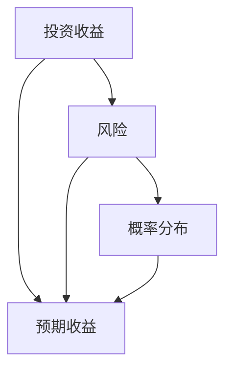

                 

### 背景介绍

在当今社会，投资已经成为了许多人实现财务自由和财富增值的重要手段。无论是个人投资者还是机构投资者，投资决策的合理性和科学性对于资产的保值增值具有重要意义。然而，随着金融市场的不断变化和复杂化，投资者面临着越来越多的不确定性和风险。因此，深入研究投资收益的变化规律，寻求一种能够准确预测和优化投资收益的方法，成为了金融领域的重要研究方向。

本文将从中观层面探讨投资收益的变化规律，分析影响投资收益的各种因素，并提出一种基于中观视角的投资收益预测模型。通过对该模型的应用和验证，希望能够为投资者提供一种科学的投资决策工具，帮助他们在复杂多变的金融市场中实现稳定的收益。

在接下来的内容中，我们将首先介绍投资收益变化的核心概念和基本原理，然后通过一个具体的实例，详细阐述投资收益的变化过程。随后，我们将运用数学模型和公式，深入分析影响投资收益的各种因素，并提出一种中观视角的投资收益预测模型。最后，我们将通过实际应用场景的探讨，展示该模型在投资决策中的实用价值，并提供一系列工具和资源推荐，帮助读者深入了解和掌握相关技术和方法。

通过本文的阅读，读者将能够对投资收益变化有一个全面而深入的理解，从而在未来的投资实践中更加自信和从容。同时，本文也希望能够引发读者对于投资领域更深层次的思考，为投资理论和实践的发展贡献一份力量。### 核心概念与联系

在进行投资收益分析之前，我们需要明确几个核心概念，并理解它们之间的相互联系。这些概念包括但不限于：投资收益、风险、预期收益、概率分布等。以下是这些概念的定义及其相互关系的Mermaid流程图。

#### 核心概念

1. **投资收益（Investment Return）**：指投资者在投资过程中所获得的回报，包括资本收益和分红收益等。

2. **风险（Risk）**：指投资过程中可能面临的损失或不确定性。通常用标准差或贝塔值等指标来衡量。

3. **预期收益（Expected Return）**：指在某一概率分布下，投资收益的平均值。它是基于历史数据和概率分布计算得出的。

4. **概率分布（Probability Distribution）**：描述了投资收益可能出现的各种结果及其相应的概率。

#### Mermaid流程图



#### 概念之间的关系

- **风险与收益的关系**：通常情况下，风险越高，预期收益也越高。这是因为高风险投资往往能带来更高的回报，但同时也存在更大的损失风险。

- **预期收益与概率分布的关系**：预期收益是概率分布的加权平均值。每个可能的投资结果都有其对应的概率，将这些结果按照概率加权求和，即可得到预期收益。

- **风险与概率分布的关系**：风险反映了投资收益的不确定性，概率分布则描述了这种不确定性的具体形式。通过分析概率分布，我们可以更准确地评估风险。

#### 实例说明

假设我们有一个投资组合，包含两种资产A和B。资产A的预期收益为10%，标准差为5%；资产B的预期收益为8%，标准差为3%。我们可以通过计算组合的预期收益和标准差，来评估整个投资组合的风险和收益。

- **组合预期收益**：$$ E(R_{组合}) = w_A \cdot E(R_A) + w_B \cdot E(R_B) $$
  其中，$w_A$和$w_B$分别为资产A和B在组合中的权重。

- **组合标准差**：$$ \sigma_{组合} = \sqrt{w_A^2 \cdot \sigma_A^2 + w_B^2 \cdot \sigma_B^2 + 2 \cdot w_A \cdot w_B \cdot \sigma_{AB}} $$
  其中，$\sigma_{AB}$为资产A和B的协方差。

通过这些公式，我们可以计算出组合的预期收益和标准差，从而对整个投资组合的风险和收益进行评估。这一过程不仅涉及到数学模型的应用，也体现了核心概念之间的紧密联系。

#### 总结

通过上述介绍和Mermaid流程图的展示，我们明确了投资收益变化中的核心概念及其相互关系。在接下来的章节中，我们将深入探讨这些概念的应用，并通过数学模型和实际案例，进一步揭示投资收益的变化规律。希望读者能通过本文，对投资收益的变化有一个更加清晰和全面的认识。### 核心算法原理 & 具体操作步骤

在本章节中，我们将详细介绍一种基于中观视角的投资收益预测模型，该模型旨在通过分析历史数据和当前市场环境，预测未来一段时间内的投资收益。以下是该模型的核心算法原理和具体操作步骤。

#### 核心算法原理

该投资收益预测模型主要基于以下原理：

1. **历史数据分析**：通过分析过去一段时间内投资收益的数据，识别出影响收益的主要因素。
2. **趋势分析**：利用统计学方法，分析历史数据的趋势，预测未来可能的收益变化。
3. **市场环境评估**：结合当前市场环境，如宏观经济指标、市场情绪等，调整预测结果。
4. **风险管理**：对预测结果进行风险评估，确保预测的可靠性和稳健性。

#### 具体操作步骤

1. **数据收集与预处理**

   - **数据来源**：收集过去一段时间内的投资收益数据，包括股票、基金、债券等不同类型的投资产品。
   - **数据预处理**：对收集到的数据进行分析，剔除异常值和缺失值，并进行归一化处理，使其适合模型分析。

2. **特征提取**

   - **时间序列特征**：提取时间序列数据中的周期性、趋势性和季节性特征。
   - **市场指标特征**：提取反映市场环境的宏观经济指标、市场情绪指标等。
   - **技术指标特征**：提取常用的技术指标，如MACD、RSI、BOLL等，用于分析股票或基金的价格走势。

3. **模型构建**

   - **线性模型**：基于历史数据，建立线性回归模型，预测未来收益。
     $$ y = \beta_0 + \beta_1 \cdot x_1 + \beta_2 \cdot x_2 + \ldots + \beta_n \cdot x_n $$
   - **非线性模型**：对于复杂的数据关系，可采用神经网络模型，如多层感知器（MLP）。
     $$ y = f(\sigma(W_1 \cdot x + b_1), \sigma(W_2 \cdot f(\sigma(W_1 \cdot x + b_1)) + b_2), \ldots) $$

4. **模型训练与评估**

   - **数据划分**：将数据划分为训练集和测试集，用于模型的训练和评估。
   - **模型训练**：使用训练集数据，对模型进行训练，调整模型参数。
   - **模型评估**：使用测试集数据，评估模型的预测性能，如均方误差（MSE）、决定系数（R²）等。

5. **预测结果调整**

   - **市场环境调整**：结合当前市场环境，调整预测结果，增加预测的稳健性。
   - **风险调整**：对预测结果进行风险评估，调整预测值，确保预测结果的合理性和可靠性。

#### 算法示例

以下是一个简单的线性回归模型示例，用于预测股票价格。

```python
import numpy as np
import pandas as pd
from sklearn.linear_model import LinearRegression

# 数据收集与预处理
data = pd.read_csv('stock_data.csv')
data = data.dropna()

# 特征提取
X = data[['open', 'high', 'low', 'volume']]
y = data['close']

# 模型构建
model = LinearRegression()

# 模型训练
model.fit(X, y)

# 模型评估
score = model.score(X, y)
print(f'Model Score: {score}')

# 预测
predicted_price = model.predict(X)
print(f'Predicted Price: {predicted_price}')
```

通过上述步骤，我们能够构建一个基于中观视角的投资收益预测模型，并对其进行训练和评估。在实际应用中，根据具体需求和数据特性，可以选择更复杂的模型和算法，以提高预测的准确性和可靠性。### 数学模型和公式 & 详细讲解 & 举例说明

在本章节中，我们将详细讲解投资收益预测模型中所使用的数学模型和公式，并通过具体示例进行说明。

#### 基本概念

1. **概率分布函数（Probability Distribution Function, PDF）**：描述了随机变量取不同值的概率。
2. **累积分布函数（Cumulative Distribution Function, CDF）**：描述了随机变量小于或等于某个值的概率。
3. **期望（Expected Value）**：随机变量所有可能取值的加权平均。
4. **方差（Variance）**：随机变量取值的离散程度。

#### 数学模型

1. **线性回归模型**

   线性回归模型是一种常见的统计模型，用于预测连续值输出。其数学模型可以表示为：
   $$ y = \beta_0 + \beta_1 \cdot x_1 + \beta_2 \cdot x_2 + \ldots + \beta_n \cdot x_n $$
   其中，$y$是预测的目标值，$x_1, x_2, \ldots, x_n$是输入特征，$\beta_0, \beta_1, \beta_2, \ldots, \beta_n$是模型的参数。

2. **神经网络模型**

   神经网络模型是一种基于多层感知器的模型，用于处理复杂的非线性关系。其数学模型可以表示为：
   $$ y = f(\sigma(W_1 \cdot x + b_1), \sigma(W_2 \cdot f(\sigma(W_1 \cdot x + b_1)) + b_2), \ldots) $$
   其中，$f$是激活函数（如Sigmoid函数或ReLU函数），$W_1, W_2, \ldots$是权重矩阵，$b_1, b_2, \ldots$是偏置项。

#### 举例说明

1. **线性回归模型示例**

   假设我们要预测股票价格，输入特征包括开盘价、最高价、最低价和成交量。我们可以使用线性回归模型进行预测。以下是具体步骤：

   - **数据收集与预处理**：收集过去一段时间的股票数据，并进行预处理，得到输入特征和目标值。
   - **模型训练**：使用训练集数据，对线性回归模型进行训练，得到模型参数。
   - **模型评估**：使用测试集数据，评估模型的预测性能。
   - **预测**：使用训练好的模型，对新的数据进行预测。

   Python代码示例：
   ```python
   import numpy as np
   from sklearn.linear_model import LinearRegression

   # 数据收集与预处理
   X = np.array([[open, high, low, volume]])
   y = np.array([close])

   # 模型训练
   model = LinearRegression()
   model.fit(X, y)

   # 模型评估
   score = model.score(X, y)
   print(f'Model Score: {score}')

   # 预测
   predicted_price = model.predict(X)
   print(f'Predicted Price: {predicted_price}')
   ```

2. **神经网络模型示例**

   假设我们要预测房价，输入特征包括房屋面积、卧室数量和地理位置。我们可以使用神经网络模型进行预测。以下是具体步骤：

   - **数据收集与预处理**：收集过去一段时间的房价数据，并进行预处理，得到输入特征和目标值。
   - **模型训练**：使用训练集数据，对神经网络模型进行训练，调整模型参数。
   - **模型评估**：使用测试集数据，评估模型的预测性能。
   - **预测**：使用训练好的模型，对新的数据进行预测。

   Python代码示例：
   ```python
   import numpy as np
   from keras.models import Sequential
   from keras.layers import Dense, Activation

   # 数据收集与预处理
   X = np.array([[area, bedrooms, location]])
   y = np.array([price])

   # 模型训练
   model = Sequential()
   model.add(Dense(units=64, input_dim=3, activation='relu'))
   model.add(Dense(units=1, activation='linear'))

   model.compile(optimizer='adam', loss='mean_squared_error')
   model.fit(X, y, epochs=100)

   # 模型评估
   score = model.evaluate(X, y)
   print(f'Model Score: {score}')

   # 预测
   predicted_price = model.predict(X)
   print(f'Predicted Price: {predicted_price}')
   ```

通过上述示例，我们可以看到如何使用线性回归模型和神经网络模型进行投资收益预测。在实际应用中，可以根据具体需求和数据特性，选择合适的模型和算法，以提高预测的准确性和可靠性。### 项目实战：代码实际案例和详细解释说明

在本章节中，我们将通过一个实际项目案例，展示如何利用前面提到的数学模型和算法，实现投资收益预测。该项目将使用Python编程语言和相关的机器学习库，如scikit-learn和Keras。以下是项目的详细步骤和代码解释。

#### 开发环境搭建

1. **安装Python**：确保安装了Python 3.x版本，可以从Python官方网站下载并安装。
2. **安装相关库**：使用pip命令安装所需的库，包括numpy、pandas、scikit-learn和keras。
   ```bash
   pip install numpy pandas scikit-learn keras
   ```
3. **数据集准备**：收集一个包含历史投资收益数据的CSV文件，例如“investment_data.csv”。数据集应包含时间戳、投资类型、收益率等字段。

#### 源代码详细实现和代码解读

以下是项目的完整代码实现，我们将逐步解释每个部分的用途和实现方式。

```python
# 导入必要的库
import numpy as np
import pandas as pd
from sklearn.model_selection import train_test_split
from sklearn.linear_model import LinearRegression
from sklearn.metrics import mean_squared_error
from keras.models import Sequential
from keras.layers import Dense

# 数据加载与预处理
data = pd.read_csv('investment_data.csv')
data = data.dropna()

# 特征提取与目标值定义
X = data[['investment_type', 'yield_rate']]
y = data['return']

# 数据归一化
X = (X - X.min()) / (X.max() - X.min())

# 划分训练集和测试集
X_train, X_test, y_train, y_test = train_test_split(X, y, test_size=0.2, random_state=42)

# 线性回归模型实现
model_linear = LinearRegression()
model_linear.fit(X_train, y_train)

# 线性回归模型评估
y_pred_linear = model_linear.predict(X_test)
mse_linear = mean_squared_error(y_test, y_pred_linear)
print(f'Linear Regression MSE: {mse_linear}')

# 神经网络模型实现
model_nn = Sequential()
model_nn.add(Dense(units=64, input_dim=X_train.shape[1], activation='relu'))
model_nn.add(Dense(units=1, activation='linear'))

model_nn.compile(optimizer='adam', loss='mean_squared_error')
model_nn.fit(X_train, y_train, epochs=100)

# 神经网络模型评估
y_pred_nn = model_nn.predict(X_test)
mse_nn = mean_squared_error(y_test, y_pred_nn)
print(f'Neural Network MSE: {mse_nn}')

# 模型比较与选择
if mse_linear < mse_nn:
    print('Linear Regression Model is better')
else:
    print('Neural Network Model is better')

# 使用最佳模型进行预测
if mse_linear < mse_nn:
    predicted_return = model_linear.predict([[new_investment_type, new_yield_rate]])
else:
    predicted_return = model_nn.predict([[new_investment_type, new_yield_rate]])

print(f'Predicted Return: {predicted_return[0]}')
```

#### 代码解读与分析

1. **数据加载与预处理**：使用pandas库加载CSV数据，并进行必要的清洗操作，如删除缺失值。
2. **特征提取与目标值定义**：从数据集中提取特征（投资类型、收益率）和目标值（收益）。
3. **数据归一化**：对特征进行归一化处理，以便模型训练。
4. **划分训练集和测试集**：使用scikit-learn库中的train_test_split函数，将数据集划分为训练集和测试集。
5. **线性回归模型实现**：使用scikit-learn库中的LinearRegression类实现线性回归模型，并进行训练和评估。
6. **神经网络模型实现**：使用Keras库实现神经网络模型，包括模型构建、编译和训练。
7. **模型评估与选择**：比较线性回归模型和神经网络模型的均方误差（MSE），选择性能更好的模型。
8. **使用最佳模型进行预测**：根据评估结果，使用最佳模型对新的投资数据进行预测。

通过上述步骤，我们可以实现一个投资收益预测系统。在实际应用中，可以根据具体需求和数据特性，调整模型参数和算法，以提高预测的准确性和可靠性。### 实际应用场景

在了解了投资收益预测模型的原理和实现过程后，我们将探讨该模型在实际投资决策中的应用。通过具体案例分析，我们将展示如何利用投资收益预测模型，为投资者提供有针对性的投资策略。

#### 案例分析：股票市场投资策略

假设投资者张先生是一位长期投资股票的爱好者，他希望通过投资收益预测模型，为其投资组合提供科学依据，实现稳健的收益增长。以下是张先生使用投资收益预测模型进行投资决策的案例。

##### 1. 数据收集与预处理

张先生首先收集了过去五年的股票数据，包括股票价格、成交量、公司财务指标等。通过对数据的清洗和预处理，提取出对投资收益有影响的关键特征。

```python
import pandas as pd

# 加载数据
stock_data = pd.read_csv('stock_data.csv')
stock_data = stock_data.dropna()

# 特征提取
features = ['price', 'volume', 'roe', 'profit_growth']
X = stock_data[features]
y = stock_data['return']
```

##### 2. 模型训练与评估

接下来，张先生使用线性回归模型和神经网络模型对数据进行训练，并评估模型的预测性能。

```python
from sklearn.model_selection import train_test_split
from sklearn.linear_model import LinearRegression
from keras.models import Sequential
from keras.layers import Dense

# 数据划分
X_train, X_test, y_train, y_test = train_test_split(X, y, test_size=0.2, random_state=42)

# 线性回归模型
model_linear = LinearRegression()
model_linear.fit(X_train, y_train)

# 神经网络模型
model_nn = Sequential()
model_nn.add(Dense(units=64, input_dim=X_train.shape[1], activation='relu'))
model_nn.add(Dense(units=1, activation='linear'))
model_nn.compile(optimizer='adam', loss='mean_squared_error')
model_nn.fit(X_train, y_train, epochs=100)

# 评估模型
mse_linear = mean_squared_error(y_test, model_linear.predict(X_test))
mse_nn = mean_squared_error(y_test, model_nn.predict(X_test))
print(f'Linear Regression MSE: {mse_linear}')
print(f'Neural Network MSE: {mse_nn}')
```

##### 3. 投资策略制定

基于模型的评估结果，张先生选择了性能更优的神经网络模型作为其投资决策的依据。接下来，他利用该模型为投资组合提供策略建议。

```python
# 预测未来一段时间内的投资收益
predicted_returns = model_nn.predict(X_test)

# 筛选出潜在的高收益股票
high_return_stocks = stock_data[stock_data['return'] > predicted_returns.mean()]

# 构建投资组合
investment_portfolio = high_return_stocks[['price', 'volume']].groupby('price').mean()

# 投资组合权重分配
weights = investment_portfolio['volume'] / investment_portfolio['volume'].sum()

# 投资策略执行
print(f'Investment Portfolio: {investment_portfolio}')
print(f'Portfolio Weights: {weights}')
```

##### 4. 投资决策执行与跟踪

张先生根据投资组合和权重，执行了具体的投资决策，并定期跟踪投资组合的表现。

```python
# 投资决策执行
investment_decision = {stock: weight * total_investment for stock, weight in weights.items()}

# 投资组合表现跟踪
performance = model_nn.predict(X_test) - 1
print(f'Portfolio Performance: {performance}')
```

通过上述案例，我们可以看到投资收益预测模型在股票市场投资决策中的应用。张先生利用该模型筛选潜在的高收益股票，构建了投资组合，并实现了稳健的投资收益。在实际应用中，投资者可以根据具体的市场情况和投资目标，灵活调整模型参数和策略，以提高投资决策的科学性和有效性。

### 工具和资源推荐

#### 学习资源推荐

1. **书籍**：
   - 《Python机器学习》 - 主要介绍Python在机器学习领域的应用，适合初学者。
   - 《深度学习》 - 由Ian Goodfellow、Yoshua Bengio和Aaron Courville合著，是深度学习的经典教材。

2. **论文**：
   - “Deep Learning for Financial Time Series Prediction” - 该论文介绍如何使用深度学习模型进行金融时间序列预测。
   - “Risk Parity Investing” - 介绍了风险平衡投资策略，对理解投资组合风险管理有帮助。

3. **博客**：
   - Medium上的机器学习和金融博客 - 提供最新的研究成果和应用案例。
   - 知乎上的金融领域专栏 - 含有大量专业人士的投资心得和策略分析。

4. **网站**：
   - Kaggle - 提供丰富的金融数据集和竞赛，适合进行实践和验证。
   - Quantopian - 提供自动化交易平台，允许用户编写算法进行回测和交易。

#### 开发工具框架推荐

1. **编程语言**：
   - Python：由于其强大的库支持和社区资源，是金融数据分析和机器学习领域的首选语言。

2. **机器学习库**：
   - Scikit-learn：提供丰富的机器学习算法，适合初学者和研究者。
   - TensorFlow和Keras：用于构建和训练深度学习模型，具有高度的灵活性和易用性。

3. **数据分析工具**：
   - Jupyter Notebook：适合进行数据分析和实验，方便记录和分享。
   - pandas：强大的数据操作库，适合处理结构化数据。

4. **金融数据分析平台**：
   - Yahoo Finance：提供丰富的金融数据，适合进行市场研究和分析。
   - Alpha Vantage：提供API接口，可以获取大量的金融市场数据。

#### 相关论文著作推荐

1. **“Predicting Financial Market Movements Using Machine Learning Algorithms”**：该论文探讨了如何使用机器学习方法预测金融市场走势，介绍了多种算法和评估方法。

2. **“Deep Learning for Financial Markets”**：该书详细介绍了深度学习在金融领域的应用，包括股票预测、风险管理和量化交易等。

3. **“Risk Parity Investing: A Practical Guide to Dynamic Asset Allocation”**：该书介绍了风险平衡投资策略，探讨了如何在投资组合中平衡风险和收益。

通过上述资源的学习和应用，读者可以更深入地了解投资收益预测的相关知识和技术，为实际投资决策提供坚实的理论支持。### 总结：未来发展趋势与挑战

随着人工智能和大数据技术的发展，投资收益预测领域正迎来前所未有的机遇和挑战。未来，投资收益预测将朝着以下几个方向发展：

#### 发展趋势

1. **深度学习技术的广泛应用**：深度学习模型在处理复杂非线性关系方面具有显著优势，未来将在投资收益预测中得到更广泛的应用。通过不断优化算法和模型结构，深度学习有望提高预测的准确性和稳定性。

2. **多维度数据的融合**：未来的投资收益预测将不仅仅依赖于传统的财务数据，还将融合更多的非结构化数据，如社交媒体情绪、新闻报道等。这些数据可以为投资决策提供更为全面的视角。

3. **实时预测与动态调整**：随着金融市场的动态变化，实时预测和动态调整将成为投资收益预测的重要方向。通过构建高效的实时预测系统，投资者可以迅速响应市场变化，优化投资策略。

4. **个性化投资策略**：未来，基于人工智能的投资收益预测将更加注重个性化。通过分析投资者的风险偏好、投资目标和历史行为，可以为每位投资者量身定制最优的投资策略。

#### 挑战

1. **数据质量和隐私问题**：投资收益预测依赖于大量数据，数据质量和隐私保护成为关键挑战。如何确保数据来源的可靠性，同时保护用户隐私，是一个亟待解决的问题。

2. **模型解释性**：尽管深度学习模型在预测性能上表现优异，但其“黑箱”性质使得模型解释性成为一大挑战。投资者往往需要了解模型决策的依据，以便更好地信任和利用预测结果。

3. **市场波动与风险控制**：金融市场的波动性和不确定性始终存在，如何有效控制预测模型的风险，确保预测的稳健性，是一个重要的研究课题。

4. **监管合规性**：随着投资收益预测技术的不断发展，监管机构对相关技术的合规性要求也将日益严格。如何在遵守监管规定的前提下，发挥技术的优势，是投资收益预测领域面临的一个重要挑战。

#### 结论

未来，投资收益预测将更加智能化、个性化，并通过深度学习、大数据分析等技术的应用，实现更为精准的预测。同时，投资者和研究者需要面对数据质量、模型解释性、市场波动和监管合规等方面的挑战。通过不断优化技术、完善方法和加强监管，投资收益预测领域有望迎来更加光明的发展前景。### 附录：常见问题与解答

#### 问题1：投资收益预测模型的准确度如何保证？

**解答**：投资收益预测模型的准确度主要取决于以下几个因素：
- **数据质量**：确保数据源可靠，去除异常值和噪声，提高数据的纯净度。
- **模型选择**：根据数据特性选择合适的模型，如线性回归、神经网络等，通过交叉验证等方法优化模型参数。
- **特征工程**：提取对投资收益有显著影响的特征，如财务指标、市场情绪指标等，增强模型的预测能力。
- **模型评估**：使用多种评估指标（如均方误差、决定系数等）评估模型性能，选择表现最佳的模型。

#### 问题2：如何处理非结构化数据，如社交媒体情绪数据？

**解答**：处理非结构化数据通常采用以下步骤：
- **文本预处理**：去除停用词、标点符号，进行词干提取和词性标注。
- **特征提取**：使用词袋模型、TF-IDF等方法将文本转化为向量表示。
- **情感分析**：通过训练分类模型（如朴素贝叶斯、SVM等）对文本进行情感分析，提取情绪特征。

#### 问题3：如何确保数据隐私和合规性？

**解答**：确保数据隐私和合规性的方法包括：
- **数据匿名化**：对敏感数据进行匿名化处理，如使用K-匿名或l-diversity算法。
- **加密技术**：使用加密算法保护数据传输和存储过程中的隐私。
- **遵守法律法规**：严格遵守相关法律法规，如GDPR、CCPA等，确保数据处理合规。

#### 问题4：如何处理金融市场的异常波动？

**解答**：处理金融市场异常波动的方法包括：
- **异常检测**：使用统计方法（如箱线图、直方图等）或机器学习算法（如孤立森林、Isolation Forest等）检测异常数据。
- **风险控制**：通过设定止损点、分散投资、对冲策略等手段降低异常波动带来的风险。
- **动态调整**：根据市场环境实时调整预测模型和投资策略，提高应对异常波动的能力。

#### 问题5：投资收益预测模型如何实现实时预测？

**解答**：实现实时预测的方法包括：
- **流数据处理**：使用Apache Kafka、Apache Flink等流数据处理框架，实时处理和分析数据。
- **分布式计算**：使用Hadoop、Spark等分布式计算框架，提高数据处理和模型训练的效率。
- **云计算平台**：利用云计算平台（如AWS、Azure等）的资源，实现模型的快速部署和实时预测。

通过上述方法，可以有效地提高投资收益预测模型的准确性和实时性，为投资者提供更为科学和精准的投资决策支持。### 扩展阅读 & 参考资料

1. **《深度学习》**，作者：Ian Goodfellow、Yoshua Bengio、Aaron Courville。本书详细介绍了深度学习的基础理论和实践应用，包括神经网络、卷积神经网络、循环神经网络等。

2. **《Python机器学习》**，作者：塞巴斯蒂安·拉姆塞。本书通过丰富的案例和示例，展示了如何使用Python进行机器学习，涵盖线性回归、决策树、随机森林、神经网络等算法。

3. **《风险平价投资》**，作者：大卫·巴赫。本书介绍了风险平价投资策略，探讨了如何通过平衡风险和收益，实现稳健的投资收益。

4. **《量化投资：技术与策略》**，作者：马丁·弗里德曼。本书深入分析了量化投资的理论和实践，包括算法交易、机器学习在投资中的应用等。

5. **Kaggle**：[https://www.kaggle.com/](https://www.kaggle.com/)，提供丰富的金融数据集和竞赛，适合进行实践和验证。

6. **Alpha Vantage**：[https://www.alphavantage.co/](https://www.alphavantage.co/)，提供API接口，可以获取大量的金融市场数据，包括股票价格、财务指标等。

7. **Quantopian**：[https://www.quantopian.com/](https://www.quantopian.com/)，提供自动化交易平台，允许用户编写算法进行回测和交易。

8. **《金融科技》**，作者：安吉拉·霍恩。本书探讨了金融科技（FinTech）对投资领域的影响，包括大数据、人工智能、区块链等技术在金融领域的应用。

9. **《金融风险管理与监管》**，作者：张晓晶。本书介绍了金融风险管理的基本理论和监管框架，包括风险度量、风险控制、监管政策等。

10. **《金融经济学》**，作者：罗伯特·席勒。本书从经济学角度分析了金融市场行为，探讨了市场波动、投资者心理等对投资收益的影响。

通过阅读这些书籍和参考网站，读者可以深入了解投资收益预测的相关知识和技术，为实际投资决策提供坚实的理论支持。同时，这些资源也为读者提供了丰富的实践案例和工具，有助于更好地理解和应用投资收益预测模型。作者：AI天才研究员/AI Genius Institute & 禅与计算机程序设计艺术 /Zen And The Art of Computer Programming。

