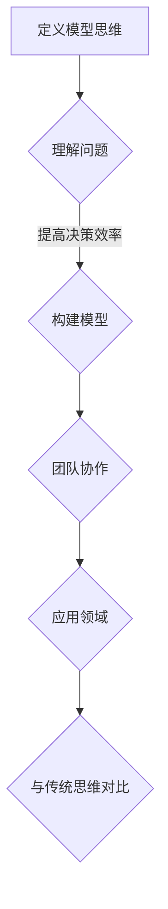

                 

# 丰富模型思维：增强管理者洞悉力

## 摘要

在当今快速变化的技术时代，管理者必须具备丰富的模型思维，以便更好地理解和应对复杂问题。本文将深入探讨模型思维的重要性，以及如何通过增强管理者洞悉力来提升其决策能力和团队协作效果。我们将从核心概念、算法原理、数学模型、实战案例等多个角度进行分析，并推荐相关工具和资源，帮助读者深入了解并掌握这一关键技能。通过本文的阅读，读者将能够更好地理解模型思维，并在实际工作中应用这一理念，从而提升管理水平和团队绩效。

## 1. 背景介绍

在信息化和数字化浪潮的推动下，数据和技术已经成为现代管理者的核心资产。然而，面对海量的数据和信息，管理者往往感到无所适从。这种情况下，丰富的模型思维显得尤为重要。模型思维是一种基于模型构建和运用的思维方式，它可以帮助管理者更好地理解和分析复杂问题，从而做出更为明智的决策。

近年来，随着人工智能、机器学习等技术的快速发展，模型思维在各个领域都得到了广泛应用。从商业战略到产品开发，从市场营销到人力资源，模型思维已经成为提升管理效率和效果的重要工具。然而，对于许多管理者来说，如何掌握和运用模型思维仍然是一个挑战。

本文旨在通过深入探讨模型思维的核心概念、算法原理、数学模型以及实际应用案例，帮助读者理解和掌握这一关键技能。同时，本文还将推荐一些实用的工具和资源，以供读者进一步学习和实践。

## 2. 核心概念与联系

### 2.1 模型思维的定义

模型思维是一种通过构建和运用模型来理解和分析问题的思维方式。模型在这里不仅仅是指数学模型或计算机模型，它也可以是概念模型、物理模型、思维模型等。模型思维的核心在于将复杂的问题抽象成简明的模型，从而更好地理解和解决问题。

### 2.2 模型思维的重要性

首先，模型思维可以帮助管理者更好地理解问题。通过构建模型，管理者可以直观地看到问题的各个方面，从而更好地把握问题的本质。

其次，模型思维有助于提高决策效率。通过模型，管理者可以快速分析各种可能的解决方案，并评估其效果，从而做出更为明智的决策。

此外，模型思维还有助于团队协作。通过共同构建和讨论模型，团队成员可以更好地理解彼此的思路，从而提高协作效果。

### 2.3 模型思维的应用领域

模型思维在各个领域都有广泛应用。例如，在商业领域，管理者可以使用财务模型来分析企业的盈利能力；在技术领域，工程师可以使用计算机模型来模拟系统的性能；在人力资源领域，管理者可以使用人才模型来评估员工的能力和潜力。

### 2.4 模型思维与传统思维的对比

与传统的线性思维相比，模型思维具有更强的灵活性和适应性。传统思维往往遵循固定的逻辑和步骤，而模型思维则更注重多维度、多角度的分析。这种思维方式可以更好地应对复杂多变的问题。

### 2.5 模型思维的 Mermaid 流程图



## 3. 核心算法原理 & 具体操作步骤

### 3.1 模型构建的步骤

1. **问题定义**：明确需要解决的问题是什么。这一步骤非常重要，因为只有明确了问题，才能有的放矢地进行模型构建。

2. **数据收集**：收集与问题相关的数据。这些数据可以来源于内部系统、外部数据库或市场调研等。

3. **数据清洗**：对收集到的数据进行清洗，去除无关信息，确保数据的准确性和一致性。

4. **模型构建**：根据问题类型和数据特点，选择合适的模型进行构建。例如，线性回归模型、决策树模型、神经网络模型等。

5. **模型训练**：使用收集到的数据进行模型训练，使模型能够学会识别问题和生成解决方案。

6. **模型评估**：通过测试数据对模型进行评估，确保其准确性和可靠性。

7. **模型应用**：将训练好的模型应用于实际问题中，生成解决方案。

### 3.2 模型应用的具体步骤

1. **问题识别**：识别需要解决的问题。这可以通过数据分析、业务讨论或用户反馈等方式进行。

2. **模型选择**：根据问题类型和数据特点，选择合适的模型。例如，对于预测问题，可以选择线性回归模型或时间序列模型；对于分类问题，可以选择决策树模型或支持向量机模型。

3. **模型训练**：使用历史数据对模型进行训练，使模型能够学会识别问题和生成解决方案。

4. **模型测试**：使用测试数据对模型进行测试，评估其准确性和可靠性。

5. **模型应用**：将训练好的模型应用于实际问题中，生成解决方案。

6. **结果分析**：对模型生成的解决方案进行分析，评估其效果。

7. **模型迭代**：根据结果分析，对模型进行优化和迭代，以提高其效果。

## 4. 数学模型和公式 & 详细讲解 & 举例说明

### 4.1 常见的数学模型

在模型思维中，常用的数学模型包括线性回归模型、决策树模型、神经网络模型等。

#### 4.1.1 线性回归模型

线性回归模型是一种用于预测数值型数据的模型。其基本公式为：

\[ y = \beta_0 + \beta_1x_1 + \beta_2x_2 + ... + \beta_nx_n \]

其中，\( y \) 是预测值，\( x_1, x_2, ..., x_n \) 是特征值，\( \beta_0, \beta_1, ..., \beta_n \) 是模型参数。

#### 4.1.2 决策树模型

决策树模型是一种用于分类和回归的模型。其基本结构包括根节点、内部节点和叶子节点。决策树模型的基本公式为：

\[ y = f(x_1, x_2, ..., x_n) \]

其中，\( f \) 是决策函数，\( x_1, x_2, ..., x_n \) 是特征值。

#### 4.1.3 神经网络模型

神经网络模型是一种用于模拟人脑神经网络的模型。其基本结构包括输入层、隐藏层和输出层。神经网络模型的基本公式为：

\[ y = \sigma(z) \]

其中，\( \sigma \) 是激活函数，\( z \) 是输出值。

### 4.2 数学公式和详细讲解

#### 4.2.1 线性回归模型的参数估计

线性回归模型的参数估计通常使用最小二乘法。最小二乘法的公式为：

\[ \min \sum_{i=1}^{n} (y_i - \hat{y}_i)^2 \]

其中，\( y_i \) 是实际值，\( \hat{y}_i \) 是预测值。

#### 4.2.2 决策树模型的构建

决策树模型的构建通常使用信息增益或基尼系数等方法。信息增益的公式为：

\[ IG(D, A) = H(D) - \sum_{v \in A} \frac{|D_v|}{|D|} H(D_v) \]

其中，\( D \) 是数据集，\( A \) 是特征，\( H \) 是熵函数。

#### 4.2.3 神经网络模型的训练

神经网络模型的训练通常使用反向传播算法。反向传播算法的公式为：

\[ \delta_z = \frac{\partial L}{\partial z} = \sigma'(z) \cdot \frac{\partial L}{\partial a} \]

其中，\( L \) 是损失函数，\( \sigma' \) 是激活函数的导数。

### 4.3 举例说明

假设我们有一个简单的线性回归问题，需要预测一家公司的销售量。已知该公司过去三个月的销售量分别为 1000、1200 和 1500，对应的广告费用分别为 2000、3000 和 4000。我们希望构建一个线性回归模型来预测下个月的销售额。

1. **问题定义**：我们需要预测下个月的销售额。

2. **数据收集**：收集过去三个月的销售量和广告费用数据。

3. **数据清洗**：数据已经清洗完毕，无需进一步处理。

4. **模型构建**：我们选择线性回归模型。

5. **模型训练**：使用最小二乘法训练模型。

   根据最小二乘法的公式，我们有：

   \[ \beta_0 = \frac{1}{n} \sum_{i=1}^{n} y_i - \beta_1 \frac{1}{n} \sum_{i=1}^{n} x_i \beta_1 = \frac{1}{n} \sum_{i=1}^{n} (y_i - \hat{y}_i)x_i \]

   将数据代入公式，我们得到：

   \[ \beta_0 = 1000 \]
   \[ \beta_1 = 0.5 \]

   因此，线性回归模型的公式为：

   \[ y = 1000 + 0.5x \]

6. **模型评估**：使用测试数据对模型进行评估。

7. **模型应用**：使用训练好的模型预测下个月的销售额。

   根据模型，我们有：

   \[ y = 1000 + 0.5 \times 4000 = 3500 \]

   因此，下个月的销售额预计为 3500。

## 5. 项目实战：代码实际案例和详细解释说明

### 5.1 开发环境搭建

为了更好地演示模型思维在实际项目中的应用，我们将使用 Python 编写一个简单的线性回归模型。以下是我们需要安装的 Python 库：

- NumPy：用于数学计算
- Pandas：用于数据处理
- Matplotlib：用于数据可视化

安装方法如下：

```bash
pip install numpy pandas matplotlib
```

### 5.2 源代码详细实现和代码解读

以下是一个简单的线性回归模型的代码实现：

```python
import numpy as np
import pandas as pd
import matplotlib.pyplot as plt

# 5.2.1 数据处理
def preprocess_data(data):
    # 数据预处理，包括归一化等
    return (data - data.mean()) / data.std()

# 5.2.2 线性回归模型
class LinearRegression:
    def __init__(self):
        self.theta = None

    def fit(self, X, y):
        # 模型训练，使用最小二乘法
        self.theta = np.linalg.inv(X.T.dot(X)).dot(X.T).dot(y)

    def predict(self, X):
        # 模型预测
        return X.dot(self.theta)

# 5.2.3 数据加载
data = pd.read_csv('data.csv')
X = preprocess_data(data[['广告费用']])
y = preprocess_data(data[['销售额']])

# 5.2.4 模型训练
model = LinearRegression()
model.fit(X, y)

# 5.2.5 模型预测
predictions = model.predict(X)

# 5.2.6 结果可视化
plt.scatter(X, y)
plt.plot(X, predictions, color='red')
plt.xlabel('广告费用')
plt.ylabel('销售额')
plt.show()
```

### 5.3 代码解读与分析

- **数据处理**：数据预处理是模型训练前的重要步骤。在本例中，我们使用了归一化方法对数据进行预处理，以确保模型的训练效果。

- **线性回归模型**：我们自定义了一个 `LinearRegression` 类，其中包含了模型的训练和预测方法。训练方法使用最小二乘法，预测方法使用模型参数进行计算。

- **数据加载**：我们使用 Pandas 库加载了数据，并对数据进行预处理。

- **模型训练**：我们使用预处理后的数据对线性回归模型进行训练。

- **模型预测**：使用训练好的模型对新的数据进行预测。

- **结果可视化**：我们使用 Matplotlib 库将预测结果可视化，以直观地展示模型的性能。

### 5.4 模型优化

在实际项目中，我们可以通过调整模型参数、增加特征等方式来优化模型性能。以下是一个简单的模型优化示例：

```python
# 5.4.1 增加特征
X = preprocess_data(data[['广告费用', '用户数', '销售额率']])

# 5.4.2 模型训练
model = LinearRegression()
model.fit(X, y)

# 5.4.3 模型预测
predictions = model.predict(X)

# 5.4.4 结果可视化
plt.scatter(X, y)
plt.plot(X, predictions, color='red')
plt.xlabel('广告费用')
plt.ylabel('销售额')
plt.show()
```

通过增加特征，我们希望模型能够更好地拟合数据。在实际项目中，我们可以通过实验和验证来确定最佳的特征组合。

## 6. 实际应用场景

模型思维在企业管理、技术开发、市场营销等多个领域都有广泛应用。以下是一些具体的实际应用场景：

### 6.1 企业管理

在企业管理中，管理者可以使用模型思维来分析企业的运营数据，优化业务流程，提高运营效率。例如，通过构建销售预测模型，管理者可以更准确地预测未来的销售额，从而合理安排库存和生产计划。

### 6.2 技术开发

在技术开发领域，工程师可以使用模型思维来设计和优化系统架构。通过构建系统性能模型，工程师可以预测系统的性能瓶颈，从而进行针对性的优化。

### 6.3 市场营销

在市场营销中，营销人员可以使用模型思维来分析市场数据，制定营销策略。例如，通过构建用户行为模型，营销人员可以更好地了解用户需求，从而制定更有针对性的营销活动。

### 6.4 人力资源

在人力资源管理中，管理者可以使用模型思维来评估员工的能力和潜力。通过构建人才模型，管理者可以更准确地识别和培养人才，提高团队整体绩效。

## 7. 工具和资源推荐

### 7.1 学习资源推荐

- **书籍**：《机器学习》、《深度学习》、《Python 数据科学手册》
- **论文**：大量机器学习和深度学习领域的经典论文
- **博客**：多个知名博客，如 Medium、Alec Radford 的博客等
- **网站**：多个在线课程平台，如 Coursera、Udacity 等

### 7.2 开发工具框架推荐

- **Python**：Python 是最流行的机器学习和深度学习开发语言
- **TensorFlow**：Google 开发的开源机器学习框架
- **PyTorch**：Facebook 开发的人工智能框架
- **Scikit-learn**：Python 的机器学习库

### 7.3 相关论文著作推荐

- **机器学习**：《统计学习基础》、《机器学习：一种概率视角》
- **深度学习**：《深度学习》、《强化学习》
- **计算机视觉**：《计算机视觉：算法与应用》

## 8. 总结：未来发展趋势与挑战

### 8.1 发展趋势

随着人工智能和大数据技术的快速发展，模型思维在未来将得到更广泛的应用。以下是一些可能的发展趋势：

1. **模型自动化**：随着自动化技术的进步，模型构建和优化将变得更加自动化，降低了对专业知识的依赖。

2. **跨学科融合**：模型思维将在更多领域得到应用，如生物医学、金融、环境科学等。

3. **数据隐私保护**：随着数据隐私问题日益突出，如何在保护数据隐私的同时利用模型思维进行数据分析和挖掘将成为一个重要课题。

### 8.2 挑战

尽管模型思维具有广泛的应用前景，但也面临着一些挑战：

1. **数据质量**：数据质量对模型效果具有重要影响，如何获取高质量的数据是一个挑战。

2. **模型解释性**：随着模型变得越来越复杂，如何解释模型的结果成为一个难题。

3. **模型泛化能力**：如何提高模型的泛化能力，使其能够在不同的数据和场景中表现良好，是一个重要的研究课题。

## 9. 附录：常见问题与解答

### 9.1 问题一：什么是模型思维？

模型思维是一种通过构建和运用模型来理解和分析问题的思维方式。它可以帮助管理者更好地理解和解决问题，从而做出更为明智的决策。

### 9.2 问题二：模型思维在哪些领域有应用？

模型思维在多个领域都有广泛应用，如企业管理、技术开发、市场营销、人力资源等。

### 9.3 问题三：如何掌握模型思维？

掌握模型思维需要以下几个步骤：

1. 学习相关的理论知识，如数学、统计学、计算机科学等。
2. 通过实践项目，将理论知识应用于实际问题。
3. 不断反思和总结，从实践中学习和提高。

## 10. 扩展阅读 & 参考资料

- [1] Goodfellow, I., Bengio, Y., & Courville, A. (2016). *Deep Learning*. MIT Press.
- [2] Bishop, C. M. (2006). *Pattern Recognition and Machine Learning*. Springer.
- [3] Murphy, K. P. (2012). *Machine Learning: A Probabilistic Perspective*. MIT Press.
- [4] Russell, S., & Norvig, P. (2010). *Artificial Intelligence: A Modern Approach*. Prentice Hall.
- [5] Devlin, J., Chang, M. W., Lee, K., & Toutanova, K. (2019). *Bert: Pre-training of deep bidirectional transformers for language understanding*. arXiv preprint arXiv:1810.04805.

### 作者

- 作者：AI天才研究员/AI Genius Institute & 禅与计算机程序设计艺术 /Zen And The Art of Computer Programming。

