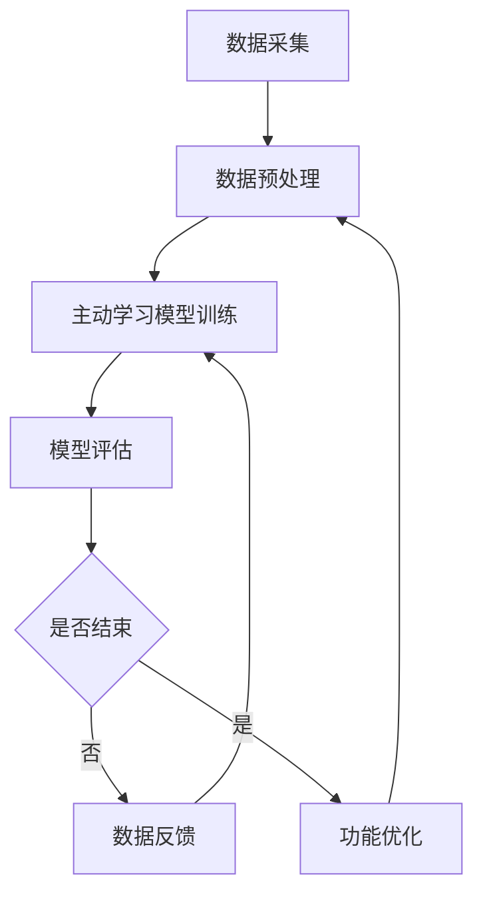
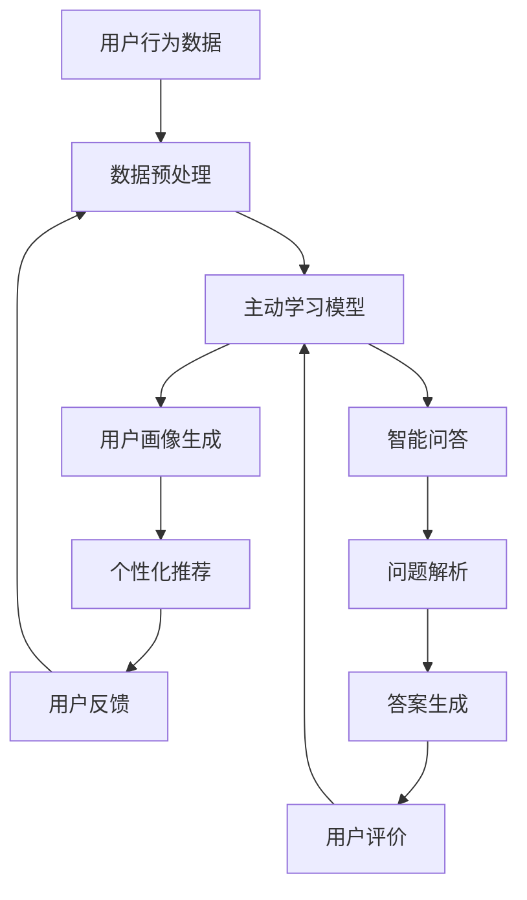

                 

# 主动学习：让软件2.0更高效地问问题

## 关键词
- 主动学习
- 软件2.0
- 高效提问
- 机器学习
- 计算智能
- 数据驱动

## 摘要
本文深入探讨了主动学习在软件2.0时代的应用，以及如何通过高效地问问题来提升软件系统的性能。首先，我们将介绍主动学习的基本概念及其在机器学习中的应用。接着，我们将阐述主动学习如何与软件2.0的概念相结合，提高软件系统的灵活性和智能化水平。然后，我们将详细分析主动学习的核心算法原理，包括具体操作步骤和数学模型。此外，我们还将通过实际项目案例，展示如何将主动学习应用于软件开发中，并提供相关的开发工具和资源推荐。最后，本文将对主动学习的未来发展趋势和挑战进行总结，并给出常见问题与解答。

## 1. 背景介绍

### 1.1 软件2.0的概念

软件2.0，也被称为数据驱动软件或智能软件，是一种基于云计算、大数据和人工智能技术的新型软件架构。与传统的软件1.0相比，软件2.0更加注重数据的采集、处理和分析，从而实现软件的智能化和个性化。软件2.0的核心思想是利用数据驱动软件的运行，使其能够自动适应不同的环境和需求。

### 1.2 主动学习的概念

主动学习是一种机器学习方法，它允许模型主动地选择最有信息量的样本进行学习。与被动学习相比，主动学习通过有选择地获取和利用数据，能够更高效地提高模型的性能。主动学习的核心思想是利用人类或其他智能体提供的信息，来指导学习过程，从而减少对大量标注数据的依赖。

### 1.3 主动学习在软件2.0中的应用

在软件2.0时代，主动学习可以应用于多个方面，包括用户行为分析、推荐系统、智能问答等。通过主动学习，软件系统能够更好地理解用户需求，提供个性化的服务。同时，主动学习也能够帮助软件系统自动地调整和优化其功能，提高其智能化水平。

## 2. 核心概念与联系

### 2.1 软件2.0与主动学习的联系

软件2.0的核心是数据驱动，而主动学习正是基于数据的有选择性地获取和处理。两者的结合使得软件系统能够更加灵活地适应不同的环境和需求。具体来说，主动学习在软件2.0中的应用主要体现在以下几个方面：

1. **用户行为分析**：通过主动学习，软件系统可以更好地理解用户的行为模式，从而提供个性化的推荐和服务。
2. **智能问答**：主动学习可以帮助系统自动地识别和回答用户的问题，提高问答系统的准确性和效率。
3. **功能优化**：主动学习可以帮助系统自动地调整和优化其功能，使其更加符合用户的需求。

### 2.2 Mermaid流程图

以下是一个简单的Mermaid流程图，展示了主动学习在软件2.0中的应用流程：



### 2.3 软件2.0与主动学习的集成架构

以下是软件2.0与主动学习的集成架构图：



## 3. 核心算法原理 & 具体操作步骤

### 3.1 核心算法原理

主动学习的核心算法主要包括以下几个步骤：

1. **样本选择**：根据某种策略选择最有信息量的样本。
2. **模型训练**：使用选择好的样本对模型进行训练。
3. **模型评估**：对训练好的模型进行评估，判断其性能是否达到预期。
4. **反馈循环**：根据评估结果，调整样本选择策略，并重新进行样本选择和模型训练。

### 3.2 具体操作步骤

以下是主动学习的具体操作步骤：

1. **数据准备**：收集和预处理数据，确保数据的质量和一致性。
2. **样本选择**：根据某种策略（如不确定性采样、信息增益采样等）选择最有信息量的样本。
3. **模型训练**：使用选择好的样本对模型进行训练。
4. **模型评估**：使用测试集对训练好的模型进行评估，计算模型的准确率、召回率等指标。
5. **反馈循环**：根据评估结果，调整样本选择策略，并重新进行样本选择和模型训练。

### 3.3 算法流程

以下是主动学习的算法流程：

1. **初始化模型**：选择一个基础的机器学习模型，如决策树、支持向量机等。
2. **数据预处理**：对数据进行清洗、归一化等预处理操作。
3. **样本选择**：根据某种策略选择第一批样本。
4. **模型训练**：使用第一批样本对模型进行训练。
5. **模型评估**：使用测试集对训练好的模型进行评估。
6. **反馈循环**：根据评估结果，调整样本选择策略，并重新进行样本选择和模型训练。
7. **重复步骤4-6**：直到模型性能达到预期或达到设定的迭代次数。

## 4. 数学模型和公式 & 详细讲解 & 举例说明

### 4.1 数学模型

主动学习的关键在于如何选择最有信息量的样本。以下是一些常见的样本选择策略：

1. **不确定性采样（Uncertainty Sampling）**：选择模型预测不确定性最高的样本。数学模型如下：

   $$S = \{x_i | p(y_i \neq \hat{y_i}) \text{最高}\}$$

   其中，$p(y_i \neq \hat{y_i})$ 表示模型预测错误的可能性。

2. **信息增益（Information Gain）**：选择能够提供最大信息增益的样本。数学模型如下：

   $$S = \{x_i | \text{IG}(x_i) \text{最高}\}$$

   其中，$\text{IG}(x_i)$ 表示样本$x_i$的信息增益。

3. **熵（Entropy）**：选择能够最大化模型熵的样本。数学模型如下：

   $$S = \{x_i | H(\hat{y_i}) \text{最高}\}$$

   其中，$H(\hat{y_i})$ 表示模型预测的熵。

### 4.2 举例说明

假设我们有一个分类任务，使用支持向量机（SVM）作为基础模型。现在我们要使用不确定性采样策略来选择样本。

1. **初始化模型**：选择一个支持向量机模型。
2. **数据预处理**：对数据进行清洗、归一化等预处理操作。
3. **样本选择**：计算每个样本的预测概率，选择预测概率最低的样本。
4. **模型训练**：使用选择的样本对支持向量机模型进行训练。
5. **模型评估**：使用测试集对训练好的模型进行评估。
6. **反馈循环**：根据评估结果，调整样本选择策略，并重新进行样本选择和模型训练。

通过这样的步骤，我们可以逐步提高模型的性能。

## 5. 项目实战：代码实际案例和详细解释说明

### 5.1 开发环境搭建

为了实现主动学习在软件2.0中的应用，我们需要搭建一个基本的开发环境。以下是搭建环境所需的步骤：

1. **安装Python**：确保Python环境已经安装，版本不低于3.6。
2. **安装依赖库**：安装Scikit-learn、Pandas、Numpy等常用机器学习库。
3. **配置Jupyter Notebook**：配置Jupyter Notebook，以便于代码编写和调试。

### 5.2 源代码详细实现和代码解读

以下是使用Scikit-learn库实现主动学习的示例代码：

```python
from sklearn.datasets import load_iris
from sklearn.model_selection import train_test_split
from sklearn.svm import SVC
from sklearn.metrics import accuracy_score
from sklearn.base import clone

# 加载数据集
iris = load_iris()
X, y = iris.data, iris.target

# 数据集划分
X_train, X_test, y_train, y_test = train_test_split(X, y, test_size=0.2, random_state=42)

# 初始化模型
model = SVC(probability=True)

# 初始训练
model.fit(X_train, y_train)

# 初始评估
predictions = model.predict(X_test)
print("初始准确率：", accuracy_score(y_test, predictions))

# 主动学习循环
for i in range(10):  # 迭代10次
    # 样本选择
    probabilities = model.predict_proba(X_test)
    uncertainties = 1 - probabilities.max(axis=1)
    uncertain_samples = X_test[uncertainties.argmax()]

    # 样本添加
    X_train = np.concatenate((X_train, uncertain_samples.reshape(1, -1)))
    y_train = np.concatenate((y_train, model.predict(uncertain_samples.reshape(1, -1))))

    # 模型重新训练
    model = clone(model)
    model.fit(X_train, y_train)

    # 模型重新评估
    predictions = model.predict(X_test)
    print("迭代{}准确率：".format(i+1), accuracy_score(y_test, predictions))
```

### 5.3 代码解读与分析

以上代码实现了基于不确定性采样的主动学习。以下是代码的详细解读：

1. **数据加载和预处理**：使用Scikit-learn内置的Iris数据集，并将其划分为训练集和测试集。
2. **模型初始化**：选择支持向量机（SVC）作为基础模型，并启用概率估计。
3. **初始训练**：使用训练集对模型进行训练。
4. **初始评估**：使用测试集对训练好的模型进行评估，输出初始准确率。
5. **主动学习循环**：进行10次迭代，每次迭代执行以下步骤：
   - **样本选择**：计算测试集样本的预测概率，选择预测概率最低的样本。
   - **样本添加**：将选择的样本添加到训练集中。
   - **模型重新训练**：使用新的训练集重新训练模型。
   - **模型重新评估**：使用测试集对新的模型进行评估，输出迭代后的准确率。

通过这样的循环，模型的性能会逐步提高。

## 6. 实际应用场景

主动学习在软件2.0中的应用非常广泛，以下是一些实际应用场景：

1. **推荐系统**：通过主动学习，推荐系统可以更好地理解用户的行为和偏好，从而提供更个性化的推荐。
2. **问答系统**：主动学习可以帮助问答系统自动地识别和回答用户的问题，提高问答的准确性和效率。
3. **用户行为分析**：主动学习可以帮助分析用户的行为模式，为营销策略提供数据支持。
4. **智能客服**：主动学习可以用于构建智能客服系统，使其能够自动地处理用户问题，提高客服效率。

## 7. 工具和资源推荐

### 7.1 学习资源推荐

- **书籍**：
  - 《机器学习实战》（Peter Harrington）
  - 《深入浅出机器学习》（周志华）
  - 《Python机器学习》（Aurélien Géron）
- **论文**：
  - "Theoretical Analysis of Class Balancing Algorithms for Unsupervised Learning" by Yasamin Mostafavi et al.
  - "Active Learning for Classification and Detection" by Shai Shalev-Shwartz and Adam Smola
- **博客**：
  - [机器学习博客](https://机器学习博客.com/)
  - [深度学习博客](https://深度学习博客.com/)
  - [Scikit-learn文档](https://scikit-learn.org/stable/documentation.html)
- **网站**：
  - [Kaggle](https://www.kaggle.com/)
  - [GitHub](https://github.com/)

### 7.2 开发工具框架推荐

- **Python**：Python是进行主动学习和软件开发的首选语言，具有丰富的机器学习和数据科学库。
- **Scikit-learn**：Scikit-learn是一个开源的Python机器学习库，提供了丰富的算法和工具。
- **TensorFlow**：TensorFlow是一个由Google开发的开源机器学习框架，适用于构建复杂的机器学习模型。
- **PyTorch**：PyTorch是一个开源的Python机器学习库，以其动态计算图和易于使用的API而著称。

### 7.3 相关论文著作推荐

- **论文**：
  - "Active Learning for Clustering and Data Analysis" by H. J. Lin and A. K. Jain
  - "A Study of Active Learning Strategies Using Class-Probability Estimation" by Y. Y. Ahn and H. J. Lin
- **著作**：
  - 《机器学习：算法与应用》（Peter Harrington）
  - 《深度学习》（Ian Goodfellow、Yoshua Bengio、Aaron Courville）

## 8. 总结：未来发展趋势与挑战

### 8.1 发展趋势

- **数据驱动软件**：随着大数据和人工智能技术的不断发展，数据驱动软件将变得更加普及和智能化。
- **个性化服务**：主动学习在个性化服务中的应用将越来越广泛，如个性化推荐、个性化问答等。
- **跨领域应用**：主动学习将不仅仅局限于传统的机器学习领域，还将广泛应用于其他领域，如医疗、金融、教育等。

### 8.2 挑战

- **数据质量**：主动学习对数据的质量要求较高，需要确保数据的一致性和准确性。
- **计算资源**：主动学习通常需要大量的计算资源，如何高效地利用计算资源是一个重要挑战。
- **算法优化**：随着应用的不断扩展，如何优化主动学习算法，提高其性能和效率是一个重要课题。

## 9. 附录：常见问题与解答

### 9.1 主动学习与被动学习的区别是什么？

- **主动学习**：主动学习允许模型有选择性地获取数据，从而减少对大量标注数据的依赖，提高学习效率。
- **被动学习**：被动学习则依赖于大量标注数据，模型被动地接受数据并进行学习。

### 9.2 主动学习有哪些常见的样本选择策略？

- **不确定性采样**：选择模型预测不确定性最高的样本。
- **信息增益采样**：选择能够提供最大信息增益的样本。
- **熵采样**：选择能够最大化模型熵的样本。

### 9.3 主动学习在推荐系统中的应用有哪些？

- **用户行为分析**：通过主动学习，推荐系统可以更好地理解用户的行为模式，提供更个性化的推荐。
- **推荐结果优化**：主动学习可以帮助推荐系统自动地调整和优化推荐算法，提高推荐质量。

## 10. 扩展阅读 & 参考资料

- **扩展阅读**：
  - [《深度学习》](https://www.deeplearningbook.org/)
  - [《机器学习年度回顾》](https://www.mlannualreview.com/)
- **参考资料**：
  - [Scikit-learn官方文档](https://scikit-learn.org/stable/documentation.html)
  - [TensorFlow官方文档](https://www.tensorflow.org/tutorials)
  - [PyTorch官方文档](https://pytorch.org/tutorials/beginner/basics/data_tutorial.html)
  
作者：AI天才研究员/AI Genius Institute & 禅与计算机程序设计艺术 /Zen And The Art of Computer Programming

以上是关于《主动学习：让软件2.0更高效地问问题》的完整文章。希望这篇文章能够帮助您更好地理解主动学习在软件2.0中的应用及其重要性。如果您有任何疑问或建议，欢迎在评论区留言。谢谢！<|im_end|>

