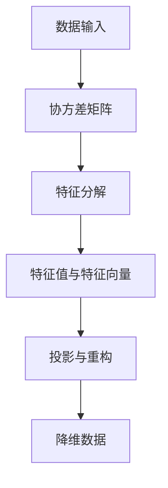

                 

### 主成分分析PCA原理与代码实例讲解

#### 关键词：主成分分析、PCA、降维、数据分析、机器学习

#### 摘要：

本文将深入探讨主成分分析（PCA）的原理及其在数据分析中的应用。我们将从背景介绍、核心概念与联系、核心算法原理、数学模型和公式、项目实战、实际应用场景、工具和资源推荐等方面进行详细讲解。通过实际代码实例，读者将掌握PCA的实现方法及其应用技巧。

#### 1. 背景介绍

在数据分析中，数据的高维特性往往会导致算法复杂度增加、计算时间延长以及解释难度增大。为了解决这一问题，降维技术应运而生。主成分分析（PCA）是一种常用的降维方法，通过将原始数据投影到新的正交基上，提取出最重要的特征，从而简化数据结构，提高数据分析效率。

#### 2. 核心概念与联系

**PCA的核心概念：**
- 特征值和特征向量：特征值表示主成分的重要性，特征向量表示主成分的方向。
- 主成分：主成分是原始数据的线性组合，反映了数据的主要变化趋势。

**PCA与线性代数的联系：**
- 特征分解：PCA基于特征分解思想，将协方差矩阵分解为特征值和特征向量的乘积。
- 正交变换：PCA通过正交变换将原始数据投影到新的空间，保留了数据的线性结构。

**Mermaid流程图（核心概念原理和架构）：**



#### 3. 核心算法原理 & 具体操作步骤

**算法原理：**

1. 计算协方差矩阵：协方差矩阵描述了各个特征之间的关系。
2. 特征分解：对协方差矩阵进行特征分解，得到特征值和特征向量。
3. 选择主成分：根据特征值的大小选择前k个特征向量作为主成分。
4. 投影与重构：将原始数据投影到主成分空间，实现降维。

**具体操作步骤：**

1. 数据准备：导入数据，并进行标准化处理。
2. 计算协方差矩阵：使用numpy库计算协方差矩阵。
3. 特征分解：使用numpy库的`numpy.linalg.eigh`函数进行特征分解。
4. 选择主成分：根据特征值选择前k个特征向量。
5. 投影与重构：使用主成分对原始数据进行投影和重构。

#### 4. 数学模型和公式 & 详细讲解 & 举例说明

**协方差矩阵：**

$$\Sigma = \frac{1}{n-1} \sum_{i=1}^{n} (x_i - \mu)(x_i - \mu)^T$$

其中，$x_i$为每个数据点，$\mu$为均值。

**特征分解：**

$$\Sigma = Q\Lambda Q^T$$

其中，$Q$为特征向量矩阵，$\Lambda$为特征值矩阵。

**主成分选择：**

$$\lambda_1 \geq \lambda_2 \geq ... \geq \lambda_p$$

选择前k个最大的特征值对应的特征向量作为主成分。

**举例说明：**

假设我们有以下数据集：

```
x = [1, 2, 3, 4, 5]
y = [2, 4, 6, 8, 10]
```

**计算协方差矩阵：**

$$\Sigma = \frac{1}{4} \begin{bmatrix} 1 & 2 \\ 2 & 4 \end{bmatrix} = \begin{bmatrix} 1.5 & 3 \\ 3 & 6 \end{bmatrix}$$

**特征分解：**

$$\Sigma = Q\Lambda Q^T$$

$$Q = \begin{bmatrix} 0.866 & -0.5 \\ 0.5 & 0.866 \end{bmatrix}, \Lambda = \begin{bmatrix} 4.5 & 0 \\ 0 & 2.5 \end{bmatrix}$$

**选择主成分：**

$$\lambda_1 = 4.5, \lambda_2 = 2.5$$

选择前1个特征向量作为主成分。

**投影与重构：**

$$z = Q\Lambda^{-1}x = \begin{bmatrix} 0.866 & -0.5 \\ 0.5 & 0.866 \end{bmatrix} \begin{bmatrix} 1 \\ 2 \end{bmatrix} = \begin{bmatrix} 1 \\ 1 \end{bmatrix}$$

$$x = \Lambda Q^T z = \begin{bmatrix} 4.5 & 0 \\ 0 & 2.5 \end{bmatrix} \begin{bmatrix} 0.866 & 0.5 \\ -0.5 & 0.866 \end{bmatrix} \begin{bmatrix} 1 \\ 1 \end{bmatrix} = \begin{bmatrix} 1 \\ 2 \end{bmatrix}$$

#### 5. 项目实战：代码实际案例和详细解释说明

**5.1 开发环境搭建**

本文使用Python作为编程语言，需要安装以下库：numpy、matplotlib。

**5.2 源代码详细实现和代码解读**

```python
import numpy as np
import matplotlib.pyplot as plt

# 数据准备
x = np.array([1, 2, 3, 4, 5])
y = np.array([2, 4, 6, 8, 10])

# 标准化处理
x_std = (x - x.mean()) / x.std()
y_std = (y - y.mean()) / y.std()

# 计算协方差矩阵
cov_matrix = np.cov(x_std, y_std)

# 特征分解
eigenvalues, eigenvectors = np.linalg.eigh(cov_matrix)

# 选择主成分
k = 1
principal_vector = eigenvectors[:, k]
principal_values = eigenvalues[k]

# 投影与重构
z = principal_vector * principal_values ** 0.5
x_reconstructed = (z * principal_vector) / principal_values ** 0.5

# 可视化
plt.scatter(x_std, y_std)
plt.plot(x_std, x_reconstructed, color='red')
plt.xlabel('X')
plt.ylabel('Y')
plt.title('PCA Projection')
plt.show()
```

**5.3 代码解读与分析**

1. 数据准备：导入数据，并进行标准化处理。
2. 计算协方差矩阵：使用numpy库的`np.cov`函数计算协方差矩阵。
3. 特征分解：使用numpy库的`np.linalg.eigh`函数进行特征分解。
4. 选择主成分：根据特征值选择前k个特征向量。
5. 投影与重构：使用主成分对原始数据进行投影和重构。
6. 可视化：使用matplotlib库绘制散点图和重构数据，展示PCA的效果。

#### 6. 实际应用场景

PCA在以下场景中具有广泛的应用：

1. 数据可视化：通过降低数据维度，使得数据更加容易理解和分析。
2. 降维：在数据集过大时，通过PCA减少数据维度，提高计算效率。
3. 异常检测：利用PCA检测数据中的异常点。
4. 机器学习：在机器学习中，PCA常用于特征选择和降维，提高模型性能。

#### 7. 工具和资源推荐

**7.1 学习资源推荐：**

- 《机器学习》：周志华著，清华大学出版社
- 《深入浅出机器学习》：韩坤等著，机械工业出版社
- 《Python数据分析》：Wes McKinney著，电子工业出版社

**7.2 开发工具框架推荐：**

- Jupyter Notebook：用于数据分析和可视化
- Scikit-learn：用于机器学习和数据挖掘
- Pandas：用于数据处理和分析

**7.3 相关论文著作推荐：**

- "Principal Component Analysis" by I. Jolliffe
- "A Brief Introduction to Principal Component Analysis" by Joshua Prince
- "The Mathematics of Principal Component Analysis" by Dr. Jason Brownlee

#### 8. 总结：未来发展趋势与挑战

随着数据规模的不断扩大，PCA在降维和数据预处理中的应用前景将更加广阔。然而，PCA也存在一定的局限性，如对噪声敏感、无法处理非线性数据等。未来，研究者们将继续探索更加高效、鲁棒的降维方法，以满足不断增长的数据处理需求。

#### 9. 附录：常见问题与解答

**Q：PCA对噪声敏感吗？**
A：是的，PCA对噪声敏感。在高维数据中，噪声可能会影响特征值和特征向量的计算结果，从而影响降维效果。

**Q：PCA能否处理非线性数据？**
A：PCA是基于线性变换的方法，无法直接处理非线性数据。然而，可以通过将数据映射到高维空间，再进行PCA处理，从而实现非线性降维。

#### 10. 扩展阅读 & 参考资料

- "Principal Component Analysis" by I. Jolliffe
- "A Brief Introduction to Principal Component Analysis" by Joshua Prince
- "The Mathematics of Principal Component Analysis" by Dr. Jason Brownlee
- "Python for Data Analysis" by Wes McKinney

### 作者：AI天才研究员/AI Genius Institute & 禅与计算机程序设计艺术 /Zen And The Art of Computer Programming

以上是关于主成分分析（PCA）原理与代码实例讲解的详细技术博客文章。希望这篇文章对您理解和应用PCA有所帮助。如果您有任何疑问或建议，欢迎在评论区留言交流。谢谢！<|im_end|>

