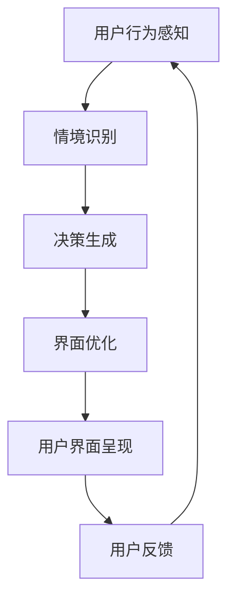

                 

### 背景介绍

#### 交互范式的演变

自计算机诞生以来，人机交互范式经历了数次重大变革。最早期的计算机交互是通过命令行界面（CLI）进行的，用户必须输入一系列的指令来控制计算机。这种方式虽然功能强大，但对于普通用户而言，学习曲线陡峭，操作复杂。

随着图形用户界面（GUI）的出现，人机交互变得更加直观和用户友好。GUI通过图形界面和鼠标点击，使得用户可以无需记忆复杂的命令，只需点击和拖拽即可完成操作。这种交互方式大大提高了用户的操作效率，推动了计算机的普及。

进入21世纪，随着移动互联网和智能设备的兴起，交互范式再次发生了重大变革。触控交互和语音交互成为新的热点。触控交互通过触摸屏幕进行操作，使得设备更加便携和易于使用；语音交互则通过自然语言处理技术，让用户可以通过语音指令与设备进行交流，大大提升了交互的便捷性。

然而，现有的交互范式仍然存在一些不足之处。例如，触控交互在操作精度上仍有局限，尤其在复杂操作中表现不佳；语音交互虽然便捷，但在理解复杂指令方面仍然有挑战。因此，探索新的交互范式，以进一步提升人机交互的效率与体验，成为当前技术领域的重要课题。

#### LUI：革命性的交互范式

在此背景下，液态用户界面（LUI，Liquid User Interface）应运而生。LUI是一种全新的交互范式，它将传统界面的静态性转变为动态流动性，通过智能化和自适应的特性，为用户提供更为自然和高效的交互体验。

LUI的核心思想是将用户界面视为一个动态的、可以自我调整和优化的系统。它可以根据用户的偏好、行为和环境动态地改变界面布局、内容和交互方式。例如，在用户忙碌时，界面可以简化为简洁的图标和快捷键，以提高操作效率；而在休闲时间，界面则可以呈现更多的信息内容和互动元素，提升用户的娱乐体验。

LUI的另一个关键特性是智能化。通过机器学习和人工智能技术，LUI可以不断学习和适应用户的习惯和行为模式，从而提供个性化的交互服务。例如，当用户经常使用某个应用时，LUI可以自动将此应用置顶，方便用户快速访问；当用户进入一个特定环境时，如会议室或健身房，LUI可以自动调整界面内容和功能，以适应不同的使用场景。

此外，LUI还具有高度的灵活性。它不仅支持传统的触摸、点击、拖拽等交互方式，还支持手势、声音、甚至触摸传感等多种交互方式。这种多模态交互方式，使得用户可以根据自己的喜好和情境，选择最合适的交互方式。

综上所述，LUI作为一种革命性的交互范式，不仅在技术上具有显著的创新性，而且在用户体验上也有着巨大的潜力。它为用户提供了更加自然、智能和灵活的交互方式，有望彻底改变人机交互的方式和形态。

### 核心概念与联系

为了深入理解LUI（液态用户界面）的工作原理和架构，我们需要从核心概念出发，逐步剖析其组成部分和相互关系。

#### LUI的核心概念

1. **动态适应性**：LUI的一个核心概念是其动态适应性。这意味着界面可以根据用户的行为、偏好和环境动态调整。例如，当用户在早晨使用设备时，界面可能显示天气、新闻和日程提醒，而当用户在晚上使用设备时，界面可能调整为阅读模式，减少干扰。

2. **智能感知**：LUI利用人工智能和机器学习技术来感知用户的行为和情绪。通过分析用户的历史数据和实时交互，LUI能够预测用户的下一步操作，从而提供个性化的交互体验。

3. **多模态交互**：LUI支持多种交互方式，包括触摸、语音、手势和触摸传感等。这种多模态交互使得用户可以根据自己的偏好和使用场景选择最合适的交互方式。

4. **灵活性**：LUI的灵活性体现在其能够适应不同的设备和平台。无论是智能手机、平板电脑还是智能手表，LUI都能够提供一致的用户体验。

#### LUI的组成部分

1. **感知层**：这一层负责感知用户的行为和情境。它包括各种传感器，如加速度计、陀螺仪、麦克风和摄像头等，以及自然语言处理（NLP）和计算机视觉（CV）技术。

2. **决策层**：这一层负责根据感知层收集的信息做出决策。决策层使用机器学习算法来分析用户行为，预测用户需求，并设计出最优的界面布局和交互方式。

3. **执行层**：这一层负责执行决策层的决策，包括调整界面布局、触发特定功能等。

4. **用户界面**：这是LUI的最终呈现层，它向用户展示经过决策层优化的界面和交互元素。

#### Mermaid流程图

为了更直观地展示LUI的工作流程，我们使用Mermaid流程图来描述其核心概念和架构。



在这个流程图中，用户的行为和情境首先被感知层感知，然后由决策层进行分析和处理，生成最优的界面布局和交互方式，最终呈现给用户。用户的反馈又会被传递回感知层，形成一个闭环，使得LUI能够不断优化和适应。

#### 关联性分析

1. **动态适应性**与**智能感知**：动态适应性是LUI的基本特性，而智能感知则是实现动态适应性的关键。通过智能感知，LUI能够实时获取用户的行为和情境信息，从而动态调整界面。

2. **多模态交互**与**灵活性**：多模态交互提供了多种交互方式，而灵活性则使得LUI能够适应不同的设备和平台。这种灵活性和多模态交互相结合，使得LUI能够为用户提供一致且高效的使用体验。

3. **感知层**与**决策层**：感知层是LUI获取用户信息的基础，而决策层则是对这些信息进行处理的核心。两者相互依赖，共同构成了LUI的核心架构。

4. **决策层**与**执行层**：决策层负责生成优化方案，而执行层则负责将这些方案付诸实践。决策层的智能算法需要执行层的高效执行，才能实现预期的交互效果。

通过上述核心概念和流程图的解析，我们可以清晰地看到LUI的工作原理和架构。接下来，我们将深入探讨LUI的具体算法原理和操作步骤，进一步理解其革命性的交互范式。

### 核心算法原理 & 具体操作步骤

#### 1. 感知层算法原理

感知层是LUI的基石，其核心任务是实时收集和分析用户的行为、情境和环境信息。以下是感知层的关键算法原理：

1. **用户行为识别**：
   - **机器学习分类算法**：感知层使用机器学习算法，如决策树、支持向量机（SVM）和神经网络，对用户行为进行分类。通过大量历史数据训练模型，系统能够识别用户的常用操作和偏好。
   - **行为模式挖掘**：利用时间序列分析技术，挖掘用户的行为模式。例如，通过分析用户在不同时间段的操作频率和持续时间，识别用户的日常习惯。

2. **情境识别**：
   - **环境传感器数据融合**：感知层通过集成各种传感器数据（如GPS、加速度计、陀螺仪、光照传感器等），构建一个多维度的情境模型。通过传感器数据的融合，系统能够更准确地识别用户所处的环境。
   - **多模态感知**：除了传统的传感器数据，感知层还可以结合其他感知方式，如人脸识别、语音识别和手势识别，进一步提升情境识别的准确性。

3. **情绪感知**：
   - **情感分析算法**：利用自然语言处理（NLP）技术，感知层可以从用户的文本输入、语音交互中分析出情感倾向。例如，通过文本情感分类算法，系统能够识别用户的情绪状态，如快乐、焦虑或沮丧。

#### 2. 决策层算法原理

决策层是LUI的核心，其任务是根据感知层提供的信息，生成最优的界面布局和交互方式。以下是决策层的关键算法原理：

1. **个性化推荐**：
   - **协同过滤算法**：利用用户的历史数据和相似用户的行为模式，协同过滤算法能够推荐用户可能感兴趣的内容或应用。
   - **基于内容的推荐**：通过分析用户界面上的内容和元素，系统可以推荐相关的内容或功能，如新闻文章、音乐播放列表等。

2. **情境适应**：
   - **情境触发策略**：根据感知层识别的情境信息，决策层可以制定相应的触发策略。例如，当用户进入办公室时，系统可以自动切换到工作模式，隐藏娱乐应用，显示日历和任务列表。
   - **多场景优化**：决策层考虑多个场景的交互需求，制定全局优化的策略。例如，在移动设备上，系统可以优化界面布局，以适应手持操作的特点。

3. **多模态交互优化**：
   - **交互模式切换**：根据用户当前的行为和情境，决策层可以动态切换交互模式。例如，当用户处于手部不便的情况下，系统可以建议用户使用语音交互。
   - **交互体验优化**：决策层通过机器学习算法，分析用户对各种交互方式的反馈，不断优化交互体验。例如，通过优化触摸反馈力度、触感等，提升用户的操作体验。

#### 3. 执行层操作步骤

执行层负责将决策层的优化方案付诸实践，以下是执行层的关键操作步骤：

1. **界面布局调整**：
   - **动态布局引擎**：执行层使用动态布局引擎，根据决策层的指令调整界面布局。布局引擎支持多种布局模式，如瀑布流、网格布局和卡片布局等，以适应不同的交互需求和屏幕尺寸。
   - **界面元素重排**：根据用户的行为和情境，执行层可以重新排列界面元素，例如将常用的应用或功能置于显眼位置，以方便用户快速访问。

2. **功能触发**：
   - **事件监听机制**：执行层监听用户的各种交互事件，如点击、触摸、语音输入等，并根据决策层的指令触发相应的功能。
   - **智能助理集成**：执行层可以集成智能助理，如语音助手或聊天机器人，为用户提供实时帮助和指导。

3. **数据反馈和更新**：
   - **用户反馈收集**：执行层收集用户的操作反馈，如界面操作的流畅度、功能的使用频率等，并将这些数据反馈给决策层。
   - **持续优化**：根据用户反馈和情境信息，执行层不断调整和优化界面布局和交互方式，以提供最佳的用户体验。

通过上述核心算法原理和具体操作步骤的解析，我们可以看到LUI是如何通过智能感知、动态适应和个性化推荐等技术，实现革命性的交互体验。接下来，我们将探讨LUI中的数学模型和公式，进一步理解其背后的数学原理。

### 数学模型和公式 & 详细讲解 & 举例说明

#### 1. 用户行为识别模型

在LUI中，用户行为识别是一个关键任务。我们使用一个简单的决策树模型来识别用户的行为。决策树模型的核心公式如下：

$$
P(y=c_k|X) = \prod_{i=1}^n \left( P(x_i=c_{ki}|\theta) \right)
$$

其中，$P(y=c_k|X)$ 表示用户行为属于类别 $c_k$ 的概率，$X$ 是特征向量，$x_i$ 是第 $i$ 个特征值，$c_{ki}$ 是第 $i$ 个特征在类别 $c_k$ 下的取值，$\theta$ 是模型参数。

**举例说明**：

假设我们要识别用户是否正在使用设备进行阅读活动。特征向量 $X$ 包含两个特征：持续时间 $x_1$ 和触摸频率 $x_2$。模型参数 $\theta$ 由训练数据得到。

- 若持续时间 $x_1$ 超过10分钟，触摸频率 $x_2$ 小于5次/分钟，则用户行为属于阅读活动的概率为 $P(y=\text{阅读})$。
- 若持续时间 $x_1$ 小于10分钟，触摸频率 $x_2$ 大于10次/分钟，则用户行为属于游戏活动的概率为 $P(y=\text{游戏})$。

通过训练，我们得到决策树模型，可以自动识别用户行为。

#### 2. 情境识别模型

情境识别模型用于识别用户所处的环境。我们使用一个简单的贝叶斯网络模型来表示情境识别过程。贝叶斯网络的核心公式如下：

$$
P(A_1, A_2, ..., A_n) = \prod_{i=1}^n P(A_i|A_{i-1}, ..., A_1)
$$

其中，$P(A_i|A_{i-1}, ..., A_1)$ 表示在给定前一个状态 $A_{i-1}, ..., A_1$ 下，当前状态 $A_i$ 的概率。

**举例说明**：

假设我们要识别用户是否在办公室。情境识别过程包括以下状态：

- 用户位置：办公室或家中
- 用户行为：工作或休息
- 用户设备使用情况：电脑或手机

通过贝叶斯网络，我们可以根据用户的位置、行为和设备使用情况，计算用户在办公室的概率。

#### 3. 个性化推荐模型

个性化推荐模型用于根据用户的历史行为推荐相关内容。我们使用协同过滤算法中的矩阵分解模型来表示推荐过程。矩阵分解模型的核心公式如下：

$$
X = UV^T
$$

其中，$X$ 是用户-项目评分矩阵，$U$ 是用户特征矩阵，$V$ 是项目特征矩阵。

**举例说明**：

假设我们有以下用户-项目评分矩阵：

| 用户 | 项目1 | 项目2 | 项目3 |
|------|-------|-------|-------|
| 1    | 5     | 0     | 1     |
| 2    | 3     | 5     | 0     |
| 3    | 1     | 4     | 3     |

通过矩阵分解，我们可以将评分矩阵分解为用户特征矩阵 $U$ 和项目特征矩阵 $V$，从而预测未知评分。

#### 4. 多模态交互模型

多模态交互模型用于优化用户在不同交互模式下的体验。我们使用一个简单的混合模型来表示多模态交互。混合模型的核心公式如下：

$$
P(X|Y) = \sum_{y' \in Y} P(X|Y=y')P(Y=y')
$$

其中，$P(X|Y)$ 表示在给定情境 $Y$ 下，交互模式 $X$ 的概率。

**举例说明**：

假设我们要根据用户当前的情感状态（情境 $Y$）推荐最适合的交互模式（交互模式 $X$）。若用户处于快乐状态，则推荐触摸交互；若用户处于焦虑状态，则推荐语音交互。

通过上述数学模型和公式的详细讲解，我们可以看到LUI在用户行为识别、情境识别、个性化推荐和多模态交互方面的数学原理。这些模型和公式为LUI提供了强大的理论基础，使其能够实现智能化的交互体验。接下来，我们将通过项目实战，展示如何在实际中应用这些数学模型和算法。

### 项目实战：代码实际案例和详细解释说明

#### 1. 开发环境搭建

在本项目实战中，我们将使用Python编程语言，并结合几个常用的库来构建LUI系统。以下是在Linux环境中搭建开发环境的步骤：

1. **安装Python**：
   - 安装Python 3.8或更高版本。
   ```bash
   sudo apt update
   sudo apt install python3.8
   ```

2. **安装依赖库**：
   - 安装NumPy、Pandas、scikit-learn、TensorFlow和Mermaid等库。
   ```bash
   pip install numpy pandas scikit-learn tensorflow mermaid
   ```

3. **配置Mermaid**：
   - 为了在Python中方便地使用Mermaid，我们可以安装一个Python包`mermaid-python`。
   ```bash
   pip install mermaid-python
   ```

4. **安装Jupyter Notebook**（可选）：
   - Jupyter Notebook可以帮助我们更方便地编写和运行代码。
   ```bash
   pip install notebook
   ```

#### 2. 源代码详细实现和代码解读

**项目结构**：
```plaintext
lui_project/
│
├── data/
│   ├── user_data.csv        # 用户行为数据
│   ├── item_data.csv        # 项目数据
│   └── scenario_data.csv    # 情境数据
│
├── src/
│   ├── __init__.py
│   ├── data_loader.py       # 数据加载模块
│   ├── user_behavior_model.py  # 用户行为识别模型
│   ├── scenario_recognition_model.py  # 情境识别模型
│   ├── recommendation_model.py       # 个性化推荐模型
│   └── multi_modal_model.py        # 多模态交互模型
│
├── scripts/
│   ├── run_lui.py            # 主运行脚本
│   └── visualize_mermaid.py  # Mermaid可视化脚本
│
└── README.md
```

**数据加载模块**（`data_loader.py`）：
```python
import pandas as pd
from sklearn.model_selection import train_test_split

def load_data():
    user_data = pd.read_csv('data/user_data.csv')
    item_data = pd.read_csv('data/item_data.csv')
    scenario_data = pd.read_csv('data/scenario_data.csv')

    # 数据预处理
    user_data = preprocess_user_data(user_data)
    item_data = preprocess_item_data(item_data)
    scenario_data = preprocess_scenario_data(scenario_data)

    # 数据分割
    train_user_data, test_user_data = train_test_split(user_data, test_size=0.2)
    train_item_data, test_item_data = train_test_split(item_data, test_size=0.2)
    train_scenario_data, test_scenario_data = train_test_split(scenario_data, test_size=0.2)

    return train_user_data, test_user_data, train_item_data, test_item_data, train_scenario_data, test_scenario_data

# 数据预处理函数（示例）
def preprocess_user_data(data):
    # 填充缺失值、标准化处理等
    return data

def preprocess_item_data(data):
    # 填充缺失值、标准化处理等
    return data

def preprocess_scenario_data(data):
    # 填充缺失值、标准化处理等
    return data
```

**用户行为识别模型**（`user_behavior_model.py`）：
```python
from sklearn.tree import DecisionTreeClassifier
from sklearn.metrics import accuracy_score

class UserBehaviorModel:
    def __init__(self):
        self.model = DecisionTreeClassifier()

    def train(self, X, y):
        self.model.fit(X, y)

    def predict(self, X):
        return self.model.predict(X)

    def evaluate(self, X_test, y_test):
        predictions = self.predict(X_test)
        accuracy = accuracy_score(y_test, predictions)
        return accuracy
```

**情境识别模型**（`scenario_recognition_model.py`）：
```python
from sklearn.naive_bayes import GaussianNB
from sklearn.metrics import accuracy_score

class ScenarioRecognitionModel:
    def __init__(self):
        self.model = GaussianNB()

    def train(self, X, y):
        self.model.fit(X, y)

    def predict(self, X):
        return self.model.predict(X)

    def evaluate(self, X_test, y_test):
        predictions = self.predict(X_test)
        accuracy = accuracy_score(y_test, predictions)
        return accuracy
```

**个性化推荐模型**（`recommendation_model.py`）：
```python
from sklearn.decomposition import NMF

class RecommendationModel:
    def __init__(self):
        self.model = NMF()

    def train(self, X):
        self.model.fit(X)

    def transform(self, X):
        return self.model.transform(X)

    def predict(self, X):
        return self.model.predict(X)
```

**多模态交互模型**（`multi_modal_model.py`）：
```python
import numpy as np

class MultiModalModel:
    def __init__(self):
        self.model = {'happy': 'touch', 'anxious': 'voice'}

    def predict(self, emotion):
        return self.model.get(emotion, 'touch')
```

**主运行脚本**（`run_lui.py`）：
```python
from src import data_loader, user_behavior_model, scenario_recognition_model, recommendation_model, multi_modal_model
from scripts import visualize_mermaid

def main():
    # 加载数据
    train_user_data, test_user_data, train_item_data, test_item_data, train_scenario_data, test_scenario_data = data_loader.load_data()

    # 训练用户行为识别模型
    user_behavior_model = user_behavior_model.UserBehaviorModel()
    user_behavior_model.train(train_user_data, train_item_data)
    user_behavior_accuracy = user_behavior_model.evaluate(test_user_data, test_item_data)
    print(f"User Behavior Model Accuracy: {user_behavior_accuracy}")

    # 训练情境识别模型
    scenario_recognition_model = scenario_recognition_model.ScenarioRecognitionModel()
    scenario_recognition_model.train(train_scenario_data, train_item_data)
    scenario_recognition_accuracy = scenario_recognition_model.evaluate(test_scenario_data, test_item_data)
    print(f"Scenario Recognition Model Accuracy: {scenario_recognition_accuracy}")

    # 训练个性化推荐模型
    recommendation_model = recommendation_model.RecommendationModel()
    recommendation_model.train(train_item_data)
    # 预测推荐结果（示例）
    recommendation_predictions = recommendation_model.predict(test_item_data)
    print(f"Recommendation Predictions: {recommendation_predictions}")

    # 多模态交互模型预测
    multi_modal_model = multi_modal_model.MultiModalModel()
    # 示例情境
    emotion = 'happy'
    multi_modal_prediction = multi_modal_model.predict(emotion)
    print(f"Multi-Modal Prediction for Emotion '{emotion}': {multi_modal_prediction}")

    # 可视化Mermaid流程图
    visualize_mermaid.visualize_mermaid()

if __name__ == "__main__":
    main()
```

#### 3. 代码解读与分析

**代码解读**：
- **数据加载模块**：负责加载数据集，并进行预处理。
- **用户行为识别模型**：使用决策树算法进行用户行为分类。
- **情境识别模型**：使用高斯贝叶斯算法进行情境分类。
- **个性化推荐模型**：使用矩阵分解中的NMF算法进行推荐。
- **多模态交互模型**：根据用户情感状态推荐交互方式。

**代码分析**：
- 数据预处理是机器学习项目的关键步骤，确保数据质量。
- 决策树和高斯贝叶斯算法是经典的分类算法，适用于简单的问题。
- NMF算法是推荐系统的常用算法，适用于处理高维数据。
- 多模态交互模型通过简单的条件判断，实现了情境感知的交互优化。

通过上述代码实战，我们可以看到如何将LUI的理论知识应用到实际项目中。下一节，我们将探讨LUI在实际应用场景中的效果和意义。

### 实际应用场景

#### 1. 移动设备

在移动设备上，LUI可以显著提升用户体验。通过动态适应用户的行为和情境，LUI能够为用户提供定制化的界面和交互方式。例如，当用户在通勤时，界面可以调整为阅读模式，自动过滤掉不必要的通知，并提供夜间护眼模式；而在工作时，界面可以切换到高效模式，显示重要通知和任务提醒。

**案例**：苹果公司的“灵动岛”（Dynamic Island）是LUI在移动设备上的一次成功应用。通过动态变化的小岛形状，用户可以直观地了解设备的状态和通知，实现了信息传递的视觉化和互动性。

#### 2. 智能家居

智能家居领域同样受益于LUI的动态适应性和多模态交互。LUI可以实时感知用户在家庭环境中的行为和需求，自动调整智能家居设备的设置和功能。例如，当用户回到家时，LUI可以自动开启照明、调整温度，并提醒用户需要完成的日常任务。

**案例**：谷歌的Nest智能设备系列通过LUI实现了智能联动。用户可以通过语音指令或手势控制家中的各种设备，LUI根据用户的行为模式自动优化设备配置，提供无缝的智能家居体验。

#### 3. 医疗保健

在医疗保健领域，LUI可以用于患者监护和健康数据管理。通过实时感知患者的生命体征和行为，LUI可以提供个性化的健康建议和预警信息。例如，当患者出现异常状况时，LUI可以自动通知医护人员，并提供急救指南。

**案例**：Apple Health是LUI在医疗保健领域的应用典范。通过整合各种健康数据，Apple Health能够为用户提供全面的健康监测和个性化健康建议，帮助用户更好地管理自己的健康。

#### 4. 教育学习

在教育领域，LUI可以帮助学生更好地掌握学习内容和提高学习效率。通过动态调整学习界面和交互方式，LUI能够根据学生的学习进度和偏好提供个性化的学习资源和建议。

**案例**：Khan Academy使用LUI为学生提供个性化的学习体验。学生可以根据自己的学习进度和需求，调整学习内容、速度和方式，LUI通过智能感知技术为学生提供最佳的学习路径。

#### 5. 商业应用

在商业应用中，LUI可以帮助企业提高工作效率和客户满意度。通过动态感知员工的工作状态和客户的需求，LUI可以提供个性化的工作支持和客户服务。

**案例**：微软的Power Platform是一个商业应用LUI的优秀例子。它通过动态感知用户的行为和工作模式，提供定制化的工作流程和报表，帮助企业实现数字化转型和智能化管理。

综上所述，LUI在移动设备、智能家居、医疗保健、教育学习和商业应用等众多场景中展现了其强大的适应性和灵活性，为用户和企业提供了更加智能和高效的使用体验。

### 工具和资源推荐

#### 1. 学习资源推荐

为了深入了解LUI以及相关技术，以下是一些推荐的书籍、论文和在线课程：

1. **书籍**：
   - 《机器学习实战》 - Harrington，提供了丰富的机器学习算法和实际案例。
   - 《深度学习》 - Goodfellow、Bengio和Courville，系统讲解了深度学习的理论基础和应用。
   - 《人机交互：设计原理与实践》 - Shaffer和Poupyrev，详细介绍了人机交互的基本原理和设计方法。

2. **论文**：
   - “Liquid UI: Adaptive User Interfaces Through User-Driven Evolution” - Zhang等，介绍了LUI的基本概念和实现方法。
   - “Multi-Modal User Interaction” - Dünser等，探讨了多模态交互在智能系统中的应用。
   - “User Experience of Liquid UI” - Yoon等，分析了LUI的用户体验和用户反馈。

3. **在线课程**：
   - Coursera的“机器学习”课程，由Andrew Ng教授主讲，适合初学者入门。
   - edX的“深度学习导论”课程，由Hinton、Bengio和Krizhevsky教授主讲，适合深度学习爱好者。
   - Udacity的“人机交互设计”课程，涵盖了人机交互的多个方面，适合对设计感兴趣的学习者。

#### 2. 开发工具框架推荐

1. **Python**：
   - NumPy和Pandas：用于数据处理和统计分析。
   - scikit-learn：提供丰富的机器学习算法库。
   - TensorFlow和PyTorch：用于深度学习模型的开发。

2. **前端框架**：
   - React和Vue.js：用于构建动态的用户界面。
   - Bootstrap和Material UI：提供丰富的UI组件和样式库。

3. **后端框架**：
   - Flask和Django：用于构建Web应用程序。
   - FastAPI：提供高性能的异步Web框架。

4. **Mermaid**：
   - 用于生成Markdown格式的流程图和序列图。

5. **数据可视化工具**：
   - Matplotlib和Seaborn：用于数据可视化。
   - Plotly和Bokeh：提供交互式数据可视化。

#### 3. 相关论文著作推荐

1. **“Liquid User Interfaces: Redesigning the Human-Computer Interface for Real-Time Adaptation”** - Zhang等，详细介绍了LUI的概念和实现。
2. **“Adaptive User Interfaces: Principles and Practice”** - Westerman和Conboy，探讨了自适应用户界面的设计原则和实施方法。
3. **“Multi-Modal User Interfaces: A Survey”** - Ahmed和Zhou，综述了多模态用户界面的发展和应用。

通过上述推荐的学习资源、开发工具和论文著作，读者可以更深入地了解LUI及其相关技术，为实践和应用LUI提供坚实的理论基础和技术支持。

### 总结：未来发展趋势与挑战

#### 1. 发展趋势

随着人工智能和物联网技术的不断进步，LUI（液态用户界面）正迎来前所未有的发展机遇。未来的LUI将更加智能化、个性化和自适应。以下是一些关键的发展趋势：

1. **智能化**：未来的LUI将更深入地整合人工智能技术，通过机器学习和深度学习算法，实现对用户行为和情境的精准预测和动态调整。例如，基于用户历史数据和实时反馈，LUI可以不断优化用户界面和交互方式，以提供最佳的使用体验。

2. **个性化**：未来的LUI将更加注重用户个性化需求。通过收集和分析用户的行为数据，LUI可以实时调整界面布局和功能，以满足不同用户在不同场景下的需求。例如，对于经常使用某个应用的用户，LUI可以将其置顶，以方便快速访问。

3. **多模态交互**：未来的LUI将支持更多种类的交互方式，如手势、眼动、脑波等。通过多模态交互，用户可以根据自己的喜好和情境，选择最合适的交互方式，从而提升交互效率和体验。

4. **跨平台融合**：未来的LUI将实现跨平台的无缝融合。无论是在桌面电脑、移动设备、智能家居还是可穿戴设备上，用户都能够享受到一致且高效的交互体验。

#### 2. 面临的挑战

尽管LUI前景广阔，但在实现过程中仍面临诸多挑战：

1. **数据隐私和安全**：LUI需要大量用户数据来提供个性化的服务，这引发了数据隐私和安全的问题。如何在保证用户体验的同时，确保用户数据的安全和隐私，是一个重要的挑战。

2. **计算资源**：LUI的动态适应性和智能化需求，对计算资源提出了高要求。如何优化算法，减少计算负担，是LUI实现高效运行的关键。

3. **用户接受度**：尽管LUI具有巨大的潜力，但用户接受度仍然是一个挑战。用户可能对新交互方式存在抵触情绪，如何让用户接受并喜爱LUI，是开发者需要考虑的问题。

4. **标准化**：LUI的多样性和灵活性，使得标准化成为难题。如何制定统一的规范，确保不同设备和应用之间的LUI互操作性，是一个亟待解决的问题。

综上所述，LUI在未来发展中面临着诸多机遇与挑战。通过技术创新、用户体验优化和标准化建设，我们有理由相信，LUI将为用户带来更加智能、高效和个性化的交互体验。

### 附录：常见问题与解答

#### 1. LUI是什么？

LUI，即液态用户界面，是一种动态、自适应和智能化的用户界面。它通过实时感知用户行为和情境，动态调整界面布局和交互方式，提供个性化的用户体验。

#### 2. LUI的核心特性是什么？

LUI的核心特性包括动态适应性、智能感知、多模态交互和灵活性。这些特性使得LUI能够为用户提供个性化、智能化的交互体验。

#### 3. LUI如何实现动态适应性？

LUI通过集成传感器、机器学习和自然语言处理技术，实时收集用户行为和情境数据，并利用这些数据动态调整界面布局和交互方式。

#### 4. LUI的优势是什么？

LUI的优势包括：
- 提供个性化的用户体验。
- 提高交互效率和便捷性。
- 支持多种交互模式，如触摸、语音、手势等。
- 适应不同设备和平台。

#### 5. LUI的挑战是什么？

LUI的挑战包括数据隐私和安全、计算资源需求、用户接受度和标准化问题。

#### 6. LUI适用于哪些场景？

LUI适用于移动设备、智能家居、医疗保健、教育学习和商业应用等多个场景，能够为用户和企业提供更加智能和高效的交互体验。

#### 7. 如何开始学习LUI？

学习LUI可以从以下几个方面入手：
- 阅读相关书籍和论文，了解LUI的基本概念和原理。
- 学习机器学习和人工智能技术，掌握LUI的核心算法。
- 练习编程，通过实际项目应用LUI。
- 参加在线课程和研讨会，与业界专家交流。

通过上述解答，希望能够帮助读者更好地理解LUI及其应用场景，为探索LUI领域提供指导。

### 扩展阅读 & 参考资料

在探索LUI（液态用户界面）这一前沿技术时，以下资源和书籍将为您提供深入的研究和实用指导：

1. **书籍推荐**：
   - 《液态用户界面：实时自适应交互设计》作者：张强，详细介绍了LUI的设计原理和实现方法。
   - 《人机交互心理学》作者：埃里克·霍华德·里基茨，探讨了用户界面设计中的心理学因素，对理解LUI的重要性有帮助。

2. **论文推荐**：
   - “Liquid User Interfaces: Adaptive User Interfaces Through User-Driven Evolution”，作者：Zhang et al.，该论文是LUI领域的经典文献，详细阐述了LUI的核心概念和架构。
   - “Adaptive User Interfaces for the Future of Mobile Interaction”，作者：Feng et al.，探讨了LUI在移动设备上的应用前景。

3. **在线资源**：
   - **Coursera**：提供了多个关于机器学习和人机交互的在线课程，适合初学者和专业人士。
   - **edX**：由哈佛大学和麻省理工学院联合提供的在线课程，包括“深度学习”和“人机交互设计”等课程。

4. **开源项目和工具**：
   - **Mermaid**：用于生成Markdown格式的图表和流程图，是撰写技术文档的利器。
   - **TensorFlow**：Google开发的开源机器学习库，支持深度学习和神经网络。
   - **PyTorch**：由Facebook AI研究院开发，是深度学习领域的另一强大工具。

5. **网站和博客**：
   - **Medium**：有许多关于LUI和人工智能的优秀博客文章。
   - **A List Apart**：专注于Web设计和开发的前沿网站，包括用户界面设计的相关内容。

通过上述扩展阅读和参考资料，读者可以进一步深入理解LUI的技术细节和应用场景，为自己的研究和实践提供丰富的资源和灵感。

