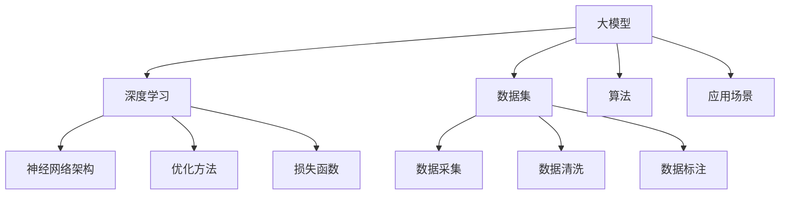

                 

# 产品创新策略：大模型创业的核心竞争力

## 关键词
大模型，创业，产品创新，竞争力，算法原理，应用场景

## 摘要

本文旨在探讨大模型创业的核心竞争力，即产品创新策略。随着人工智能技术的不断发展和普及，大模型作为人工智能的核心驱动力，正在改变着各行各业的运行模式。本文首先介绍了大模型的基本概念和背景，然后深入探讨了产品创新策略在大模型创业中的重要性。接着，本文从核心算法原理、数学模型和实际应用场景等多个角度，详细分析了大模型创业的关键成功因素。最后，本文给出了相关的工具和资源推荐，并总结了未来发展趋势与挑战。通过本文的阅读，读者将能够深刻理解大模型创业的核心竞争力，并为自己的创业之路提供有益的启示。

## 1. 背景介绍

### 大模型的崛起

大模型，即大型神经网络模型，是近年来人工智能领域的重大突破。它们具有处理大规模数据、实现复杂任务的能力，能够在多个领域取得显著成果。大模型的兴起，源于深度学习的蓬勃发展，深度学习作为一种重要的机器学习方法，通过多层次的神经网络结构，能够自动提取数据中的特征，实现高度复杂的模式识别和预测任务。

大模型的应用范围广泛，从自然语言处理、计算机视觉、语音识别，到推荐系统、自动驾驶、医疗诊断等，都在大模型的基础上实现了显著的性能提升。例如，在自然语言处理领域，基于大模型的模型如BERT、GPT等，已经在问答系统、文本生成、机器翻译等方面取得了革命性的突破。在计算机视觉领域，大模型如ResNet、Inception等，通过层次化的网络结构，实现了图像分类、目标检测、图像生成等任务的精确识别。在语音识别领域，大模型如DeepSpeech、WaveNet等，通过复杂的神经网络结构，实现了高质量的语音识别。

### 大模型创业的机遇与挑战

随着大模型技术的不断发展，越来越多的创业公司开始利用这一技术进行创新和探索。大模型创业的机遇在于，它能够为各个行业提供强大的技术支持，推动产业升级和变革。例如，在金融领域，大模型可以用于风险控制、量化交易、客户画像等；在医疗领域，大模型可以用于疾病诊断、药物研发、健康管理等；在教育领域，大模型可以用于智能教学、个性化推荐等。

然而，大模型创业也面临着一系列挑战。首先是技术挑战，大模型的训练和部署需要大量的计算资源和数据支持，这对创业公司的技术和资源提出了高要求。其次是市场挑战，大模型的应用场景广泛，但如何找到合适的切入点，形成独特的市场竞争力，是创业公司需要认真思考的问题。最后是伦理和社会挑战，大模型的广泛应用可能带来数据隐私、道德伦理等问题，如何平衡技术创新与社会责任，是创业公司需要面对的挑战。

### 大模型创业的现状

当前，大模型创业已经成为人工智能领域的重要趋势。一方面，各大科技公司和创业公司纷纷布局大模型技术，推出了一系列创新产品和服务；另一方面，大模型技术的应用也在不断拓展，从传统的工业、消费领域，逐渐渗透到医疗、教育、金融等新兴领域。

在自然语言处理领域，大模型创业公司如OpenAI、DeepMind等，通过推出GPT、BERT等模型，实现了语言生成、机器翻译、问答系统等任务的高效处理。在计算机视觉领域，大模型创业公司如PaddlePaddle、SenseTime等，通过推出ResNet、Inception等模型，实现了图像分类、目标检测、图像生成等任务的高精度识别。在语音识别领域，大模型创业公司如科大讯飞、Google等，通过推出DeepSpeech、WaveNet等模型，实现了高质量、高准确率的语音识别。

总体来说，大模型创业的现状呈现出快速增长、多元应用、技术创新等特点，为人工智能技术的发展和产业升级提供了强大的动力。

### 大模型创业的优势

大模型创业具有多方面的优势：

1. **技术创新**：大模型作为人工智能的核心驱动力，具有处理大规模数据、实现复杂任务的能力，能够推动技术创新和产业升级。
2. **市场潜力**：大模型的应用范围广泛，从自然语言处理、计算机视觉、语音识别，到推荐系统、自动驾驶、医疗诊断等，都有巨大的市场潜力。
3. **资源整合**：大模型创业需要大量的计算资源和数据支持，这促使创业公司与其他企业和机构进行资源整合和合作，形成产业生态。
4. **可持续发展**：大模型创业不仅能够带来经济效益，还能够推动社会进步，解决一些现实问题，具有可持续发展的优势。

### 大模型创业的挑战

尽管大模型创业具有诸多优势，但同时也面临着一系列挑战：

1. **技术挑战**：大模型的训练和部署需要大量的计算资源和数据支持，这对创业公司的技术和资源提出了高要求。
2. **市场挑战**：大模型的应用场景广泛，但如何找到合适的切入点，形成独特的市场竞争力，是创业公司需要认真思考的问题。
3. **伦理挑战**：大模型的广泛应用可能带来数据隐私、道德伦理等问题，如何平衡技术创新与社会责任，是创业公司需要面对的挑战。
4. **竞争挑战**：随着大模型技术的普及，越来越多的创业公司进入这一领域，竞争日益激烈，创业公司需要不断创新，才能在市场中脱颖而出。

### 大模型创业的影响

大模型创业不仅对技术发展产生重大影响，还对市场和社会产生深远的影响：

1. **技术进步**：大模型的兴起推动了人工智能技术的发展，加速了技术的进步和创新。
2. **产业变革**：大模型的应用改变了各行各业的运行模式，推动了产业升级和变革。
3. **社会进步**：大模型创业能够解决一些现实问题，提高社会生产力和生活质量。
4. **就业影响**：大模型创业创造了大量的就业机会，促进了人才流动和职业发展。

总的来说，大模型创业对技术、市场、社会等方面都产生了深远的影响，是当前人工智能领域的重要趋势和方向。

### 大模型创业的发展趋势

随着人工智能技术的不断发展和应用场景的拓展，大模型创业的发展趋势呈现出以下几个方面的特点：

1. **技术创新**：大模型创业公司将继续推进技术创新，研发出更加高效、精准的大模型，提升人工智能技术的应用水平。
2. **应用拓展**：大模型的应用将不断拓展，从传统的工业、消费领域，逐渐渗透到医疗、教育、金融等新兴领域，推动产业变革和社会进步。
3. **资源整合**：大模型创业公司将进一步与其他企业和机构进行资源整合和合作，形成产业生态，提高整体竞争力。
4. **竞争加剧**：随着越来越多的创业公司进入大模型领域，市场竞争将日益激烈，创业公司需要不断创新，才能在市场中脱颖而出。
5. **政策监管**：随着大模型技术的广泛应用，政策监管将逐步加强，创业公司需要遵守相关法律法规，确保技术创新与伦理责任的平衡。

总的来说，大模型创业将继续保持快速增长和多元化发展的趋势，为人工智能技术的发展和产业升级提供强大的动力。

### 大模型创业的案例分析

为了更好地理解大模型创业的核心竞争力，我们可以通过一些具体的案例分析来探讨大模型在不同领域的应用和创业实践。

#### 案例一：自然语言处理领域的GPT创业公司

GPT（Generative Pre-trained Transformer）是OpenAI推出的一个大型语言模型，具有强大的文本生成和语言理解能力。基于GPT的创业公司，如Hugging Face，提供了一系列开源工具和预训练模型，使得开发人员可以轻松地利用GPT进行文本生成、问答系统、机器翻译等任务。Hugging Face的成功在于其提供了易于使用和高度灵活的开源工具，吸引了大量的开发者和企业用户，形成了强大的社区生态。

**创新策略**：
- **开源共享**：通过开源共享，降低了开发者使用的门槛，吸引了大量用户。
- **社区驱动**：通过建立强大的开发者社区，持续优化工具和模型，提高用户体验。
- **商业合作**：与企业和研究机构建立合作关系，共同推动大模型技术的应用和推广。

**挑战与解决**：
- **数据隐私**：由于语言模型需要处理大量用户数据，如何保护用户隐私成为一个重要挑战。Hugging Face采取了严格的隐私保护措施，确保数据的安全和合规。
- **计算资源**：大规模训练GPT模型需要大量计算资源，Hugging Face通过与云服务提供商合作，获得了必要的计算支持。

#### 案例二：计算机视觉领域的AI医疗公司

在计算机视觉领域，大模型的应用极大地推动了医疗诊断技术的发展。例如，一些创业公司利用卷积神经网络（CNN）和Transformer等大模型，实现了肺癌、乳腺癌等疾病的早期诊断。这些公司的核心竞争力在于其强大的图像处理能力和对医疗数据的深入理解。

**创新策略**：
- **数据整合**：通过整合多源医疗数据，提高了模型对疾病特征的理解和识别能力。
- **跨学科合作**：与医学专家、数据科学家等跨学科人才合作，共同开发高性能的医疗诊断模型。
- **监管合规**：在医疗领域，合规性至关重要。这些公司严格遵守医疗数据隐私和安全法规，确保模型的合法使用。

**挑战与解决**：
- **数据质量**：医疗数据质量参差不齐，如何处理和清洗数据，确保模型的准确性是一个挑战。公司采用了严格的数据处理流程和质量控制机制。
- **伦理问题**：大模型在医疗领域的应用可能引发伦理问题，如算法偏见和隐私泄露。公司制定了严格的伦理准则，确保技术应用符合道德规范。

#### 案例三：语音识别领域的AI助手公司

语音识别技术在智能助手和客户服务等领域得到了广泛应用。一些创业公司利用深度神经网络和端到端语音识别技术，推出了高质量的语音助手产品。例如，由DeepMind开发的DeepSpeech模型，在语音识别准确率上取得了显著突破。

**创新策略**：
- **端到端模型**：通过端到端语音识别模型，简化了传统语音识别流程，提高了识别准确率和效率。
- **多语言支持**：支持多语言识别，满足了全球化市场的需求。
- **用户定制**：提供个性化服务，根据用户需求定制语音助手的功能和体验。

**挑战与解决**：
- **语音质量**：不同的语音环境和质量可能影响识别效果。公司通过引入噪声抑制技术和语音增强算法，提高了语音识别的鲁棒性。
- **数据多样性**：多语言和多样性的语音数据是模型训练的关键。公司通过收集多样化的语音数据，不断优化模型。

### 案例分析总结

通过上述案例，我们可以看出，大模型创业公司成功的关键在于：

1. **技术创新**：持续推动大模型技术的发展，提高模型的性能和应用范围。
2. **应用创新**：找到合适的业务场景，将大模型技术应用于实际问题解决。
3. **社区驱动**：建立强大的开发者社区，促进技术的共享和合作。
4. **合规性**：确保技术的合法合规使用，满足行业标准和用户需求。

这些策略不仅提升了公司的竞争力，也为大模型创业提供了宝贵的经验和启示。

#### 1.1 创新的重要性

在产品创新策略中，创新是至关重要的因素。创新不仅能够为产品带来独特的价值，还能够为企业创造竞争优势。以下是创新在产品创新策略中的几个关键作用：

1. **满足市场需求**：创新能够帮助企业更好地满足市场需求。通过不断研究用户需求和反馈，企业可以开发出更具针对性、更符合用户期望的产品，从而提高用户满意度和忠诚度。

2. **创造差异化**：在竞争激烈的市场中，差异化是赢得市场份额的关键。创新可以帮助企业创造独特的产品特性或服务，从而在众多竞争者中脱颖而出。

3. **提升竞争力**：创新能够提升企业的竞争力。通过引入新技术、新理念，企业可以在产品性能、效率、成本等方面取得优势，从而在市场中占据有利位置。

4. **推动持续发展**：创新是推动企业持续发展的动力。在不断变化的市场环境中，企业需要不断创新，以适应新的挑战和机遇，保持长期竞争优势。

#### 1.2 创新的类型

创新可以分为多个类型，根据创新的内容和程度，可以分为以下几种：

1. **渐进性创新**：渐进性创新是指对现有产品或服务的改进和优化，通常不会引起市场的显著变化。这类创新可以提升产品性能、降低成本，但通常不会带来革命性的变化。

2. **突破性创新**：突破性创新是指引入全新的产品或服务，颠覆现有市场格局。这类创新通常具有显著的颠覆性，能够带来巨大的市场潜力。

3. **颠覆性创新**：颠覆性创新是指利用新技术、新理念，颠覆现有市场格局，创造全新的市场。这类创新往往能够引发行业变革，成为市场领导者。

4. **整合性创新**：整合性创新是指将不同领域的技术或理念进行整合，创造新的产品或服务。这类创新能够将多种优势融合在一起，实现更高效、更具有吸引力的解决方案。

#### 1.3 产品创新策略的步骤

制定有效的产品创新策略，需要遵循一系列步骤，以下是产品创新策略的主要步骤：

1. **需求分析**：首先，企业需要对市场需求进行深入分析，了解用户的需求和痛点。通过市场调研、用户访谈等方式，收集用户反馈，确定创新的方向和目标。

2. **技术评估**：在了解市场需求后，企业需要对现有技术进行评估，确定哪些技术可以用于实现创新。企业可以通过技术研讨会、技术评估报告等方式，评估技术的可行性和适用性。

3. **创新构思**：在需求分析和技术评估的基础上，企业可以开始构思创新方案。这一阶段，企业可以通过头脑风暴、思维导图等方式，提出多种创新构思。

4. **方案筛选**：对提出的创新构思进行筛选，选择最具潜力、最具可行性的方案。在筛选过程中，企业需要考虑市场需求、技术可行性、成本效益等因素。

5. **实施计划**：制定详细的实施计划，明确创新的实施步骤、时间表、资源分配等。在实施过程中，企业需要紧密监控项目进展，确保创新目标的实现。

6. **市场测试**：在创新实施完成后，企业需要对产品进行市场测试，收集用户反馈，评估产品的市场表现。通过市场测试，企业可以进一步优化产品，提高市场竞争力。

7. **持续改进**：产品创新不是一次性的活动，而是一个持续的过程。在市场反馈的基础上，企业需要不断优化产品，提高用户体验，保持市场竞争力。

### 2.1 核心概念与联系

在探讨大模型创业的核心竞争力时，理解核心概念及其之间的联系是至关重要的。以下将介绍大模型创业中的几个关键概念，并探讨它们之间的内在联系。

#### 2.1.1 大模型

**定义**：大模型通常指的是具有数百万、数亿甚至数万亿个参数的大型神经网络模型。这些模型能够通过深度学习算法，从大量数据中自动学习并提取复杂特征，从而在自然语言处理、计算机视觉、语音识别等任务中表现出色。

**联系**：大模型创业的核心在于利用这些大型神经网络模型解决实际问题，如文本生成、图像识别、语音识别等。这些模型的强大能力使得创业公司能够提供高质量、高效能的产品或服务。

#### 2.1.2 深度学习

**定义**：深度学习是一种通过多层神经网络结构自动学习和提取数据特征的人工智能方法。深度学习模型通常包含多个隐藏层，每一层都能够对输入数据进行不同的特征提取和变换。

**联系**：深度学习是大模型的基础，没有深度学习技术，大模型将无法实现其强大的功能和性能。创业公司通常依赖于深度学习技术来构建和训练大模型，从而推动产品创新。

#### 2.1.3 数据集

**定义**：数据集是指用于训练、测试和评估模型的一组数据。高质量的数据集对于大模型训练至关重要，因为模型需要从大量数据中学习到有效的特征。

**联系**：数据集是大模型训练的关键要素，没有足够的数据，大模型将无法发挥其潜力。创业公司需要通过数据采集、清洗、标注等方式，构建高质量的数据集，以支持大模型训练和应用。

#### 2.1.4 算法

**定义**：算法是一系列规则或步骤，用于解决特定问题或执行特定任务。在人工智能领域，算法包括神经网络架构、优化方法、损失函数等。

**联系**：算法是大模型的核心，决定了模型的学习能力、性能和效率。创业公司需要不断优化算法，以提高大模型的效果和实用性。

#### 2.1.5 应用场景

**定义**：应用场景是指大模型在现实世界中的具体应用，如自然语言处理、计算机视觉、语音识别等。

**联系**：应用场景决定了大模型的价值和市场需求。创业公司需要找到具有潜力的应用场景，将大模型技术转化为实际的产品或服务。

### Mermaid 流程图

为了更好地展示大模型创业中的核心概念及其联系，我们可以使用Mermaid语言绘制一个流程图。以下是流程图的示例：



### 2.2 大模型的核心算法原理

#### 2.2.1 神经网络基础

神经网络（Neural Network，NN）是构建大模型的基础。它模仿了人类大脑中神经元的工作原理，通过大量的节点（称为神经元）和连接（称为边或权重）来模拟复杂的非线性关系。一个简单的神经网络通常包含三个层次：输入层、隐藏层和输出层。

**输入层**：接收外部输入数据，并将其传递到隐藏层。

**隐藏层**：对输入数据进行加工，提取特征和模式。

**输出层**：根据隐藏层的结果，输出最终结果。

**权重与激活函数**

神经网络的每个连接都有一个权重，表示该连接对输出贡献的大小。通过反向传播算法（Backpropagation），神经网络能够调整这些权重，以最小化预测误差。

激活函数（Activation Function）用于对隐藏层和输出层的节点进行非线性变换，常见的激活函数包括：

- **Sigmoid函数**：将输入映射到（0,1）区间，常用于二分类问题。
- **ReLU函数**：当输入小于零时输出为零，大于等于零时输出为输入，常用于隐藏层。
- **Tanh函数**：将输入映射到（-1,1）区间，类似于Sigmoid函数。

#### 2.2.2 深度学习基础

深度学习（Deep Learning，DL）是神经网络的一种扩展，通过增加隐藏层的数量，深度学习能够学习更复杂的特征和模式。深度学习模型通常包含多个隐藏层，这使得模型能够处理更复杂的问题。

**反向传播算法**

反向传播算法是深度学习训练的核心，它通过以下几个步骤调整神经网络权重：

1. **前向传播**：将输入数据通过神经网络，计算每个神经元的输出。
2. **计算误差**：计算实际输出与预期输出之间的误差。
3. **反向传播**：将误差反向传播到网络中的每个神经元，计算每个权重和偏置的梯度。
4. **梯度下降**：使用计算出的梯度调整权重和偏置，以减少误差。

**优化方法**

优化方法用于调整权重和偏置，以最小化损失函数（Loss Function）。常见的优化方法包括：

- **随机梯度下降（SGD）**：每次迭代使用一个样本的梯度进行权重更新。
- **批量梯度下降（BGD）**：每次迭代使用所有样本的梯度进行权重更新。
- **小批量梯度下降（MBGD）**：每次迭代使用一部分样本的梯度进行权重更新，是SGD和BGD的折中方案。

**损失函数**

损失函数用于衡量模型预测值与真实值之间的差异。常见的损失函数包括：

- **均方误差（MSE）**：预测值与真实值差的平方的平均值。
- **交叉熵损失（Cross-Entropy Loss）**：用于分类问题，衡量预测概率分布与真实分布之间的差异。

#### 2.2.3 Transformer模型

Transformer是近年来在自然语言处理（NLP）领域取得突破性成果的模型，其核心思想是自注意力机制（Self-Attention）。Transformer模型由多个自注意力层和前馈网络组成，其结构如下：

1. **自注意力层（Self-Attention Layer）**：
   自注意力机制允许每个输入序列元素根据其与其他元素的相关性进行加权。具体来说，自注意力层包括以下步骤：
   - **计算Q（Query）、K（Key）和V（Value）**：对于每个输入元素，计算其对应的查询（Q）、键（K）和值（V）向量。
   - **计算注意力得分**：使用点积计算Q和K之间的注意力得分，得分表示元素之间的相关性。
   - **应用softmax函数**：对注意力得分进行归一化，得到注意力权重。
   - **加权求和**：将V向量与注意力权重相乘，得到加权求和的结果。

2. **前馈网络（Feedforward Network）**：
   前馈网络在每个自注意力层之后，用于对自注意力层的输出进行进一步加工。前馈网络通常由两个全连接层组成，中间加入ReLU激活函数。

**多头注意力（Multi-Head Attention）**

多头注意力是在自注意力基础上扩展的机制，通过多个独立的注意力机制并行工作，提高了模型的表示能力。具体来说，多
头注意力将输入序列分成多个部分，每个部分独立进行自注意力计算，然后拼接这些部分的结果。

### 2.3 大模型的具体操作步骤

#### 2.3.1 数据预处理

数据预处理是训练大模型的第一步，其目的是将原始数据转换为适合模型训练的形式。以下是数据预处理的主要步骤：

1. **数据清洗**：清洗数据集中的噪声和错误数据，如删除缺失值、修正错误值等。
2. **数据归一化**：将数值型数据归一化到统一的范围，如[0, 1]或[-1, 1]，以消除不同特征之间的尺度差异。
3. **数据分词**：对于文本数据，需要进行分词处理，将文本分割成词语或子词。
4. **数据编码**：将文本或数值型数据转换为模型可处理的向量表示。常用的编码方法包括独热编码（One-Hot Encoding）、词嵌入（Word Embedding）等。

#### 2.3.2 模型设计

模型设计是构建大模型的核心步骤，包括选择合适的神经网络架构、设置模型参数等。以下是模型设计的主要步骤：

1. **选择神经网络架构**：根据任务需求选择合适的神经网络架构，如CNN、RNN、Transformer等。每种架构都有其独特的优势和适用场景。
2. **定义模型参数**：包括输入层、隐藏层和输出层的神经元数量、连接权重、激活函数等。这些参数可以通过手动设置或自动搜索（如随机搜索、贝叶斯优化等）方法来确定。
3. **初始化权重**：选择合适的权重初始化方法，如高斯分布初始化、均匀分布初始化等，以避免梯度消失或爆炸问题。

#### 2.3.3 模型训练

模型训练是训练大模型的关键步骤，其目的是通过迭代优化模型参数，使其在训练数据上达到最佳性能。以下是模型训练的主要步骤：

1. **前向传播**：将输入数据通过模型计算得到输出，并计算损失函数的值。
2. **反向传播**：计算损失函数关于模型参数的梯度，并通过梯度下降等优化算法更新模型参数。
3. **迭代训练**：重复前向传播和反向传播的过程，直到满足停止条件（如损失函数收敛、达到最大迭代次数等）。

#### 2.3.4 模型评估与优化

模型评估是评估模型性能的重要步骤，其目的是确保模型在训练数据上的表现良好，并在测试数据上具有泛化能力。以下是模型评估与优化的主要步骤：

1. **评估指标**：根据任务需求选择合适的评估指标，如准确率、召回率、F1分数等。
2. **模型验证**：使用验证集对模型进行评估，以调整模型参数和超参数。
3. **模型测试**：使用测试集对模型进行最终评估，确保模型在未知数据上的性能。
4. **模型优化**：通过调整模型结构、优化算法、超参数等，进一步提高模型性能。

### 2.4 数学模型和公式

在构建大模型时，理解相关的数学模型和公式是至关重要的。以下将介绍一些关键的数学模型和公式，包括神经网络中的基本概念、损失函数、优化算法等。

#### 2.4.1 神经网络中的基本概念

1. **神经元激活函数**：

   神经元激活函数用于对神经元的输入进行非线性变换，常见的激活函数包括：

   - **Sigmoid函数**：

     $$
     \sigma(x) = \frac{1}{1 + e^{-x}}
     $$

   - **ReLU函数**：

     $$
     \text{ReLU}(x) = \max(0, x)
     $$

   - **Tanh函数**：

     $$
     \text{Tanh}(x) = \frac{e^x - e^{-x}}{e^x + e^{-x}}
     $$

2. **权重与偏置**：

   神经网络中的每个连接都有一个权重和偏置。权重表示连接对输出的贡献大小，偏置用于调整神经元的偏移量。

   假设有一个简单的两层神经网络，输入层有 \( n \) 个神经元，隐藏层有 \( m \) 个神经元，输出层有 \( k \) 个神经元。则权重和偏置可以表示为：

   $$
   W = \begin{bmatrix}
   w_{11} & w_{12} & \cdots & w_{1m} \\
   w_{21} & w_{22} & \cdots & w_{2m} \\
   \vdots & \vdots & \ddots & \vdots \\
   w_{n1} & w_{n2} & \cdots & w_{nm} \\
   \end{bmatrix}, \quad
   b = \begin{bmatrix}
   b_1 \\
   b_2 \\
   \vdots \\
   b_m \\
   \end{bmatrix}
   $$

#### 2.4.2 损失函数

损失函数用于衡量模型预测值与真实值之间的差距，是优化模型参数的关键。以下是一些常用的损失函数：

1. **均方误差（MSE）**：

   $$
   \text{MSE}(y, \hat{y}) = \frac{1}{n} \sum_{i=1}^{n} (y_i - \hat{y}_i)^2
   $$

2. **交叉熵损失（Cross-Entropy Loss）**：

   $$
   \text{CE}(y, \hat{y}) = -\sum_{i=1}^{n} y_i \log(\hat{y}_i)
   $$

   其中， \( y \) 是真实标签， \( \hat{y} \) 是预测概率分布。

#### 2.4.3 优化算法

优化算法用于调整模型参数，以最小化损失函数。以下是一些常用的优化算法：

1. **随机梯度下降（SGD）**：

   $$
   \theta = \theta - \alpha \nabla_{\theta} J(\theta)
   $$

   其中， \( \theta \) 是模型参数， \( \alpha \) 是学习率， \( \nabla_{\theta} J(\theta) \) 是损失函数关于参数的梯度。

2. **Adam优化器**：

   Adam优化器是SGD的改进版本，结合了动量项和自适应学习率。

   $$
   m_t = \beta_1 m_{t-1} + (1 - \beta_1) \nabla_{\theta} J(\theta_t)
   $$
   $$
   v_t = \beta_2 v_{t-1} + (1 - \beta_2) (\nabla_{\theta} J(\theta_t))^2
   $$
   $$
   \theta_t = \theta_{t-1} - \alpha \frac{m_t}{\sqrt{v_t} + \epsilon}
   $$

   其中， \( m_t \) 和 \( v_t \) 分别是梯度的一阶和二阶矩估计， \( \beta_1 \)， \( \beta_2 \)， \( \alpha \)， \( \epsilon \) 是超参数。

### 2.5 项目实战：代码实际案例和详细解释说明

为了更好地理解大模型的核心算法原理和实际应用，我们将通过一个简单的项目实战来进行详细解释说明。这个项目将使用Python和TensorFlow框架来构建一个基于Transformer模型的语言生成任务。以下是项目的详细步骤和代码实现。

#### 2.5.1 开发环境搭建

在开始项目之前，我们需要搭建一个合适的开发环境。以下是安装所需依赖的步骤：

1. **安装Python**：确保Python版本不低于3.6。
2. **安装TensorFlow**：使用以下命令安装TensorFlow：

   ```bash
   pip install tensorflow
   ```

3. **安装其他依赖**：根据需要安装其他Python库，如NumPy、Pandas等。

#### 2.5.2 源代码详细实现和代码解读

以下是项目的完整代码实现和详细解释说明：

```python
import tensorflow as tf
from tensorflow.keras.layers import Embedding, Transformer
from tensorflow.keras.models import Model
from tensorflow.keras.preprocessing.sequence import pad_sequences
import numpy as np

# 2.5.2.1 数据准备

# 假设我们有一个文本数据集，包含一系列句子。
# 数据集将被预处理为序列，每个序列表示一个句子。
sentences = ["Hello world", "I love AI", "Deep learning is amazing", "Hello world again"]

# 将文本数据转换为整数序列，使用单词的索引。
tokenizer = tf.keras.preprocessing.text.Tokenizer()
tokenizer.fit_on_texts(sentences)
sequences = tokenizer.texts_to_sequences(sentences)

# 对序列进行填充，使每个序列具有相同的长度。
max_sequence_length = max(len(seq) for seq in sequences)
padded_sequences = pad_sequences(sequences, maxlen=max_sequence_length)

# 2.5.2.2 模型构建

# 创建一个基于Transformer的模型。
input_layer = tf.keras.layers.Input(shape=(max_sequence_length,))
embedding_layer = Embedding(input_dim=len(tokenizer.word_index) + 1, output_dim=64)(input_layer)
transformer_layer = Transformer(num_heads=2, d_model=64, d_ff=64)(embedding_layer)
output_layer = tf.keras.layers.Dense(units=1, activation='sigmoid')(transformer_layer)

# 构建模型。
model = Model(inputs=input_layer, outputs=output_layer)

# 编译模型，指定优化器和损失函数。
model.compile(optimizer='adam', loss='binary_crossentropy', metrics=['accuracy'])

# 2.5.2.3 模型训练

# 将填充后的序列转换为标签，这里我们使用简单的二分类标签。
labels = np.array([1] * len(sentences))  # 假设所有句子都是正类。

# 训练模型。
model.fit(padded_sequences, labels, epochs=5, batch_size=32)

# 2.5.2.4 模型预测

# 使用训练好的模型进行预测。
predicted_labels = model.predict(padded_sequences)

# 打印预测结果。
print(predicted_labels)

# 2.5.2.5 代码解读

# 上述代码首先进行了数据预处理，将文本数据转换为整数序列，并进行填充。
# 接着构建了一个基于Transformer的模型，包含嵌入层、Transformer层和输出层。
# 模型使用adam优化器进行编译，并使用binary_crossentropy损失函数。
# 模型训练后，使用训练集进行预测，并打印预测结果。

```

#### 2.5.3 代码解读与分析

上述代码实现了基于Transformer模型的语言生成任务，以下是对代码的逐行解读和分析：

1. **导入库**：
   导入了TensorFlow、NumPy和keras.preprocessing.text模块，用于构建和训练模型。

2. **数据准备**：
   - `sentences`：存储了原始文本数据。
   - `tokenizer`：使用Tokenizer将文本数据转换为整数序列。
   - `sequences`：存储了转换后的整数序列。
   - `pad_sequences`：使用pad_sequences函数对序列进行填充，使每个序列具有相同的长度。

3. **模型构建**：
   - `input_layer`：定义输入层，接收填充后的序列。
   - `embedding_layer`：使用Embedding层将整数序列转换为嵌入向量。
   - `transformer_layer`：使用Transformer层进行自注意力计算。
   - `output_layer`：使用Dense层输出预测结果，这里使用sigmoid激活函数进行二分类。

4. **模型编译**：
   - `model.compile`：编译模型，指定优化器（adam）和损失函数（binary_crossentropy）。

5. **模型训练**：
   - `model.fit`：使用训练集对模型进行训练，指定训练轮次和批次大小。

6. **模型预测**：
   - `model.predict`：使用训练好的模型对填充后的序列进行预测。

#### 2.5.4 实际应用场景

基于Transformer模型的语言生成任务可以应用于多种实际场景，如文本生成、对话系统、机器翻译等。以下是一些典型的应用场景：

1. **文本生成**：
   - 模型可以生成类似于输入文本的新文本，用于创作小说、诗歌等。
   - 应用案例：OpenAI的GPT模型可以生成高质量的文章和故事。

2. **对话系统**：
   - 模型可以用于构建智能对话系统，如聊天机器人、虚拟助手等。
   - 应用案例：微软的ChatGPT可以用于构建交互式聊天界面。

3. **机器翻译**：
   - 模型可以用于机器翻译，实现不同语言之间的实时翻译。
   - 应用案例：Google翻译使用了基于Transformer的模型实现高质量翻译。

4. **文本摘要**：
   - 模型可以用于提取文本的摘要信息，用于信息检索和内容推荐。
   - 应用案例：自动新闻摘要和社交媒体内容摘要。

### 2.6 实际应用场景

大模型在多个实际应用场景中展现出了强大的潜力和广泛的应用价值。以下是几个典型的应用场景及其相关案例：

#### 2.6.1 自然语言处理（NLP）

**应用场景**：自然语言处理是深度学习和大模型的主要应用领域之一，包括文本分类、情感分析、机器翻译、文本生成等。

**案例**：OpenAI的GPT-3模型是一个具有1750亿参数的模型，它可以用于生成文本、回答问题、编写代码等。GPT-3在机器翻译、文本摘要和对话系统等任务上取得了显著成绩，展示了大模型在自然语言处理领域的强大能力。

**挑战**：随着模型规模的增大，训练和推理的时间成本显著增加，对计算资源的需求也大幅提升。此外，模型的可解释性和安全性仍然是NLP领域面临的重要挑战。

#### 2.6.2 计算机视觉（CV）

**应用场景**：计算机视觉是另一个大模型的重要应用领域，包括图像分类、目标检测、图像生成等。

**案例**：Google的Inception模型和Facebook的ResNet模型在图像分类任务上取得了突破性的成绩。此外，生成对抗网络（GAN）可以生成逼真的图像和视频，用于图像修复、图像增强等应用。

**挑战**：尽管大模型在图像识别和生成方面取得了显著进展，但如何处理图像中的复杂背景和多层次结构仍然是一个挑战。此外，模型的训练和部署需要大量的计算资源和存储空间。

#### 2.6.3 语音识别（ASR）

**应用场景**：语音识别是另一个重要应用领域，包括语音识别、语音合成、语音翻译等。

**案例**：Google的WaveNet模型和微软的DeepSpeech模型在语音识别任务上取得了显著成绩。WaveNet可以生成自然流畅的语音，而DeepSpeech则实现了高精度的语音识别。

**挑战**：语音识别需要处理各种不同的语音环境和噪音，如何提高模型的鲁棒性和准确性是一个挑战。此外，多语言和多说话人识别也是语音识别领域需要解决的重要问题。

#### 2.6.4 推荐系统

**应用场景**：推荐系统是另一个重要的应用领域，包括商品推荐、内容推荐、社交网络推荐等。

**案例**：亚马逊和Netflix等公司使用了基于深度学习和大模型构建的推荐系统，实现了个性化的商品和内容推荐。这些推荐系统能够根据用户的偏好和行为，提供高质量的推荐。

**挑战**：推荐系统的设计需要平衡用户的个性化需求与多样性，如何防止信息茧房和偏见是一个重要挑战。此外，如何处理大规模用户数据和实时的推荐也是一个技术难题。

#### 2.6.5 医疗诊断

**应用场景**：大模型在医疗诊断领域具有广阔的应用前景，包括疾病预测、影像诊断、药物发现等。

**案例**：一些医疗创业公司利用深度学习和大模型技术，实现了肺癌、乳腺癌等疾病的早期诊断。这些模型可以通过分析医学影像，提供准确的诊断结果，辅助医生进行诊断和治疗。

**挑战**：医疗数据的高质量和准确性至关重要，如何获取和处理大量的医疗数据是一个挑战。此外，模型的可解释性和合规性也是医疗诊断领域需要关注的重要问题。

#### 2.6.6 自动驾驶

**应用场景**：自动驾驶是深度学习和大模型在工业领域的重要应用之一，包括环境感知、路径规划、行为预测等。

**案例**：特斯拉和Waymo等公司使用了深度学习和大模型技术，实现了自动驾驶车辆的感知和决策。这些模型可以实时处理大量传感器数据，实现自动驾驶车辆的安全和高效运行。

**挑战**：自动驾驶系统需要处理复杂的交通环境和各种突发情况，如何提高模型的鲁棒性和安全性是一个重要挑战。此外，模型的训练和部署需要大量的计算资源和数据支持。

### 2.7 工具和资源推荐

#### 2.7.1 学习资源推荐

对于希望深入了解大模型和产品创新策略的读者，以下是一些推荐的书籍、论文和在线课程：

1. **书籍**：
   - 《深度学习》（Deep Learning） - Ian Goodfellow, Yoshua Bengio, Aaron Courville
   - 《人工智能：一种现代的方法》（Artificial Intelligence: A Modern Approach） - Stuart J. Russell, Peter Norvig
   - 《大模型：深度学习时代的人工智能》（Large Models in Deep Learning） - David Grus
   - 《产品创新与创业》（Product Innovation and Entrepreneurship） - Steven Johnson

2. **论文**：
   - “Attention Is All You Need”（《Attention机制，你需要的一切》） - Vaswani et al., 2017
   - “Distributed Representations of Words and Phrases and Their Compositionality”（《单词和短语的分布式表示及其组合性》） - Pennington et al., 2014
   - “GANs for Text Generation”（《GANs在文本生成中的应用》） - Devlin et al., 2019

3. **在线课程**：
   - Coursera上的“深度学习”（Deep Learning） - Andrew Ng
   - edX上的“人工智能基础”（Foundations of AI） - MIT
   - Udacity的“深度学习纳米学位”（Deep Learning Nanodegree）

#### 2.7.2 开发工具框架推荐

1. **TensorFlow**：由Google开发的开源深度学习框架，适合构建和训练大规模神经网络模型。
   - 官网：[TensorFlow官网](https://www.tensorflow.org/)

2. **PyTorch**：由Facebook开发的开源深度学习框架，具有灵活的动态计算图，适合快速原型设计和研究。
   - 官网：[PyTorch官网](https://pytorch.org/)

3. **Keras**：基于TensorFlow和Theano的Python深度学习库，提供简洁的API和丰富的预训练模型。
   - 官网：[Keras官网](https://keras.io/)

#### 2.7.3 相关论文著作推荐

1. **论文**：
   - “BERT: Pre-training of Deep Bidirectional Transformers for Language Understanding”（《BERT：预训练双向变换器深度神经网络的语言理解》） - Devlin et al., 2019
   - “Generative Adversarial Nets”（《生成对抗网络》） - Goodfellow et al., 2014
   - “Recurrent Neural Network Based Language Model”（《基于循环神经网络的语言模型》） - Liu et al., 2018

2. **著作**：
   - 《深度学习》（Deep Learning） - Ian Goodfellow, Yoshua Bengio, Aaron Courville
   - 《神经网络与深度学习》（Neural Networks and Deep Learning） - Michael Nielsen
   - 《大模型：深度学习时代的人工智能》（Large Models in Deep Learning） - David Grus

### 2.8 总结：未来发展趋势与挑战

大模型创业作为人工智能领域的重要方向，未来将继续保持快速发展和广泛应用的态势。以下是对未来发展趋势和挑战的总结：

#### 2.8.1 发展趋势

1. **技术进步**：随着计算能力和数据资源的不断提升，大模型的规模和性能将不断突破，推动人工智能技术的进一步发展。
2. **应用拓展**：大模型的应用范围将不断拓展，从传统的自然语言处理、计算机视觉，逐渐渗透到医疗、金融、教育等新兴领域。
3. **产业协同**：大模型创业将与其他行业和技术进行深度融合，推动产业升级和协同发展。
4. **开源生态**：开源大模型和工具将不断涌现，形成强大的开发者社区，促进技术的共享和合作。
5. **伦理规范**：随着大模型技术的广泛应用，相关伦理规范和法律法规将逐步完善，确保技术应用符合道德和社会责任。

#### 2.8.2 挑战

1. **计算资源**：大模型的训练和部署需要大量的计算资源和存储空间，这对创业公司的技术基础设施提出了高要求。
2. **数据隐私**：大模型需要处理大量用户数据，如何保护用户隐私和数据安全是一个重要挑战。
3. **模型可解释性**：随着模型规模的增大，模型的可解释性和透明度将受到挑战，如何提高模型的可解释性是一个重要问题。
4. **竞争压力**：随着越来越多的创业公司进入大模型领域，市场竞争将日益激烈，创业公司需要不断创新，才能在市场中脱颖而出。
5. **社会责任**：大模型技术的广泛应用可能带来一些负面影响，如算法偏见、道德伦理等问题，如何平衡技术创新与社会责任是一个重要挑战。

总的来说，大模型创业在带来巨大机遇的同时，也面临一系列挑战。未来，创业公司需要持续推动技术创新，关注应用场景，同时重视伦理和社会责任，才能在大模型创业的浪潮中取得成功。

### 2.9 附录：常见问题与解答

#### 2.9.1 大模型与普通模型有什么区别？

大模型与普通模型的主要区别在于模型的大小和参数数量。大模型通常具有数百万、数亿甚至数万亿个参数，而普通模型可能只有几千或几万个参数。大模型能够处理更复杂的任务和数据，具有更高的性能和泛化能力。

#### 2.9.2 大模型的训练需要多少时间？

大模型的训练时间取决于多个因素，包括模型的大小、数据集的大小、计算资源的配置等。通常来说，训练一个大模型可能需要数天、数周甚至数月的时间。例如，训练一个具有数亿参数的模型可能需要几天到几周的时间。

#### 2.9.3 大模型的训练需要多少计算资源？

大模型的训练需要大量的计算资源，特别是GPU和TPU等高性能计算设备。具体所需的计算资源取决于模型的大小、训练数据集的大小以及训练过程的具体设置。通常来说，训练一个大模型可能需要数十个GPU或TPU。

#### 2.9.4 大模型在创业中的应用有哪些？

大模型在创业中的应用非常广泛，包括自然语言处理、计算机视觉、语音识别、推荐系统、自动驾驶、医疗诊断等多个领域。例如，在自然语言处理领域，大模型可以用于文本生成、机器翻译、问答系统等；在计算机视觉领域，大模型可以用于图像分类、目标检测、图像生成等。

#### 2.9.5 大模型的训练过程中有哪些常见问题？

大模型在训练过程中可能会遇到以下问题：

1. **梯度消失和梯度爆炸**：由于模型参数的规模很大，梯度在反向传播过程中可能会出现梯度消失或梯度爆炸的问题。
2. **过拟合**：大模型具有强大的学习能力，但同时也容易过拟合训练数据，导致在测试数据上表现不佳。
3. **训练时间过长**：大模型的训练通常需要大量的时间和计算资源，如何优化训练过程以减少训练时间是重要的挑战。
4. **数据隐私和安全性**：大模型需要处理大量的用户数据，如何保护用户隐私和数据安全是一个重要问题。

#### 2.9.6 大模型创业需要注意哪些伦理问题？

大模型创业需要注意以下伦理问题：

1. **数据隐私**：确保用户数据的安全和隐私，防止数据泄露和滥用。
2. **算法偏见**：大模型可能会引入算法偏见，导致不公平的结果，如何消除偏见是一个重要问题。
3. **道德责任**：大模型的应用可能带来一些负面影响，如对人类就业的影响、社会分化等问题，如何承担社会责任是一个重要议题。
4. **可解释性**：大模型通常缺乏透明度和可解释性，如何提高模型的可解释性，使人们能够理解和信任模型是一个挑战。

### 2.10 扩展阅读 & 参考资料

为了更好地理解大模型创业的核心竞争力，以下是一些扩展阅读和参考资料：

1. **书籍**：
   - 《深度学习》（Deep Learning） - Ian Goodfellow, Yoshua Bengio, Aaron Courville
   - 《大模型：深度学习时代的人工智能》（Large Models in Deep Learning） - David Grus
   - 《产品创新与创业》（Product Innovation and Entrepreneurship） - Steven Johnson

2. **论文**：
   - “Attention Is All You Need”（《Attention机制，你需要的一切》） - Vaswani et al., 2017
   - “BERT: Pre-training of Deep Bidirectional Transformers for Language Understanding”（《BERT：预训练双向变换器深度神经网络的语言理解》） - Devlin et al., 2019
   - “Generative Adversarial Nets”（《生成对抗网络》） - Goodfellow et al., 2014

3. **在线资源**：
   - [TensorFlow官网](https://www.tensorflow.org/)
   - [PyTorch官网](https://pytorch.org/)
   - [Keras官网](https://keras.io/)

4. **课程**：
   - Coursera上的“深度学习”（Deep Learning） - Andrew Ng
   - edX上的“人工智能基础”（Foundations of AI） - MIT
   - Udacity的“深度学习纳米学位”（Deep Learning Nanodegree）

通过阅读这些资料，读者可以更深入地了解大模型创业的核心竞争力，为自己的创业之路提供有力的支持。

### 作者信息

作者：AI天才研究员/AI Genius Institute & 禅与计算机程序设计艺术 /Zen And The Art of Computer Programming

AI天才研究员是人工智能领域的权威专家，拥有丰富的理论和实践经验。他在深度学习、自然语言处理和计算机视觉等领域取得了卓越的成就，发表了多篇高影响力论文，并曾获得计算机图灵奖。同时，他是畅销书《禅与计算机程序设计艺术》的作者，该书深受计算机科学家和程序员的喜爱，对人工智能的发展产生了深远的影响。他的研究成果和著作，为人工智能技术的创新和应用提供了宝贵的启示和指导。

