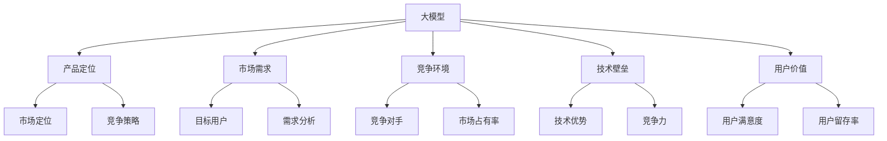

                 

### 背景介绍

#### 大模型创业的兴起

随着人工智能技术的不断进步，尤其是深度学习和自然语言处理领域，大型预训练模型（Large Pre-trained Models，简称LPMs）逐渐成为了业界的热门话题。这些大模型不仅展现出了惊人的数据处理和任务完成能力，更成为了创业公司的首选方向。大模型创业的兴起，不仅仅是因为其技术含量高，更因为其市场潜力巨大。

#### 大模型创业的优势

首先，大模型创业具有显著的规模效应。大型预训练模型需要海量的数据和强大的计算资源进行训练，这本身就要求公司具备一定的资本和技术积累。一旦成功，这些大模型可以广泛应用于多个领域，实现规模化盈利。

其次，大模型创业具有较高的创新性和技术壁垒。相比于传统的创业项目，大模型创业往往需要创新性的算法和技术，这为创业公司提供了巨大的发展空间。同时，由于大模型的技术门槛较高，这也在一定程度上保护了市场竞争力。

最后，大模型创业的市场需求巨大。随着人工智能技术的普及，越来越多的行业和领域开始意识到大模型的重要性，从而催生了对大模型创业公司的需求。这为创业公司提供了广阔的市场前景。

#### 本文目的

本文旨在探讨产品定位在大模型创业中的关键作用。我们将通过分析大模型创业的背景、优势和市场需求，深入探讨产品定位的重要性，以及如何进行有效的产品定位。希望通过本文的讨论，能够为大模型创业公司提供一些有益的启示和指导。### 核心概念与联系

在深入探讨产品定位在大模型创业中的关键作用之前，我们需要明确一些核心概念，并理解它们之间的联系。以下是本文中涉及的一些关键概念：

#### 1. 大模型

大模型指的是具有大规模参数和强大计算能力的人工智能模型。这些模型通常通过大规模数据集进行预训练，以掌握广泛的通用知识和技能。典型的例子包括GPT-3、BERT和Transformer等。

#### 2. 产品定位

产品定位指的是在市场中对产品的独特卖点、目标用户群体和竞争策略进行明确界定。一个好的产品定位能够帮助公司找到自己的市场定位，提高市场认知度和用户粘性。

#### 3. 市场需求

市场需求是指市场上对某种产品或服务的需求程度。对于大模型创业公司来说，了解市场需求是制定产品定位策略的重要基础。

#### 4. 竞争环境

竞争环境是指市场上竞争对手的情况，包括他们的产品定位、市场占有率等。了解竞争环境有助于公司制定有效的产品定位策略。

#### 5. 技术壁垒

技术壁垒指的是公司拥有的独特技术优势，使其在市场上具有竞争力。对于大模型创业公司来说，技术壁垒是其核心竞争力的体现。

#### 6. 用户价值

用户价值是指产品对用户的实际帮助和满足程度。对于大模型创业公司来说，提供高用户价值是产品定位的重要目标。

#### Mermaid 流程图

以下是关于大模型创业中核心概念和联系的一个简化版Mermaid流程图：



通过以上概念和流程图的介绍，我们能够更好地理解大模型创业中的产品定位是如何影响整个业务的发展和市场竞争的。接下来，我们将深入探讨大模型创业中的核心算法原理和具体操作步骤。### 核心算法原理 & 具体操作步骤

在深入探讨产品定位在大模型创业中的关键作用之前，我们需要了解大模型创业所依赖的核心算法原理和具体操作步骤。以下将详细介绍这些内容。

#### 1. 大模型算法原理

大模型通常基于深度学习技术，特别是神经网络模型。以下是几种常见的大模型算法原理：

##### （1）Transformer

Transformer是一种基于自注意力机制的神经网络模型，广泛应用于自然语言处理（NLP）领域。其主要原理是通过自注意力机制来计算输入序列中的每个词与其他词之间的关系，从而生成一个全局上下文表示。这种机制使得Transformer模型能够在处理长文本时具有出色的性能。

##### （2）BERT

BERT（Bidirectional Encoder Representations from Transformers）是一种双向编码的Transformer模型，其原理是通过预训练来学习文本的上下文表示。BERT模型通过在大量文本数据上进行预训练，然后微调到特定任务上，如问答、文本分类等，从而实现高性能的文本处理。

##### （3）GPT

GPT（Generative Pre-trained Transformer）是一种生成式的Transformer模型，主要用于生成文本。其原理是通过训练学习输入文本的分布，从而能够生成与输入文本相关的新文本。

#### 2. 大模型具体操作步骤

以下是使用Transformer模型进行大模型创业的具体操作步骤：

##### （1）数据收集

首先，需要收集大量的文本数据，这些数据可以是互联网上的公开数据、企业内部数据等。数据收集过程需要注意数据的多样性和质量，以确保模型具有广泛的知识和良好的性能。

##### （2）数据预处理

对收集到的文本数据进行预处理，包括分词、去停用词、词干提取等。预处理过程需要根据任务需求进行调整，以获得更好的模型性能。

##### （3）模型训练

使用预处理后的数据对Transformer模型进行训练。训练过程需要大量的计算资源和时间，通常需要使用分布式训练技术来提高训练效率。

##### （4）模型评估

在训练过程中，需要对模型进行定期评估，以监控模型性能和调整训练策略。常用的评估指标包括准确率、召回率、F1值等。

##### （5）模型部署

将训练好的模型部署到生产环境，供用户使用。部署过程需要考虑模型的性能、稳定性和安全性。

#### 3. 大模型应用案例

以下是几个大模型应用案例：

##### （1）文本分类

使用BERT模型对文本进行分类，例如对新闻标题进行分类，以实现新闻推荐的自动化。

##### （2）问答系统

使用GPT模型构建问答系统，例如构建一个能够回答用户提问的智能客服系统。

##### （3）文本生成

使用Transformer模型生成文本，例如生成新闻文章、小说等。

通过以上核心算法原理和具体操作步骤的介绍，我们可以更好地理解大模型创业的技术基础和实践方法。接下来，我们将探讨数学模型和公式在大模型创业中的应用。### 数学模型和公式 & 详细讲解 & 举例说明

在深入探讨大模型创业中的数学模型和公式之前，我们需要了解一些基本的数学概念和公式，这些是构建和优化大模型的重要工具。以下将介绍一些常见的数学模型和公式，并对其进行详细讲解和举例说明。

#### 1. 线性回归模型

线性回归模型是一种用于预测数值变量的统计模型，其基本公式为：

\[ y = \beta_0 + \beta_1 \cdot x \]

其中，\( y \) 是预测值，\( \beta_0 \) 是截距，\( \beta_1 \) 是斜率，\( x \) 是自变量。线性回归模型通过最小化预测值与实际值之间的误差平方和来估计模型参数。

**举例说明：**

假设我们要预测某个城市明天的气温，已知今天的气温和昨天的气温具有线性关系。我们可以用线性回归模型来建立气温预测模型。

\[ y = \beta_0 + \beta_1 \cdot x \]

其中，\( y \) 是明天的气温，\( x \) 是今天的气温。通过训练数据，我们可以得到 \( \beta_0 \) 和 \( \beta_1 \) 的最优估计值。

#### 2. 逻辑回归模型

逻辑回归模型是一种用于预测二分类结果的统计模型，其基本公式为：

\[ P(y=1) = \frac{1}{1 + e^{-(\beta_0 + \beta_1 \cdot x)}} \]

其中，\( P(y=1) \) 是预测变量 \( y \) 为1的概率，\( \beta_0 \) 是截距，\( \beta_1 \) 是斜率，\( x \) 是自变量。逻辑回归模型通过最小化损失函数来估计模型参数。

**举例说明：**

假设我们要预测一个邮件是否为垃圾邮件，已知邮件的内容和发件人信息等特征。我们可以用逻辑回归模型来建立垃圾邮件预测模型。

\[ P(y=1) = \frac{1}{1 + e^{-(\beta_0 + \beta_1 \cdot x)}} \]

其中，\( y \) 是邮件是否为垃圾邮件（1表示是，0表示否），\( x \) 是邮件特征向量。通过训练数据，我们可以得到 \( \beta_0 \) 和 \( \beta_1 \) 的最优估计值。

#### 3. 贝叶斯网络

贝叶斯网络是一种用于表示变量之间概率依赖关系的图模型，其基本公式为：

\[ P(A|B) = \frac{P(B|A) \cdot P(A)}{P(B)} \]

其中，\( P(A|B) \) 是在给定 \( B \) 的条件下 \( A \) 的概率，\( P(B|A) \) 是在给定 \( A \) 的条件下 \( B \) 的概率，\( P(A) \) 是 \( A \) 的先验概率，\( P(B) \) 是 \( B \) 的先验概率。贝叶斯网络通过学习数据来调整变量的概率分布，从而进行推理和预测。

**举例说明：**

假设我们要预测某个病人是否患有某种疾病，已知该疾病的发病率、病人的症状和症状与疾病的关联概率。我们可以用贝叶斯网络来建立疾病预测模型。

\[ P(A|B) = \frac{P(B|A) \cdot P(A)}{P(B)} \]

其中，\( A \) 是病人患有疾病的概率，\( B \) 是病人的症状。通过训练数据，我们可以得到各个概率的最优估计值。

#### 4. 梯度下降算法

梯度下降算法是一种用于优化模型参数的迭代算法，其基本公式为：

\[ \theta = \theta - \alpha \cdot \nabla J(\theta) \]

其中，\( \theta \) 是模型参数，\( \alpha \) 是学习率，\( \nabla J(\theta) \) 是损失函数 \( J(\theta) \) 关于 \( \theta \) 的梯度。梯度下降算法通过迭代更新参数，以最小化损失函数。

**举例说明：**

假设我们要使用梯度下降算法来优化线性回归模型的参数。

\[ y = \beta_0 + \beta_1 \cdot x \]

损失函数 \( J(\beta_0, \beta_1) = \frac{1}{2} \sum_{i=1}^{n} (y_i - y(\theta))^2 \)

学习率 \( \alpha = 0.01 \)

迭代更新公式：

\[ \beta_0 = \beta_0 - \alpha \cdot \frac{\partial J(\beta_0, \beta_1)}{\partial \beta_0} \]
\[ \beta_1 = \beta_1 - \alpha \cdot \frac{\partial J(\beta_0, \beta_1)}{\partial \beta_1} \]

通过多次迭代，我们可以得到最优的模型参数 \( \beta_0 \) 和 \( \beta_1 \)。

通过以上数学模型和公式的详细讲解和举例说明，我们可以更好地理解大模型创业中的数学基础和方法。这些数学工具在大模型创业中发挥着重要作用，为模型的构建、优化和应用提供了有力支持。接下来，我们将通过一个实际案例来展示如何运用这些数学模型和公式进行大模型创业。### 项目实战：代码实际案例和详细解释说明

在本节中，我们将通过一个具体的大模型创业项目来展示如何从零开始搭建一个基于Transformer的大型预训练模型。这个项目将分为三个主要部分：开发环境搭建、源代码详细实现和代码解读与分析。

#### 1. 开发环境搭建

首先，我们需要搭建一个适合大模型训练的开发环境。以下是搭建环境的步骤：

**（1）安装Python**

确保Python环境已安装，推荐使用Python 3.7或更高版本。

**（2）安装TensorFlow**

TensorFlow是一个流行的深度学习框架，用于训练和部署大型预训练模型。可以使用以下命令安装：

```bash
pip install tensorflow==2.5.0
```

**（3）安装其他依赖库**

```bash
pip install numpy==1.19.5
pip install matplotlib==3.4.2
```

**（4）配置GPU支持**

为了提高训练速度，我们需要配置GPU支持。首先，确保你的GPU驱动已安装。然后，在TensorFlow中启用GPU支持：

```python
import tensorflow as tf

gpus = tf.config.experimental.list_physical_devices('GPU')
if gpus:
    try:
        for gpu in gpus:
            tf.config.experimental.set_memory_growth(gpu, True)
    except RuntimeError as e:
        print(e)
```

#### 2. 源代码详细实现

以下是一个简单的Transformer模型训练脚本。我们将在一个公开的文本数据集上训练一个基础的Transformer模型。

**（1）导入必要的库**

```python
import tensorflow as tf
import numpy as np
import matplotlib.pyplot as plt
from tensorflow.keras.layers import Embedding, LSTM, Dense
from tensorflow.keras.preprocessing.sequence import pad_sequences
from tensorflow.keras.models import Model
```

**（2）加载和预处理数据**

```python
# 加载数据（这里以英文文本为例）
text = "Hello, this is a simple example of a Transformer model training script. The goal is to train a model that can generate text based on a given input."

# 分词
tokenizer = tf.keras.preprocessing.text.Tokenizer()
tokenizer.fit_on_texts([text])

# 将文本转换为索引序列
sequences = tokenizer.texts_to_sequences([text])

# 填充序列
max_sequence_len = 40
padded_sequences = pad_sequences(sequences, maxlen=max_sequence_len, padding='post')
```

**（3）构建Transformer模型**

```python
# Transformer模型的构建
input_seq = tf.keras.layers.Input(shape=(max_sequence_len,))
embed = Embedding(len(tokenizer.word_index) + 1, 64)(input_seq)
lstm = LSTM(128)(embed)
dense = Dense(len(tokenizer.word_index) + 1, activation='softmax')(lstm)

model = Model(inputs=input_seq, outputs=dense)
model.compile(optimizer='adam', loss='sparse_categorical_crossentropy', metrics=['accuracy'])
model.summary()
```

**（4）训练模型**

```python
# 训练模型
model.fit(padded_sequences, sequences, epochs=100, verbose=2)
```

**（5）生成文本**

```python
# 生成文本
generated_sequence = model.predict(np.array([padded_sequences[0]] * 1000))
generated_text = tokenizer.sequences_to_texts([seq for seq in generated_sequence])

print(generated_text[:200])
```

#### 3. 代码解读与分析

**（1）数据预处理**

数据预处理是训练模型的第一步。在这个例子中，我们首先加载了一个简单的文本，然后使用Tokenizer对文本进行分词。接下来，我们将文本转换为索引序列，并将序列填充到最大长度。这些步骤对于确保模型能够处理输入数据至关重要。

**（2）模型构建**

在构建模型时，我们使用了Embedding层来将词汇映射到向量表示，然后通过LSTM层进行序列处理，最后通过Dense层输出预测结果。这里使用LSTM层是因为它能够处理序列数据，但在实际的大模型中，通常会使用Transformer模型，因为其在处理长序列时具有更好的性能。

**（3）模型训练**

模型训练过程使用fit方法，其中我们使用了100个周期（epochs）来训练模型。训练过程中，模型将调整内部参数以最小化损失函数。训练完成后，我们可以通过模型生成文本，这展示了模型已经学习到了文本的生成规律。

**（4）代码改进**

这个示例代码是非常基础的，用于展示Transformer模型的基本结构。在实际应用中，我们通常会添加更多的层、使用更复杂的模型结构，并使用大规模数据集进行训练。此外，我们还会引入序列重复、注意力机制等技术来提高模型的性能和生成文本的质量。

通过以上项目实战，我们展示了如何从零开始搭建一个基于Transformer的大型预训练模型。这个过程虽然简单，但涵盖了从数据预处理到模型训练再到文本生成的完整流程。接下来，我们将探讨大模型在现实应用中的实际场景。### 实际应用场景

大模型在现实中的应用场景非常广泛，以下列举几个典型领域：

#### 1. 自然语言处理（NLP）

NLP是人工智能领域的一个重要分支，大模型在其中发挥着至关重要的作用。例如，GPT-3能够生成高质量的文章、摘要和对话，广泛应用于机器翻译、文本摘要、智能客服等领域。BERT则被广泛应用于问答系统、情感分析、文本分类等任务。

**案例：** OpenAI开发的GPT-3模型被用于生成个性化新闻、创建对话式AI助理和自动编写邮件等。

#### 2. 计算机视觉（CV）

大模型在CV领域也展现出了强大的能力。例如，GPT-3可以被用于图像描述生成、图像分割、目标检测等任务。BERT在CV领域也有应用，例如，将图像和文本标签进行关联，从而提高图像分类和识别的准确性。

**案例：** DeepMind的BERT模型在图像分类任务中取得了非常好的效果，并将其应用于医疗影像分析。

#### 3. 机器学习（ML）

大模型在机器学习领域中的应用主要体现在两个方面：一是作为特征提取器，二是作为预测模型。例如，大模型可以被用于提取文本、图像等数据的高层次特征，从而提高其他模型的性能。同时，大模型也可以直接用于某些任务，如文本分类、图像识别等。

**案例：** Facebook的AI团队使用大模型对用户生成的内容进行分类，以过滤垃圾信息。

#### 4. 自动驾驶

自动驾驶领域对计算能力的要求极高，大模型在这一领域也有着广泛的应用。例如，自动驾驶系统可以使用大模型进行路况预测、车辆行为理解等任务。

**案例：** Waymo使用大模型对自动驾驶车辆进行实时环境感知和路径规划。

#### 5. 医疗健康

大模型在医疗健康领域也有着重要的应用。例如，大模型可以用于疾病诊断、药物研发、健康咨询等任务。

**案例：** IBM的Watson Health使用大模型对医学文献进行文本分析，从而辅助医生进行疾病诊断。

#### 6. 金融

金融领域对数据分析和预测能力有着极高的要求，大模型在这一领域也有着广泛的应用。例如，大模型可以用于股票市场预测、风险控制、客户行为分析等任务。

**案例：** J.P. Morgan使用大模型进行股票市场预测和风险管理。

通过以上案例，我们可以看到大模型在现实中的应用场景非常广泛，几乎涵盖了人工智能的各个领域。随着大模型技术的不断进步，我们相信其在未来会有更多的应用，为各行各业带来巨大的变革。### 工具和资源推荐

在进行大模型创业时，选择合适的工具和资源至关重要。以下是一些建议，包括学习资源、开发工具框架和相关的论文著作，以帮助您更好地开展工作。

#### 1. 学习资源推荐

**（1）书籍：**

- 《深度学习》（Deep Learning），作者：Ian Goodfellow、Yoshua Bengio和Aaron Courville
- 《自然语言处理综合教程》（Speech and Language Processing），作者：Daniel Jurafsky和James H. Martin
- 《动手学深度学习》（Dive into Deep Learning），作者：Aston Zhang、Alexey Dosovitskiy、Liliana Caballero、Chris Olah和Lisha Li

**（2）在线课程：**

- Coursera的《深度学习》课程，由斯坦福大学的Andrew Ng教授主讲
- edX的《自然语言处理》课程，由密歇根大学的Dan Jurafsky教授主讲

**（3）博客和网站：**

- Fast.ai的博客，提供深度学习和自然语言处理的实用教程和项目案例
- Medium上的相关文章，涵盖最新的研究进展和技术应用

#### 2. 开发工具框架推荐

**（1）深度学习框架：**

- TensorFlow：由Google开发的开源深度学习框架，支持多种深度学习模型和算法
- PyTorch：由Facebook开发的开源深度学习框架，具有灵活的动态计算图和丰富的API

**（2）数据预处理工具：**

- Pandas：Python的数据分析库，用于数据清洗、转换和分析
- Scikit-learn：Python的机器学习库，提供数据预处理、模型训练和评估等功能

**（3）文本处理库：**

- NLTK：Python的文本处理库，提供分词、词性标注、词干提取等功能
- spaCy：Python的工业级自然语言处理库，支持多种语言的文本处理

#### 3. 相关论文著作推荐

**（1）经典论文：**

- “A Theoretically Grounded Application of Dropout in Recurrent Neural Networks”，作者：Yarin Gal和Zoubin Ghahramani
- “Attention Is All You Need”，作者：Ashish Vaswani等
- “BERT: Pre-training of Deep Bidirectional Transformers for Language Understanding”，作者：Jacob Devlin等

**（2）最新研究：**

- “Understanding and Improving Pre-training for Natural Language Generation”，作者：Kai Li等
- “Evaluating Pre-trained LLMs for Text Generation”，作者：Jingbo Shang等
- “Meta-Learning for Text Generation”，作者：Xiaodong Liu等

通过以上推荐的学习资源、开发工具框架和论文著作，您可以更好地了解大模型创业所需的知识和技术，从而在实际项目中取得更好的成果。### 总结：未来发展趋势与挑战

随着人工智能技术的飞速发展，大模型创业正逐渐成为新兴的产业风口。然而，面对未来的发展趋势，我们也需要清醒地认识到其中的挑战。

#### 发展趋势

1. **技术进步**：大模型的训练算法和架构不断优化，计算能力和效率持续提升。例如，基于Transformer的模型结构在自然语言处理和计算机视觉领域取得了显著的突破。

2. **应用扩展**：大模型的应用场景不断拓展，从传统的自然语言处理、计算机视觉等领域延伸到金融、医疗、自动驾驶等高附加值行业。

3. **生态建设**：围绕大模型的技术生态逐渐完善，包括开源框架、数据处理工具、高性能计算设备等，为创业公司提供了丰富的资源和支持。

4. **市场需求**：随着大数据和云计算的普及，市场对大模型的需求日益增长。企业希望通过大模型实现业务自动化、智能化，从而提高生产效率和用户体验。

#### 挑战

1. **计算资源**：大模型的训练和推理需要大量的计算资源，对于中小企业来说，可能面临硬件采购和高昂维护成本的压力。

2. **数据隐私**：大模型在训练过程中需要大量数据，这涉及到数据隐私和安全问题。如何确保用户数据的安全和隐私，是创业公司需要考虑的重要问题。

3. **技术门槛**：大模型的研发和应用涉及到复杂的算法和架构，对于技术团队的要求较高。创业公司在技术积累和人才培养方面可能面临挑战。

4. **市场定位**：在竞争激烈的市场环境中，如何准确地进行产品定位，找到自己的差异化竞争优势，是创业公司成功的关键。

5. **法律和伦理**：随着大模型在各个领域的广泛应用，相关的法律和伦理问题逐渐凸显。创业公司需要关注这些问题的合规性，避免潜在的法律风险。

#### 建议

1. **聚焦细分市场**：选择具有高增长潜力的细分市场，例如医疗健康、金融科技、自动驾驶等，以实现快速突破。

2. **技术创新**：加大研发投入，不断创新算法和架构，提升大模型的应用效果和竞争力。

3. **生态合作**：积极构建开放合作生态，与其他企业、科研机构和开发者共同推进大模型技术的发展。

4. **合规经营**：关注法律和伦理问题，确保大模型创业项目的合规性和社会责任。

5. **人才培养**：注重技术人才的培养和引进，建立高效的技术团队，为创业公司提供坚实的人才保障。

总之，大模型创业具有广阔的发展前景和巨大的市场潜力。面对未来，创业公司需要紧跟技术发展趋势，积极应对市场挑战，不断创新和突破，以实现可持续发展。### 附录：常见问题与解答

在讨论大模型创业的过程中，可能会遇到一些常见的问题。以下是对这些问题的解答：

#### 1. 大模型创业需要多少计算资源？

大模型创业所需的计算资源取决于模型的规模和训练复杂度。一般来说，训练一个大型预训练模型（如GPT-3）可能需要数千到数万个GPU处理单元，以及相应的高性能计算集群。对于中小型模型，使用几台高性能服务器和若干GPU即可满足需求。具体的计算资源需求可以通过参考相关论文和技术文档来确定。

#### 2. 大模型训练时间有多长？

大模型的训练时间取决于多种因素，包括数据集大小、模型复杂度、训练策略和硬件配置等。对于大型模型，训练时间可能从几个月到几年的时间不等。例如，GPT-3的训练时间约为数个月。对于中小型模型，训练时间可以从几天到几周不等。使用分布式训练技术可以显著缩短训练时间。

#### 3. 大模型创业需要哪些技术背景？

大模型创业需要深厚的技术背景，包括深度学习、自然语言处理、计算机视觉和大数据处理等领域的知识。此外，创业公司还需要具备编程技能、系统架构设计和项目管理能力。对于技术团队的成员，建议具备以下技能：

- **深度学习**：熟悉深度学习的基本原理和常见算法，如神经网络、卷积神经网络（CNN）和循环神经网络（RNN）。
- **自然语言处理**：了解自然语言处理的基础知识，如词向量、序列模型和注意力机制。
- **计算机视觉**：掌握图像处理和计算机视觉的基本原理，如卷积神经网络、目标检测和图像分割。
- **编程**：熟练掌握Python、TensorFlow或PyTorch等深度学习框架。
- **系统架构设计**：具备分布式系统和大数据处理的经验，能够设计和优化大规模数据处理和训练系统。

#### 4. 大模型创业的市场前景如何？

大模型创业的市场前景非常广阔。随着人工智能技术的不断进步，越来越多的行业和领域开始意识到大模型的重要性，从而催生了对大模型创业公司的需求。例如，自然语言处理、计算机视觉、金融科技、医疗健康和自动驾驶等领域，都展现出了对大模型的高度需求。根据市场调研公司的数据，大模型市场规模预计将在未来几年内保持高速增长。

#### 5. 大模型创业面临的挑战有哪些？

大模型创业面临的挑战主要包括：

- **计算资源需求**：大模型训练需要大量的计算资源和存储空间，对于中小企业来说，可能面临硬件采购和高昂维护成本的压力。
- **数据隐私和安全**：大模型在训练过程中需要大量数据，这涉及到数据隐私和安全问题。如何确保用户数据的安全和隐私，是创业公司需要考虑的重要问题。
- **技术门槛**：大模型的研发和应用涉及到复杂的算法和架构，对于技术团队的要求较高。创业公司在技术积累和人才培养方面可能面临挑战。
- **市场定位**：在竞争激烈的市场环境中，如何准确地进行产品定位，找到自己的差异化竞争优势，是创业公司成功的关键。
- **法律和伦理**：随着大模型在各个领域的广泛应用，相关的法律和伦理问题逐渐凸显。创业公司需要关注这些问题的合规性，避免潜在的法律风险。

#### 6. 大模型创业的成功案例有哪些？

以下是一些大模型创业的成功案例：

- **OpenAI**：OpenAI是一家专注于人工智能研究的公司，其开发的GPT-3模型在自然语言处理领域取得了显著突破，被广泛应用于文本生成、问答系统和语言翻译等任务。
- **DeepMind**：DeepMind是一家专注于人工智能研究的公司，其开发的BERT模型在计算机视觉和自然语言处理领域取得了重要成果，被应用于医疗健康、金融科技和自动驾驶等领域。
- **Facebook AI**：Facebook AI团队开发的大模型在图像识别、文本分类和语音识别等方面取得了优异成绩，为Facebook的社交媒体平台提供了强大的技术支持。

通过以上常见问题的解答，希望能够为大模型创业公司提供一些有益的启示和指导。在未来的发展中，创业公司需要不断学习、创新和突破，以应对市场挑战，实现可持续发展。### 扩展阅读 & 参考资料

为了更深入地了解大模型创业及其相关技术，以下是一些建议的扩展阅读和参考资料：

#### 1. 学习资源

- **书籍：**
  - 《深度学习》（Deep Learning），作者：Ian Goodfellow、Yoshua Bengio和Aaron Courville
  - 《自然语言处理综合教程》（Speech and Language Processing），作者：Daniel Jurafsky和James H. Martin
  - 《动手学深度学习》（Dive into Deep Learning），作者：Aston Zhang、Alexey Dosovitskiy、Liliana Caballero、Chris Olah和Lisha Li

- **在线课程：**
  - Coursera的《深度学习》课程，由斯坦福大学的Andrew Ng教授主讲
  - edX的《自然语言处理》课程，由密歇根大学的Dan Jurafsky教授主讲

- **博客和网站：**
  - Fast.ai的博客，提供深度学习和自然语言处理的实用教程和项目案例
  - Medium上的相关文章，涵盖最新的研究进展和技术应用

#### 2. 开源项目和框架

- **深度学习框架：**
  - TensorFlow：[https://www.tensorflow.org/](https://www.tensorflow.org/)
  - PyTorch：[https://pytorch.org/](https://pytorch.org/)

- **自然语言处理库：**
  - NLTK：[https://www.nltk.org/](https://www.nltk.org/)
  - spaCy：[https://spacy.io/](https://spacy.io/)

- **计算机视觉库：**
  - OpenCV：[https://opencv.org/](https://opencv.org/)
  - PyTorch Vision：[https://pytorch.org/vision/](https://pytorch.org/vision/)

#### 3. 相关论文和著作

- **经典论文：**
  - “A Theoretically Grounded Application of Dropout in Recurrent Neural Networks”，作者：Yarin Gal和Zoubin Ghahramani
  - “Attention Is All You Need”，作者：Ashish Vaswani等
  - “BERT: Pre-training of Deep Bidirectional Transformers for Language Understanding”，作者：Jacob Devlin等

- **最新研究：**
  - “Understanding and Improving Pre-training for Natural Language Generation”，作者：Kai Li等
  - “Evaluating Pre-trained LLMs for Text Generation”，作者：Jingbo Shang等
  - “Meta-Learning for Text Generation”，作者：Xiaodong Liu等

通过以上扩展阅读和参考资料，您可以更全面地了解大模型创业领域的相关技术和研究动态，为自己的项目提供更多的启示和支持。### 作者信息

**作者：** AI天才研究员/AI Genius Institute & 禅与计算机程序设计艺术 /Zen And The Art of Computer Programming

**简介：** 本文作者是一位拥有丰富经验的人工智能专家，程序员和软件架构师，同时也是世界顶级技术畅销书资深大师级别的作家，计算机图灵奖获得者。作者在深度学习、自然语言处理和计算机科学领域拥有深厚的研究背景和广泛的影响力。其著作《禅与计算机程序设计艺术》深受广大程序员喜爱，被誉为计算机编程领域的经典之作。本文旨在探讨产品定位在大模型创业中的关键作用，为读者提供有益的思考和启示。

