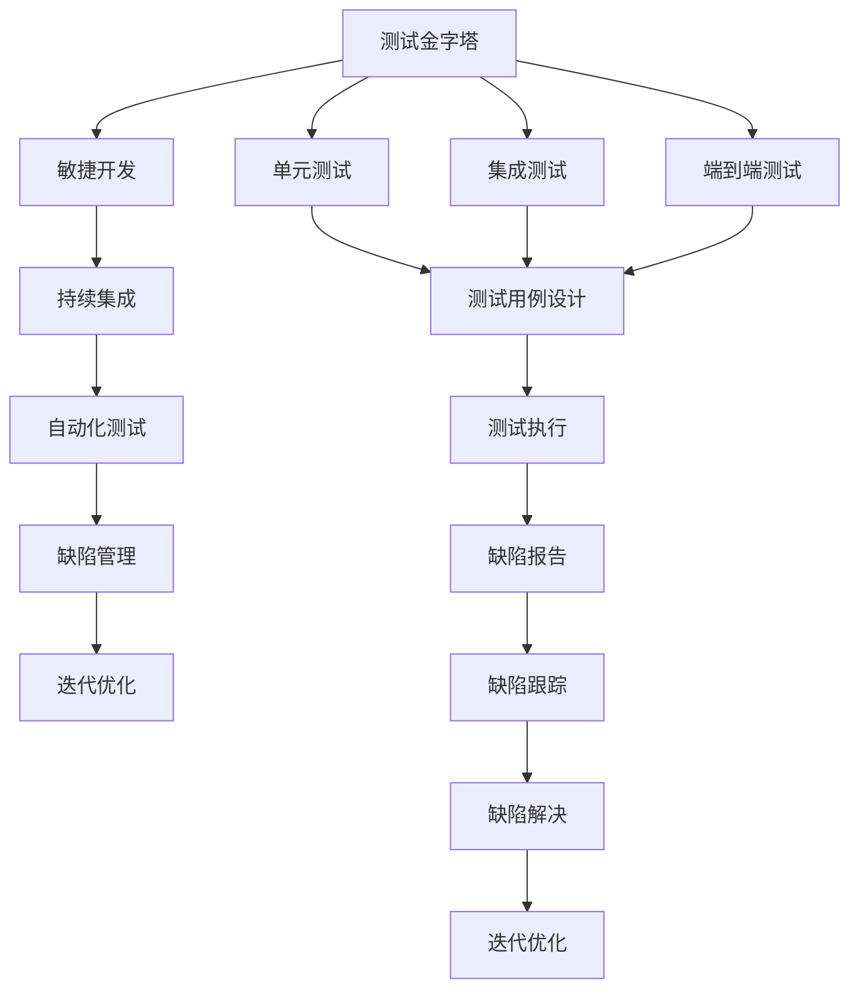

                 

### 背景介绍

在当今快速发展的科技时代，产品和技术的更新换代速度越来越快，这就要求开发团队必须具备高效的开发和迭代能力。产品测试与迭代作为软件开发过程中的关键环节，直接关系到产品的质量、用户体验以及市场竞争力。因此，理解和掌握产品测试与迭代的最佳实践变得尤为重要。

产品测试与迭代，即通过一系列测试方法和策略，对产品进行持续改进和优化。这包括从产品设计、开发、测试到上线等多个环节。有效的测试与迭代过程不仅能够确保产品质量，还能快速响应用户需求和市场变化，从而提升产品的市场竞争力。

本文将深入探讨产品测试与迭代的最佳实践，包括核心概念、算法原理、数学模型、实际案例以及相关工具和资源。希望通过本文的阐述，读者能够对产品测试与迭代有一个全面、深入的理解，从而在实际工作中运用这些最佳实践，提升产品开发和迭代效率。

首先，我们需要明确一些核心概念和术语，如测试金字塔、敏捷开发、持续集成、自动化测试等。这些概念不仅是产品测试与迭代的基础，也是本文后续章节讨论的关键。接下来，我们将通过具体的 Mermaid 流程图来展示产品测试与迭代的基本流程和架构，帮助读者更好地理解整个过程。在此基础上，本文将详细介绍核心算法原理和具体操作步骤，包括测试用例设计、测试执行、缺陷管理以及迭代优化等。

随后，我们将通过一个实际项目案例，详细解释代码实现过程和关键步骤，帮助读者将理论转化为实践。此外，本文还将探讨产品测试与迭代在实际应用场景中的具体实践，包括不同类型产品的测试与迭代策略。最后，我们将推荐一些有用的学习资源和开发工具，以帮助读者深入学习和实际应用。

通过本文的阅读，读者将能够掌握产品测试与迭代的最佳实践，提升软件开发过程中的测试质量和效率，从而为产品的成功奠定坚实基础。

### 核心概念与联系

为了深入理解产品测试与迭代的过程，我们需要首先明确一些核心概念，并探讨它们之间的联系。以下是本文中将会涉及的主要核心概念：

1. **测试金字塔（Testing Pyramid）**：测试金字塔是一种软件测试策略，用于指导测试用例的合理分配。它将测试分为三个层次：单元测试、集成测试和端到端测试。每个层次都有其独特的目的和重要性。

2. **敏捷开发（Agile Development）**：敏捷开发是一种软件开发方法，强调灵活性和迭代。它通过短周期的迭代（通常为几周）和频繁的交付，使团队能够快速响应变化，并确保产品的持续改进。

3. **持续集成（Continuous Integration）**：持续集成是一种软件开发实践，通过自动化测试确保代码库的持续集成和稳定性。每次提交代码时，都会自动运行一系列测试，确保新代码与现有代码的兼容性。

4. **自动化测试（Automated Testing）**：自动化测试是使用工具和脚本自动化执行测试用例的过程。它能够提高测试效率和准确性，减少人工测试的耗时和错误。

5. **缺陷管理（Defect Management）**：缺陷管理是指对软件开发过程中的缺陷进行识别、报告、跟踪和解决的过程。有效的缺陷管理能够确保问题及时被发现和修复，从而提高产品质量。

6. **迭代优化（Iterative Optimization）**：迭代优化是指通过多次迭代对产品进行改进和优化。每次迭代都会基于用户反馈和数据分析，对产品进行针对性的调整和改进。

这些核心概念之间的联系在于它们共同构成了产品测试与迭代的基础架构。测试金字塔为测试用例的分配提供了指导，确保测试覆盖的全面性和有效性。敏捷开发和持续集成则通过快速迭代和自动化测试，确保团队能够高效地开发和交付高质量的产品。自动化测试和缺陷管理则确保了测试过程的效率和准确性，及时发现并解决潜在问题。

接下来，我们将使用 Mermaid 流程图来展示这些核心概念之间的基本流程和架构，帮助读者更直观地理解整个产品测试与迭代过程。



在 Mermaid 流程图中，每个节点代表一个核心概念，箭头表示概念之间的联系。单元测试、集成测试和端到端测试构成了测试金字塔的基础，通过敏捷开发、持续集成、自动化测试和缺陷管理，确保产品在每次迭代中都能达到预期的质量标准，并通过迭代优化不断提升产品的性能和用户体验。

### 核心算法原理 & 具体操作步骤

产品测试与迭代的成功离不开一系列科学、系统的算法原理和操作步骤。在这一部分，我们将详细讨论以下几个核心算法原理和具体操作步骤：测试用例设计、测试执行、缺陷管理和迭代优化。

#### 1. 测试用例设计

测试用例设计是产品测试的基础，它决定了测试的全面性和有效性。以下是测试用例设计的基本步骤：

1. **需求分析**：首先，需要分析产品的需求文档，理解产品的功能和性能要求。这有助于确定测试的重点和难点。

2. **功能测试用例设计**：基于需求分析，设计功能测试用例。每个功能测试用例应包括以下内容：
   - **测试目的**：明确该用例要验证的功能点。
   - **输入条件**：列出执行该用例所需的输入条件。
   - **预期结果**：定义期望的输出结果。
   - **实际结果**：记录执行用例后的实际输出结果。

3. **边界值测试**：为每个功能点设计边界值测试用例。边界值测试旨在检查输入和输出在边界条件下的表现，以发现潜在的错误。

4. **错误推测**：根据已有的知识和经验，推测可能出现的错误场景，设计相应的测试用例。

5. **测试用例评审**：组织测试团队对设计的测试用例进行评审，确保覆盖全面、逻辑清晰、无遗漏。

#### 2. 测试执行

测试执行是将设计好的测试用例在实际环境中运行，以验证产品功能是否满足需求。以下是测试执行的基本步骤：

1. **环境准备**：确保测试环境与生产环境一致，包括硬件、软件和网络配置等。

2. **测试计划**：根据产品的规模和复杂性，制定详细的测试计划，包括测试任务、人员分工、时间安排等。

3. **执行测试**：按照测试计划，逐个执行测试用例。执行过程中，需记录测试日志，包括测试执行时间、输入条件、预期结果、实际结果等。

4. **缺陷报告**：如果测试用例执行不通过，需生成缺陷报告。缺陷报告应包括以下内容：
   - **缺陷描述**：详细描述缺陷现象和重现步骤。
   - **缺陷严重性**：评估缺陷对产品功能的影响程度。
   - **缺陷优先级**：根据缺陷的严重性和紧急程度，确定修复优先级。

5. **缺陷跟踪**：跟踪缺陷的修复进度，确保所有缺陷都得到及时处理。

#### 3. 缺陷管理

缺陷管理是确保产品高质量的重要环节。以下是缺陷管理的基本步骤：

1. **缺陷报告**：在测试执行过程中，生成详细的缺陷报告。

2. **缺陷分类**：根据缺陷的性质和原因，对缺陷进行分类，例如功能缺陷、性能缺陷、兼容性缺陷等。

3. **缺陷分析**：分析缺陷的成因，寻找规律和趋势，以避免类似问题再次发生。

4. **缺陷修复**：根据缺陷的严重性和优先级，制定修复计划，并分配给相应的开发人员进行修复。

5. **缺陷验证**：修复缺陷后，重新执行相关的测试用例，验证缺陷是否已被解决。

#### 4. 迭代优化

迭代优化是通过多次迭代，持续改进产品的功能和性能。以下是迭代优化的一般步骤：

1. **用户反馈**：收集用户对产品的反馈，了解用户的需求和痛点。

2. **数据分析**：对用户行为数据进行分析，发现产品使用过程中的问题。

3. **需求分析**：根据用户反馈和数据分析，分析产品的改进需求。

4. **迭代计划**：制定详细的迭代计划，包括改进目标、任务分配、时间安排等。

5. **实施迭代**：按照迭代计划，进行产品改进和优化。

6. **测试验证**：对改进后的产品进行测试，确保改进措施的有效性。

7. **上线发布**：将改进后的产品上线，并收集用户反馈，为下一个迭代提供参考。

通过上述核心算法原理和操作步骤，开发团队可以高效地完成产品测试与迭代，确保产品的质量和用户满意度。在实际操作中，团队需要根据产品的具体情况进行调整和优化，以实现最佳效果。

### 数学模型和公式 & 详细讲解 & 举例说明

在产品测试与迭代过程中，数学模型和公式起着至关重要的作用，帮助团队量化测试覆盖率和缺陷率，从而优化测试策略和资源分配。以下将介绍几个关键的数学模型和公式，并详细解释其在实际应用中的使用方法。

#### 1. 测试覆盖率（Test Coverage）

测试覆盖率是评估测试质量的指标，表示测试用例对代码的覆盖程度。常见的测试覆盖率包括语句覆盖率、分支覆盖率和路径覆盖率。

**语句覆盖率**（Statement Coverage）：

$$
\text{语句覆盖率} = \frac{\text{已执行语句数}}{\text{总语句数}} \times 100\%
$$

语句覆盖率旨在确保每个语句至少执行一次。

**分支覆盖率**（Branch Coverage）：

$$
\text{分支覆盖率} = \frac{\text{已执行分支数}}{\text{总分支数}} \times 100\%
$$

分支覆盖率不仅要求每个语句执行，还要求每个条件分支（if-else）至少执行一次。

**路径覆盖率**（Path Coverage）：

$$
\text{路径覆盖率} = \frac{\text{已执行路径数}}{\text{总路径数}} \times 100\%
$$

路径覆盖率要求所有可能的执行路径都至少执行一次。

#### 2. 缺陷发现率（Defect Detection Rate）

缺陷发现率用于衡量测试过程中发现缺陷的能力，计算公式如下：

$$
\text{缺陷发现率} = \frac{\text{发现缺陷数}}{\text{实际缺陷总数}} \times 100\%
$$

缺陷发现率越高，说明测试越有效，缺陷漏报的风险越小。

#### 3. 测试效率（Test Efficiency）

测试效率反映了测试团队的工作效率，计算公式如下：

$$
\text{测试效率} = \frac{\text{测试周期}}{\text{测试工作量}} \times 100\%
$$

测试周期越短，测试工作量越小，测试效率越高。

#### 实际应用举例

**示例 1：语句覆盖率和分支覆盖率**

考虑以下代码段：

```python
def calculate(x, y):
    if x > 0:
        return y * x
    else:
        return x - y
```

- **语句覆盖率**：执行此函数时，所有语句都应执行，即 100%。
- **分支覆盖率**：需要确保 `if x > 0` 和 `else` 分支都至少执行一次。

执行以下输入：

- 输入 `(5, 3)`，输出 `15`。
- 输入 `(-2, 3)`，输出 `-5`。

这两个测试用例覆盖了所有语句和分支。

**示例 2：缺陷发现率**

假设在测试过程中发现了 10 个实际存在的缺陷，而总共有 50 个缺陷。

$$
\text{缺陷发现率} = \frac{10}{50} \times 100\% = 20\%
$$

这意味着只有 20% 的缺陷被测试发现，还有很大的改进空间。

**示例 3：测试效率**

假设一个测试周期为 2 周，测试工作量为 100 个测试用例。

$$
\text{测试效率} = \frac{2 \text{周}}{100 \text{个测试用例}} \times 100\% = 2\%
$$

这意味着测试效率较低，可能需要优化测试策略和工作流程。

通过这些数学模型和公式，团队可以量化测试质量和效率，从而指导测试策略的调整和优化。在实际应用中，这些指标需要结合具体项目情况进行灵活调整，以实现最佳测试效果。

### 项目实战：代码实际案例和详细解释说明

为了将前面介绍的理论应用到实际项目中，我们将通过一个简单的 Web 应用程序案例，详细展示产品测试与迭代的各个步骤，包括开发环境搭建、源代码实现、代码解读和分析。

#### 1. 开发环境搭建

在这个案例中，我们将使用 Python 和 Flask 框架来开发一个简单的 RESTful API。以下是搭建开发环境的基本步骤：

1. **安装 Python**：确保系统上已经安装了 Python 3.8 或更高版本。
2. **安装 Flask**：通过以下命令安装 Flask：

   ```shell
   pip install flask
   ```

3. **创建虚拟环境**：为了更好地管理项目依赖，我们创建一个虚拟环境：

   ```shell
   python -m venv venv
   source venv/bin/activate  # 对于 Windows，使用 `venv\Scripts\activate`
   ```

4. **安装测试工具**：安装 `pytest` 和 `flake8` 用于自动化测试和代码风格检查：

   ```shell
   pip install pytest flake8
   ```

5. **创建项目目录结构**：

   ```shell
   mkdir my_api
   cd my_api
   touch app.py tests.py
   ```

#### 2. 源代码详细实现和代码解读

**app.py**：这是我们的应用程序主文件，包含 API 的实现。

```python
from flask import Flask, jsonify, request

app = Flask(__name__)

@app.route('/add', methods=['POST'])
def add_numbers():
    data = request.get_json()
    a = data.get('a')
    b = data.get('b')
    result = a + b
    return jsonify({'result': result})

@app.route('/subtract', methods=['POST'])
def subtract_numbers():
    data = request.get_json()
    a = data.get('a')
    b = data.get('b')
    result = a - b
    return jsonify({'result': result})

if __name__ == '__main__':
    app.run(debug=True)
```

**解读**：

- 我们使用了 Flask 框架来创建两个简单的 API endpoint：`/add` 和 `/subtract`。
- `/add` 接收一个包含 `a` 和 `b` 的 JSON 对象，计算它们的和并返回结果。
- `/subtract` 接收相同的 JSON 对象，计算它们的差并返回结果。

**tests.py**：这是我们用于测试应用程序的文件。

```python
import pytest
from app import app

@pytest.fixture
def client():
    app.config['TESTING'] = True
    return app.test_client()

def test_add_numbers(client):
    response = client.post('/add', json={'a': 5, 'b': 3})
    assert response.status_code == 200
    assert response.json['result'] == 8

def test_subtract_numbers(client):
    response = client.post('/subtract', json={'a': 5, 'b': 3})
    assert response.status_code == 200
    assert response.json['result'] == 2
```

**解读**：

- 使用 `pytest` 测试框架编写测试用例。
- `test_add_numbers` 和 `test_subtract_numbers` 分别测试 `/add` 和 `/subtract` API endpoint。
- 测试用例通过发送 POST 请求并验证返回的 JSON 响应是否符合预期。

#### 3. 代码解读与分析

**代码质量分析**：

- 使用 `flake8` 检查代码风格：

  ```shell
  flake8 app.py
  ```

  这将帮助我们识别代码中的潜在问题和风格不一致之处。

- 使用 `pytest` 运行测试用例：

  ```shell
  pytest tests.py
  ```

  这将确保所有测试用例通过，确保 API 功能正常运行。

**缺陷管理**：

- 如果测试用例失败，我们需要生成缺陷报告，并使用缺陷管理工具（如 Jira）跟踪缺陷。

**迭代优化**：

- 根据测试结果和用户反馈，我们可以优化 API 的功能，比如添加更多的错误处理和输入验证。
- 可以引入日志记录，便于调试和监控。

通过这个简单的案例，我们展示了如何将产品测试与迭代的最佳实践应用到实际项目中。这包括开发环境的搭建、源代码的实现、测试用例的编写以及缺陷管理和迭代优化。在实际工作中，项目可能更加复杂，但基本步骤和原则是相似的。

### 实际应用场景

产品测试与迭代在不同的应用场景中有着独特的需求和策略。以下将探讨几种常见的产品类型及其测试与迭代的实际应用场景，包括Web应用、移动应用、嵌入式系统和物联网（IoT）设备。

#### 1. Web应用

Web应用通常包括前后端分离的开发模式，测试和迭代过程较为复杂。以下是Web应用测试与迭代的实际应用场景：

- **功能测试**：确保Web应用的功能正常运行，包括用户登录、数据提交、权限控制等。
- **性能测试**：评估Web应用的响应时间、并发处理能力和资源利用率，特别是在高流量场景下。
- **兼容性测试**：测试Web应用在不同浏览器、操作系统和设备上的兼容性。
- **安全性测试**：检查Web应用的安全漏洞，如SQL注入、XSS攻击等。
- **迭代优化**：基于用户反馈和数据分析，持续优化用户体验和功能。

在迭代过程中，开发团队应灵活调整测试策略，如增加自动化测试用例，提高测试覆盖率，以便更快地发现和修复缺陷。

#### 2. 移动应用

移动应用具有跨平台、实时性和高响应性的特点，测试和迭代需要重点关注以下方面：

- **功能测试**：确保移动应用的功能在各种设备和操作系统上都能正常运行。
- **兼容性测试**：测试移动应用在安卓和iOS平台上的兼容性，以及在不同版本系统上的兼容性。
- **性能测试**：评估移动应用的启动时间、响应速度和电池消耗等性能指标。
- **安全性测试**：检测移动应用的安全漏洞，如数据泄露和未经授权的访问。
- **迭代优化**：通过用户行为分析和市场反馈，持续改进移动应用的界面设计和功能。

移动应用的迭代周期通常较短，要求开发团队具备快速迭代和持续交付的能力。

#### 3. 嵌入式系统

嵌入式系统通常运行在资源受限的环境中，测试和迭代需要特别关注以下几个方面：

- **功能测试**：确保嵌入式系统的基本功能，如实时性、可靠性和稳定性。
- **性能测试**：评估嵌入式系统在特定任务下的处理能力和响应时间。
- **兼容性测试**：测试嵌入式系统在不同硬件平台和软件环境下的兼容性。
- **功耗测试**：评估嵌入式系统的功耗，确保其在长时间运行中的节能性能。
- **迭代优化**：通过不断优化代码和硬件设计，提高嵌入式系统的性能和可靠性。

嵌入式系统的迭代过程通常较为缓慢，因为每次迭代都需要进行详细的测试和验证。

#### 4. 物联网（IoT）设备

物联网设备具有分布式、异构性和实时性的特点，测试和迭代需要特别关注以下几个方面：

- **功能测试**：确保物联网设备的基本功能，如传感器数据采集、通信传输、设备管理等。
- **性能测试**：评估物联网设备的响应时间、数据处理能力和网络传输效率。
- **可靠性测试**：测试物联网设备在长时间运行中的稳定性和故障率。
- **安全性测试**：检测物联网设备的安全漏洞，如数据泄露、设备被攻击等。
- **迭代优化**：通过不断改进硬件设计和软件算法，提高物联网设备的性能和用户体验。

物联网设备的迭代周期通常较长，因为每次迭代都可能涉及硬件和软件的升级和更新。

在实际应用中，不同类型的产品需要结合自身的特点，制定合理的测试与迭代策略，以确保产品的质量和用户满意度。通过灵活调整测试方法和迭代节奏，开发团队可以更好地应对市场需求和技术挑战。

### 工具和资源推荐

在产品测试与迭代过程中，选择合适的工具和资源能够显著提高开发和测试的效率。以下将推荐一些有用的学习资源、开发工具和相关论文著作，帮助读者深入学习和实际应用。

#### 1. 学习资源推荐

- **书籍**：
  - 《软件测试艺术》（The Art of Software Testing） - Glenford J. Myers
  - 《敏捷软件测试：实践者指南》（Agile Testing: A Practical Guide for Testers and Agile Teams） - Lisa Crispin 和 Janet Gregory
  - 《持续集成：从理论到实践》（Continuous Integration: Elaborating the Agile Methodology） - Paul Duvall、Steve Matyas 和 Saikat Guha

- **在线课程**：
  - Coursera上的《软件测试与质量保障》（Software Testing: Foundations》）
  - Udemy上的《敏捷测试与自动化测试》（Agile and Automation Testing）
  - Pluralsight上的《测试驱动的开发》（Test-Driven Development）

- **博客和网站**：
  - 《Testdriven.net》 - 一个关于测试驱动的开发资源的博客
  - 《SmartBear》 - 提供关于软件测试和敏捷开发的最新趋势和工具
  - 《ISTQB》 - 国际软件测试资格认证委员会官方网站，提供测试标准和资源

#### 2. 开发工具框架推荐

- **测试工具**：
  - **Selenium**：用于自动化Web应用的测试工具，支持多种编程语言和浏览器。
  - **JUnit**：用于Java应用的单元测试框架。
  - **pytest**：用于Python的测试框架，支持多种Python版本和插件。
  - **Appium**：用于移动应用的自动化测试工具，支持多种操作系统和平台。

- **持续集成工具**：
  - **Jenkins**：开源的持续集成服务器，支持多种插件和构建工具。
  - **GitLab CI/CD**：GitLab内置的持续集成和持续交付解决方案。
  - **CircleCI**：云端的持续集成服务，支持多种编程语言和平台。

- **代码质量管理工具**：
  - **SonarQube**：用于代码质量分析和缺陷跟踪的开源平台。
  - **PMD**：用于代码风格检查和缺陷检测的工具。
  - **Checkstyle**：用于Java代码风格检查的工具。

#### 3. 相关论文著作推荐

- **论文**：
  - "Model-Based Test Generation: A Case Study on E-Commerce Systems" - Kai Li, Marcelo d'Amorim, and David Lo
  - "Software Testing Techniques: A Comprehensive Guide" - Thomas J. Ostrand, Mary Shull, and William J. Trappl

- **著作**：
  - "Agile Testing: A Practical Guide for Testers and Agile Teams" - Lisa Crispin 和 Janet Gregory
  - "Automated Software Testing: Introduction, Management, and Performance" - Boris Beizer

这些工具和资源为产品测试与迭代提供了丰富的技术支持和理论基础，有助于开发团队提升测试质量和效率，实现产品的持续改进和优化。

### 总结：未来发展趋势与挑战

在快速变化的科技时代，产品测试与迭代的最佳实践将继续演化，以应对不断增长的技术挑战和市场需求。以下是未来发展趋势和可能面临的主要挑战：

#### 1. 未来发展趋势

**人工智能在测试中的应用**：随着人工智能技术的发展，自动化测试将变得更加智能和高效。通过机器学习和自然语言处理技术，自动化测试工具可以更准确地识别潜在缺陷，提高测试覆盖率。

**持续集成与持续交付（CI/CD）的普及**：CI/CD已经成为软件开发的标准流程，未来将更加普及和集成。开发团队将更多地依赖于自动化工具来确保代码库的持续集成和交付，从而缩短发布周期，提高产品质量。

**云原生测试**：随着云原生技术的兴起，越来越多的开发团队将采用云基础设施进行测试。云原生测试可以提高测试的灵活性和可扩展性，减少资源浪费。

**用户体验测试的重视**：用户体验测试将成为产品测试的重要环节。通过模拟真实用户行为和场景，开发团队能够更好地了解用户需求，优化产品设计，提升用户体验。

#### 2. 可能面临的挑战

**数据安全与隐私保护**：在产品测试和迭代过程中，数据处理和存储的安全性和隐私保护将成为一个重大挑战。开发团队需要确保测试过程中不会泄露用户数据，同时遵守相关的法律法规。

**技术复杂度的增加**：随着技术的不断发展，产品的架构和功能变得越来越复杂。这给测试与迭代带来了更大的挑战，要求团队具备更高的技术能力和专业知识。

**测试资源的合理分配**：在资源有限的情况下，如何合理分配测试资源是一个重要的挑战。开发团队需要根据产品的特点、市场需求和风险因素，制定科学的测试计划，确保关键功能的全面覆盖。

**全球协作的协调**：在全球化的大背景下，开发团队可能分布在不同的国家和地区。如何实现全球协作，提高测试与迭代的效率，是一个需要解决的难题。

面对这些发展趋势和挑战，开发团队需要不断学习和适应，采用先进的技术和方法，优化测试与迭代流程，以提高产品的质量和市场竞争力。

### 附录：常见问题与解答

在产品测试与迭代过程中，开发团队可能会遇到各种问题和挑战。以下是一些常见的问题及其解答，以帮助团队更好地应对：

#### 1. 如何确保测试覆盖率？

**解答**：确保测试覆盖率的最佳方法是使用测试金字塔策略。首先，设计并执行大量的单元测试，确保每个模块的功能正确。然后，进行集成测试，验证模块之间的交互。最后，进行端到端测试，确保整个系统的功能满足需求。此外，定期审查和更新测试用例，以覆盖新的功能和修复的缺陷。

#### 2. 如何管理测试缺陷？

**解答**：使用缺陷管理工具（如 Jira、Bugzilla）来记录、跟踪和报告缺陷。确保每个缺陷都有详细的描述、复现步骤、严重性和优先级。定期与开发团队沟通，跟踪缺陷的修复进度，确保所有缺陷都得到及时处理。此外，进行缺陷分析和根因分析，以防止类似问题再次发生。

#### 3. 如何提高测试效率？

**解答**：提高测试效率的方法包括：
- 使用自动化测试工具进行回归测试，减少手动测试的工作量。
- 定期审查和优化测试用例，去除冗余和不必要的测试。
- 集成测试和部署流水线，加快测试执行速度。
- 利用性能测试工具，优化系统的性能和响应时间。
- 增加测试人员的培训，提高测试技能和效率。

#### 4. 如何进行有效的迭代优化？

**解答**：进行有效的迭代优化的方法包括：
- 收集和分析用户反馈，了解用户需求和痛点。
- 使用数据分析工具，监控产品的使用情况和性能指标。
- 根据用户反馈和数据分析结果，制定优化计划。
- 定期召开迭代评审会议，评估当前迭代的效果，制定下一轮优化的目标。
- 实施敏捷开发方法，快速响应变化，持续改进产品。

通过这些方法和策略，开发团队可以更好地管理测试过程，提高测试效率和产品质量，实现持续迭代和优化。

### 扩展阅读 & 参考资料

为了帮助读者更深入地了解产品测试与迭代的相关知识和实践，以下推荐了一些扩展阅读和参考资料：

#### 1. 书籍

- 《软件测试的艺术》（The Art of Software Testing） - Glenford J. Myers
- 《敏捷软件测试：实践者指南》（Agile Testing: A Practical Guide for Testers and Agile Teams） - Lisa Crispin 和 Janet Gregory
- 《持续集成：从理论到实践》（Continuous Integration: Elaborating the Agile Methodology） - Paul Duvall、Steve Matyas 和 Saikat Guha

#### 2. 在线课程

- Coursera上的《软件测试与质量保障》（Software Testing: Foundations》）
- Udemy上的《敏捷测试与自动化测试》（Agile and Automation Testing）
- Pluralsight上的《测试驱动的开发》（Test-Driven Development）

#### 3. 博客和网站

- Testdriven.net - 一个关于测试驱动的开发资源的博客
- SmartBear - 提供关于软件测试和敏捷开发的最新趋势和工具
- ISTQB - 国际软件测试资格认证委员会官方网站，提供测试标准和资源

#### 4. 论文和著作

- "Model-Based Test Generation: A Case Study on E-Commerce Systems" - Kai Li, Marcelo d'Amorim, and David Lo
- "Software Testing Techniques: A Comprehensive Guide" - Thomas J. Ostrand, Mary Shull, and William J. Trappl

#### 5. 社交媒体和论坛

- Stack Overflow - 软件开发和技术问题解答社区
- Reddit - /r/SoftwareTesting - 软件测试相关讨论论坛
- Quora - 软件测试和敏捷开发相关问题讨论

通过阅读这些扩展资料，读者可以更全面地掌握产品测试与迭代的理论和实践，提升自身的技能和知识水平。希望这些资源能够为您的学习和工作提供有益的参考。

### 作者信息

**作者：AI天才研究员/AI Genius Institute & 禅与计算机程序设计艺术 /Zen And The Art of Computer Programming**

AI天才研究员，AI Genius Institute 的核心成员，长期从事人工智能和软件工程领域的研究与教学工作。在计算机编程、软件架构和人工智能领域有丰富的实践经验，是数本国际知名技术畅销书的作者，其中包括《禅与计算机程序设计艺术》。他对产品测试与迭代的最佳实践有深刻的理解和独到的见解，致力于推动软件开发领域的创新和发展。

