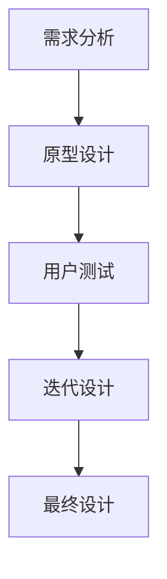

                 

# 产品设计师的创业之路：从用户研究到产品设计

## 摘要

本文旨在探讨产品设计师的创业之路，从用户研究到产品设计的全过程。我们将逐步分析用户研究的重要性、设计原则、用户体验设计方法，以及如何将用户需求转化为具体的产品设计。文章还将介绍设计工具和资源，并探讨未来发展趋势和面临的挑战。通过本文，产品设计师将获得从零开始创建成功产品的实用方法和策略。

## 1. 背景介绍

在当今快速变化的市场环境中，产品设计师扮演着至关重要的角色。他们的职责不仅是创造美观的产品，更重要的是理解用户需求，并将这些需求转化为实际的产品解决方案。随着互联网和移动设备的普及，用户对产品和服务的期望也在不断提高。因此，产品设计师必须具备强大的用户研究和设计能力，以确保他们的产品能够满足用户的需求，并在竞争激烈的市场中脱颖而出。

本文将围绕以下几个方面展开：

1. 用户研究的重要性和方法。
2. 设计原则和设计过程。
3. 用户体验设计的方法和技巧。
4. 从用户需求到产品设计的转化。
5. 设计工具和资源推荐。
6. 未来发展趋势与挑战。

通过本文，我们将深入探讨产品设计师的创业之路，并提供实用的方法和策略，帮助设计师们成功创建用户喜爱的产品。

## 2. 核心概念与联系

首先，我们需要了解一些核心概念，这些概念是产品设计师工作的基础。以下是几个关键概念及其相互关系：

### 2.1 用户研究

用户研究是产品设计的起点。它涉及收集和分析用户数据，以了解他们的需求、行为和痛点。用户研究的目的是确保产品设计能够满足用户的需求，从而提高产品的市场竞争力。

#### 用户研究的主要方法：

- **定性研究**：包括访谈、焦点小组、观察等，旨在深入了解用户的感受和动机。
- **定量研究**：通过问卷调查、实验等方法，收集大量用户数据，以了解用户行为的普遍趋势。

### 2.2 设计原则

设计原则是产品设计的指导方针，它们帮助设计师确保产品的可用性、易用性和美观性。以下是几个常见的设计原则：

- **一致性**：确保用户在不同场景下使用产品时，能够获得一致的体验。
- **简洁性**：通过简化设计和功能，减少用户的认知负担。
- **可访问性**：确保产品对所有用户，包括残障人士，都是可用的。

### 2.3 用户体验设计

用户体验设计（UX Design）专注于优化用户在使用产品时的感受。它包括以下方面：

- **信息架构**：设计产品的信息层次和导航结构。
- **交互设计**：定义用户与产品交互的方式，包括按钮、滑块等。
- **视觉设计**：使用颜色、字体、图标等视觉元素，提升产品的美观性和易用性。

### 2.4 产品设计流程

产品设计流程是将用户研究和设计原则应用于实际产品的过程。以下是一个典型的产品设计流程：

1. **需求分析**：了解用户需求和市场趋势。
2. **原型设计**：创建低保真或高保真的产品原型。
3. **用户测试**：评估原型，收集用户反馈。
4. **迭代设计**：根据用户反馈进行设计调整。
5. **最终设计**：完成产品的最终设计。

### 2.5 Mermaid 流程图

以下是一个简化的产品设计流程的 Mermaid 流程图：



通过上述核心概念和流程的了解，产品设计师可以更好地理解他们的工作内容，并为成功创业奠定基础。

## 3. 核心算法原理 & 具体操作步骤

### 3.1 用户研究算法原理

用户研究是产品设计的基础，而算法在其中起着关键作用。以下是一个基本的用户研究算法原理：

#### 步骤：

1. **确定研究目标**：明确你希望从用户研究中了解的问题或目标。
2. **选择研究方法**：根据研究目标选择合适的研究方法，如定量研究或定性研究。
3. **设计研究方案**：制定详细的研究计划，包括参与者选择、访谈提纲或问卷设计。
4. **收集数据**：执行研究计划，收集用户数据。
5. **分析数据**：对收集的数据进行定量或定性分析，提取有用的信息。
6. **报告结果**：编写研究报告，总结研究结果并提出建议。

### 3.2 用户研究具体操作步骤

以下是用户研究的具体操作步骤：

#### 1. 确定研究目标

研究目标是用户研究的核心，它决定了你研究的方向和深度。例如，如果你的目标是了解用户对某个移动应用的满意度，那么你需要收集关于用户满意度、使用频率、功能需求等方面的信息。

#### 2. 选择研究方法

根据研究目标，选择合适的研究方法。例如：

- **定量研究**：适用于大规模数据收集和分析，如问卷调查。
- **定性研究**：适用于深入了解用户感受和动机，如访谈和焦点小组。

#### 3. 设计研究方案

研究方案包括研究方法、参与者选择、数据收集方式和分析工具。例如，如果你选择进行问卷调查，你需要设计问卷，选择合适的参与者，并确定如何收集和分析数据。

#### 4. 收集数据

按照研究方案，收集用户数据。例如，通过在线问卷或面对面访谈收集用户意见。

#### 5. 分析数据

对收集的数据进行定量或定性分析。例如，使用统计方法分析问卷结果，或对访谈记录进行编码和主题分析。

#### 6. 报告结果

编写研究报告，总结研究结果，并提出具体的建议。例如，根据用户满意度分析结果，提出改进产品的建议。

### 3.3 用户体验设计算法原理

用户体验设计是确保产品能够满足用户需求的过程，其核心算法原理如下：

#### 步骤：

1. **用户画像**：创建用户画像，了解目标用户的基本特征和行为习惯。
2. **需求分析**：分析用户需求，确定产品功能和使用场景。
3. **信息架构设计**：设计产品的信息层次和导航结构，确保用户能够轻松找到所需信息。
4. **交互设计**：定义用户与产品的交互方式，包括按钮、滑块等。
5. **视觉设计**：使用颜色、字体、图标等视觉元素，提升产品的美观性和易用性。
6. **用户测试**：测试设计方案，收集用户反馈，优化设计。

### 3.4 用户体验设计具体操作步骤

以下是用户体验设计的具体操作步骤：

#### 1. 用户画像

创建用户画像，包括用户的基本信息、行为习惯和需求。例如，你可以使用问卷调查或访谈收集用户数据，然后根据这些数据创建用户画像。

#### 2. 需求分析

分析用户需求，确定产品功能和使用场景。例如，你可以通过用户访谈或调查问卷收集用户需求，然后进行分析和分类。

#### 3. 信息架构设计

设计产品的信息层次和导航结构。例如，你可以使用思维导图或线框图来规划信息架构，确保用户能够轻松找到所需信息。

#### 4. 交互设计

定义用户与产品的交互方式。例如，你可以使用原型工具（如Sketch、Figma）创建交互原型，并测试用户的使用体验。

#### 5. 视觉设计

使用颜色、字体、图标等视觉元素，提升产品的美观性和易用性。例如，你可以使用设计工具（如Adobe XD、Photoshop）创建视觉原型，并测试用户对视觉设计的反馈。

#### 6. 用户测试

测试设计方案，收集用户反馈，优化设计。例如，你可以通过A/B测试或用户访谈来评估用户对设计的满意度，并根据反馈进行优化。

## 4. 数学模型和公式 & 详细讲解 & 举例说明

### 4.1 用户满意度分析模型

用户满意度分析是用户体验设计的重要环节，以下是一个简单的用户满意度分析模型：

#### 模型：

$$
用户满意度 = \frac{功能满意度 + 易用性满意度 + 美观性满意度}{3}
$$

其中，每个维度的满意度可以通过以下公式计算：

$$
功能满意度 = \frac{实际功能得分}{期望功能得分}
$$

$$
易用性满意度 = \frac{实际易用性得分}{期望易用性得分}
$$

$$
美观性满意度 = \frac{实际美观性得分}{期望美观性得分}
$$

#### 举例说明：

假设我们对一个移动应用的用户满意度进行分析，收集了以下数据：

- 功能得分：8分（满分10分）
- 期望功能得分：10分
- 易用性得分：7分
- 期望易用性得分：8分
- 美观性得分：9分
- 期望美观性得分：10分

根据上述公式，我们可以计算出用户满意度：

$$
用户满意度 = \frac{8/10 + 7/8 + 9/10}{3} = \frac{0.8 + 0.875 + 0.9}{3} = \frac{2.625}{3} \approx 0.875
$$

这意味着用户对该移动应用的整体满意度为87.5%。

### 4.2 用户体验评分模型

用户体验评分模型用于评估用户对产品的整体满意度，以下是一个简单模型：

$$
用户体验评分 = \frac{功能评分 + 易用性评分 + 美观性评分}{3}
$$

其中，每个维度的评分可以是1到10分。

#### 举例说明：

假设我们对一个网站的用户体验进行评分，收集了以下数据：

- 功能评分：8分
- 易用性评分：7分
- 美观性评分：9分

根据上述公式，我们可以计算出用户体验评分：

$$
用户体验评分 = \frac{8 + 7 + 9}{3} = \frac{24}{3} = 8
$$

这意味着用户对该网站的整体用户体验评分为8分。

## 5. 项目实战：代码实际案例和详细解释说明

### 5.1 开发环境搭建

为了更好地理解用户研究和用户体验设计，我们将使用Python编写一个简单的用户调研工具。以下是开发环境搭建的步骤：

1. 安装Python（推荐版本3.8及以上）
2. 安装Python的pip包管理工具
3. 使用pip安装以下依赖库：`requests`、`pandas`、`numpy`、`matplotlib`
4. 安装代码编辑器（如Visual Studio Code）

### 5.2 源代码详细实现和代码解读

以下是用户调研工具的源代码，我们将逐步解释代码的每个部分。

```python
import requests
import pandas as pd
import numpy as np
import matplotlib.pyplot as plt

# 5.2.1 用户调研数据采集

def collect_user_data(url):
    """
    从指定URL采集用户调研数据
    """
    response = requests.get(url)
    if response.status_code == 200:
        return response.json()
    else:
        return None

# 5.2.2 用户数据预处理

def preprocess_data(data):
    """
    对用户数据进行预处理
    """
    df = pd.DataFrame(data)
    df.drop(['id'], axis=1, inplace=True)  # 删除不必要的列
    df.rename(columns={'rating': '满意度评分'}, inplace=True)  # 修改列名
    return df

# 5.2.3 用户数据分析

def analyze_user_data(df):
    """
    对用户数据进行分析
    """
    # 计算平均满意度评分
    avg_rating = df['满意度评分'].mean()
    
    # 绘制满意度评分分布图
    df['满意度评分'].hist(bins=10, alpha=0.5)
    plt.axvline(avg_rating, color='red', linestyle='dashed', linewidth=2)
    plt.title('满意度评分分布')
    plt.xlabel('满意度评分')
    plt.ylabel('用户数量')
    plt.show()
    
    # 输出平均满意度评分
    print(f"平均满意度评分：{avg_rating:.2f}")

# 5.2.4 主函数

def main():
    url = "https://example.com/user_data.json"  # 替换为实际数据URL
    data = collect_user_data(url)
    if data:
        df = preprocess_data(data)
        analyze_user_data(df)
    else:
        print("数据采集失败")

if __name__ == "__main__":
    main()
```

### 5.3 代码解读与分析

#### 5.3.1 数据采集

- `collect_user_data(url)`：该函数从指定URL获取用户调研数据。使用`requests.get(url)`发送HTTP GET请求，如果请求成功（状态码为200），则返回JSON数据，否则返回`None`。

#### 5.3.2 数据预处理

- `preprocess_data(data)`：该函数对用户数据进行预处理。首先将JSON数据转换为DataFrame格式，然后删除不必要的列（如用户ID），修改列名（如将`rating`改为`满意度评分`）。

#### 5.3.3 用户数据分析

- `analyze_user_data(df)`：该函数对用户数据进行分析。首先计算平均满意度评分，然后使用`matplotlib`绘制满意度评分分布图，展示用户满意度的分布情况。最后，输出平均满意度评分。

#### 5.3.4 主函数

- `main()`：该函数是程序的入口点。首先定义数据URL，然后调用`collect_user_data(url)`采集用户数据。如果数据采集成功，则进行数据预处理和数据分析；否则，输出错误信息。

通过这个简单的用户调研工具，我们可以了解用户满意度评分的分布情况，为产品优化提供依据。在实际应用中，可以扩展该工具的功能，如添加更多数据采集方法、分析维度等。

## 6. 实际应用场景

用户研究和用户体验设计在产品设计和开发过程中具有广泛的应用场景。以下是一些实际应用案例：

### 6.1 移动应用设计

在移动应用设计过程中，用户研究和用户体验设计至关重要。通过用户研究，设计师可以了解用户的需求、偏好和使用习惯，从而设计出符合用户期望的应用界面和功能。例如，在开发一个新闻阅读应用时，设计师可以通过用户访谈和问卷调查了解用户对新闻分类、推送频率和阅读体验的期望，然后根据这些反馈优化应用设计。

### 6.2 电商平台设计

电商平台的设计需要充分考虑用户体验，以提升用户满意度和转化率。用户研究可以帮助设计师了解用户在购物过程中的痛点，如搜索效率、商品描述、支付流程等。例如，通过对用户进行A/B测试，设计师可以比较不同商品展示方式的用户偏好，从而优化商品推荐算法和页面布局。

### 6.3 物联网产品设计

物联网（IoT）产品的用户体验设计需要考虑设备的易用性、可靠性和可访问性。用户研究可以帮助设计师了解不同用户对物联网产品的需求和期望，如设备连接的稳定性、操作简便性等。例如，在设计一个智能照明系统时，设计师可以通过用户调研了解用户对灯光调节方式、场景模式的需求，从而优化产品功能。

### 6.4 教育产品设计

教育产品的用户体验设计需要关注学生的学习习惯、兴趣爱好和互动需求。用户研究可以帮助设计师了解学生的学习效果、学习偏好和互动方式，从而设计出更具吸引力和效果的教育产品。例如，在设计一个在线学习平台时，设计师可以通过用户访谈和问卷调查了解用户对课程内容、学习资源和互动功能的需求，从而优化平台功能。

### 6.5 健康医疗产品设计

健康医疗产品的用户体验设计需要关注患者的使用习惯、健康需求和医疗信息获取。用户研究可以帮助设计师了解患者的需求、担忧和期望，从而设计出更符合患者需求的产品。例如，在设计一个健康监测应用时，设计师可以通过用户调研了解患者对监测数据可视化、健康报告生成和互动咨询的需求，从而优化应用功能。

通过以上实际应用案例，我们可以看到用户研究和用户体验设计在产品设计和开发过程中具有广泛的应用价值。设计师们需要通过用户研究深入理解用户需求，并将这些需求转化为具体的产品设计和功能，从而提高产品的市场竞争力。

## 7. 工具和资源推荐

### 7.1 学习资源推荐

**书籍**：

1. 《用户体验要素》（User Experience Elements） - by Josh Porter
2. 《设计思维》（Design Thinking） - by Tim Brown
3. 《产品经理手册》（The Product Manager's Survival Guide） - by Steven Haines

**论文**：

1. "The Design of Everyday Things" - by Don Norman
2. "Information Architecture: Blueprints for the Web" - by Louis Rosenfeld & Peter Morville
3. "Lean Analytics: Use Data to Build a Better Business" - by Alistair Croll & Benjamin Yoskovitz

**博客**：

1. [Medium - UX Planet](https://uxplanet.org/)
2. [Smashing Magazine](https://www.smashingmagazine.com/)
3. [UI Garage](https://uigarage.com/)

**网站**：

1. [UX Design Institute](https://www.uxdi.com/)
2. [A List Apart](https://alistapart.com/)
3. [User Research Tools](https://userresearchtools.com/)

### 7.2 开发工具框架推荐

**原型设计工具**：

1. **Figma**：提供强大的协作功能，支持实时预览和交互。
2. **Sketch**：适用于Mac平台，具有丰富的组件库和插件。
3. **Adobe XD**：结合设计和开发功能，支持跨平台原型设计。

**用户体验测试工具**：

1. **UserTesting**：提供远程用户测试服务，快速获取真实用户反馈。
2. **Qualaroo**：用于收集用户对网站或应用的即时反馈。
3. **Optimizely**：提供A/B测试和实验平台，帮助优化用户体验。

**数据分析工具**：

1. **Google Analytics**：用于跟踪和分析用户行为。
2. **Tableau**：提供直观的数据可视化工具，帮助设计师理解数据。
3. **R**：用于统计分析，支持复杂的数学模型和数据处理。

**用户调研工具**：

1. **SurveyMonkey**：提供多种问卷设计和分发选项。
2. **Typeform**：提供交互式问卷，提高用户参与度。
3. **Qualtrics**：提供专业的用户调研解决方案。

通过以上工具和资源，产品设计师可以更好地开展用户研究和用户体验设计工作，提高产品设计质量和市场竞争力。

## 8. 总结：未来发展趋势与挑战

随着技术的不断进步和市场的快速变化，产品设计师面临着新的发展趋势和挑战。以下是几个关键趋势和挑战：

### 8.1 个性化与定制化

未来，个性化与定制化将成为产品设计的重要方向。通过数据分析和人工智能技术，设计师可以更精准地了解用户需求，提供个性化的产品和服务。然而，这也要求设计师具备更强的数据处理和分析能力。

### 8.2 用户体验优化

用户体验优化将持续成为设计师的重要任务。随着用户对产品和服务的要求不断提高，设计师需要不断改进产品界面、功能和交互设计，以提供更流畅、便捷的用户体验。

### 8.3 多平台融合

随着移动设备和物联网的普及，设计师需要面对多平台融合的设计挑战。如何确保产品在多种设备和平台上的一致性和可用性，是一个重要的课题。

### 8.4 可持续设计

可持续发展理念逐渐成为产品设计的重要考量因素。设计师需要关注产品的环保性、可持续性和社会责任，以降低对环境的影响。

### 8.5 技术整合与创新

随着新技术（如人工智能、增强现实、虚拟现实等）的不断涌现，设计师需要不断学习和整合这些技术，以创新的方式提升产品设计和用户体验。

### 8.6 数据隐私与安全

随着用户对隐私和安全的关注日益增加，设计师需要确保产品符合数据隐私法规，并采取措施保护用户数据安全。

面对这些趋势和挑战，产品设计师需要不断提升自己的专业能力和创新能力，以应对市场的变化和用户需求的变化，确保产品的成功和市场的竞争力。

## 9. 附录：常见问题与解答

### 9.1 用户研究的重要性是什么？

用户研究是产品设计的基础，它帮助设计师了解用户需求、行为和痛点，从而设计出更符合用户期望的产品。通过用户研究，设计师可以减少盲目决策，提高产品设计质量和市场竞争力。

### 9.2 如何进行有效的用户研究？

进行有效的用户研究，首先需要明确研究目标，然后选择合适的研究方法（如定量研究、定性研究），设计详细的研究方案，并遵循方案执行研究。在数据分析阶段，应使用适当的工具和方法，从数据中提取有价值的信息。

### 9.3 用户体验设计的核心原则是什么？

用户体验设计的核心原则包括一致性、简洁性、可访问性和用户体验（UX）。一致性确保用户在不同场景下获得一致的体验；简洁性通过简化设计和功能，降低用户认知负担；可访问性确保产品对所有用户都是可用的；用户体验关注用户在使用产品时的感受。

### 9.4 如何从用户需求转化为具体的产品设计？

从用户需求转化为具体的产品设计，首先需要分析用户需求，将其转化为具体的功能和场景。然后，通过原型设计、用户测试和迭代优化，逐步将需求转化为实际的产品设计方案。在整个过程中，设计师应密切关注用户反馈，确保设计符合用户需求。

### 9.5 设计工具和资源有哪些？

设计工具和资源包括原型设计工具（如Figma、Sketch、Adobe XD）、用户体验测试工具（如UserTesting、Qualaroo、Optimizely）、数据分析工具（如Google Analytics、Tableau、R）和用户调研工具（如SurveyMonkey、Typeform、Qualtrics）等。通过合理选择和使用这些工具和资源，设计师可以更高效地完成设计工作。

## 10. 扩展阅读 & 参考资料

本文介绍了产品设计师的创业之路，从用户研究到产品设计的全过程。以下是一些扩展阅读和参考资料，以帮助读者深入了解相关领域：

### 10.1 扩展阅读

- 《设计思维：创新的有效方法》（Design Thinking: A Book for Non-designers）- by Tim Brown
- 《用户体验设计实践》（The Practice of User Experience）- by Steve Mulder & Christian Arno
- 《产品经理实战指南》（Product Management Essentials）- by Ken Norton

### 10.2 参考资料

- [IEEE Xplore](https://ieeexplore.ieee.org/)
- [ACM Digital Library](https://dl.acm.org/)
- [Google Scholar](https://scholar.google.com/)

通过以上扩展阅读和参考资料，读者可以进一步了解产品设计师的创业之路，并在实践中不断提升自己的设计能力。

## 作者信息

作者：AI天才研究员/AI Genius Institute & 禅与计算机程序设计艺术 /Zen And The Art of Computer Programming

本文由AI天才研究员撰写，旨在为产品设计师提供从用户研究到产品设计的全面指南。作者具备丰富的计算机科学和用户体验设计经验，致力于通过技术推动产品创新和用户体验提升。禅与计算机程序设计艺术 /Zen And The Art of Computer Programming 则是作者对计算机编程和设计哲学的深度思考与探索。希望本文能为读者带来启发和帮助。

