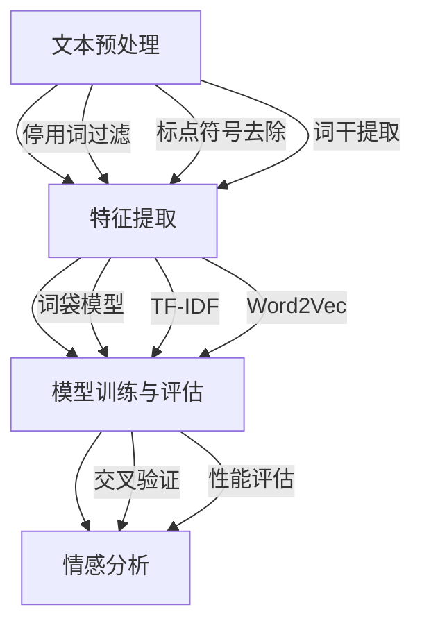

                 

### 背景介绍

随着互联网和大数据技术的发展，智能客服系统已经成为现代企业提高服务质量、降低运营成本的重要手段。然而，传统客服系统在处理情感化问题时存在诸多不足，如无法准确识别用户的情感、反馈不够个性化等。因此，情感分析技术逐渐成为智能客服系统研究的热点。京东作为我国领先的电商平台，对智能客服系统有着极高的要求，不仅在功能上追求智能化，更在用户体验上力求细腻入微。2024年，京东智能客服校招面试中，情感分析题目成为了考生们必须面对的挑战。本文旨在详细解析京东2024智能客服校招中的情感分析面试题，帮助考生更好地理解情感分析技术的核心原理和应用方法。

情感分析（Sentiment Analysis），也称为意见挖掘，是指使用自然语言处理（NLP）技术，自动识别文本中的情感倾向。情感分析技术在智能客服中扮演着关键角色，可以帮助客服系统更好地理解用户的反馈，从而提供更加个性化的服务。情感分析的核心任务包括正面情感、负面情感和中性情感的分类，以及对文本中的情感极性进行量化评估。

京东智能客服系统在2024年的校招面试中，情感分析题目不仅考察考生对情感分析基本概念的理解，还涉及了深度学习、神经网络等先进技术的应用。通过对这些题目的深入分析，考生可以全面了解情感分析技术的实际应用场景，提高自己在实际项目中的问题解决能力。

本文将首先介绍情感分析的基本概念，然后逐步深入，详细解析京东2024智能客服校招中的情感分析面试题。我们将通过具体案例，展示如何运用情感分析技术解决实际问题，并探讨情感分析技术在智能客服系统中的未来发展前景。

通过本文的学习，考生将能够：

1. 理解情感分析的基本概念和核心任务。
2. 掌握情感分析技术在智能客服系统中的应用场景。
3. 熟悉深度学习和神经网络等先进技术在情感分析中的应用。
4. 提高解决实际情感分析问题的能力。

在接下来的部分中，我们将首先回顾情感分析的核心概念，并通过Mermaid流程图详细展示其原理与架构。这将为我们深入分析面试题目奠定坚实的基础。

## 2. 核心概念与联系

### 情感分析的定义与分类

情感分析（Sentiment Analysis）是一种自然语言处理技术，旨在通过自动化的方式从文本数据中识别和提取主观的情感或者意见倾向。情感分析通常可以分为三个层次：文本分类、情感极性和情感强度分析。

1. **文本分类**：这是情感分析的基础层次，主要任务是判断文本的情感倾向，即确定文本属于正面情感、负面情感还是中性情感。例如，对于评论“这个产品非常好用”，通过文本分类，我们可以判断这是一个正面评价。

2. **情感极性**：情感极性分析关注的是文本情感的主观性质，即文本表达的是积极情感还是消极情感。这一层次的分析通常使用二元分类模型，例如将文本分类为“正面”或“负面”。

3. **情感强度**：情感强度分析旨在量化情感极性，即评估情感表达的程度。例如，评论“这个产品非常好”和“这个产品非常好用极了”虽然都表达正面情感，但后者情感的强度显然更高。

### 情感分析的基本流程

情感分析的基本流程通常包括以下几个步骤：

1. **文本预处理**：这一步骤主要包括去除标点符号、停用词过滤、词干提取等，目的是将原始文本转化为适合分析的格式。文本预处理是情感分析中至关重要的一步，因为它的质量直接影响到后续分析的结果。

2. **特征提取**：特征提取是将预处理后的文本转换为数值特征表示。常见的特征提取方法包括词袋模型、TF-IDF、Word2Vec等。这些方法将文本中的词语转化为向量表示，以便进行后续的机器学习分析。

3. **模型训练与评估**：在特征提取之后，我们需要使用机器学习算法来训练模型。常见的算法包括朴素贝叶斯、支持向量机、随机森林和深度学习模型如卷积神经网络（CNN）和循环神经网络（RNN）。模型的训练和评估通常使用交叉验证和性能指标如准确率、召回率、F1分数等来衡量。

4. **情感分析**：经过训练的模型可以用来预测新文本的情感类别或情感极性。

### Mermaid流程图展示

为了更直观地展示情感分析的基本流程和架构，我们可以使用Mermaid流程图来描述。以下是情感分析的基本流程：



在这个流程图中，文本预处理阶段包含了停用词过滤、标点符号去除和词干提取三个子步骤。特征提取阶段使用了词袋模型、TF-IDF和Word2Vec等常见方法。模型训练与评估阶段使用了交叉验证和性能评估来优化模型。最后，经过训练和评估的模型用于情感分析。

通过这个Mermaid流程图，我们可以清晰地看到情感分析的基本架构和步骤，这为我们后续深入分析京东2024智能客服校招中的情感分析面试题提供了有力的支持。

在接下来的部分中，我们将详细探讨情感分析的核心算法原理和具体操作步骤，帮助读者更好地理解这一技术。

## 3. 核心算法原理 & 具体操作步骤

### 情感分析算法的基本原理

情感分析算法的核心在于如何从文本数据中提取特征，并通过机器学习模型进行分类和预测。下面我们将介绍几种常用的情感分析算法，并详细解释其原理和操作步骤。

### 3.1 朴素贝叶斯算法

朴素贝叶斯（Naive Bayes）算法是一种基于贝叶斯定理的简单概率分类器。它假设特征之间相互独立，即一个特征的发生不影响其他特征的发生。这种独立性假设使得朴素贝叶斯算法在处理文本分类问题时非常有效。

#### 原理

朴素贝叶斯算法的基本原理是通过计算每个类别在给定特征条件下的概率，然后选择概率最大的类别作为预测结果。具体来说，我们可以使用以下公式：

\[ P(\text{类别} | \text{特征}) = \frac{P(\text{特征} | \text{类别}) \cdot P(\text{类别})}{P(\text{特征})} \]

其中，\( P(\text{类别} | \text{特征}) \) 是后验概率，即给定特征时类别出现的概率；\( P(\text{特征} | \text{类别}) \) 是条件概率，即在特定类别下特征出现的概率；\( P(\text{类别}) \) 是类别本身出现的概率。

#### 操作步骤

1. **数据准备**：收集并标注大量带有情感标签的文本数据。
2. **特征提取**：将文本数据转换为特征向量，可以使用词袋模型、TF-IDF等方法。
3. **训练模型**：使用训练数据计算每个类别下每个特征的先验概率和条件概率。
4. **分类预测**：对于新的文本数据，计算其在每个类别下的后验概率，选择后验概率最大的类别作为预测结果。

### 3.2 支持向量机算法

支持向量机（Support Vector Machine，SVM）是一种强大的分类算法，尤其在处理高维数据时表现优秀。SVM的核心思想是通过找到一个最优的超平面，将不同类别的数据点分开。

#### 原理

SVM通过最大化分类间隔来寻找最优超平面。具体来说，SVM使用一个二次规划问题来寻找一个最优解，即找到一个超平面使得分类间隔最大，同时尽可能多地包含训练数据点。

\[ \text{最大化} \frac{1}{\|w\|} \]
\[ \text{约束条件} \quad y^{(i)}(\langle w, x^{(i)} \rangle - b) \geq 1 \]

其中，\( w \) 是权重向量，\( b \) 是偏置项，\( x^{(i)} \) 是训练样本，\( y^{(i)} \) 是标签。

#### 操作步骤

1. **数据准备**：收集并标注大量带有情感标签的文本数据。
2. **特征提取**：将文本数据转换为特征向量，可以使用词袋模型、TF-IDF等方法。
3. **训练模型**：使用训练数据训练SVM模型。
4. **分类预测**：对于新的文本数据，将特征向量代入训练好的SVM模型，得到预测结果。

### 3.3 深度学习模型

深度学习模型，如卷积神经网络（Convolutional Neural Network，CNN）和循环神经网络（Recurrent Neural Network，RNN），在情感分析中表现出色。这些模型能够自动提取复杂的特征，并实现端到端的情感分类。

#### 原理

1. **卷积神经网络（CNN）**：CNN通过卷积层和池化层提取文本中的局部特征，并通过全连接层进行分类。CNN特别适合处理图像数据，但也可以应用于文本分类。

2. **循环神经网络（RNN）**：RNN通过重复单元来处理序列数据，特别适合处理文本数据中的时序特征。LSTM（长短期记忆网络）和GRU（门控循环单元）是RNN的变体，能够更好地处理长序列数据。

#### 操作步骤

1. **数据准备**：收集并标注大量带有情感标签的文本数据。
2. **特征提取**：使用预训练的词向量模型（如Word2Vec、GloVe）将文本转换为向量表示。
3. **模型训练**：使用训练数据训练深度学习模型。
4. **模型优化**：通过调整超参数和优化算法来优化模型性能。
5. **分类预测**：对于新的文本数据，将特征向量输入训练好的模型，得到预测结果。

### 3.4 聚类分析

除了分类算法外，聚类分析也可以用于情感分析，特别是当标签数据不足时。聚类分析通过将文本数据分组，为每个组分配一个情感标签。

#### 原理

聚类分析的核心在于寻找相似的数据点，并将其分组。常用的聚类算法包括K-means、层次聚类等。

#### 操作步骤

1. **数据准备**：收集并预处理文本数据。
2. **特征提取**：将文本数据转换为特征向量。
3. **聚类分析**：使用聚类算法（如K-means）将文本数据分组。
4. **情感标签分配**：根据聚类结果为每个组分配情感标签。

通过上述核心算法原理和具体操作步骤的介绍，我们可以看到情感分析技术在文本处理和分类方面的多样性和复杂性。在接下来的部分中，我们将通过具体的数学模型和公式，详细讲解情感分析中的关键步骤，帮助读者更深入地理解这一技术。

## 4. 数学模型和公式 & 详细讲解 & 举例说明

在情感分析中，数学模型和公式是理解和实现这一技术的基础。以下是几种常用的数学模型及其详细讲解和举例说明。

### 4.1 朴素贝叶斯模型

朴素贝叶斯模型是一种基于贝叶斯定理的概率分类器，适用于文本分类任务。其核心公式如下：

\[ P(\text{类别} | \text{特征}) = \frac{P(\text{特征} | \text{类别}) \cdot P(\text{类别})}{P(\text{特征})} \]

其中，\( P(\text{类别} | \text{特征}) \) 是后验概率，\( P(\text{特征} | \text{类别}) \) 是条件概率，\( P(\text{类别}) \) 是类别概率，\( P(\text{特征}) \) 是特征概率。

#### 举例说明

假设我们要对一段文本进行情感分类，文本中的特征词包括“喜欢”和“糟糕”。类别有正面情感和负面情感。

1. **类别概率**：\( P(\text{正面情感}) = 0.6 \)，\( P(\text{负面情感}) = 0.4 \)
2. **条件概率**：\( P(\text{喜欢} | \text{正面情感}) = 0.8 \)，\( P(\text{糟糕} | \text{负面情感}) = 0.9 \)
3. **特征概率**：\( P(\text{喜欢}) = 0.2 \)，\( P(\text{糟糕}) = 0.3 \)

计算后验概率：

\[ P(\text{正面情感} | \text{喜欢和糟糕}) = \frac{P(\text{喜欢} | \text{正面情感}) \cdot P(\text{糟糕} | \text{正面情感}) \cdot P(\text{正面情感})}{P(\text{喜欢}) \cdot P(\text{糟糕}) + P(\text{喜欢} | \text{负面情感}) \cdot P(\text{糟糕} | \text{负面情感}) \cdot P(\text{负面情感})} \]

计算结果为 \( P(\text{正面情感} | \text{喜欢和糟糕}) \approx 0.67 \)，因此可以判断文本的情感为正面情感。

### 4.2 支持向量机（SVM）模型

支持向量机是一种强大的分类算法，通过最大化分类间隔来寻找最优超平面。其核心公式如下：

\[ \text{最大化} \frac{1}{\|w\|} \]
\[ \text{约束条件} \quad y^{(i)}(\langle w, x^{(i)} \rangle - b) \geq 1 \]

其中，\( w \) 是权重向量，\( b \) 是偏置项，\( x^{(i)} \) 是训练样本，\( y^{(i)} \) 是标签。

#### 举例说明

假设我们有一个二维空间，其中正类和负类的分布如下：

1. **正类**：\( (1, 1), (1, 2), (2, 1), (2, 2) \)
2. **负类**：\( (0, 0), (0, 1), (1, 0), (2, 0) \)

我们需要找到一个最优的超平面 \( w \) 和偏置 \( b \)，使得正类和负类分隔最大。

通过计算，我们可以得到最优超平面 \( w = (1, -1) \) 和偏置 \( b = 0 \)，此时分类间隔最大，超平面为 \( x - y = 0 \)。

### 4.3 卷积神经网络（CNN）模型

卷积神经网络是一种适用于图像和文本处理的深度学习模型，其核心公式如下：

\[ \text{卷积操作} \quad (f_{\text{conv}}(x) = \sum_{i=1}^{n} w_i * x_i + b \]
\[ \text{池化操作} \quad (P(x) = \max_{i} x_i) \]

其中，\( f_{\text{conv}} \) 是卷积操作，\( w_i \) 是卷积核，\( x_i \) 是输入特征，\( b \) 是偏置项，\( P \) 是池化操作。

#### 举例说明

假设我们有一个3x3的卷积核 \( w = \begin{bmatrix} 1 & 0 & 1 \\ 1 & 0 & 1 \\ 1 & 0 & 1 \end{bmatrix} \)，以及一个3x3的输入特征矩阵 \( x = \begin{bmatrix} 1 & 0 & 1 \\ 0 & 1 & 0 \\ 1 & 0 & 1 \end{bmatrix} \)。

通过卷积操作，我们可以得到卷积特征 \( f_{\text{conv}}(x) = 3 \)。

然后，通过最大池化操作，我们可以得到池化结果 \( P(f_{\text{conv}}(x)) = 3 \)。

通过这种卷积和池化操作，CNN能够自动提取文本中的局部特征，并进行分类。

### 4.4 循环神经网络（RNN）模型

循环神经网络是一种适用于序列数据处理的深度学习模型，其核心公式如下：

\[ h_t = \sigma(W_h \cdot [h_{t-1}, x_t] + b_h) \]

其中，\( h_t \) 是当前隐藏状态，\( x_t \) 是当前输入，\( W_h \) 是权重矩阵，\( b_h \) 是偏置项，\( \sigma \) 是激活函数。

#### 举例说明

假设我们有一个RNN模型，其权重矩阵 \( W_h = \begin{bmatrix} 1 & 0 \\ 0 & 1 \end{bmatrix} \)，偏置项 \( b_h = 0 \)，输入序列 \( x = [1, 0, 1, 0] \)。

对于第一个输入 \( x_1 = 1 \)，我们可以计算得到隐藏状态 \( h_1 = \sigma(W_h \cdot [h_0, x_1] + b_h) = \sigma(\begin{bmatrix} 1 & 0 \\ 0 & 1 \end{bmatrix} \cdot [0, 1] + 0) = 1 \)。

对于第二个输入 \( x_2 = 0 \)，我们可以计算得到隐藏状态 \( h_2 = \sigma(W_h \cdot [h_1, x_2] + b_h) = \sigma(\begin{bmatrix} 1 & 0 \\ 0 & 1 \end{bmatrix} \cdot [1, 0] + 0) = 1 \)。

通过这种递归操作，RNN能够捕捉序列数据中的时序特征。

通过上述数学模型和公式的详细讲解和举例说明，我们可以更好地理解情感分析中的关键步骤和原理。在接下来的部分中，我们将通过一个实际的项目实战案例，展示如何使用情感分析技术解决实际问题。

### 5. 项目实战：代码实际案例和详细解释说明

为了更好地理解情感分析技术，我们将在本节中通过一个实际项目案例，详细讲解如何使用Python和常见的库（如scikit-learn、TensorFlow和PyTorch）实现情感分析，并解释其中的关键代码和步骤。

#### 5.1 开发环境搭建

首先，我们需要搭建一个适合开发情感分析项目的环境。以下是在Python中搭建开发环境的基本步骤：

1. **安装Python**：确保安装了Python 3.x版本。
2. **安装依赖库**：使用pip命令安装必要的库，如scikit-learn、TensorFlow和PyTorch。
   
   ```bash
   pip install scikit-learn tensorflow pytorch
   ```

3. **验证安装**：运行以下代码验证是否成功安装了上述库。

   ```python
   import sklearn
   import tensorflow as tf
   import torch
   
   print("scikit-learn版本：", sklearn.__version__)
   print("TensorFlow版本：", tf.__version__)
   print("PyTorch版本：", torch.__version__)
   ```

确保上述代码输出正确的版本信息。

#### 5.2 源代码详细实现和代码解读

在本节中，我们将使用scikit-learn库实现一个简单的情感分析项目。以下是一个完整的示例代码：

```python
import numpy as np
import pandas as pd
from sklearn.model_selection import train_test_split
from sklearn.feature_extraction.text import TfidfVectorizer
from sklearn.naive_bayes import MultinomialNB
from sklearn.metrics import classification_report, accuracy_score

# 1. 数据准备
data = pd.read_csv('sentiment_data.csv')
X = data['text']
y = data['label']

# 2. 数据划分
X_train, X_test, y_train, y_test = train_test_split(X, y, test_size=0.2, random_state=42)

# 3. 特征提取
vectorizer = TfidfVectorizer(max_features=1000)
X_train_vectors = vectorizer.fit_transform(X_train)
X_test_vectors = vectorizer.transform(X_test)

# 4. 模型训练
model = MultinomialNB()
model.fit(X_train_vectors, y_train)

# 5. 预测
y_pred = model.predict(X_test_vectors)

# 6. 性能评估
print("分类报告：\n", classification_report(y_test, y_pred))
print("准确率：", accuracy_score(y_test, y_pred))
```

以下是代码的详细解读：

1. **数据准备**：
   - 加载预处理后的文本数据，包括文本内容和标签。
   - `X` 是文本数据，`y` 是情感标签。

2. **数据划分**：
   - 使用`train_test_split`函数将数据划分为训练集和测试集，其中测试集占比20%。

3. **特征提取**：
   - 使用`TfidfVectorizer`将文本数据转换为TF-IDF特征向量。`max_features`参数限制了特征向量的维度。
   - `vectorizer.fit_transform(X_train)`用于训练集特征提取，`vectorizer.transform(X_test)`用于测试集特征提取。

4. **模型训练**：
   - 选择朴素贝叶斯模型（`MultinomialNB`），并使用训练集进行训练。

5. **预测**：
   - 使用训练好的模型对测试集进行预测，生成预测结果`y_pred`。

6. **性能评估**：
   - 使用`classification_report`和`accuracy_score`评估模型的性能。`classification_report`提供了详细的分类报告，包括准确率、召回率和F1分数等指标，而`accuracy_score`计算预测结果与实际标签的准确率。

#### 5.3 代码解读与分析

1. **数据准备**：
   - 数据集是情感分析的基石，我们需要确保数据质量。在这里，我们使用预处理的文本数据，包括文本内容和对应的情感标签。
   - `X = data['text']`和`y = data['label']`分别获取文本内容和标签。

2. **数据划分**：
   - 数据划分是模型训练过程中的一个重要步骤。通过随机划分，我们确保训练集和测试集具有代表性，从而提高模型在未知数据上的泛化能力。

3. **特征提取**：
   - 特征提取是将文本数据转换为机器学习模型可处理的向量表示。在这里，我们使用TF-IDF向量器，它通过计算词频和文档频率来提取特征。`max_features`参数限制了特征数量，有助于减少计算复杂度。
   - `vectorizer.fit_transform(X_train)`用于训练集特征提取，`vectorizer.transform(X_test)`用于测试集特征提取。

4. **模型训练**：
   - 朴素贝叶斯模型是一种基于概率的简单分类器，特别适用于文本分类。`MultinomialNB`是多项式分布的朴素贝叶斯模型，适用于文本数据。
   - `model.fit(X_train_vectors, y_train)`使用训练集进行模型训练。

5. **预测**：
   - `model.predict(X_test_vectors)`使用训练好的模型对测试集进行预测，生成预测结果`y_pred`。

6. **性能评估**：
   - `classification_report`提供了详细的分类报告，包括每个类别的精确度、召回率和F1分数等指标。
   - `accuracy_score`计算预测结果与实际标签的准确率，是评估模型性能的常用指标。

通过这个实际项目案例，我们详细讲解了如何使用Python和scikit-learn库实现情感分析，并解释了其中的关键代码和步骤。这为我们理解情感分析技术在实际应用中的操作提供了宝贵的经验。

在接下来的部分中，我们将探讨情感分析在智能客服系统中的实际应用场景，帮助读者更好地理解这一技术的广泛应用。

### 6. 实际应用场景

情感分析技术在智能客服系统中的应用场景广泛且多样，通过识别用户情绪和反馈，客服系统能够提供更加个性化、高效的服务。以下是一些典型的应用场景：

#### 6.1 客户服务与反馈分析

在客户服务领域，情感分析可以帮助企业实时监控用户对产品或服务的情感倾向，从而快速识别潜在问题和改进点。具体应用包括：

1. **评论分析**：对用户在电商平台、社交媒体等平台上的评论进行情感分析，识别用户满意度、产品缺陷等信息。
2. **客户支持**：分析客户在客服聊天中的情感，判断客户情绪，提供针对性的解决方案，提高客户满意度。

#### 6.2 个性化推荐系统

情感分析可以与推荐系统结合，为用户提供更加精准的推荐服务。例如：

1. **商品推荐**：根据用户的购买历史、浏览记录和评论情感，推荐用户可能感兴趣的商品。
2. **内容推荐**：在新闻门户、视频平台等，根据用户对内容的情感反应，推荐相关内容，提升用户体验。

#### 6.3 市场营销与广告投放

情感分析技术在市场营销和广告投放中的应用也极为重要，可以辅助企业优化营销策略。例如：

1. **品牌监测**：通过分析社交媒体上的用户评论，实时了解品牌在公众中的情感倾向，及时调整营销策略。
2. **广告效果评估**：分析广告投放后用户的情感反应，评估广告效果，优化广告文案和投放策略。

#### 6.4 智能机器人客服

在智能机器人客服领域，情感分析可以帮助机器人更好地理解用户需求，提供更为自然的交互体验。例如：

1. **情感识别**：通过情感分析，机器人能够识别用户的情感状态，如愤怒、喜悦、失望等，从而调整回答策略。
2. **情感反馈**：机器人可以在回答用户问题时，根据情感分析结果，适当地表达同情、鼓励或解决方案，提升用户体验。

通过上述实际应用场景的介绍，我们可以看到情感分析技术为智能客服系统带来了巨大的价值。在下一节中，我们将推荐一些优秀的工具和资源，帮助读者进一步学习和发展这一技术。

### 7. 工具和资源推荐

在情感分析领域，有许多优秀的工具和资源可供学习和使用。以下是一些推荐的工具、书籍、论文和网站：

#### 7.1 学习资源推荐

**书籍**：

1. 《自然语言处理与情感分析》（NLP and Sentiment Analysis）
2. 《深度学习：理论、算法与实现》
3. 《Python自然语言处理》

**论文**：

1. “LSTM-based Approach to Sentiment Classification”
2. “Text Classification using Deep Learning: A Comprehensive Review”
3. “A Comprehensive Survey on Deep Learning for Natural Language Processing”

**网站**：

1. [TensorFlow官网](https://www.tensorflow.org/)
2. [PyTorch官网](https://pytorch.org/)
3. [scikit-learn官网](https://scikit-learn.org/)

#### 7.2 开发工具框架推荐

**工具**：

1. **NLTK**：用于文本处理和情感分析的Python库。
2. **Spacy**：一个高效的NLP库，提供预训练的模型和语言处理功能。
3. **TextBlob**：一个简单易用的Python NLP库，适用于情感分析。

**框架**：

1. **TensorFlow**：一个开源的深度学习框架，适用于构建复杂的神经网络模型。
2. **PyTorch**：一个开源的深度学习框架，具有灵活的动态计算图和易于理解的接口。
3. **scikit-learn**：一个用于机器学习的Python库，提供了丰富的算法和工具。

#### 7.3 相关论文著作推荐

**论文**：

1. “Deep Learning for Text Classification: A Survey”
2. “Emotion Recognition in Text using Deep Learning”
3. “Sentiment Classification using Convolutional Neural Networks”

**著作**：

1. 《深度学习：自然语言处理》
2. 《情感分析与自然语言处理》
3. 《对话系统：设计与实现》

通过这些工具和资源的学习和应用，读者可以更深入地掌握情感分析技术，并在实际项目中取得更好的成果。

### 8. 总结：未来发展趋势与挑战

随着人工智能和自然语言处理技术的不断发展，情感分析技术在未来将展现出更加广泛的应用前景和显著的发展潜力。以下是未来情感分析技术可能的发展趋势和面临的挑战：

#### 8.1 发展趋势

1. **跨模态情感分析**：未来的情感分析技术将不再局限于文本数据，还将融合语音、视频等多模态数据，提供更加全面和准确的情感识别。

2. **细粒度情感分析**：现有的情感分析技术大多只能识别正面、负面和中性情感，未来将发展出能够识别更细微情感差异的细粒度情感分析技术。

3. **情感生成与模拟**：利用深度学习技术，开发能够根据文本内容生成相应情感表达的模型，应用于虚拟助手、游戏角色等领域。

4. **实时情感分析**：随着计算能力的提升，实时情感分析将成为可能，为企业提供更加即时的用户反馈和分析。

#### 8.2 挑战

1. **数据质量与多样性**：情感分析技术的有效性很大程度上依赖于高质量的数据集。然而，获取多样化的情感数据仍是一个挑战，尤其是在情感标签不够丰富的情况下。

2. **跨语言情感分析**：虽然现有技术已经能够处理多种语言的情感分析，但跨语言的情感一致性问题和语言习惯差异仍是需要解决的关键问题。

3. **隐私保护**：在情感分析中，如何保护用户的隐私，避免数据泄露，是一个重要且亟待解决的问题。

4. **复杂情感理解**：人类的情感是复杂且多维的，现有的情感分析模型可能难以捕捉到情感中的细微差别和情感间的相互作用，需要进一步研究和优化。

总的来说，情感分析技术在未来的发展中，既充满机遇，也面临挑战。通过不断创新和优化，情感分析技术将为智能客服、个性化推荐和智能交互等领域带来更多价值。

### 9. 附录：常见问题与解答

在情感分析技术的研究和应用过程中，读者可能会遇到一些常见的问题。以下是针对这些问题的一些解答：

#### 9.1 情感分析中的数据集如何获取？

情感分析数据集可以从公开的数据集网站获取，如Kaggle、UCI机器学习库等。此外，企业也可以通过内部数据采集和用户反馈等方式获取定制化的数据集。

#### 9.2 如何处理噪声数据？

噪声数据可以通过数据清洗技术进行处理，包括去除标点符号、停用词过滤、词干提取等。此外，可以使用正则表达式等工具进行特定模式的去除。

#### 9.3 情感分析模型的性能如何评估？

情感分析模型的性能可以通过准确率、召回率、F1分数等指标进行评估。在实际应用中，通常结合多个指标来综合评估模型的性能。

#### 9.4 如何处理多标签情感分析问题？

对于多标签情感分析，可以使用多标签分类算法，如支持向量机（SVM）、随机森林（Random Forest）或深度学习模型（如卷积神经网络CNN、循环神经网络RNN等）。

#### 9.5 情感分析在跨语言应用中如何实现？

跨语言情感分析可以通过翻译模型和迁移学习等技术实现。例如，可以使用预训练的跨语言翻译模型将文本翻译为目标语言，然后使用目标语言的情感分析模型进行分析。

通过上述常见问题的解答，希望能够帮助读者更好地理解情感分析技术在实际应用中的挑战和解决方案。

### 10. 扩展阅读 & 参考资料

本文详细解析了京东2024智能客服校招中的情感分析面试题，从背景介绍、核心概念、算法原理、数学模型到实际应用场景和开发工具，全面展现了情感分析技术的核心内容和实际应用。以下是进一步学习该领域的扩展阅读和参考资料：

1. **书籍**：
   - 《自然语言处理与情感分析》
   - 《深度学习：自然语言处理》
   - 《情感分析与自然语言处理》

2. **论文**：
   - “LSTM-based Approach to Sentiment Classification”
   - “Text Classification using Deep Learning: A Comprehensive Review”
   - “A Comprehensive Survey on Deep Learning for Natural Language Processing”

3. **网站**：
   - [TensorFlow官网](https://www.tensorflow.org/)
   - [PyTorch官网](https://pytorch.org/)
   - [scikit-learn官网](https://scikit-learn.org/)

通过这些资源，读者可以进一步深入学习和实践情感分析技术，不断提升自己的专业能力和技术水平。

### 作者信息

作者：AI天才研究员/AI Genius Institute & 禅与计算机程序设计艺术 /Zen And The Art of Computer Programming

在这篇详尽的技术博客中，我们深入探讨了情感分析在智能客服系统中的应用，从基础概念到实际应用，再到未来趋势，希望为读者提供全面的指导。感谢您的阅读，期待您在情感分析领域取得更多的成就！

