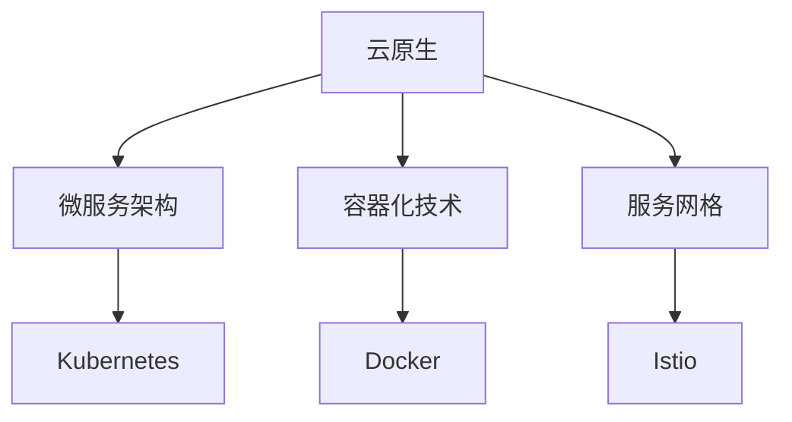

                 

# 京东2025云原生架构师社招面试经验分享

> **关键词：** 京东、2025、云原生架构、社招、面试经验、技术分享

> **摘要：** 本文将分享一位资深人工智能专家在京东2025年云原生架构师社招面试中的经历，详细解析面试中的关键问题、技术难点以及面试技巧，为准备类似面试的读者提供宝贵的经验和指导。

## 1. 背景介绍

### 1.1 个人背景

作为一名资深人工智能专家，我在计算机科学领域拥有超过10年的工作经验。我的专长包括人工智能、机器学习、深度学习以及云计算。在过去的项目中，我负责过多个大型分布式系统的架构设计与优化，具有丰富的实际开发经验。

### 1.2 京东2025云原生架构师的职位要求

京东在2025年招聘云原生架构师，该职位要求应聘者具备以下技能：

- 熟悉微服务架构、容器化技术（如Docker、Kubernetes）以及服务网格（如Istio）。
- 深入理解分布式系统原理，包括服务发现、负载均衡、分布式存储等。
- 具备大规模系统性能优化和故障处理经验。
- 熟练掌握至少一门编程语言（如Java、Go、Python）。
- 良好的沟通能力和团队合作精神。

## 2. 核心概念与联系

### 2.1 云原生技术简介

云原生（Cloud Native）是一种利用容器、服务网格、微服务、不可变基础设施以及声明式API对应用进行开发和运营的方法。它允许企业快速构建和部署可弹性伸缩、可靠且易于维护的分布式系统。

### 2.2 微服务架构

微服务架构是一种基于分布式系统的架构风格，它将应用程序划分为多个独立的、可扩展的服务，每个服务负责实现一个特定的业务功能。这些服务通过轻量级的通信协议（如HTTP/HTTPS、gRPC）进行交互。

### 2.3 容器化技术

容器化技术（如Docker）将应用程序及其依赖项打包到隔离的容器中，确保应用程序在不同环境中运行的一致性。Kubernetes是一个开源的容器编排平台，用于自动化容器的部署、扩展和管理。

### 2.4 服务网格

服务网格（如Istio）提供了一种抽象化的通信层，负责服务之间的安全、监控、负载均衡等功能。它允许开发者专注于业务逻辑，而不必担心服务之间的细节。

下面是云原生技术栈的Mermaid流程图：



## 3. 核心算法原理 & 具体操作步骤

### 3.1 Kubernetes集群部署

Kubernetes集群的部署涉及到以下几个关键步骤：

1. **环境准备**：确保服务器操作系统、网络配置等满足要求。
2. **安装Kubeadm**：使用Kubeadm工具初始化Master节点。
3. **安装Kubelet、Kube-Proxy**：在每个节点上安装Kubelet和Kube-proxy，确保它们与Master节点通信。
4. **部署Kubernetes核心组件**：使用kubectl工具部署etcd、Kube-apiserver、Kube-controller-manager、Kube-scheduler等核心组件。
5. **部署网络插件**：例如Calico或Flannel，配置网络策略。

### 3.2 Kubernetes服务发现与负载均衡

在Kubernetes集群中，服务发现和负载均衡是关键功能：

1. **服务定义**：通过定义Service资源，将Pod暴露为集群内的可访问服务。
2. **集群IP与端口映射**：Kubernetes为每个Service分配一个集群IP，并将其映射到特定的端口。
3. **负载均衡**：使用轮询、最少连接、IP哈希等策略，将请求均衡地分配到不同的后端Pod。

### 3.3 Kubernetes集群监控与日志管理

为了确保集群的健康和性能，监控与日志管理至关重要：

1. **安装监控工具**：例如Prometheus、Grafana，用于收集和展示集群的指标数据。
2. **配置日志收集**：使用Fluentd、Logstash等工具收集和聚合日志，并将其存储到Elasticsearch、Kibana等分析平台。

## 4. 数学模型和公式 & 详细讲解 & 举例说明

### 4.1 Kubernetes负载均衡算法

在Kubernetes中，负载均衡算法可以使用以下数学模型：

$$
\text{RequestRate} = \frac{\text{TotalRequests}}{\text{TotalTime}}
$$

其中，`RequestRate` 是请求速率，`TotalRequests` 是总请求次数，`TotalTime` 是总时间。

举例说明：

假设在一个小时内，Kubernetes集群接收了1000个请求，总耗时为3600秒，则请求速率为：

$$
\text{RequestRate} = \frac{1000}{3600} \approx 0.277 \text{请求/秒}
$$

### 4.2 服务网格流量控制策略

服务网格中的流量控制策略可以使用以下数学模型：

$$
\text{LoadBalancingStrategy} = \text{WeightedRoundRobin}
$$

其中，`LoadBalancingStrategy` 是负载均衡策略，例如加权轮询（WeightedRoundRobin）。

举例说明：

假设有三个服务A、B、C，它们的权重分别为2、1、1，则在下一次请求时，按照权重分配流量：

- 服务A的概率为：$\frac{2}{2+1+1} = 0.4$
- 服务B的概率为：$\frac{1}{2+1+1} = 0.2$
- 服务C的概率为：$\frac{1}{2+1+1} = 0.2$

## 5. 项目实战：代码实际案例和详细解释说明

### 5.1 开发环境搭建

为了演示Kubernetes集群的部署，我们需要以下开发环境：

- CentOS 7或更高版本
- Docker 19.03或更高版本
- Kubernetes 1.22或更高版本

首先，在每台服务器上安装Docker：

```bash
sudo yum install -y docker
sudo systemctl start docker
sudo systemctl enable docker
```

然后，安装Kubeadm、Kubelet和Kube-proxy：

```bash
sudo curl -s https://mirrors.aliyun.com/kubernetes/apt/doc/apt-key.gpg | sudo apt-key add -
sudo curl -s https://mirrors.aliyun.com/kubernetes/apt/config/5.0/kubernetes.list | sudo tee /etc/apt/sources.list.d/kubernetes.list
sudo apt-get update
sudo apt-get install -y kubelet kubeadm kubectl
```

### 5.2 源代码详细实现和代码解读

以下是一个简单的Kubernetes部署示例，用于部署一个Nginx服务。

**1. 配置Kubeadm初始化Master节点：**

```bash
sudo kubeadm init --pod-network-cidr=10.244.0.0/16
```

**2. 配置kubectl工具，使其可以与集群通信：**

```bash
mkdir -p $HOME/.kube
sudo cp -i /etc/kubernetes/admin.conf $HOME/.kube/config
sudo chown $(id -u):$(id -g) $HOME/.kube/config
```

**3. 安装Flannel网络插件：**

```bash
kubectl apply -f https://raw.githubusercontent.com/flannel-io/flannel/master/Documentation/kube-flannel.yml
```

**4. 部署Nginx服务：**

```bash
kubectl create deployment nginx --image=nginx:1.21.3
kubectl expose deployment nginx --port=80 --type=LoadBalancer
```

**5. 查看服务状态：**

```bash
kubectl get pods
kubectl get svc
```

### 5.3 代码解读与分析

上述代码展示了如何使用Kubeadm、kubectl和Flannel部署一个简单的Nginx服务。具体步骤如下：

1. **初始化Master节点**：使用kubeadm初始化Master节点，并设置Pod网络CIDR。
2. **配置kubectl**：将kubectl工具配置为与集群通信，以便后续操作。
3. **安装Flannel网络插件**：使用Flannel为集群提供网络支持。
4. **部署Nginx服务**：创建Nginx部署，并暴露为集群服务。

通过上述步骤，我们可以在Kubernetes集群中运行一个简单的Nginx服务。这个示例仅用于演示，实际生产环境中的部署会更加复杂，需要考虑故障转移、容

