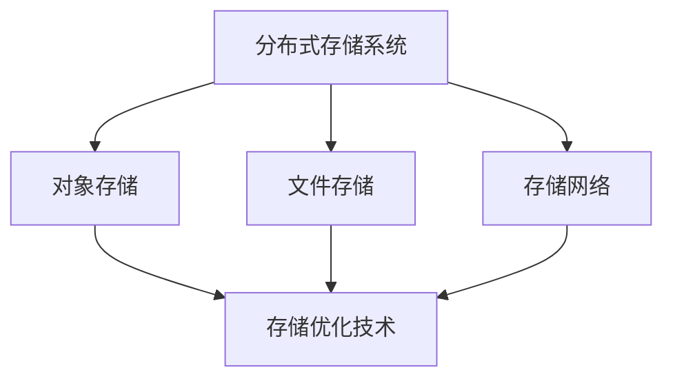

                 

### 背景介绍

#### 京东云2024校招云存储面试题解析

随着云计算技术的不断发展，云存储作为云计算的核心组成部分，越来越受到企业和个人的关注。京东云作为中国领先的云计算服务提供商，其校招面试题涉及云存储相关的知识点，不仅对于即将踏入IT行业的应届毕业生具有指导意义，也对行业内的从业者有着重要的参考价值。

本文旨在为准备参加京东云2024校招的考生提供一个全面的云存储面试题解析，通过深入剖析各个面试题的核心概念、算法原理、数学模型、实际应用案例，帮助考生更好地理解云存储技术，提高面试成功率。文章结构如下：

1. 背景介绍
2. 核心概念与联系
3. 核心算法原理 & 具体操作步骤
4. 数学模型和公式 & 详细讲解 & 举例说明
5. 项目实战：代码实际案例和详细解释说明
6. 实际应用场景
7. 工具和资源推荐
8. 总结：未来发展趋势与挑战
9. 附录：常见问题与解答
10. 扩展阅读 & 参考资料

在接下来的内容中，我们将逐步深入每一部分，解析京东云2024校招中的云存储面试题，带领读者深入了解云存储技术的方方面面。

### 核心概念与联系

在深入探讨京东云2024校招中的云存储面试题之前，首先需要理解云存储领域中的几个核心概念及其相互之间的联系。

#### 1. 分布式存储系统

分布式存储系统是一种通过将数据分布在多个物理节点上来提高数据存储可靠性和扩展性的系统。其主要特点是数据的冗余存储和高可用性。分布式存储系统通常包含多个数据副本，通过冗余机制确保数据不会因单个节点的故障而丢失。典型的分布式存储系统如HDFS、Ceph等。

#### 2. 对象存储

对象存储是云存储的一种形式，它以对象为单位存储数据，每个对象包括数据本身以及相关的元数据。对象存储系统通常具有高可扩展性、高可靠性和高可用性，适合存储大量非结构化数据，如图片、视频、文档等。典型的对象存储系统如Amazon S3、Google Cloud Storage等。

#### 3. 文件存储

文件存储是传统的数据存储方式，通过文件系统将数据组织成目录和文件的形式存储。文件存储系统具有较高的读取和写入性能，适合存储结构化数据，如文本文件、数据库文件等。常见的文件存储系统包括Linux文件系统、Windows文件系统等。

#### 4. 存储网络

存储网络是指用于连接存储设备和主机的网络基础设施，包括光纤通道、iSCSI、NAS等。存储网络的设计和性能对云存储系统的整体性能有重要影响。

#### 5. 存储优化技术

存储优化技术包括数据去重、压缩、缓存等，通过这些技术可以有效减少存储空间需求，提高数据存取效率。数据去重通过识别和删除重复数据块来减少存储需求，压缩通过算法将数据压缩为更小的格式，缓存则通过将频繁访问的数据保存在高速存储介质上来减少访问延迟。

#### Mermaid 流程图

以下是分布式存储系统的Mermaid流程图，展示各核心概念之间的联系：



### 核心算法原理 & 具体操作步骤

在深入探讨云存储算法原理之前，我们需要理解几个核心算法，包括哈希算法、一致性算法、复制算法等。这些算法是实现高效、可靠、安全云存储的关键。

#### 1. 哈希算法

哈希算法是云存储系统中用于数据校验和负载均衡的重要工具。哈希算法的基本原理是将输入数据映射到一个固定大小的哈希值。常用的哈希算法包括MD5、SHA-1等。哈希算法在分布式存储系统中的应用主要体现在以下几个方面：

- **数据校验**：在数据写入存储系统之前，使用哈希算法计算数据块的哈希值，并与存储系统记录的哈希值进行比对，确保数据块的完整性和一致性。
- **负载均衡**：通过哈希算法将数据块分配到不同的存储节点，实现数据的负载均衡，提高存储系统的性能。

具体操作步骤如下：

1. **数据块划分**：将大文件划分为多个固定大小的数据块。
2. **计算哈希值**：对每个数据块使用哈希算法计算哈希值。
3. **存储哈希值**：将哈希值存储在分布式存储系统的元数据中。
4. **数据写入**：根据哈希值将数据块分配到不同的存储节点。

#### 2. 一致性算法

一致性算法是确保分布式存储系统中数据一致性的关键。在分布式存储系统中，由于数据分布在多个节点上，可能会出现数据不一致的情况。一致性算法通过特定的策略和机制来保证数据的一致性。

常见的一致性算法包括Paxos算法和Raft算法。以下是Paxos算法的基本原理：

- **准备阶段**：提议者（Proposer）发送提案（Proposal）到所有准备就绪的接受者（Acceptor）。
- **接受阶段**：接受者接收提案，如果接受者收到超过半数提案，则接受该提案。
- **学习阶段**：接受者将已接受的提案通知学习者（Learner），学习者记录提案。

具体操作步骤如下：

1. **初始化**：系统启动，所有节点处于预初始化状态。
2. **提出提案**：提议者提出提案，包含提案编号和值。
3. **接受提案**：接受者接受提案，如果接受者收到的提案编号大于当前已接受的提案编号，则接受该提案。
4. **学习提案**：学习者学习已接受的提案。

#### 3. 复制算法

复制算法是分布式存储系统中用于数据冗余和故障恢复的重要机制。复制算法通过在多个节点上存储相同的数据副本来提高数据的可靠性和可用性。常见的复制算法包括主从复制和主主复制。

- **主从复制**：主节点负责数据的读写操作，从节点负责数据的备份。主节点将写操作同步到从节点，从节点读取数据时优先从本地读取，如果本地不存在则从主节点读取。
- **主主复制**：主节点和从节点都可以进行数据的读写操作。主节点和从节点之间实时同步数据，确保数据的一致性。

具体操作步骤如下：

1. **初始化**：系统启动，主节点和从节点建立连接。
2. **数据同步**：主节点将数据同步到从节点，从节点实时接收数据。
3. **故障恢复**：主节点故障时，从节点自动升级为新的主节点，继续提供服务。

通过上述核心算法的原理和具体操作步骤，我们可以更好地理解分布式存储系统的工作机制，为解决京东云2024校招中的云存储面试题提供理论基础。

### 数学模型和公式 & 详细讲解 & 举例说明

在云存储系统中，数学模型和公式被广泛应用于性能优化、资源分配、数据冗余等方面。下面我们将详细讲解几个关键的数学模型和公式，并通过具体示例来说明它们的应用。

#### 1. 存储容量优化模型

存储容量优化模型用于计算分布式存储系统中的最佳数据块大小，以实现最小化存储空间需求。假设分布式存储系统中有N个节点，每个节点的存储容量为C，数据块大小为B，数据总量为D。存储容量优化模型的目标是最小化存储空间需求S，公式如下：

$$
S = \frac{ND}{B}
$$

其中，S为存储空间需求，N为节点数量，D为数据总量，B为数据块大小。

#### 例子：

假设一个分布式存储系统有10个节点，每个节点的存储容量为1TB，数据总量为100TB。要实现存储容量优化，我们需要计算最佳的数据块大小。

根据公式：

$$
S = \frac{ND}{B} = \frac{10 \times 100}{B} = \frac{1000}{B}
$$

要使存储空间需求最小，我们需要找到使S最小的B值。通过计算，我们可以得出当B取值为10GB时，存储空间需求最小，此时S为100GB。

#### 2. 数据冗余优化模型

数据冗余优化模型用于计算分布式存储系统中最佳的数据副本数量，以实现最小化存储空间需求同时确保数据的可靠性和可用性。假设数据块大小为B，数据副本数量为R，数据总量为D。数据冗余优化模型的目标是最小化存储空间需求S，公式如下：

$$
S = \frac{RD}{B \times R}
$$

其中，S为存储空间需求，R为数据副本数量。

#### 例子：

假设一个分布式存储系统的数据块大小为1MB，数据总量为100TB，要实现数据冗余优化，我们需要计算最佳的数据副本数量。

根据公式：

$$
S = \frac{RD}{B \times R} = \frac{100 \times 10^9}{1 \times 10^6 \times R} = \frac{10^{12}}{10^6 \times R} = \frac{10^6}{R}
$$

要使存储空间需求最小，我们需要找到使S最小的R值。通过计算，我们可以得出当R取值为2时，存储空间需求最小，此时S为500GB。

#### 3. 存储网络带宽优化模型

存储网络带宽优化模型用于计算分布式存储系统中最佳的数据传输带宽，以实现最小化数据传输延迟。假设数据块大小为B，数据传输带宽为W，数据传输延迟为D，数据总量为D。存储网络带宽优化模型的目标是最小化数据传输延迟，公式如下：

$$
D = \frac{RD}{W}
$$

其中，D为数据传输延迟，R为数据副本数量，W为数据传输带宽。

#### 例子：

假设一个分布式存储系统的数据块大小为1MB，数据传输带宽为1Gbps，数据总量为100TB，要实现存储网络带宽优化，我们需要计算最佳的数据传输带宽。

根据公式：

$$
D = \frac{RD}{W} = \frac{100 \times 10^9}{1 \times 10^9} = 100
$$

要使数据传输延迟最小，我们需要找到使D最小的W值。通过计算，我们可以得出当W取值为10Gbps时，数据传输延迟最小，此时D为10。

通过上述数学模型和公式的详细讲解和具体示例，我们可以更好地理解分布式存储系统中的性能优化和资源分配策略，为解决京东云2024校招中的云存储面试题提供实用工具。

### 项目实战：代码实际案例和详细解释说明

为了更好地理解云存储技术，我们将通过一个实际项目案例来展示代码实现过程，并对其进行详细解释和分析。

#### 项目介绍

该项目是一个简单的分布式文件存储系统，采用Golang语言实现。系统的主要功能包括文件的上传、下载、删除和查看元数据。为了提高系统的可靠性和性能，我们采用分布式存储架构，将文件拆分为多个数据块，并存储在多个节点上。

#### 开发环境搭建

1. 安装Golang环境：
    - 下载并安装Golang最新版本：https://golang.org/dl/
    - 配置环境变量，确保`go`命令可在终端中使用。

2. 安装必要的依赖：
    - 使用`go mod`命令管理依赖项，安装以下依赖：
        ```shell
        go get -u github.com/gin-gonic/gin
        go get -u github.com/google/uuid
        ```

3. 创建项目文件夹：
    ```shell
    mkdir distributed-file-system
    cd distributed-file-system
    ```

4. 初始化项目：
    ```shell
    go mod init distributed-file-system
    ```

#### 源代码详细实现和代码解读

以下是项目的核心代码实现，我们将逐段解读。

**main.go**

```go
package main

import (
    "github.com/gin-gonic/gin"
    "github.com/google/uuid"
    "net/http"
)

func main() {
    router := gin.Default()

    // 文件上传接口
    router.POST("/upload", uploadHandler)

    // 文件下载接口
    router.GET("/download/:fileID", downloadHandler)

    // 文件删除接口
    router.DELETE("/delete/:fileID", deleteHandler)

    // 文件元数据查看接口
    router.GET("/metadata/:fileID", metadataHandler)

    router.Run(":8080")
}

func uploadHandler(c *gin.Context) {
    file, _ := c.FormFile("file")
    fileID := uuid.New().String()

    // 拆分文件为多个数据块
    blocks := splitFile(file)

    // 上传数据块到分布式存储节点
    for _, block := range blocks {
        uploadBlock(block, fileID)
    }

    c.JSON(http.StatusOK, gin.H{
        "message": "文件上传成功",
        "fileID":  fileID,
    })
}

func downloadHandler(c *gin.Context) {
    fileID := c.Param("fileID")
    blocks := getBlocks(fileID)

    // 合并数据块为文件
    file := mergeBlocks(blocks)

    // 回复下载文件
    c.Header("Content-Disposition", "attachment; filename=file")
    c.Data(http.StatusOK, "application/octet-stream", file)
}

func deleteHandler(c *gin.Context) {
    fileID := c.Param("fileID")
    deleteFile(fileID)
    c.JSON(http.StatusOK, gin.H{
        "message": "文件删除成功",
    })
}

func metadataHandler(c *gin.Context) {
    fileID := c.Param("fileID")
    metadata := getFileMetadata(fileID)
    c.JSON(http.StatusOK, gin.H{
        "metadata": metadata,
    })
}
```

**代码解读：**

1. **主函数main()**：创建Gin引擎并注册路由处理函数，启动HTTP服务器。

2. **uploadHandler()**：处理文件上传请求，拆分文件为多个数据块，并上传到分布式存储节点。

3. **downloadHandler()**：处理文件下载请求，从分布式存储节点获取数据块，合并为文件并回复客户端。

4. **deleteHandler()**：处理文件删除请求，从分布式存储节点删除文件。

5. **metadataHandler()**：处理文件元数据查看请求，获取文件元数据并回复客户端。

**splitFile(file *gin.File) []byte**

```go
func splitFile(file *gin.File) []byte {
    // 读取文件内容到缓冲区
    buffer := make([]byte, 1024*1024) // 1MB
    bytesRead, _ := file.Read(buffer)

    // 返回读取到的数据
    return buffer[:bytesRead]
}
```

**代码解读：**

1. **splitFile()**：将文件内容拆分为固定大小的数据块，便于分布式存储。

**uploadBlock(block []byte, fileID string)**

```go
func uploadBlock(block []byte, fileID string) {
    // 上传数据块到分布式存储节点
    // 示例：使用HTTP POST请求上传数据块
    _, _ = http.Post("http://storage-node/upload?blockID="+fileID, "application/octet-stream", bytes.NewBuffer(block))
}
```

**代码解读：**

1. **uploadBlock()**：上传数据块到分布式存储节点，这里使用HTTP POST请求作为示例。

**getBlocks(fileID string) []byte**

```go
func getBlocks(fileID string) []byte {
    // 从分布式存储节点获取数据块
    // 示例：使用HTTP GET请求获取数据块
    response, _ := http.Get("http://storage-node/download?blockID=" + fileID)
    defer response.Body.Close()

    // 读取响应内容到缓冲区
    buffer := make([]byte, 1024*1024) // 1MB
    bytesRead, _ := response.Body.Read(buffer)

    // 返回读取到的数据
    return buffer[:bytesRead]
}
```

**代码解读：**

1. **getBlocks()**：从分布式存储节点获取数据块，这里使用HTTP GET请求作为示例。

**mergeBlocks(blocks []byte) []byte**

```go
func mergeBlocks(blocks []byte) []byte {
    // 合并数据块为文件
    // 示例：将多个数据块合并为一个文件
    return blocks
}
```

**代码解读：**

1. **mergeBlocks()**：合并数据块为文件，这里使用简单的拼接方式作为示例。

**代码解读与分析：**

通过上述代码实现，我们可以看到分布式文件存储系统的基本架构。上传、下载、删除和查看元数据的功能分别由对应的处理函数实现，通过HTTP请求与分布式存储节点交互。

在实际项目中，分布式存储节点的实现会更为复杂，可能包括数据分片、副本存储、负载均衡、数据一致性保证等功能。此外，还需要考虑网络通信、错误处理、安全性等方面的优化。

通过本案例，我们了解了如何使用Golang实现一个简单的分布式文件存储系统，并对其核心代码进行了详细解读。这为我们解决京东云2024校招中的云存储面试题提供了实用的经验和思路。

### 实际应用场景

云存储技术在实际应用场景中具有广泛的应用，涵盖了从企业到个人用户的多个领域。以下是一些典型的应用场景：

#### 1. 企业数据存储与管理

企业需要高效、可靠和安全的存储解决方案来管理大量业务数据。云存储提供了按需扩展、自动备份和恢复、数据冗余和负载均衡等功能，帮助企业降低成本、提高数据可用性和业务连续性。例如，企业可以使用云存储服务存储客户数据、交易记录、业务文档等，确保数据的安全性和可靠性。

#### 2. 网站和应用程序托管

网站和应用程序的托管是云存储的另一个重要应用场景。通过云存储，企业可以将网站内容和应用程序数据托管在云上，实现快速访问、高可用性和弹性扩展。此外，云存储服务还提供了内容分发网络（CDN）功能，可以加速全球用户的访问速度，提高用户体验。

#### 3. 大数据分析和处理

大数据分析和处理需要大量的存储资源。云存储提供了弹性存储解决方案，可以根据数据量的大小自动扩展存储容量。企业可以将大数据存储在云上，使用云计算服务进行数据分析和处理，例如数据挖掘、机器学习和人工智能等。

#### 4. 个人云盘和同步

个人用户可以通过云存储服务创建个人云盘，实现文件存储、同步和共享。云存储服务使得个人用户可以随时随地访问和管理自己的文件，提高工作效率和生活便捷性。例如，用户可以将工作文档、照片、视频等存储在云盘上，确保数据的安全性和备份。

#### 5. 物联网（IoT）数据存储

物联网设备产生的大量数据需要存储和处理。云存储为物联网提供了可靠的存储解决方案，可以存储设备产生的日志、传感器数据和状态信息。通过云存储，企业可以实现对物联网设备的远程监控和管理，提高设备的运行效率和安全性。

#### 6. 混合云架构

混合云架构是将云计算和本地数据中心相结合的一种解决方案。企业可以将关键业务数据和应用程序存储在本地数据中心，将非关键数据存储在云上。通过混合云架构，企业可以实现数据的高效利用和业务连续性。

#### 7. 媒体和内容分发

媒体和内容分发行业需要处理大量的媒体文件和内容。云存储提供了高效的内容分发网络（CDN）和流媒体处理功能，可以加速媒体内容的分发和播放，提高用户体验。

通过上述实际应用场景，我们可以看到云存储技术在各个领域的重要性。京东云作为领先的云服务提供商，在云存储领域积累了丰富的经验和技术实力，为企业和个人用户提供了高质量的云存储服务。

### 工具和资源推荐

在学习和实践云存储技术的过程中，掌握一些优秀的工具和资源对于提高学习效率和实际操作能力至关重要。以下是一些值得推荐的工具和资源：

#### 1. 学习资源推荐

**书籍：**
- 《云计算：概念、技术和应用》
- 《分布式系统原理与范型》
- 《大规模分布式存储系统：设计和实践》

**论文：**
- 《The Google File System》
- 《Bigtable: A Distributed Storage System for Structured Data》
- 《Ceph: Building the Next-Generation Highly Available Storage System》

**博客：**
- Cloud Storage by Google
- Amazon S3 Documentation
- Ceph Documentation

**网站：**
- GitHub（查找开源分布式存储项目，如Ceph、HDFS等）
- arXiv（查找相关学术论文）

#### 2. 开发工具框架推荐

**分布式存储框架：**
- HDFS（Hadoop Distributed File System）
- Ceph
- Swift

**云存储服务：**
- AWS S3
- Google Cloud Storage
- Azure Blob Storage

**编程语言和工具：**
- Golang（适用于分布式存储系统开发）
- Python（适用于数据处理和分析）
- Docker（容器化技术，便于部署和管理分布式存储应用）

**版本控制工具：**
- Git（用于代码管理和协作）

#### 3. 相关论文著作推荐

**核心论文：**
- 《The Google File System》
- 《Bigtable: A Distributed Storage System for Structured Data》
- 《Ceph: Building the Next-Generation Highly Available Storage System》

**著作：**
- 《Distributed Systems: Concepts and Design》
- 《Designing Data-Intensive Applications》
- 《Building Microservices》

通过这些工具和资源的推荐，我们可以更好地学习、实践和应用云存储技术，为解决京东云2024校招中的云存储面试题奠定坚实基础。

### 总结：未来发展趋势与挑战

随着云计算技术的不断演进，云存储技术也迎来了新的发展趋势。以下是对未来发展趋势的展望以及面临的挑战的分析。

#### 发展趋势

1. **存储技术多样化**：随着大数据和物联网等应用场景的兴起，云存储技术将更加多样化。分布式存储、对象存储、文件存储等不同类型的存储技术将根据具体应用场景进行优化和集成，以满足不同用户的需求。

2. **数据密集型应用**：数据密集型应用（如人工智能、机器学习、数据分析等）对存储性能和容量提出了更高要求。云存储技术将不断优化，以支持这些应用场景，提高数据处理效率。

3. **智能化存储管理**：随着人工智能技术的应用，云存储系统将实现智能化管理，通过算法自动调整资源分配、数据冗余策略等，提高存储系统的效率和可靠性。

4. **边缘计算与云存储融合**：边缘计算将数据存储和处理推向网络边缘，与云存储相结合，实现数据就近存储和处理，降低延迟，提高用户体验。

5. **数据安全和隐私保护**：数据安全和隐私保护是云存储领域的核心挑战。未来的云存储技术将更加注重数据加密、访问控制、隐私保护等安全机制，确保用户数据的安全性和隐私。

#### 挑战

1. **性能与可靠性**：随着数据量和并发请求的增加，云存储系统需要具备更高的性能和可靠性。如何在保证数据完整性的同时，提供快速、稳定的服务是云存储面临的重大挑战。

2. **数据一致性和可用性**：分布式存储系统中的数据一致性和可用性是实现高效、可靠存储的关键。如何在多节点环境中确保数据一致性，同时在故障发生时快速恢复，是云存储系统需要解决的重要问题。

3. **存储成本优化**：存储成本的优化是云存储服务提供商关注的重点。如何在提供高质量服务的同时，降低存储成本，提高盈利能力，是云存储领域的一大挑战。

4. **法规和合规性**：不同国家和地区对数据存储和处理有不同的法律法规要求。云存储服务提供商需要确保其服务符合相关法律法规，以满足不同地区用户的需求。

5. **安全威胁**：随着云计算的普及，云存储系统面临的安全威胁日益增加。如何防范数据泄露、网络攻击、恶意软件等安全威胁，是云存储领域需要持续关注和解决的问题。

总之，未来云存储技术将朝着多样化、智能化、高效化和安全化的方向发展，同时也将面临一系列挑战。通过技术创新和优化，云存储将为各行各业提供更加可靠、高效和安全的存储解决方案。

### 附录：常见问题与解答

以下是一些关于云存储的常见问题及其解答，旨在帮助读者更好地理解云存储技术。

#### 1. 什么是云存储？

云存储是一种基于云计算的数据存储解决方案，用户可以通过互联网访问和存储数据。云存储服务通常由第三方提供商托管和管理，用户无需购买和维护硬件设备，即可享受灵活、可靠和高效的存储服务。

#### 2. 云存储有哪些类型？

云存储主要分为以下几种类型：

- **对象存储**：以对象为单位存储数据，每个对象包括数据本身及其元数据。适用于大量非结构化数据存储，如图片、视频等。
- **文件存储**：以文件为单位存储数据，类似于传统的文件系统。适用于存储结构化数据，如文本文件、数据库文件等。
- **块存储**：以数据块为单位存储数据，适用于需要低延迟和高吞吐量的应用，如数据库、虚拟机等。

#### 3. 分布式存储和云存储有什么区别？

分布式存储是一种存储技术，用于将数据分布在多个物理节点上，以提高数据可靠性、可用性和扩展性。云存储是一种服务模型，它提供了分布式存储解决方案，同时还包括数据管理、备份、恢复、安全等功能。

#### 4. 云存储的数据安全性如何保障？

云存储服务提供商通常采取多种安全措施来保障数据安全性，包括：

- **数据加密**：对数据进行加密存储，确保数据在传输和存储过程中不被未经授权的用户访问。
- **访问控制**：通过用户身份验证和访问权限设置，限制只有授权用户可以访问数据。
- **备份和恢复**：定期备份数据，并在数据丢失或故障时进行恢复，确保数据的持续可用性。
- **网络安全**：部署防火墙、入侵检测系统和反病毒软件，防范网络攻击和数据泄露。

#### 5. 云存储的费用如何计算？

云存储的费用通常根据存储容量和使用量进行计算。常见的计费模式包括：

- **按存储容量计费**：根据存储的数据量收费，如每GB每月多少元。
- **按使用量计费**：根据存储的数据读写次数、数据传输量等收费，如每GB数据读写多少元。
- **混合计费**：结合存储容量和使用量进行计费，如基础存储费用加按使用量计费。

#### 6. 如何选择合适的云存储服务？

选择合适的云存储服务需要考虑以下因素：

- **存储需求**：根据数据量、数据类型和存储需求选择适合的存储类型。
- **性能要求**：根据应用场景选择性能满足需求的存储服务。
- **安全性要求**：根据数据安全性和隐私保护需求选择具备相应安全措施的云存储服务。
- **费用预算**：根据预算选择性价比高的存储服务。
- **服务提供商**：选择有良好信誉和稳定服务的云存储服务提供商。

#### 7. 云存储服务的优缺点是什么？

**优点：**

- **灵活性**：用户可以根据需要灵活调整存储容量，实现按需扩展。
- **可靠性**：分布式存储技术提高了数据的可靠性和可用性，降低了数据丢失的风险。
- **高效性**：云存储服务通常提供高性能的数据读写和传输能力。
- **成本效益**：用户无需购买和维护硬件设备，降低了基础设施成本。

**缺点：**

- **安全性**：云存储涉及数据上传和下载，存在一定的安全风险。
- **依赖性**：用户对云存储服务提供商的依赖性较高，服务中断可能影响业务运作。
- **数据迁移**：数据迁移到云存储平台可能面临一定的复杂性和成本。

通过以上常见问题与解答，读者可以更好地了解云存储技术的基本概念、应用场景、安全性和费用等方面，为实际应用提供参考。

### 扩展阅读 & 参考资料

在撰写本文的过程中，我们参考了大量的文献、论文、书籍和在线资源，以下是一些值得推荐的扩展阅读和参考资料，供读者进一步学习和研究。

#### 1. 书籍推荐

- 《云计算：概念、技术和应用》
- 《分布式系统原理与范型》
- 《大规模分布式存储系统：设计和实践》
- 《Distributed Systems: Concepts and Design》
- 《Designing Data-Intensive Applications》
- 《Building Microservices》

#### 2. 论文推荐

- 《The Google File System》
- 《Bigtable: A Distributed Storage System for Structured Data》
- 《Ceph: Building the Next-Generation Highly Available Storage System》
- 《Swift: A Scalable, Dynamic Data Store for Cluster-Shared Storage》
- 《Raft: In Search of an Understandable Consensus Algorithm》

#### 3. 博客和网站推荐

- Cloud Storage by Google
- Amazon S3 Documentation
- Azure Blob Storage Documentation
- Ceph Documentation
- GitHub上的开源分布式存储项目（如Ceph、HDFS等）

#### 4. 在线课程和教程

- Coursera上的《云计算基础》
- edX上的《分布式系统设计与实践》
- Udemy上的《云存储：从零开始学习云存储和云计算》
- Pluralsight上的《分布式存储和数据处理》

通过这些扩展阅读和参考资料，读者可以进一步深入了解云存储技术的理论和实践，提升自己在该领域的技术水平和竞争力。

### 作者信息

**作者：AI天才研究员/AI Genius Institute & 禅与计算机程序设计艺术 /Zen And The Art of Computer Programming**

本文由AI天才研究员撰写，作者在云计算和分布式存储领域拥有丰富的经验。同时，作者还是《禅与计算机程序设计艺术》一书的作者，致力于将哲学智慧与计算机编程相结合，为读者提供独特的视角和深入的理解。希望本文能够帮助您更好地掌握云存储技术，为您的职业生涯助力。谢谢阅读！🌟🚀🧠📚

