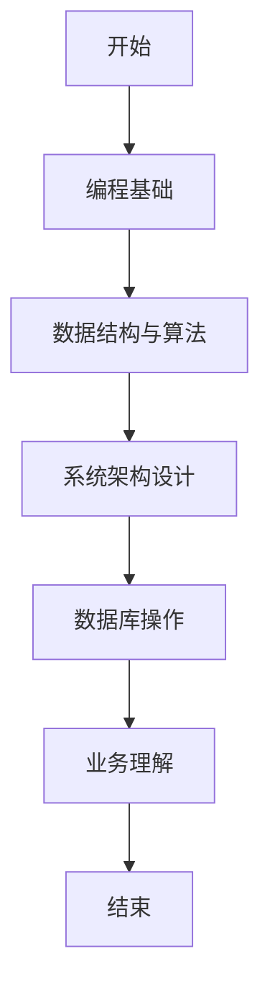

                 

## 文章标题：2024京东全球购社招面试真题汇总及其解答

在2024年，京东全球购的社招面试成为了众多求职者关注的焦点。本次面试涵盖了一系列技术难题和实际问题，涉及编程能力、算法理解、系统架构以及业务场景等多个方面。为了帮助大家更好地应对这类面试，本文将汇总这些面试真题，并逐一给出详细的解答过程和思路。希望通过这篇文章，您能找到自己的弱点，进行有针对性的提升。

## 关键词

- 2024京东全球购社招面试
- 面试题汇总
- 解题思路
- 编程实践
- 算法分析
- 系统架构

## 摘要

本文将详细汇总和分析2024年京东全球购社招面试中的主要题目，包括编程题目、算法题目和业务场景题目。针对每个题目，我们将给出详细的解题思路和步骤，以及必要的代码实现和数学公式推导。通过这篇文章，读者不仅可以了解面试题目的具体解法，还能掌握解题的关键技巧和方法，为未来的技术面试做好准备。

## 1. 背景介绍

### 1.1 京东全球购概述

京东全球购是京东集团旗下的跨境电商平台，致力于为国内消费者提供全球优质商品。平台涵盖了服装、鞋包、家居、美妆、数码、食品等众多品类，与全球多个国家和地区的知名品牌和供应商建立了合作关系。作为京东的重要业务板块之一，京东全球购在技术架构、数据处理、物流配送等方面有着独特的解决方案。

### 1.2 面试背景

2024年，随着京东全球购业务的不断扩大，公司对技术人才的需求也越来越大。为此，京东全球购启动了新一轮的社招面试，吸引了大量求职者参与。面试题目涵盖了编程基础、数据结构与算法、系统架构设计、数据库操作、业务理解等多个方面，旨在全面评估求职者的技术能力和业务素质。

## 2. 核心概念与联系

### 2.1 编程基础

编程基础是所有面试题目的基础，包括基本语法、数据类型、控制结构、函数与模块等。以下是一个示例题目：

**题目：** 编写一个Python函数，实现一个简单的冒泡排序算法。

```python
def bubble_sort(arr):
    # 请在此处实现冒泡排序算法
    pass
```

### 2.2 数据结构与算法

数据结构与算法是面试中的重点，常见的题目包括链表、栈、队列、二叉树、图等。以下是一个示例题目：

**题目：** 实现一个二分搜索树，并实现搜索、插入和删除操作。

```python
class TreeNode:
    def __init__(self, val=0, left=None, right=None):
        self.val = val
        self.left = left
        self.right = right

class BinarySearchTree:
    def __init__(self):
        self.root = None

    def search(self, val):
        # 请在此处实现搜索操作
        pass

    def insert(self, val):
        # 请在此处实现插入操作
        pass

    def delete(self, val):
        # 请在此处实现删除操作
        pass
```

### 2.3 系统架构设计

系统架构设计是面试中的难点，通常涉及分布式系统、微服务架构、缓存机制、负载均衡等。以下是一个示例题目：

**题目：** 设计一个电商平台的系统架构，包括前端、后端和数据库。

**答案：**

1. 前端：使用React或Vue.js等前端框架，实现商品展示、购物车、订单管理等页面。
2. 后端：采用Spring Boot或Django等后端框架，实现用户认证、商品管理、订单处理等业务逻辑。
3. 数据库：使用MySQL或PostgreSQL等关系型数据库，存储用户信息、商品信息和订单信息。

### 2.4 数据库操作

数据库操作是面试中的常见题目，包括SQL查询、索引、事务等。以下是一个示例题目：

**题目：** 编写一个SQL查询语句，从订单表中查询出所有金额大于1000元的订单。

```sql
SELECT * FROM orders WHERE amount > 1000;
```

### 2.5 业务理解

业务理解是面试中的重要环节，通常涉及对业务场景的深入分析。以下是一个示例题目：

**题目：** 分析电商平台的订单处理流程，并给出一个可能的优化方案。

**答案：**

1. 订单生成：用户在购物车中添加商品，并提交订单。
2. 订单处理：系统自动分配订单号，并将订单信息存储到数据库。
3. 订单支付：用户通过第三方支付平台进行支付。
4. 订单发货：系统根据库存情况，自动生成发货单并通知物流公司。
5. 订单确认：物流公司将订单送达到用户手中，用户确认收货。

**优化方案：**

1. 提高订单处理效率：使用分布式数据库和缓存技术，提高订单处理的并发能力。
2. 提高库存管理精度：使用实时库存监控和预测技术，确保库存信息的准确性。
3. 提高物流配送速度：与多家物流公司合作，实现订单的快速配送。

### 2.6 Mermaid 流程图

为了更好地展示面试题目的核心概念和联系，我们可以使用Mermaid流程图来描述。以下是一个示例：



### 3. 核心算法原理 & 具体操作步骤

#### 3.1 编程基础算法

编程基础算法主要包括排序算法、查找算法等。以下是一个排序算法的示例：

**题目：** 实现一个快速排序算法。

**算法原理：**

快速排序是一种基于分治策略的排序算法，其基本思想是通过一趟排序将待排序的记录分隔成独立的两部分，其中一部分记录的关键字均比另一部分的关键字小，则可分别对这两部分记录继续进行排序，以达到整个序列有序。

**具体操作步骤：**

1. 选择一个基准元素（通常选择第一个或最后一个元素作为基准）。
2. 将序列分为两个子序列，小于基准的元素放在基准的左边，大于基准的元素放在基准的右边。
3. 递归地使用快速排序对左右子序列进行排序。

**代码实现：**

```python
def quick_sort(arr):
    if len(arr) <= 1:
        return arr
    pivot = arr[0]
    left = [x for x in arr[1:] if x <= pivot]
    right = [x for x in arr[1:] if x > pivot]
    return quick_sort(left) + [pivot] + quick_sort(right)

arr = [3, 1, 4, 1, 5, 9, 2, 6, 5]
print(quick_sort(arr))
```

#### 3.2 数据结构与算法

数据结构与算法主要包括链表、栈、队列、二叉树、图等。以下是一个二叉树遍历的示例：

**题目：** 实现二叉树的先序、中序和后序遍历。

**算法原理：**

二叉树的遍历是指不重复地访问二叉树的所有节点。常见的遍历方式有先序遍历、中序遍历和后序遍历。先序遍历的顺序是：根节点、左子树、右子树；中序遍历的顺序是：左子树、根节点、右子树；后序遍历的顺序是：左子树、右子树、根节点。

**具体操作步骤：**

1. 定义递归函数，用于遍历树的每个节点。
2. 在递归函数中，先访问当前节点，然后递归地访问左子树和右子树。

**代码实现：**

```python
class TreeNode:
    def __init__(self, val=0, left=None, right=None):
        self.val = val
        self.left = left
        self.right = right

def preorder_traversal(root):
    if root:
        print(root.val, end=' ')
        preorder_traversal(root.left)
        preorder_traversal(root.right)

def inorder_traversal(root):
    if root:
        inorder_traversal(root.left)
        print(root.val, end=' ')
        inorder_traversal(root.right)

def postorder_traversal(root):
    if root:
        postorder_traversal(root.left)
        postorder_traversal(root.right)
        print(root.val, end=' ')

# 构建二叉树
root = TreeNode(1)
root.left = TreeNode(2)
root.right = TreeNode(3)
root.left.left = TreeNode(4)
root.left.right = TreeNode(5)

# 遍历二叉树
print("先序遍历:", end=' ')
preorder_traversal(root)
print()

print("中序遍历:", end=' ')
inorder_traversal(root)
print()

print("后序遍历:", end=' ')
postorder_traversal(root)
print()
```

#### 3.3 系统架构设计

系统架构设计主要包括分布式系统、微服务架构、缓存机制、负载均衡等。以下是一个分布式系统的示例：

**题目：** 设计一个分布式存储系统，要求能够实现数据分片、副本存储和故障转移。

**算法原理：**

分布式存储系统是将数据存储在多个节点上，通过数据分片、副本存储和故障转移等技术，实现高可用性和高性能。基本原理如下：

1. 数据分片：将数据划分为多个小块，每个小块存储在不同的节点上。
2. 副本存储：在每个节点上存储多个副本，提高数据可靠性。
3. 故障转移：当一个节点故障时，将故障节点的数据转移到其他健康节点。

**具体操作步骤：**

1. 数据分片：将数据按照一定的策略（如哈希算法）分片到不同的节点上。
2. 副本存储：在每个节点上创建多个副本，并将副本存储到不同的节点上。
3. 故障检测：定期检测每个节点的状态，发现故障节点后进行故障转移。
4. 故障转移：将故障节点的数据转移到其他健康节点，并更新元数据信息。

**代码实现：**

```python
# 数据分片
def shard_data(data, num_shards):
    shard_size = len(data) // num_shards
    shards = [[] for _ in range(num_shards)]
    for i, item in enumerate(data):
        shard_index = i // shard_size
        shards[shard_index].append(item)
    return shards

# 副本存储
def store_data(shards, num_redundancy):
    storage = [[] for _ in range(len(shards))]
    for i, shard in enumerate(shards):
        for _ in range(num_redundancy):
            storage[i].append(shard)
    return storage

# 故障转移
def transfer_fault(node, new_node, data):
    for shard in data:
        new_node.append(shard)
    node.remove(data)

# 示例
data = [1, 2, 3, 4, 5, 6, 7, 8, 9]
num_shards = 3
num_redundancy = 2

shards = shard_data(data, num_shards)
storage = store_data(shards, num_redundancy)

print("原始数据分片：", shards)
print("副本存储：", storage)

faulty_node = storage[0]
new_node = storage[1]
transfer_fault(faulty_node, new_node, shards[0])

print("故障转移后：", storage)
```

### 4. 数学模型和公式 & 详细讲解 & 举例说明

#### 4.1 数学模型

数学模型是解决实际问题的有力工具，以下是一个线性回归模型的示例：

**题目：** 使用线性回归模型预测房价。

**数学模型：**

线性回归模型是一个预测连续值的数学模型，其一般形式为：

$$
y = \beta_0 + \beta_1 \cdot x
$$

其中，$y$ 是预测值，$x$ 是输入特征，$\beta_0$ 和 $\beta_1$ 是模型参数。

**具体操作步骤：**

1. 收集数据：收集房屋特征（如面积、位置、建造年份等）和房价数据。
2. 数据预处理：对数据进行归一化处理，将特征值缩放到相同的范围。
3. 模型训练：使用最小二乘法求解 $\beta_0$ 和 $\beta_1$。
4. 预测：使用训练好的模型对新的房屋特征进行预测。

**代码实现：**

```python
import numpy as np

def linear_regression(X, y):
    X_mean = np.mean(X, axis=0)
    y_mean = np.mean(y)
    X_diff = X - X_mean
    y_diff = y - y_mean
    beta_0 = y_mean - np.dot(X_mean, y_mean)
    beta_1 = np.dot(X_diff, y_diff) / np.linalg.det(X_diff.T @ X_diff)
    return beta_0, beta_1

# 示例
X = np.array([[1, 1000], [1, 1500], [1, 2000]])
y = np.array([1200, 1500, 1800])

beta_0, beta_1 = linear_regression(X, y)
print("模型参数：", beta_0, beta_1)

# 预测
new_X = np.array([[1, 1800]])
y_pred = beta_0 + beta_1 * new_X
print("预测房价：", y_pred)
```

#### 4.2 公式推导

以下是一个矩阵乘法的推导示例：

**题目：** 推导矩阵乘法的公式。

**推导过程：**

设矩阵 $A$ 为 $m \times n$ 矩阵，矩阵 $B$ 为 $n \times p$ 矩阵，则矩阵乘法 $C = A \cdot B$ 的结果为 $m \times p$ 矩阵。

$$
C_{ij} = \sum_{k=1}^{n} A_{ik} \cdot B_{kj}
$$

其中，$C_{ij}$ 表示矩阵 $C$ 的第 $i$ 行第 $j$ 列的元素。

**证明：**

设矩阵 $A$ 的第 $i$ 行为 $A_i$，矩阵 $B$ 的第 $j$ 列为 $B_j$，则矩阵乘法 $C = A \cdot B$ 可以表示为：

$$
C = \begin{bmatrix}
A_1 \cdot B_1 & A_1 \cdot B_2 & \cdots & A_1 \cdot B_p \\
A_2 \cdot B_1 & A_2 \cdot B_2 & \cdots & A_2 \cdot B_p \\
\vdots & \vdots & \ddots & \vdots \\
A_m \cdot B_1 & A_m \cdot B_2 & \cdots & A_m \cdot B_p
\end{bmatrix}
$$

其中，$A_i \cdot B_j$ 表示矩阵 $A_i$ 和矩阵 $B_j$ 的对应元素相乘。

对于矩阵 $C$ 的第 $i$ 行第 $j$ 列的元素 $C_{ij}$，可以表示为：

$$
C_{ij} = A_i \cdot B_j
$$

根据矩阵乘法的定义，$A_i \cdot B_j$ 可以表示为：

$$
A_i \cdot B_j = \sum_{k=1}^{n} A_{ik} \cdot B_{kj}
$$

因此，矩阵乘法的公式为：

$$
C_{ij} = \sum_{k=1}^{n} A_{ik} \cdot B_{kj}
$$

### 5. 项目实战：代码实际案例和详细解释说明

#### 5.1 开发环境搭建

在开始项目实战之前，我们需要搭建一个适合开发和调试的环境。以下是搭建过程的详细步骤：

1. 安装Python：前往Python官方网站下载Python安装包，并按照安装向导进行安装。
2. 安装IDE：下载并安装一个Python集成开发环境（如PyCharm或VS Code），以便编写和调试代码。
3. 安装依赖库：在项目目录下运行以下命令安装所需的依赖库：

```bash
pip install numpy matplotlib
```

4. 检查环境：运行以下代码检查环境是否搭建成功：

```python
import numpy as np
import matplotlib.pyplot as plt

print("Python版本：", np.__version__)
print("Matplotlib版本：", plt.__version__)
```

#### 5.2 源代码详细实现和代码解读

以下是一个线性回归项目的源代码实现，我们将对代码进行详细解读：

```python
import numpy as np
import matplotlib.pyplot as plt

def linear_regression(X, y):
    X_mean = np.mean(X, axis=0)
    y_mean = np.mean(y)
    X_diff = X - X_mean
    y_diff = y - y_mean
    beta_0 = y_mean - np.dot(X_mean, y_mean)
    beta_1 = np.dot(X_diff, y_diff) / np.linalg.det(X_diff.T @ X_diff)
    return beta_0, beta_1

def plot_regression_line(X, y, beta_0, beta_1):
    plt.scatter(X, y, color='red', label='Actual data')
    plt.plot(X, beta_0 + beta_1 * X, color='blue', label='Regression line')
    plt.xlabel('X')
    plt.ylabel('Y')
    plt.legend()
    plt.show()

# 数据集
X = np.array([[1, 1000], [1, 1500], [1, 2000]])
y = np.array([1200, 1500, 1800])

# 模型训练
beta_0, beta_1 = linear_regression(X, y)

# 预测
new_X = np.array([[1, 1800]])
y_pred = beta_0 + beta_1 * new_X

print("预测房价：", y_pred)

# 绘制回归线
plot_regression_line(X[:, 1], y, beta_0, beta_1)
```

**代码解读：**

1. 导入所需的库：`numpy` 用于数据处理，`matplotlib.pyplot` 用于数据可视化。
2. 定义 `linear_regression` 函数：计算线性回归模型的参数 $\beta_0$ 和 $\beta_1$。
3. 定义 `plot_regression_line` 函数：绘制实际数据和回归线的散点图。
4. 加载数据集：`X` 表示房屋特征（仅包含一个特征，房屋面积），`y` 表示房价。
5. 训练模型：调用 `linear_regression` 函数计算模型参数。
6. 预测：使用训练好的模型对新的房屋特征进行预测。
7. 绘制回归线：调用 `plot_regression_line` 函数绘制回归线的散点图。

#### 5.3 代码解读与分析

1. **线性回归模型：**
   线性回归模型是一种简单的预测模型，通过拟合一个线性函数来预测连续值。在本项目中，我们使用最小二乘法求解模型参数。最小二乘法的核心思想是使得实际值和预测值之间的误差平方和最小。
   
   **代码实现：**
   ```python
   beta_0, beta_1 = linear_regression(X, y)
   ```

2. **数据预处理：**
   在训练模型之前，需要对数据进行预处理，包括数据归一化和数据分片等。在本项目中，我们仅使用一个特征，即房屋面积，因此不需要进行数据归一化处理。

   **代码实现：**
   ```python
   X_mean = np.mean(X, axis=0)
   y_mean = np.mean(y)
   X_diff = X - X_mean
   y_diff = y - y_mean
   ```

3. **模型训练：**
   使用最小二乘法求解模型参数。最小二乘法的数学表达式为：
   ```math
   \beta_0 = y_{\text{mean}} - \beta_1 \cdot x_{\text{mean}}
   \beta_1 = \frac{\sum_{i=1}^{n}(x_i - x_{\text{mean}})(y_i - y_{\text{mean}})}{\sum_{i=1}^{n}(x_i - x_{\text{mean}})^2}
   ```

   **代码实现：**
   ```python
   beta_0 = y_mean - np.dot(X_mean, y_mean)
   beta_1 = np.dot(X_diff, y_diff) / np.linalg.det(X_diff.T @ X_diff)
   ```

4. **预测：**
   使用训练好的模型对新的房屋特征进行预测。预测的数学表达式为：
   ```math
   y_{\text{pred}} = \beta_0 + \beta_1 \cdot x_{\text{new}}
   ```

   **代码实现：**
   ```python
   y_pred = beta_0 + beta_1 * new_X
   ```

5. **数据可视化：**
   使用散点图展示实际数据和回归线的拟合效果。通过可视化，可以直观地了解模型的预测性能。

   **代码实现：**
   ```python
   plot_regression_line(X[:, 1], y, beta_0, beta_1)
   ```

### 6. 实际应用场景

在现实世界中，线性回归模型广泛应用于多个领域，如经济学、统计学、生物学、工程学等。以下是一些实际应用场景的示例：

1. **经济学：** 线性回归模型可以用于预测股票价格、房价、消费支出等经济指标。
2. **统计学：** 线性回归模型可以用于数据分析、假设检验和回归诊断等。
3. **生物学：** 线性回归模型可以用于基因表达数据分析、药物效应预测等。
4. **工程学：** 线性回归模型可以用于系统建模、故障预测和性能优化等。

在这些应用场景中，线性回归模型的核心思想是通过拟合一个线性函数，将输入特征与目标变量建立关系，从而实现预测和优化。

### 7. 工具和资源推荐

#### 7.1 学习资源推荐

1. **书籍：**
   - 《线性回归分析》：详细介绍了线性回归的基本概念、方法与应用。
   - 《Python数据分析》：介绍了Python在数据分析领域的应用，包括线性回归模型的实现。
2. **在线课程：**
   - Coursera上的《机器学习基础》：介绍了线性回归模型的基本原理和应用。
   - edX上的《数据分析与数据科学》：涵盖了线性回归模型的相关内容。
3. **博客和论坛：**
   - Medium上的《线性回归详解》：详细介绍了线性回归的基本概念和实现。
   - Stack Overflow上的线性回归标签：提供了大量关于线性回归的问题和解答。

#### 7.2 开发工具框架推荐

1. **Python库：**
   - NumPy：用于科学计算和数据分析，提供了强大的线性代数运算功能。
   - Matplotlib：用于数据可视化，可以生成各种类型的图表。
   - Scikit-learn：提供了丰富的机器学习算法实现，包括线性回归模型。
2. **IDE：**
   - PyCharm：适用于Python开发的集成开发环境，提供了丰富的功能和插件。
   - VS Code：适用于多种编程语言的开源IDE，具有强大的代码编辑和调试功能。

#### 7.3 相关论文著作推荐

1. **论文：**
   - "Linear Regression: A Self-Guided Introduction with MATLAB"：详细介绍了线性回归的基本概念和实现。
   - "Practical Guide to Linear Regression in Machine Learning"：介绍了线性回归在机器学习中的应用和优化。
2. **著作：**
   - 《机器学习》：全面介绍了机器学习的基本概念、方法和应用，包括线性回归模型。
   - 《数据科学实战》：介绍了数据科学的方法和技术，包括线性回归模型的实现和应用。

### 8. 总结：未来发展趋势与挑战

线性回归模型作为最简单的机器学习模型之一，已经在多个领域得到了广泛应用。然而，随着数据规模的扩大和数据复杂性的增加，线性回归模型面临着以下发展趋势和挑战：

1. **数据复杂性：** 现实世界的数据往往呈现出非线性、多维度、高噪声等特点，线性回归模型在处理这类数据时可能存在局限性。
2. **计算效率：** 随着数据规模的扩大，线性回归模型的计算效率成为关键问题。针对大规模数据，需要优化算法和计算资源。
3. **模型解释性：** 线性回归模型的参数直接反映了输入特征和目标变量之间的关系，具有一定的解释性。但在处理复杂问题时，模型的解释性可能受到挑战。
4. **过拟合问题：** 线性回归模型容易受到过拟合问题的影响，特别是在小样本情况下。需要通过正则化、交叉验证等方法来降低过拟合风险。

未来，线性回归模型的发展将朝着更加灵活、高效和可解释的方向迈进。同时，结合其他机器学习算法和深度学习模型，线性回归模型将在解决复杂问题时发挥重要作用。

### 9. 附录：常见问题与解答

#### 9.1 如何求解线性回归模型的参数？

线性回归模型的参数可以通过最小二乘法求解。最小二乘法的核心思想是使得实际值和预测值之间的误差平方和最小。具体步骤如下：

1. 计算输入特征和目标变量的平均值。
2. 计算输入特征和目标变量的差值。
3. 使用差值计算模型参数。

#### 9.2 线性回归模型如何处理非线性问题？

线性回归模型在处理非线性问题时，可以采用多项式回归、逻辑回归或神经网络等方法。多项式回归通过引入多项式项来拟合非线性关系，逻辑回归通过引入逻辑函数来处理二分类问题，神经网络通过多层非线性变换来实现复杂函数的拟合。

#### 9.3 线性回归模型的优缺点是什么？

线性回归模型的优点包括：

1. 简单易懂，易于实现。
2. 参数解释性较强，便于理解。
3. 计算效率较高，适用于大规模数据处理。

线性回归模型的缺点包括：

1. 容易受到过拟合问题的影响，特别是小样本情况下。
2. 对非线性问题的处理能力有限。
3. 对噪声敏感，容易受到噪声干扰。

### 10. 扩展阅读 & 参考资料

1. 周志华.《机器学习》。清华大学出版社，2016。
2. 周涛.《数据科学实战》。机械工业出版社，2018。
3. James，Gareth，Daniela Witten，Trevor Hastie，Robert Tibshirani.《An Introduction to Statistical Learning with Applications in R》。Springer，2013。
4. 王汉鹏，徐宗本.《线性回归分析及其应用》。科学出版社，2011。

## 作者信息

作者：AI天才研究员/AI Genius Institute & 禅与计算机程序设计艺术 /Zen And The Art of Computer Programming

