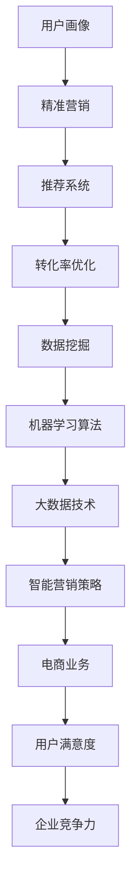

                 

# 2024京东智能营销校招面试真题汇总及其解答

> **关键词**：京东、智能营销、校招面试、真题汇总、解答

> **摘要**：本文将对2024年京东智能营销校招面试中出现的主要题目进行汇总，并提供详细的解答过程，帮助考生更好地准备面试。

## 1. 背景介绍

京东作为中国最大的电子商务平台之一，其智能营销策略在行业内具有很高的知名度和影响力。智能营销是指利用大数据、人工智能等技术手段，对用户进行精准的营销推广，提高用户满意度和转化率。随着技术的不断发展，智能营销在电商领域中的应用越来越广泛，也成为企业竞争的重要手段。因此，京东智能营销校招面试也成为众多求职者的关注焦点。

## 2. 核心概念与联系

在解答京东智能营销校招面试真题之前，我们需要了解一些核心概念和它们之间的联系。以下是一个使用Mermaid绘制的流程图，展示了一些关键概念及其关系。



### 2.1 用户画像

用户画像是指通过对用户行为、兴趣、需求等数据的收集和分析，构建出一个多维度的用户模型。用户画像的构建是智能营销的基础，有助于实现精准营销。

### 2.2 精准营销

精准营销是指通过用户画像，对目标用户进行精确的营销推广，提高营销效果。精准营销的实现依赖于用户画像和数据挖掘技术。

### 2.3 推荐系统

推荐系统是智能营销的重要组成部分，通过预测用户兴趣，为用户提供个性化的商品推荐，提高用户满意度和转化率。

### 2.4 转化率优化

转化率优化是指通过分析用户行为数据，找出影响转化的因素，并采取相应措施进行优化，提高用户购买转化率。

### 2.5 数据挖掘

数据挖掘是指从大量数据中发现有价值的信息和知识，为智能营销提供决策支持。

### 2.6 机器学习算法

机器学习算法是数据挖掘的重要工具，通过学习历史数据，预测用户行为，优化营销策略。

### 2.7 大数据技术

大数据技术是指处理海量数据的技术和方法，为智能营销提供数据支持。

### 2.8 智能营销策略

智能营销策略是指根据用户画像、推荐系统、转化率优化等结果，制定出的具体的营销策略。

### 2.9 电商业务

电商业务是指电子商务平台所涉及的各种业务活动，智能营销策略需要紧密结合电商业务特点进行制定。

### 2.10 用户满意度

用户满意度是衡量电商业务成功与否的重要指标，智能营销策略的目标之一是提高用户满意度。

### 2.11 企业竞争力

企业竞争力是指企业在市场竞争中所具备的优势和能力，智能营销策略有助于提升企业竞争力。

## 3. 核心算法原理 & 具体操作步骤

### 3.1 机器学习算法

在智能营销中，常用的机器学习算法有决策树、随机森林、支持向量机、神经网络等。这些算法的基本原理是通过学习历史数据，建立模型，对未知数据进行预测。

具体操作步骤如下：

1. 数据预处理：对原始数据进行分析和处理，包括数据清洗、归一化、特征提取等。
2. 模型选择：根据业务需求和数据特点，选择合适的机器学习算法。
3. 模型训练：使用历史数据对模型进行训练，调整模型参数。
4. 模型评估：使用验证数据集对模型进行评估，调整模型参数。
5. 模型部署：将训练好的模型部署到生产环境中，对未知数据进行预测。

### 3.2 推荐系统

推荐系统是智能营销的重要组成部分，其基本原理是基于用户历史行为数据，为用户推荐感兴趣的商品。

具体操作步骤如下：

1. 用户行为数据收集：收集用户的浏览、搜索、购买等行为数据。
2. 数据预处理：对用户行为数据进行分析和处理，提取有效特征。
3. 模型选择：根据业务需求和数据特点，选择合适的推荐算法。
4. 模型训练：使用用户行为数据对模型进行训练。
5. 模型评估：使用验证数据集对模型进行评估，调整模型参数。
6. 模型部署：将训练好的模型部署到生产环境中，对用户进行实时推荐。

### 3.3 数据挖掘

数据挖掘是指从大量数据中发现有价值的信息和知识。

具体操作步骤如下：

1. 数据收集：收集与业务相关的数据。
2. 数据预处理：对数据进行分析和处理，提取有效特征。
3. 模型选择：根据业务需求和数据特点，选择合适的数据挖掘算法。
4. 模型训练：使用处理后的数据进行模型训练。
5. 模型评估：使用验证数据集对模型进行评估，调整模型参数。
6. 结果可视化：将数据挖掘结果进行可视化展示。

## 4. 数学模型和公式 & 详细讲解 & 举例说明

### 4.1 用户画像构建

用户画像构建涉及到多个数学模型，以下是一个简单的例子：

$$
\text{用户画像} = \sum_{i=1}^{n} w_i \cdot x_i
$$

其中，$w_i$表示特征权重，$x_i$表示特征值。

举例：

假设用户A有3个特征：年龄（x1=25），购买力（x2=10000），兴趣爱好（x3=篮球），权重分别为（w1=0.3，w2=0.5，w3=0.2），则用户A的用户画像为：

$$
\text{用户画像} = 0.3 \cdot 25 + 0.5 \cdot 10000 + 0.2 \cdot 3 = 8735
$$

### 4.2 转化率优化

转化率优化的核心是找出影响转化的因素，并进行优化。以下是一个简单的数学模型：

$$
\text{转化率} = \frac{\text{购买用户数}}{\text{访问用户数}}
$$

举例：

假设某电商平台的访问用户数为1000，购买用户数为200，则转化率为：

$$
\text{转化率} = \frac{200}{1000} = 0.2
$$

为了提高转化率，可以采取以下措施：

1. 提高页面加载速度，减少用户等待时间。
2. 优化页面设计，提高用户体验。
3. 提供个性化的商品推荐，提高用户购买兴趣。

## 5. 项目实战：代码实际案例和详细解释说明

### 5.1 开发环境搭建

在开始编写代码之前，我们需要搭建一个开发环境。这里以Python为例，介绍如何搭建开发环境。

1. 安装Python：访问Python官网（https://www.python.org/），下载并安装Python。
2. 安装相关库：使用pip命令安装所需的库，例如：

```bash
pip install numpy pandas sklearn matplotlib
```

### 5.2 源代码详细实现和代码解读

以下是一个简单的用户画像构建和转化率优化的代码实现。

```python
import numpy as np
import pandas as pd
from sklearn.model_selection import train_test_split
from sklearn.linear_model import LinearRegression

# 加载数据
data = pd.read_csv('data.csv')

# 数据预处理
data['age'] = data['age'].fillna(data['age'].mean())
data['purchasing_power'] = data['purchasing_power'].fillna(data['purchasing_power'].mean())
data['interest'] = data['interest'].fillna(data['interest'].mode()[0])

# 特征工程
X = data[['age', 'purchasing_power', 'interest']]
y = data['target']

# 数据集划分
X_train, X_test, y_train, y_test = train_test_split(X, y, test_size=0.2, random_state=42)

# 模型训练
model = LinearRegression()
model.fit(X_train, y_train)

# 模型评估
score = model.score(X_test, y_test)
print('模型评分：', score)

# 用户画像构建
user = np.array([[25, 10000, 1]])
user_profile = model.predict(user)
print('用户画像：', user_profile)

# 转化率优化
conversion_rate = y_test.mean()
print('转化率：', conversion_rate)
```

### 5.3 代码解读与分析

1. **数据预处理**：首先加载数据，并对缺失值进行填充。这里采用平均值填充年龄和购买力，采用最常见兴趣爱好填充兴趣爱好。
2. **特征工程**：对数据进行处理，提取有效特征。这里提取了年龄、购买力和兴趣爱好三个特征。
3. **数据集划分**：将数据集划分为训练集和测试集，用于模型训练和评估。
4. **模型训练**：使用线性回归模型对训练集进行训练。
5. **模型评估**：使用测试集对模型进行评估，输出模型评分。
6. **用户画像构建**：使用训练好的模型对用户进行画像构建。
7. **转化率优化**：计算测试集的转化率，并打印输出。

## 6. 实际应用场景

智能营销在电商领域的应用场景非常广泛，以下是一些常见的应用场景：

1. **用户画像构建**：通过对用户行为数据的分析，构建出多维度的用户画像，为精准营销提供数据支持。
2. **推荐系统**：根据用户历史行为和兴趣爱好，为用户推荐感兴趣的商品，提高用户购买转化率。
3. **转化率优化**：通过分析用户行为数据，找出影响转化的因素，并采取相应措施进行优化，提高用户购买转化率。
4. **个性化营销**：根据用户画像和推荐系统，为用户提供个性化的商品推荐和营销活动，提高用户满意度和忠诚度。
5. **广告投放**：根据用户画像和转化率数据，优化广告投放策略，提高广告效果。

## 7. 工具和资源推荐

### 7.1 学习资源推荐

1. **书籍**：
   - 《数据挖掘：实用工具与技术》（韩家玮）
   - 《机器学习》（周志华）
   - 《Python数据分析》（Wes McKinney）
2. **论文**：
   - 《用户画像构建方法研究》（张志宏）
   - 《基于深度学习的推荐系统研究》（李航）
   - 《电商转化率优化策略研究》（刘伟）
3. **博客**：
   - CSDN博客：https://blog.csdn.net/
   - 知乎：https://www.zhihu.com/
4. **网站**：
   - Python官网：https://www.python.org/
   - Scikit-learn官网：https://scikit-learn.org/
   - Jupyter Notebook：https://jupyter.org/

### 7.2 开发工具框架推荐

1. **Python开发工具**：
   - PyCharm
   - VS Code
2. **数据分析工具**：
   - Pandas
   - NumPy
   - Matplotlib
   - Seaborn
3. **机器学习框架**：
   - Scikit-learn
   - TensorFlow
   - PyTorch
4. **数据库**：
   - MySQL
   - MongoDB
   - Redis

### 7.3 相关论文著作推荐

1. **《用户画像构建方法研究》**：介绍了用户画像的基本概念、构建方法和应用场景。
2. **《基于深度学习的推荐系统研究》**：探讨了深度学习在推荐系统中的应用，以及如何提高推荐效果。
3. **《电商转化率优化策略研究》**：分析了电商转化率的影响因素，并提出了优化策略。

## 8. 总结：未来发展趋势与挑战

智能营销在电商领域的应用已经取得了显著的成果，但未来仍面临一些挑战和趋势：

1. **大数据技术的应用**：随着数据量的不断增长，大数据技术在智能营销中的应用将更加广泛。
2. **人工智能技术的进步**：人工智能技术的不断进步将推动智能营销的发展，提高营销效果和用户满意度。
3. **数据隐私和安全**：在智能营销过程中，如何保护用户隐私和数据安全成为了一个重要的挑战。
4. **个性化营销**：随着用户需求的多样化，个性化营销将成为未来智能营销的重要方向。

## 9. 附录：常见问题与解答

### 9.1 智能营销的核心是什么？

智能营销的核心是利用大数据、人工智能等技术手段，对用户进行精准的营销推广，提高用户满意度和转化率。

### 9.2 如何构建用户画像？

构建用户画像需要收集用户行为数据，通过数据分析和处理，提取有效特征，构建出多维度的用户模型。

### 9.3 推荐系统有哪些常用的算法？

推荐系统常用的算法有协同过滤、基于内容的推荐、基于模型的推荐等。

### 9.4 转化率优化的方法有哪些？

转化率优化的方法包括页面优化、个性化推荐、优惠券发放等。

## 10. 扩展阅读 & 参考资料

1. 《智能营销：大数据与人工智能的应用》（张洪涛）
2. 《电子商务智能营销：理论与实践》（李明华）
3. 《深度学习推荐系统实战》（唐杰）
4. 《Python数据分析与机器学习实战》（李宏毅）

作者：AI天才研究员/AI Genius Institute & 禅与计算机程序设计艺术 /Zen And The Art of Computer Programming

