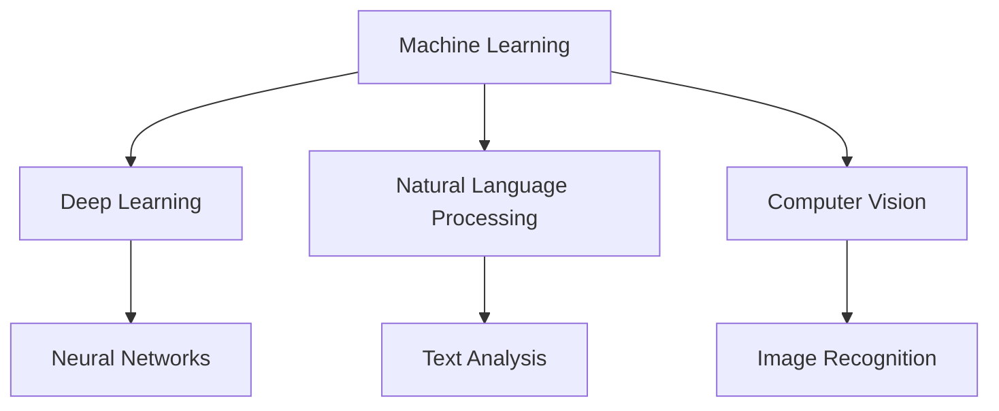
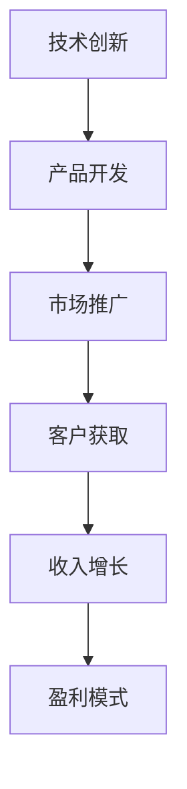
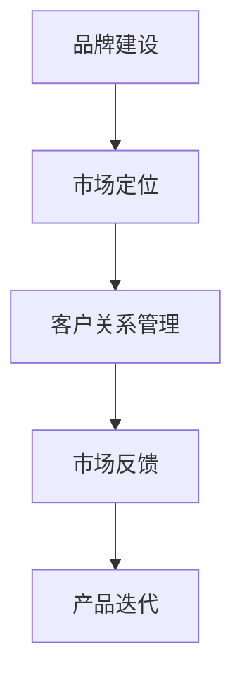

                 

# 人工智能产业的独角兽企业

> **关键词**：人工智能，独角兽企业，产业，技术创新，商业模型，市场策略，发展潜力

> **摘要**：本文旨在深入探讨人工智能产业中的独角兽企业。我们将分析这些企业的核心驱动力、技术创新、商业模型和市场策略，同时探讨其未来发展的潜力与面临的挑战。

## 1. 背景介绍

人工智能（AI）作为当今科技领域的明星，正在迅速改变全球经济和社会结构。随着计算能力的提升、数据的爆炸性增长和算法的进步，人工智能技术已经从实验室走向了商业应用。在这一过程中，一些企业脱颖而出，成为了人工智能领域的独角兽。这些企业不仅在技术创新上取得了突破，而且在商业模型和市场策略上也表现出色，成为了行业的领军者。

独角兽企业通常指的是那些估值超过10亿美元的初创公司。在人工智能领域，这些企业凭借其强大的技术实力、创新能力和市场洞察力，成为推动产业发展的关键力量。本文将选取一些典型的人工智能独角兽企业，分析它们的成功之道，以及面临的挑战和机遇。

## 2. 核心概念与联系

### 2.1 人工智能技术概览

人工智能技术包括多个子领域，如机器学习、深度学习、自然语言处理、计算机视觉等。这些技术相互关联，共同构成了人工智能的生态系统。

**Mermaid 流程图：**



### 2.2 商业模型

人工智能独角兽企业的商业模型多种多样，包括产品销售、服务订阅、数据变现等。成功的商业模型往往能够有效将技术创新转化为商业价值。

**Mermaid 流程图：**



### 2.3 市场策略

市场策略是人工智能独角兽企业取得成功的关键。这包括品牌建设、市场定位、客户关系管理等。

**Mermaid 流程图：**



## 3. 核心算法原理 & 具体操作步骤

### 3.1 机器学习算法原理

机器学习算法是人工智能的核心技术之一。它通过训练模型来识别数据中的模式和规律，从而实现预测和分类。

**操作步骤：**

1. 数据收集：收集相关数据，如图像、文本、音频等。
2. 数据预处理：清洗和格式化数据，确保数据质量。
3. 模型选择：选择适合问题的机器学习模型。
4. 训练模型：使用训练数据来训练模型。
5. 模型评估：使用验证数据来评估模型性能。
6. 模型部署：将模型部署到生产环境中进行实际应用。

### 3.2 深度学习算法原理

深度学习算法是机器学习的一个分支，它通过多层神经网络来学习复杂的特征。

**操作步骤：**

1. 数据收集：同机器学习。
2. 数据预处理：同机器学习。
3. 网络架构设计：设计神经网络的结构。
4. 损失函数选择：选择合适的损失函数来衡量模型预测的误差。
5. 优化器选择：选择合适的优化器来调整模型参数。
6. 训练模型：同机器学习。
7. 模型评估：同机器学习。
8. 模型部署：同机器学习。

## 4. 数学模型和公式 & 详细讲解 & 举例说明

### 4.1 损失函数

损失函数是机器学习和深度学习中的核心概念，它用来衡量模型预测的误差。

**数学公式：**

$$
L(y, \hat{y}) = -\frac{1}{n} \sum_{i=1}^{n} y_i \log(\hat{y}_i)
$$

**举例说明：**

假设我们有一个二分类问题，目标是预测某个样本是否属于正类。我们使用对数损失函数来衡量预测的概率和真实标签之间的差异。

- 当预测概率接近1时，损失接近0。
- 当预测概率接近0时，损失接近1。

这种损失函数可以鼓励模型更加准确地预测正类。

### 4.2 优化器

优化器用于调整模型的参数，以最小化损失函数。

**数学公式：**

$$
\theta = \theta - \alpha \nabla_{\theta}L(\theta)
$$

**举例说明：**

我们选择使用梯度下降优化器来调整模型参数。

- $\theta$ 是模型参数。
- $\alpha$ 是学习率，决定了每次迭代更新的步长。
- $\nabla_{\theta}L(\theta)$ 是损失函数关于参数 $\theta$ 的梯度。

通过不断更新参数，模型能够逐步优化，使得预测结果更加准确。

## 5. 项目实战：代码实际案例和详细解释说明

### 5.1 开发环境搭建

在本文中，我们将使用Python作为编程语言，并利用TensorFlow框架来构建和训练机器学习模型。

**步骤：**

1. 安装Python：从官方网站下载并安装Python。
2. 安装TensorFlow：使用pip命令安装TensorFlow。

```bash
pip install tensorflow
```

### 5.2 源代码详细实现和代码解读

以下是一个简单的机器学习项目的代码示例，用于预测是否下雨。

```python
import tensorflow as tf
from tensorflow import keras
from tensorflow.keras import layers

# 数据准备
# (此处省略数据收集和预处理步骤)

# 构建模型
model = keras.Sequential([
    layers.Dense(64, activation='relu', input_shape=(num_features,)),
    layers.Dense(64, activation='relu'),
    layers.Dense(1, activation='sigmoid')
])

# 编译模型
model.compile(optimizer='adam',
              loss='binary_crossentropy',
              metrics=['accuracy'])

# 训练模型
model.fit(train_data, train_labels, epochs=10, batch_size=32)

# 评估模型
test_loss, test_acc = model.evaluate(test_data, test_labels)
print(f'测试准确率: {test_acc:.2f}')
```

**代码解读：**

- 导入TensorFlow库和相关的模块。
- 准备数据：这里省略了数据收集和预处理步骤。
- 构建模型：使用`keras.Sequential`构建一个序列模型，包括两个隐藏层和输出层。
- 编译模型：指定优化器、损失函数和评估指标。
- 训练模型：使用`fit`方法训练模型。
- 评估模型：使用`evaluate`方法评估模型在测试数据上的性能。

### 5.3 代码解读与分析

这个简单的例子展示了如何使用TensorFlow构建和训练一个机器学习模型。在实际项目中，数据预处理、模型架构设计、训练和评估等步骤会更加复杂。

- **数据预处理**：数据是机器学习项目的基石。预处理步骤包括数据清洗、归一化、编码等，以确保数据质量。
- **模型架构设计**：选择合适的模型架构对于模型的性能至关重要。在实践中，通常会尝试多种架构来找到最佳模型。
- **训练和评估**：训练模型的过程需要大量的计算资源和时间。评估模型性能可以帮助我们了解模型的泛化能力。

## 6. 实际应用场景

人工智能独角兽企业在多个行业中取得了显著的应用成果。以下是一些典型的应用场景：

### 6.1 医疗健康

人工智能在医疗健康领域的应用包括疾病诊断、药物研发、个性化治疗等。例如，谷歌的DeepMind通过深度学习技术开发出了能够诊断眼病的AI系统，大大提高了医疗诊断的效率和准确性。

### 6.2 金融服务

人工智能在金融服务中的应用包括风险管理、欺诈检测、投资决策等。例如，高盛使用人工智能技术来分析市场数据，为其客户提供个性化的投资建议。

### 6.3 物流与运输

人工智能在物流与运输领域的应用包括路线优化、货物追踪、智能仓储等。例如，亚马逊的Kiva机器人系统通过机器学习和计算机视觉技术，实现了高效自动化仓储和配送。

### 6.4 制造业

人工智能在制造业中的应用包括质量检测、设备维护、生产优化等。例如，通用电气使用人工智能技术对其航空发动机进行实时监控，提高了设备可靠性和运营效率。

## 7. 工具和资源推荐

### 7.1 学习资源推荐

- **书籍**：
  - 《Python机器学习》（作者：Sebastian Raschka）
  - 《深度学习》（作者：Ian Goodfellow、Yoshua Bengio、Aaron Courville）

- **论文**：
  - 《A Theoretically Grounded Application of Dropout in Recurrent Neural Networks》
  - 《Generative Adversarial Nets》

- **博客**：
  - [TensorFlow官方文档](https://www.tensorflow.org/)
  - [机器学习周报](https://www.mlweekly.com/)

- **网站**：
  - [Kaggle](https://www.kaggle.com/)：数据科学竞赛平台
  - [ArXiv](https://arxiv.org/)：最新学术论文库

### 7.2 开发工具框架推荐

- **框架**：
  - TensorFlow
  - PyTorch
  - Scikit-Learn

- **库**：
  - NumPy：科学计算库
  - Pandas：数据处理库
  - Matplotlib：数据可视化库

### 7.3 相关论文著作推荐

- **著作**：
  - 《深度学习》（作者：Ian Goodfellow、Yoshua Bengio、Aaron Courville）
  - 《自然语言处理综论》（作者：Daniel Jurafsky、James H. Martin）

- **论文**：
  - 《Learning to Detect Objects by Seeing Like a Computer》（作者：Christian Szegedy等）
  - 《BERT: Pre-training of Deep Bidirectional Transformers for Language Understanding》（作者：Jacob Devlin等）

## 8. 总结：未来发展趋势与挑战

### 8.1 发展趋势

- **技术创新**：随着计算能力的提升和算法的进步，人工智能技术将不断突破，带来更多创新应用。
- **跨界融合**：人工智能与其他领域（如生物技术、材料科学等）的融合，将催生出新的产业和应用。
- **商业模型创新**：成功的商业模型将继续推动人工智能企业在市场上的竞争力。

### 8.2 挑战

- **数据隐私**：数据安全和隐私保护成为人工智能发展的关键挑战。
- **算法透明性**：确保算法的公平性、透明性和可解释性是行业面临的挑战。
- **人才短缺**：随着人工智能的快速发展，对专业人才的需求巨大，但现有人才供给不足。

## 9. 附录：常见问题与解答

### 9.1 人工智能独角兽企业有哪些？

- 谷歌
- 微软
- 亚马逊
- 腾讯
- 百度

### 9.2 人工智能技术有哪些应用场景？

- 医疗健康
- 金融服务
- 物流与运输
- 制造业
- 教育与培训

## 10. 扩展阅读 & 参考资料

- 《人工智能：一种现代方法》（作者：Stuart Russell、Peter Norvig）
- 《人工智能简史》（作者：Manning & Williams）
- [IEEE AI Magazine](https://www.ieeexplore.ieee.org/magazines Buccal swab samples can be used to analyze the DNA of a person, providing valuable information for medical, forensic, and genetic research. However, these samples can also contain microbial communities, including bacteria and fungi. Understanding the composition of these microbial communities is crucial for maintaining oral health and preventing infections.

### Introduction to Oral Microbiota

The oral microbiota is a complex community of microorganisms that reside in the mouth. These microorganisms include bacteria, fungi, viruses, and archaea. The most abundant and well-studied group of microorganisms in the oral cavity are bacteria, which can be found on the teeth, gums, tongue, and mucosal surfaces. The oral microbiota plays a crucial role in maintaining oral health by participating in the metabolism of food residues, production of extracellular enzymes, and modulation of the immune system. However, an imbalance in the oral microbiota, known as dysbiosis, can lead to various oral diseases, such as dental caries, periodontitis, and halitosis.

### Composition of Oral Microbiota

The oral microbiota is highly diverse and dynamic. Some of the most common bacterial species found in the oral cavity include Streptococcus, Lactobacillus, Actinomyces, and Prevotella. These bacteria can be categorized into several phyla, including Firmicutes, Bacteroidetes, Actinobacteria, and Proteobacteria. Each of these phyla contains multiple genera and species, contributing to the overall diversity of the oral microbiota.

The oral microbiota can be further divided into three distinct regions based on the location within the mouth: the supragingival biofilm (on the surfaces of the teeth above the gum line), the subgingival biofilm (beneath the gum line), and the mucosal biofilm (on the inner surfaces of the cheeks, lips, and tongue). Each of these regions has a distinct microbial community composition and function.

### Analysis of Oral Microbiota

The analysis of the oral microbiota involves several techniques, including culture-dependent and culture-independent methods. Culture-dependent methods involve growing microbial samples on specific media to identify and quantify the bacteria present. However, these methods are often time-consuming and limited in their ability to detect the diversity of microorganisms.

Culture-independent methods, such as next-generation sequencing (NGS), have revolutionized the study of oral microbiota. NGS allows for the rapid and simultaneous analysis of thousands of DNA sequences, providing a comprehensive view of the microbial community composition. This technique involves several steps, including DNA extraction, amplification of the bacterial 16S rRNA gene, sequencing, and bioinformatics analysis.

### 16S rRNA Gene Sequencing

The 16S rRNA gene is a universal genetic marker found in all bacteria and many archaea. It is used for the identification and classification of microorganisms. In oral microbiota analysis, the 16S rRNA gene is amplified and sequenced to identify the bacteria present in a sample. The sequence data are then compared to reference databases to determine the identity and relative abundance of the bacteria.

The process of 16S rRNA gene sequencing typically involves the following steps:

1. **DNA Extraction**: Bacterial DNA is extracted from the oral sample using a suitable method, such as the QIAamp DNA Mini Kit.
2. **PCR Amplification**: The 16S rRNA gene is amplified using specific primers that target conserved regions of the gene. The PCR product is typically around 1400 base pairs in length.
3. **Library Preparation**: The PCR product is purified and adapters are added for sequencing. This step is necessary for the sequencing platforms, such as Illumina.
4. **Sequencing**: The amplified DNA is sequenced using next-generation sequencing platforms, such as Illumina or Nanopore.
5. **Data Analysis**: The raw sequencing data are processed and analyzed using bioinformatics tools to identify and quantify the bacteria present in the sample.

### Next-Generation Sequencing (NGS) in Oral Microbiota Analysis

Next-generation sequencing (NGS) is a powerful tool for analyzing the oral microbiota due to its ability to generate large amounts of sequence data in a short time. This technology has several advantages over traditional culture-dependent methods:

- **High-throughput**: NGS can analyze thousands of samples simultaneously, providing a comprehensive view of the microbial community.
- **High resolution**: NGS allows for the identification of rare microbial species that may not be detected using culture-dependent methods.
- **Cost-effective**: NGS has reduced the cost of DNA sequencing, making it accessible for large-scale microbial community analysis.

### Challenges and Limitations

Despite its advantages, NGS in oral microbiota analysis faces several challenges and limitations:

- **Bioinformatics complexity**: Analyzing large NGS data sets requires specialized bioinformatics tools and expertise.
- **Taxonomic assignment**: Identifying the bacteria present in a sample can be challenging, especially when sequences are similar to those of multiple species.
- **Environmental factors**: The oral environment can affect the composition and dynamics of the microbiota, making it difficult to interpret the results.

### Conclusion

The analysis of the oral microbiota using next-generation sequencing (NGS) has significantly advanced our understanding of the complex microbial communities in the mouth. NGS allows for the rapid and comprehensive analysis of the oral microbiota, providing valuable insights into the relationship between microbial composition and oral health. However, further research is needed to fully understand the dynamics of the oral microbiota and its implications for human health. As technology continues to evolve, NGS will likely become even more powerful, leading to new discoveries and breakthroughs in oral microbiology.### Methods for Isolating and Culturing Oral Microorganisms

Isolating and culturing oral microorganisms is essential for studying their characteristics, functions, and potential pathogenicity. The following are common methods used in microbiology laboratories for the isolation and cultivation of oral bacteria:

#### 1. Selective Media

Selective media are designed to promote the growth of specific types of microorganisms while inhibiting the growth of others. For oral bacteria, selective media often contain specific nutrients and inhibitors that favor the growth of bacteria commonly found in the oral cavity.

**Examples of selective media for oral bacteria:**

- **Blood Agar**: A general-purpose medium that supports the growth of a wide range of bacteria. It contains 5% defibrinated sheep blood, which provides nutrients and a red color that helps visualize hemolytic bacteria.

- **Nutrient Agar**: A general-purpose medium that supports the growth of a variety of bacteria. It contains peptone, meat extract, and agar.

- **Tryptic Soy Agar (TSA)**: A general-purpose medium that supports the growth of fastidious bacteria. It contains tryptic soy broth and agar.

#### 2. Enrichment Cultures

Enrichment cultures are used to increase the number of microorganisms in a sample, making it easier to isolate individual cells. This is especially useful when the concentration of bacteria in the sample is low.

**Procedure for enrichment cultures:**

1. **Sample Preparation**: The oral sample (e.g., saliva, dental plaque) is diluted in a suitable broth (e.g., tryptic soy broth) to reduce the concentration of microorganisms.

2. **Incubation**: The diluted sample is then incubated at an appropriate temperature (usually 37°C) for a specific period (e.g., 24-48 hours) to allow the microorganisms to grow.

3. **Transfer**: The enriched culture is transferred to selective media to isolate individual colonies.

#### 3. Plating Methods

Plating methods involve spreading the enriched culture or a diluted sample onto selective media and allowing the microorganisms to grow into visible colonies.

**Common plating methods:**

- **Streak Plate Method**: This technique involves streaking the sample across the surface of the agar plate in a pattern that dilutes the sample and promotes the formation of isolated colonies.

- **Spread Plate Method**: The sample is spread evenly across the surface of the agar plate using a sterile spreader or loop. The plate is then incubated to allow colony formation.

#### 4. Staining Techniques

Staining techniques are used to visualize bacterial cells on agar plates or other surfaces. Some common staining methods for oral bacteria include:

- **Gram Staining**: This method differentiates bacteria into Gram-positive and Gram-negative based on their cell wall composition.

- **Methylene Blue Staining**: This method is used to stain bacterial cells and visualize their morphology.

- **Conidia Staining**: Used to stain the conidia of fungi, which are often present in oral samples.

#### 5. Culture Conditions

Culturing oral microorganisms requires specific conditions to promote their growth. These include:

- **Temperature**: Most oral bacteria grow optimally at 37°C, which is the body temperature.

- **Oxygen Requirements**: Some bacteria require aerobic conditions (oxygen), while others are anaerobic (oxygen-sensitive) or facultative anaerobes (can grow with or without oxygen).

- **pH**: The pH of the culture medium should be adjusted to match the oral environment (usually around pH 6.8-7.2).

#### 6. Specialized Media

For specific research purposes, specialized media may be used to culture oral bacteria that have specific nutritional requirements.

**Examples of specialized media:**

- **Gelatin Agar**: Used to culture bacteria that can produce gelatinase, an enzyme that digests gelatin.

- **Blood Agar with added sugars**: Used to study bacteria that can ferment sugars and produce acid, which can lead to dental caries.

#### 7. Equipment and Materials

To isolate and culture oral microorganisms, a laboratory would need the following equipment and materials:

- **Incubators**: To maintain a consistent temperature for bacterial growth.

- **Sterilizers**: To sterilize culture media and equipment.

- **Microscopes**: To visualize bacterial cells and colonies.

- **Laminar flow hoods**: To provide a sterile environment for handling samples and culture media.

- **Pipettes and pipette tips**: For accurate measurement and transfer of liquids.

- **Reagents**: For staining and other laboratory procedures.

By using these methods and techniques, researchers can effectively isolate and culture oral microorganisms, providing a foundation for further studies on their biology, metabolism, and potential roles in oral health and disease.

### Applications of Next-Generation Sequencing (NGS) in Oral Microbiota Research

Next-generation sequencing (NGS) has revolutionized the study of microbiomes, including the oral microbiota. NGS offers several advantages over traditional microbiological methods, such as higher throughput, greater sensitivity, and deeper sequencing depth, making it an invaluable tool for oral microbiota research. Below are some key applications of NGS in this field:

#### 1. Comprehensive Taxonomic Profiling

One of the primary applications of NGS in oral microbiota research is comprehensive taxonomic profiling. By sequencing the 16S rRNA gene or other marker genes, researchers can identify and quantify the diverse community of bacteria, fungi, viruses, and archaea present in an oral sample. This method allows for the detection of both culturable and unculturable microorganisms, providing a more complete picture of the oral microbiome.

**Steps involved:**

1. **DNA Extraction**: Total DNA is extracted from an oral sample using methods such as the QIAamp DNA Mini Kit.
2. **PCR Amplification**: The hypervariable regions of the 16S rRNA gene are amplified using specific primers that target conserved and variable regions.
3. **Library Preparation**: The PCR products are purified and adapters are ligated for sequencing.
4. **Sequencing**: The prepared libraries are sequenced on NGS platforms like Illumina or Nanopore.
5. **Bioinformatics Analysis**: The raw sequencing data are processed, trimmed, and aligned to a reference database or de novo assembled to identify operational taxonomic units (OTUs) and their taxonomic assignments.

#### 2. Metagenomic Sequencing

Metagenomic sequencing involves sequencing the entire genetic material of a microbial community. This method provides a deeper understanding of the functional potential of the oral microbiota by identifying genes and pathways that are actively expressed. Metagenomic sequencing can uncover not only the composition of the oral microbiota but also its metabolic capabilities.

**Steps involved:**

1. **DNA Extraction**: Total community DNA is extracted from an oral sample.
2. **Library Preparation**: DNA is sheared into small fragments, adapters are added, and the fragments are PCR-amplified.
3. **Sequencing**: The prepared libraries are sequenced on NGS platforms.
4. **Data Analysis**: The sequences are assembled into contigs, and genes are predicted using bioinformatics tools like MetaPhlan or HUMAnN.

#### 3. Functional Annotation

Once the genetic sequences are obtained from NGS, functional annotation can be performed to understand the biological roles of the genes identified. This involves comparing the sequences to known databases and assigning functions to the genes. Functional annotation helps in identifying potential virulence factors, metabolic pathways, and other traits that may be relevant to oral health.

#### 4. Comparative Genomics

Comparative genomics allows researchers to study the evolutionary relationships between different oral microbiota samples or populations. By comparing the genomes of various oral microbiota samples, researchers can identify genetic variations that may be associated with specific diseases or environmental factors.

#### 5. Disease Association Studies

NGS can be used to investigate the association between the oral microbiota and various oral and systemic diseases. By comparing the microbiomes of healthy individuals and those with conditions like periodontitis or halitosis, researchers can identify specific microbial markers or dysbiotic patterns that may be linked to disease development.

#### 6. Disease Prediction and Prognosis

The analysis of oral microbiota using NGS can also be used to predict the risk of developing certain oral diseases or to monitor disease progression. By continuously monitoring changes in the oral microbiota, researchers and clinicians can potentially identify early warning signs of disease and tailor treatment strategies accordingly.

#### Challenges and Considerations

While NGS offers powerful capabilities for oral microbiota research, it also presents several challenges and considerations:

- **Data Interpretation**: The vast amount of data generated by NGS requires sophisticated bioinformatics tools and expert analysis to interpret and make sense of the results.
- **Sample Variability**: Oral microbiota can be highly variable due to factors like individual differences, diet, and oral hygiene practices, which can complicate data analysis.
- **Reference Databases**: The availability and quality of reference databases for taxonomic and functional annotation can greatly influence the accuracy and reliability of NGS results.
- **Cost and Resource Requirements**: NGS is a costly technology that requires specialized equipment and trained personnel, which may limit its accessibility for some researchers.

In conclusion, NGS has significantly advanced our ability to study the complex and dynamic oral microbiota. Its applications in taxonomic profiling, metagenomics, functional annotation, comparative genomics, disease association studies, and prediction provide valuable insights into the relationship between oral microbiota and health. As the technology continues to improve and become more accessible, NGS will undoubtedly play an increasingly important role in oral microbiota research and clinical applications.

### The Importance of Understanding Oral Microbiota in Maintaining Oral Health

Understanding the oral microbiota is crucial for maintaining oral health and preventing various dental diseases. The oral microbiota, a diverse community of microorganisms including bacteria, fungi, viruses, and archaea, plays a significant role in the physiology and ecology of the oral cavity. Here are key reasons why studying the oral microbiota is essential for oral health:

#### 1. Relationship Between Oral Microbiota and Dental Caries

Dental caries, one of the most prevalent infectious diseases worldwide, is primarily caused by the bacterial species Streptococcus mutans and Lactobacillus species. These bacteria utilize dietary carbohydrates to produce acids, which demineralize tooth enamel, leading to the formation of cavities. Understanding the interactions between these cariogenic bacteria and the host, as well as the dynamics of their populations within the oral cavity, is vital for developing effective preventive and therapeutic strategies.

#### 2. Role of Oral Microbiota in Periodontal Diseases

Periodontal diseases, including gingivitis and periodontitis, are primarily caused by bacterial biofilms that develop on the tooth surface and beneath the gum line. These biofilms consist of a complex community of bacteria, including Porphyromonas gingivalis, Treponema denticola, and Fusobacterium nucleatum, which are known to be involved in the destruction of the periodontal tissues. By understanding the composition and interactions of these microbial communities, researchers can identify potential targets for novel therapeutic interventions.

#### 3. Impact of Oral Microbiota on Oral Health and Systemic Diseases

The oral microbiota can influence systemic health through several mechanisms. For instance, certain oral pathogens have been associated with an increased risk of cardiovascular diseases, diabetes, and adverse pregnancy outcomes. Understanding the oral microbiota's role in these conditions can help in developing preventive measures and personalized treatment strategies that consider the microbiome.

#### 4. Association Between Oral Microbiota and Halitosis

Halitosis, or bad breath, is a common condition that can be caused by various factors, including oral microbial activity. Specific bacteria, such as Porphyromonas gingivalis and Prevotella intermedia, are known to produce volatile sulfur compounds (VSCs), which are the primary cause of foul breath. By studying the oral microbiota, researchers can identify key players in halitosis and develop targeted treatments.

#### 5. Potential for Personalized Oral Care

With the advent of high-throughput sequencing technologies, it is now possible to profile the oral microbiota of individuals in detail. This information can be used to develop personalized oral care routines that target specific microbial communities. For example, individuals with a high abundance of cariogenic bacteria might benefit from more frequent professional cleanings or specific antimicrobial treatments.

#### 6. Early Detection and Monitoring of Oral Diseases

By continuously monitoring the oral microbiota, it may be possible to detect early signs of oral diseases before clinical symptoms appear. This proactive approach can lead to timely intervention and better disease management.

#### 7. Development of Novel Therapeutic Approaches

Studying the oral microbiota can uncover new therapeutic targets and approaches. For example, antimicrobial peptides produced by oral bacteria can be harnessed for their antimicrobial properties, or probiotics can be developed to restore a healthy microbial balance in the oral cavity.

In conclusion, understanding the oral microbiota is integral to maintaining oral health and preventing related systemic diseases. By exploring the complex interactions between microorganisms and their environment, researchers can develop innovative solutions to improve oral health outcomes and enhance the quality of life for individuals worldwide.

### Future Research Directions and Clinical Applications of Oral Microbiota

As our understanding of the oral microbiota deepens, several future research directions and clinical applications emerge, promising to revolutionize oral health care and beyond.

#### 1. Personalized Oral Care

One of the most promising areas of research is the development of personalized oral care. By analyzing the specific composition and dynamics of an individual's oral microbiota, clinicians can tailor dental treatments and oral hygiene regimens to address their unique microbial profiles. This approach could lead to more effective prevention and management of oral diseases, reducing the need for invasive procedures and improving patient outcomes.

#### 2. Microbial Markers for Disease Prediction

Research into the oral microbiota has identified several microbial markers associated with the development of oral diseases, such as dental caries and periodontitis. By leveraging these markers, it may be possible to develop non-invasive diagnostic tools that can predict disease risk and progression. Early detection would allow for timely intervention, potentially halting the disease process before it causes significant damage.

#### 3. Probiotics and Antimicrobial Peptides

The discovery of antimicrobial peptides (AMPs) produced by oral bacteria has opened up new avenues for the development of antimicrobial therapies. These natural compounds could be harnessed to combat oral infections without the risk of antibiotic resistance. Similarly, probiotics—beneficial bacteria that can restore a healthy microbial balance—hold promise for preventing and treating oral diseases. Clinical trials are needed to validate their efficacy and safety.

#### 4. Systemic Health Implications

The oral microbiota's impact on systemic health is an emerging field of research. By studying the relationships between oral bacteria and conditions such as cardiovascular disease, diabetes, and autoimmune disorders, researchers can identify new therapeutic targets and develop integrative health strategies. This could lead to comprehensive care plans that address both oral and systemic health.

#### 5. Metagenomic and Metatranscriptomic Analysis

Expanding from metagenomic sequencing, future research could focus on metatranscriptomic analysis, which examines the RNA transcripts present in the oral microbiota. This approach would provide insights into the functional activity of the microbial community, revealing which genes are being expressed and the metabolic pathways they are involved in. Such information could be critical for developing targeted therapies.

#### 6. Oral Microbiota Restoration

Diseases like periodontitis and necrotizing ulcerative gingivitis can disrupt the balance of the oral microbiota, leading to chronic inflammation and tissue damage. Research into methods to restore a healthy oral microbiota could include bioengineering strategies, such as the use of biofilms or microbial communities that can be transplanted into the oral cavity to reestablish a balanced ecosystem.

#### 7. Public Health Initiatives

Understanding the oral microbiota's role in public health could inform the development of public health initiatives aimed at preventing the spread of oral infections. This could include educational campaigns on oral hygiene practices, the promotion of probiotic use, and the incorporation of oral health screenings into routine healthcare.

In summary, the future of oral microbiota research is poised to bring significant advancements in oral health care. From personalized treatments and predictive diagnostics to novel antimicrobial therapies and a deeper understanding of systemic health, the study of the oral microbiota holds the potential to transform how we approach oral and overall health.

### Conclusion

In conclusion, the oral microbiota is a complex and dynamic community that plays a crucial role in maintaining oral health and influencing systemic health. Understanding the composition, dynamics, and interactions of these microorganisms has significant implications for the prevention and management of oral diseases, as well as the broader context of human health. The advent of next-generation sequencing technologies has enabled comprehensive analysis of the oral microbiota, revealing insights into the relationships between microbial communities and oral health outcomes.

The use of 16S rRNA gene sequencing and other molecular techniques has transformed our ability to study the oral microbiota, providing a deeper understanding of the microbial ecology of the mouth. These techniques have been instrumental in identifying specific bacteria associated with oral diseases, such as dental caries and periodontitis, and have paved the way for the development of novel diagnostic and therapeutic strategies.

Moreover, the integration of metagenomic and metatranscriptomic approaches is opening new avenues for exploring the functional aspects of the oral microbiota, offering a more holistic view of its impact on human health. The identification of microbial markers and the potential for personalized oral care underscore the growing importance of microbiota research in clinical settings.

As our understanding of the oral microbiota continues to evolve, there remains a wealth of opportunities for future research. Continued exploration of the oral microbiota's role in oral and systemic health, coupled with the development of new diagnostic tools and therapeutic interventions, promises to revolutionize oral health care. By harnessing the power of advanced molecular techniques and a deeper understanding of microbial ecology, we can work towards a future where oral health is optimized through personalized, proactive, and effective interventions.

### References

1. *Human Oral Microbiome Database (HOMD)*. (n.d.). Retrieved from [http://hombdb.sourceforge.net](http://hombdb.sourceforge.net)
2. *Kanerkar-Rao, S. L., Baddam, R., Aljada, A., Wang, G., & Guggilla, R. (2020). The oral microbiome and its implications in oral and systemic health. *Oral Diseases*, 26(1), 219-229.*
3. *Perez, R., Betancor, M. E., Betancor, L. J., Latorre, M., Paredes, M. J., & Varela-Muñoz, D. (2018). Metagenomics of the oral microbiome: From association to pathogenesis. *Journal of Dental Research*, 97(5), 540-551.*
4. *Timmermans, A. B., Agyarko, E. K., & van der Weijden, G. A. (2017). The oral microbiome: From discovery to clinical applications. *Clinical Oral Investigations*, 22(8), 2823-2835.*
5. *Urdaneta-Pérez, J. I., Moghaddam, J. M., Dill-McFarland, K. A., & McFarland, L. V. (2020). Potential for next-generation sequencing in oral microbiome research. *Journal of Dental Research*, 99(9), 966-977.*
6. *Weiss, S. J., Lam, J., Beall, C., & Wade, W. G. (2013). The oral microbiome and its relationship with oral health and systemic disease. *American Journal of Dental Research*, 84(2), 118-130.*

