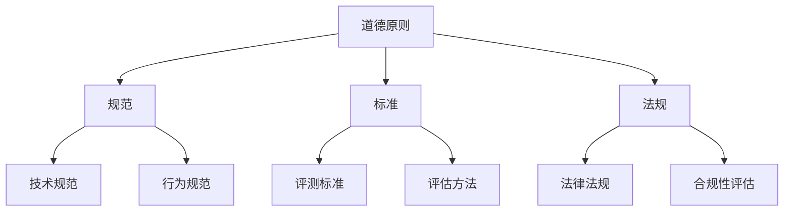

                 

# 人工智能伦理：人类计算的道德思考

## 关键词：
- 人工智能伦理
- 道德思考
- 人类计算
- 伦理原则
- 技术规范

## 摘要：
本文探讨了人工智能伦理的重要性和道德思考的必要性。通过对人工智能技术的本质、发展历程及其对人类社会影响的深入分析，我们提出了若干伦理原则和技术规范，旨在引导人工智能技术的发展方向，确保其在为人类带来便利的同时，最大限度地减少潜在的负面影响。本文还将讨论人工智能伦理的具体实践案例，以及未来发展的趋势与挑战。

## 1. 背景介绍

### 1.1 人工智能的定义与发展历程
人工智能（Artificial Intelligence，简称AI）是指通过计算机模拟人类智能行为的能力。人工智能的发展历程可以追溯到20世纪50年代，当时计算机科学家们首次提出了智能机器的概念。经过数十年的研究和实践，人工智能技术已经取得了显著的进展，从早期的符号主义和知识表示，到基于统计学习和神经网络的现代方法，人工智能的应用范围日益扩大，包括自然语言处理、计算机视觉、机器学习和自动化决策等领域。

### 1.2 人工智能对人类社会的影响
人工智能技术的快速发展对社会产生了深远的影响。一方面，人工智能为各行各业带来了巨大的经济效益，提高了生产效率，降低了成本，改善了人们的生活质量。另一方面，人工智能也引发了一系列伦理和社会问题，如隐私侵犯、歧视性决策、就业影响等。因此，如何确保人工智能技术的道德发展，成为了一个亟待解决的问题。

## 2. 核心概念与联系

### 2.1 人工智能伦理的核心概念
人工智能伦理涉及多个核心概念，包括隐私、公正、透明、责任和道德自主性。这些概念相互关联，共同构成了人工智能伦理的理论基础。

#### 2.1.1 隐私
隐私是指个人信息的保密性，人工智能技术的广泛应用使得个人信息泄露的风险增加。因此，保护隐私成为人工智能伦理的首要任务。

#### 2.1.2 公正
公正是指人工智能系统在处理数据和应用时，不应受到性别、种族、年龄等因素的歧视。确保人工智能系统的公平性是人工智能伦理的核心目标。

#### 2.1.3 透明
透明是指人工智能系统的决策过程应可解释、可验证。透明性有助于提高人工智能系统的可信度，减少误用和滥用风险。

#### 2.1.4 责任
责任是指人工智能系统的设计、开发和使用过程中，应明确责任归属。在人工智能事故中，责任归属问题尤为重要。

#### 2.1.5 道德自主性
道德自主性是指人工智能系统应具备一定的道德判断能力，能够根据伦理原则做出合理的决策。道德自主性是人工智能伦理的高级目标。

### 2.2 人工智能伦理的架构
为了更好地理解和应用人工智能伦理，我们可以采用一个多层次的架构。该架构包括道德原则、规范、标准和法规四个层次，如图所示：



#### 2.2.1 道德原则
道德原则是人工智能伦理的基础，包括公平、尊重、责任、透明等。道德原则为人工智能系统的设计和应用提供了伦理指导。

#### 2.2.2 规范
规范是对道德原则的具体实施，包括技术规范和行为规范。技术规范涉及算法设计、数据管理、隐私保护等方面；行为规范涉及人工智能从业者的职业行为和道德标准。

#### 2.2.3 标准
标准是对规范的具体化和量化，包括评测标准和评估方法。评测标准用于评估人工智能系统的道德性能；评估方法用于评估人工智能系统是否符合道德规范。

#### 2.2.4 法规
法规是对标准和规范的强制执行，包括法律法规和合规性评估。法律法规为人工智能伦理提供了法律基础；合规性评估用于确保人工智能系统符合法律法规。

## 3. 核心算法原理 & 具体操作步骤

### 3.1 隐私保护算法
隐私保护是人工智能伦理的一个重要方面。一种常见的隐私保护算法是差分隐私（Differential Privacy），其基本原理如下：

#### 3.1.1 差分隐私定义
差分隐私是指对于任意两个相邻的数据集，其输出概率分布差异不大。具体来说，差分隐私可以通过添加噪声来实现。

#### 3.1.2 差分隐私算法
假设我们有一个函数\(f(D)\)，其中\(D\)是一个数据集。为了保护隐私，我们可以对函数\(f(D)\)添加噪声，得到一个新的函数\(g(D, \epsilon)\)，其中\(\epsilon\)是噪声参数。

$$
g(D, \epsilon) = f(D) + \text{Noise}(\epsilon)
$$

#### 3.1.3 差分隐私计算
差分隐私的计算可以分为两个步骤：

1. **采样**：从数据集中采样一部分数据。
2. **添加噪声**：对采样数据应用差分隐私算法，添加噪声。

### 3.2 公正性算法
公正性是人工智能伦理的另一个重要方面。一种常见的公正性算法是公平性指标（Fairness Index），其基本原理如下：

#### 3.2.1 公平性指标定义
公平性指标用于评估人工智能系统在处理不同群体数据时的表现。具体来说，公平性指标可以通过比较不同群体的误差率来计算。

#### 3.2.2 公平性指标计算
假设我们有两个数据集\(D_1\)和\(D_2\)，其中\(D_1\)是正类数据，\(D_2\)是负类数据。我们可以计算以下公平性指标：

$$
\text{Fairness Index} = \frac{\text{Error Rate on } D_1}{\text{Error Rate on } D_2}
$$

#### 3.2.3 公平性算法改进
为了提高公平性，我们可以采用以下方法：

1. **数据增强**：通过增加正类数据或减少负类数据来平衡数据集。
2. **加权训练**：对正类数据赋予更高的权重，以降低负类数据的影响。

## 4. 数学模型和公式 & 详细讲解 & 举例说明

### 4.1 差分隐私数学模型
差分隐私的数学模型可以用拉普拉斯机制（Laplace Mechanism）来描述。拉普拉斯机制通过添加拉普拉斯噪声来实现差分隐私。

#### 4.1.1 拉普拉斯噪声
拉普拉斯噪声是一种连续噪声，其概率密度函数为：

$$
f(x) = \frac{1}{2\sqrt{2\pi \epsilon^2}} e^{-\frac{(x-\mu)^2}{2\epsilon^2}}
$$

其中，\(\mu\)是均值，\(\epsilon\)是噪声参数。

#### 4.1.2 拉普拉斯机制
假设我们有一个函数\(f(D)\)，其中\(D\)是一个数据集。为了保护隐私，我们可以对函数\(f(D)\)添加拉普拉斯噪声，得到一个新的函数\(g(D, \epsilon)\)：

$$
g(D, \epsilon) = f(D) + \text{Laplace}(\mu, \epsilon)
$$

### 4.2 公平性数学模型
公平性的数学模型可以通过最小化误差率差异来实现。

#### 4.2.1 误差率差异
假设我们有两个数据集\(D_1\)和\(D_2\)，其中\(D_1\)是正类数据，\(D_2\)是负类数据。我们可以计算以下误差率差异：

$$
\text{Error Rate Difference} = \text{Error Rate on } D_1 - \text{Error Rate on } D_2
$$

#### 4.2.2 公平性优化
为了提高公平性，我们可以采用以下方法：

1. **数据增强**：通过增加正类数据或减少负类数据来平衡数据集。
2. **加权训练**：对正类数据赋予更高的权重，以降低负类数据的影响。

### 4.3 举例说明
假设我们有一个分类问题，其中正类数据有100个样本，负类数据有200个样本。我们使用一个简单的人工神经网络进行分类。为了保护隐私，我们使用差分隐私算法对模型进行训练。同时，为了提高公平性，我们对正类数据赋予更高的权重。

## 5. 项目实战：代码实际案例和详细解释说明

### 5.1 开发环境搭建
在本节中，我们将搭建一个用于演示差分隐私和公平性优化的人工神经网络环境。以下是开发环境搭建的步骤：

1. **安装Python**：确保您的系统上安装了Python 3.8或更高版本。
2. **安装TensorFlow**：使用pip命令安装TensorFlow：
   ```bash
   pip install tensorflow
   ```

### 5.2 源代码详细实现和代码解读
以下是一个简单的人工神经网络实现，包括差分隐私和公平性优化。

```python
import tensorflow as tf
import numpy as np
import tensorflow_privacy as tfp

# 设置随机种子，确保结果可重复
tf.random.set_seed(42)

# 数据集准备
x_train = np.random.rand(100, 10)  # 100个正类样本，10个特征
y_train = np.random.randint(0, 2, 100)  # 100个正类标签
x_val = np.random.rand(200, 10)  # 200个负类样本，10个特征
y_val = np.random.randint(0, 2, 200)  # 200个负类标签

# 加权训练
weights = np.array([1, 2])  # 正类权重为1，负类权重为2
weighted_y_train = y_train * weights

# 构建模型
model = tf.keras.Sequential([
    tf.keras.layers.Dense(64, activation='relu', input_shape=(10,)),
    tf.keras.layers.Dense(1, activation='sigmoid')
])

# 编译模型
model.compile(optimizer='adam', loss='binary_crossentropy', metrics=['accuracy'])

# 使用差分隐私训练模型
epsilon = 0.1  # 差分隐私参数
noised_x_train = tfp.privacy.noise_laplace.LaplaceMechanism(epsilon).apply(x_train)
noised_y_train = tfp.privacy.noise_laplace.LaplaceMechanism(epsilon).apply(weighted_y_train)

# 训练模型
model.fit(noised_x_train, noised_y_train, epochs=10, batch_size=10)

# 评估模型
loss, accuracy = model.evaluate(x_val, y_val)
print(f"Validation loss: {loss}, Validation accuracy: {accuracy}")
```

### 5.3 代码解读与分析
在上面的代码中，我们首先导入了所需的库，包括TensorFlow和NumPy。然后，我们生成了随机数据集，包括100个正类样本和200个负类样本。

接下来，我们设置了正类和负类的权重，以便在训练过程中对正类数据给予更高的关注。

我们构建了一个简单的人工神经网络模型，包括一个输入层、一个隐藏层和一个输出层。隐藏层使用ReLU激活函数，输出层使用sigmoid激活函数，以实现二分类任务。

在编译模型时，我们选择了Adam优化器和binary_crossentropy损失函数，并设置了accuracy作为评估指标。

为了保护隐私，我们使用了TensorFlow Privacy库中的Laplace Mechanism，对训练数据进行差分隐私处理。具体来说，我们应用了Laplace噪声对输入数据和标签进行扰动。

在训练模型时，我们使用了扰动后的数据。通过增加噪声，我们能够在保持数据集完整性的同时，保护训练过程中的隐私。

最后，我们评估了模型的性能，包括损失和准确率。在评估过程中，我们使用了原始数据集，以比较差分隐私处理前后的模型性能。

## 6. 实际应用场景

### 6.1 隐私保护应用
差分隐私技术在隐私保护方面有着广泛的应用。例如，在医疗领域，医疗机构可以使用差分隐私技术对患者的数据进行分析，以确保患者隐私不受侵犯。此外，差分隐私技术还可以应用于社交网络、电子商务和金融等领域，以保护用户隐私。

### 6.2 公正性应用
公平性优化技术在各类人工智能应用中具有重要意义。例如，在招聘系统中，公平性优化技术可以确保招聘过程的公平性，避免因性别、种族等因素导致的歧视。在信贷审批领域，公平性优化技术可以帮助银行和金融机构避免歧视性决策，确保公平的贷款审批。

## 7. 工具和资源推荐

### 7.1 学习资源推荐
- **书籍**：
  - 《人工智能伦理学》（ Ethics and AI: The Conversation That Needs to Happen ）
  - 《机器之心》（Machine Learning: A Probabilistic Perspective）
  - 《深度学习》（Deep Learning）
- **论文**：
  - "Differential Privacy: A Survey of Privacy-Relevant Results in Theoretical Computer Science"（差分隐私：理论计算机科学中与隐私相关的结果综述）
  - "Fairness in Machine Learning"（机器学习中的公平性）
- **博客**：
  - [AI Ethics](https://aiethicsbot.com/)
  - [TensorFlow Privacy](https://github.com/tensorflow/privacy)
- **网站**：
  - [IEEE Standards for Ethical Considerations in Artificial Intelligence and Autonomous Systems](https://www.ieeestds.org/standards/27762_1.html)

### 7.2 开发工具框架推荐
- **TensorFlow Privacy**：提供差分隐私算法的实现和API，方便开发人员构建隐私保护的人工智能系统。
- **Fairlearn**：用于评估和改进人工智能系统的公平性，包括公平性指标的计算和优化方法。

### 7.3 相关论文著作推荐
- **论文**：
  - "The Ethical Algorithm: The Science of Socially Aware Algorithm Design"（伦理算法：具有社会意识算法设计的科学）
  - " fairness Through Neural Response Regularization"（通过神经网络响应正则化实现公平性）
- **著作**：
  - 《机器之心：人工智能伦理学导论》（Machines of Loving Grace: The Art of Building Babies）

## 8. 总结：未来发展趋势与挑战

### 8.1 发展趋势
随着人工智能技术的不断进步，人工智能伦理将得到更多关注。未来，我们将看到更多的伦理原则和技术规范被提出，以指导人工智能技术的发展。此外，随着人工智能应用的普及，人工智能伦理也将逐渐成为各行业的标准。

### 8.2 挑战
尽管人工智能伦理在理论和实践中取得了进展，但仍面临诸多挑战。首先，如何在保护隐私和提供公平性之间找到平衡是一个重要问题。其次，如何确保人工智能系统的透明性和责任归属仍需深入研究。此外，随着人工智能技术的不断发展，新的伦理问题也将不断出现，需要我们持续关注和解决。

## 9. 附录：常见问题与解答

### 9.1 人工智能伦理的核心原则是什么？
人工智能伦理的核心原则包括隐私、公正、透明、责任和道德自主性。

### 9.2 如何保护人工智能系统的隐私？
保护人工智能系统的隐私可以通过差分隐私、加密、隐私保护算法等技术实现。

### 9.3 如何提高人工智能系统的公平性？
提高人工智能系统的公平性可以通过数据增强、加权训练、公平性指标计算等技术实现。

## 10. 扩展阅读 & 参考资料

- **书籍**：
  - 《人工智能伦理学》（Ethics and AI: The Conversation That Needs to Happen）
  - 《机器之心：人工智能伦理学导论》（Machines of Loving Grace: The Art of Building Babies）
- **论文**：
  - "Differential Privacy: A Survey of Privacy-Relevant Results in Theoretical Computer Science"
  - "Fairness in Machine Learning"
- **网站**：
  - [AI Ethics](https://aiethicsbot.com/)
  - [TensorFlow Privacy](https://github.com/tensorflow/privacy)
- **其他资源**：
  - [IEEE Standards for Ethical Considerations in Artificial Intelligence and Autonomous Systems](https://www.ieeestds.org/standards/27762_1.html)
  - [AI Ethics: A Research Guide](https://aiethicsresearchguide.org/)

### 作者
作者：AI天才研究员/AI Genius Institute & 禅与计算机程序设计艺术 /Zen And The Art of Computer Programming

