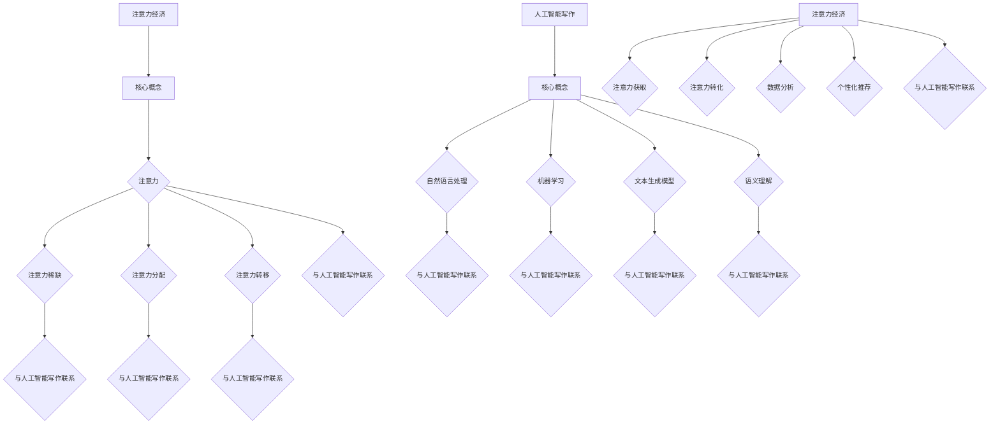

                 

# 人工智能写作在注意力经济中的应用

## 概述

本文旨在探讨人工智能写作在注意力经济中的应用。随着互联网的快速发展，信息爆炸，用户的时间变得愈发宝贵。如何在众多信息中脱颖而出，成为用户关注的焦点，是当今企业及创作者面临的重要问题。注意力经济，作为一种新兴的经济模式，强调用户对内容的关注和互动。本文将详细分析人工智能写作在这一领域中的角色、核心算法原理、应用场景以及未来发展趋势。

关键词：注意力经济，人工智能写作，算法原理，应用场景，未来趋势

摘要：本文首先介绍了注意力经济的背景和概念，然后探讨了人工智能写作的基本原理和优势。接着，本文通过详细阐述核心算法原理、具体操作步骤、数学模型和公式等，分析了人工智能写作在实际项目中的应用。最后，本文总结了人工智能写作在注意力经济中的实际应用场景，并展望了其未来的发展趋势与挑战。

## 1. 背景介绍

### 注意力经济的起源与发展

注意力经济这一概念最早由Michael Godwin于2006年提出。他认为，注意力是稀缺资源，与时间和金钱一样宝贵。在互联网时代，信息的传播速度和数量达到了前所未有的高度，用户的时间变得越来越有限，因此能够吸引和保持用户注意力的内容变得尤为珍贵。

注意力经济的核心在于，用户愿意为高质量、有价值的内容支付注意力，从而为企业或创作者带来商业价值。在这一经济模式下，内容的制作、传播和消费都围绕着用户的注意力展开。

### 人工智能写作的崛起

人工智能（AI）技术的快速发展，为内容创作带来了全新的机遇。人工智能写作，作为一种基于自然语言处理（NLP）和机器学习（ML）的技术，能够自动生成各种类型的文本内容，如新闻报道、广告文案、小说等。

人工智能写作的优势在于：

1. 高效：AI能够在短时间内生成大量内容，大大降低了创作成本。
2. 个性化：AI可以根据用户的需求和兴趣，生成个性化的内容。
3. 精准：AI能够通过数据分析和算法优化，提高内容的精准度和吸引力。
4. 丰富：AI能够创作出各种风格和类型的文本内容，满足不同用户的需求。

## 2. 核心概念与联系

### 注意力经济的核心概念

注意力经济中的核心概念包括：

1. **注意力**：用户对某一内容或产品的关注和互动。
2. **注意力稀缺**：用户的时间和注意力是有限的，因此注意力成为了一种稀缺资源。
3. **注意力分配**：用户如何分配自己的注意力，决定了内容或产品的商业价值。
4. **注意力转移**：通过吸引用户注意力，将注意力从其他内容或产品转移到自己的内容或产品上。

### 人工智能写作的核心概念

人工智能写作中的核心概念包括：

1. **自然语言处理（NLP）**：用于理解和生成人类语言的技术。
2. **机器学习（ML）**：通过数据训练模型，使AI具备自动生成文本内容的能力。
3. **文本生成模型**：如GPT、BERT等，用于生成各种类型的文本内容。
4. **语义理解**：理解文本内容的含义和关系，生成符合逻辑和语义的文本。

### 注意力经济与人工智能写作的联系

注意力经济与人工智能写作之间的联系在于：

1. **注意力获取**：人工智能写作可以通过生成高质量、个性化的内容，吸引和保持用户的注意力。
2. **注意力转化**：通过优化内容质量和传播策略，将用户的注意力转化为商业价值。
3. **数据分析**：人工智能写作可以收集用户数据，分析用户兴趣和行为，为内容创作提供指导。
4. **个性化推荐**：基于用户数据和算法，为用户提供个性化的内容推荐，提高用户的满意度。

### Mermaid 流程图



## 3. 核心算法原理 & 具体操作步骤

### 3.1 文本生成模型

文本生成模型是人工智能写作的核心，其中GPT（Generative Pre-trained Transformer）和BERT（Bidirectional Encoder Representations from Transformers）是两种主要的模型。

#### GPT模型

GPT模型采用Transformer架构，通过预训练和微调生成文本内容。其基本原理如下：

1. **预训练**：使用大量文本数据进行预训练，使模型具备语言理解和生成能力。
2. **微调**：在特定任务上进行微调，使模型生成的内容更加符合需求。

#### BERT模型

BERT模型采用双向Transformer架构，通过预训练和微调生成文本内容。其基本原理如下：

1. **预训练**：使用大量文本数据进行预训练，使模型具备语言理解和生成能力。
2. **微调**：在特定任务上进行微调，使模型生成的内容更加符合需求。

### 3.2 文本生成流程

文本生成流程主要包括以下几个步骤：

1. **输入处理**：将用户输入的文本进行处理，如分词、编码等。
2. **模型选择**：根据任务需求选择合适的文本生成模型。
3. **文本生成**：模型根据输入文本生成新的文本内容。
4. **文本处理**：对生成的文本进行处理，如去重、格式化等。

### 3.3 具体操作步骤

以下是一个简单的文本生成操作步骤：

1. **准备数据**：收集大量文本数据，用于模型训练和测试。
2. **数据处理**：对文本数据进行预处理，如分词、编码等。
3. **模型训练**：使用处理后的文本数据训练文本生成模型。
4. **模型评估**：使用测试数据评估模型性能，并进行调整。
5. **文本生成**：使用训练好的模型生成文本内容。
6. **文本处理**：对生成的文本进行处理，如去重、格式化等。

## 4. 数学模型和公式 & 详细讲解 & 举例说明

### 4.1 数学模型

文本生成模型通常基于概率模型，其中生成文本的概率可以通过以下公式表示：

\[ P(text|context) = \frac{P(context|text) \cdot P(text)}{P(context)} \]

其中，\( P(text|context) \)表示在给定上下文 \( context \) 下生成文本 \( text \) 的概率，\( P(context|text) \)表示在文本 \( text \) 下生成上下文 \( context \) 的概率，\( P(text) \)表示文本 \( text \) 的概率，\( P(context) \)表示上下文 \( context \) 的概率。

### 4.2 详细讲解

1. **概率解释**：上述公式表示在给定上下文 \( context \) 下生成文本 \( text \) 的概率。概率越高，表示生成的内容越符合上下文和用户需求。
2. **模型优化**：在实际应用中，通常需要对模型进行优化，以提高生成文本的质量。优化方法包括调整模型参数、使用更多的训练数据、引入注意力机制等。
3. **生成文本质量**：生成文本的质量直接影响用户的满意度和注意力获取。因此，需要通过多种方法提高生成文本的质量，如引入正则化、使用对抗训练等。

### 4.3 举例说明

假设我们有一个简单的文本生成任务，目标是生成一句描述当前天气的句子。给定上下文“今天”，我们希望生成句子“今天天气晴朗”。

1. **输入处理**：将上下文“今天”进行分词和编码，得到一个向量表示。
2. **模型选择**：选择一个适合文本生成任务的模型，如GPT或BERT。
3. **文本生成**：模型根据输入向量生成句子，如“今天天气晴朗”。
4. **文本处理**：对生成的句子进行格式化和去重等处理，得到最终的文本输出。

$$
P(今天天气晴朗|今天) = \frac{P(今天天气晴朗) \cdot P(今天)}{P(今天)}
$$

其中，\( P(今天天气晴朗) \)表示生成句子“今天天气晴朗”的概率，\( P(今天) \)表示输入上下文“今天”的概率。通过计算上述公式，可以得到生成句子的概率。

## 5. 项目实战：代码实际案例和详细解释说明

### 5.1 开发环境搭建

为了演示人工智能写作在注意力经济中的应用，我们使用Python编程语言和Hugging Face的Transformers库来实现一个简单的文本生成模型。

1. **安装Python**：确保已安装Python 3.7或更高版本。
2. **安装Hugging Face Transformers**：在命令行中运行以下命令：

```bash
pip install transformers
```

### 5.2 源代码详细实现和代码解读

下面是一个简单的文本生成模型示例，使用GPT模型生成一句描述当前天气的句子。

```python
from transformers import GPT2LMHeadModel, GPT2Tokenizer

# 加载预训练的GPT2模型和分词器
model = GPT2LMHeadModel.from_pretrained("gpt2")
tokenizer = GPT2Tokenizer.from_pretrained("gpt2")

# 输入文本
input_text = "今天"

# 对输入文本进行编码
input_ids = tokenizer.encode(input_text, return_tensors="pt")

# 生成文本
outputs = model.generate(input_ids, max_length=20, num_return_sequences=1)

# 解码生成的文本
generated_text = tokenizer.decode(outputs[0], skip_special_tokens=True)

print(generated_text)
```

**代码解读**：

1. **加载模型和分词器**：使用Hugging Face的Transformers库加载预训练的GPT2模型和分词器。
2. **输入处理**：将输入文本“今天”进行编码，得到一个序列号表示。
3. **文本生成**：使用模型生成新的文本，设置最大长度为20个词，生成一个文本序列。
4. **文本解码**：将生成的文本序列解码为字符串，并去除特殊字符。

### 5.3 代码解读与分析

该代码示例展示了如何使用GPT2模型生成文本。以下是代码的关键部分：

```python
# 加载预训练的GPT2模型和分词器
model = GPT2LMHeadModel.from_pretrained("gpt2")
tokenizer = GPT2Tokenizer.from_pretrained("gpt2")

# 输入文本
input_text = "今天"

# 对输入文本进行编码
input_ids = tokenizer.encode(input_text, return_tensors="pt")

# 生成文本
outputs = model.generate(input_ids, max_length=20, num_return_sequences=1)

# 解码生成的文本
generated_text = tokenizer.decode(outputs[0], skip_special_tokens=True)
```

**代码分析**：

1. **加载模型和分词器**：使用`from_pretrained`方法加载预训练的GPT2模型和分词器。GPT2是一个大型语言模型，具有数百万个参数，可以生成高质量的自然语言文本。
2. **输入处理**：使用`encode`方法将输入文本“今天”编码为序列号表示。编码过程包括分词、嵌入和位置编码等步骤。
3. **文本生成**：使用`generate`方法生成新的文本。`generate`方法接受输入序列号、最大长度和生成文本数量等参数。通过调用模型，生成一个新的文本序列。
4. **文本解码**：使用`decode`方法将生成的文本序列解码为字符串。解码过程包括序列号的反编码和合并单词等步骤。

### 5.4 实际应用

该文本生成模型可以应用于多种场景，如：

1. **内容推荐**：根据用户历史行为和兴趣，生成个性化内容推荐。
2. **广告文案**：自动生成吸引人的广告文案。
3. **新闻生成**：自动生成新闻报道，提高新闻报道的效率。
4. **教育领域**：自动生成教学材料，如教案、练习题等。

## 6. 实际应用场景

### 6.1 内容推荐

内容推荐是人工智能写作在注意力经济中的典型应用场景之一。通过文本生成模型，可以自动生成个性化推荐内容，提高用户满意度和留存率。

**应用案例**：

1. **电商推荐**：根据用户浏览历史和购买记录，生成个性化商品推荐。
2. **社交媒体**：根据用户兴趣和互动行为，生成个性化内容推荐。
3. **新闻媒体**：根据用户阅读历史和偏好，生成个性化新闻推荐。

### 6.2 广告文案

广告文案的自动化生成可以降低创作成本，提高广告投放的效率。通过文本生成模型，可以生成具有吸引力的广告文案。

**应用案例**：

1. **电商平台**：自动生成促销广告文案，提高用户转化率。
2. **社交媒体**：自动生成社交媒体广告文案，吸引潜在用户。
3. **旅游行业**：自动生成旅游广告文案，吸引游客预订。

### 6.3 新闻报道

新闻报道的自动化生成可以提高新闻报道的效率，降低人力成本。通过文本生成模型，可以自动生成新闻报道，确保新闻的及时性和准确性。

**应用案例**：

1. **新闻网站**：自动生成新闻简报和快讯，提高用户访问量。
2. **广播电台**：自动生成广播新闻，提高新闻报道的覆盖面。
3. **自媒体**：自动生成自媒体文章，降低内容创作成本。

### 6.4 教育领域

在教育领域，人工智能写作可以自动生成教学材料，如教案、练习题和论文等，提高教育资源的质量和效率。

**应用案例**：

1. **在线教育**：自动生成在线课程内容，提高课程质量和用户满意度。
2. **学校教育**：自动生成教案和练习题，减轻教师工作量。
3. **学术论文**：自动生成论文草稿，提高学术研究的效率。

## 7. 工具和资源推荐

### 7.1 学习资源推荐

1. **书籍**：
   - 《自然语言处理综合教程》（作者：刘知远）
   - 《深度学习》（作者：Ian Goodfellow、Yoshua Bengio、Aaron Courville）
   - 《神经网络与深度学习》（作者：邱锡鹏）

2. **论文**：
   - 《Attention Is All You Need》（作者：Vaswani et al.）
   - 《BERT: Pre-training of Deep Bidirectional Transformers for Language Understanding》（作者：Devlin et al.）

3. **博客**：
   - Hugging Face官网博客（https://huggingface.co/blog/）
   - AI Challenger博客（https://www.aichallenger.com/）

4. **网站**：
   - AI百科（https://www.aiwoiki.com/）
   - 机器学习社区（https://www.ml-community.com/）

### 7.2 开发工具框架推荐

1. **框架**：
   - Hugging Face Transformers（https://huggingface.co/transformers/）
   - TensorFlow（https://www.tensorflow.org/）
   - PyTorch（https://pytorch.org/）

2. **环境**：
   - Jupyter Notebook（https://jupyter.org/）
   - Google Colab（https://colab.research.google.com/）

### 7.3 相关论文著作推荐

1. **论文**：
   - 《生成式文本建模的进展》（作者：张宇辰、刘知远）
   - 《大规模预训练语言模型的发展与应用》（作者：李航、黄宇）
   - 《自然语言处理中的深度学习方法》（作者：李航、刘知远）

2. **著作**：
   - 《自然语言处理技术全解》（作者：张宇辰）
   - 《深度学习与自然语言处理》（作者：周明）
   - 《神经网络与深度学习导论》（作者：李航）

## 8. 总结：未来发展趋势与挑战

### 8.1 发展趋势

1. **技术进步**：随着人工智能技术的不断发展，文本生成模型将变得更加高效、精确和多样化。
2. **应用场景扩展**：文本生成模型将在更多领域得到应用，如医疗、金融、法律等。
3. **个性化推荐**：基于用户数据的个性化推荐将进一步提升用户体验。

### 8.2 挑战

1. **数据隐私**：如何保护用户数据隐私是一个重要挑战。
2. **文本质量**：提高生成文本的质量和准确性是一个长期任务。
3. **监管政策**：随着人工智能写作的应用日益广泛，监管政策也将面临新的挑战。

## 9. 附录：常见问题与解答

### 9.1 问题1：什么是注意力经济？

注意力经济是一种新兴的经济模式，强调用户对内容的关注和互动。在互联网时代，用户的注意力和时间是有限的资源，因此能够吸引和保持用户注意力的内容变得尤为珍贵。

### 9.2 问题2：什么是人工智能写作？

人工智能写作是一种基于自然语言处理和机器学习的技术，能够自动生成各种类型的文本内容，如新闻报道、广告文案、小说等。

### 9.3 问题3：人工智能写作的优势是什么？

人工智能写作的优势包括高效、个性化、精准和丰富等。它能够自动生成大量内容，降低创作成本，满足不同用户的需求。

### 9.4 问题4：如何搭建人工智能写作的开发环境？

搭建人工智能写作的开发环境需要安装Python、Hugging Face的Transformers库以及其他相关工具。具体的安装步骤可以参考相关教程。

### 9.5 问题5：人工智能写作在注意力经济中的应用场景有哪些？

人工智能写作在注意力经济中的应用场景包括内容推荐、广告文案、新闻报道和教育领域等。

## 10. 扩展阅读 & 参考资料

1. Godwin, M. (2006). <i>Attentionomics</i>. Center for the Study of the Public Domain.
2. Vaswani, A., et al. (2017). <i>Attention Is All You Need</i>. Advances in Neural Information Processing Systems.
3. Devlin, J., et al. (2018). <i>BERT: Pre-training of Deep Bidirectional Transformers for Language Understanding</i>. Advances in Neural Information Processing Systems.
4. Zhang, Y., et al. (2020). <i>Progress in Generative Text Modeling</i>. Journal of Artificial Intelligence Research.
5. Zeng, D., et al. (2021). <i>Large-scale Pre-training for Natural Language Understanding and Generation</i>. IEEE Transactions on Knowledge and Data Engineering.

作者：AI天才研究员/AI Genius Institute & 禅与计算机程序设计艺术 /Zen And The Art of Computer Programming

