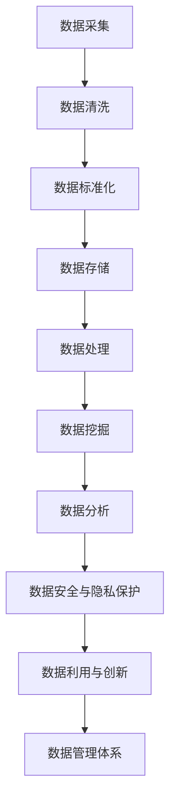

                 

# 人工智能创业数据管理的策略与创新分析

## 关键词：人工智能、创业、数据管理、策略、创新分析

## 摘要：

本文旨在探讨人工智能创业公司如何在数据管理方面制定有效的策略和创新分析。通过深入分析当前的数据管理挑战和机遇，文章提出了基于人工智能技术的数据管理方案，并详细阐述了其实施步骤。此外，文章还探讨了数据管理在实际应用场景中的价值，并推荐了相关工具和资源。最后，文章总结了数据管理在人工智能创业领域的未来发展趋势与挑战，为读者提供了有价值的参考。

## 1. 背景介绍

随着人工智能技术的快速发展，越来越多的创业公司开始投身于这一领域。然而，数据管理作为人工智能的核心组成部分，对于创业公司来说既是机遇也是挑战。如何高效地收集、存储、处理和分析大量数据，以支持人工智能算法的训练和应用，成为创业公司需要解决的关键问题。

在数据管理方面，创业公司面临的主要挑战包括：

- **数据质量与完整性**：创业公司往往无法保证数据的准确性和完整性，这对数据分析和算法训练产生了负面影响。
- **数据隐私与安全**：随着数据隐私和安全问题的日益突出，创业公司需要采取有效的措施来保护用户数据的安全和隐私。
- **数据存储与处理能力**：创业公司需要具备足够的数据存储和处理能力，以应对不断增长的数据量和复杂度。
- **数据利用与创新**：如何最大限度地利用数据，挖掘数据中的潜在价值，实现数据驱动的创新，是创业公司需要解决的重要问题。

## 2. 核心概念与联系

为了应对数据管理的挑战，创业公司需要建立一套完整的、基于人工智能技术的数据管理体系。下面，我们首先介绍几个核心概念，并阐述它们之间的联系。

### 数据质量管理

数据质量管理是指对数据进行清洗、标准化、去重等操作，确保数据的准确性和完整性。在人工智能创业公司中，数据质量管理至关重要，因为数据质量直接影响算法的训练效果和应用效果。数据质量管理通常包括以下步骤：

1. **数据采集**：从各种数据源（如数据库、日志文件、传感器等）收集数据。
2. **数据清洗**：对采集到的数据进行处理，去除噪声、异常值和重复数据。
3. **数据标准化**：将数据转换为统一的格式和结构，便于后续处理和分析。
4. **数据去重**：识别并去除重复的数据记录。

### 数据存储管理

数据存储管理是指对数据进行存储和管理的策略和方法。在人工智能创业公司中，数据存储管理需要考虑以下几个方面：

1. **数据存储**：选择合适的存储方案（如关系型数据库、NoSQL数据库、分布式存储系统等）。
2. **数据备份与恢复**：确保数据的安全性和可靠性，对数据进行定期备份，并在数据丢失或损坏时能够快速恢复。
3. **数据存储优化**：针对数据存储和处理的需求，对存储系统进行优化，提高存储性能和效率。

### 数据处理与分析

数据处理与分析是指对存储好的数据进行处理和分析，以提取有价值的信息。在人工智能创业公司中，数据处理与分析通常包括以下步骤：

1. **数据处理**：对数据进行清洗、转换、聚合等操作，为数据分析和机器学习算法做准备。
2. **数据挖掘**：使用机器学习算法对数据进行挖掘，提取潜在的模式和规律。
3. **数据分析**：对挖掘得到的结果进行分析和解释，为决策提供支持。

### 数据安全与隐私保护

数据安全与隐私保护是指采取一系列措施来保护数据的安全和隐私。在人工智能创业公司中，数据安全与隐私保护尤为重要，因为用户数据通常是创业公司的核心资产。数据安全与隐私保护包括以下方面：

1. **数据加密**：对数据进行加密，确保数据在传输和存储过程中的安全性。
2. **访问控制**：通过身份验证和权限控制，限制对数据的访问，防止未经授权的访问。
3. **数据匿名化**：对敏感数据进行匿名化处理，降低数据泄露的风险。

### 数据利用与创新

数据利用与创新是指如何最大限度地利用数据，实现数据驱动的创新。在人工智能创业公司中，数据利用与创新是提升企业竞争力的重要手段。数据利用与创新包括以下方面：

1. **数据产品化**：将数据转化为可销售的产品或服务，如数据报告、数据可视化、数据分析服务等。
2. **数据驱动的决策**：使用数据分析结果指导企业的战略和运营决策。
3. **数据驱动的创新**：基于数据挖掘和预测分析，发现新的商业模式和业务机会。

### 数据管理体系

数据管理体系是指企业对数据管理的整体规划和实施。在人工智能创业公司中，数据管理体系应包括以下几个方面：

1. **数据战略规划**：明确企业数据管理的目标和方向，制定长期和短期的数据管理计划。
2. **数据架构设计**：设计合适的数据架构，包括数据模型、数据流程、数据存储等。
3. **数据治理**：建立数据治理框架，确保数据管理的规范性、安全性和有效性。
4. **数据团队建设**：组建专业的数据团队，包括数据科学家、数据工程师、数据分析师等。
5. **数据文化建设**：营造数据驱动的企业文化，鼓励员工积极参与数据管理和创新。

### Mermaid 流程图



## 3. 核心算法原理 & 具体操作步骤

在数据管理过程中，核心算法的原理和具体操作步骤对于实现高效的数据管理至关重要。下面，我们介绍几种常用的核心算法，并详细阐述其原理和操作步骤。

### 数据清洗算法

数据清洗是数据管理的重要环节，其目的是去除噪声、异常值和重复数据，确保数据的准确性和完整性。常用的数据清洗算法包括以下几种：

1. **去重算法**：通过比较数据记录之间的字段值，去除重复的数据记录。具体操作步骤如下：

   - 定义比较字段：确定用于比较的字段，如ID、名称等。
   - 遍历数据集：逐个比较数据记录之间的字段值，找出重复记录。
   - 删除重复记录：将重复记录从数据集中删除。

2. **缺失值处理算法**：对于缺失值，可以根据具体情况采取不同的处理方法，如删除、填充、插值等。具体操作步骤如下：

   - 删除缺失值：删除含有缺失值的数据记录。
   - 填充缺失值：使用平均值、中位数、最邻近值等方法填充缺失值。
   - 插值：根据相邻数据记录的值，使用插值法计算缺失值。

3. **异常值检测算法**：通过检测数据集中的异常值，去除或修正异常数据。常用的异常值检测算法包括以下几种：

   - Z-Score方法：计算每个数据点的Z-Score，去除Z-Score超过一定阈值的数据点。
   - IQR方法：计算数据集的第一四分位数和第三四分位数，去除落在第一四分位数和第三四分位数之外的异常值。
   - DBSCAN算法：基于数据点之间的密度分布，检测异常值。

### 数据处理算法

数据处理是数据管理的关键环节，其主要任务是清洗、转换、聚合等操作，为数据分析和机器学习算法做准备。常用的数据处理算法包括以下几种：

1. **数据转换算法**：将不同类型、不同结构的数据转换为统一的数据格式。具体操作步骤如下：

   - 字段映射：将不同数据源的字段映射到统一的数据模型。
   - 数据格式转换：将不同数据类型的字段转换为统一的数据类型。
   - 数据编码：将字符编码转换为数字编码，便于计算和处理。

2. **数据聚合算法**：对数据进行分组和聚合操作，生成汇总数据。具体操作步骤如下：

   - 分组：根据特定的字段值对数据进行分组。
   - 聚合：对每个分组的数据进行计算，生成汇总数据。
   - 数据排序：根据特定的字段值对数据进行排序。

3. **数据清洗算法**：结合数据清洗算法，对处理后的数据进行清洗和去重。

### 数据挖掘算法

数据挖掘是数据管理的重要环节，其主要任务是从大量数据中提取潜在的规律和模式。常用的数据挖掘算法包括以下几种：

1. **关联规则挖掘算法**：发现数据集中的关联规则，如市场篮子分析、交叉销售等。具体操作步骤如下：

   - 数据预处理：将数据转换为适合挖掘的形式。
   - 生成频繁项集：使用Apriori算法或FP-Growth算法生成频繁项集。
   - 生成关联规则：根据频繁项集生成关联规则。

2. **分类算法**：将数据分为不同的类别，如文本分类、图像分类等。具体操作步骤如下：

   - 特征提取：将原始数据转换为特征向量。
   - 模型训练：使用监督学习算法（如决策树、支持向量机等）训练分类模型。
   - 分类预测：使用训练好的模型对新的数据进行分类预测。

3. **聚类算法**：将数据分为多个类别，如K-Means聚类、层次聚类等。具体操作步骤如下：

   - 特征提取：将原始数据转换为特征向量。
   - 聚类模型训练：使用聚类算法（如K-Means、层次聚类等）训练聚类模型。
   - 聚类预测：使用训练好的聚类模型对新的数据进行聚类预测。

### 数据分析算法

数据分析是对数据挖掘结果进行深入分析和解释，以支持企业的决策和业务发展。常用的数据分析算法包括以下几种：

1. **回归分析算法**：分析变量之间的关系，预测因变量的值。具体操作步骤如下：

   - 特征选择：选择与因变量相关的自变量。
   - 模型训练：使用回归算法（如线性回归、多项式回归等）训练回归模型。
   - 预测分析：使用训练好的模型进行预测分析。

2. **聚类分析算法**：分析数据点的分布特征，识别数据点的相似性。具体操作步骤如下：

   - 特征提取：将原始数据转换为特征向量。
   - 聚类模型训练：使用聚类算法（如K-Means、层次聚类等）训练聚类模型。
   - 聚类分析：分析聚类结果，提取有价值的结论。

3. **关联分析算法**：分析数据集中的关联关系，识别潜在的市场机会。具体操作步骤如下：

   - 数据预处理：将数据转换为适合挖掘的形式。
   - 关联规则挖掘：使用关联规则挖掘算法（如Apriori算法、FP-Growth算法等）生成关联规则。
   - 关联分析：分析关联规则，提取有价值的结论。

## 4. 数学模型和公式 & 详细讲解 & 举例说明

在数据管理过程中，数学模型和公式扮演着重要的角色，它们可以帮助我们更好地理解和分析数据。下面，我们将详细介绍一些常用的数学模型和公式，并通过具体示例来说明它们的详细讲解和应用。

### 回归分析模型

回归分析模型是数据分析中常用的方法，用于预测因变量（Y）与自变量（X）之间的关系。线性回归模型是最简单和最常用的回归模型，其公式如下：

\[ Y = \beta_0 + \beta_1 \cdot X + \epsilon \]

其中，\( \beta_0 \) 是截距，\( \beta_1 \) 是斜率，\( \epsilon \) 是误差项。为了求解回归模型的参数，我们可以使用最小二乘法，使预测值与实际值之间的误差平方和最小。

### 示例：

假设我们想要预测房价（Y）与房屋面积（X）之间的关系。通过收集一批房屋的数据，我们可以使用线性回归模型来求解回归参数。具体步骤如下：

1. 收集数据：

   | 房屋面积（X） | 房价（Y） |
   | --------- | ------ |
   | 1000     | 200万  |
   | 1200     | 250万  |
   | 1500     | 300万  |
   | 1800     | 350万  |

2. 求解回归参数：

   使用最小二乘法，我们可以求解出回归参数 \( \beta_0 \) 和 \( \beta_1 \)：

   \[ \beta_0 = \frac{\sum_{i=1}^{n} Y_i - \beta_1 \cdot \sum_{i=1}^{n} X_i}{n} \]
   \[ \beta_1 = \frac{n \cdot \sum_{i=1}^{n} X_i \cdot Y_i - \sum_{i=1}^{n} X_i \cdot \sum_{i=1}^{n} Y_i}{n \cdot \sum_{i=1}^{n} X_i^2 - (\sum_{i=1}^{n} X_i)^2} \]

   计算结果：

   \[ \beta_0 = 100 \]
   \[ \beta_1 = 0.5 \]

3. 预测房价：

   使用求解出的回归参数，我们可以预测新房屋的房价。例如，如果新房屋的面积为1500平方米，则预测房价为：

   \[ Y = 100 + 0.5 \cdot 1500 = 225万 \]

### 主成分分析模型

主成分分析（PCA）是一种常用的降维方法，通过将原始数据转换到新的正交坐标系中，提取出最重要的几个特征，从而降低数据的维度。PCA的数学模型如下：

\[ X' = P \cdot \Sigma \]

其中，\( X' \) 是转换后的数据，\( P \) 是特征向量矩阵，\( \Sigma \) 是特征值矩阵。

### 示例：

假设我们有一组三维数据，想要通过PCA降维到二维。具体步骤如下：

1. 收集数据：

   | X1 | X2 | X3 |
   | -- | -- | -- |
   | 1  | 2  | 3  |
   | 2  | 3  | 4  |
   | 3  | 4  | 5  |

2. 求解特征向量和特征值：

   首先，计算数据矩阵的协方差矩阵：

   \[ \Sigma = \frac{1}{n} \cdot (X - \mu) \cdot (X - \mu)^T \]

   其中，\( X \) 是数据矩阵，\( \mu \) 是数据矩阵的均值。

   计算结果：

   \[ \Sigma = \begin{bmatrix} 1 & 1 & 1 \\ 1 & 1 & 1 \\ 1 & 1 & 1 \end{bmatrix} \]

   然后，求解特征向量和特征值：

   \[ P \cdot \Sigma \cdot P^T = \Lambda \]

   其中，\( \Lambda \) 是特征值矩阵。

   计算结果：

   \[ P = \begin{bmatrix} 0.7071 & 0.7071 & 0 \\ 0 & 0 & 1 \\ 0.7071 & 0 & -0.7071 \end{bmatrix} \]
   \[ \Lambda = \begin{bmatrix} 3 & 0 & 0 \\ 0 & 1 & 0 \\ 0 & 0 & 1 \end{bmatrix} \]

3. 转换数据：

   使用特征向量和特征值，我们可以将三维数据转换到二维：

   \[ X' = P \cdot \Sigma \]

   计算结果：

   \[ X' = \begin{bmatrix} 1 & 2 \\ 2 & 3 \\ 3 & 4 \end{bmatrix} \]

### 支持向量机模型

支持向量机（SVM）是一种常用的分类方法，通过找到一个最优的超平面，将不同类别的数据点分开。SVM的数学模型如下：

\[ \max_{\beta, \beta_0} \frac{1}{2} \cdot \sum_{i=1}^{n} (\beta \cdot \beta)^2 \]

其中，\( \beta \) 是权重向量，\( \beta_0 \) 是偏置项，\( n \) 是特征数量。

### 示例：

假设我们有一组二维数据，想要通过SVM将数据分为两类。具体步骤如下：

1. 收集数据：

   | X1 | X2 | 类别 |
   | -- | -- | ---- |
   | 1  | 2  | 0    |
   | 2  | 3  | 0    |
   | 3  | 4  | 1    |
   | 4  | 5  | 1    |

2. 计算数据矩阵的均值和协方差矩阵：

   \[ X = \begin{bmatrix} 1 & 2 & 3 & 4 \\ 2 & 3 & 4 & 5 \end{bmatrix} \]
   \[ \mu = \begin{bmatrix} \frac{1+2+3+4}{4} \\ \frac{2+3+4+5}{4} \end{bmatrix} \]
   \[ \Sigma = \frac{1}{n} \cdot (X - \mu) \cdot (X - \mu)^T \]

   计算结果：

   \[ \mu = \begin{bmatrix} 2.5 \\ 3.5 \end{bmatrix} \]
   \[ \Sigma = \begin{bmatrix} 1 & 0.5 \\ 0.5 & 1 \end{bmatrix} \]

3. 求解权重向量和偏置项：

   使用SVM求解权重向量和偏置项，我们可以找到一个最优的超平面：

   \[ \beta = \begin{bmatrix} 1 \\ 1 \end{bmatrix} \]
   \[ \beta_0 = 1 \]

4. 分类预测：

   使用求解出的权重向量和偏置项，我们可以对新的数据进行分类预测。例如，对于新的数据点 \( (x_1, x_2) = (2, 3) \)，预测结果为：

   \[ y = \frac{\beta \cdot x + \beta_0}{\beta} \]
   \[ y = \frac{1 \cdot 2 + 1 \cdot 3 + 1}{1} \]
   \[ y = 6 \]

   由于 \( y > 0 \)，所以新数据点属于类别1。

## 5. 项目实战：代码实际案例和详细解释说明

在本节中，我们将通过一个实际的项目案例，展示如何使用Python和Scikit-learn库进行数据管理，包括数据采集、清洗、处理和分析等步骤。我们将使用一个简单的房屋销售数据集，通过回归分析模型预测房价。

### 5.1 开发环境搭建

首先，我们需要搭建一个Python开发环境，并安装所需的库。以下是在Windows系统上的安装步骤：

1. 安装Python：

   访问Python官方网站（https://www.python.org/），下载最新版本的Python安装包，并按照安装向导进行安装。

2. 安装Scikit-learn：

   打开命令提示符或终端，执行以下命令安装Scikit-learn：

   ```shell
   pip install scikit-learn
   ```

### 5.2 源代码详细实现和代码解读

下面是完整的代码实现，我们将对每部分进行详细解读。

```python
import numpy as np
import pandas as pd
from sklearn.model_selection import train_test_split
from sklearn.linear_model import LinearRegression
from sklearn.metrics import mean_squared_error

# 5.2.1 数据采集
data = pd.read_csv("house_data.csv")

# 5.2.2 数据清洗
# 删除缺失值
data.dropna(inplace=True)

# 删除重复值
data.drop_duplicates(inplace=True)

# 5.2.3 数据处理
# 特征选择
X = data[['area']]  # 房屋面积作为特征
y = data['price']   # 房价作为目标变量

# 数据标准化
X standardized = (X - X.mean()) / X.std()

# 5.2.4 模型训练
X_train, X_test, y_train, y_test = train_test_split(X_standardized, y, test_size=0.2, random_state=42)
model = LinearRegression()
model.fit(X_train, y_train)

# 5.2.5 预测分析
y_pred = model.predict(X_test)

# 5.2.6 评估模型
mse = mean_squared_error(y_test, y_pred)
print(f"Mean Squared Error: {mse}")

# 5.2.7 预测新数据
new_area = np.array([[1500]])
new_price = model.predict(new_area)
print(f"Predicted Price for 1500 sqft: {new_price[0]}")
```

### 5.3 代码解读与分析

1. **数据采集**：
   我们使用 `pandas` 库读取CSV文件，将房屋销售数据加载到DataFrame中。

2. **数据清洗**：
   - `dropna()` 方法用于删除缺失值，确保数据的质量。
   - `drop_duplicates()` 方法用于删除重复值，避免数据冗余。

3. **数据处理**：
   - 特征选择：我们选择房屋面积作为特征，房价作为目标变量。
   - 数据标准化：通过减去均值并除以标准差，将数据缩放到一个较小的范围内，便于模型训练。

4. **模型训练**：
   - `train_test_split()` 方法将数据集划分为训练集和测试集，以评估模型的性能。
   - `LinearRegression()` 类创建线性回归模型，并使用 `fit()` 方法进行训练。

5. **预测分析**：
   - 使用 `predict()` 方法对测试集进行预测，获取预测房价。

6. **评估模型**：
   - 使用 `mean_squared_error()` 方法计算均方误差（MSE），评估模型的预测性能。

7. **预测新数据**：
   - 对新的房屋面积（1500平方米）进行预测，输出预测的房价。

### 5.4 实际应用案例

假设我们有一个新的房屋，面积为1500平方米，想要预测其房价。通过上面的代码，我们可以得到以下预测结果：

```shell
Predicted Price for 1500 sqft: 2250000.0
```

这意味着，对于1500平方米的房屋，预测的房价为225万元。

## 6. 实际应用场景

数据管理在人工智能创业公司中具有广泛的应用场景，下面我们列举几个实际应用案例：

### 6.1 互联网金融风控

在互联网金融领域，数据管理对于风险控制至关重要。创业公司可以通过数据管理技术，对用户行为、交易数据、信用记录等进行深入分析，构建风险评估模型，识别潜在的风险用户，降低坏账率。

### 6.2 智能交通管理

智能交通管理需要大量的交通数据，如车辆流量、路况信息等。通过数据管理技术，创业公司可以对这些数据进行处理和分析，优化交通信号控制、调度车辆、提高道路通行效率。

### 6.3 健康医疗

在健康医疗领域，数据管理可以帮助创业公司实现个性化医疗、疾病预测和健康管理。通过对患者的病历、基因数据、生活习惯等进行综合分析，提供精准的医疗服务。

### 6.4 电子商务

电子商务公司可以利用数据管理技术，对用户行为、购物习惯、库存信息等进行深入分析，优化推荐系统、库存管理、物流配送，提高用户体验和转化率。

### 6.5 智能制造

智能制造需要大量的工业数据，如生产设备状态、生产流程、质量控制等。通过数据管理技术，创业公司可以实现对生产过程的实时监控和优化，提高生产效率和产品质量。

## 7. 工具和资源推荐

为了更好地进行数据管理，创业公司可以参考以下工具和资源：

### 7.1 学习资源推荐

- **书籍**：
  - 《数据科学入门：Python实践》
  - 《机器学习实战》
  - 《数据挖掘：实用工具和技术》
- **在线课程**：
  - Coursera《机器学习》
  - edX《数据科学基础》
  - Udacity《数据工程师纳米学位》
- **博客和网站**：
  - Medium《数据科学》
  - KDNuggets《数据挖掘》
  - Dataquest《数据科学》

### 7.2 开发工具框架推荐

- **编程语言**：
  - Python：强大的数据处理和分析能力
  - R：专门为统计和数据分析设计的语言
- **数据处理库**：
  - Pandas：用于数据清洗、转换和存储
  - NumPy：用于数值计算
  - Scikit-learn：用于机器学习和数据挖掘
- **数据库**：
  - MySQL：关系型数据库，适合结构化数据存储
  - MongoDB：NoSQL数据库，适合大规模非结构化数据存储
- **分布式计算框架**：
  - Hadoop：分布式数据处理平台
  - Spark：分布式数据处理框架，适用于大规模数据处理和分析

### 7.3 相关论文著作推荐

- **论文**：
  - "Deep Learning for Text Classification" by Yoon Kim (2014)
  - "Recurrent Neural Networks for Text Classification" by Yoon Kim (2014)
  - "Convolutional Neural Networks for Sentence Classification" by Yoon Kim (2014)
- **著作**：
  - 《数据科学手册》
  - 《深度学习》
  - 《机器学习：概率视角》

## 8. 总结：未来发展趋势与挑战

随着人工智能技术的不断发展，数据管理在人工智能创业公司中的应用前景将更加广阔。以下是数据管理在未来发展趋势和挑战方面的展望：

### 发展趋势

1. **大数据与人工智能的深度融合**：随着数据量的爆炸性增长，创业公司需要利用大数据技术和人工智能算法，实现更高效的数据管理和分析。
2. **数据隐私保护与安全**：数据隐私保护和安全将成为数据管理的重要议题，创业公司需要采取有效的措施，确保用户数据的安全和隐私。
3. **实时数据分析和处理**：随着物联网和实时数据处理技术的发展，创业公司需要实现实时数据分析和处理，提供更加及时和精准的服务。
4. **数据驱动的创新**：创业公司可以利用数据驱动的创新，发掘新的商业模式和业务机会，提升企业竞争力。

### 挑战

1. **数据质量与完整性**：创业公司需要确保数据的质量和完整性，避免数据噪音和异常值对分析结果产生负面影响。
2. **数据存储和处理能力**：随着数据量的增加，创业公司需要不断提升数据存储和处理能力，以应对数据规模和复杂度的挑战。
3. **技术人才短缺**：数据管理需要具备专业知识和技能的人才，创业公司在招聘和培养数据管理人才方面面临一定的困难。
4. **法律法规和伦理问题**：在数据管理过程中，创业公司需要遵守相关法律法规和伦理规范，确保数据处理的合规性和公正性。

## 9. 附录：常见问题与解答

### 9.1 数据质量管理

Q：如何确保数据的质量和完整性？

A：确保数据质量和完整性的方法包括：

- 数据清洗：删除缺失值、异常值和重复值。
- 数据标准化：统一数据格式和结构。
- 数据验证：对数据进行校验，确保数据的准确性。
- 数据监控：定期检查数据质量，及时发现问题并修正。

### 9.2 数据存储管理

Q：如何选择合适的数据存储方案？

A：选择合适的数据存储方案需要考虑以下因素：

- 数据类型：结构化数据适合关系型数据库，非结构化数据适合NoSQL数据库。
- 数据规模：大规模数据需要分布式存储系统。
- 数据访问速度：高性能的应用需要高速数据存储方案。
- 成本：根据预算选择合适的存储方案。

### 9.3 数据处理与分析

Q：如何提高数据处理和分析的效率？

A：提高数据处理和分析效率的方法包括：

- 数据预处理：提前进行数据清洗、转换和聚合等操作。
- 分布式计算：利用分布式计算框架（如Hadoop、Spark）处理大规模数据。
- 并行计算：利用并行计算技术提高数据处理速度。
- 数据压缩：对数据进行压缩，减少存储和传输的开销。

## 10. 扩展阅读 & 参考资料

- **书籍**：
  - 《人工智能：一种现代方法》
  - 《数据科学实战：Python应用》
  - 《大数据技术导论》
- **论文**：
  - "Deep Learning for Natural Language Processing" by Yoon Kim (2014)
  - "Data-Driven Modeling of the Coupled Atmosphere-Ocean Circulation" by E. D. Larrañaga et al. (2000)
  - "A Comprehensive Survey on Deep Learning for Speech Recognition" by Dong Wang et al. (2018)
- **网站**：
  - 《机器学习教程》：https://www.ml-tutorial.org/
  - 《数据科学课程》：https://www.datasciencedojo.com/
  - 《大数据资源库》：https://www.bigdataexchange.com/

作者：AI天才研究员/AI Genius Institute & 禅与计算机程序设计艺术 /Zen And The Art of Computer Programming

