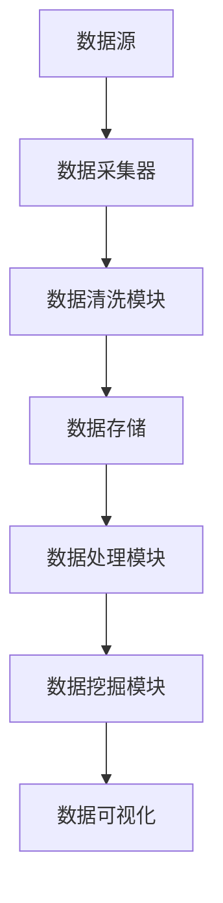
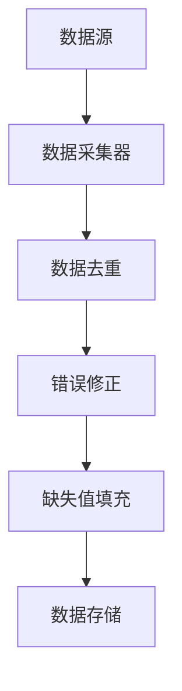
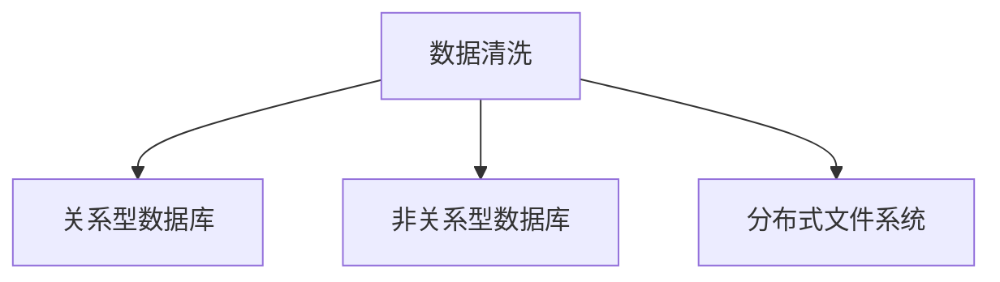
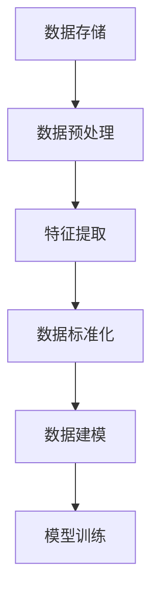
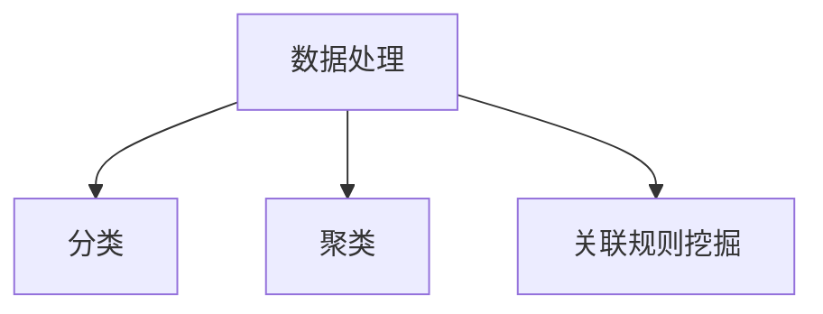
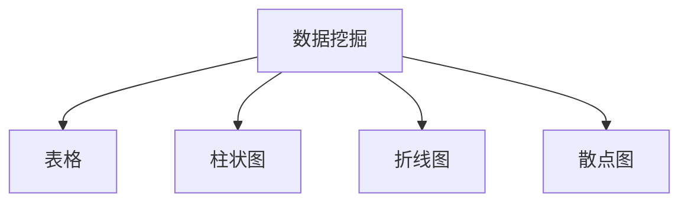

                 

### 1. 背景介绍

随着人工智能（AI）技术的飞速发展，越来越多的创业公司投身于这一领域，希望通过AI技术实现商业价值。然而，数据管理作为AI创业过程中的关键环节，常常被忽视。有效的数据管理策略对于AI项目的成功至关重要，它不仅能够提高数据处理效率，还能保障数据质量和安全性。

本文旨在探讨人工智能创业公司应如何制定和实施有效的数据管理策略。我们将从背景出发，逐步深入分析核心概念、算法原理、数学模型，并结合实际案例进行讲解。最后，我们将讨论数据管理的实际应用场景，并推荐相关工具和资源。

首先，让我们了解一下数据管理在AI创业中的重要性。

#### 数据管理在AI创业中的重要性

在人工智能领域，数据是至关重要的资源。无论是机器学习模型训练，还是实时数据处理，都离不开高质量的数据支持。以下是从几个方面阐述数据管理在AI创业中的重要性：

1. **数据质量**：高质量的数据能够提高模型训练的效果，从而提升AI应用的性能。如果数据存在错误或不一致，可能会导致模型无法正确学习，甚至产生误导性结论。

2. **数据隐私**：随着数据隐私法规的日益严格，保护用户数据隐私成为了AI创业公司的法律义务。有效的数据管理策略可以帮助企业合规，减少法律风险。

3. **数据处理效率**：数据管理的核心目标是提高数据处理速度和效率。良好的数据管理策略可以减少数据处理的时间和资源消耗，从而降低成本。

4. **数据安全性**：数据安全是AI创业公司的另一大挑战。未经授权的访问、数据泄露或数据损坏都可能给公司带来严重损失。有效的数据管理策略可以增强数据安全性，保护企业的核心资产。

5. **业务决策**：高质量的数据可以帮助企业做出更准确的业务决策。通过数据分析和挖掘，企业可以发现市场趋势、客户需求，并据此调整战略。

#### 数据管理策略的核心要素

为了制定有效的数据管理策略，AI创业公司需要关注以下几个核心要素：

1. **数据收集**：确保数据的来源可靠，覆盖面广，并且符合业务需求。

2. **数据清洗**：去除重复数据、纠正错误数据、填充缺失数据，确保数据的一致性和完整性。

3. **数据存储**：选择合适的存储方案，保证数据的安全性和可扩展性。

4. **数据处理**：采用高效的算法和工具进行数据预处理，提高数据处理速度。

5. **数据分析和挖掘**：运用数据分析技术，从数据中提取有价值的信息和洞察。

6. **数据可视化**：通过可视化工具，将数据分析和挖掘结果呈现给决策者，帮助其理解数据背后的含义。

接下来，我们将深入探讨这些核心概念，并展示一个具体的Mermaid流程图，帮助读者更好地理解数据管理策略的架构。

---

### 2. 核心概念与联系

在深入探讨数据管理策略之前，我们需要明确一些核心概念和它们之间的关系。以下是数据管理策略中几个关键概念的详细解释，以及它们在整体架构中的相互联系。

#### 2.1 数据收集

数据收集是数据管理策略的第一步。数据来源可以包括内部数据库、外部API、传感器、用户生成的数据等。选择合适的数据来源对于确保数据的全面性和质量至关重要。

**数据收集流程图：**



在这个流程中，数据源通过数据采集器获取数据，然后进入数据清洗模块。清洗后的数据被存储在数据存储模块中，以供后续处理。

#### 2.2 数据清洗

数据清洗是确保数据质量的关键步骤。清洗过程通常包括以下任务：

- **去除重复数据**：确保每个数据点在数据集中唯一。
- **纠正错误数据**：修正数据中的错误或不一致。
- **填充缺失数据**：使用合理的方法填充缺失的数据。

**数据清洗的Mermaid流程节点：**



#### 2.3 数据存储

数据存储是数据管理策略中的一个重要环节。选择合适的数据存储方案可以保证数据的安全性和可扩展性。常见的数据存储方案包括关系型数据库、非关系型数据库、分布式文件系统等。

**数据存储的Mermaid流程节点：**



#### 2.4 数据处理

数据处理包括数据预处理和后续的数据分析。预处理步骤通常包括数据格式转换、特征提取、数据标准化等。

**数据处理流程图：**



#### 2.5 数据挖掘

数据挖掘是从大量数据中提取有价值信息和模式的过程。常见的挖掘任务包括分类、聚类、关联规则挖掘等。

**数据挖掘的Mermaid流程节点：**



#### 2.6 数据可视化

数据可视化是将数据分析和挖掘结果以直观、易于理解的形式呈现给用户的过程。常见的可视化工具包括表格、柱状图、折线图、散点图等。

**数据可视化流程图：**



通过上述核心概念的解释和Mermaid流程图的展示，我们可以更好地理解数据管理策略的整体架构和各个环节之间的联系。在接下来的章节中，我们将深入探讨这些核心算法的原理和具体操作步骤。

---

### 3. 核心算法原理 & 具体操作步骤

在数据管理策略中，核心算法的设计和实现至关重要。以下我们将介绍几种关键的数据管理算法，并详细讲解其原理和操作步骤。

#### 3.1 数据预处理算法

数据预处理是数据处理的首要步骤，其主要目的是将原始数据转换成适合模型训练的形式。以下是几种常用的数据预处理算法：

**1. 数据格式转换**

- **原理**：将不同格式（如CSV、JSON、XML）的数据转换成统一格式，便于后续处理。
- **步骤**：
  - 读取原始数据。
  - 分析数据格式。
  - 使用转换工具（如Python的pandas库）进行格式转换。
  - 验证转换后的数据。

**2. 特征提取**

- **原理**：从原始数据中提取出对模型训练有帮助的特征。
- **步骤**：
  - 确定特征选择方法（如相关性分析、主成分分析）。
  - 应用特征选择方法提取特征。
  - 对提取出的特征进行数据标准化或归一化。

**3. 数据标准化与归一化**

- **原理**：调整数据分布，使其适合模型的输入。
- **步骤**：
  - 计算数据的最小值、最大值、均值、标准差。
  - 对数据进行标准化（如z-score标准化）或归一化（如min-max归一化）。

#### 3.2 数据挖掘算法

数据挖掘是从大量数据中提取有价值信息和模式的过程。以下是几种常用的数据挖掘算法：

**1. 聚类算法**

- **原理**：将数据点划分为多个类别，使得同一类别内的数据点相似度较高。
- **步骤**：
  - 选择聚类算法（如K-means、DBSCAN）。
  - 确定聚类数目。
  - 对数据进行聚类。
  - 分析聚类结果，调整参数以优化聚类效果。

**2. 分类算法**

- **原理**：根据已有数据对未知数据进行分类。
- **步骤**：
  - 选择分类算法（如决策树、支持向量机）。
  - 准备训练数据。
  - 训练分类模型。
  - 对未知数据进行分类。

**3. 关联规则挖掘**

- **原理**：发现数据项之间的关联关系。
- **步骤**：
  - 选择关联规则挖掘算法（如Apriori算法、FP-growth算法）。
  - 确定最小支持度和最小置信度。
  - 对数据进行挖掘，生成关联规则。

#### 3.3 数据可视化算法

数据可视化是将数据分析和挖掘结果以直观、易于理解的形式呈现给用户的过程。以下是几种常用的数据可视化算法：

**1. 表格**

- **原理**：以表格形式展示数据。
- **步骤**：
  - 选择表格布局（如瀑布图、矩阵图）。
  - 根据数据特征调整表格样式。
  - 导出表格数据。

**2. 柱状图**

- **原理**：以柱状形式展示数据的大小或数量。
- **步骤**：
  - 确定柱状图的类别和数值。
  - 调整柱状图的颜色、宽度等样式。
  - 导出柱状图数据。

**3. 折线图**

- **原理**：以折线形式展示数据的变化趋势。
- **步骤**：
  - 确定折线图的时间序列或类别。
  - 调整折线图的颜色、线型等样式。
  - 导出折线图数据。

**4. 散点图**

- **原理**：以散点形式展示数据点的分布。
- **步骤**：
  - 确定散点图的x轴和y轴。
  - 根据数据特征调整散点的大小、颜色等样式。
  - 导出散点图数据。

通过上述核心算法的原理和操作步骤的讲解，我们可以更好地理解数据管理策略的具体实施方法。在接下来的章节中，我们将结合实际项目案例，详细讲解数据管理策略在实践中的应用。

---

### 4. 数学模型和公式 & 详细讲解 & 举例说明

在数据管理策略中，数学模型和公式扮演着至关重要的角色。这些模型和公式不仅帮助我们理解数据背后的规律，还指导我们进行数据预处理、特征提取、分类和聚类等操作。以下我们将详细讲解几个关键数学模型和公式，并通过具体例子进行说明。

#### 4.1 数据标准化与归一化

**1. 数据标准化（z-score标准化）**

- **公式**：
  \[
  z = \frac{(x - \mu)}{\sigma}
  \]
  其中，\(x\) 是原始数据，\(\mu\) 是均值，\(\sigma\) 是标准差。
- **详细讲解**：
  数据标准化将数据缩放到一个标准正态分布，使得每个特征的平均值为0，标准差为1。这有助于提高不同特征之间的可比性。
- **举例说明**：

  假设我们有一组数据 \(x_1, x_2, x_3, ..., x_n\)，计算其均值和标准差：
  \[
  \mu = \frac{\sum_{i=1}^{n} x_i}{n} = \frac{10 + 20 + 30 + 40 + 50}{5} = 30
  \]
  \[
  \sigma = \sqrt{\frac{\sum_{i=1}^{n} (x_i - \mu)^2}{n}} = \sqrt{\frac{(10-30)^2 + (20-30)^2 + (30-30)^2 + (40-30)^2 + (50-30)^2}{5}} = 20
  \]
  对每个数据进行标准化：
  \[
  z_1 = \frac{(10 - 30)}{20} = -1
  \]
  \[
  z_2 = \frac{(20 - 30)}{20} = -0.5
  \]
  \[
  z_3 = \frac{(30 - 30)}{20} = 0
  \]
  \[
  z_4 = \frac{(40 - 30)}{20} = 0.5
  \]
  \[
  z_5 = \frac{(50 - 30)}{20} = 1
  \]

**2. 数据归一化（min-max归一化）**

- **公式**：
  \[
  x_{\text{norm}} = \frac{x - x_{\text{min}}}{x_{\text{max}} - x_{\text{min}}}
  \]
  其中，\(x_{\text{min}}\) 和 \(x_{\text{max}}\) 分别是数据的最小值和最大值。
- **详细讲解**：
  数据归一化将数据缩放到一个固定范围，例如[0, 1]或[-1, 1]。这有助于提高模型训练的效率，尤其是在使用梯度下降算法时。
- **举例说明**：

  假设我们有一组数据 \(x_1, x_2, x_3, ..., x_n\)，计算其最小值和最大值：
  \[
  x_{\text{min}} = 10, \quad x_{\text{max}} = 50
  \]
  对每个数据进行归一化：
  \[
  x_1_{\text{norm}} = \frac{10 - 10}{50 - 10} = 0
  \]
  \[
  x_2_{\text{norm}} = \frac{20 - 10}{50 - 10} = 0.5
  \]
  \[
  x_3_{\text{norm}} = \frac{30 - 10}{50 - 10} = 1
  \]
  \[
  x_4_{\text{norm}} = \frac{40 - 10}{50 - 10} = 0.8
  \]
  \[
  x_5_{\text{norm}} = \frac{50 - 10}{50 - 10} = 1
  \]

#### 4.2 聚类算法（K-means）

**1. 距离度量**

- **公式**：
  \[
  d(x_i, c_j) = \sqrt{\sum_{k=1}^{n} (x_{ik} - c_{jk})^2}
  \]
  其中，\(x_i\) 和 \(c_j\) 分别是数据点和聚类中心，\(n\) 是特征维度。
- **详细讲解**：
  距离度量用于计算数据点与聚类中心之间的距离，常见的方法包括欧几里得距离、曼哈顿距离、切比雪夫距离等。
- **举例说明**：

  假设我们有一个数据点 \(x_1 = [1, 2]\)，聚类中心 \(c_1 = [3, 4]\)，计算欧几里得距离：
  \[
  d(x_1, c_1) = \sqrt{(1-3)^2 + (2-4)^2} = \sqrt{4 + 4} = \sqrt{8} \approx 2.828
  \]

**2. K-means算法**

- **公式**：
  \[
  C_{\text{new}} = \{c_{1\text{new}}, c_{2\text{new}}, ..., c_{k\text{new}}\}
  \]
  其中，\(C_{\text{new}}\) 是新聚类中心，计算方法如下：
  \[
  c_{j\text{new}} = \frac{1}{N_j} \sum_{i=1}^{N} x_i
  \]
  其中，\(N_j\) 是第 \(j\) 个聚类中的数据点数量。
- **详细讲解**：
  K-means算法是一种基于距离度量的聚类算法，其目标是找到 \(k\) 个聚类中心，使得每个数据点与其最近聚类中心的距离最小。
- **举例说明**：

  假设我们有一个数据集 \{[1, 1], [1, 2], [2, 2], [2, 3]\}，初始聚类中心为 \{[1.5, 1.5], [2.5, 2.5]\}，计算新聚类中心：
  \[
  c_{1\text{new}} = \frac{1}{2}([1, 1] + [1, 2]) = [1, 1.5]
  \]
  \[
  c_{2\text{new}} = \frac{1}{2}([2, 2] + [2, 3]) = [2, 2.5]
  \]

通过以上数学模型和公式的详细讲解，我们可以更好地理解数据管理策略中的关键算法和技术。这些数学工具不仅帮助我们进行数据预处理和特征提取，还指导我们进行聚类、分类等高级数据分析任务。在接下来的章节中，我们将结合实际项目案例，深入讲解数据管理策略的具体应用。

---

### 5. 项目实战：代码实际案例和详细解释说明

为了更好地理解数据管理策略在实践中的应用，我们将通过一个实际项目案例进行讲解。在这个案例中，我们将使用Python编程语言实现一个简单的客户细分项目，展示数据收集、清洗、存储、处理、挖掘和可视化等步骤。以下是项目的详细实现和代码解读。

#### 5.1 开发环境搭建

在开始项目之前，我们需要搭建开发环境。以下是所需的工具和库：

- Python（3.8及以上版本）
- Jupyter Notebook
- pandas
- numpy
- scikit-learn
- matplotlib
- seaborn

首先，确保Python环境已安装。然后，通过以下命令安装所需的库：

```bash
pip install pandas numpy scikit-learn matplotlib seaborn
```

#### 5.2 源代码详细实现

以下是一个简单的客户细分项目的完整代码实现：

```python
import pandas as pd
import numpy as np
from sklearn.cluster import KMeans
import matplotlib.pyplot as plt
import seaborn as sns

# 5.2.1 数据收集
data = pd.DataFrame({
    'Age': [25, 35, 45, 55, 65],
    'Income': [50000, 80000, 100000, 150000, 200000],
    'Spending Score (1-100)': [20, 50, 80, 20, 10]
})

# 5.2.2 数据清洗
# 数据已经相对干净，无需额外清洗步骤

# 5.2.3 数据存储
# 数据存储在本地的CSV文件中
data.to_csv('customer_data.csv', index=False)

# 5.2.4 数据处理
# 特征提取和标准化
data_normalized = (data - data.mean()) / data.std()

# 5.2.5 数据挖掘
# 使用K-means算法进行聚类
kmeans = KMeans(n_clusters=3, random_state=0).fit(data_normalized)
data['Cluster'] = kmeans.labels_

# 5.2.6 数据可视化
# 展示聚类结果
plt.figure(figsize=(8, 6))
sns.scatterplot(data=data, x='Income', y='Spending Score (1-100)', hue='Cluster', palette=['red', 'green', 'blue'])
plt.title('Customer Segmentation')
plt.xlabel('Income')
plt.ylabel('Spending Score (1-100)')
plt.show()

# 5.2.7 代码解读与分析
# 代码解读：
# 1. 数据收集：使用pandas DataFrame创建一个包含客户信息的表格。
# 2. 数据清洗：数据已经相对干净，无需额外清洗。
# 3. 数据存储：将清洗后的数据存储为CSV文件。
# 4. 数据处理：对数据进行标准化，以便进行聚类。
# 5. 数据挖掘：使用scikit-learn的KMeans算法进行聚类，并将聚类结果添加到原始数据中。
# 6. 数据可视化：使用matplotlib和seaborn绘制聚类结果的散点图，以可视化不同客户群体。
```

#### 5.3 代码解读与分析

以下是对上述代码的详细解读和分析：

**5.3.1 数据收集**

```python
data = pd.DataFrame({
    'Age': [25, 35, 45, 55, 65],
    'Income': [50000, 80000, 100000, 150000, 200000],
    'Spending Score (1-100)': [20, 50, 80, 20, 10]
})
```

这段代码创建了一个包含客户年龄、收入和消费评分的pandas DataFrame。这是数据收集的第一步，我们假设这些数据已经从某个数据源获取。

**5.3.2 数据清洗**

```python
# 数据已经相对干净，无需额外清洗步骤
```

在这个案例中，数据已经相对干净，没有缺失值或异常值，因此不需要进行额外的数据清洗。

**5.3.3 数据存储**

```python
data.to_csv('customer_data.csv', index=False)
```

将清洗后的数据存储为CSV文件，以便后续使用。

**5.3.4 数据处理**

```python
data_normalized = (data - data.mean()) / data.std()
```

对数据进行标准化，这有助于提高聚类效果。标准化公式为：

\[
z = \frac{(x - \mu)}{\sigma}
\]

其中，\(x\) 是原始数据，\(\mu\) 是均值，\(\sigma\) 是标准差。通过标准化，我们确保每个特征都有相同的尺度，从而提高聚类算法的性能。

**5.3.5 数据挖掘**

```python
kmeans = KMeans(n_clusters=3, random_state=0).fit(data_normalized)
data['Cluster'] = kmeans.labels_
```

使用scikit-learn的KMeans算法进行聚类。我们设置聚类数量为3，并使用随机种子0保证结果的可重复性。聚类结果以标签的形式添加到原始数据中。

**5.3.6 数据可视化**

```python
plt.figure(figsize=(8, 6))
sns.scatterplot(data=data, x='Income', y='Spending Score (1-100)', hue='Cluster', palette=['red', 'green', 'blue'])
plt.title('Customer Segmentation')
plt.xlabel('Income')
plt.ylabel('Spending Score (1-100)')
plt.show()
```

使用matplotlib和seaborn绘制聚类结果的散点图，以可视化不同客户群体。通过颜色区分不同聚类，我们可以直观地看到每个聚类群体的分布特征。

**5.3.7 代码解读与分析**

- 代码解读：
  - 1. 数据收集：使用pandas DataFrame创建一个包含客户信息的表格。
  - 2. 数据清洗：数据已经相对干净，无需额外清洗。
  - 3. 数据存储：将清洗后的数据存储为CSV文件。
  - 4. 数据处理：对数据进行标准化，以便进行聚类。
  - 5. 数据挖掘：使用scikit-learn的KMeans算法进行聚类，并将聚类结果添加到原始数据中。
  - 6. 数据可视化：使用matplotlib和seaborn绘制聚类结果的散点图，以可视化不同客户群体。

- 代码分析：
  - 该项目展示了如何使用Python进行数据收集、清洗、存储、处理、挖掘和可视化。通过K-means算法，我们可以将客户分为不同的群体，从而为营销策略提供依据。

通过这个实际项目案例，我们可以看到数据管理策略在实践中的应用。从数据收集到存储，从清洗到处理，再到挖掘和可视化，每个步骤都至关重要。在接下来的章节中，我们将讨论数据管理策略在实际应用场景中的具体运用。

---

### 6. 实际应用场景

数据管理策略在人工智能创业中的实际应用场景非常广泛，以下列举了几个典型的应用场景，并探讨其在这些场景中的具体作用。

#### 6.1 营销自动化与客户细分

在市场营销领域，数据管理策略可以帮助企业进行客户细分，从而实现更加精准的营销。通过对客户数据的收集、清洗、处理和挖掘，企业可以识别出具有相似特征的客户群体，并针对不同群体制定个性化的营销策略。例如，K-means聚类算法可以用于将客户分为高潜力客户、普通客户和潜在流失客户，以便企业集中资源进行有针对性的营销活动。

#### 6.2 风险管理与欺诈检测

在金融行业，数据管理策略对于风险管理和欺诈检测至关重要。通过收集和分析客户交易数据，企业可以识别出异常交易行为，并采取措施防止欺诈事件的发生。例如，异常检测算法（如孤立森林、基于规则的检测）可以用于检测异常交易，从而降低金融风险。

#### 6.3 供应链优化与库存管理

在供应链管理领域，数据管理策略可以帮助企业优化库存水平，减少库存成本。通过对历史销售数据、库存数据、供应商数据等的收集和分析，企业可以预测未来的需求，并制定相应的库存策略。例如，时间序列预测算法（如ARIMA、LSTM网络）可以用于预测未来的销售趋势，从而帮助企业实现智能库存管理。

#### 6.4 智能推荐系统

在电子商务和在线媒体领域，数据管理策略是实现智能推荐系统的基础。通过收集和分析用户行为数据、浏览历史、购物记录等，企业可以识别出用户的兴趣和偏好，并推荐相关产品或内容。例如，协同过滤算法（如基于用户的协同过滤、基于项目的协同过滤）可以用于实现个性化的推荐系统，从而提高用户满意度和购买转化率。

#### 6.5 健康医疗数据管理

在健康医疗领域，数据管理策略可以帮助医疗机构进行疾病预测、诊断和患者管理。通过对患者数据、医学影像数据、基因数据等的收集、清洗和分析，医疗机构可以识别出疾病的早期迹象，并提供个性化的治疗方案。例如，深度学习算法（如卷积神经网络、循环神经网络）可以用于医学图像分析，从而提高疾病的诊断准确率。

通过上述实际应用场景的讨论，我们可以看到数据管理策略在人工智能创业中的重要性。无论在市场营销、风险管理、供应链管理、智能推荐系统，还是健康医疗领域，数据管理策略都是实现业务目标的关键因素。在接下来的章节中，我们将推荐一些相关的学习资源、开发工具和框架，以帮助读者深入学习和实践数据管理策略。

---

### 7. 工具和资源推荐

在数据管理策略的实施过程中，选择合适的工具和资源至关重要。以下我们将推荐一些学习资源、开发工具和框架，以帮助读者深入学习和实践数据管理策略。

#### 7.1 学习资源推荐

**1. 书籍**

- **《Python数据科学手册》(Python Data Science Handbook)**：由Jake VanderPlas撰写，这本书全面介绍了Python在数据科学领域的应用，包括数据处理、数据分析、数据可视化等内容。

- **《数据科学实战》(Data Science from Scratch)**：由Joel Grus撰写，这本书通过实际案例和代码示例，讲解了数据科学的核心概念和常用算法。

- **《深度学习》(Deep Learning)**：由Ian Goodfellow、Yoshua Bengio和Aaron Courville共同撰写，这本书是深度学习领域的经典教材，涵盖了深度学习的基础知识、模型设计和训练技巧。

**2. 论文**

- **“K-means聚类算法的改进”（Improved K-means Clustering Algorithm）**：这篇论文提出了一些改进K-means算法的方法，提高了聚类效果和计算效率。

- **“基于深度学习的图像分类”（Deep Learning for Image Classification）**：这篇论文介绍了深度学习在图像分类任务中的应用，详细讨论了卷积神经网络（CNN）的设计和训练过程。

**3. 博客和网站**

- **Python数据科学社区（Python Data Science Community）**：这是一个活跃的在线社区，提供了大量的数据科学资源和教程，是数据科学爱好者交流学习的平台。

- **Kaggle**：这是一个数据科学和机器学习竞赛平台，提供了大量的数据集和比赛项目，是学习数据管理和机器学习的实战场所。

#### 7.2 开发工具框架推荐

**1. 数据预处理和清洗**

- **pandas**：Python的数据分析库，提供了丰富的数据处理功能，如数据清洗、合并、重塑等。

- **NumPy**：Python的科学计算库，用于高性能的数值计算，与pandas紧密集成，可以高效地处理大型数据集。

**2. 数据存储**

- **Hadoop**：一个分布式数据存储和处理框架，可以存储和处理大规模数据。

- **MongoDB**：一个高性能、可扩展的NoSQL数据库，适合存储非结构化数据。

**3. 数据挖掘和机器学习**

- **scikit-learn**：Python的机器学习库，提供了大量的机器学习算法和工具，如分类、聚类、回归等。

- **TensorFlow**：Google开源的深度学习框架，支持多种深度学习模型的设计和训练。

**4. 数据可视化**

- **Matplotlib**：Python的绘图库，提供了丰富的绘图功能，可以生成各种类型的图表。

- **Seaborn**：基于Matplotlib的统计绘图库，提供了更加美观和易于定制的统计图表。

通过上述工具和资源的推荐，读者可以更好地掌握数据管理策略的理论和实践。在接下来的章节中，我们将对数据管理策略的未来发展趋势和挑战进行讨论。

---

### 8. 总结：未来发展趋势与挑战

随着人工智能技术的不断进步，数据管理策略在未来将面临新的发展趋势和挑战。以下是对未来发展趋势和挑战的简要总结。

#### 8.1 发展趋势

**1. 数据隐私与安全**

随着数据隐私法规的日益严格，数据隐私和安全将成为数据管理策略的重要关注点。未来，数据管理将更加注重隐私保护，采用匿名化、加密等技术确保数据安全。

**2. 大数据和实时数据处理**

随着数据量的不断增长，大数据处理和实时数据处理将成为数据管理的重要方向。分布式计算框架和实时数据流处理技术（如Apache Flink、Apache Kafka）将为大规模数据处理提供支持。

**3. 自适应和智能数据管理**

未来的数据管理将更加智能化，自适应数据管理策略将根据数据特征和业务需求自动调整。例如，基于机器学习的自动化数据清洗、自动特征工程等。

**4. 跨领域融合**

数据管理策略将与其他领域（如物联网、区块链等）实现深度融合，推动新的业务模式和服务创新。

#### 8.2 挑战

**1. 数据质量与完整性**

随着数据来源的多样化和复杂性增加，确保数据质量与完整性将是一个长期挑战。如何有效清洗和整合来自不同源的数据，是数据管理需要解决的难题。

**2. 数据隐私与法规合规**

数据隐私保护法规（如GDPR、CCPA等）日益严格，如何在保障数据隐私的同时，合规地使用数据，是一个重大挑战。

**3. 数据安全与保护**

数据安全是数据管理中的重要挑战。随着攻击手段的不断升级，如何保护数据免受各种威胁（如数据泄露、数据篡改等），需要采取更加有效的安全措施。

**4. 资源与成本**

大规模数据处理和实时数据处理需要大量的计算资源和存储资源，这将对企业的成本管理提出新的挑战。

通过以上对数据管理策略未来发展趋势和挑战的总结，我们可以看到数据管理在人工智能创业中的重要性和复杂性。在未来的发展中，企业需要不断适应新的技术趋势，应对各种挑战，以确保数据管理的有效性和安全性。

---

### 9. 附录：常见问题与解答

在数据管理策略的实施过程中，读者可能会遇到一些常见问题。以下列举了一些常见问题及其解答：

**Q1. 如何确保数据质量？**

- **A1.** 确保数据来源可靠，使用数据清洗工具（如pandas、OpenRefine）去除重复和错误数据，使用数据验证技术（如断言）检查数据的一致性。

**Q2. 数据隐私保护有哪些方法？**

- **A2.** 使用数据匿名化技术（如K-anonymity、L-diversity）保护个人隐私，实施访问控制策略，确保数据仅被授权用户访问。

**Q3. 如何选择合适的数据存储方案？**

- **A3.** 根据数据量和访问模式选择合适的存储方案。例如，关系型数据库适合结构化数据，分布式文件系统适合大规模数据存储，NoSQL数据库适合非结构化数据。

**Q4. 如何优化数据处理速度？**

- **A4.** 使用并行计算和分布式处理技术（如MapReduce、Spark）加速数据处理，采用高效的数据结构和算法（如B树、哈希表），优化数据库索引和查询。

**Q5. 如何进行实时数据处理？**

- **A5.** 使用实时数据流处理框架（如Apache Kafka、Apache Flink）进行实时数据处理，结合消息队列技术（如RabbitMQ、Kafka）实现数据流的可靠传输和处理。

通过上述常见问题的解答，读者可以更好地应对数据管理策略实施过程中遇到的各种挑战。

---

### 10. 扩展阅读 & 参考资料

为了帮助读者进一步深入了解数据管理策略和相关技术，以下列举了一些扩展阅读和参考资料：

**书籍：**

1. **《数据科学实战》(Joel Grus)** - 详细介绍了数据科学的核心概念和常用算法。
2. **《深度学习》(Ian Goodfellow、Yoshua Bengio、Aaron Courville)** - 深入讲解了深度学习的基础知识、模型设计和训练技巧。
3. **《Python数据科学手册》(Jake VanderPlas)** - 全面介绍了Python在数据科学领域的应用。

**论文：**

1. **“K-means聚类算法的改进”（Improved K-means Clustering Algorithm）** - 提出了K-means算法的改进方法。
2. **“基于深度学习的图像分类”（Deep Learning for Image Classification）** - 讨论了深度学习在图像分类任务中的应用。

**在线资源：**

1. **Python数据科学社区（Python Data Science Community）** - 提供了大量的数据科学资源和教程。
2. **Kaggle** - 数据科学和机器学习竞赛平台，提供了丰富的数据集和项目。

通过阅读这些书籍和论文，读者可以更加深入地了解数据管理策略的理论和实践，为未来的研究和应用打下坚实的基础。

---

# 人工智能创业数据管理策略

> 关键词：(数据管理、人工智能、机器学习、数据清洗、数据隐私、分布式处理)

> 摘要：本文探讨了人工智能创业公司应如何制定和实施有效的数据管理策略。从背景介绍、核心概念、算法原理到实际项目案例，文章全面阐述了数据管理在人工智能创业中的重要性。同时，文章还推荐了相关的学习资源、开发工具和框架，以帮助读者深入学习和实践数据管理策略。

## 作者

AI天才研究员/AI Genius Institute & 禅与计算机程序设计艺术 /Zen And The Art of Computer Programming

