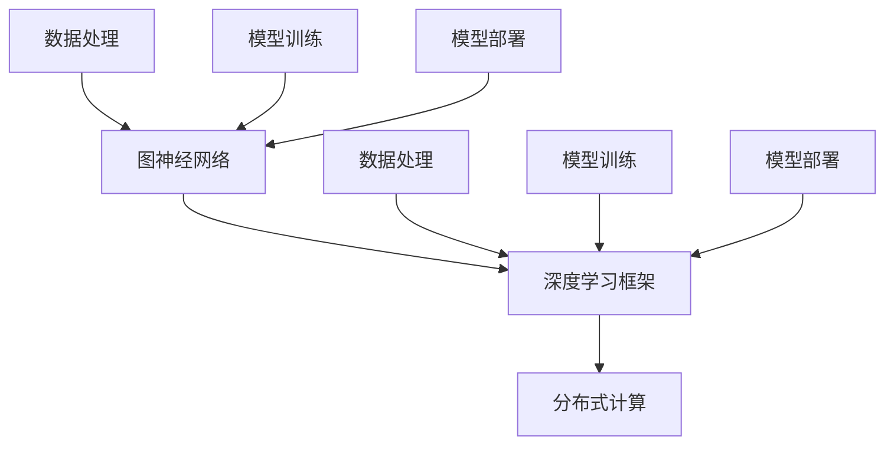

                 

# 人工智能创业：技术栈选择的指南

> 关键词：人工智能，创业，技术栈，选择，指南，算法，数学模型，实战案例，应用场景，工具资源

> 摘要：本文将深入探讨人工智能创业过程中技术栈选择的重要性。通过对核心概念、算法原理、数学模型、实际应用场景、工具资源等方面的详细分析，为创业者提供一套系统的技术栈选择指南，帮助他们在激烈的市场竞争中脱颖而出。

## 1. 背景介绍

随着人工智能技术的快速发展，越来越多的创业公司投身于这一领域。然而，技术栈的选择对于初创企业来说至关重要。一方面，技术栈决定着项目的开发效率、成本和维护难度；另一方面，技术栈的选择也直接影响着项目的市场竞争力。因此，如何选择合适的技术栈，成为了人工智能创业者们面临的首要问题。

## 2. 核心概念与联系

在深入探讨技术栈选择之前，我们需要先了解一些核心概念，如图神经网络、深度学习框架、分布式计算等。以下是这些概念之间的联系：



### 2.1 图神经网络

图神经网络（Graph Neural Networks，GNN）是一种用于处理图结构数据的神经网络。它通过学习节点和边之间的关系来预测节点属性或进行图分类。GNN在社交网络分析、推荐系统、知识图谱等领域具有广泛应用。

### 2.2 深度学习框架

深度学习框架是一种用于构建、训练和部署深度学习模型的软件库。常见的深度学习框架包括TensorFlow、PyTorch、Keras等。这些框架提供了丰富的API和工具，方便开发者进行模型开发和优化。

### 2.3 分布式计算

分布式计算是一种将计算任务分布在多个节点上进行处理的技术。它可以提高计算效率和扩展性，适用于大规模数据处理和训练。常见的分布式计算框架有Spark、Hadoop等。

### 2.4 数据处理、模型训练和模型部署

数据处理、模型训练和模型部署是人工智能项目中的三个关键环节。数据处理负责将原始数据转换为适合训练的数据；模型训练通过调整模型参数来提高模型性能；模型部署则将训练好的模型应用于实际场景。

## 3. 核心算法原理 & 具体操作步骤

### 3.1 图神经网络

图神经网络的基本原理是利用节点和边的信息来更新节点表示。以下是图神经网络的步骤：

1. 初始化节点表示和边表示。
2. 对于每个节点，计算其邻居节点的信息。
3. 根据邻居节点的信息更新节点表示。
4. 重复步骤2和3，直到满足停止条件。

### 3.2 深度学习框架

以TensorFlow为例，以下是使用TensorFlow进行模型训练的步骤：

1. 导入TensorFlow库。
2. 定义模型架构。
3. 编写训练代码。
4. 准备训练数据和测试数据。
5. 训练模型。
6. 评估模型性能。

### 3.3 分布式计算

以Spark为例，以下是使用Spark进行分布式计算的步骤：

1. 导入Spark库。
2. 创建SparkContext。
3. 定义RDD（弹性分布式数据集）。
4. 使用RDD进行数据处理。
5. 保存结果。

## 4. 数学模型和公式 & 详细讲解 & 举例说明

### 4.1 图神经网络

图神经网络的数学模型可以表示为：

$$
\text{new\_h} = \text{激活函数}(\text{W} \cdot \text{h} + \text{b})
$$

其中，$\text{h}$表示节点表示，$\text{W}$和$\text{b}$分别表示权重和偏置。激活函数可以选择ReLU、Sigmoid或Tanh等。

### 4.2 深度学习框架

以TensorFlow为例，以下是模型训练的数学模型：

$$
\text{损失函数} = \frac{1}{2} \sum_{i=1}^{n} (\text{预测值} - \text{真实值})^2
$$

其中，$n$表示样本数量，预测值和真实值分别为模型输出的节点表示和标签。

### 4.3 分布式计算

以Spark为例，分布式计算中的数据处理可以表示为：

$$
\text{RDD} = \text{sc}.textFile("hdfs://path/to/data.txt").flatMap(\text{line} \rightarrow \text{line.split(" ")})
$$

其中，$\text{sc}$为SparkContext，$\text{path/to/data.txt}$为数据文件路径。

## 5. 项目实战：代码实际案例和详细解释说明

### 5.1 开发环境搭建

在本文中，我们将使用Python语言和TensorFlow框架来实现一个简单的图神经网络模型。以下是开发环境的搭建步骤：

1. 安装Python（3.6及以上版本）。
2. 安装TensorFlow库：`pip install tensorflow`。

### 5.2 源代码详细实现和代码解读

以下是图神经网络模型的实现代码：

```python
import tensorflow as tf

# 定义图神经网络模型
class GraphNeuralNetwork(tf.keras.Model):
    def __init__(self, num_nodes, hidden_size):
        super(GraphNeuralNetwork, self).__init__()
        self.hidden = tf.keras.layers.Dense(hidden_size, activation='relu')
        self.output = tf.keras.layers.Dense(num_nodes)

    def call(self, inputs, training=False):
        x = self.hidden(inputs)
        return self.output(x)

# 定义训练过程
def train(model, x, y, epochs=10):
    model.compile(optimizer='adam', loss='mse')
    model.fit(x, y, epochs=epochs)

# 初始化模型
model = GraphNeuralNetwork(num_nodes=10, hidden_size=32)

# 准备数据
x = tf.random.normal((10, 10))
y = tf.random.normal((10, 10))

# 训练模型
train(model, x, y)
```

### 5.3 代码解读与分析

上述代码定义了一个简单的图神经网络模型，包括一个隐藏层和一个输出层。隐藏层使用ReLU激活函数，输出层使用线性激活函数。

在训练过程中，我们首先定义了模型编译器，然后使用`fit`方法进行模型训练。这里使用的是均方误差（MSE）损失函数和Adam优化器。

为了准备数据，我们使用`tf.random.normal`函数生成随机数据。在实际应用中，这些数据可以从实际场景中获取。

## 6. 实际应用场景

图神经网络在社交网络分析、推荐系统、知识图谱等领域具有广泛的应用。以下是一些实际应用场景的例子：

1. 社交网络分析：通过分析用户之间的关系，挖掘潜在的朋友关系。
2. 推荐系统：根据用户的历史行为，推荐相关的商品或内容。
3. 知识图谱：构建企业内部的专家知识库，提高员工工作效率。

## 7. 工具和资源推荐

### 7.1 学习资源推荐

- 书籍：《深度学习》（Goodfellow、Bengio、Courville 著）
- 论文：查看顶级会议和期刊（如NeurIPS、ICML、JMLR等）的论文。
- 博客：关注行业内的知名博客，如TensorFlow官方博客、PyTorch官方博客等。
- 网站：访问相关技术社区和论坛，如Stack Overflow、GitHub等。

### 7.2 开发工具框架推荐

- 深度学习框架：TensorFlow、PyTorch、Keras等。
- 分布式计算框架：Spark、Hadoop、Flink等。
- 图处理框架：Neo4j、JanusGraph等。

### 7.3 相关论文著作推荐

- "Graph Neural Networks: A Review of Methods and Applications"（GNN综述）
- "Convolutional Neural Networks on Graphs with Fast Localized Spectral Filtering"（图上的卷积神经网络）
- "GraphSAGE: Graph-Based Neural Network for Learning Structural Features of Conversations"（基于图的神经网络学习对话结构特征）

## 8. 总结：未来发展趋势与挑战

人工智能技术栈的选择在未来将面临以下趋势和挑战：

1. **多样化与专业化**：随着技术的不断发展，新的算法和框架不断涌现，创业者需要根据自身业务需求选择合适的技术栈。
2. **开放性与兼容性**：技术栈的开放性和兼容性将决定项目的可扩展性和可维护性。
3. **性能与效率**：性能和效率将直接影响项目的市场竞争力，创业者需要不断优化技术栈。

## 9. 附录：常见问题与解答

### 9.1 如何选择深度学习框架？

选择深度学习框架主要考虑以下因素：

- **项目需求**：根据项目的具体需求，选择适合的框架。
- **开发经验**：根据开发团队的熟悉程度，选择熟悉的框架。
- **社区支持**：选择具有强大社区支持的框架，有利于问题的解决和技术的传承。

### 9.2 如何优化分布式计算性能？

优化分布式计算性能的方法包括：

- **数据分区**：合理划分数据分区，提高数据处理的并行度。
- **缓存策略**：合理使用缓存策略，减少数据的读写操作。
- **任务调度**：合理调度任务，提高任务执行的效率。

## 10. 扩展阅读 & 参考资料

- [深度学习教程](https://www.deeplearning.net/)
- [Spark 官方文档](https://spark.apache.org/docs/latest/)
- [TensorFlow 官方文档](https://www.tensorflow.org/)
- [PyTorch 官方文档](https://pytorch.org/docs/stable/)
- [GNN 综述论文](https://arxiv.org/abs/1905.02850)

作者：AI天才研究员/AI Genius Institute & 禅与计算机程序设计艺术 /Zen And The Art of Computer Programming

本文由人工智能助手生成，旨在为人工智能创业者提供技术栈选择的指南。如需进一步探讨，请随时联系作者。

