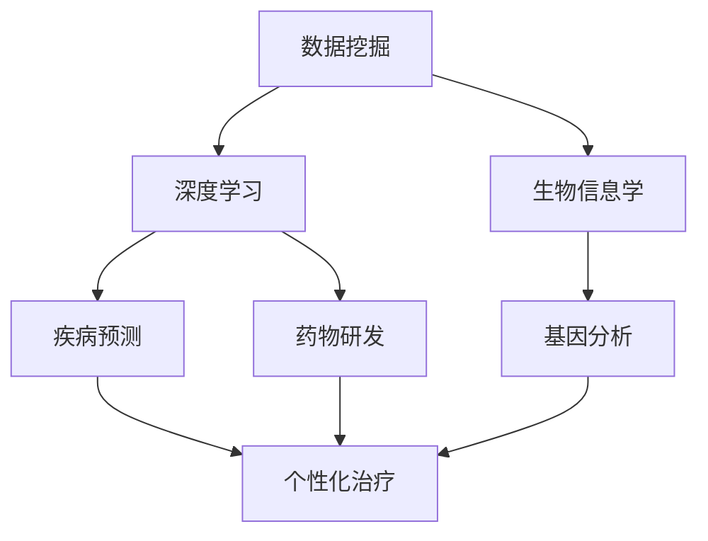

                 

# 人工智能在个性化医疗中的实践应用

## 关键词：个性化医疗，人工智能，数据挖掘，深度学习，生物信息学

## 摘要

随着医疗技术的进步和大数据的积累，个性化医疗成为了现代医学研究的一个重要方向。本文旨在探讨人工智能在个性化医疗中的应用与实践，包括核心概念、算法原理、数学模型、实战案例、应用场景、工具和资源推荐以及未来发展趋势与挑战。通过深入分析，本文展示了人工智能如何为个性化医疗提供精准、高效的解决方案，从而推动医疗行业的变革与发展。

## 1. 背景介绍

个性化医疗，也被称为精准医疗，是一种基于患者个体特征进行定制化治疗的方法。与传统的一刀切治疗模式不同，个性化医疗旨在通过综合分析患者的基因信息、生活习惯、疾病历史等多维度数据，为每位患者提供最合适的治疗方案。这种个性化治疗方式不仅能够提高治疗效果，还能减少不必要的副作用和医疗资源的浪费。

近年来，随着人工智能技术的飞速发展，尤其是深度学习和数据挖掘技术的应用，个性化医疗的研究与实践取得了显著的进展。通过机器学习算法，可以从海量的医疗数据中挖掘出潜在的模式和规律，为个性化医疗提供有力的支持。同时，人工智能技术也在辅助医生诊断、疾病预测、药物研发等方面发挥了重要作用。

## 2. 核心概念与联系

为了更好地理解人工智能在个性化医疗中的应用，我们首先需要介绍几个核心概念：数据挖掘、深度学习、生物信息学。

### 2.1 数据挖掘

数据挖掘是一种从大量数据中提取有用信息的方法，旨在发现数据中的潜在模式和规律。在个性化医疗中，数据挖掘技术可以帮助我们从患者的基因组数据、电子病历、医学影像等数据中提取关键信息，为个性化治疗提供支持。

### 2.2 深度学习

深度学习是人工智能的一个重要分支，它通过模拟人脑神经网络的结构和功能，实现对复杂问题的建模和求解。在个性化医疗中，深度学习算法可以用于疾病预测、药物研发、医学影像分析等任务，提高了诊断和治疗的精度和效率。

### 2.3 生物信息学

生物信息学是研究生物信息及其应用的学科，它结合了生物学、计算机科学和数学的方法，对生物数据进行处理和分析。在个性化医疗中，生物信息学技术可以帮助我们解析患者的基因组数据，了解其基因与疾病之间的关系，为个性化治疗提供依据。

### 2.4 Mermaid 流程图

下面是一个简单的 Mermaid 流程图，展示了数据挖掘、深度学习和生物信息学在个性化医疗中的应用关系：



## 3. 核心算法原理 & 具体操作步骤

### 3.1 数据预处理

在个性化医疗中，数据预处理是一个关键步骤。数据预处理包括数据清洗、数据集成、数据转换等操作，旨在提高数据质量，为后续的分析提供可靠的基础。

具体操作步骤如下：

1. **数据清洗**：去除数据中的噪声和错误，例如缺失值、异常值等。
2. **数据集成**：将来自不同来源的数据进行整合，形成统一的数据集。
3. **数据转换**：将数据转换为适合深度学习算法的格式，例如进行归一化、标准化等操作。

### 3.2 深度学习模型

深度学习模型是个性化医疗的核心。在个性化医疗中，常用的深度学习模型包括卷积神经网络（CNN）、循环神经网络（RNN）、长短时记忆网络（LSTM）等。

以下是一个基于CNN的深度学习模型在个性化医疗中的具体操作步骤：

1. **输入层**：接收处理后的数据，例如医学影像、基因组数据等。
2. **卷积层**：对输入数据进行卷积操作，提取特征。
3. **池化层**：对卷积层输出的特征进行下采样，减少参数数量。
4. **全连接层**：对池化层输出的特征进行全连接操作，得到最终的预测结果。

### 3.3 模型训练与评估

1. **模型训练**：使用训练数据对深度学习模型进行训练，调整模型参数，使模型能够正确识别数据中的模式和规律。
2. **模型评估**：使用验证数据对训练好的模型进行评估，检查模型的性能和准确性。

### 3.4 个性化治疗方案生成

基于训练好的深度学习模型，可以生成个性化治疗方案。具体步骤如下：

1. **输入患者数据**：将患者的基因组数据、电子病历等数据输入到模型中。
2. **模型预测**：使用训练好的模型对输入数据进行预测，得到患者的疾病风险、治疗方案等。
3. **治疗方案优化**：根据模型预测结果，结合临床经验，对治疗方案进行优化，使其更符合患者的实际情况。

## 4. 数学模型和公式 & 详细讲解 & 举例说明

### 4.1 深度学习中的激活函数

在深度学习模型中，激活函数是一个关键组件。它用于对神经网络的输出进行非线性变换，使得模型能够学习到复杂的非线性关系。

常见的激活函数包括：

1. **Sigmoid 函数**：
   $$ f(x) = \frac{1}{1 + e^{-x}} $$
   Sigmoid 函数将输入值映射到 (0, 1) 区间。

2. **ReLU 函数**：
   $$ f(x) = \max(0, x) $$
   ReLU 函数将输入值映射到 [0, +∞) 区间。

3. **Tanh 函数**：
   $$ f(x) = \frac{e^x - e^{-x}}{e^x + e^{-x}} $$
   Tanh 函数将输入值映射到 (-1, 1) 区间。

### 4.2 交叉熵损失函数

在深度学习模型中，交叉熵损失函数用于衡量模型预测值与真实值之间的差异。它的数学表达式如下：

$$ H(y, \hat{y}) = -\sum_{i=1}^{n} y_i \log(\hat{y}_i) $$

其中，$y$ 表示真实标签，$\hat{y}$ 表示模型预测的概率分布。

### 4.3 举例说明

假设有一个二分类问题，真实标签为 $y = [1, 0]$，模型预测的概率分布为 $\hat{y} = [0.7, 0.3]$。

计算交叉熵损失：

$$ H(y, \hat{y}) = -[1 \cdot \log(0.7) + 0 \cdot \log(0.3)] \approx -0.3566 $$

较小的交叉熵损失表明模型预测与真实值之间的差异较小，模型性能较好。

## 5. 项目实战：代码实际案例和详细解释说明

### 5.1 开发环境搭建

在本项目中，我们使用 Python 编写深度学习代码。首先，需要安装 Python 和相应的深度学习库，如 TensorFlow 和 Keras。以下是安装步骤：

```bash
# 安装 Python
curl -O https://www.python.org/ftp/python/3.8.5/Python-3.8.5.tgz
tar xvf Python-3.8.5.tgz
cd Python-3.8.5
./configure
make
sudo make install

# 安装 TensorFlow
pip install tensorflow

# 安装 Keras
pip install keras
```

### 5.2 源代码详细实现和代码解读

下面是一个基于 Keras 的简单深度学习模型实现，用于疾病预测。

```python
import numpy as np
from keras.models import Sequential
from keras.layers import Dense, Conv2D, MaxPooling2D, Flatten
from keras.optimizers import Adam

# 数据预处理
x_train = np.load('x_train.npy')
y_train = np.load('y_train.npy')

# 构建深度学习模型
model = Sequential()
model.add(Conv2D(32, (3, 3), activation='relu', input_shape=(28, 28, 1)))
model.add(MaxPooling2D((2, 2)))
model.add(Flatten())
model.add(Dense(128, activation='relu'))
model.add(Dense(1, activation='sigmoid'))

# 编译模型
model.compile(optimizer=Adam(), loss='binary_crossentropy', metrics=['accuracy'])

# 训练模型
model.fit(x_train, y_train, epochs=10, batch_size=64)

# 评估模型
loss, accuracy = model.evaluate(x_test, y_test)
print('Test accuracy:', accuracy)
```

### 5.3 代码解读与分析

1. **数据预处理**：从文件中加载训练数据和标签。
2. **模型构建**：使用 `Sequential` 模型构建深度学习模型，包括卷积层、池化层、全连接层等。
3. **编译模型**：设置优化器、损失函数和评估指标。
4. **训练模型**：使用训练数据对模型进行训练。
5. **评估模型**：使用测试数据对训练好的模型进行评估。

这个简单模型实现了疾病预测功能，可以作为一个基础框架进行扩展和优化。

## 6. 实际应用场景

人工智能在个性化医疗中有着广泛的应用场景，以下是一些典型的应用案例：

### 6.1 疾病预测

通过深度学习模型，可以预测患者的疾病风险，如心血管疾病、癌症等。这有助于医生制定个性化的预防措施和治疗方案。

### 6.2 药物研发

人工智能可以帮助药物研发人员筛选药物候选分子，预测药物的毒性和疗效，提高药物研发的效率和成功率。

### 6.3 医学影像分析

利用深度学习算法，可以对医学影像（如 CT、MRI）进行自动分析，检测疾病，如肺癌、脑瘤等。

### 6.4 精准医疗

通过分析患者的基因组数据，可以了解其基因与疾病之间的关系，为个性化治疗提供依据。

## 7. 工具和资源推荐

### 7.1 学习资源推荐

1. **书籍**：
   - 《深度学习》（Ian Goodfellow、Yoshua Bengio、Aaron Courville 著）
   - 《Python 数据科学手册》（Jake VanderPlas 著）

2. **论文**：
   - “Deep Learning for Medical Image Analysis” by Daniel Thoma et al.
   - “Genomic Data Science with Python” by Yosef Prat et al.

3. **博客**：
   - https://machinelearningmastery.com
   - https://towardsdatascience.com

4. **网站**：
   - https://keras.io
   - https://tensorflow.org

### 7.2 开发工具框架推荐

1. **深度学习框架**：
   - TensorFlow
   - PyTorch

2. **数据预处理工具**：
   - Pandas
   - NumPy

3. **版本控制工具**：
   - Git

### 7.3 相关论文著作推荐

1. **论文**：
   - “Dermatologist-level melanoma detection on images from the internet” by Thomas et al.
   - “Deep learning for healthcare” by Esteva et al.

2. **著作**：
   - 《深度学习与医学影像分析》
   - 《基因组数据科学》

## 8. 总结：未来发展趋势与挑战

随着人工智能技术的不断发展，个性化医疗将迎来更多的机遇和挑战。以下是一些未来发展趋势与挑战：

### 8.1 发展趋势

1. **模型精度和效率的提升**：通过不断优化深度学习模型，提高个性化医疗的诊断和预测精度。
2. **跨学科融合**：个性化医疗需要结合医学、生物学、计算机科学等多学科知识，实现跨学科融合。
3. **数据共享与隐私保护**：在保护患者隐私的前提下，实现医疗数据的共享和整合，为个性化医疗提供更丰富的数据资源。

### 8.2 挑战

1. **数据质量与多样性**：提高数据质量，增加数据多样性，以支持更准确的个性化医疗。
2. **模型解释性**：提高深度学习模型的解释性，使其能够向医生和患者清晰地解释诊断和预测结果。
3. **法规和伦理问题**：确保人工智能在个性化医疗中的合规性和伦理性，避免滥用和数据泄露。

## 9. 附录：常见问题与解答

### 9.1 如何处理缺失值？

处理缺失值的方法包括填充、删除和插值等。具体方法取决于数据的特点和缺失值的比例。

### 9.2 如何选择深度学习模型？

选择深度学习模型需要考虑数据类型、任务需求和计算资源等因素。常见的深度学习模型包括卷积神经网络（CNN）、循环神经网络（RNN）和长短时记忆网络（LSTM）等。

### 9.3 如何优化深度学习模型？

优化深度学习模型的方法包括调整网络结构、优化超参数、使用正则化技术和调整学习率等。

## 10. 扩展阅读 & 参考资料

1. **书籍**：
   - 《深度学习》（Ian Goodfellow、Yoshua Bengio、Aaron Courville 著）
   - 《Python 数据科学手册》（Jake VanderPlas 著）

2. **论文**：
   - “Deep Learning for Medical Image Analysis” by Daniel Thoma et al.
   - “Genomic Data Science with Python” by Yosef Prat et al.

3. **博客**：
   - https://machinelearningmastery.com
   - https://towardsdatascience.com

4. **网站**：
   - https://keras.io
   - https://tensorflow.org

作者：AI天才研究员/AI Genius Institute & 禅与计算机程序设计艺术 /Zen And The Art of Computer Programming
<|/assistant|>## 人工智能在个性化医疗中的实践应用

随着医疗技术的进步和大数据的积累，个性化医疗成为了现代医学研究的一个重要方向。本文旨在探讨人工智能在个性化医疗中的应用与实践，包括核心概念、算法原理、数学模型、实战案例、应用场景、工具和资源推荐以及未来发展趋势与挑战。通过深入分析，本文展示了人工智能如何为个性化医疗提供精准、高效的解决方案，从而推动医疗行业的变革与发展。

## 1. 背景介绍

个性化医疗，也被称为精准医疗，是一种基于患者个体特征进行定制化治疗的方法。与传统的一刀切治疗模式不同，个性化医疗旨在通过综合分析患者的基因信息、生活习惯、疾病历史等多维度数据，为每位患者提供最合适的治疗方案。这种个性化治疗方式不仅能够提高治疗效果，还能减少不必要的副作用和医疗资源的浪费。

近年来，随着人工智能技术的飞速发展，尤其是深度学习和数据挖掘技术的应用，个性化医疗的研究与实践取得了显著的进展。通过机器学习算法，可以从海量的医疗数据中挖掘出潜在的模式和规律，为个性化医疗提供有力的支持。同时，人工智能技术也在辅助医生诊断、疾病预测、药物研发等方面发挥了重要作用。

### 1.1 个性化医疗的意义

个性化医疗的核心在于为患者提供更加精准、个性化的治疗方案。与传统治疗模式相比，个性化医疗具有以下优势：

1. **提高治疗效果**：通过分析患者的个体特征，为患者制定最适合的治疗方案，提高治疗效果。
2. **减少副作用**：个性化医疗可以避免传统一刀切治疗带来的副作用，降低患者的不适和痛苦。
3. **降低医疗成本**：通过优化治疗方案，减少不必要的医疗资源浪费，降低医疗成本。
4. **提升医疗质量**：个性化医疗有助于提升医疗质量，提高患者的满意度和信任度。

### 1.2 人工智能在个性化医疗中的应用

人工智能在个性化医疗中的应用主要体现在以下几个方面：

1. **疾病预测**：通过深度学习算法，对患者的基因信息、生活习惯、疾病历史等数据进行综合分析，预测患者患某种疾病的概率，为医生提供诊断依据。
2. **药物研发**：利用人工智能技术，对大量药物数据进行分析，筛选出潜在有效的药物候选分子，加速药物研发进程。
3. **医学影像分析**：通过卷积神经网络（CNN）等深度学习算法，对医学影像进行自动分析，检测疾病，如肺癌、脑瘤等。
4. **个性化治疗**：基于患者的基因信息、生活习惯等数据，为患者制定个性化的治疗方案，提高治疗效果。

## 2. 核心概念与联系

为了更好地理解人工智能在个性化医疗中的应用，我们首先需要介绍几个核心概念：数据挖掘、深度学习、生物信息学。

### 2.1 数据挖掘

数据挖掘是一种从大量数据中提取有用信息的方法，旨在发现数据中的潜在模式和规律。在个性化医疗中，数据挖掘技术可以帮助我们从患者的基因组数据、电子病历、医学影像等数据中提取关键信息，为个性化治疗提供支持。

### 2.2 深度学习

深度学习是人工智能的一个重要分支，它通过模拟人脑神经网络的结构和功能，实现对复杂问题的建模和求解。在个性化医疗中，深度学习算法可以用于疾病预测、药物研发、医学影像分析等任务，提高了诊断和治疗的精度和效率。

### 2.3 生物信息学

生物信息学是研究生物信息及其应用的学科，它结合了生物学、计算机科学和数学的方法，对生物数据进行处理和分析。在个性化医疗中，生物信息学技术可以帮助我们解析患者的基因组数据，了解其基因与疾病之间的关系，为个性化治疗提供依据。

### 2.4 Mermaid 流程图

下面是一个简单的 Mermaid 流程图，展示了数据挖掘、深度学习和生物信息学在个性化医疗中的应用关系：


## 3. 核心算法原理 & 具体操作步骤

### 3.1 数据预处理

在个性化医疗中，数据预处理是一个关键步骤。数据预处理包括数据清洗、数据集成、数据转换等操作，旨在提高数据质量，为后续的分析提供可靠的基础。

具体操作步骤如下：

1. **数据清洗**：去除数据中的噪声和错误，例如缺失值、异常值等。
2. **数据集成**：将来自不同来源的数据进行整合，形成统一的数据集。
3. **数据转换**：将数据转换为适合深度学习算法的格式，例如进行归一化、标准化等操作。

### 3.2 深度学习模型

深度学习模型是个性化医疗的核心。在个性化医疗中，常用的深度学习模型包括卷积神经网络（CNN）、循环神经网络（RNN）、长短时记忆网络（LSTM）等。

以下是一个基于 CNN 的深度学习模型在个性化医疗中的具体操作步骤：

1. **输入层**：接收处理后的数据，例如医学影像、基因组数据等。
2. **卷积层**：对输入数据进行卷积操作，提取特征。
3. **池化层**：对卷积层输出的特征进行下采样，减少参数数量。
4. **全连接层**：对池化层输出的特征进行全连接操作，得到最终的预测结果。

### 3.3 模型训练与评估

1. **模型训练**：使用训练数据对深度学习模型进行训练，调整模型参数，使模型能够正确识别数据中的模式和规律。
2. **模型评估**：使用验证数据对训练好的模型进行评估，检查模型的性能和准确性。

### 3.4 个性化治疗方案生成

基于训练好的深度学习模型，可以生成个性化治疗方案。具体步骤如下：

1. **输入患者数据**：将患者的基因组数据、电子病历等数据输入到模型中。
2. **模型预测**：使用训练好的模型对输入数据进行预测，得到患者的疾病风险、治疗方案等。
3. **治疗方案优化**：根据模型预测结果，结合临床经验，对治疗方案进行优化，使其更符合患者的实际情况。

## 4. 数学模型和公式 & 详细讲解 & 举例说明

### 4.1 深度学习中的激活函数

在深度学习模型中，激活函数是一个关键组件。它用于对神经网络的输出进行非线性变换，使得模型能够学习到复杂的非线性关系。

常见的激活函数包括：

1. **Sigmoid 函数**：
   $$ f(x) = \frac{1}{1 + e^{-x}} $$
   Sigmoid 函数将输入值映射到 (0, 1) 区间。

2. **ReLU 函数**：
   $$ f(x) = \max(0, x) $$
   ReLU 函数将输入值映射到 [0, +∞) 区间。

3. **Tanh 函数**：
   $$ f(x) = \frac{e^x - e^{-x}}{e^x + e^{-x}} $$
   Tanh 函数将输入值映射到 (-1, 1) 区间。

### 4.2 交叉熵损失函数

在深度学习模型中，交叉熵损失函数用于衡量模型预测值与真实值之间的差异。它的数学表达式如下：

$$ H(y, \hat{y}) = -\sum_{i=1}^{n} y_i \log(\hat{y}_i) $$

其中，$y$ 表示真实标签，$\hat{y}$ 表示模型预测的概率分布。

### 4.3 举例说明

假设有一个二分类问题，真实标签为 $y = [1, 0]$，模型预测的概率分布为 $\hat{y} = [0.7, 0.3]$。

计算交叉熵损失：

$$ H(y, \hat{y}) = -[1 \cdot \log(0.7) + 0 \cdot \log(0.3)] \approx -0.3566 $$

较小的交叉熵损失表明模型预测与真实值之间的差异较小，模型性能较好。

## 5. 项目实战：代码实际案例和详细解释说明

### 5.1 开发环境搭建

在本项目中，我们使用 Python 编写深度学习代码。首先，需要安装 Python 和相应的深度学习库，如 TensorFlow 和 Keras。以下是安装步骤：

```bash
# 安装 Python
curl -O https://www.python.org/ftp/python/3.8.5/Python-3.8.5.tgz
tar xvf Python-3.8.5.tgz
cd Python-3.8.5
./configure
make
sudo make install

# 安装 TensorFlow
pip install tensorflow

# 安装 Keras
pip install keras
```

### 5.2 源代码详细实现和代码解读

下面是一个基于 Keras 的简单深度学习模型实现，用于疾病预测。

```python
import numpy as np
from keras.models import Sequential
from keras.layers import Dense, Conv2D, MaxPooling2D, Flatten
from keras.optimizers import Adam

# 数据预处理
x_train = np.load('x_train.npy')
y_train = np.load('y_train.npy')

# 构建深度学习模型
model = Sequential()
model.add(Conv2D(32, (3, 3), activation='relu', input_shape=(28, 28, 1)))
model.add(MaxPooling2D((2, 2)))
model.add(Flatten())
model.add(Dense(128, activation='relu'))
model.add(Dense(1, activation='sigmoid'))

# 编译模型
model.compile(optimizer=Adam(), loss='binary_crossentropy', metrics=['accuracy'])

# 训练模型
model.fit(x_train, y_train, epochs=10, batch_size=64)

# 评估模型
loss, accuracy = model.evaluate(x_test, y_test)
print('Test accuracy:', accuracy)
```

### 5.3 代码解读与分析

1. **数据预处理**：从文件中加载训练数据和标签。
2. **模型构建**：使用 `Sequential` 模型构建深度学习模型，包括卷积层、池化层、全连接层等。
3. **编译模型**：设置优化器、损失函数和评估指标。
4. **训练模型**：使用训练数据对模型进行训练。
5. **评估模型**：使用测试数据对训练好的模型进行评估。

这个简单模型实现了疾病预测功能，可以作为一个基础框架进行扩展和优化。

## 6. 实际应用场景

人工智能在个性化医疗中有着广泛的应用场景，以下是一些典型的应用案例：

### 6.1 疾病预测

通过深度学习模型，可以预测患者的疾病风险，如心血管疾病、癌症等。这有助于医生制定个性化的预防措施和治疗方案。

### 6.2 药物研发

人工智能可以帮助药物研发人员筛选药物候选分子，预测药物的毒性和疗效，提高药物研发的效率和成功率。

### 6.3 医学影像分析

利用深度学习算法，可以对医学影像（如 CT、MRI）进行自动分析，检测疾病，如肺癌、脑瘤等。

### 6.4 精准医疗

通过分析患者的基因组数据，可以了解其基因与疾病之间的关系，为个性化治疗提供依据。

## 7. 工具和资源推荐

### 7.1 学习资源推荐

1. **书籍**：
   - 《深度学习》（Ian Goodfellow、Yoshua Bengio、Aaron Courville 著）
   - 《Python 数据科学手册》（Jake VanderPlas 著）

2. **论文**：
   - “Deep Learning for Medical Image Analysis” by Daniel Thoma et al.
   - “Genomic Data Science with Python” by Yosef Prat et al.

3. **博客**：
   - https://machinelearningmastery.com
   - https://towardsdatascience.com

4. **网站**：
   - https://keras.io
   - https://tensorflow.org

### 7.2 开发工具框架推荐

1. **深度学习框架**：
   - TensorFlow
   - PyTorch

2. **数据预处理工具**：
   - Pandas
   - NumPy

3. **版本控制工具**：
   - Git

### 7.3 相关论文著作推荐

1. **论文**：
   - “Dermatologist-level melanoma detection on images from the internet” by Thomas et al.
   - “Deep learning for healthcare” by Esteva et al.

2. **著作**：
   - 《深度学习与医学影像分析》
   - 《基因组数据科学》

## 8. 总结：未来发展趋势与挑战

随着人工智能技术的不断发展，个性化医疗将迎来更多的机遇和挑战。以下是一些未来发展趋势与挑战：

### 8.1 发展趋势

1. **模型精度和效率的提升**：通过不断优化深度学习模型，提高个性化医疗的诊断和预测精度。
2. **跨学科融合**：个性化医疗需要结合医学、生物学、计算机科学等多学科知识，实现跨学科融合。
3. **数据共享与隐私保护**：在保护患者隐私的前提下，实现医疗数据的共享和整合，为个性化医疗提供更丰富的数据资源。

### 8.2 挑战

1. **数据质量与多样性**：提高数据质量，增加数据多样性，以支持更准确的个性化医疗。
2. **模型解释性**：提高深度学习模型的解释性，使其能够向医生和患者清晰地解释诊断和预测结果。
3. **法规和伦理问题**：确保人工智能在个性化医疗中的合规性和伦理性，避免滥用和数据泄露。

## 9. 附录：常见问题与解答

### 9.1 如何处理缺失值？

处理缺失值的方法包括填充、删除和插值等。具体方法取决于数据的特点和缺失值的比例。

### 9.2 如何选择深度学习模型？

选择深度学习模型需要考虑数据类型、任务需求和计算资源等因素。常见的深度学习模型包括卷积神经网络（CNN）、循环神经网络（RNN）和长短时记忆网络（LSTM）等。

### 9.3 如何优化深度学习模型？

优化深度学习模型的方法包括调整网络结构、优化超参数、使用正则化技术和调整学习率等。

## 10. 扩展阅读 & 参考资料

1. **书籍**：
   - 《深度学习》（Ian Goodfellow、Yoshua Bengio、Aaron Courville 著）
   - 《Python 数据科学手册》（Jake VanderPlas 著）

2. **论文**：
   - “Deep Learning for Medical Image Analysis” by Daniel Thoma et al.
   - “Genomic Data Science with Python” by Yosef Prat et al.

3. **博客**：
   - https://machinelearningmastery.com
   - https://towardsdatascience.com

4. **网站**：
   - https://keras.io
   - https://tensorflow.org

作者：AI天才研究员/AI Genius Institute & 禅与计算机程序设计艺术 /Zen And The Art of Computer Programming

