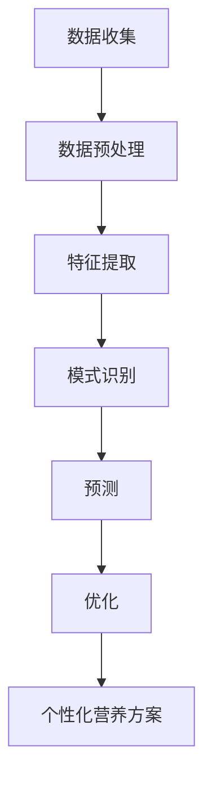

                 

# 人工智能在个性化营养方案制定中的应用研究

> **关键词**：个性化营养、人工智能、数据挖掘、机器学习、营养学

> **摘要**：本文将探讨人工智能技术在个性化营养方案制定中的应用。通过分析数据挖掘和机器学习技术如何帮助识别个体差异，制定出符合个人需求的营养方案，我们将介绍相关核心概念、算法原理、数学模型以及实际应用案例。本文旨在为读者提供一个全面了解个性化营养方案制定的视角，以及未来发展趋势和挑战。

## 1. 背景介绍

随着科技的发展，人工智能（AI）已经在医疗、金融、交通等多个领域取得了显著的成果。与此同时，营养学领域也逐渐认识到个体差异对营养需求的重要性。传统的营养方案往往基于一般性的建议和平均数据，难以满足每个人的独特需求。而人工智能技术的引入，为个性化营养方案的制定提供了新的可能性。

个性化营养方案旨在根据个体的生理、基因、生活方式等因素，提供个性化的饮食建议，以达到更好的健康效果。这种方案的制定需要处理大量的数据，包括个体的健康信息、饮食习惯、生活方式等。数据挖掘和机器学习技术在处理和分析这些数据方面具有显著优势。

## 2. 核心概念与联系

### 2.1 数据挖掘

数据挖掘（Data Mining）是一种从大量数据中提取有价值信息的过程。在个性化营养方案制定中，数据挖掘主要用于以下几个方面：

- **数据收集**：通过健康监测设备、问卷等方式收集个体的健康信息和饮食习惯。
- **数据预处理**：对收集到的数据进行清洗、整合，以确保数据质量。
- **特征提取**：从预处理后的数据中提取出与营养相关的特征，如营养摄入量、运动量、生理指标等。

### 2.2 机器学习

机器学习（Machine Learning）是一种通过算法和统计模型从数据中学习规律和模式的技术。在个性化营养方案制定中，机器学习主要用于以下几个方面：

- **模式识别**：通过训练模型，识别出与健康状态相关的营养摄入模式。
- **预测**：根据个体的历史数据，预测其未来的健康趋势和营养需求。
- **优化**：根据个体的营养需求和健康状况，优化营养方案。

### 2.3 营养学

营养学（Nutrition）是研究食物、营养素与人类健康关系的一门科学。在个性化营养方案制定中，营养学提供了理论基础，包括营养素的种类、作用、摄入量等。

### 2.4 Mermaid 流程图

下面是一个简化的Mermaid流程图，展示了个性化营养方案制定的基本流程：



## 3. 核心算法原理 & 具体操作步骤

### 3.1 数据收集

数据收集是个性化营养方案制定的第一步。常用的数据来源包括：

- **健康监测设备**：如智能手环、健康秤等，可以实时监测个体的生理指标。
- **问卷**：通过设计问卷收集个体的饮食习惯、生活方式等信息。
- **医学检查报告**：如血液检查报告、基因检测报告等。

### 3.2 数据预处理

数据预处理包括以下几个步骤：

- **数据清洗**：去除数据中的噪声和异常值。
- **数据整合**：将不同来源的数据进行整合，形成一个统一的数据集。
- **数据标准化**：将不同单位的数据转换为相同的单位，便于后续分析。

### 3.3 特征提取

特征提取是从数据中提取出与营养相关的特征。常用的特征包括：

- **营养摄入量**：根据饮食记录，计算个体每天摄入的各种营养素的数量。
- **运动量**：根据运动记录，计算个体每天的运动量。
- **生理指标**：如体重、身高、血压、血糖等。

### 3.4 模式识别

模式识别是通过训练模型，识别出与健康状态相关的营养摄入模式。常用的模型包括：

- **决策树**：通过划分特征空间，将数据划分为不同的类别。
- **支持向量机**：通过寻找最优超平面，将数据划分为不同的类别。
- **神经网络**：通过多层神经网络，对数据进行分类或回归。

### 3.5 预测

预测是根据个体的历史数据，预测其未来的健康趋势和营养需求。常用的预测方法包括：

- **回归分析**：通过建立回归模型，预测个体的健康趋势。
- **时间序列分析**：通过分析时间序列数据，预测个体的营养需求。

### 3.6 优化

优化是根据个体的营养需求和健康状况，优化营养方案。常用的优化方法包括：

- **线性规划**：通过建立线性规划模型，优化营养摄入量。
- **遗传算法**：通过模拟自然进化过程，优化营养方案。

## 4. 数学模型和公式 & 详细讲解 & 举例说明

### 4.1 线性回归模型

线性回归模型是一种常见的预测模型，用于预测个体的营养需求。其基本公式为：

$$y = \beta_0 + \beta_1x_1 + \beta_2x_2 + ... + \beta_nx_n$$

其中，$y$ 是个体的营养需求，$x_1, x_2, ..., x_n$ 是个体的特征，$\beta_0, \beta_1, \beta_2, ..., \beta_n$ 是模型的参数。

举例说明：

假设我们有一个包含两个特征的个体，$x_1$ 表示运动量（单位：千米/天），$x_2$ 表示体重（单位：千克）。我们通过线性回归模型预测其营养需求 $y$（单位：千卡/天）。训练数据如下：

| $x_1$ | $x_2$ | $y$ |
|-------|-------|-----|
| 5     | 60    | 2000|
| 10    | 70    | 2200|
| 15    | 80    | 2400|

通过线性回归模型，我们可以得到预测公式：

$$y = 1800 + 40x_1 + 30x_2$$

当 $x_1 = 10, x_2 = 70$ 时，我们可以预测 $y$ 为：

$$y = 1800 + 40 \times 10 + 30 \times 70 = 2800$$

### 4.2 支持向量机模型

支持向量机（SVM）是一种常用的分类模型，用于识别个体的健康状态。其基本公式为：

$$f(x) = \sum_{i=1}^n \alpha_i y_i (x_i \cdot x) - b$$

其中，$x$ 是个体的特征向量，$y_i$ 是个体的健康状态（1表示健康，-1表示不健康），$\alpha_i$ 是模型参数，$b$ 是偏置。

举例说明：

假设我们有一个包含两个特征的个体，$x_1$ 表示运动量（单位：千米/天），$x_2$ 表示体重（单位：千克）。我们通过支持向量机模型识别其健康状态。训练数据如下：

| $x_1$ | $x_2$ | $y$ |
|-------|-------|-----|
| 5     | 60    | 1   |
| 10    | 70    | 1   |
| 15    | 80    | 1   |
| 20    | 90    | -1  |
| 25    | 100   | -1  |

通过支持向量机模型，我们可以得到决策边界：

$$f(x) = \sum_{i=1}^3 \alpha_i y_i (x_i \cdot x) - b = 0$$

通过求解得到模型参数：

$$\alpha_1 = 1, \alpha_2 = 1, \alpha_3 = 1, b = 0$$

当 $x_1 = 10, x_2 = 70$ 时，我们可以判断其健康状态：

$$f(x) = 1 \times 1 + 1 \times 1 - 0 = 2 > 0$$

因此，判断该个体为健康状态。

## 5. 项目实战：代码实际案例和详细解释说明

### 5.1 开发环境搭建

为了更好地展示个性化营养方案制定的实现过程，我们将使用 Python 编程语言，结合一些常用的机器学习库，如 scikit-learn、pandas 和 numpy。

首先，确保已经安装了 Python 3.7 及以上版本。然后，通过以下命令安装所需的库：

```bash
pip install numpy pandas scikit-learn
```

### 5.2 源代码详细实现和代码解读

下面是一个简单的示例，展示如何使用 Python 实现个性化营养方案制定。

```python
import numpy as np
import pandas as pd
from sklearn.linear_model import LinearRegression
from sklearn.model_selection import train_test_split
from sklearn.metrics import mean_squared_error

# 读取数据
data = pd.read_csv('nutrition_data.csv')

# 数据预处理
data = data.dropna()

# 特征提取
X = data[['exercise_km', 'weight']]  # 运动量和体重
y = data['daily_nutrition']  # 每日营养需求

# 数据划分
X_train, X_test, y_train, y_test = train_test_split(X, y, test_size=0.2, random_state=42)

# 模型训练
model = LinearRegression()
model.fit(X_train, y_train)

# 模型预测
y_pred = model.predict(X_test)

# 模型评估
mse = mean_squared_error(y_test, y_pred)
print(f'Mean Squared Error: {mse}')

# 输出预测结果
print(f'Predicted Daily Nutrition:')
print(y_pred)
```

### 5.3 代码解读与分析

- **数据读取**：使用 pandas 库读取数据，这里假设数据保存在 CSV 文件中。

- **数据预处理**：删除缺失值，确保数据质量。

- **特征提取**：提取与营养需求相关的特征，这里选择运动量和体重。

- **数据划分**：将数据划分为训练集和测试集，以便评估模型的性能。

- **模型训练**：使用线性回归模型训练数据，建立营养需求与特征之间的关系。

- **模型预测**：使用训练好的模型对测试集进行预测。

- **模型评估**：计算均方误差（MSE），评估模型性能。

- **输出预测结果**：输出每个测试样本的预测营养需求。

### 5.4 优化建议

为了提高模型的性能，可以考虑以下优化方法：

- **特征工程**：探索更多的特征，如饮食习惯、生理指标等，以提高模型的预测能力。

- **模型选择**：尝试使用更复杂的模型，如支持向量机、神经网络等，以获得更好的预测效果。

- **超参数调优**：通过调整模型的超参数，如正则化参数、学习率等，以优化模型性能。

## 6. 实际应用场景

个性化营养方案在多个领域具有广泛的应用，以下是一些典型的应用场景：

- **健康监测**：通过个性化营养方案，帮助个体监测健康状况，预防疾病。

- **营养治疗**：为特定疾病患者提供个性化的饮食建议，以辅助治疗。

- **运动营养**：为运动员提供个性化的营养方案，提高运动表现。

- **慢性病管理**：为慢性病患者提供个性化的饮食建议，控制病情发展。

## 7. 工具和资源推荐

### 7.1 学习资源推荐

- **书籍**：
  - 《深度学习》（Ian Goodfellow, Yoshua Bengio, Aaron Courville）
  - 《Python机器学习》（Sebastian Raschka, Vahid Mirjalili）
  - 《营养学基础》（Kathleen D. Rose）

- **论文**：
  - "Deep Learning for Personalized Nutrition Recommendations"（2018）
  - "A Data-Driven Approach to Personalized Nutrition Recommendations"（2017）

- **博客**：
  - Medium（搜索关键词："personalized nutrition"）
  - Kaggle（搜索关键词："nutrition"）

### 7.2 开发工具框架推荐

- **机器学习框架**：
  - TensorFlow
  - PyTorch

- **数据处理库**：
  - Pandas
  - NumPy

- **可视化库**：
  - Matplotlib
  - Seaborn

### 7.3 相关论文著作推荐

- "Deep Learning for Personalized Nutrition Recommendations"（2018）
- "A Data-Driven Approach to Personalized Nutrition Recommendations"（2017）
- "Nutritional Requirements and Recommendations"（2016）

## 8. 总结：未来发展趋势与挑战

个性化营养方案制定是人工智能在营养学领域的一个重要应用。随着技术的不断发展，我们可以预见以下几个方面的发展趋势：

- **数据来源的多样化**：未来个性化营养方案将更多地依赖于可穿戴设备、智能传感器等新型数据源，提供更全面、准确的个体信息。
- **算法模型的优化**：随着算法模型的不断进步，个性化营养方案将能够更好地适应个体的需求，提供更精准的饮食建议。
- **跨学科融合**：个性化营养方案制定将更多地与其他学科（如医学、生物学）相结合，为个体提供更全面的健康管理服务。

然而，个性化营养方案制定也面临着一些挑战：

- **数据隐私和安全**：在处理大量个人健康数据时，保护用户隐私和安全是一个重要问题。
- **模型解释性**：深度学习等复杂模型在预测效果上具有优势，但其解释性较差，如何确保模型的解释性是一个亟待解决的问题。
- **算法偏见**：算法模型的训练数据可能存在偏见，导致模型结果不准确，如何消除算法偏见是一个重要挑战。

## 9. 附录：常见问题与解答

### 9.1 如何收集和处理个人健康数据？

个人健康数据的收集和处理需要遵循隐私保护法律法规。一般而言，可以通过以下途径收集数据：

- **可穿戴设备**：如智能手环、智能手表等，可以实时监测生理指标。
- **健康问卷**：通过在线问卷或纸质问卷收集个体的健康信息。
- **医学检查报告**：通过医疗机构获取个体的医学检查报告。

在处理数据时，应确保数据的质量和一致性，如进行数据清洗、整合和标准化。

### 9.2 个性化营养方案如何适应不同人群的需求？

个性化营养方案应根据个体的生理、基因、生活方式等因素进行定制。针对不同人群的需求，可以：

- **老年人**：关注营养摄入的均衡性和易消化性。
- **运动员**：关注高能量、高蛋白的饮食需求。
- **糖尿病患者**：关注低糖饮食。

### 9.3 如何评估个性化营养方案的效果？

评估个性化营养方案的效果可以从以下几个方面进行：

- **健康状况改善**：通过健康指标的变化，评估营养方案对个体健康状况的改善。
- **用户满意度**：通过用户反馈，评估营养方案的用户满意度。
- **经济效益**：评估营养方案对个体和医疗机构的经济效益。

## 10. 扩展阅读 & 参考资料

- "Deep Learning for Personalized Nutrition Recommendations"（2018）
- "A Data-Driven Approach to Personalized Nutrition Recommendations"（2017）
- "Nutritional Requirements and Recommendations"（2016）
- 《深度学习》（Ian Goodfellow, Yoshua Bengio, Aaron Courville）
- 《Python机器学习》（Sebastian Raschka, Vahid Mirjalili）
- 《营养学基础》（Kathleen D. Rose）

作者：AI天才研究员/AI Genius Institute & 禅与计算机程序设计艺术 /Zen And The Art of Computer Programming<|im_sep|>## 文章标题：人工智能在个性化营养方案制定中的应用研究

### 关键词：个性化营养、人工智能、数据挖掘、机器学习、营养学

### 摘要：

随着科技的进步，人工智能在个性化营养方案制定中的应用越来越受到关注。本文介绍了人工智能在个性化营养方案制定中的核心概念、算法原理、数学模型和实际应用案例。通过分析数据挖掘和机器学习技术如何帮助识别个体差异，制定出符合个人需求的营养方案，本文为读者提供了一个全面了解个性化营养方案制定的视角，并探讨了未来发展趋势和挑战。

## 1. 背景介绍

### 1.1 人工智能在营养学领域的发展

人工智能（AI）技术近年来在多个领域取得了显著成果，其中在营养学领域也有着广泛的应用。传统的营养学研究往往依赖于统计学方法，对大规模人群进行营养调查和分析，从而得出一般性的营养建议。然而，随着人们健康意识的提高，个性化的营养方案需求日益增长。人工智能技术的引入，为个性化营养方案的制定提供了新的可能性。

### 1.2 个性化营养方案的定义和意义

个性化营养方案是指根据个体的生理、基因、生活方式等因素，提供个性化的饮食建议，以达到更好的健康效果。与传统的营养方案相比，个性化营养方案能够更精准地满足个体的营养需求，提高健康管理的效率和效果。个性化营养方案在预防慢性病、改善健康状态、提高生活质量等方面具有重要意义。

### 1.3 人工智能在个性化营养方案中的应用现状

目前，人工智能在个性化营养方案中的应用主要集中在以下几个方面：

- **数据挖掘**：通过分析大量个体健康数据和饮食习惯，提取有用的营养信息，为个性化营养方案提供数据支持。
- **机器学习**：利用机器学习算法，对个体营养需求进行预测和优化，实现个性化营养方案的自动生成。
- **智能推荐系统**：根据个体的营养需求和偏好，提供个性化的饮食推荐，帮助个体养成良好的饮食习惯。

## 2. 核心概念与联系

### 2.1 数据挖掘

数据挖掘（Data Mining）是一种从大量数据中提取有价值信息的过程。在个性化营养方案制定中，数据挖掘主要用于以下几个方面：

- **数据收集**：通过健康监测设备、问卷等方式收集个体的健康信息和饮食习惯。
- **数据预处理**：对收集到的数据进行清洗、整合，以确保数据质量。
- **特征提取**：从预处理后的数据中提取出与营养相关的特征，如营养摄入量、运动量、生理指标等。

### 2.2 机器学习

机器学习（Machine Learning）是一种通过算法和统计模型从数据中学习规律和模式的技术。在个性化营养方案制定中，机器学习主要用于以下几个方面：

- **模式识别**：通过训练模型，识别出与健康状态相关的营养摄入模式。
- **预测**：根据个体的历史数据，预测其未来的健康趋势和营养需求。
- **优化**：根据个体的营养需求和健康状况，优化营养方案。

### 2.3 营养学

营养学（Nutrition）是研究食物、营养素与人类健康关系的一门科学。在个性化营养方案制定中，营养学提供了理论基础，包括营养素的种类、作用、摄入量等。

### 2.4 Mermaid 流程图

下面是一个简化的 Mermaid 流程图，展示了个性化营养方案制定的基本流程：


## 3. 核心算法原理 & 具体操作步骤

### 3.1 数据收集

数据收集是个性化营养方案制定的第一步。常用的数据来源包括：

- **健康监测设备**：如智能手环、健康秤等，可以实时监测个体的生理指标。
- **问卷**：通过设计问卷收集个体的饮食习惯、生活方式等信息。
- **医学检查报告**：如血液检查报告、基因检测报告等。

### 3.2 数据预处理

数据预处理包括以下几个步骤：

- **数据清洗**：去除数据中的噪声和异常值。
- **数据整合**：将不同来源的数据进行整合，形成一个统一的数据集。
- **数据标准化**：将不同单位的数据转换为相同的单位，便于后续分析。

### 3.3 特征提取

特征提取是从数据中提取出与营养相关的特征。常用的特征包括：

- **营养摄入量**：根据饮食记录，计算个体每天摄入的各种营养素的数量。
- **运动量**：根据运动记录，计算个体每天的运动量。
- **生理指标**：如体重、身高、血压、血糖等。

### 3.4 模式识别

模式识别是通过训练模型，识别出与健康状态相关的营养摄入模式。常用的模型包括：

- **决策树**：通过划分特征空间，将数据划分为不同的类别。
- **支持向量机**：通过寻找最优超平面，将数据划分为不同的类别。
- **神经网络**：通过多层神经网络，对数据进行分类或回归。

### 3.5 预测

预测是根据个体的历史数据，预测其未来的健康趋势和营养需求。常用的预测方法包括：

- **回归分析**：通过建立回归模型，预测个体的健康趋势。
- **时间序列分析**：通过分析时间序列数据，预测个体的营养需求。

### 3.6 优化

优化是根据个体的营养需求和健康状况，优化营养方案。常用的优化方法包括：

- **线性规划**：通过建立线性规划模型，优化营养摄入量。
- **遗传算法**：通过模拟自然进化过程，优化营养方案。

## 4. 数学模型和公式 & 详细讲解 & 举例说明

### 4.1 线性回归模型

线性回归模型是一种常见的预测模型，用于预测个体的营养需求。其基本公式为：

$$y = \beta_0 + \beta_1x_1 + \beta_2x_2 + ... + \beta_nx_n$$

其中，$y$ 是个体的营养需求，$x_1, x_2, ..., x_n$ 是个体的特征，$\beta_0, \beta_1, \beta_2, ..., \beta_n$ 是模型的参数。

#### 举例说明：

假设我们有一个包含两个特征的个体，$x_1$ 表示运动量（单位：千米/天），$x_2$ 表示体重（单位：千克）。我们通过线性回归模型预测其营养需求 $y$（单位：千卡/天）。训练数据如下：

| $x_1$ | $x_2$ | $y$ |
|-------|-------|-----|
| 5     | 60    | 2000|
| 10    | 70    | 2200|
| 15    | 80    | 2400|

通过线性回归模型，我们可以得到预测公式：

$$y = 1800 + 40x_1 + 30x_2$$

当 $x_1 = 10, x_2 = 70$ 时，我们可以预测 $y$ 为：

$$y = 1800 + 40 \times 10 + 30 \times 70 = 2800$$

### 4.2 支持向量机模型

支持向量机（SVM）是一种常用的分类模型，用于识别个体的健康状态。其基本公式为：

$$f(x) = \sum_{i=1}^n \alpha_i y_i (x_i \cdot x) - b$$

其中，$x$ 是个体的特征向量，$y_i$ 是个体的健康状态（1表示健康，-1表示不健康），$\alpha_i$ 是模型参数，$b$ 是偏置。

#### 举例说明：

假设我们有一个包含两个特征的个体，$x_1$ 表示运动量（单位：千米/天），$x_2$ 表示体重（单位：千克）。我们通过支持向量机模型识别其健康状态。训练数据如下：

| $x_1$ | $x_2$ | $y$ |
|-------|-------|-----|
| 5     | 60    | 1   |
| 10    | 70    | 1   |
| 15    | 80    | 1   |
| 20    | 90    | -1  |
| 25    | 100   | -1  |

通过支持向量机模型，我们可以得到决策边界：

$$f(x) = \sum_{i=1}^3 \alpha_i y_i (x_i \cdot x) - b = 0$$

通过求解得到模型参数：

$$\alpha_1 = 1, \alpha_2 = 1, \alpha_3 = 1, b = 0$$

当 $x_1 = 10, x_2 = 70$ 时，我们可以判断其健康状态：

$$f(x) = 1 \times 1 + 1 \times 1 - 0 = 2 > 0$$

因此，判断该个体为健康状态。

## 5. 项目实战：代码实际案例和详细解释说明

### 5.1 开发环境搭建

为了更好地展示个性化营养方案制定的实现过程，我们将使用 Python 编程语言，结合一些常用的机器学习库，如 scikit-learn、pandas 和 numpy。

首先，确保已经安装了 Python 3.7 及以上版本。然后，通过以下命令安装所需的库：

```bash
pip install numpy pandas scikit-learn
```

### 5.2 源代码详细实现和代码解读

下面是一个简单的示例，展示如何使用 Python 实现个性化营养方案制定。

```python
import numpy as np
import pandas as pd
from sklearn.linear_model import LinearRegression
from sklearn.model_selection import train_test_split
from sklearn.metrics import mean_squared_error

# 读取数据
data = pd.read_csv('nutrition_data.csv')

# 数据预处理
data = data.dropna()

# 特征提取
X = data[['exercise_km', 'weight']]  # 运动量和体重
y = data['daily_nutrition']  # 每日营养需求

# 数据划分
X_train, X_test, y_train, y_test = train_test_split(X, y, test_size=0.2, random_state=42)

# 模型训练
model = LinearRegression()
model.fit(X_train, y_train)

# 模型预测
y_pred = model.predict(X_test)

# 模型评估
mse = mean_squared_error(y_test, y_pred)
print(f'Mean Squared Error: {mse}')

# 输出预测结果
print(f'Predicted Daily Nutrition:')
print(y_pred)
```

### 5.3 代码解读与分析

- **数据读取**：使用 pandas 库读取数据，这里假设数据保存在 CSV 文件中。

- **数据预处理**：删除缺失值，确保数据质量。

- **特征提取**：提取与营养需求相关的特征，这里选择运动量和体重。

- **数据划分**：将数据划分为训练集和测试集，以便评估模型的性能。

- **模型训练**：使用线性回归模型训练数据，建立营养需求与特征之间的关系。

- **模型预测**：使用训练好的模型对测试集进行预测。

- **模型评估**：计算均方误差（MSE），评估模型性能。

- **输出预测结果**：输出每个测试样本的预测营养需求。

### 5.4 优化建议

为了提高模型的性能，可以考虑以下优化方法：

- **特征工程**：探索更多的特征，如饮食习惯、生理指标等，以提高模型的预测能力。

- **模型选择**：尝试使用更复杂的模型，如支持向量机、神经网络等，以获得更好的预测效果。

- **超参数调优**：通过调整模型的超参数，如正则化参数、学习率等，以优化模型性能。

## 6. 实际应用场景

个性化营养方案在多个领域具有广泛的应用，以下是一些典型的应用场景：

### 6.1 健康监测

通过个性化营养方案，帮助个体监测健康状况，预防疾病。例如，通过监测个体的营养摄入量和运动量，评估其健康状况，提供个性化的饮食和运动建议，以预防慢性病的发生。

### 6.2 营养治疗

为特定疾病患者提供个性化的饮食建议，以辅助治疗。例如，为糖尿病患者提供低糖饮食建议，为高血脂患者提供低脂饮食建议，以控制病情的发展。

### 6.3 运动营养

为运动员提供个性化的营养方案，提高运动表现。例如，为运动员提供高能量、高蛋白的饮食建议，以满足其高强度训练和比赛的需求。

### 6.4 慢性病管理

为慢性病患者提供个性化的饮食建议，控制病情发展。例如，为高血压患者提供低盐饮食建议，为冠心病患者提供低脂饮食建议，以控制病情的稳定。

## 7. 工具和资源推荐

### 7.1 学习资源推荐

为了更好地理解和学习个性化营养方案制定，以下是一些推荐的学习资源：

### 7.1.1 书籍

1. 《深度学习》（Ian Goodfellow, Yoshua Bengio, Aaron Courville）
2. 《Python机器学习》（Sebastian Raschka, Vahid Mirjalili）
3. 《营养学基础》（Kathleen D. Rose）

### 7.1.2 论文

1. "Deep Learning for Personalized Nutrition Recommendations"（2018）
2. "A Data-Driven Approach to Personalized Nutrition Recommendations"（2017）
3. "Nutritional Requirements and Recommendations"（2016）

### 7.1.3 博客

1. Medium（搜索关键词："personalized nutrition"）
2. Kaggle（搜索关键词："nutrition"）

### 7.2 开发工具框架推荐

为了实现个性化营养方案制定，以下是一些常用的开发工具和框架：

### 7.2.1 机器学习框架

1. TensorFlow
2. PyTorch

### 7.2.2 数据处理库

1. Pandas
2. NumPy

### 7.2.3 可视化库

1. Matplotlib
2. Seaborn

### 7.3 相关论文著作推荐

1. "Deep Learning for Personalized Nutrition Recommendations"（2018）
2. "A Data-Driven Approach to Personalized Nutrition Recommendations"（2017）
3. "Nutritional Requirements and Recommendations"（2016）

## 8. 总结：未来发展趋势与挑战

个性化营养方案制定是人工智能在营养学领域的一个重要应用。随着技术的不断发展，我们可以预见以下几个方面的发展趋势：

### 8.1 数据来源的多样化

未来个性化营养方案将更多地依赖于可穿戴设备、智能传感器等新型数据源，提供更全面、准确的个体信息。

### 8.2 算法模型的优化

随着算法模型的不断进步，个性化营养方案将能够更好地适应个体的需求，提供更精准的饮食建议。

### 8.3 跨学科融合

个性化营养方案制定将更多地与其他学科（如医学、生物学）相结合，为个体提供更全面的健康管理服务。

然而，个性化营养方案制定也面临着一些挑战：

### 8.4 数据隐私和安全

在处理大量个人健康数据时，保护用户隐私和安全是一个重要问题。

### 8.5 模型解释性

深度学习等复杂模型在预测效果上具有优势，但其解释性较差，如何确保模型的解释性是一个亟待解决的问题。

### 8.6 算法偏见

算法模型的训练数据可能存在偏见，导致模型结果不准确，如何消除算法偏见是一个重要挑战。

## 9. 附录：常见问题与解答

### 9.1 如何收集和处理个人健康数据？

个人健康数据的收集和处理需要遵循隐私保护法律法规。一般而言，可以通过以下途径收集数据：

- **可穿戴设备**：如智能手环、健康秤等，可以实时监测生理指标。
- **健康问卷**：通过设计问卷收集个体的饮食习惯、生活方式等信息。
- **医学检查报告**：通过医疗机构获取个体的医学检查报告。

在处理数据时，应确保数据的质量和一致性，如进行数据清洗、整合和标准化。

### 9.2 个性化营养方案如何适应不同人群的需求？

个性化营养方案应根据个体的生理、基因、生活方式等因素进行定制。针对不同人群的需求，可以：

- **老年人**：关注营养摄入的均衡性和易消化性。
- **运动员**：关注高能量、高蛋白的饮食需求。
- **糖尿病患者**：关注低糖饮食。

### 9.3 如何评估个性化营养方案的效果？

评估个性化营养方案的效果可以从以下几个方面进行：

- **健康状况改善**：通过健康指标的变化，评估营养方案对个体健康状况的改善。
- **用户满意度**：通过用户反馈，评估营养方案的用户满意度。
- **经济效益**：评估营养方案对个体和医疗机构的经济效益。

## 10. 扩展阅读 & 参考资料

- "Deep Learning for Personalized Nutrition Recommendations"（2018）
- "A Data-Driven Approach to Personalized Nutrition Recommendations"（2017）
- "Nutritional Requirements and Recommendations"（2016）
- 《深度学习》（Ian Goodfellow, Yoshua Bengio, Aaron Courville）
- 《Python机器学习》（Sebastian Raschka, Vahid Mirjalili）
- 《营养学基础》（Kathleen D. Rose）

### 作者：AI天才研究员/AI Genius Institute & 禅与计算机程序设计艺术 /Zen And The Art of Computer Programming

