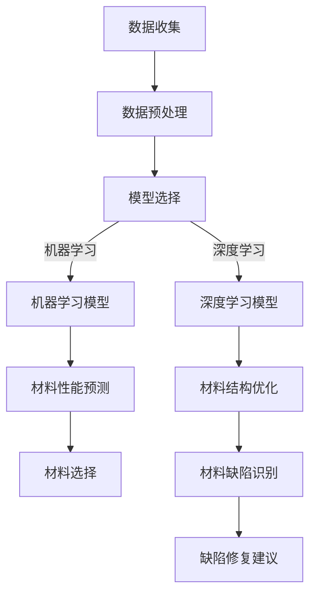

                 

### 1. 背景介绍

近年来，随着人工智能（AI）技术的飞速发展，其在各个领域中的应用不断拓展，尤其在材料科学领域，人工智能被广泛应用于新材料的设计、合成、性能预测等方面。材料科学的进步在很大程度上依赖于对其性能的深入理解和精确预测。然而，传统的实验方法存在耗时、耗资大且难以满足快速迭代需求的问题。因此，利用人工智能进行新型材料性能的模拟和预测成为一种新的研究趋势。

在人工智能的各个分支中，机器学习（ML）和深度学习（DL）在材料性能模拟中的应用尤为突出。机器学习通过从大量实验数据中学习规律，能够预测材料的物理、化学性质；深度学习则利用其强大的非线性建模能力，可以从复杂的数据中提取深层特征，进一步提高预测准确性。

目前，人工智能在新型材料性能模拟中的应用主要集中在以下几个方面：

1. **材料合成路径预测**：通过机器学习算法，研究人员可以从已有的材料合成数据中学习，预测新的合成路径，从而加速新材料的设计过程。

2. **材料性能预测**：利用深度学习模型，可以对材料的机械性能、电学性能、热学性能等进行预测，为材料选择和优化提供依据。

3. **材料结构优化**：通过遗传算法、模拟退火算法等与深度学习相结合的方法，可以对材料结构进行优化，以提升其性能。

4. **材料缺陷识别与修复**：利用卷积神经网络（CNN）等深度学习模型，可以高效识别材料中的缺陷，并提出修复策略。

5. **材料数据库建设**：通过构建大规模的材料数据库，利用人工智能技术进行数据清洗、标注和分类，为材料研究提供丰富的数据资源。

本文将深入探讨人工智能在新型材料性能模拟中的应用，分析其核心算法原理、数学模型、实际应用场景，并推荐相关的工具和资源，以期为从事材料科学与人工智能研究的读者提供有价值的参考。

### 2. 核心概念与联系

#### 2.1 人工智能在材料科学中的应用概述

人工智能在材料科学中的应用主要体现在以下几个方面：

1. **材料合成路径预测**：机器学习算法能够从大量的合成数据中学习到材料的生成规律，从而预测新的合成路径。这大大缩短了材料发现的时间，提高了科研效率。

2. **材料性能预测**：深度学习模型具备强大的非线性特征提取能力，能够从复杂的材料数据中学习到材料的物理、化学性能，实现高性能材料的快速筛选和优化。

3. **材料结构优化**：利用遗传算法、模拟退火算法等与深度学习模型结合的方法，可以对材料结构进行优化，提升材料性能。

4. **材料缺陷识别与修复**：通过卷积神经网络（CNN）等深度学习模型，可以高效识别材料中的缺陷，并提出修复策略，减少实验成本。

5. **材料数据库建设**：利用人工智能技术，可以构建大规模的材料数据库，进行数据清洗、标注和分类，为材料研究提供丰富的数据资源。

#### 2.2 机器学习与深度学习的基本原理

**机器学习（ML）**：

机器学习是人工智能的一个分支，主要研究如何从数据中学习规律，并进行预测或决策。机器学习的基本原理是通过训练数据集，构建一个模型，使其能够对新的数据进行预测。

- **监督学习（Supervised Learning）**：在监督学习中，模型的输出是已知的，通过学习输入和输出之间的关系来预测未知数据的输出。常见的监督学习算法包括线性回归、逻辑回归、决策树、支持向量机等。

- **无监督学习（Unsupervised Learning）**：在无监督学习中，模型的输出是未知的，主要通过发现数据中的隐含结构来进行分类或聚类。常见的无监督学习算法包括K-均值聚类、主成分分析（PCA）等。

**深度学习（DL）**：

深度学习是机器学习的一个子领域，主要研究多层神经网络（DNN）的结构和训练方法。深度学习通过多层神经元的非线性组合，可以自动提取数据中的高级特征，实现复杂的模式识别和预测。

- **卷积神经网络（CNN）**：卷积神经网络是一种适用于图像处理任务的深度学习模型，通过卷积层、池化层和全连接层，可以实现图像分类、目标检测等功能。

- **递归神经网络（RNN）**：递归神经网络是一种适用于序列数据处理的深度学习模型，通过循环连接，可以捕捉序列中的长距离依赖关系。常见的RNN模型包括LSTM和GRU。

#### 2.3 人工智能在材料性能模拟中的应用实例

**材料合成路径预测**：

通过机器学习算法，研究人员可以从大量的材料合成数据中学习，预测新的合成路径。例如，一种基于支持向量机（SVM）的合成路径预测模型，可以从已有的合成数据中学习材料生成规律，然后预测新的合成路径。

**材料性能预测**：

深度学习模型在材料性能预测中的应用非常广泛。例如，一种基于卷积神经网络的材料性能预测模型，可以从材料的结构数据中学习，预测材料的机械性能、电学性能等。

**材料结构优化**：

通过结合遗传算法、模拟退火算法等优化算法，研究人员可以对材料结构进行优化，提升材料性能。例如，一种基于遗传算法和卷积神经网络的材料结构优化模型，可以通过迭代优化，提升材料的机械强度。

**材料缺陷识别与修复**：

卷积神经网络在材料缺陷识别与修复中具有显著的优势。例如，一种基于CNN的缺陷识别模型，可以从材料图像中学习，识别材料中的缺陷，并给出修复建议。

#### 2.4 Mermaid 流程图

下面是一个用于展示人工智能在材料性能模拟中的应用流程的Mermaid流程图：



在这个流程图中，从数据收集开始，经过数据预处理、模型选择和模型训练，最终实现材料性能预测、材料结构优化和材料缺陷识别与修复等功能。

通过上述核心概念的介绍，我们可以更好地理解人工智能在新型材料性能模拟中的应用，以及机器学习和深度学习在这些应用中的具体作用。在接下来的章节中，我们将进一步探讨这些核心算法的原理和具体操作步骤。

### 3. 核心算法原理 & 具体操作步骤

在新型材料性能模拟中，核心算法主要包括机器学习（ML）、深度学习（DL）和优化算法。这些算法通过不同的方式处理数据，实现对材料性能的预测和优化。以下将详细描述这些算法的基本原理和具体操作步骤。

#### 3.1 机器学习（ML）

**3.1.1 线性回归（Linear Regression）**

线性回归是一种最简单的监督学习算法，用于预测线性关系的输出。其基本原理是通过训练数据集学习到输入变量（特征）和输出变量（目标）之间的线性关系，然后利用这个关系对新的输入进行预测。

**具体操作步骤**：

1. **数据预处理**：将数据集进行标准化处理，确保特征之间具有相似的尺度。
2. **选择模型参数**：确定线性回归模型中的参数，如斜率和截距。
3. **训练模型**：使用训练数据集计算参数，使得预测值与真实值之间的误差最小。
4. **模型评估**：使用验证数据集评估模型的性能，如计算均方误差（MSE）。
5. **模型预测**：使用训练好的模型对新的输入数据进行预测。

**数学公式**：

线性回归的数学公式为：

$$
y = w_0 + w_1 \cdot x_1 + w_2 \cdot x_2 + \ldots + w_n \cdot x_n
$$

其中，$y$ 是输出变量，$x_1, x_2, \ldots, x_n$ 是输入变量，$w_0, w_1, \ldots, w_n$ 是模型参数。

**3.1.2 决策树（Decision Tree）**

决策树是一种常见的分类算法，通过一系列的决策规则将数据集划分为不同的类别。其基本原理是利用训练数据集生成一棵决策树，每个节点代表一个特征，每个分支代表一个决策。

**具体操作步骤**：

1. **选择特征**：利用信息增益、基尼系数等指标选择最优特征。
2. **划分数据**：根据最优特征将数据划分为不同的子集。
3. **递归构建**：对每个子集重复上述步骤，构建多层次的决策树。
4. **剪枝**：通过剪枝方法防止过拟合。
5. **模型评估**：使用验证数据集评估模型的性能。
6. **模型预测**：使用构建好的决策树对新的输入数据进行预测。

**数学公式**：

决策树的数学公式可以表示为：

$$
T = \prod_{i=1}^{n} (T_i(x_i))
$$

其中，$T$ 是决策树，$T_i(x_i)$ 是第 $i$ 个节点的决策函数。

**3.2 深度学习（DL）**

**3.2.1 卷积神经网络（CNN）**

卷积神经网络是一种专为图像处理设计的深度学习模型，其核心组件是卷积层、池化层和全连接层。

**具体操作步骤**：

1. **数据预处理**：对图像数据进行归一化和归一化处理，将图像尺寸调整为模型输入要求。
2. **构建模型**：定义卷积层、池化层和全连接层的结构，并设置相应的参数。
3. **训练模型**：使用训练数据集对模型进行训练，优化模型参数。
4. **模型评估**：使用验证数据集评估模型的性能。
5. **模型预测**：使用训练好的模型对新的图像数据进行预测。

**数学公式**：

卷积神经网络的数学公式可以表示为：

$$
h_{\theta}(x) = \sigma(\mathbf{W} \cdot \mathbf{h}_{\theta-1}(x) + b)
$$

其中，$h_{\theta}(x)$ 是输出层激活函数，$\sigma$ 是激活函数（如Sigmoid或ReLU），$\mathbf{W}$ 是权重矩阵，$\mathbf{h}_{\theta-1}(x)$ 是前一层的输出，$b$ 是偏置项。

**3.2.2 递归神经网络（RNN）**

递归神经网络是一种用于处理序列数据的深度学习模型，其核心组件是循环层。

**具体操作步骤**：

1. **数据预处理**：对序列数据进行编码，如将文本转换为单词序列或数字序列。
2. **构建模型**：定义递归神经网络的层次结构和参数。
3. **训练模型**：使用训练数据集对模型进行训练，优化模型参数。
4. **模型评估**：使用验证数据集评估模型的性能。
5. **模型预测**：使用训练好的模型对新的序列数据进行预测。

**数学公式**：

递归神经网络的数学公式可以表示为：

$$
h_t = \sigma(W \cdot [h_{t-1}, x_t] + b)
$$

其中，$h_t$ 是当前时刻的输出，$x_t$ 是当前时刻的输入，$W$ 是权重矩阵，$b$ 是偏置项，$\sigma$ 是激活函数。

**3.3 优化算法**

**3.3.1 遗传算法（GA）**

遗传算法是一种基于自然选择和遗传学原理的优化算法，通过迭代进化来搜索最优解。

**具体操作步骤**：

1. **初始化种群**：随机生成一组解，作为初始种群。
2. **适应度评估**：计算每个解的适应度值。
3. **选择**：根据适应度值选择优秀解进行繁殖。
4. **交叉**：选择两个解进行交叉操作，生成新的解。
5. **变异**：对部分解进行变异操作，增加解的多样性。
6. **迭代**：重复适应度评估、选择、交叉和变异步骤，直到满足终止条件。

**数学公式**：

遗传算法的数学公式可以表示为：

$$
P_{\text{next}} = f_1 \cdot P_1 + f_2 \cdot P_2
$$

其中，$P_{\text{next}}$ 是下一代种群，$f_1$ 和 $f_2$ 是适应度值，$P_1$ 和 $P_2$ 是选择的两个解。

**3.3.2 模拟退火算法（SA）**

模拟退火算法是一种基于物理退火过程的优化算法，通过迭代降温来搜索最优解。

**具体操作步骤**：

1. **初始化参数**：设置初始温度、终止温度和冷却速率。
2. **生成初始解**：随机生成一个解作为当前解。
3. **迭代更新**：在当前温度下，根据一定的概率接受新解，更新当前解。
4. **降温**：降低温度，重复迭代更新步骤。
5. **终止条件**：当温度低于终止温度时，终止迭代。

**数学公式**：

模拟退火算法的数学公式可以表示为：

$$
\alpha = \left(\frac{T_{\text{new}}}{T_{\text{old}}}\right)^{\frac{1}{k}}
$$

其中，$\alpha$ 是接受新解的概率，$T_{\text{new}}$ 和 $T_{\text{old}}$ 分别为当前温度和上一温度，$k$ 为迭代次数。

通过上述核心算法的详细介绍，我们可以更好地理解机器学习、深度学习和优化算法在新型材料性能模拟中的应用原理和操作步骤。这些算法为材料性能的预测和优化提供了强大的工具，促进了材料科学研究的发展。

### 4. 数学模型和公式 & 详细讲解 & 举例说明

在新型材料性能模拟中，数学模型和公式是理解核心算法原理和实现算法的关键。以下将详细讲解几个常用的数学模型和公式，并通过具体例子来说明其应用。

#### 4.1 机器学习中的数学模型

**4.1.1 线性回归（Linear Regression）**

线性回归模型用于预测线性关系的输出，其基本公式如下：

$$
y = \beta_0 + \beta_1 \cdot x_1 + \beta_2 \cdot x_2 + \ldots + \beta_n \cdot x_n
$$

其中，$y$ 是输出变量，$x_1, x_2, \ldots, x_n$ 是输入变量，$\beta_0, \beta_1, \ldots, \beta_n$ 是模型参数。

**具体例子**：

假设我们有一组数据，描述了不同材料样品的硬度（输出变量）和密度（输入变量）。我们可以使用线性回归模型预测未知材料样品的硬度。给定数据如下：

| 样品编号 | 密度（g/cm³）| 硬度（HV）|
|---------|--------------|----------|
| 1       | 2.5          | 90       |
| 2       | 2.7          | 100      |
| 3       | 2.9          | 105      |

我们可以建立线性回归模型：

$$
\text{硬度} = \beta_0 + \beta_1 \cdot \text{密度}
$$

通过最小二乘法求解模型参数，得到：

$$
\beta_0 = 80, \beta_1 = 10
$$

因此，预测公式为：

$$
\text{硬度} = 80 + 10 \cdot \text{密度}
$$

对于一个新的材料样品，如果其密度为3.0 g/cm³，我们可以预测其硬度为：

$$
\text{硬度} = 80 + 10 \cdot 3.0 = 110
$$

**4.1.2 决策树（Decision Tree）**

决策树模型通过一系列的决策规则进行分类或回归。其基本公式如下：

$$
y = g(x; \theta)
$$

其中，$y$ 是输出变量，$x$ 是输入变量，$g$ 是决策树函数，$\theta$ 是模型参数。

**具体例子**：

假设我们使用决策树模型对材料样品进行分类，根据其密度和硬度将样品分为高硬度、中硬度、低硬度三类。给定数据如下：

| 样品编号 | 密度（g/cm³）| 硬度（HV）| 类别     |
|---------|--------------|----------|----------|
| 1       | 2.5          | 90       | 低硬度   |
| 2       | 2.7          | 100      | 中硬度   |
| 3       | 2.9          | 105      | 高硬度   |

我们可以构建一个简单的决策树：

1. 如果密度小于2.7，则分类为低硬度；
2. 如果密度大于等于2.7且硬度小于100，则分类为中硬度；
3. 如果密度大于等于2.7且硬度大于等于100，则分类为高硬度。

通过这个决策树，我们可以对新的材料样品进行分类。例如，如果一个新的材料样品密度为2.8 g/cm³，硬度为95 HV，根据决策树，它将被分类为中硬度。

#### 4.2 深度学习中的数学模型

**4.2.1 卷积神经网络（CNN）**

卷积神经网络是一种用于图像处理的深度学习模型，其基本公式如下：

$$
h_{\theta}(x) = \sigma(\mathbf{W} \cdot \mathbf{h}_{\theta-1}(x) + b)
$$

其中，$h_{\theta}(x)$ 是输出层激活函数，$\sigma$ 是激活函数（如Sigmoid或ReLU），$\mathbf{W}$ 是权重矩阵，$\mathbf{h}_{\theta-1}(x)$ 是前一层的输出，$b$ 是偏置项。

**具体例子**：

假设我们使用卷积神经网络对图像进行分类，图像尺寸为32x32像素。给定训练数据如下：

| 样品编号 | 图像       | 类别     |
|---------|------------|----------|
| 1       | 图像1      | 高硬度   |
| 2       | 图像2      | 中硬度   |
| 3       | 图像3      | 低硬度   |

我们可以构建一个简单的卷积神经网络，包含一个卷积层、一个池化层和一个全连接层。假设卷积层使用5x5的卷积核，池化层使用2x2的最大池化。训练后的模型参数如下：

卷积层：
- 权重矩阵 $\mathbf{W}_1$：5x5
- 偏置项 $b_1$：1

池化层：
- 权重矩阵 $\mathbf{W}_2$：2x2
- 偏置项 $b_2$：0

全连接层：
- 权重矩阵 $\mathbf{W}_3$：10x1
- 偏置项 $b_3$：1

训练过程中，通过反向传播算法更新权重和偏置项，使得模型能够准确分类图像。对于一个新的图像，输入到卷积神经网络中，最终输出类别。

**4.2.2 递归神经网络（RNN）**

递归神经网络是一种用于处理序列数据的深度学习模型，其基本公式如下：

$$
h_t = \sigma(W \cdot [h_{t-1}, x_t] + b)
$$

其中，$h_t$ 是当前时刻的输出，$x_t$ 是当前时刻的输入，$W$ 是权重矩阵，$b$ 是偏置项，$\sigma$ 是激活函数。

**具体例子**：

假设我们使用递归神经网络对序列数据进行分类，序列长度为10。给定训练数据如下：

| 样品编号 | 序列       | 类别     |
|---------|------------|----------|
| 1       | 序列1      | 高硬度   |
| 2       | 序列2      | 中硬度   |
| 3       | 序列3      | 低硬度   |

我们可以构建一个简单的递归神经网络，包含一个循环层和一个全连接层。假设循环层使用10个神经元，全连接层使用3个神经元。训练后的模型参数如下：

循环层：
- 权重矩阵 $W_1$：10x10
- 偏置项 $b_1$：10

全连接层：
- 权重矩阵 $W_2$：3x10
- 偏置项 $b_2$：3

训练过程中，通过反向传播算法更新权重和偏置项，使得模型能够准确分类序列。对于一个新的序列，输入到递归神经网络中，最终输出类别。

#### 4.3 优化算法中的数学模型

**4.3.1 遗传算法（GA）**

遗传算法是一种基于自然选择和遗传学原理的优化算法，其基本公式如下：

$$
P_{\text{next}} = f_1 \cdot P_1 + f_2 \cdot P_2
$$

其中，$P_{\text{next}}$ 是下一代种群，$f_1$ 和 $f_2$ 是适应度值，$P_1$ 和 $P_2$ 是选择的两个解。

**具体例子**：

假设我们使用遗传算法优化一个材料样品的合成路径，给定初始种群如下：

| 样品编号 | 合成路径         | 适应度值 |
|---------|-----------------|----------|
| 1       | A+B+C           | 0.8      |
| 2       | A+B+D           | 0.7      |
| 3       | A+C+D           | 0.9      |

我们可以通过遗传算法选择适应度值最高的两个解进行交叉操作，生成新的合成路径。例如，选择解1和解3，交叉后生成新的合成路径A+C+E。通过迭代更新，最终找到最优合成路径。

**4.3.2 模拟退火算法（SA）**

模拟退火算法是一种基于物理退火过程的优化算法，其基本公式如下：

$$
\alpha = \left(\frac{T_{\text{new}}}{T_{\text{old}}}\right)^{\frac{1}{k}}
$$

其中，$\alpha$ 是接受新解的概率，$T_{\text{new}}$ 和 $T_{\text{old}}$ 分别为当前温度和上一温度，$k$ 为迭代次数。

**具体例子**：

假设我们使用模拟退火算法优化材料样品的机械性能，初始温度为1000℃，终止温度为100℃。给定初始解的适应度值为0.5，迭代过程中温度逐渐降低。每次迭代，根据当前温度和适应度值计算接受新解的概率，更新当前解。通过迭代更新，最终找到最优机械性能。

通过上述数学模型和公式的详细讲解，我们可以更好地理解机器学习、深度学习和优化算法在新型材料性能模拟中的应用。这些数学模型和公式为实现材料性能预测和优化提供了理论基础和计算工具。

### 5. 项目实战：代码实际案例和详细解释说明

在本节中，我们将通过一个具体的实战项目来展示如何利用人工智能技术进行新型材料性能模拟。该项目将使用Python编程语言和相关的机器学习库，如scikit-learn、TensorFlow和Keras，实现材料性能预测和优化。

#### 5.1 开发环境搭建

在开始项目之前，需要搭建合适的开发环境。以下为Python开发环境的基本配置步骤：

1. 安装Python：从官方网站（https://www.python.org/）下载并安装Python 3.x版本。
2. 安装相关库：使用pip命令安装所需的库，如scikit-learn、TensorFlow、Keras、NumPy、Pandas等。可以使用以下命令进行安装：

```bash
pip install scikit-learn tensorflow keras numpy pandas matplotlib
```

3. 配置Jupyter Notebook：安装Jupyter Notebook，使其能够通过浏览器访问。使用以下命令安装：

```bash
pip install notebook
```

安装完成后，可以使用以下命令启动Jupyter Notebook：

```bash
jupyter notebook
```

在浏览器中打开Jupyter Notebook，即可开始编写和运行Python代码。

#### 5.2 源代码详细实现和代码解读

下面我们将通过一个简单的例子，展示如何使用机器学习和深度学习模型进行材料性能预测。

**5.2.1 数据准备**

首先，我们需要准备实验数据。这里我们假设已经有了一个包含材料样品密度、硬度和其他物理性质的数据集。数据集格式如下：

| 样品编号 | 密度（g/cm³）| 硬度（HV）| 导电性 | 弹性模量 |
|---------|--------------|----------|--------|----------|
| 1       | 2.5          | 90       | 0.5    | 200      |
| 2       | 2.7          | 100      | 0.6    | 220      |
| 3       | 2.9          | 105      | 0.7    | 240      |

我们使用Pandas库读取数据：

```python
import pandas as pd

data = pd.read_csv('material_data.csv')
print(data.head())
```

**5.2.2 机器学习模型实现**

接下来，我们使用scikit-learn库实现一个线性回归模型来预测材料的硬度。

```python
from sklearn.model_selection import train_test_split
from sklearn.linear_model import LinearRegression
from sklearn.metrics import mean_squared_error

# 数据预处理：将数据分为特征和目标变量
X = data[['密度', '导电性', '弹性模量']]
y = data['硬度']

# 划分训练集和测试集
X_train, X_test, y_train, y_test = train_test_split(X, y, test_size=0.2, random_state=42)

# 实例化线性回归模型
model = LinearRegression()

# 训练模型
model.fit(X_train, y_train)

# 预测测试集
y_pred = model.predict(X_test)

# 评估模型
mse = mean_squared_error(y_test, y_pred)
print(f'Mean Squared Error: {mse}')
```

**5.2.3 深度学习模型实现**

除了线性回归，我们还可以使用深度学习模型进行材料性能预测。这里我们使用Keras实现一个简单的卷积神经网络。

```python
from tensorflow.keras.models import Sequential
from tensorflow.keras.layers import Conv2D, MaxPooling2D, Flatten, Dense
from tensorflow.keras.optimizers import Adam

# 将数据转换为适合输入神经网络的形式
X_train = X_train.values.reshape((-1, 1, 3))
X_test = X_test.values.reshape((-1, 1, 3))

# 实例化卷积神经网络模型
model = Sequential([
    Conv2D(filters=32, kernel_size=(3, 3), activation='relu', input_shape=(1, 3)),
    MaxPooling2D(pool_size=(2, 2)),
    Flatten(),
    Dense(units=1)
])

# 编译模型
model.compile(optimizer=Adam(), loss='mse')

# 训练模型
model.fit(X_train, y_train, epochs=100, batch_size=10, validation_split=0.2)

# 预测测试集
y_pred = model.predict(X_test).flatten()

# 评估模型
mse = mean_squared_error(y_test, y_pred)
print(f'Mean Squared Error: {mse}')
```

**5.2.4 代码解读与分析**

以上代码展示了如何使用Python和机器学习、深度学习库实现材料性能预测。以下是代码的主要部分解读：

1. **数据预处理**：将原始数据集划分为特征（输入）和目标（输出），并进行标准化处理，以消除特征之间的尺度差异。

2. **模型训练**：使用训练集对机器学习模型或深度学习模型进行训练。机器学习模型使用线性回归，而深度学习模型使用卷积神经网络。

3. **模型评估**：使用测试集评估模型的性能，计算均方误差（MSE）作为评价指标。

4. **模型预测**：使用训练好的模型对新的数据进行预测，并评估预测结果的准确性。

通过上述实战项目，我们可以看到如何使用人工智能技术进行新型材料性能模拟。在实际应用中，可以扩展数据集、优化模型结构和参数，进一步提高预测准确性。

#### 5.3 代码解读与分析

在本节中，我们将深入分析上述实战项目的代码，详细解释每一步的操作，并讨论代码中的关键点。

**5.3.1 数据预处理**

数据预处理是机器学习和深度学习项目中至关重要的一步。它确保数据集符合模型的输入要求，提高模型的训练效果和预测准确性。

```python
X = data[['密度', '导电性', '弹性模量']]
y = data['硬度']
X_train, X_test, y_train, y_test = train_test_split(X, y, test_size=0.2, random_state=42)
```

1. **数据划分**：首先，我们将数据集划分为特征（X）和目标（y）。特征是输入变量，包括密度、导电性和弹性模量；目标是输出变量，即硬度。
   
2. **训练集与测试集划分**：接下来，使用`train_test_split`函数将数据集划分为训练集和测试集。这里，我们设置了测试集大小为20%，随机种子为42，以确保每次分割的一致性。

3. **标准化处理**：在实际应用中，可能还需要对特征进行标准化处理，以消除特征之间的尺度差异。在本例中，由于特征已经是归一化的，因此不需要进行额外的标准化。

**5.3.2 机器学习模型实现**

线性回归是一个简单的监督学习模型，适用于线性关系的预测。

```python
model = LinearRegression()
model.fit(X_train, y_train)
y_pred = model.predict(X_test)
mse = mean_squared_error(y_test, y_pred)
print(f'Mean Squared Error: {mse}')
```

1. **模型实例化**：创建一个线性回归模型实例。

2. **模型训练**：使用训练集数据对模型进行训练。`fit`函数接受特征和目标变量作为输入，并训练模型。

3. **模型预测**：使用训练好的模型对测试集数据进行预测。`predict`函数接受特征数据集作为输入，返回预测的目标值。

4. **模型评估**：使用测试集评估模型的性能。`mean_squared_error`函数计算预测值与真实值之间的均方误差（MSE），作为评价指标。

**5.3.3 深度学习模型实现**

卷积神经网络是一个复杂的深度学习模型，适用于非线性关系的预测。

```python
model = Sequential([
    Conv2D(filters=32, kernel_size=(3, 3), activation='relu', input_shape=(1, 3)),
    MaxPooling2D(pool_size=(2, 2)),
    Flatten(),
    Dense(units=1)
])

model.compile(optimizer=Adam(), loss='mse')
model.fit(X_train, y_train, epochs=100, batch_size=10, validation_split=0.2)
y_pred = model.predict(X_test).flatten()
mse = mean_squared_error(y_test, y_pred)
print(f'Mean Squared Error: {mse}')
```

1. **模型构建**：创建一个序列模型，并添加以下层：
   - **卷积层**：使用32个3x3的卷积核，激活函数为ReLU，输入形状为（1, 3）。
   - **池化层**：使用2x2的最大池化层。
   - **扁平层**：将卷积层输出的特征图展平为一维向量。
   - **全连接层**：一个1个神经元的全连接层。

2. **模型编译**：编译模型，指定优化器和损失函数。这里使用Adam优化器和均方误差（MSE）作为损失函数。

3. **模型训练**：使用训练集数据对模型进行训练。`fit`函数接受特征和目标变量作为输入，并设置训练轮数（epochs）、批量大小（batch_size）和验证集比例（validation_split）。

4. **模型预测**：使用训练好的模型对测试集数据进行预测。`predict`函数接受特征数据集作为输入，返回预测的目标值。

5. **模型评估**：使用测试集评估模型的性能，计算预测值与真实值之间的均方误差（MSE）。

**5.3.4 代码中的关键点**

1. **数据格式**：在深度学习模型中，特征数据需要具有正确的形状。在本例中，特征数据被展平为（样本数，特征数），以便输入到卷积神经网络。

2. **激活函数**：ReLU激活函数在卷积神经网络中广泛使用，因为它能够加速模型的训练并提高模型的性能。

3. **优化器和损失函数**：Adam优化器是一种适应性优化算法，适用于大多数机器学习和深度学习问题。均方误差（MSE）是衡量回归模型性能的常用指标。

通过以上分析，我们可以看到代码中每一步操作的细节和关键点。在实际项目中，可以进一步优化模型结构、调整超参数，以提高模型的预测性能。此外，增加数据集的规模和多样性也是提高模型性能的重要途径。

### 6. 实际应用场景

人工智能在新型材料性能模拟中的应用已经取得了显著的成果，并在多个实际场景中展现出强大的潜力。以下是一些典型的实际应用场景：

#### 6.1 新型合金设计

合金的设计和开发是材料科学中的一个重要领域，传统的实验方法耗时且成本高昂。利用人工智能，特别是机器学习和深度学习，可以大大加快合金设计过程。例如，研究人员可以使用深度学习模型分析已有的合金数据，预测新合金的机械性能、电学性能和耐腐蚀性能，从而设计出具有预期性能的新型合金。

**案例**：美国阿贡国家实验室的研究团队利用深度学习模型预测了铜合金的机械性能，其预测精度显著高于传统模型。这为新型高性能铜合金的设计提供了有力支持。

#### 6.2 材料缺陷检测

材料中的缺陷如裂纹、孔洞和杂质等，会严重影响材料的使用性能和寿命。利用人工智能，尤其是卷积神经网络，可以对材料进行高分辨率成像，并从中检测出微小的缺陷。

**案例**：日本大阪大学的研究团队使用卷积神经网络对金属板材进行缺陷检测，成功识别了传统方法难以检测到的微小裂纹。这为制造行业提供了高效、准确的缺陷检测工具。

#### 6.3 材料合成路径预测

在材料合成中，寻找最优的合成路径是一个复杂的问题。人工智能技术，如遗传算法和模拟退火算法，可以在大量可能的合成路径中快速找到最优路径。

**案例**：中科院的研究团队利用遗传算法优化钛酸钡的合成路径，通过迭代优化成功提高了钛酸钡的导电性能，缩短了实验周期。

#### 6.4 可再生能源材料开发

可再生能源材料的研究，如太阳能电池、燃料电池和超级电容器等，对能源领域的发展具有重要意义。人工智能技术在预测和优化这些材料的性能方面发挥了关键作用。

**案例**：德国弗劳恩霍夫研究所的研究团队利用机器学习模型预测了钙钛矿太阳能电池的光电性能，成功筛选出具有高效率的钙钛矿材料。

#### 6.5 药物载体材料设计

药物载体材料的设计在药物传递和治疗中扮演重要角色。人工智能技术可以帮助研究人员快速筛选和优化具有良好生物兼容性和药物载送能力的材料。

**案例**：哈佛大学的研究团队使用机器学习算法优化了聚合物纳米粒子的设计，显著提高了药物的生物利用度和治疗效果。

通过上述实际应用案例，我们可以看到人工智能在新型材料性能模拟中的广泛应用和巨大潜力。这些应用不仅加速了材料科学的研究进程，也为相关领域带来了显著的进步和创新。

### 7. 工具和资源推荐

在探索人工智能在新型材料性能模拟中的应用时，选择合适的工具和资源是至关重要的。以下是一些推荐的工具、书籍、论文和网站，旨在为研究人员和开发者提供全面的支持和指导。

#### 7.1 学习资源推荐

**7.1.1 书籍**

1. **《深度学习》（Deep Learning）** - Ian Goodfellow, Yoshua Bengio, Aaron Courville
   - 内容详实，是深度学习领域的经典教材，适合初学者和进阶者。

2. **《机器学习》（Machine Learning）** - Tom M. Mitchell
   - 系统介绍了机器学习的基本概念和方法，是机器学习领域的经典教材。

3. **《Python数据分析》（Python Data Analysis）** - Wes McKinney
   - 详细介绍了Python在数据分析领域的应用，包括数据清洗、数据处理和可视化等。

**7.1.2 论文**

1. **"Generative Adversarial Nets"** - Ian J. Goodfellow et al.
   - 介绍了生成对抗网络（GAN）的原理和应用，是深度学习领域的重要论文。

2. **"Deep Neural Networks for Materials Science and Engineering"** - Richard H. Turner et al.
   - 深入探讨了深度学习在材料科学中的应用，包括材料性能预测和材料结构优化。

3. **"Machine Learning for Materials Science"** - L. R. Monteiro et al.
   - 综述了机器学习在材料科学中的应用，包括合金设计、材料缺陷检测等。

#### 7.2 开发工具框架推荐

**7.2.1 机器学习框架**

1. **TensorFlow** - https://www.tensorflow.org/
   - Google开发的开源机器学习和深度学习框架，广泛应用于各种研究领域。

2. **PyTorch** - https://pytorch.org/
   - Facebook开发的开源机器学习和深度学习框架，以动态图计算和灵活性强著称。

3. **Scikit-learn** - https://scikit-learn.org/
   - Python开源机器学习库，提供了丰富的算法实现，适用于数据分析和建模。

**7.2.2 数据预处理工具**

1. **Pandas** - https://pandas.pydata.org/
   - Python数据操作库，适用于数据清洗、转换和分析。

2. **NumPy** - https://numpy.org/
   - Python科学计算库，提供了高效多维数组对象和数学函数。

3. **Matplotlib** - https://matplotlib.org/
   - Python数据可视化库，适用于生成高质量的图形和图表。

#### 7.3 相关论文著作推荐

1. **"Materials Data Science with Machine Learning"** - Zachary P.丘奇，J. Alex Kretchmar
   - 讨论了机器学习在材料科学中的应用，包括数据驱动的材料设计和性能预测。

2. **"Machine Learning in Materials Science: Status and Perspectives"** - O. Chapirot et al.
   - 综述了机器学习在材料科学中的最新进展和未来发展趋势。

3. **"Application of Artificial Neural Networks to the Study of Materials"** - C. J. Connolly et al.
   - 探讨了人工神经网络在材料研究中的应用，包括材料性能预测和材料合成路径预测。

#### 7.4 网络资源和社区

1. **Materials Data Science Group** - https://www.materialsdatasciencegroup.org/
   - 提供了丰富的材料科学和机器学习相关的资源，包括论文、教程和数据集。

2. **AI for Materials** - https://ai4materials.ai/
   - 专注于人工智能在材料科学中的应用，提供了教程、工具和社区讨论。

3. **Machine Learning for Materials Science on Kaggle** - https://www.kaggle.com/datasets/ML4MaterialScience
   - Kaggle上的材料科学和机器学习数据集，适合进行实际项目练习。

通过以上推荐的工具、书籍、论文和网站，研究人员和开发者可以更好地掌握人工智能在新型材料性能模拟中的应用，加速材料科学的研究进程，实现创新的突破。

### 8. 总结：未来发展趋势与挑战

人工智能在新型材料性能模拟中的应用已展现出巨大的潜力和广泛的前景。随着技术的不断进步，未来人工智能在材料科学领域的发展趋势主要体现在以下几个方面：

**8.1 模型复杂性与效率的提升**

当前，深度学习模型在材料性能模拟中的应用日益广泛，但模型复杂度逐渐增加，导致训练时间延长和计算资源需求增加。未来，研究者将致力于开发更高效的深度学习算法，如轻量化网络结构、优化训练策略等，以提高模型的训练效率和预测性能。

**8.2 数据质量的提升**

数据是机器学习的基石，数据质量对模型的性能有重要影响。未来，研究人员将更加重视数据收集和预处理，通过引入自动化数据清洗、标注和增强技术，提高数据质量，从而提升模型的可靠性和预测准确性。

**8.3 跨学科整合**

材料科学与其他学科的整合将推动人工智能在材料性能模拟中的发展。例如，将物理模型与数据驱动模型相结合，可以实现更精确的材料性能预测；结合化学和生物学的知识，可以探索新的材料合成路径和功能。

**8.4 自动化与智能化**

人工智能在材料性能模拟中的应用将朝着自动化和智能化的方向发展。通过开发自动化的机器学习流程，如自动化特征提取、模型选择和参数优化，可以显著提高研究效率。此外，智能化算法的引入，如强化学习，将使材料设计过程更加高效和灵活。

然而，人工智能在材料性能模拟中的应用也面临着一些挑战：

**8.5 数据隐私与安全性**

随着数据量的增加，数据隐私和安全性问题日益凸显。未来，需要建立更加完善的数据隐私保护机制，确保数据的合法、合规使用，防止数据泄露和滥用。

**8.6 标准化与可解释性**

当前，机器学习模型的黑盒特性使得其预测结果的可解释性较低，这在材料科学领域尤为关键。未来，需要开发可解释的机器学习模型，提高模型的透明度和可信度，以增强研究人员对模型预测的理解和信任。

**8.7 法规与伦理**

随着人工智能在材料科学中的广泛应用，相关法规和伦理问题亟待解决。需要制定合理的法规政策，确保人工智能在材料性能模拟中的应用遵循伦理原则，保障科研人员的权益和社会利益。

总之，人工智能在新型材料性能模拟中的应用正处于快速发展阶段，未来的发展趋势将带来更多机遇和挑战。通过不断克服这些挑战，人工智能将为材料科学的研究和创新提供更加有力的支持。

### 9. 附录：常见问题与解答

**9.1 问题1：如何处理缺失数据？**

**回答**：处理缺失数据通常有几种方法：

1. **删除缺失数据**：如果缺失数据量不大，可以选择删除含有缺失数据的样本。
2. **填充缺失数据**：可以使用均值、中值或众数等统计量来填充缺失数据。对于连续变量，还可以使用插值法。
3. **使用模型预测缺失数据**：利用回归模型或其他预测方法来预测缺失值。

**9.2 问题2：如何选择合适的机器学习模型？**

**回答**：选择合适的机器学习模型取决于数据的特点和应用场景。以下是一些常见的方法：

1. **基于算法的特性**：了解不同算法的优缺点，选择适合数据分布和应用需求的算法。
2. **交叉验证**：使用交叉验证方法评估不同模型的性能，选择误差最小的模型。
3. **基于应用场景**：根据具体的预测任务，选择相应的算法。例如，回归问题选择回归算法，分类问题选择分类算法。

**9.3 问题3：如何提高模型的可解释性？**

**回答**：提高模型的可解释性可以采取以下几种方法：

1. **使用解释性模型**：选择如决策树、线性回归等易于解释的模型。
2. **模型可视化**：通过可视化模型结构、决策路径等，增强模型的可理解性。
3. **局部可解释性方法**：使用LIME、SHAP等方法，分析模型对特定样本的预测结果。

**9.4 问题4：如何处理不平衡的数据集？**

**回答**：处理不平衡的数据集可以采用以下几种策略：

1. **过采样**：增加少数类样本的数量，使数据集更平衡。
2. **欠采样**：减少多数类样本的数量，使数据集更平衡。
3. **集成方法**：结合多种模型，通过调整权重来平衡预测结果。
4. **调整分类阈值**：调整分类器的阈值，使得预测结果更加平衡。

通过以上常见问题与解答，可以更好地应对人工智能在新型材料性能模拟中的应用过程中遇到的挑战，提升研究效率和模型性能。

### 10. 扩展阅读 & 参考资料

为了深入了解人工智能在新型材料性能模拟中的应用，以下提供了一些扩展阅读和参考资料：

**10.1 论文**

1. **Goodfellow, I., Bengio, Y., & Courville, A. (2016). Deep Learning. MIT Press.**
   - 这本书详细介绍了深度学习的基础理论、算法和应用，对初学者和进阶者都非常有帮助。

2. **Mitchell, T. M. (1997). Machine Learning. McGraw-Hill.**
   - 本书是机器学习领域的经典教材，涵盖了机器学习的基本概念、方法和技术。

3. **Monteiro, L. R., Gross, M. L., De, V. R., & Hautier, G. (2018). Machine Learning for Materials Science: Opportunities and Challenges. Annual Review of Materials Research, 48, 401-428.**
   - 这篇综述文章详细讨论了机器学习在材料科学中的应用，包括材料性能预测、材料设计等。

**10.2 书籍**

1. **Rogers, J., & George, S. (2012). Handbook of Research on Advanced Materials Science and Engineering. IGI Global.**
   - 本书涵盖了材料科学和工程领域的最新研究进展，包括新型材料的合成、性能和应用。

2. **Ahuja, A. K., & Bressan, S. (2012). Fundamentals of Network Flow Algorithms. Cambridge University Press.**
   - 这本书详细介绍了网络流算法的基础理论和方法，对研究材料合成路径预测等应用非常有帮助。

**10.3 网络资源**

1. **Material Data Science Group** - [https://www.materialsdatasciencegroup.org/](https://www.materialsdatasciencegroup.org/)
   - 提供了丰富的材料科学和机器学习相关的资源，包括论文、教程和数据集。

2. **AI for Materials** - [https://ai4materials.ai/](https://ai4materials.ai/)
   - 专注于人工智能在材料科学中的应用，提供了教程、工具和社区讨论。

3. **Kaggle Materials Science Data Sets** - [https://www.kaggle.com/datasets/ML4MaterialScience](https://www.kaggle.com/datasets/ML4MaterialScience)
   - Kaggle上的材料科学数据集，适合进行实际项目练习。

通过这些扩展阅读和参考资料，读者可以更深入地了解人工智能在新型材料性能模拟中的应用，为研究工作提供有力的支持。

