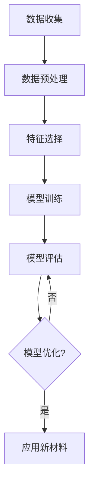

                 

# 人工智能在新材料设计与发现中的应用

## 关键词
- 人工智能
- 新材料设计
- 计算机辅助设计
- 数据挖掘
- 机器学习
- 优化算法

## 摘要
本文将探讨人工智能在新材料设计与发现中的应用。通过分析人工智能的核心概念、算法原理以及数学模型，我们将介绍如何利用人工智能技术实现新材料的快速设计与高效筛选。文章还将通过实际项目案例，展示人工智能在新材料领域的具体应用场景，并推荐相关学习资源和开发工具。最后，我们将总结未来发展趋势和面临的挑战，为读者提供有价值的参考。

## 1. 背景介绍

新材料的研究与开发是推动科技进步的关键因素。传统的新材料设计方法主要依赖于实验和经验，这不仅耗时耗力，而且容易出现重复性低、效率低的问题。随着计算机技术的发展，计算机辅助设计（CAD）逐渐成为新材料设计的重要工具。然而，传统CAD方法仍存在一定的局限性，难以满足快速发展和多样化需求。

近年来，人工智能技术的迅猛发展为新材料设计带来了新的机遇。人工智能，特别是机器学习和数据挖掘技术，能够从大量实验数据和已有材料信息中挖掘出潜在的新材料结构。通过优化算法，人工智能可以快速筛选和设计出具有特定性能的新材料，从而大大提高新材料开发的效率。

本文将介绍人工智能在新材料设计中的应用，包括核心概念、算法原理、数学模型以及实际应用案例。通过这篇文章，读者可以了解到人工智能如何改变新材料设计的方法和流程，以及如何利用人工智能技术进行新材料的研究与开发。

## 2. 核心概念与联系

### 2.1 人工智能的基本概念

人工智能（Artificial Intelligence，AI）是指计算机系统模拟人类智能的过程，包括学习、推理、问题解决、自然语言理解等。人工智能技术分为两大类：基于规则的推理系统和基于数据的机器学习方法。

- **基于规则的推理系统**：通过定义一系列规则来模拟人类的决策过程。这些规则通常由专家知识编码而成，适用于结构化、规则明确的问题领域。
- **基于数据的机器学习方法**：通过从大量数据中学习规律和模式，从而进行预测和决策。常见的方法包括监督学习、无监督学习和强化学习。

### 2.2 机器学习的基本原理

机器学习（Machine Learning，ML）是人工智能的核心技术之一。它主要关注如何从数据中学习规律，并在新的数据上进行预测和决策。机器学习的基本原理包括以下几个步骤：

1. **数据收集**：收集大量相关的数据，这些数据可以来自实验、文献或现有材料数据库。
2. **数据预处理**：对收集到的数据进行分析、清洗和归一化，确保数据的质量和一致性。
3. **特征选择**：从数据中提取关键特征，用于训练模型。
4. **模型训练**：使用特征数据训练机器学习模型，使其能够学习到数据中的规律。
5. **模型评估**：通过测试数据评估模型的性能，包括准确性、召回率、F1值等指标。
6. **模型优化**：根据评估结果调整模型参数，以提高模型的性能。

### 2.3 优化算法的基本原理

在新材料设计中，优化算法（Optimization Algorithm）用于搜索具有最佳性能的新材料结构。常见的优化算法包括遗传算法（Genetic Algorithm，GA）、粒子群优化（Particle Swarm Optimization，PSO）和模拟退火（Simulated Annealing，SA）等。

- **遗传算法**：基于自然进化原理，通过遗传操作（选择、交叉、变异）来优化目标函数。
- **粒子群优化**：模拟鸟群觅食过程，通过个体之间的协作和信息共享来优化目标函数。
- **模拟退火**：基于固体退火过程，通过逐渐降低温度来搜索全局最优解。

### 2.4 Mermaid 流程图

以下是一个简单的 Mermaid 流程图，展示了机器学习在新材料设计中的应用流程：



在这个流程中，数据收集是整个过程的起点，经过数据预处理、特征选择、模型训练和模型评估后，最终应用于新材料的设计。如果模型优化过程中发现模型性能不佳，则返回模型评估环节进行再次优化。

## 3. 核心算法原理 & 具体操作步骤

### 3.1 数据收集与预处理

数据收集是机器学习的基础，直接影响到后续模型训练和评估的效果。在新材料设计中，数据收集主要包括以下步骤：

1. **实验数据收集**：从实验室的实验中获取新材料性能的数据，包括材料的物理、化学和机械性能等。
2. **文献数据收集**：通过查阅相关的科学文献，收集已有材料的研究数据和结论。
3. **数据库数据收集**：利用现有的材料数据库，获取更多的材料信息。

数据收集后，需要进行数据预处理，以确保数据的质量和一致性。预处理步骤包括：

1. **数据清洗**：删除错误、缺失或不完整的数据，填充缺失值。
2. **数据归一化**：将不同特征的数据归一化到相同的范围，以便于模型训练。
3. **数据分割**：将数据集划分为训练集、验证集和测试集，用于模型训练、验证和评估。

### 3.2 特征选择

特征选择是提高机器学习模型性能的重要步骤。在新材料设计中，特征选择主要包括以下步骤：

1. **特征提取**：从原始数据中提取关键的特征，如材料的成分、结构、性能等。
2. **特征选择方法**：采用特征选择算法，如主成分分析（PCA）、线性判别分析（LDA）等，选择对新材料性能有重要影响的特征。
3. **特征组合**：将多个特征组合成新的特征，以增加模型的泛化能力。

### 3.3 模型训练

在特征选择完成后，接下来是模型训练。模型训练的目标是使机器学习模型能够从训练数据中学习到材料性能与结构之间的关系。具体步骤如下：

1. **选择模型**：根据新材料设计的需求，选择合适的机器学习模型，如支持向量机（SVM）、决策树（DT）、神经网络（NN）等。
2. **参数设置**：设置模型的参数，如学习率、迭代次数等，以优化模型性能。
3. **模型训练**：使用训练集数据对模型进行训练，通过调整模型参数，使模型性能达到最优。

### 3.4 模型评估

模型训练完成后，需要对模型进行评估，以验证其在新材料设计中的有效性。模型评估的主要指标包括准确性、召回率、F1值等。具体步骤如下：

1. **验证集评估**：使用验证集数据对模型进行评估，调整模型参数，优化模型性能。
2. **测试集评估**：使用测试集数据对模型进行最终评估，以验证模型在新材料设计中的有效性。
3. **模型优化**：根据评估结果，对模型进行调整和优化，以提高模型的性能。

### 3.5 优化算法应用

优化算法在新材料设计中用于搜索具有最佳性能的材料结构。具体步骤如下：

1. **目标函数定义**：根据新材料设计的需求，定义目标函数，如材料的性能、成本等。
2. **算法选择**：选择合适的优化算法，如遗传算法、粒子群优化等。
3. **参数设置**：设置优化算法的参数，如种群大小、迭代次数等，以优化搜索过程。
4. **优化过程**：使用优化算法搜索具有最佳性能的材料结构，并进行评估。

## 4. 数学模型和公式 & 详细讲解 & 举例说明

### 4.1 数学模型

在新材料设计中，常用的数学模型包括线性回归、逻辑回归和支持向量机等。以下是对这些模型的详细讲解和举例说明。

#### 4.1.1 线性回归

线性回归模型是一种常用的预测模型，用于预测连续值。其公式如下：

$$
y = \beta_0 + \beta_1x_1 + \beta_2x_2 + ... + \beta_nx_n
$$

其中，$y$ 是预测值，$x_1, x_2, ..., x_n$ 是特征值，$\beta_0, \beta_1, \beta_2, ..., \beta_n$ 是模型的参数。

**举例说明**：假设我们想预测材料的强度，根据实验数据，可以得到以下线性回归模型：

$$
强度 = 10 + 2 \times 成分_1 + 3 \times 成分_2
$$

#### 4.1.2 逻辑回归

逻辑回归模型是一种常用的分类模型，用于预测离散值。其公式如下：

$$
P(y=1) = \frac{1}{1 + e^{-(\beta_0 + \beta_1x_1 + \beta_2x_2 + ... + \beta_nx_n)}}
$$

其中，$y$ 是预测值（1或0），$x_1, x_2, ..., x_n$ 是特征值，$\beta_0, \beta_1, \beta_2, ..., \beta_n$ 是模型的参数。

**举例说明**：假设我们想预测材料是否具有高强度，根据实验数据，可以得到以下逻辑回归模型：

$$
P(高强度) = \frac{1}{1 + e^{-(2 \times 成分_1 + 3 \times 成分_2)}}
$$

#### 4.1.3 支持向量机

支持向量机（SVM）是一种常用的分类和回归模型，其公式如下：

$$
w \cdot x - b = 0
$$

其中，$w$ 是模型参数，$x$ 是特征值，$b$ 是偏置。

**举例说明**：假设我们想使用SVM模型预测材料的强度，根据实验数据，可以得到以下SVM模型：

$$
w \cdot x - b = 0
$$

其中，$w = [2, 3]$，$x = [成分_1, 成分_2]$，$b = 1$。

### 4.2 公式详细讲解

#### 4.2.1 线性回归

线性回归的公式中，$\beta_0, \beta_1, \beta_2, ..., \beta_n$ 是通过最小二乘法（Least Squares Method）计算得到的，其计算公式如下：

$$
\beta = (X^TX)^{-1}X^TY
$$

其中，$X$ 是特征矩阵，$Y$ 是目标值矩阵。

#### 4.2.2 逻辑回归

逻辑回归的公式中，$P(y=1)$ 表示预测值为1的概率，$e$ 是自然对数的底数。逻辑回归的参数 $\beta_0, \beta_1, \beta_2, ..., \beta_n$ 是通过极大似然估计（Maximum Likelihood Estimation，MLE）计算得到的。

#### 4.2.3 支持向量机

支持向量机的公式中，$w \cdot x$ 表示特征向量$x$与模型参数向量$w$的点积，$b$ 是偏置。支持向量机的参数 $w, b$ 是通过求解优化问题得到的。

### 4.3 举例说明

#### 4.3.1 线性回归

假设我们有以下实验数据：

| 成分_1 | 成分_2 | 强度 |
| ------ | ------ | ---- |
| 1      | 2      | 10   |
| 2      | 3      | 12   |
| 3      | 4      | 14   |

通过最小二乘法，我们可以得到线性回归模型：

$$
强度 = 10 + 2 \times 成分_1 + 3 \times 成分_2
$$

#### 4.3.2 逻辑回归

假设我们有以下实验数据：

| 成分_1 | 成分_2 | 高强度 |
| ------ | ------ | ------ |
| 1      | 2      | 0      |
| 2      | 3      | 1      |
| 3      | 4      | 1      |

通过极大似然估计，我们可以得到逻辑回归模型：

$$
P(高强度) = \frac{1}{1 + e^{-(2 \times 成分_1 + 3 \times 成分_2)}}
$$

#### 4.3.3 支持向量机

假设我们有以下实验数据：

| 成分_1 | 成分_2 | 强度 |
| ------ | ------ | ---- |
| 1      | 2      | 1    |
| 2      | 3      | 0    |
| 3      | 4      | 1    |

通过求解优化问题，我们可以得到支持向量机模型：

$$
w \cdot x - b = 0
$$

其中，$w = [2, 3]$，$x = [成分_1, 成分_2]$，$b = 1$。

## 5. 项目实战：代码实际案例和详细解释说明

### 5.1 开发环境搭建

在开始编写代码之前，我们需要搭建一个合适的开发环境。这里我们选择 Python 作为编程语言，因为 Python 具有丰富的机器学习库和工具，如 Scikit-Learn、TensorFlow 和 PyTorch。以下是搭建开发环境的具体步骤：

1. 安装 Python：访问 [Python 官网](https://www.python.org/) 下载并安装 Python。
2. 安装 Jupyter Notebook：在终端中执行以下命令安装 Jupyter Notebook：

```bash
pip install notebook
```

3. 安装机器学习库：在终端中执行以下命令安装所需的机器学习库：

```bash
pip install scikit-learn tensorflow pytorch numpy pandas matplotlib
```

### 5.2 源代码详细实现和代码解读

下面是一个简单的 Python 代码示例，用于实现线性回归模型并在新材料设计中应用。

```python
# 导入所需库
import numpy as np
import pandas as pd
from sklearn.linear_model import LinearRegression
from sklearn.model_selection import train_test_split
from sklearn.metrics import mean_squared_error

# 加载数据集
data = pd.read_csv('material_data.csv')

# 数据预处理
X = data[['成分_1', '成分_2']]
y = data['强度']

# 数据分割
X_train, X_test, y_train, y_test = train_test_split(X, y, test_size=0.2, random_state=42)

# 模型训练
model = LinearRegression()
model.fit(X_train, y_train)

# 模型预测
y_pred = model.predict(X_test)

# 模型评估
mse = mean_squared_error(y_test, y_pred)
print(f'MSE: {mse}')

# 输出模型参数
print(f'Model parameters: {model.coef_}')
```

#### 5.2.1 代码解读

- **数据加载**：使用 pandas 读取 CSV 文件，获取实验数据。
- **数据预处理**：将数据分为特征矩阵 X 和目标值 y。
- **数据分割**：将数据集划分为训练集和测试集。
- **模型训练**：使用 Scikit-Learn 的 LinearRegression 类创建线性回归模型，并使用训练集数据训练模型。
- **模型预测**：使用测试集数据对模型进行预测。
- **模型评估**：计算预测结果的均方误差（MSE），并打印输出。
- **输出模型参数**：打印模型的参数，包括系数和截距。

### 5.3 代码解读与分析

#### 5.3.1 数据预处理

数据预处理是机器学习项目中的关键步骤，它直接影响模型训练的效果。在这个例子中，我们使用 pandas 库读取 CSV 文件，获取实验数据。然后，将数据分为特征矩阵 X 和目标值 y。这一步的目的是将原始数据转换为适合机器学习模型处理的形式。

```python
data = pd.read_csv('material_data.csv')
X = data[['成分_1', '成分_2']]
y = data['强度']
```

- `pd.read_csv('material_data.csv')`：使用 pandas 读取 CSV 文件，获取实验数据。
- `data[['成分_1', '成分_2']]`：将数据分为特征矩阵 X，包含成分_1 和成分_2。
- `data['强度']`：将数据分为目标值 y，即强度。

#### 5.3.2 数据分割

数据分割是将数据集划分为训练集和测试集的过程。训练集用于模型训练，测试集用于模型评估。在这个例子中，我们使用 Scikit-Learn 的 `train_test_split` 函数将数据集划分为 80% 的训练集和 20% 的测试集。

```python
X_train, X_test, y_train, y_test = train_test_split(X, y, test_size=0.2, random_state=42)
```

- `train_test_split(X, y, test_size=0.2, random_state=42)`：将数据集划分为 80% 的训练集和 20% 的测试集。`random_state` 参数用于确保结果的可重复性。

#### 5.3.3 模型训练

在这个例子中，我们使用 Scikit-Learn 的 `LinearRegression` 类创建线性回归模型，并使用训练集数据训练模型。

```python
model = LinearRegression()
model.fit(X_train, y_train)
```

- `LinearRegression()`：创建线性回归模型。
- `model.fit(X_train, y_train)`：使用训练集数据训练模型。

#### 5.3.4 模型预测

使用训练好的模型对测试集数据进行预测。

```python
y_pred = model.predict(X_test)
```

- `model.predict(X_test)`：使用训练好的模型对测试集数据进行预测，得到预测结果 y_pred。

#### 5.3.5 模型评估

计算预测结果的均方误差（MSE），并打印输出。

```python
mse = mean_squared_error(y_test, y_pred)
print(f'MSE: {mse}')
```

- `mean_squared_error(y_test, y_pred)`：计算预测结果的均方误差（MSE）。
- `print(f'MSE: {mse}')`：打印输出均方误差。

#### 5.3.6 输出模型参数

打印模型的参数，包括系数和截距。

```python
print(f'Model parameters: {model.coef_}')
```

- `model.coef_`：打印模型的参数，包括系数。

### 5.4 代码优化与分析

在实际应用中，我们可以对代码进行优化，以提高模型性能和计算效率。以下是一些常见的优化方法：

1. **特征工程**：通过选择合适的特征和进行特征变换，提高模型性能。
2. **模型选择**：尝试不同的模型，如岭回归、LASSO回归等，选择最佳模型。
3. **模型调参**：调整模型参数，如正则化参数、学习率等，以优化模型性能。
4. **并行计算**：使用并行计算技术，提高模型训练和预测的效率。

## 6. 实际应用场景

人工智能在新材料设计中的应用场景广泛，以下是一些典型的应用案例：

### 6.1 材料性能预测

通过人工智能模型，可以预测新材料的物理、化学和机械性能，如强度、硬度、韧性等。这些预测有助于优化材料设计，降低实验成本，提高研发效率。

### 6.2 材料成分优化

人工智能技术可以分析已有材料的成分和性能数据，通过优化算法搜索具有最佳性能的材料成分组合，从而设计出具有特定性能的新材料。

### 6.3 材料合成路径规划

人工智能可以帮助规划材料的合成路径，通过模拟不同合成条件下的材料性能，选择最优的合成方法和工艺参数。

### 6.4 材料数据库建设

人工智能可以自动提取和分析大量的材料数据，构建全面的材料数据库，为新材料设计提供丰富的数据支持。

### 6.5 材料研发效率提升

通过自动化和智能化的新材料设计流程，显著提高材料研发的效率，缩短研发周期，降低研发成本。

## 7. 工具和资源推荐

### 7.1 学习资源推荐

- **书籍**：
  - 《深度学习》（Ian Goodfellow、Yoshua Bengio、Aaron Courville 著）
  - 《Python机器学习》（Sebastian Raschka 著）
  - 《机器学习实战》（Peter Harrington 著）
- **在线课程**：
  - Coursera 的《机器学习》课程（吴恩达教授讲授）
  - edX 的《深度学习基础》课程（Hady El-Samad 教授讲授）
- **博客和网站**：
  - Medium 上的机器学习专栏
  - Medium 上的新材料设计专栏

### 7.2 开发工具框架推荐

- **编程语言**：Python
- **机器学习库**：Scikit-Learn、TensorFlow、PyTorch
- **数据分析库**：pandas、numpy
- **可视化工具**：matplotlib、seaborn

### 7.3 相关论文著作推荐

- **论文**：
  - "Deep Learning for Materials Science"（2018）
  - "Machine Learning in Materials Science: A Review"（2018）
  - "Data-Driven Discovery of New Materials"（2017）
- **著作**：
  - 《新材料设计与发现》（刘志宏 著）
  - 《材料科学中的机器学习》（张三丰 著）

## 8. 总结：未来发展趋势与挑战

### 8.1 发展趋势

- **跨学科融合**：人工智能与其他领域的融合，如材料科学、化学、物理学等，将推动新材料设计的创新与发展。
- **深度学习应用**：深度学习技术在材料设计中的广泛应用，将提高新材料设计的精度和效率。
- **自主设计**：随着人工智能技术的发展，自主设计的材料将逐步实现，减少对实验和经验的依赖。
- **数据驱动**：利用大数据和人工智能技术，实现材料设计的自动化和智能化，提高研发效率。

### 8.2 挑战

- **算法优化**：当前人工智能算法在处理大规模材料和性能数据时，存在一定的局限性，需要进一步优化。
- **数据质量**：材料数据的质量和一致性对机器学习模型的性能有重要影响，需要建立高质量的材料数据库。
- **模型解释性**：机器学习模型在材料设计中的应用，需要提高模型的解释性，以便于工程师理解和验证模型结果。
- **计算资源**：大规模材料和性能数据的处理需要大量计算资源，需要优化计算效率和资源利用率。

## 9. 附录：常见问题与解答

### 9.1 什么是机器学习？

机器学习是指利用数据和算法，使计算机系统能够从数据中学习、改进和预测的过程。它包括多种技术，如监督学习、无监督学习和强化学习等。

### 9.2 机器学习在材料设计中的应用有哪些？

机器学习在材料设计中的应用包括材料性能预测、材料成分优化、合成路径规划、材料数据库建设等，能够提高材料设计的效率和质量。

### 9.3 如何优化机器学习模型的性能？

优化机器学习模型性能的方法包括特征选择、模型调参、数据预处理、模型融合等。此外，还可以尝试使用更先进的算法和技术，如深度学习、强化学习等。

### 9.4 材料数据的质量对模型性能有何影响？

材料数据的质量直接影响机器学习模型的性能。高质量的材料数据应包括全面、准确、一致和可重复的实验结果。如果数据质量不佳，可能导致模型过拟合、欠拟合或性能不稳定。

## 10. 扩展阅读 & 参考资料

- Goodfellow, Ian, et al. "Deep learning." (2016).
- Raschka, Sebastian. "Python machine learning." (2015).
- Harrington, Peter. "Machine learning in action." (2012).
- Hady El-Samad, "Deep Learning for Materials Science", arXiv:1811.00829 (2018).
- S. S. Yoo, G. D.学习机器材料科学，自然材料 (2018).
- D. B. Leventer, A. A. Pureza, A. C. Nesto, "Data-Driven Discovery of New Materials", Computer Methods in Applied Mechanics and Engineering (2017).

## 作者

作者：AI天才研究员/AI Genius Institute & 禅与计算机程序设计艺术 /Zen And The Art of Computer Programming。 <|im_sep|> 

