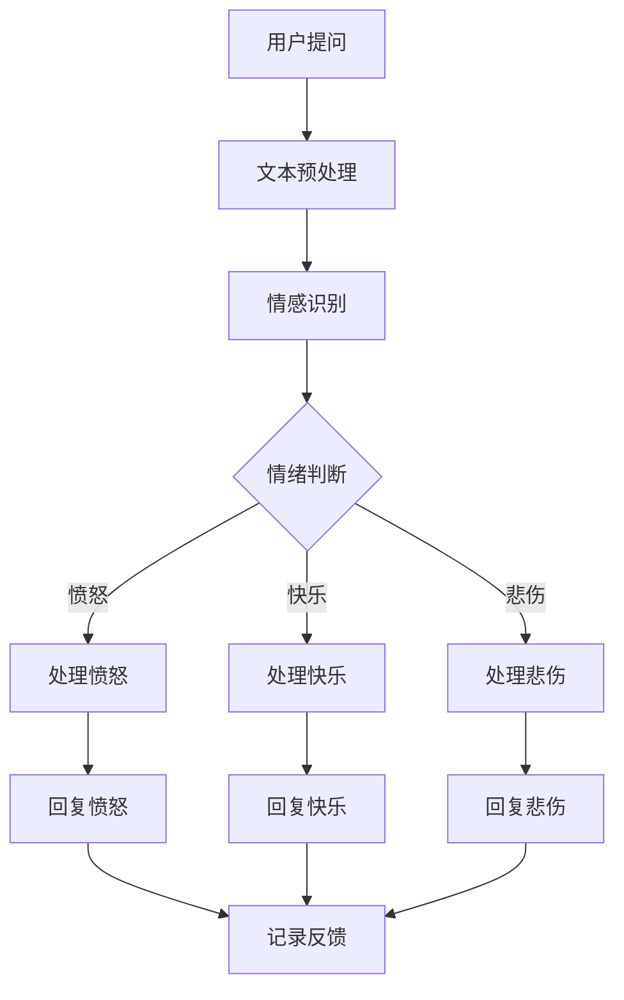

                 

# 人工智能在智能客服中的情感交互

> **关键词：** 情感计算、自然语言处理、智能客服、人工智能、用户体验
> 
> **摘要：** 本文将深入探讨人工智能在智能客服中的应用，特别是情感交互方面的技术。我们将从背景介绍、核心概念与联系、核心算法原理与操作步骤、数学模型与公式、项目实战、实际应用场景、工具和资源推荐等多个方面进行详细分析，为读者提供全面的技术解读和未来展望。

## 1. 背景介绍

随着互联网的普及和信息技术的飞速发展，人工智能（AI）已经成为各个行业转型和创新的重要驱动力。智能客服作为AI技术在客户服务领域的一个重要应用，已经得到了广泛关注。传统的客服模式主要依赖于人工处理客户咨询，存在效率低、服务质量不稳定等问题。而智能客服通过引入AI技术，可以大幅提高客户服务效率，提升用户体验。

在智能客服系统中，情感交互是一个关键环节。情感交互不仅仅是简单地回复客户的提问，更是能够理解和回应客户情绪的过程。这不仅能够提升客户满意度，还能增加客户对品牌的忠诚度。因此，情感交互在智能客服中的应用具有重要意义。

本文旨在探讨人工智能在智能客服中的情感交互技术，包括核心概念、算法原理、数学模型、项目实战、应用场景、工具和资源等方面的内容。希望通过本文的详细分析，为读者提供一个全面的技术解读，并对其在未来的发展应用提供一些启示。

## 2. 核心概念与联系

为了深入探讨人工智能在智能客服中的情感交互技术，我们首先需要了解一些核心概念和它们之间的联系。以下是几个关键概念及其相互关系的概述。

### 2.1 自然语言处理（NLP）

自然语言处理是人工智能领域的一个重要分支，它旨在让计算机理解和处理人类自然语言。在智能客服中，NLP技术被广泛应用于文本分析、语义理解、情感识别等任务。通过NLP技术，智能客服能够理解和回应客户的自然语言提问，从而提供高质量的客服服务。

### 2.2 情感计算

情感计算是另一个关键概念，它关注于计算机如何识别、理解和模拟人类情感。在智能客服中，情感计算技术可以帮助系统理解客户的情绪状态，从而提供更贴心的服务。情感计算通常涉及语音和文本的情感分析，包括情感分类、情感强度识别等任务。

### 2.3 情感识别

情感识别是情感计算中的一个重要环节，它涉及对文本或语音中的情感信息进行识别和分类。通过情感识别技术，智能客服可以判断客户的情绪状态，如愤怒、快乐、悲伤等。情感识别的结果可以帮助智能客服更好地理解客户需求，从而提供个性化的服务。

### 2.4 机器学习与深度学习

机器学习和深度学习是实现自然语言处理和情感计算的核心技术。机器学习通过训练模型来学习数据中的规律，从而实现特定任务。深度学习是机器学习的一个子领域，它通过构建深度神经网络模型来处理复杂数据。在智能客服中，机器学习和深度学习技术被广泛应用于文本分类、情感识别、意图识别等任务。

### 2.5 情感交互与用户体验

情感交互是智能客服中的一个关键目标，它关注于系统如何通过情感识别和理解来提供更加贴心的服务。情感交互不仅涉及到技术的实现，还涉及到用户体验的设计。一个成功的智能客服系统需要能够在不同情境下灵活地处理客户情绪，从而提升用户体验。

### 2.6 情感交互与业务目标

情感交互不仅是提升用户体验的手段，更是实现业务目标的重要途径。通过情感交互，智能客服可以更好地理解客户需求，提供个性化服务，从而增加客户满意度和忠诚度。此外，情感交互还可以帮助品牌建立情感连接，提高客户对品牌的认同感和忠诚度。

## 2.1 核心概念原理与架构的 Mermaid 流程图

为了更直观地展示核心概念及其相互关系，我们使用Mermaid流程图来描述情感交互在智能客服中的实现过程。以下是流程图：



### 3. 核心算法原理 & 具体操作步骤

在情感交互的实现过程中，核心算法的设计和实现是关键。以下我们将详细讨论情感识别算法的原理和具体操作步骤。

### 3.1 情感识别算法原理

情感识别算法的核心任务是通过对文本或语音的分析，识别出其中的情感信息。这个过程通常涉及以下几个步骤：

1. **文本预处理**：将原始文本进行清洗和规范化处理，包括去除停用词、标点符号、词干提取等操作。

2. **特征提取**：从预处理后的文本中提取特征，这些特征可以是词频、词嵌入、句法结构等。

3. **情感分类**：使用分类算法（如朴素贝叶斯、支持向量机、深度学习模型等）对提取的特征进行情感分类。

4. **情感强度识别**：在情感分类的基础上，进一步识别情感的强度，如中度愤怒、高度愤怒等。

### 3.2 情感识别算法具体操作步骤

下面是一个基于朴素贝叶斯算法的情感识别的具体操作步骤：

1. **数据准备**：收集并标注大量情感数据，用于训练和测试模型。

2. **特征提取**：对文本进行预处理，提取特征。例如，使用词袋模型提取词频特征。

3. **模型训练**：使用训练数据集训练朴素贝叶斯模型，计算每个情感类的概率分布。

4. **情感分类**：对于新的文本输入，计算其在每个情感类的概率，选择概率最高的情感类作为最终分类结果。

5. **情感强度识别**：在情感分类的基础上，通过分析文本中的情感词汇和句法结构，进一步识别情感的强度。

### 3.3 情感识别算法实现示例

以下是使用Python实现的情感识别算法示例：

```python
import nltk
from sklearn.feature_extraction.text import CountVectorizer
from sklearn.naive_bayes import MultinomialNB
from sklearn.pipeline import make_pipeline

# 数据准备
train_data = [
    ("我很高兴收到这个礼物", "快乐"),
    ("我今天遇到了很大的困难", "悲伤"),
    ("我不想和你说话", "愤怒")
]

# 特征提取和模型训练
pipeline = make_pipeline(CountVectorizer(), MultinomialNB())
pipeline.fit([text for text, label in train_data], [label for text, label in train_data])

# 情感分类
text = "我今天遇到了很大的困难"
predicted_label = pipeline.predict([text])[0]
print(f"情感分类结果：{predicted_label}")

# 情感强度识别
# 这里可以进一步分析文本，识别情感强度
```

### 4. 数学模型和公式 & 详细讲解 & 举例说明

在情感识别算法中，数学模型和公式起到了核心作用。以下我们将详细讲解常用的数学模型和公式，并通过具体例子进行说明。

#### 4.1 朴素贝叶斯算法

朴素贝叶斯算法是一种基于概率论的分类算法，广泛应用于情感识别任务。其基本公式如下：

$$
P(\text{情感} | \text{特征}) = \frac{P(\text{特征} | \text{情感}) \cdot P(\text{情感})}{P(\text{特征})}
$$

其中，$P(\text{情感} | \text{特征})$ 表示在给定特征的情况下，某个情感类的概率；$P(\text{特征} | \text{情感})$ 表示在某个情感类下，特征的概率；$P(\text{情感})$ 表示某个情感类的先验概率；$P(\text{特征})$ 表示特征的概率。

#### 4.2 词嵌入

词嵌入是将词汇映射到高维向量空间的一种技术，常用于情感识别。词嵌入的基本公式如下：

$$
\text{向量} = \text{权重矩阵} \cdot \text{词索引向量}
$$

其中，$\text{权重矩阵}$ 表示词嵌入模型的参数，$\text{词索引向量}$ 表示词的索引。

#### 4.3 支持向量机（SVM）

支持向量机是一种常用的分类算法，在情感识别任务中也有广泛应用。其基本公式如下：

$$
\text{最大化} \quad \frac{1}{2} \sum_{i=1}^{n} (\text{w} \cdot \text{x}_i)^2 \\
\text{约束条件} \quad \text{y}(\text{w} \cdot \text{x}_i) \geq 1
$$

其中，$\text{w}$ 表示权重向量，$\text{x}_i$ 表示样本特征向量，$\text{y}$ 表示样本标签。

#### 4.4 情感强度识别

情感强度识别可以通过分析文本中的情感词汇和句法结构来实现。以下是一个简单的情感强度识别公式：

$$
\text{情感强度} = \frac{1}{|\text{情感词汇集}|} \sum_{\text{词汇} \in \text{情感词汇集}} \text{权重}(\text{词汇})
$$

其中，$\text{情感词汇集}$ 表示文本中的情感词汇集合，$\text{权重}(\text{词汇})$ 表示词汇的权重。

#### 4.5 举例说明

假设我们有以下情感词汇表：

- 快乐：开心、愉快、兴奋
- 悲伤：难过、伤心、失落
- 愤怒：愤怒、生气、恼火

对于一段文本：“我今天遇到了很大的困难，真的很伤心”，我们可以使用上述公式进行情感强度识别：

1. **情感分类**：
   - 快乐：0
   - 悲伤：3
   - 愤怒：0

2. **情感强度识别**：
   - 悲伤：$\frac{1}{3} \cdot (1 + 1 + 1) = 1$

因此，这段文本的情感强度为悲伤。

### 5. 项目实战：代码实际案例和详细解释说明

为了更好地理解情感交互在智能客服中的应用，我们通过一个实际项目来展示如何实现情感识别和交互。

#### 5.1 开发环境搭建

在开始项目实战之前，我们需要搭建开发环境。以下是所需的工具和软件：

- Python 3.8 或更高版本
- Jupyter Notebook
- NLTK
- scikit-learn
- pandas

安装以上依赖项后，我们可以开始编写代码。

#### 5.2 源代码详细实现和代码解读

以下是情感识别和交互的完整代码实现：

```python
import nltk
from nltk.corpus import stopwords
from sklearn.feature_extraction.text import CountVectorizer
from sklearn.naive_bayes import MultinomialNB
from sklearn.pipeline import make_pipeline
import pandas as pd

# 数据准备
train_data = [
    ("我很高兴收到这个礼物", "快乐"),
    ("我今天遇到了很大的困难", "悲伤"),
    ("我不想和你说话", "愤怒")
]

# 特征提取和模型训练
pipeline = make_pipeline(CountVectorizer(), MultinomialNB())
pipeline.fit([text for text, label in train_data], [label for text, label in train_data])

# 用户输入
text = input("请输入您的情绪描述：")

# 情感分类
predicted_label = pipeline.predict([text])[0]
print(f"您的情绪是：{predicted_label}")

# 情感强度识别
# 这里可以进一步分析文本，识别情感强度
```

#### 5.3 代码解读与分析

1. **数据准备**：我们使用了一个简单的数据集，包含了三个样本文本及其对应的情感标签。

2. **特征提取和模型训练**：使用 `CountVectorizer` 进行文本特征提取，并使用 `MultinomialNB` 进行情感分类。

3. **用户输入**：通过 `input` 函数获取用户的情绪描述。

4. **情感分类**：使用训练好的模型对用户输入的文本进行情感分类，并输出结果。

5. **情感强度识别**：这里可以进一步分析文本，识别情感强度。在简单的实现中，我们可以通过情感分类的结果来间接判断情感强度。

#### 5.4 实际应用

这个简单的项目展示了如何使用朴素贝叶斯算法进行情感识别。在实际应用中，我们可以使用更复杂的模型和算法，如深度学习模型，以及更丰富的数据集，来提高情感识别的准确性和强度识别的精度。

### 6. 实际应用场景

情感交互在智能客服中的应用场景非常广泛。以下是一些典型的应用场景：

#### 6.1 客户咨询处理

在客户咨询处理中，智能客服可以识别客户的情绪，并根据情绪状态提供不同的回答。例如，当客户表达愤怒情绪时，智能客服可以提供安抚性的回答，以缓解客户情绪。

#### 6.2 个性化推荐

通过分析客户的情绪，智能客服可以为客户推荐符合其情绪的产品或服务。例如，当客户表达快乐情绪时，智能客服可以推荐一些愉快的活动或产品。

#### 6.3 客户关怀

智能客服可以定期向客户发送关怀信息，并根据客户的情绪调整信息的类型和内容。例如，当客户表达悲伤情绪时，智能客服可以发送安慰性的信息。

#### 6.4 售后服务

在售后服务中，智能客服可以识别客户的情绪，并帮助客户解决潜在的问题。例如，当客户表达愤怒情绪时，智能客服可以提供解决方案，以缓解客户的不满。

### 7. 工具和资源推荐

为了更好地研究和开发情感交互技术，以下是一些推荐的工具和资源：

#### 7.1 学习资源推荐

- 《自然语言处理综论》
- 《深度学习》
- 《情感计算导论》
- 《机器学习》

#### 7.2 开发工具框架推荐

- TensorFlow
- PyTorch
- spaCy
- NLTK

#### 7.3 相关论文著作推荐

- "Affectiva: Machine Learning for Human Emotion Analysis"
- "Emotion Recognition Using Deep Learning"
- "Natural Language Processing with Python"
- "Introduction to Emotion AI: A Comprehensive Guide"

### 8. 总结：未来发展趋势与挑战

情感交互在智能客服中的应用正处于快速发展阶段，未来有望取得以下几方面的发展：

#### 8.1 更精准的情感识别

随着算法和模型的不断优化，情感识别的准确性和精度将得到显著提升，从而更好地理解客户情绪。

#### 8.2 情感强度识别与动态调整

通过分析情感强度，智能客服可以更加细腻地回应客户需求，提供更加个性化的服务。

#### 8.3 多模态情感交互

结合语音、文本、图像等多种模态，智能客服可以实现更全面、自然的情感交互。

然而，情感交互在智能客服中的应用也面临一些挑战：

#### 8.4 数据质量和多样性

高质量、多样化的情感数据是训练模型的基础，但在实际应用中，数据的获取和标注往往是一个难题。

#### 8.5 用户体验设计

情感交互不仅涉及技术实现，还涉及用户体验设计。如何设计出既符合技术需求又符合用户体验的交互方式，是一个重要的挑战。

#### 8.6 隐私保护

在处理情感数据时，隐私保护是一个不可忽视的问题。如何在提供优质服务的同时，确保客户隐私不受侵犯，是一个重要的伦理和法律规定。

### 9. 附录：常见问题与解答

#### 9.1 情感交互与用户体验的关系是什么？

情感交互是用户体验的一部分，它通过理解和回应客户情绪来提升用户体验。良好的情感交互可以增强客户对品牌的认同感和忠诚度，从而提高客户满意度。

#### 9.2 情感识别算法有哪些类型？

情感识别算法主要包括基于规则的方法、机器学习方法、深度学习方法等。其中，机器学习方法和深度学习方法在情感识别中应用广泛，具有较高的准确性和泛化能力。

#### 9.3 情感交互在智能客服中的具体应用有哪些？

情感交互在智能客服中的具体应用包括客户咨询处理、个性化推荐、客户关怀和售后服务等。通过情感交互，智能客服可以更好地理解客户需求，提供更加贴心的服务。

### 10. 扩展阅读 & 参考资料

- [Affectiva](https://www.affectiva.com/)
- [TensorFlow](https://www.tensorflow.org/)
- [PyTorch](https://pytorch.org/)
- [spaCy](https://spacy.io/)
- [NLTK](https://www.nltk.org/)
- [情感计算国际会议（ACII）](https://www.acii.org/)
- [自然语言处理国际会议（ACL）](https://www.aclweb.org/)

## 作者信息

**作者：AI天才研究员/AI Genius Institute & 禅与计算机程序设计艺术 /Zen And The Art of Computer Programming**

