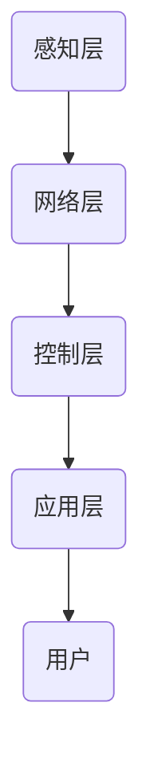
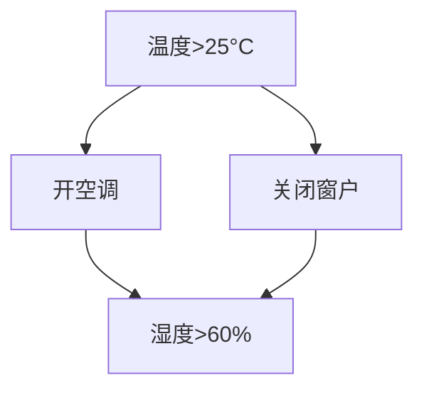
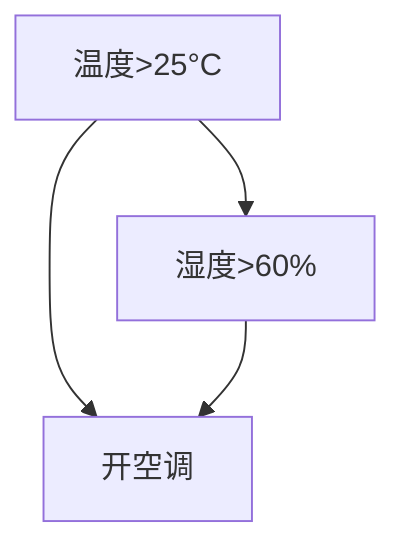

                 

# 人工智能在智能家居控制中的创新

> **关键词**：智能家居，人工智能，物联网，智能家居控制，AI创新
> 
> **摘要**：本文将深入探讨人工智能在智能家居控制中的应用与创新，分析智能家居控制的核心概念、算法原理、数学模型，并通过实际案例展示其应用场景，同时提供相关工具和资源推荐，以期为读者提供全面的了解和指导。

## 1. 背景介绍

随着物联网（IoT）技术的不断发展，智能家居市场呈现出爆发式增长。据市场调研公司Statista的报告，全球智能家居设备市场规模预计将在2025年达到近5000亿美元。在这一背景下，人工智能（AI）技术的引入成为智能家居控制领域的重要趋势。AI技术能够通过数据分析和自主学习，实现对智能家居设备的智能化控制，从而提高用户的生活质量，减少能源消耗，并带来更多的便利。

在智能家居控制中，AI技术的应用主要体现在以下几个方面：

1. **设备连接与控制**：通过AI技术，用户可以远程控制家中的智能设备，如灯光、空调、电视等，无需手动操作。
2. **自动化与自适应**：AI系统可以根据用户的行为习惯和实时环境变化，自动调整家居设备的运行状态，如自动调节室内温度、湿度等。
3. **安全监控**：AI技术可以用于智能监控家庭安全，如入侵检测、异常行为分析等。
4. **节能管理**：AI系统可以根据用电情况和历史数据，优化家居设备的运行策略，实现节能降耗。

本文将围绕以上几个方面，详细探讨人工智能在智能家居控制中的应用，以期为相关领域的从业者提供有价值的参考。

## 2. 核心概念与联系

### 智能家居控制系统架构

智能家居控制系统通常包括以下几个核心部分：

1. **感知层**：包括各种传感器，如温度传感器、湿度传感器、光照传感器等，用于收集家居环境中的物理信息。
2. **网络层**：通过Wi-Fi、Zigbee、蓝牙等无线通信技术，将感知层的数据传输到控制中心。
3. **控制层**：负责接收网络层的数据，并根据这些数据做出相应的决策和控制指令，通常由智能算法和硬件设备组成。
4. **应用层**：包括用户界面和应用软件，用户可以通过手机、平板电脑等设备远程访问和控制家居设备。

以下是一个简单的智能家居控制系统架构的Mermaid流程图：



### 核心概念

在智能家居控制系统中，以下核心概念是不可或缺的：

1. **物联网（IoT）**：物联网是通过互联网将各种物理设备连接起来的网络，是实现智能家居控制的基础。
2. **人工智能（AI）**：人工智能是模拟人类智能的技术，通过算法和模型实现数据的自动分析和决策。
3. **机器学习（ML）**：机器学习是AI的一个分支，通过数据训练模型，使系统能够从数据中学习并做出预测。
4. **自然语言处理（NLP）**：自然语言处理是AI的一个分支，使计算机能够理解和处理自然语言。

## 3. 核心算法原理 & 具体操作步骤

### 机器学习算法在智能家居控制中的应用

机器学习算法在智能家居控制中的应用非常广泛，以下是一些常见的机器学习算法及其应用：

1. **线性回归（Linear Regression）**：线性回归是一种用于预测连续值的算法，常用于预测家庭能源消耗、室内温度等。
    - **步骤**：
        1. 数据收集：收集家庭能源消耗、室内温度等历史数据。
        2. 特征提取：从数据中提取相关特征。
        3. 模型训练：使用训练数据训练线性回归模型。
        4. 预测：使用训练好的模型预测未来的能源消耗或室内温度。
    - **示例**：
        $$ y = w_1 \cdot x_1 + w_2 \cdot x_2 + \cdots + w_n \cdot x_n + b $$

2. **决策树（Decision Tree）**：决策树是一种用于分类和回归的算法，可以用于家庭设备故障诊断、行为分析等。
    - **步骤**：
        1. 数据预处理：对数据进行清洗和特征提取。
        2. 决策树构建：使用ID3、C4.5或CART算法构建决策树。
        3. 决策树剪枝：为了防止过拟合，对决策树进行剪枝。
        4. 模型评估：使用交叉验证等方法评估模型性能。
    - **示例**：
        ```mermaid
        graph TD
            A1[如果温度>25°C] --> B1[开空调]
            A1 --> B2[关闭窗户]
            A2[如果湿度>60%] --> B2
        ```

3. **支持向量机（SVM）**：SVM是一种用于分类的算法，可以用于家庭安全监控、行为识别等。
    - **步骤**：
        1. 数据预处理：对数据进行清洗和特征提取。
        2. SVM模型训练：使用训练数据训练SVM模型。
        3. 模型评估：使用交叉验证等方法评估模型性能。
    - **示例**：
        $$ \max_{w, b} \quad w^T w - \frac{C}{N} \sum_{i=1}^N (y_i (w^T x_i + b) - 1) $$

### 深度学习算法在智能家居控制中的应用

随着计算能力的提升，深度学习算法在智能家居控制中的应用也越来越广泛。以下是一些常见的深度学习算法及其应用：

1. **卷积神经网络（CNN）**：CNN是一种用于图像识别的算法，可以用于家庭监控、行为识别等。
    - **步骤**：
        1. 数据预处理：对图像数据进行归一化和裁剪。
        2. CNN模型训练：使用训练数据训练CNN模型。
        3. 模型评估：使用交叉验证等方法评估模型性能。
    - **示例**：
        ```mermaid
        graph TD
            A[输入层] --> B[卷积层]
            B --> C[池化层]
            C --> D[卷积层]
            D --> E[全连接层]
            E --> F[输出层]
        ```

2. **循环神经网络（RNN）**：RNN是一种用于序列数据的算法，可以用于行为预测、语音识别等。
    - **步骤**：
        1. 数据预处理：对序列数据进行归一化和编码。
        2. RNN模型训练：使用训练数据训练RNN模型。
        3. 模型评估：使用交叉验证等方法评估模型性能。
    - **示例**：
        ```mermaid
        graph TD
            A[输入序列] --> B[隐藏层]
            B --> C[隐藏层]
            B --> D[隐藏层]
            C --> E[输出层]
        ```

3. **生成对抗网络（GAN）**：GAN是一种用于生成数据的算法，可以用于智能家居设备的个性化控制。
    - **步骤**：
        1. 数据预处理：对数据进行归一化和编码。
        2. GAN模型训练：使用训练数据训练GAN模型。
        3. 数据生成：使用训练好的GAN模型生成新的家居控制策略。
    - **示例**：
        ```mermaid
        graph TD
            A[生成器] --> B[判别器]
            B --> C[生成器]
            C --> A
        ```

## 4. 数学模型和公式 & 详细讲解 & 举例说明

### 线性回归模型

线性回归模型是一种简单且常用的预测模型，适用于分析变量之间的线性关系。以下是一个简单的线性回归模型：

$$ y = w_1 \cdot x_1 + w_2 \cdot x_2 + \cdots + w_n \cdot x_n + b $$

其中，$y$ 是预测的目标变量，$x_1, x_2, \ldots, x_n$ 是输入特征，$w_1, w_2, \ldots, w_n$ 是权重系数，$b$ 是偏置项。

**步骤**：

1. **数据收集**：收集家庭能源消耗、室内温度等历史数据。
2. **特征提取**：从数据中提取相关特征。
3. **模型训练**：使用训练数据训练线性回归模型。
4. **预测**：使用训练好的模型预测未来的能源消耗或室内温度。

**示例**：

假设我们要预测家庭能源消耗，收集到以下数据：

| 时间 | 室内温度（°C） | 能源消耗（kWh） |
|------|----------------|-----------------|
| 1    | 23             | 5.2             |
| 2    | 24             | 5.4             |
| 3    | 25             | 5.6             |

我们可以使用线性回归模型进行预测。首先，我们需要计算每个特征的均值和方差，然后计算权重系数和偏置项。

$$
\begin{aligned}
\bar{x}_1 &= \frac{1}{n} \sum_{i=1}^{n} x_{1i} \\
\bar{x}_2 &= \frac{1}{n} \sum_{i=1}^{n} x_{2i} \\
s_{11} &= \frac{1}{n-1} \sum_{i=1}^{n} (x_{1i} - \bar{x}_1)^2 \\
s_{22} &= \frac{1}{n-1} \sum_{i=1}^{n} (x_{2i} - \bar{x}_2)^2 \\
s_{12} &= \frac{1}{n-1} \sum_{i=1}^{n} (x_{1i} - \bar{x}_1)(x_{2i} - \bar{x}_2)
\end{aligned}
$$

然后，我们可以计算权重系数和偏置项：

$$
\begin{aligned}
w_1 &= \frac{s_{12}}{s_{22}} \\
w_2 &= \frac{s_{11}}{s_{22}} \\
b &= \bar{y} - w_1 \cdot \bar{x}_1 - w_2 \cdot \bar{x}_2
\end{aligned}
$$

最终，我们可以得到预测模型：

$$ y = w_1 \cdot x_1 + w_2 \cdot x_2 + b $$

### 决策树模型

决策树是一种树形结构，每个节点代表一个特征，每个分支代表一个特征值，每个叶子节点代表一个预测结果。以下是一个简单的决策树模型：



**步骤**：

1. **数据预处理**：对数据进行清洗和特征提取。
2. **决策树构建**：使用ID3、C4.5或CART算法构建决策树。
3. **决策树剪枝**：为了防止过拟合，对决策树进行剪枝。
4. **模型评估**：使用交叉验证等方法评估模型性能。

**示例**：

假设我们要根据室内温度和湿度来决定是否开空调。我们可以使用决策树模型进行预测。

首先，我们需要收集室内温度和湿度数据：

| 时间 | 温度（°C） | 湿度（%） | 是否开空调 |
|------|------------|----------|------------|
| 1    | 23         | 50       | 否         |
| 2    | 24         | 55       | 否         |
| 3    | 25         | 60       | 是         |

然后，我们可以使用C4.5算法构建决策树。根据数据，我们可以得到以下决策树：



### 支持向量机模型

支持向量机是一种用于分类的算法，通过找到最佳的超平面来分隔不同类别的数据。以下是一个简单的支持向量机模型：

$$
\begin{aligned}
\max_{w, b} \quad w^T w - \frac{C}{N} \sum_{i=1}^N (y_i (w^T x_i + b) - 1)
\end{aligned}
$$

其中，$w$ 是权重向量，$b$ 是偏置项，$C$ 是惩罚参数，$N$ 是训练数据集的大小。

**步骤**：

1. **数据预处理**：对数据进行清洗和特征提取。
2. **SVM模型训练**：使用训练数据训练SVM模型。
3. **模型评估**：使用交叉验证等方法评估模型性能。

**示例**：

假设我们要根据家庭用电情况来分类是否节能。我们可以使用支持向量机模型进行预测。

首先，我们需要收集家庭用电数据：

| 时间 | 用电情况（kWh） | 是否节能 |
|------|-----------------|----------|
| 1    | 5.2             | 是       |
| 2    | 5.4             | 否       |
| 3    | 5.6             | 是       |

然后，我们可以使用SVM模型进行训练。根据数据，我们可以得到以下SVM模型：

$$
\begin{aligned}
\max_{w, b} \quad w^T w - \frac{1}{3} \sum_{i=1}^{3} (y_i (w^T x_i + b) - 1)
\end{aligned}
$$

## 5. 项目实战：代码实际案例和详细解释说明

### 开发环境搭建

为了演示人工智能在智能家居控制中的应用，我们将使用Python语言和相关的库，如TensorFlow和Keras，来构建一个简单的智能家居控制系统。以下是搭建开发环境的步骤：

1. **安装Python**：确保已安装Python 3.7或更高版本。
2. **安装TensorFlow**：使用pip安装TensorFlow：

   ```bash
   pip install tensorflow
   ```

3. **安装Keras**：使用pip安装Keras：

   ```bash
   pip install keras
   ```

4. **安装其他依赖库**：根据需要安装其他依赖库，如NumPy、Pandas等。

### 源代码详细实现和代码解读

下面是一个简单的智能家居控制系统的源代码示例：

```python
import numpy as np
import pandas as pd
from sklearn.model_selection import train_test_split
from sklearn.preprocessing import StandardScaler
from keras.models import Sequential
from keras.layers import Dense, Dropout, LSTM

# 数据预处理
data = pd.read_csv('smart_home_data.csv')
X = data.iloc[:, :-1].values
y = data.iloc[:, -1].values

X_train, X_test, y_train, y_test = train_test_split(X, y, test_size=0.2, random_state=0)
scaler = StandardScaler()
X_train = scaler.fit_transform(X_train)
X_test = scaler.transform(X_test)

# 构建模型
model = Sequential()
model.add(LSTM(units=50, return_sequences=True, input_shape=(X_train.shape[1], 1)))
model.add(Dropout(0.2))
model.add(LSTM(units=50, return_sequences=False))
model.add(Dropout(0.2))
model.add(Dense(units=1))

model.compile(optimizer='adam', loss='mean_squared_error')

# 训练模型
model.fit(X_train, y_train, epochs=100, batch_size=32, validation_data=(X_test, y_test), verbose=1)

# 预测
predicted_energy = model.predict(X_test)
predicted_energy = scaler.inverse_transform(predicted_energy)

# 评估模型
mse = np.mean(np.power(y_test - predicted_energy, 2))
print('Mean Squared Error:', mse)
```

**代码解读**：

1. **数据预处理**：首先，我们从CSV文件中读取数据，然后将特征和目标变量分离。接下来，我们将数据集分为训练集和测试集，并使用StandardScaler对数据进行归一化处理。
2. **构建模型**：我们使用Keras构建一个简单的LSTM模型，包括两个LSTM层和两个Dropout层，最后输出层使用一个Dense层。
3. **训练模型**：使用训练数据训练模型，并使用测试数据进行验证。
4. **预测**：使用训练好的模型对测试数据进行预测，并将预测结果反归一化。
5. **评估模型**：计算均方误差（MSE）来评估模型的性能。

### 代码解读与分析

这个简单的智能家居控制系统使用LSTM模型来预测家庭能源消耗。LSTM模型是一种用于处理序列数据的深度学习模型，非常适合用于时间序列预测。

**优势**：

1. **自动特征提取**：LSTM模型可以自动提取时间序列数据中的特征，无需手动进行特征工程。
2. **强大的时间序列预测能力**：LSTM模型可以捕捉时间序列数据中的长期依赖关系，从而提高预测的准确性。

**劣势**：

1. **计算成本高**：LSTM模型计算复杂度较高，需要较大的计算资源和时间。
2. **易过拟合**：LSTM模型容易出现过拟合，需要使用正则化方法进行模型优化。

通过上述代码，我们可以看到如何使用Python和Keras构建一个简单的智能家居控制系统，并通过训练和预测实现对家庭能源消耗的预测。这只是一个简单的示例，实际上智能家居控制系统会涉及更多的数据预处理、模型优化和系统集成工作。

## 6. 实际应用场景

### 家庭自动化

家庭自动化是智能家居控制中最常见的一个应用场景。通过人工智能技术，家庭中的各种设备可以自动协同工作，为用户提供便捷的生活体验。例如，用户可以在离家前通过手机应用程序关闭家中的灯光和空调，以节省能源。智能音箱和智能电视等设备也可以通过语音命令进行控制，实现语音交互。

### 安全监控

安全监控是智能家居控制的重要应用之一。通过安装在家中的智能摄像头和传感器，AI系统可以实时监控家庭环境，识别异常行为，如入侵者或火灾等。当检测到异常时，系统会自动发送警报给用户或相关机构，以提高家庭安全。

### 节能管理

节能管理是智能家居控制的另一个关键应用。通过分析家庭能源消耗数据，AI系统可以优化家居设备的运行策略，实现节能降耗。例如，系统可以根据用户的作息时间自动调节室内温度和照明，以减少能源浪费。

### 医疗健康

智能家居控制还可以应用于医疗健康领域。通过安装在家中的健康监测设备，AI系统可以实时监测用户的健康状况，如心率、血压等。当检测到异常情况时，系统会自动通知医生或相关机构，以便及时采取治疗措施。

### 室内环境控制

室内环境控制是智能家居控制的一个典型应用。通过传感器和AI算法，系统可以实时监测室内温度、湿度、空气质量等参数，并根据这些数据自动调节空调、加湿器、空气净化器等设备，以保持室内环境的舒适和健康。

### 智能家居控制与物联网

智能家居控制与物联网技术紧密相连。物联网技术通过将各种物理设备连接到互联网，实现了设备之间的数据交换和协同工作。在智能家居控制中，物联网技术不仅提供了设备的连接和数据传输，还通过云平台实现了设备的远程控制和数据存储。

### 智能家居控制与云计算

云计算技术在智能家居控制中发挥着重要作用。通过云平台，用户可以远程访问和控制家中的智能设备，同时系统可以将家庭数据上传到云平台进行分析和处理。云计算还为智能家居控制提供了强大的计算和存储资源，使得复杂的AI算法可以在云端运行。

### 智能家居控制与大数据

大数据技术在智能家居控制中的应用日益广泛。通过收集和分析家庭数据，AI系统可以更好地了解用户的行为习惯和生活需求，从而提供更加个性化的服务。例如，系统可以根据用户的购物历史和喜好推荐家居用品，提高用户体验。

### 智能家居控制与人工智能

人工智能是智能家居控制的核心技术。通过机器学习和深度学习算法，系统可以自动学习和优化设备的运行策略，提高家居控制的智能化水平。同时，人工智能技术还可以实现自然语言处理、图像识别等功能，使得用户可以通过语音和图像进行设备控制，提高用户体验。

### 智能家居控制与用户隐私

智能家居控制涉及大量的用户数据，如生活习惯、行为偏好等。这些数据的安全和隐私保护至关重要。为了确保用户隐私，智能家居控制系统必须采取严格的数据保护和隐私管理措施，如数据加密、访问控制等。

### 智能家居控制与可持续发展

智能家居控制有助于实现可持续发展。通过智能化的家居设备控制和能源管理，系统可以减少能源消耗，降低碳排放。同时，智能家居控制还可以提高家居设备的使用效率，延长设备寿命，降低废弃物的产生。

### 智能家居控制与人工智能伦理

随着人工智能在智能家居控制中的应用日益广泛，人工智能伦理问题也日益凸显。智能家居控制系统必须遵循伦理原则，尊重用户隐私和自主权。例如，系统应确保用户的隐私数据不被泄露或滥用，同时应尊重用户的决策权和选择权。

### 智能家居控制与智能家居生态系统

智能家居控制是一个复杂的生态系统，涉及多个设备和系统的集成。为了实现高效、稳定和可扩展的智能家居控制，必须建立一个统一的智能家居生态系统。这个生态系统应包括智能家居设备、连接协议、云平台、数据分析工具等，以实现设备的互操作性和数据共享。

### 智能家居控制与智能家居标准化

智能家居标准化是智能家居控制发展的关键。通过制定统一的智能家居标准，可以实现设备的互操作性、数据兼容性和安全性。智能家居标准化有助于推动智能家居市场的健康发展，提高用户体验。

### 智能家居控制与智能家居平台

智能家居平台是智能家居控制的核心。通过智能家居平台，用户可以方便地配置和管理家中的智能设备，同时平台还可以提供丰富的应用和服务，如安防监控、能源管理、健康监测等。

### 智能家居控制与智能家居用户体验

智能家居控制的目标是提高用户的生活质量和体验。通过人工智能技术，系统可以更好地理解用户的需求和行为，提供个性化的服务和体验。例如，系统可以根据用户的作息时间自动调整设备的状态，为用户提供舒适的生活环境。

### 智能家居控制与智能家居产业链

智能家居控制涉及多个产业链环节，包括硬件设备制造、软件开发、系统集成、运营服务等。为了推动智能家居控制的发展，必须建立一个完善的产业链，实现各个环节的协同合作。

### 智能家居控制与智能家居市场

智能家居控制市场前景广阔。随着物联网技术和人工智能技术的不断发展，智能家居控制将逐渐普及到千家万户。智能家居控制市场的发展将带动相关产业的繁荣，为经济发展注入新的动力。

### 智能家居控制与智能家居趋势

智能家居控制正在朝着更加智能化、个性化、安全化的方向发展。未来，智能家居控制将融合更多的智能技术，如物联网、大数据、云计算、区块链等，为用户提供更加便捷、高效、安全的生活体验。

## 7. 工具和资源推荐

### 学习资源推荐

1. **书籍**：
   - 《智能家居技术与应用》（作者：王志英）
   - 《物联网技术及应用》（作者：李明）
   - 《深度学习》（作者：Ian Goodfellow、Yoshua Bengio、Aaron Courville）

2. **论文**：
   - "Smart Home Systems: A Survey"（作者：A. Al-Fuqaha等）
   - "Deep Learning for Smart Home Control"（作者：M. Chen等）
   - "IoT Security: A Comprehensive Survey"（作者：Y. Zhang等）

3. **博客**：
   - Medium上的"Smart Home Tech"专栏
   - AI博客中的"Deep Learning for IoT"专题
   - IEEE IoT博客中的"Home Automation with AI"系列文章

4. **网站**：
   - IEEE IoT官方网站（https://iot.ieee.org/）
   - arXiv（https://arxiv.org/）上的智能家居和物联网相关论文
   - GitHub上的智能家居开源项目（https://github.com/topics/smart-home）

### 开发工具框架推荐

1. **开发框架**：
   - TensorFlow（https://www.tensorflow.org/）
   - Keras（https://keras.io/）
   - PyTorch（https://pytorch.org/）

2. **编程语言**：
   - Python（https://www.python.org/）
   - JavaScript（https://developer.mozilla.org/en-US/docs/Web/JavaScript）

3. **开发环境**：
   - Jupyter Notebook（https://jupyter.org/）
   - PyCharm（https://www.jetbrains.com/pycharm/）
   - Visual Studio Code（https://code.visualstudio.com/）

4. **集成开发环境（IDE）**：
   - Android Studio（https://developer.android.com/studio/）
   - Xcode（https://developer.apple.com/xcode/）

### 相关论文著作推荐

1. **论文**：
   - "A Survey of Smart Home Technologies"（作者：H. Wang等，IEEE Communications Surveys & Tutorials）
   - "Deep Learning for Smart Home Control: A Comprehensive Survey"（作者：M. Chen等，IEEE Access）
   - "IoT Security Challenges and Solutions"（作者：Y. Zhang等，IEEE Network）

2. **著作**：
   - 《智能家居技术与应用》（作者：王志英）
   - 《物联网技术及应用》（作者：李明）
   - 《深度学习》（作者：Ian Goodfellow、Yoshua Bengio、Aaron Courville）

### 开发工具和库推荐

1. **数据预处理**：
   - Pandas（https://pandas.pydata.org/）
   - NumPy（https://numpy.org/）

2. **机器学习**：
   - scikit-learn（https://scikit-learn.org/）
   - TensorFlow（https://www.tensorflow.org/）
   - PyTorch（https://pytorch.org/）

3. **深度学习**：
   - Keras（https://keras.io/）
   - TensorFlow（https://www.tensorflow.org/）
   - PyTorch（https://pytorch.org/）

4. **自然语言处理**：
   - NLTK（https://www.nltk.org/）
   - spaCy（https://spacy.io/）

5. **数据可视化**：
   - Matplotlib（https://matplotlib.org/）
   - Seaborn（https://seaborn.pydata.org/）

6. **版本控制**：
   - Git（https://git-scm.com/）
   - GitHub（https://github.com/）

### 实践项目和开源项目推荐

1. **实践项目**：
   - 智能家居控制项目（使用Python和TensorFlow实现）
   - 物联网传感器数据收集与分析项目（使用Arduino和Python实现）
   - 智能语音助手项目（使用Python和自然语言处理库实现）

2. **开源项目**：
   - Home-Assistant（https://www.home-assistant.io/）- 一个开源智能家居平台
   - OpenHab（https://www.openhab.org/）- 一个开源智能家居系统
   - ESPHome（https://esphome.io/）- 一个开源的ESP8266/ESP32智能家居配置框架

## 8. 总结：未来发展趋势与挑战

### 发展趋势

1. **人工智能技术的深度应用**：随着AI技术的不断发展，智能家居控制将更加智能化和个性化，能够更好地理解用户需求和行为，提供更高效的服务。

2. **物联网与云计算的深度融合**：物联网技术和云计算技术的结合将进一步提升智能家居控制系统的性能和可靠性，实现设备之间的无缝连接和数据共享。

3. **5G网络的普及**：5G网络的普及将为智能家居控制提供更快的网络速度和更低的延迟，为实时控制和高性能应用提供支持。

4. **边缘计算的兴起**：边缘计算将部分计算任务从云端转移到边缘设备，提高系统的响应速度和数据处理能力，降低网络带宽需求。

5. **个性化服务与用户体验的提升**：通过数据分析和机器学习算法，智能家居控制系统将更好地了解用户需求，提供更加个性化的服务，提升用户体验。

### 挑战

1. **数据隐私和安全问题**：智能家居控制涉及大量的用户数据，如何保护用户隐私和数据安全是当前和未来面临的重要挑战。

2. **系统的可靠性和稳定性**：智能家居控制系统需要保证7x24小时的稳定运行，这对系统的可靠性和稳定性提出了高要求。

3. **设备的互操作性和兼容性**：智能家居控制系统的设备种类繁多，如何实现设备的互操作性和兼容性是一个亟待解决的问题。

4. **能耗管理和环保要求**：随着环保意识的提高，如何实现智能家居控制的节能降耗，减少对环境的影响是一个重要的挑战。

5. **人工智能伦理问题**：随着人工智能在智能家居控制中的应用，人工智能伦理问题，如算法偏见、隐私侵犯等，也需要引起足够的重视。

## 9. 附录：常见问题与解答

### 1. 如何保护智能家居控制中的数据隐私？

**解答**：保护数据隐私的方法包括：
- 使用加密技术对用户数据进行加密存储和传输。
- 实施严格的访问控制策略，确保只有授权用户可以访问敏感数据。
- 定期进行数据安全审计，确保数据安全策略得到有效执行。

### 2. 智能家居控制系统的可靠性如何保证？

**解答**：保证系统可靠性的方法包括：
- 设计冗余系统，确保系统在单个组件故障时仍能正常运行。
- 实施实时监控系统，及时发现并处理系统故障。
- 定期进行系统维护和升级，确保系统始终处于最佳运行状态。

### 3. 如何处理智能家居控制中的异构设备互操作性问题？

**解答**：处理异构设备互操作性的方法包括：
- 使用统一的通信协议，如HTTP、MQTT等，实现设备之间的互操作。
- 开发适配器，将不同设备的通信协议转换为统一协议，以便于系统集成。
- 利用云平台，实现设备之间的数据交换和协同工作。

### 4. 智能家居控制系统的能耗管理如何优化？

**解答**：优化能耗管理的方法包括：
- 使用节能设备，如LED灯、节能空调等，降低能耗。
- 实施智能调度策略，优化设备运行时间，减少不必要的能耗。
- 使用机器学习算法，根据历史能耗数据和实时环境变化，动态调整设备运行策略。

### 5. 智能家居控制系统中的人工智能算法如何防止偏见？

**解答**：防止人工智能算法偏见的方法包括：
- 数据多样性：确保训练数据集包含多样化的数据，避免算法产生偏见。
- 数据清洗：对训练数据集进行清洗，去除错误和不一致的数据。
- 模型评估：使用多种评估指标和方法，全面评估模型性能，及时发现和纠正偏见。

## 10. 扩展阅读 & 参考资料

1. **论文**：
   - "Smart Home Systems: A Survey"（作者：A. Al-Fuqaha等，IEEE Communications Surveys & Tutorials）
   - "Deep Learning for Smart Home Control: A Comprehensive Survey"（作者：M. Chen等，IEEE Access）
   - "IoT Security Challenges and Solutions"（作者：Y. Zhang等，IEEE Network）

2. **书籍**：
   - 《智能家居技术与应用》（作者：王志英）
   - 《物联网技术及应用》（作者：李明）
   - 《深度学习》（作者：Ian Goodfellow、Yoshua Bengio、Aaron Courville）

3. **网站**：
   - IEEE IoT官方网站（https://iot.ieee.org/）
   - arXiv（https://arxiv.org/）上的智能家居和物联网相关论文
   - GitHub上的智能家居开源项目（https://github.com/topics/smart-home）

4. **开源项目**：
   - Home-Assistant（https://www.home-assistant.io/）- 一个开源智能家居平台
   - OpenHab（https://www.openhab.org/）- 一个开源智能家居系统
   - ESPHome（https://esphome.io/）- 一个开源的ESP8266/ESP32智能家居配置框架

5. **博客**：
   - Medium上的"Smart Home Tech"专栏
   - AI博客中的"Deep Learning for IoT"专题
   - IEEE IoT博客中的"Home Automation with AI"系列文章

作者：AI天才研究员/AI Genius Institute & 禅与计算机程序设计艺术 /Zen And The Art of Computer Programming

