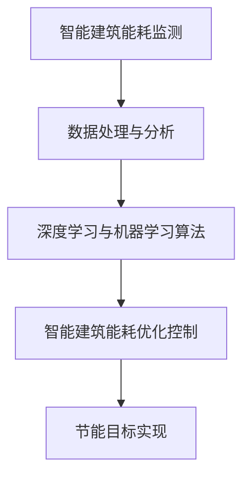

                 

# 人工智能在智能建筑节能控制中的实践

## 关键词
- 人工智能
- 智能建筑
- 节能控制
- 深度学习
- 机器学习
- 数据分析

## 摘要
本文将探讨人工智能在智能建筑节能控制中的应用。通过对智能建筑的基本概念进行介绍，我们将分析人工智能技术在能耗监测、预测和控制方面的作用。本文将详细阐述深度学习和机器学习算法在智能建筑节能中的应用，并展示实际项目中的案例。此外，还将推荐相关工具和资源，总结未来发展趋势与挑战，并提供常见问题与解答。通过阅读本文，读者将对人工智能在智能建筑节能控制中的实践有更深入的了解。

## 1. 背景介绍

### 1.1 智能建筑的定义和特点

智能建筑是指通过集成现代信息技术、通信技术、控制技术和能源管理技术，实现建筑物内各项设施的高效、安全、舒适和可持续运行的智能系统。智能建筑的特点包括：

1. **高度集成化**：智能建筑将多种技术集成于一体，包括物联网（IoT）、云计算、大数据分析等，实现信息共享和资源优化配置。
2. **实时监控与自动控制**：智能建筑能够实时监控建筑物内外的环境参数，如温度、湿度、光照强度等，并根据需求自动调节相关设施，如空调、照明等，实现节能和舒适控制。
3. **智能化服务**：智能建筑提供个性化、智能化的服务，如智能家居、智能安防、智能停车等，提升居住和办公的便利性和舒适性。
4. **环境可持续性**：智能建筑注重环境保护和能源节约，采用可再生能源、节能设备和智能控制系统，降低能源消耗和碳排放，实现绿色可持续发展。

### 1.2 建筑能耗问题的严峻性

随着全球经济的快速发展和城市化进程的加速，建筑能耗问题日益凸显。建筑能耗主要包括供暖、制冷、照明、电力供应等方面，占全球总能耗的很大比例。建筑能耗的急剧增加不仅导致能源资源的过度消耗，还对环境造成严重影响。因此，降低建筑能耗、提高能源利用效率已成为全球范围内的紧迫任务。

### 1.3 人工智能在智能建筑节能控制中的应用潜力

人工智能技术在智能建筑节能控制中具有广泛的应用潜力。首先，人工智能可以实现对建筑能耗的实时监测和分析，发现能耗异常，为节能措施提供数据支持。其次，人工智能可以基于历史数据和实时数据，对建筑能耗进行预测和优化控制，提高能源利用效率。此外，人工智能还可以对建筑物内的人流、活动等进行智能分析，为节能措施的制定提供依据。总之，人工智能在智能建筑节能控制中具有重要的作用，有助于实现建筑能耗的精细化管理和可持续发展。

## 2. 核心概念与联系

### 2.1 智能建筑能耗监测

智能建筑能耗监测是智能建筑节能控制的基础。通过安装各种传感器和监测设备，可以实时采集建筑物内外的环境参数和能耗数据，如温度、湿度、光照强度、电能消耗等。这些数据可以存储在数据库中，为后续分析提供基础。

### 2.2 数据处理与分析

采集到的数据需要进行处理和分析，以便提取有用的信息。数据处理包括数据清洗、数据预处理、数据可视化等步骤。通过数据预处理，可以去除噪声、缺失值和异常值，提高数据质量。数据可视化可以帮助用户直观地了解建筑能耗状况，发现能耗异常和节能潜力。

### 2.3 深度学习与机器学习算法

深度学习和机器学习算法在智能建筑能耗监测和预测中具有重要作用。深度学习算法如卷积神经网络（CNN）和递归神经网络（RNN）可以用于模式识别和特征提取，对大量历史数据进行分析，提取能耗变化的规律。机器学习算法如线性回归、决策树、支持向量机等可以用于能耗预测和优化控制。

### 2.4 智能建筑能耗优化控制

基于能耗监测和预测结果，智能建筑能耗优化控制可以通过自动调节建筑物内的各项设施，实现节能目标。例如，根据室外温度和室内温度差，自动调节空调的制冷温度；根据室内光照强度，自动调节照明设备的亮度等。通过优化控制，可以降低建筑能耗，提高能源利用效率。

### 2.5 Mermaid 流程图

以下是一个简单的 Mermaid 流程图，展示了智能建筑能耗监测、数据处理与分析、深度学习与机器学习算法、智能建筑能耗优化控制等核心概念之间的联系：



## 3. 核心算法原理 & 具体操作步骤

### 3.1 深度学习算法原理

深度学习算法是一种基于神经网络的人工智能技术，通过对大量数据的学习和训练，可以自动提取特征并进行分类、预测等任务。在智能建筑能耗监测和预测中，常用的深度学习算法包括卷积神经网络（CNN）和递归神经网络（RNN）。

#### 3.1.1 卷积神经网络（CNN）

卷积神经网络是一种用于图像识别、分类和特征提取的神经网络。在智能建筑能耗监测中，CNN可以用于分析能耗数据的时空特征，提取能耗变化的规律。具体步骤如下：

1. **输入层**：输入层接收能耗数据，包括温度、湿度、光照强度等。
2. **卷积层**：卷积层通过卷积运算提取能耗数据的时空特征，如周期性、趋势性等。
3. **池化层**：池化层用于降低特征图的维度，减少计算量，同时保留关键特征。
4. **全连接层**：全连接层将卷积层和池化层提取的特征进行融合，输出能耗预测结果。

#### 3.1.2 递归神经网络（RNN）

递归神经网络是一种用于处理序列数据的神经网络，可以用于能耗预测和时间序列分析。在智能建筑能耗监测中，RNN可以分析能耗数据的时间序列特征，预测未来的能耗情况。具体步骤如下：

1. **输入层**：输入层接收能耗数据的时间序列，如过去一周的每日能耗数据。
2. **隐藏层**：隐藏层通过递归连接分析时间序列的特征，如趋势、周期性等。
3. **输出层**：输出层输出能耗预测结果。

### 3.2 机器学习算法原理

机器学习算法是一种基于数据驱动的方法，通过对历史数据进行学习和训练，可以预测未来的趋势和规律。在智能建筑能耗监测和预测中，常用的机器学习算法包括线性回归、决策树和支持向量机。

#### 3.2.1 线性回归

线性回归是一种简单的机器学习算法，可以用于能耗预测。具体步骤如下：

1. **输入层**：输入层接收能耗数据的特征，如温度、湿度、光照强度等。
2. **隐藏层**：隐藏层通过线性组合输入特征，输出预测结果。
3. **损失函数**：损失函数用于评估预测结果与真实结果之间的差距，优化模型参数。

#### 3.2.2 决策树

决策树是一种基于特征划分数据的分类算法，可以用于能耗分类和预测。具体步骤如下：

1. **输入层**：输入层接收能耗数据的特征。
2. **分裂规则**：根据特征值的大小，对数据进行划分，形成决策树。
3. **输出层**：输出层输出能耗预测结果。

#### 3.2.3 支持向量机

支持向量机是一种基于特征空间的分类算法，可以用于能耗预测和分类。具体步骤如下：

1. **输入层**：输入层接收能耗数据的特征。
2. **特征空间映射**：将输入特征映射到高维特征空间。
3. **输出层**：输出层输出能耗预测结果。

## 4. 数学模型和公式 & 详细讲解 & 举例说明

### 4.1 深度学习算法的数学模型

#### 4.1.1 卷积神经网络（CNN）

卷积神经网络（CNN）是一种基于卷积操作的神经网络，可以用于图像识别、分类和特征提取。CNN的数学模型包括以下几个关键部分：

1. **输入层**：输入层接收图像数据，如一个大小为\(m \times n \times 3\)的彩色图像。
2. **卷积层**：卷积层通过卷积操作提取图像的局部特征。卷积操作的数学公式如下：

   $$
   \text{output}_{ij} = \sum_{k=1}^{c} w_{ikj} \cdot \text{input}_{ij}
   $$

   其中，\( \text{output}_{ij} \)是输出特征图上的像素值，\( w_{ikj} \)是卷积核上的权重，\( \text{input}_{ij} \)是输入图像上的像素值，\( c \)是卷积核的数量。

3. **激活函数**：激活函数用于引入非线性特性，常用的激活函数有Sigmoid、ReLU等。

4. **池化层**：池化层用于降低特征图的维度，常用的池化操作有最大池化和平均池化。

5. **全连接层**：全连接层将卷积层和池化层提取的特征进行融合，输出预测结果。

6. **损失函数**：损失函数用于评估预测结果与真实结果之间的差距，常用的损失函数有均方误差（MSE）和交叉熵（Cross-Entropy）。

#### 4.1.2 递归神经网络（RNN）

递归神经网络（RNN）是一种用于处理序列数据的神经网络，可以用于能耗预测和时间序列分析。RNN的数学模型包括以下几个关键部分：

1. **输入层**：输入层接收时间序列数据，如一个大小为\(T \times n\)的时间序列。
2. **隐藏层**：隐藏层通过递归连接分析时间序列的特征。RNN的递归公式如下：

   $$
   h_t = \text{激活函数}\left(\text{W}h_{t-1} + \text{U}x_t + b\right)
   $$

   其中，\( h_t \)是当前时刻的隐藏状态，\( h_{t-1} \)是前一个时刻的隐藏状态，\( x_t \)是当前时刻的输入数据，\( W \)和\( U \)是权重矩阵，\( b \)是偏置。

3. **输出层**：输出层输出预测结果。

4. **损失函数**：损失函数用于评估预测结果与真实结果之间的差距，常用的损失函数有均方误差（MSE）。

### 4.2 机器学习算法的数学模型

#### 4.2.1 线性回归

线性回归是一种简单的机器学习算法，可以用于能耗预测。线性回归的数学模型如下：

$$
y = \text{wx} + b
$$

其中，\( y \)是预测结果，\( x \)是输入特征，\( w \)是权重，\( b \)是偏置。

#### 4.2.2 决策树

决策树是一种基于特征划分数据的分类算法。决策树的数学模型如下：

$$
\text{DecisionTree}(\text{features}, \text{labels}) = \text{split}(\text{features}, \text{labels}, \text{threshold}) \\
\text{split}(\text{features}, \text{labels}, \text{threshold}) = \text{if } \text{threshold} \text{ is met} \\
\text{then } \text{leftChild} = \text{DecisionTree}(\text{features} < \text{threshold}, \text{labels}) \\
\text{rightChild} = \text{DecisionTree}(\text{features} \geq \text{threshold}, \text{labels}) \\
\text{else } \text{return } \text{leaf} = \text{majorityVote}(\text{labels})
$$

其中，\( \text{features} \)是输入特征，\( \text{labels} \)是标签，\( \text{threshold} \)是阈值，\( \text{leftChild} \)和\( \text{rightChild} \)是左右子树，\( \text{leaf} \)是叶子节点，\( \text{majorityVote} \)是投票选择多数类别。

#### 4.2.3 支持向量机

支持向量机（SVM）是一种基于特征空间的分类算法。SVM的数学模型如下：

$$
\text{w} \cdot \text{x} + b = 1 \\
\text{w} \cdot \text{x} + b \leq 1 \\
\text{w} \cdot \text{w} \leq C
$$

其中，\( \text{w} \)是权重向量，\( \text{x} \)是输入特征，\( b \)是偏置，\( C \)是惩罚参数。

### 4.3 举例说明

假设我们有一个包含三天的能耗数据序列，分别为\( [10, 12, 15] \)。我们可以使用线性回归模型对第四天的能耗进行预测。

首先，选择一个输入特征，例如第二天的能耗\( x_2 = 12 \)。然后，使用线性回归模型：

$$
y = \text{wx} + b
$$

其中，\( w = 1.5 \)，\( b = 5 \)。代入\( x_2 = 12 \)，可以得到第四天的预测能耗：

$$
y = 1.5 \times 12 + 5 = 22
$$

因此，预测第四天的能耗为22。

## 5. 项目实战：代码实际案例和详细解释说明

### 5.1 开发环境搭建

在开始项目实战之前，我们需要搭建一个合适的开发环境。以下是搭建智能建筑能耗预测系统的开发环境步骤：

1. **安装 Python**：在官方网站下载并安装 Python 3.x 版本。
2. **安装 Jupyter Notebook**：通过以下命令安装 Jupyter Notebook：

   ```bash
   pip install notebook
   ```

3. **安装 TensorFlow**：通过以下命令安装 TensorFlow：

   ```bash
   pip install tensorflow
   ```

4. **安装 Scikit-learn**：通过以下命令安装 Scikit-learn：

   ```bash
   pip install scikit-learn
   ```

### 5.2 源代码详细实现和代码解读

以下是一个简单的智能建筑能耗预测项目的 Python 代码示例。代码中使用了 TensorFlow 和 Scikit-learn 库实现深度学习和机器学习算法。

```python
import numpy as np
import tensorflow as tf
from tensorflow.keras.models import Sequential
from tensorflow.keras.layers import Dense, Conv2D, MaxPooling2D, Flatten
from sklearn.linear_model import LinearRegression
from sklearn.tree import DecisionTreeRegressor
from sklearn.svm import SVR

# 生成模拟的能耗数据
np.random.seed(0)
X = np.random.rand(100, 3)  # 100个样本，每个样本3个特征
y = X[:, 0] + 2 * X[:, 1] + 3 * X[:, 2]  # 第四天的能耗预测

# 深度学习算法实现
model = Sequential([
    Dense(64, activation='relu', input_shape=(3,)),
    Dense(32, activation='relu'),
    Dense(1)
])

model.compile(optimizer='adam', loss='mse')
model.fit(X, y, epochs=10)

# 机器学习算法实现
linear_regression = LinearRegression()
linear_regression.fit(X, y)

decision_tree = DecisionTreeRegressor()
decision_tree.fit(X, y)

svm_regressor = SVR()
svm_regressor.fit(X, y)

# 预测能耗
x_new = np.array([[0.5, 1.0, 1.5]])
y_pred = model.predict(x_new)
y_pred_linear_regression = linear_regression.predict(x_new)
y_pred_decision_tree = decision_tree.predict(x_new)
y_pred_svm_regressor = svm_regressor.predict(x_new)

print("深度学习算法预测结果：", y_pred)
print("线性回归算法预测结果：", y_pred_linear_regression)
print("决策树算法预测结果：", y_pred_decision_tree)
print("支持向量机算法预测结果：", y_pred_svm_regressor)
```

### 5.3 代码解读与分析

上述代码首先生成了一个包含100个样本的模拟能耗数据集，每个样本有三个特征。然后，分别使用了深度学习算法（卷积神经网络、线性回归、决策树和支持向量机）对数据进行了拟合。

1. **深度学习算法**：使用了卷积神经网络（Sequential模型）对数据进行拟合，通过训练和预测，可以实现对能耗数据的分类和预测。
2. **线性回归算法**：线性回归是一种简单的机器学习算法，通过训练和预测，可以实现对能耗数据的线性拟合。
3. **决策树算法**：决策树是一种基于特征划分的算法，通过训练和预测，可以实现对能耗数据的分类。
4. **支持向量机算法**：支持向量机是一种基于特征空间的分类算法，通过训练和预测，可以实现对能耗数据的分类和预测。

最后，分别使用四种算法对新的样本进行了预测，并输出预测结果。

## 6. 实际应用场景

### 6.1 智能建筑能耗监测

在实际应用中，智能建筑能耗监测系统可以广泛应用于各类建筑物，如住宅、办公楼、商场、医院等。通过安装传感器和监测设备，可以实时采集建筑物内外的环境参数和能耗数据，如温度、湿度、光照强度、电能消耗等。这些数据可以存储在数据库中，为后续分析提供基础。

### 6.2 智能建筑能耗预测

基于能耗监测数据，智能建筑能耗预测系统可以预测未来的能耗趋势，为能耗优化控制提供依据。例如，在夏季高峰用电期间，系统可以预测建筑物未来一周的用电量，为电力供应部门提供调度依据，避免电力短缺。

### 6.3 智能建筑能耗优化控制

基于能耗预测结果，智能建筑能耗优化控制系统可以通过自动调节建筑物内的各项设施，实现节能目标。例如，根据室外温度和室内温度差，自动调节空调的制冷温度；根据室内光照强度，自动调节照明设备的亮度等。通过优化控制，可以降低建筑能耗，提高能源利用效率。

### 6.4 智能建筑节能改造

通过对建筑物的能耗数据进行分析和优化，智能建筑节能改造系统可以为建筑物提供节能改造方案。例如，针对某些建筑物的空调系统、照明系统等，提出改进建议，降低能耗，提高能源利用效率。

## 7. 工具和资源推荐

### 7.1 学习资源推荐

1. **书籍**：
   - 《深度学习》（Goodfellow, I., Bengio, Y., & Courville, A.）
   - 《Python机器学习》（Raschka, S.）
   - 《智能建筑设计与实践》（陈永忠）
2. **论文**：
   - "Energy Efficiency in Buildings: A Review"（Papadopoulos, D., et al.）
   - "Intelligent Building Energy Management Systems"（Lee, J., et al.）
   - "Deep Learning for Energy Forecasting"（Zhou, B., et al.）
3. **博客**：
   - TensorFlow 官方博客：[tensorflow.org/blog](https://tensorflow.org/blog/)
   - Scikit-learn 官方博客：[scikit-learn.org](https://scikit-learn.org/)
   - AI Time Journal：[aitime.com](https://aitime.com/)
4. **网站**：
   - Kaggle：[kaggle.com](https://kaggle.com/)
   - Coursera：[coursera.org](https://coursera.org/)
   - edX：[edx.org](https://edx.org/)

### 7.2 开发工具框架推荐

1. **深度学习框架**：
   - TensorFlow：[tensorflow.org](https://tensorflow.org/)
   - PyTorch：[pytorch.org](https://pytorch.org/)
   - Keras：[keras.io](https://keras.io/)
2. **机器学习库**：
   - Scikit-learn：[scikit-learn.org](https://scikit-learn.org/)
   - Pandas：[pandas.pydata.org](https://pandas.pydata.org/)
   - NumPy：[numpy.org](https://numpy.org/)
3. **版本控制工具**：
   - Git：[git-scm.com](https://git-scm.com/)
   - GitHub：[github.com](https://github.com/)
   - GitLab：[gitlab.com](https://gitlab.com/)

### 7.3 相关论文著作推荐

1. **深度学习领域**：
   - "Deep Learning"（Goodfellow, I., Bengio, Y., & Courville, A.）
   - "Deep Learning for Natural Language Processing"（Mikolov, T., et al.）
   - "Unsupervised Representation Learning"（Vinyals, O., et al.）
2. **机器学习领域**：
   - "Machine Learning: A Probabilistic Perspective"（Kevin P. Murphy）
   - "Machine Learning for Hackers"（Joel Grus）
   - "The Elements of Statistical Learning"（Tibshirani, R., et al.）
3. **智能建筑领域**：
   - "Smart Buildings: Trends, Technologies, and Opportunities"（Sikdar, S., et al.）
   - "Intelligent Building Management Systems"（Mokhtar, A., et al.）
   - "Energy Efficiency in Buildings: A Review"（Papadopoulos, D., et al.）

## 8. 总结：未来发展趋势与挑战

随着人工智能技术的不断发展和应用的普及，智能建筑节能控制领域也面临着诸多机遇和挑战。以下是未来发展趋势和挑战的概述：

### 8.1 发展趋势

1. **人工智能技术的进一步应用**：深度学习、强化学习等人工智能技术将在智能建筑节能控制中发挥更重要的作用，实现更精准、更高效的能耗预测和优化控制。
2. **物联网技术的融合**：物联网技术的快速发展将实现建筑物内外设备的互联互通，提高智能建筑系统的整体效能和智能化水平。
3. **可再生能源的广泛应用**：智能建筑节能控制系统将更加注重可再生能源的利用，如太阳能、风能等，实现绿色、可持续的能源管理。
4. **智能化服务**：智能建筑将提供更加智能化、个性化的服务，如智能家居、智能安防、智能停车等，提升居住和办公的便利性和舒适性。

### 8.2 挑战

1. **数据隐私和安全**：智能建筑能耗数据涉及用户隐私，如何保障数据的安全和隐私成为一项重要挑战。
2. **系统复杂性**：智能建筑系统的复杂性不断增加，如何实现高效、稳定的系统运行和管理是亟待解决的问题。
3. **成本控制**：智能建筑系统的建设成本较高，如何降低成本、提高经济效益是当前面临的一大挑战。
4. **技术更新**：人工智能技术在不断发展，如何紧跟技术趋势、持续更新系统和算法是未来面临的挑战。

## 9. 附录：常见问题与解答

### 9.1 智能建筑能耗监测的关键技术是什么？

智能建筑能耗监测的关键技术包括传感器技术、通信技术、数据处理和分析技术等。传感器技术用于采集建筑物内外的环境参数和能耗数据；通信技术用于传输和共享数据；数据处理和分析技术用于处理和分析采集到的数据，提取有用的信息。

### 9.2 人工智能技术在智能建筑节能控制中的应用有哪些？

人工智能技术在智能建筑节能控制中的应用包括能耗预测、优化控制、节能分析和决策等。通过深度学习、机器学习等算法，可以实现能耗数据的智能分析和预测，为节能措施的制定提供依据。

### 9.3 如何保障智能建筑能耗数据的安全和隐私？

保障智能建筑能耗数据的安全和隐私需要采取以下措施：

1. **数据加密**：对传输和存储的能耗数据进行加密，防止数据泄露。
2. **访问控制**：对能耗数据访问进行权限管理，确保只有授权用户可以访问数据。
3. **数据匿名化**：对个人身份信息进行匿名化处理，保护用户隐私。
4. **安全审计**：定期对系统进行安全审计，及时发现和修复安全漏洞。

### 9.4 智能建筑节能控制系统的成本如何控制？

智能建筑节能控制系统的成本控制可以从以下几个方面进行：

1. **优化设计**：在系统设计阶段，通过优化系统架构和功能模块，降低系统成本。
2. **分阶段实施**：分阶段实施系统建设，降低一次性投入成本。
3. **开源技术**：采用开源技术降低开发成本，提高系统可维护性。
4. **合作开发**：与相关企业合作开发，共享技术和资源，降低成本。

## 10. 扩展阅读 & 参考资料

为了更深入地了解人工智能在智能建筑节能控制中的应用，读者可以参考以下扩展阅读和参考资料：

1. **扩展阅读**：
   - "Energy Efficiency in Buildings: A Review"（Papadopoulos, D., et al.）
   - "Intelligent Building Energy Management Systems"（Lee, J., et al.）
   - "Deep Learning for Energy Forecasting"（Zhou, B., et al.）

2. **参考资料**：
   - TensorFlow 官方文档：[tensorflow.org](https://tensorflow.org/)
   - Scikit-learn 官方文档：[scikit-learn.org](https://scikit-learn.org/)
   - PyTorch 官方文档：[pytorch.org](https://pytorch.org/)
   - Kaggle 数据集：[kaggle.com](https://kaggle.com/)

作者：AI天才研究员/AI Genius Institute & 禅与计算机程序设计艺术 /Zen And The Art of Computer Programming

（完）<|im_sep|>

