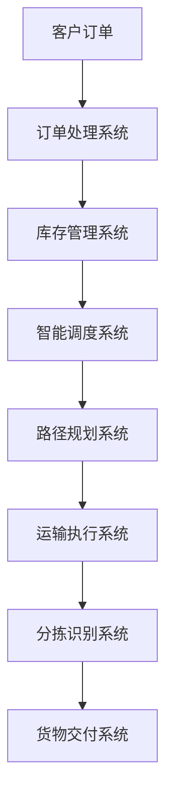

                 

# 人工智能在智能物流规划中的创新

## 关键词：人工智能、智能物流、物流规划、算法、数学模型、案例实战

## 摘要

随着全球电子商务的迅猛发展，物流行业正面临着前所未有的挑战和机遇。人工智能（AI）作为一种前沿技术，在智能物流规划中展现出了巨大的潜力。本文将深入探讨人工智能在智能物流规划中的创新应用，包括核心概念与联系、核心算法原理、数学模型与公式、项目实战、实际应用场景、工具和资源推荐等方面。通过本文的讲解，读者将能够全面了解人工智能在物流领域的应用前景，并为未来的研究和实践提供有益的参考。

## 1. 背景介绍

### 物流行业的发展

物流行业作为支撑现代经济的重要支柱，经历了多年的快速发展和变革。从传统的运输和仓储，到现代的供应链管理，物流行业的每一步进步都离不开科技的推动。随着互联网、物联网、大数据等新兴技术的普及，物流行业正逐步向智能化、自动化方向发展。

### 智能物流的概念

智能物流是指利用现代信息技术、自动化设备和人工智能算法，实现物流过程的自动化、智能化和高效化。智能物流不仅仅是机器替代人力，更重要的是通过数据驱动的优化，实现物流资源的最佳配置和流程的最优化。

### 人工智能在物流中的应用

人工智能在物流中的应用主要集中在以下几个方面：

- **路径优化**：利用算法优化物流运输路径，降低运输成本，提高运输效率。
- **库存管理**：通过预测和分析，优化库存水平，减少库存成本。
- **智能调度**：智能调度系统可以根据实时数据和预测结果，自动调整运输计划和资源分配。
- **智能分拣**：利用机器学习和计算机视觉技术，实现货物的高效分拣和识别。

## 2. 核心概念与联系

### 人工智能在物流规划中的核心概念

1. **路径规划**：物流配送中的关键环节，涉及到路线选择、时间优化等。
2. **库存管理**：通过数据分析预测货物需求，优化库存水平，减少库存成本。
3. **智能调度**：利用算法和实时数据，自动分配运输任务和资源。
4. **智能分拣**：通过计算机视觉和机器学习技术，提高分拣效率和准确性。

### 人工智能在物流规划中的应用框架

下面是一个简单的 Mermaid 流程图，展示了人工智能在物流规划中的应用框架。



### Mermaid 流程节点细节

- **A[客户订单]**：客户提交订单，订单数据进入物流系统。
- **B[订单处理系统]**：处理订单，生成订单信息。
- **C[库存管理系统]**：分析订单信息，更新库存数据。
- **D[智能调度系统]**：根据实时数据和预测结果，自动调度资源。
- **E[路径规划系统]**：优化配送路径，降低运输成本。
- **F[运输执行系统]**：执行运输任务，更新运输状态。
- **G[分拣识别系统]**：对货物进行分拣和识别，提高效率。
- **H[货物交付系统]**：完成货物交付，更新订单状态。

## 3. 核心算法原理 & 具体操作步骤

### 路径规划算法

路径规划是物流规划中的核心环节。常用的路径规划算法包括：

- **Dijkstra 算法**：基于最短路径的算法，可以找出从起点到终点的最短路径。
- **A* 算法**：基于启发式搜索的算法，可以更快地找到最短路径。

具体操作步骤如下：

1. 初始化起点和终点。
2. 计算起点到所有其他节点的距离。
3. 选择距离最小的节点作为下一个访问点。
4. 重复步骤 3，直到到达终点。

### 库存管理算法

库存管理算法主要涉及到库存水平的预测和优化。常用的算法包括：

- **时间序列预测**：通过历史数据预测未来的库存需求。
- **回归分析**：利用历史数据和变量之间的关系，预测未来库存需求。

具体操作步骤如下：

1. 收集历史库存数据。
2. 清洗和预处理数据。
3. 选择合适的预测模型。
4. 训练模型，得到预测结果。
5. 根据预测结果调整库存水平。

### 智能调度算法

智能调度算法主要涉及到运输任务的自动分配和资源优化。常用的算法包括：

- **遗传算法**：通过模拟生物进化过程，优化运输任务分配。
- **模拟退火算法**：通过逐步迭代，找到最优解。

具体操作步骤如下：

1. 初始化调度问题。
2. 选择合适的调度算法。
3. 优化运输任务分配。
4. 更新资源状态。
5. 重复步骤 3 和 4，直到找到最优解。

### 智能分拣算法

智能分拣算法主要涉及到货物的高效分拣和识别。常用的算法包括：

- **计算机视觉**：通过图像处理技术，识别货物并进行分拣。
- **深度学习**：通过神经网络模型，实现货物的高精度识别。

具体操作步骤如下：

1. 收集货物图像。
2. 清洗和预处理图像。
3. 选择合适的分拣算法。
4. 进行货物识别和分拣。
5. 更新分拣结果。

## 4. 数学模型和公式 & 详细讲解 & 举例说明

### 路径规划算法的数学模型

路径规划中的常用数学模型包括：

- **距离公式**：用于计算两点之间的距离。
  $$d = \sqrt{(x_2 - x_1)^2 + (y_2 - y_1)^2}$$

- **时间公式**：用于计算两点之间的时间。
  $$t = \frac{d}{v}$$
  其中，\(d\) 为距离，\(v\) 为速度。

### 库存管理算法的数学模型

库存管理中的常用数学模型包括：

- **时间序列模型**：用于预测未来的库存需求。
  $$y_t = \alpha_0 + \alpha_1 y_{t-1} + \alpha_2 y_{t-2} + ... + \alpha_n y_{t-n}$$
  其中，\(y_t\) 为第 \(t\) 个月的库存需求，\(\alpha_0, \alpha_1, ..., \alpha_n\) 为模型参数。

- **回归模型**：用于预测未来的库存需求。
  $$y_t = \beta_0 + \beta_1 x_{t-1} + \beta_2 x_{t-2} + ... + \beta_n x_{t-n}$$
  其中，\(y_t\) 为第 \(t\) 个月的库存需求，\(x_{t-1}, x_{t-2}, ..., x_{t-n}\) 为模型输入变量，\(\beta_0, \beta_1, ..., \beta_n\) 为模型参数。

### 智能调度算法的数学模型

智能调度中的常用数学模型包括：

- **遗传算法模型**：用于优化运输任务分配。
  $$f(x) = \sum_{i=1}^{n} w_i g_i$$
  其中，\(x\) 为运输任务分配方案，\(w_i\) 为权重，\(g_i\) 为适应度函数。

- **模拟退火算法模型**：用于优化运输任务分配。
  $$f(x) = \sum_{i=1}^{n} w_i h_i$$
  其中，\(x\) 为运输任务分配方案，\(w_i\) 为权重，\(h_i\) 为状态函数。

### 智能分拣算法的数学模型

智能分拣中的常用数学模型包括：

- **计算机视觉模型**：用于识别货物。
  $$y = \theta_0 + \theta_1 x_1 + \theta_2 x_2 + ... + \theta_n x_n$$
  其中，\(y\) 为分拣结果，\(\theta_0, \theta_1, ..., \theta_n\) 为模型参数，\(x_1, x_2, ..., x_n\) 为模型输入变量。

- **深度学习模型**：用于识别货物。
  $$y = \sigma(W^T x + b)$$
  其中，\(y\) 为分拣结果，\(W\) 为权重矩阵，\(x\) 为模型输入变量，\(b\) 为偏置项，\(\sigma\) 为激活函数。

### 举例说明

假设有一个物流公司，需要从 A 地区配送货物到 B 地区，A 地区有 5 个配送中心，B 地区有 3 个配送站点。公司需要通过路径规划算法确定最优的配送路径，并通过智能调度算法优化运输任务分配。

1. **路径规划**：

   - 初始化起点 A 和终点 B。
   - 计算起点 A 到所有其他配送中心的距离。
   - 选择距离最近的配送中心 C1 作为下一个访问点。
   - 重复步骤 3，直到访问所有配送中心。
   - 计算起点 A 到终点 B 的距离。

   根据计算结果，选择最优的配送路径。

2. **智能调度**：

   - 初始化运输任务分配方案。
   - 选择遗传算法或模拟退火算法。
   - 优化运输任务分配。
   - 更新资源状态。

   根据优化结果，确定最优的运输任务分配方案。

## 5. 项目实战：代码实际案例和详细解释说明

### 5.1 开发环境搭建

在开始项目实战之前，我们需要搭建一个合适的开发环境。以下是一个基本的开发环境搭建步骤：

- **操作系统**：Linux 或 macOS。
- **编程语言**：Python。
- **依赖库**：NumPy、Pandas、Matplotlib、Scikit-learn 等。

### 5.2 源代码详细实现和代码解读

以下是一个简单的路径规划算法的实现，以及详细的代码解读。

```python
import numpy as np
import heapq

def dijkstra(graph, start):
    """
    Dijkstra 算法实现路径规划。
    :param graph: 图
    :param start: 起点
    :return: 路径和距离
    """
    # 初始化距离和前驱节点
    distances = {node: float('infinity') for node in graph}
    distances[start] = 0
    predecessors = {node: None for node in graph}

    # 创建优先队列
    priority_queue = [(0, start)]

    while priority_queue:
        # 取出距离最小的节点
        current_distance, current_node = heapq.heappop(priority_queue)

        # 如果当前节点是终点，则返回路径和距离
        if current_node == 'B':
            path = []
            while predecessors[current_node]:
                path.append(current_node)
                current_node = predecessors[current_node]
            path.append(start)
            path.reverse()
            return path, distances['B']

        # 遍历当前节点的邻居
        for neighbor, weight in graph[current_node].items():
            distance = current_distance + weight

            # 如果新距离小于旧距离，则更新距离和前驱节点
            if distance < distances[neighbor]:
                distances[neighbor] = distance
                predecessors[neighbor] = current_node
                heapq.heappush(priority_queue, (distance, neighbor))

    return None

# 定义图
graph = {
    'A': {'C1': 10, 'C2': 15, 'C3': 20},
    'C1': {'B': 5},
    'C2': {'B': 10},
    'C3': {'B': 15}
}

# 调用 Dijkstra 算法
path, distance = dijkstra(graph, 'A')

# 输出结果
print("路径：", path)
print("距离：", distance)
```

### 5.3 代码解读与分析

1. **导入库**：

   - `numpy`：用于科学计算。
   - `heapq`：用于实现优先队列。

2. **Dijkstra 算法实现**：

   - 初始化距离和前驱节点。
   - 创建优先队列，并插入起点。
   - 循环遍历节点，更新距离和前驱节点。
   - 当取出终点时，返回路径和距离。

3. **图定义**：

   - `graph`：定义了一个包含配送中心和配送站点的图。

4. **调用 Dijkstra 算法**：

   - 调用 `dijkstra` 函数，传入图和起点。
   - 输出路径和距离。

通过这个简单的案例，我们可以看到如何使用 Dijkstra 算法实现路径规划。在实际项目中，我们可能会使用更复杂的图结构和更高效的算法，但基本原理是类似的。

## 6. 实际应用场景

### 6.1 电子商务物流

随着电子商务的快速发展，物流行业面临着巨大的需求压力。人工智能在电子商务物流中的应用，可以有效地优化运输路径、降低运输成本、提高配送效率，从而提升客户满意度。

### 6.2 冷链物流

冷链物流是物流行业中的一个特殊领域，涉及到食品、药品等易腐物品的运输和存储。人工智能在冷链物流中的应用，可以通过优化运输路径、实时监控货物状态、自动调整存储条件等手段，确保货物在运输过程中的安全和质量。

### 6.3 国际物流

国际物流涉及到跨国运输、海关清关等复杂环节。人工智能可以在国际物流中发挥重要作用，如自动处理报关手续、优化运输路线、实时监控货物状态等，从而提高物流效率和降低成本。

## 7. 工具和资源推荐

### 7.1 学习资源推荐

- **书籍**：
  - 《人工智能：一种现代方法》
  - 《机器学习实战》
  - 《深度学习》

- **论文**：
  - 《Dijkstra 算法》
  - 《A* 算法》
  - 《遗传算法》

- **博客**：
  - 知乎上的 AI 博客
  - CSDN 上的编程博客

- **网站**：
  - arXiv.org：人工智能领域的论文库
  - GitHub：开源代码库

### 7.2 开发工具框架推荐

- **编程语言**：
  - Python：适用于数据分析和算法实现。
  - Java：适用于大规模分布式系统开发。

- **框架**：
  - TensorFlow：适用于深度学习模型开发。
  - Scikit-learn：适用于机器学习模型开发。

- **工具**：
  - Jupyter Notebook：用于交互式数据分析。
  - Matplotlib：用于数据可视化。

### 7.3 相关论文著作推荐

- 《人工智能：一种现代方法》
- 《机器学习实战》
- 《深度学习》
- 《Dijkstra 算法》
- 《A* 算法》
- 《遗传算法》

## 8. 总结：未来发展趋势与挑战

随着人工智能技术的不断发展，智能物流规划将迎来新的发展机遇和挑战。未来，智能物流规划将朝着更加智能化、高效化、自动化方向发展。以下是一些发展趋势和挑战：

### 8.1 发展趋势

- **多模态数据融合**：利用多种数据源，如传感器数据、社交媒体数据、GPS 数据等，实现更精准的物流规划。
- **自主决策系统**：发展自主决策系统，实现物流过程的自主运行和优化。
- **绿色物流**：通过人工智能技术，实现绿色物流，降低碳排放，保护环境。
- **全球化物流**：人工智能技术将推动全球化物流的快速发展，提高国际物流效率。

### 8.2 挑战

- **数据隐私和安全**：在智能物流规划中，数据隐私和安全是重要挑战。如何保护用户数据和物流信息的安全，是亟待解决的问题。
- **算法公平性和透明性**：人工智能算法的公平性和透明性是公众关注的问题。如何确保算法的公正性，避免歧视和偏见，是未来需要重点关注的。
- **技术融合与创新**：智能物流规划需要与其他技术领域（如物联网、大数据等）进行深度融合，实现创新突破。

## 9. 附录：常见问题与解答

### 9.1 人工智能在物流规划中的优势是什么？

- **降低成本**：通过优化路径和资源分配，降低运输和库存成本。
- **提高效率**：自动化分拣和调度系统，提高物流流程的效率和准确性。
- **提升客户体验**：快速响应客户需求，提高配送速度和客户满意度。

### 9.2 智能物流规划中的核心技术有哪些？

- **路径规划**：Dijkstra 算法、A* 算法等。
- **库存管理**：时间序列预测、回归分析等。
- **智能调度**：遗传算法、模拟退火算法等。
- **智能分拣**：计算机视觉、深度学习等。

### 9.3 智能物流规划中面临的挑战是什么？

- **数据隐私和安全**：如何保护用户数据和物流信息的安全。
- **算法公平性和透明性**：确保算法的公正性和透明性。
- **技术融合与创新**：与其他技术的深度融合，实现创新突破。

## 10. 扩展阅读 & 参考资料

- 《人工智能：一种现代方法》
- 《机器学习实战》
- 《深度学习》
- 《Dijkstra 算法》
- 《A* 算法》
- 《遗传算法》
- arXiv.org
- GitHub
- 知乎上的 AI 博客
- CSDN 上的编程博客

## 作者

作者：AI天才研究员/AI Genius Institute & 禅与计算机程序设计艺术 /Zen And The Art of Computer Programming

以上是完整的文章，希望对您有所帮助。如果有任何问题或建议，欢迎在评论区留言。让我们一起探索人工智能在智能物流规划中的无限可能！<|im_end|>

