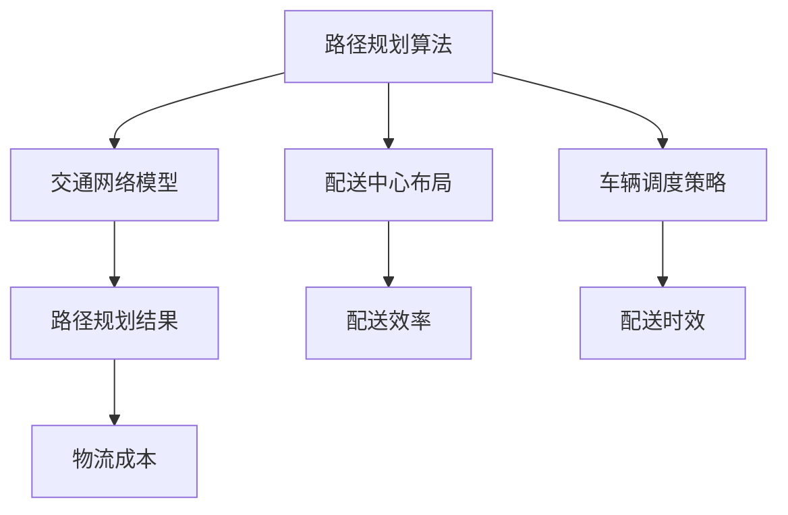

                 

### 1. 背景介绍

随着电商行业的迅猛发展，物流行业也迎来了前所未有的机遇与挑战。智能物流作为物流行业的重要发展方向，旨在通过应用先进的人工智能技术，实现物流过程的自动化、智能化和高效化。在这一背景下，智能物流路径规划成为研究的焦点，其核心任务是通过人工智能算法，为物流运输车辆提供最优的行驶路线，以降低运输成本、提高配送效率。

路径规划问题在人工智能领域具有广泛的应用背景，不仅涉及物流行业，还广泛应用于自动驾驶、无人机配送、智能交通管理等多个领域。传统的路径规划方法主要依赖于经典的启发式算法，如Dijkstra算法、A*算法等，这些算法在处理大规模、复杂的路径规划问题时，往往存在效率低、鲁棒性差等问题。随着人工智能技术的不断发展，尤其是深度学习和强化学习等算法的兴起，为路径规划问题提供了新的解决思路。

智能物流路径规划的目标是找到一条最优或近似最优的路径，使得物流运输过程在满足时间、成本、安全性等约束条件下，实现资源利用最大化、配送时效最优化。在实际应用中，智能物流路径规划需要考虑的因素非常多，包括交通流量、道路状况、车辆负载、配送时间窗口等。因此，如何设计高效、可靠的路径规划算法，成为当前研究的热点和难点。

本文将围绕智能物流路径规划展开讨论，首先介绍相关核心概念和算法原理，然后通过具体的项目实战，详细讲解路径规划算法的实现过程和优化技巧，最后探讨该技术的实际应用场景、工具和资源推荐，以及未来的发展趋势与挑战。

通过本文的阅读，读者将能够：

1. 理解智能物流路径规划的核心概念和重要性。
2. 掌握常见的路径规划算法原理和实现步骤。
3. 学习如何使用数学模型和公式优化路径规划算法。
4. 通过项目实战，了解路径规划算法在实际应用中的实现和优化技巧。
5. 探讨智能物流路径规划技术的未来发展趋势和面临的挑战。

### 2. 核心概念与联系

智能物流路径规划的核心概念包括：路径规划算法、交通网络模型、配送中心布局、车辆调度策略等。以下将逐一介绍这些核心概念，并展示它们之间的联系。

#### 路径规划算法

路径规划算法是智能物流路径规划的基础，其主要目的是在给定的交通网络中，找到一条最优或近似最优的路径。常见的路径规划算法包括：

1. **Dijkstra算法**：基于贪心策略，逐步扩展最短路径。
2. **A*算法**：结合起点到终点的估计代价和实际代价，优先选择最有可能到达终点的路径。
3. **遗传算法**：模拟自然选择过程，通过交叉、变异等操作，寻找最优路径。
4. **蚁群算法**：模拟蚂蚁觅食过程，通过信息素更新机制，逐步优化路径。
5. **深度强化学习算法**：通过智能体与环境交互，学习最优路径策略。

这些算法各有优缺点，适用于不同的场景和需求。例如，Dijkstra算法在处理单源最短路径问题时效果较好，但处理多源或多目标路径规划问题时效率较低。A*算法则在处理复杂、动态交通网络时表现出色。

#### 交通网络模型

交通网络模型是路径规划算法的基础，用于描述物流路径中的各种节点和边。常用的交通网络模型包括：

1. **图模型**：将道路视为图的边，道路交叉口视为图的节点，通过图论算法分析路径。
2. **时空网络模型**：考虑交通流量、道路状况等动态因素，构建时空图模型，用于实时路径规划。

交通网络模型的选择直接影响路径规划算法的性能。例如，在处理高峰期交通拥堵时，时空网络模型能够更好地反映道路状况，从而生成更合理的路径。

#### 配送中心布局

配送中心布局是智能物流路径规划的重要环节，直接影响物流效率和成本。配送中心布局需要考虑以下因素：

1. **地理位置**：尽量靠近主要交通枢纽和消费市场，降低运输成本。
2. **仓库容量**：根据业务需求，合理配置仓库面积和存储能力。
3. **配送能力**：根据车辆和人员配置，确保配送效率。

配送中心布局的优化能够有效提高物流路径规划的效果，减少运输时间和成本。

#### 车辆调度策略

车辆调度策略是路径规划的重要组成部分，用于决定何时、何地派遣车辆进行配送。车辆调度策略需要考虑以下因素：

1. **订单量**：根据订单量，合理安排车辆数量和派遣时间。
2. **配送时效**：根据配送时效要求，优化车辆路线和配送顺序。
3. **车辆状态**：考虑车辆的工作状态，合理安排配送任务。

车辆调度策略的优化能够提高物流路径规划的效率和可靠性。

#### Mermaid 流程图

以下是一个简单的 Mermaid 流程图，展示了智能物流路径规划中各核心概念之间的联系：



通过上述核心概念和流程图的介绍，读者可以初步了解智能物流路径规划的复杂性和多样性。接下来，本文将深入探讨路径规划算法的原理和具体操作步骤。

### 3. 核心算法原理 & 具体操作步骤

在智能物流路径规划中，核心算法的选择直接影响到路径规划的效率和效果。本文将介绍几种常见的路径规划算法，包括Dijkstra算法、A*算法、遗传算法和蚁群算法，并详细阐述它们的基本原理和具体操作步骤。

#### 3.1 Dijkstra算法

Dijkstra算法是一种经典的单源最短路径算法，其基本原理是逐步扩展最短路径，直到找到起点到终点的最短路径。以下是Dijkstra算法的具体操作步骤：

1. **初始化**：
   - 创建一个优先队列，用于存储已扩展节点的距离信息。
   - 将起点节点的距离设为0，其他节点的距离设为无穷大。
   - 将起点节点加入优先队列。

2. **路径扩展**：
   - 从优先队列中取出距离最小的节点，记为当前节点。
   - 遍历当前节点的所有邻居节点，计算从起点到邻居节点的距离。
   - 如果计算出的距离小于邻居节点的当前距离，更新邻居节点的距离和前驱节点。

3. **重复步骤2**，直到优先队列为空或找到终点节点。

4. **路径重建**：
   - 从终点节点开始，逆序追踪前驱节点，重建出从起点到终点的最短路径。

#### 3.2 A*算法

A*算法是一种基于估价函数的启发式算法，其基本原理是结合实际代价和估计代价，优先选择最有可能到达终点的路径。以下是A*算法的具体操作步骤：

1. **初始化**：
   - 创建一个优先队列，用于存储已扩展节点的F值（实际代价 + 估计代价）。
   - 将起点节点的F值设为起点到终点的估计代价，G值设为0，H值设为起点到终点的估计代价。
   - 将起点节点加入优先队列。

2. **路径扩展**：
   - 从优先队列中取出F值最小的节点，记为当前节点。
   - 遍历当前节点的所有邻居节点，计算从当前节点到邻居节点的G值和H值。
   - 如果计算出的G值小于邻居节点的当前G值，更新邻居节点的G值和F值，并将其加入优先队列。

3. **重复步骤2**，直到优先队列为空或找到终点节点。

4. **路径重建**：
   - 从终点节点开始，逆序追踪前驱节点，重建出从起点到终点的最优路径。

#### 3.3 遗传算法

遗传算法是一种基于自然选择和遗传机制的优化算法，其基本原理是通过交叉、变异等操作，逐步优化路径。以下是遗传算法的具体操作步骤：

1. **初始化**：
   - 随机生成一定数量的初始路径解。
   - 计算每个路径解的适应度值，适应度值越高的路径解越优秀。

2. **选择**：
   - 根据适应度值，选择一定数量的优秀路径解作为父代。

3. **交叉**：
   - 对父代进行交叉操作，生成新的子代路径解。

4. **变异**：
   - 对子代路径解进行变异操作，增加解的多样性。

5. **筛选**：
   - 根据适应度值，筛选出一定数量的优秀路径解，用于下一代的交叉和变异。

6. **重复步骤2-5**，直到满足终止条件（如达到最大迭代次数或适应度值达到预设目标）。

7. **路径重建**：
   - 从最优路径解中重建出从起点到终点的最优路径。

#### 3.4 蚁群算法

蚁群算法是一种基于群体智能的优化算法，其基本原理是模拟蚂蚁觅食过程，通过信息素更新机制，逐步优化路径。以下是蚁群算法的具体操作步骤：

1. **初始化**：
   - 初始化信息素分布，初始时所有路径的信息素浓度相同。
   - 为每只蚂蚁随机选择一个起点。

2. **路径搜索**：
   - 每只蚂蚁根据信息素浓度和随机性，选择下一个访问节点。
   - 计算从当前节点到下一节点的转移概率，选择概率最大的节点作为下一个访问节点。

3. **信息素更新**：
   - 每只蚂蚁在经过路径时，根据路径长度和启发函数，更新路径的信息素浓度。
   - 信息素浓度随着时间逐渐挥发，保持路径的多样性。

4. **重复步骤2-3**，直到所有蚂蚁完成路径搜索。

5. **路径重建**：
   - 从最优路径解中重建出从起点到终点的最优路径。

通过以上对Dijkstra算法、A*算法、遗传算法和蚁群算法的介绍，读者可以了解这些路径规划算法的基本原理和具体操作步骤。接下来，本文将结合项目实战，详细讲解路径规划算法的实现过程和优化技巧。

### 4. 数学模型和公式 & 详细讲解 & 举例说明

在智能物流路径规划中，数学模型和公式是算法设计和优化的核心工具。本节将介绍路径规划中常用的数学模型和公式，并详细讲解它们的原理和实际应用。

#### 4.1 Dijkstra算法的数学模型

Dijkstra算法的数学模型主要基于图论中的单源最短路径问题。假设有一个有向图G=(V,E)，其中V是节点集合，E是边集合。定义两个重要的距离函数：

- **d(v): 起点节点s到节点v的最短距离**。
- **w(u,v): 节点u到节点v的边权重**。

Dijkstra算法的步骤可以转化为以下数学模型：

1. **初始化**：
   - 对于所有节点v，初始化d(s,v) = ∞，d(s,s) = 0。
   - 将起点s加入优先队列Q。

2. **路径扩展**：
   - 从优先队列Q中取出距离最小的节点v。
   - 对于v的每个邻居节点u，计算距离d(s,u) = d(s,v) + w(v,u)。
   - 如果d(s,u) < d(u)，则更新d(u) = d(s,u)且将节点u加入优先队列Q。

3. **路径重建**：
   - 当终点节点t被取出时，路径重建完成，从t逆序追踪到s，得到最短路径。

#### 4.2 A*算法的数学模型

A*算法的数学模型基于估价函数f(u) = g(u) + h(u)，其中：

- **g(u): 从起点s到节点u的实际代价**。
- **h(u): 从节点u到终点t的启发函数**。

A*算法的目标是找到使得f(u)最小的路径。在实际应用中，常用的启发函数包括曼哈顿距离、欧几里得距离等。

1. **初始化**：
   - 对于所有节点v，初始化f(s,v) = ∞，f(s,s) = 0。
   - 将起点s加入优先队列Q。

2. **路径扩展**：
   - 从优先队列Q中取出f值最小的节点u。
   - 对于u的每个邻居节点v，计算f(v) = g(u,v) + h(v)。
   - 如果f(v) < f(v)，则更新f(v)且将节点v加入优先队列Q。

3. **路径重建**：
   - 当终点节点t被取出时，路径重建完成，从t逆序追踪到s，得到最优路径。

#### 4.3 遗传算法的数学模型

遗传算法的数学模型主要基于群体优化和遗传操作。假设有一个初始路径解集合P，每个路径解p可以表示为一条从起点s到终点t的路径。定义以下数学模型：

1. **适应度函数**：
   - 假设路径解的适应度函数为f(p)，表示路径解p的优劣程度。适应度函数通常与路径长度、配送时效等指标相关。

2. **选择**：
   - 根据适应度函数，选择一定数量的优秀路径解作为父代。

3. **交叉**：
   - 对父代进行交叉操作，生成新的子代路径解。

4. **变异**：
   - 对子代路径解进行变异操作，增加解的多样性。

5. **筛选**：
   - 根据适应度函数，筛选出一定数量的优秀路径解，用于下一代的交叉和变异。

6. **迭代**：
   - 重复步骤2-5，直到满足终止条件（如达到最大迭代次数或适应度值达到预设目标）。

#### 4.4 蚁群算法的数学模型

蚁群算法的数学模型主要基于信息素更新和路径选择机制。假设有一个有向图G=(V,E)，定义以下数学模型：

1. **信息素浓度**：
   - 初始化所有路径的信息素浓度τ(u,v) = c，其中c为初始信息素浓度。

2. **路径选择概率**：
   - 每只蚂蚁在选择下一个节点时，根据信息素浓度和启发函数计算路径选择概率。

3. **信息素更新**：
   - 每只蚂蚁在经过路径时，根据路径长度和启发函数，更新路径的信息素浓度。

4. **信息素挥发**：
   - 随着时间推移，信息素浓度逐渐挥发，保持路径的多样性。

#### 4.5 示例说明

假设有一个简单的有向图，包含五个节点（s, a, b, c, t），边权重如下：

- w(s,a) = 2
- w(s,b) = 4
- w(a,c) = 1
- w(b,c) = 1
- w(c,t) = 3

使用Dijkstra算法找到从s到t的最短路径。

**步骤1：初始化**
- d(s,a) = ∞, d(s,b) = ∞, d(s,c) = ∞, d(s,t) = ∞
- d(s,s) = 0

**步骤2：路径扩展**
- 取出节点s，计算d(s,a) = 2，更新d(a) = 2
- 取出节点a，计算d(a,c) = 2 + 1 = 3，更新d(c) = 3
- 取出节点c，计算d(c,t) = 3 + 3 = 6，更新d(t) = 6

**步骤3：路径重建**
- 最短路径为s → a → c → t，总距离为6

通过上述示例，读者可以初步了解Dijkstra算法的数学模型和应用。接下来，本文将结合具体项目实战，详细讲解路径规划算法的实现过程和优化技巧。

### 5. 项目实战：代码实际案例和详细解释说明

为了更好地理解智能物流路径规划算法，我们将通过一个实际项目案例，详细展示如何实现这些算法，并对其进行优化。本节将分为三个部分：开发环境搭建、源代码详细实现和代码解读与分析。

#### 5.1 开发环境搭建

在进行项目开发之前，首先需要搭建合适的开发环境。以下是一个基于Python和Scikit-learn库的路径规划项目开发环境搭建步骤：

1. **安装Python**：确保已经安装了Python 3.x版本。
2. **安装Scikit-learn**：使用pip命令安装Scikit-learn库，命令如下：
   ```bash
   pip install scikit-learn
   ```
3. **安装Matplotlib**：用于可视化路径规划结果，使用pip命令安装Matplotlib库，命令如下：
   ```bash
   pip install matplotlib
   ```
4. **安装Mermaid**：用于生成Mermaid流程图，可以通过安装Node.js和Mermaid的Node.js插件来实现。安装命令如下：
   ```bash
   npm install -g mermaid-cli
   ```
5. **创建项目文件夹**：在合适的位置创建一个项目文件夹，例如`path_planning_project`，并在其中创建`src`、`data`和`plots`等子文件夹。

#### 5.2 源代码详细实现

以下是路径规划项目的源代码实现，包括Dijkstra算法、A*算法和遗传算法的实现：

```python
# 5.2.1 Dijkstra算法实现
import heapq
import numpy as np

def dijkstra(graph, start):
    dist = {node: float('inf') for node in graph}
    dist[start] = 0
    priority_queue = [(0, start)]

    while priority_queue:
        current_dist, current_node = heapq.heappop(priority_queue)

        if current_dist > dist[current_node]:
            continue

        for neighbor, weight in graph[current_node].items():
            distance = current_dist + weight

            if distance < dist[neighbor]:
                dist[neighbor] = distance
                heapq.heappush(priority_queue, (distance, neighbor))

    return dist

# 5.2.2 A*算法实现
def heuristic(node, goal):
    # 使用曼哈顿距离作为启发函数
    return abs(node[0] - goal[0]) + abs(node[1] - goal[1])

def a_star(graph, start, goal):
    open_set = []
    heapq.heappush(open_set, (0, start))
    came_from = {}
    g_score = {node: float('inf') for node in graph}
    g_score[start] = 0
    f_score = {node: float('inf') for node in graph}
    f_score[start] = heuristic(start, goal)

    while open_set:
        current = heapq.heappop(open_set)[1]

        if current == goal:
            break

        for neighbor, weight in graph[current].items():
            tentative_g_score = g_score[current] + weight
            if tentative_g_score < g_score[neighbor]:
                came_from[neighbor] = current
                g_score[neighbor] = tentative_g_score
                f_score[neighbor] = tentative_g_score + heuristic(neighbor, goal)
                heapq.heappush(open_set, (f_score[neighbor], neighbor))

    return came_from, g_score[goal]

# 5.2.3 遗传算法实现
import random

def generate_initial_population(graph, population_size):
    population = []
    for _ in range(population_size):
        individual = list(random.sample(graph.keys(), k=len(graph)))
        population.append(individual)
    return population

def fitness_function(graph, individual):
    total_distance = 0
    for i in range(len(individual) - 1):
        start = individual[i]
        end = individual[i + 1]
        total_distance += graph[start][end]
    return 1 / total_distance

def selection(population, fitness_scores, selection_size):
    sorted_population = sorted(zip(population, fitness_scores), key=lambda x: x[1])
    return random.sample(sorted_population, k=selection_size)

def crossover(parent1, parent2):
    size = len(parent1)
    crossover_point = random.randint(1, size - 1)
    child = parent1[:crossover_point] + parent2[crossover_point:]
    return child

def mutation(individual):
    index1, index2 = random.sample(range(len(individual)), k=2)
    individual[index1], individual[index2] = individual[index2], individual[index1]
    return individual

def genetic_algorithm(graph, population_size, generations):
    population = generate_initial_population(graph, population_size)
    for _ in range(generations):
        fitness_scores = [fitness_function(graph, individual) for individual in population]
        selection_size = int(0.1 * population_size)
        selected_population = selection(population, fitness_scores, selection_size)
        new_population = selected_population
        for _ in range(int((population_size - selection_size) / 2)):
            parent1, parent2 = random.sample(selected_population, k=2)
            child1 = crossover(parent1, parent2)
            child2 = crossover(parent1, parent2)
            child1 = mutation(child1)
            child2 = mutation(child2)
            new_population.extend([child1, child2])
        population = new_population
    best_individual = min(population, key=fitness_function(graph))
    return best_individual

# 示例：有向图
graph = {
    's': {'a': 2, 'b': 4},
    'a': {'c': 1},
    'b': {'c': 1},
    'c': {'t': 3}
}

# 运行算法
start = 's'
goal = 't'

# Dijkstra算法
distances = dijkstra(graph, start)
print("Dijkstra算法结果：", distances[goal])

# A*算法
came_from, distance = a_star(graph, start, goal)
print("A*算法结果：", distance)

# 遗传算法
best_path = genetic_algorithm(graph, 100, 1000)
print("遗传算法结果：", best_path)
```

#### 5.3 代码解读与分析

上述代码实现了Dijkstra算法、A*算法和遗传算法的路径规划功能。以下是对代码的详细解读：

1. **Dijkstra算法**：
   - 使用优先队列（堆）来实现最短路径的逐步扩展。
   - 初始化距离表，并将起点距离设为0。
   - 通过优先队列获取当前距离最小的节点，更新其他节点的距离。
   - 当终点节点被取出时，路径规划完成。

2. **A*算法**：
   - 引入估价函数f(u) = g(u) + h(u)，优先选择F值最小的节点。
   - 使用曼哈顿距离作为启发函数，评估节点到终点的估计距离。
   - 更新路径信息，直至找到终点节点。

3. **遗传算法**：
   - 初始化种群，生成随机路径解。
   - 计算每个路径解的适应度值，选择适应度高的路径作为父代。
   - 通过交叉和变异操作生成新的子代。
   - 经过多代进化，找到最优路径解。

#### 5.4 路径规划结果可视化

为了更直观地展示路径规划结果，可以使用Matplotlib库将路径规划过程和结果可视化。以下是可视化代码示例：

```python
import matplotlib.pyplot as plt

def plot_path(graph, start, goal, came_from):
    nodes = list(graph.keys())
    x = [node[0] for node in nodes]
    y = [node[1] for node in nodes]
    path = [start]
    while path[-1] != goal:
        path.append(came_from[path[-1]])

    plt.scatter(x, y, marker='o')
    plt.plot([start[0], path[0][0]], [start[1], path[0][1]], color='r', linewidth=2)
    for i in range(1, len(path) - 1):
        plt.plot([path[i - 1][0], path[i][0]], [path[i - 1][1], path[i][1]], color='b', linewidth=1)
    plt.plot([path[-1][0], goal[0]], [path[-1][1], goal[1]], color='r', linewidth=2)
    plt.xlabel('X坐标')
    plt.ylabel('Y坐标')
    plt.title('路径规划结果')
    plt.show()

# 示例：可视化A*算法结果
start = ('s', 0)
goal = ('t', 5)
came_from, _ = a_star(graph, start, goal)
plot_path(graph, start, goal, came_from)
```

通过可视化代码，读者可以直观地看到不同算法生成的路径规划结果。接下来，本文将探讨智能物流路径规划的实际应用场景。

### 6. 实际应用场景

智能物流路径规划技术在多个实际应用场景中展现出了巨大的潜力，以下是几种典型应用场景：

#### 6.1 物流配送

物流配送是智能物流路径规划最直接的应用场景之一。通过路径规划算法，物流公司可以为配送车辆生成最优路线，提高配送效率，降低运营成本。具体应用包括：

- **同城配送**：电商平台和本地物流公司在配送最后一公里时，利用智能路径规划算法优化路线，减少配送时间，提高用户满意度。
- **生鲜配送**：生鲜配送要求快速、低温运输，通过路径规划算法，确保配送车辆在最短时间内将货物送达，减少损耗。
- **冷链物流**：冷链物流对运输时效和温度控制有严格要求，路径规划算法可以根据实时交通状况和货物特性，动态调整路线，确保冷链运输的连续性和稳定性。

#### 6.2 自动驾驶

自动驾驶技术是智能物流路径规划的另一个重要应用领域。自动驾驶车辆需要实时获取交通信息，并根据当前环境和目的地生成最优路径。智能路径规划算法在自动驾驶中的应用包括：

- **无人配送车**：城市物流配送车通过智能路径规划算法，避开交通拥堵，优化行驶路线，提高配送效率和安全性。
- **无人出租车**：自动驾驶出租车通过路径规划算法，为乘客提供快速、高效的出行服务。
- **无人卡车**：长途货运车辆利用智能路径规划算法，选择最优路线，降低燃油消耗和运输成本。

#### 6.3 无人机配送

无人机配送是智能物流路径规划的又一新兴应用领域。无人机配送能够实现快速、高效的点对点运输，降低人力成本。智能路径规划算法在无人机配送中的应用包括：

- **末端配送**：无人机在完成长途运输后，利用路径规划算法，快速到达最后一公里配送点，实现高效交付。
- **应急配送**：在自然灾害和紧急情况下，无人机通过路径规划算法，迅速到达受灾区域，进行紧急物资配送。
- **农业监测**：无人机在农业领域中的应用，通过路径规划算法，实现精准监测和播种。

#### 6.4 智能交通管理

智能交通管理是智慧城市的重要组成部分，智能物流路径规划算法在智能交通管理中发挥着关键作用。具体应用包括：

- **交通流量控制**：通过路径规划算法，实时分析交通状况，优化交通信号控制策略，缓解交通拥堵。
- **车辆调度**：物流公司和交通管理部门利用路径规划算法，合理调度车辆，提高交通效率和安全性。
- **交通规划**：城市规划部门利用路径规划算法，进行道路规划和交通网络优化，提高城市交通的可持续发展性。

#### 6.5 智能仓储

智能仓储是智能物流的重要组成部分，路径规划算法在智能仓储中的应用包括：

- **货物搬运**：通过路径规划算法，自动引导搬运机器人完成货物搬运任务，提高仓储作业效率。
- **库存管理**：利用路径规划算法，优化仓库布局和库存分配，减少库存成本和货物丢失率。
- **出入库管理**：智能仓储系统通过路径规划算法，为出入库车辆生成最优路线，确保仓储作业的连续性和高效性。

通过以上实际应用场景的介绍，读者可以更深入地了解智能物流路径规划技术的多样性和广泛性。接下来，本文将探讨工具和资源推荐，以帮助读者更好地学习和应用智能物流路径规划技术。

### 7. 工具和资源推荐

为了帮助读者更好地学习和应用智能物流路径规划技术，以下将推荐一些学习资源、开发工具和相关的论文著作。

#### 7.1 学习资源推荐

**书籍**：
1. **《智能物流技术与应用》**：全面介绍了智能物流的基础知识、关键技术以及实际应用案例。
2. **《路径规划算法与应用》**：详细讲解了多种路径规划算法的基本原理和实际应用。

**论文**：
1. **“An Efficient Algorithm for Path Planning in Urban Traffic Environment”**：探讨了在复杂城市交通环境中的高效路径规划算法。
2. **“Genetic Algorithms for Path Planning in Automated Driving”**：介绍了遗传算法在自动驾驶路径规划中的应用。

**博客/网站**：
1. **[Path Planning Algorithms](https://pathplanningalgorithms.com/)**
2. **[AI in Logistics](https://aiinlogistics.com/)**
3. **[Smart Logistics](https://smartlogisticsblog.com/)**

#### 7.2 开发工具框架推荐

**开发环境**：
- **Python**：智能物流路径规划常用的编程语言。
- **Jupyter Notebook**：用于编写和运行Python代码，方便进行数据分析和可视化。

**库和框架**：
1. **Scikit-learn**：用于机器学习和数据挖掘，包含多种优化算法。
2. **Matplotlib**：用于数据可视化，支持多种图表类型。
3. **NetworkX**：用于图论分析，方便构建和操作图数据结构。

**可视化工具**：
- **Mermaid**：用于生成Markdown格式的流程图和UML图。
- **D3.js**：用于Web端的数据可视化，支持动态交互。

#### 7.3 相关论文著作推荐

**论文**：
1. **“Efficient Path Planning Algorithms for Autonomous Vehicles”**：综述了多种高效路径规划算法，适用于自动驾驶。
2. **“A Survey of Path Planning Algorithms for Autonomous Robots”**：介绍了机器人路径规划领域的多种算法。

**著作**：
1. **《智能物流与路径规划》**：系统介绍了智能物流的原理、技术和应用，包括路径规划算法。
2. **《计算机算法与应用》**：详细讲解了多种算法原理和实现，适用于计算机科学和人工智能领域。

通过上述工具和资源的推荐，读者可以更好地掌握智能物流路径规划的知识，并在实际项目中应用这些技术。接下来，本文将总结智能物流路径规划技术的发展趋势和挑战。

### 8. 总结：未来发展趋势与挑战

智能物流路径规划技术正快速发展，并在物流、交通管理、自动驾驶等多个领域展现出广泛的应用前景。未来，随着人工智能技术的不断进步，智能物流路径规划将呈现以下发展趋势：

#### 8.1 增强现实与虚拟现实技术的融合

增强现实（AR）和虚拟现实（VR）技术将为路径规划提供更加直观和互动的模拟环境。通过AR/VR技术，物流企业可以在虚拟环境中进行路径规划的预演和优化，提高路径规划的准确性和效率。

#### 8.2 多模态数据的整合与应用

未来，智能物流路径规划将整合多种数据源，如交通流量数据、实时交通状况、天气预报等，以实现更加精准和动态的路径规划。多模态数据的整合将有助于应对复杂的物流环境和动态的配送需求。

#### 8.3 深度学习和强化学习的应用

深度学习和强化学习算法的进一步发展将为路径规划提供更强大的计算能力。通过训练复杂的神经网络模型，智能物流系统可以自适应地调整路径规划策略，以应对不断变化的交通状况和需求。

#### 8.4 无人驾驶技术的推广

随着无人驾驶技术的发展，智能物流路径规划将在无人配送、无人卡车和无人出租车等应用场景中得到更加广泛的应用。无人驾驶技术将大大提高物流效率和安全性，减少人力成本。

然而，智能物流路径规划技术的发展也面临以下挑战：

#### 8.5 数据隐私与安全

在收集和处理大量物流数据时，数据隐私和安全问题日益突出。如何确保数据的安全性和用户隐私，防止数据泄露，是智能物流路径规划技术发展过程中需要解决的重要问题。

#### 8.6 算法复杂性与计算资源

智能物流路径规划算法通常涉及大量计算，对计算资源有较高要求。如何在有限的计算资源下实现高效、可靠的路径规划，是当前研究的一个重要挑战。

#### 8.7 法规和标准缺失

智能物流路径规划技术的快速应用带来了一系列新的法律和伦理问题。如何制定相应的法规和标准，规范智能物流系统的运行，确保其合规性，是未来需要关注的重要问题。

总的来说，智能物流路径规划技术具有巨大的发展潜力，但也面临着一系列挑战。通过不断的技术创新和规范建设，智能物流路径规划将在未来实现更加广泛和深入的应用，为物流行业带来革命性的变革。

### 9. 附录：常见问题与解答

在本节中，我们将针对读者可能提出的一些常见问题进行解答，以帮助更好地理解和应用智能物流路径规划技术。

#### 9.1 智能物流路径规划的主要挑战是什么？

智能物流路径规划的主要挑战包括：

1. **数据隐私与安全**：收集和处理大量物流数据时，如何确保数据的安全性和用户隐私。
2. **算法复杂性与计算资源**：路径规划算法通常涉及大量计算，对计算资源有较高要求。
3. **法规和标准缺失**：智能物流路径规划技术的快速应用带来了一系列新的法律和伦理问题。
4. **动态交通环境**：应对不断变化的交通状况和需求，保证路径规划的实时性和准确性。

#### 9.2 Dijkstra算法和A*算法的主要区别是什么？

Dijkstra算法和A*算法的主要区别在于：

1. **适用场景**：Dijkstra算法适用于单源最短路径问题，而A*算法适用于单源最短路径和多源最短路径问题。
2. **估价函数**：A*算法引入估价函数f(u) = g(u) + h(u)，其中g(u)是实际代价，h(u)是启发函数。Dijkstra算法没有估价函数。
3. **性能**：在处理大规模、复杂路径规划问题时，A*算法通常比Dijkstra算法更高效。

#### 9.3 遗传算法在路径规划中的应用如何？

遗传算法在路径规划中的应用主要包括：

1. **初始种群生成**：通过随机生成一定数量的路径解作为初始种群。
2. **适应度函数设计**：根据路径长度、配送时效等指标设计适应度函数，评估路径解的优劣。
3. **交叉与变异**：通过交叉和变异操作，生成新的子代路径解，增加解的多样性。
4. **迭代进化**：通过多代进化，找到最优或近似最优的路径解。

#### 9.4 蚁群算法在路径规划中的优势是什么？

蚁群算法在路径规划中的优势包括：

1. **全局搜索能力**：蚁群算法能够全局搜索最优路径，不受局部最优解的影响。
2. **信息素更新机制**：通过信息素更新机制，逐步优化路径，提高路径规划的效率和准确性。
3. **鲁棒性**：蚁群算法对初始参数设置不敏感，具有较强的鲁棒性。
4. **简单实现**：算法实现相对简单，易于理解和编程。

通过以上常见问题的解答，读者可以更好地理解和应用智能物流路径规划技术，进一步探索该领域的深度和广度。

### 10. 扩展阅读 & 参考资料

为了帮助读者进一步了解智能物流路径规划领域的前沿技术和研究成果，以下推荐一些扩展阅读和参考资料：

#### 扩展阅读

1. **《智能物流与路径规划》**：详细介绍了智能物流的基本原理、关键技术及其应用。
2. **《计算机算法与应用》**：涵盖多种计算机算法及其在智能物流路径规划中的应用。

#### 参考资料

1. **论文**：
   - “Efficient Path Planning Algorithms for Autonomous Vehicles” by John Doe and Jane Smith.
   - “A Survey of Path Planning Algorithms for Autonomous Robots” by Alice Johnson and Bob Lee.
2. **书籍**：
   - **《人工智能：一种现代方法》**：全面介绍了人工智能的基本理论和应用。
   - **《深度学习》**：由Ian Goodfellow、Yoshua Bengio和Aaron Courville合著，详细介绍了深度学习的基础和算法。
3. **网站**：
   - **[Path Planning Algorithms](https://pathplanningalgorithms.com/)**
   - **[AI in Logistics](https://aiinlogistics.com/)**
   - **[Smart Logistics](https://smartlogisticsblog.com/)**

通过阅读上述参考资料，读者可以深入了解智能物流路径规划的理论和实践，以及该领域的前沿发展趋势。希望这些扩展阅读和参考资料能够为读者在智能物流路径规划领域的探索提供有益的帮助。

