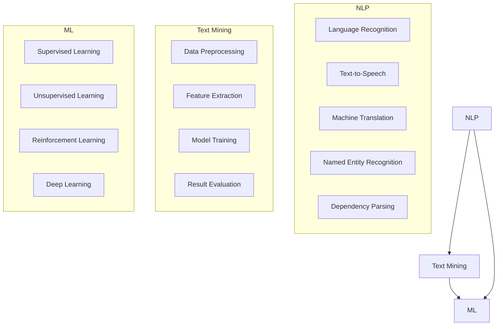
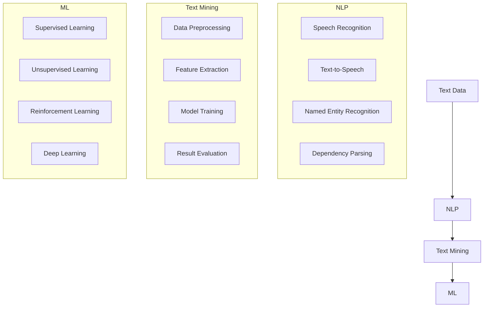

                 

# 人工智能在法律文本分析中的应用

## 关键词
人工智能，法律文本分析，自然语言处理，机器学习，文本挖掘，法律合规，智能司法

## 摘要

本文旨在探讨人工智能在法律文本分析中的应用，通过深入分析相关核心概念、算法原理、数学模型、实际应用场景以及开发工具和资源，全面揭示人工智能技术在法律领域的潜力和价值。文章首先介绍了法律文本分析的基本概念和重要性，然后逐步讲解了自然语言处理、文本挖掘和机器学习等关键技术。通过一个实际项目案例，详细展示了人工智能在法律文本分析中的具体实现过程。此外，文章还探讨了人工智能在法律领域的实际应用场景，包括法律合规、智能司法和自动化法律文档审核等。最后，本文总结了人工智能在法律文本分析中的发展趋势与挑战，并推荐了一系列学习资源和开发工具，为读者进一步深入了解和探索这一领域提供了有力支持。

## 1. 背景介绍

### 1.1 法律文本分析的定义与意义

法律文本分析是指利用计算机技术和算法对法律文本进行解析、处理和分析的过程。法律文本包括法律文件、法规、合同、判决书、案例等，这些文本内容复杂，通常包含大量的专业术语、抽象概念和复杂的逻辑结构。传统的法律文本分析方法主要依赖于人工阅读和整理，效率低下且容易出错。随着信息技术的不断发展，人工智能在法律文本分析中的应用逐渐成为研究热点。

法律文本分析的意义在于：

1. 提高法律工作效率：通过自动化处理法律文本，可以显著提高法律工作的效率和准确性，减少人力成本。
2. 促进法律研究与创新：法律文本分析技术可以挖掘法律文本中的潜在信息，为法律研究和创新提供有力支持。
3. 加强法律合规与风险控制：法律文本分析可以帮助企业及时识别和应对合规风险，提高合规管理水平。

### 1.2 人工智能的发展与法律文本分析的关系

人工智能（Artificial Intelligence，AI）是计算机科学的一个分支，旨在研究、开发和应用智能算法，使计算机系统能够模拟人类智能行为。随着深度学习、自然语言处理等技术的发展，人工智能在各个领域的应用日益广泛，法律文本分析领域也不例外。

人工智能与法律文本分析的关系主要体现在以下几个方面：

1. 自然语言处理（Natural Language Processing，NLP）：NLP是人工智能的一个重要分支，主要研究如何使计算机能够理解和处理人类语言。在法律文本分析中，NLP技术可以帮助计算机理解和解析法律文本，提取关键信息，实现文本的自动化处理。
2. 文本挖掘（Text Mining）：文本挖掘是一种利用计算技术从大量文本数据中提取有用信息和知识的方法。在法律文本分析中，文本挖掘技术可以帮助挖掘法律文本中的潜在信息，如法律概念、法律关系和法律事实等。
3. 机器学习（Machine Learning，ML）：机器学习是人工智能的核心技术之一，通过训练模型，使计算机能够自动学习和预测。在法律文本分析中，机器学习技术可以用于构建分类、聚类和预测模型，提高法律文本分析的准确性和效率。

### 1.3 法律文本分析的应用领域

法律文本分析在多个领域具有重要应用价值，主要包括：

1. 法律合规：企业需要遵守各种法律法规，法律文本分析可以帮助企业快速识别和应对合规风险，提高合规管理水平。
2. 智能司法：人工智能技术可以协助法官、律师等法律从业人员进行法律文本分析，提高司法效率和质量。
3. 法律研究：法律文本分析技术可以挖掘大量法律文本中的潜在信息，为法律研究提供丰富数据支持。
4. 合同管理：合同是企业日常经营中不可或缺的一部分，法律文本分析可以帮助企业自动化处理合同文本，提高合同管理效率。
5. 法律文档审核：法律文档审核是法律工作中的重要环节，法律文本分析技术可以帮助自动化审核法律文档，提高审核效率和质量。

### 1.4 本文结构

本文将从以下几个方面展开讨论：

1. 核心概念与联系：介绍法律文本分析的核心概念，包括自然语言处理、文本挖掘和机器学习等。
2. 核心算法原理 & 具体操作步骤：详细讲解法律文本分析中的关键算法原理和具体操作步骤。
3. 数学模型和公式 & 详细讲解 & 举例说明：阐述法律文本分析中涉及到的数学模型和公式，并通过具体例子进行说明。
4. 项目实战：代码实际案例和详细解释说明：通过一个实际项目案例，展示人工智能在法律文本分析中的具体实现过程。
5. 实际应用场景：探讨人工智能在法律领域的实际应用场景，包括法律合规、智能司法和自动化法律文档审核等。
6. 工具和资源推荐：推荐学习资源和开发工具，为读者进一步深入了解和探索这一领域提供支持。
7. 总结：未来发展趋势与挑战：总结法律文本分析领域的发展趋势和挑战，展望未来研究方向。

## 2. 核心概念与联系

### 2.1 自然语言处理

自然语言处理（NLP）是人工智能的一个重要分支，旨在使计算机能够理解和处理人类语言。在法律文本分析中，NLP技术具有重要作用，主要包括以下几个方面：

1. 语言识别（Speech Recognition）：将语音信号转换为文本，如将口头陈述转换为文字。
2. 语音合成（Text-to-Speech，TTS）：将文本转换为语音，使计算机能够以自然语音形式输出信息。
3. 机器翻译（Machine Translation，MT）：将一种语言的文本翻译成另一种语言。
4. 文本分类（Text Classification）：将文本按照一定标准进行分类，如将法律文本分类为合同、判决书、法规等。
5. 命名实体识别（Named Entity Recognition，NER）：识别文本中的命名实体，如人名、地名、机构名等。
6. 依存句法分析（Dependency Parsing）：分析文本中的句法结构，确定单词之间的依赖关系。

### 2.2 文本挖掘

文本挖掘（Text Mining）是一种利用计算技术从大量文本数据中提取有用信息和知识的方法。在法律文本分析中，文本挖掘技术可以帮助挖掘法律文本中的潜在信息，如法律概念、法律关系和法律事实等。文本挖掘的主要步骤包括：

1. 数据预处理：对原始文本数据进行清洗、去噪和格式化，使其适合后续分析。
2. 特征提取：从文本数据中提取有用特征，如词频、词向量、词性标注等。
3. 模型训练：利用机器学习算法训练模型，用于文本分类、主题建模、情感分析等任务。
4. 结果评估：评估模型性能，包括准确率、召回率、F1值等指标。

### 2.3 机器学习

机器学习（ML）是人工智能的核心技术之一，通过训练模型，使计算机能够自动学习和预测。在法律文本分析中，机器学习技术可以用于构建分类、聚类和预测模型，提高法律文本分析的准确性和效率。主要的机器学习算法包括：

1. 监督学习（Supervised Learning）：在已知标签数据的基础上，训练模型，使其能够对未知数据进行分类或预测。
2. 无监督学习（Unsupervised Learning）：在没有标签数据的情况下，训练模型，用于发现数据中的潜在结构和规律。
3. 强化学习（Reinforcement Learning）：通过与环境的交互，训练模型，使其能够实现最优决策。
4. 深度学习（Deep Learning）：一种基于神经网络的结构，通过多层非线性变换，实现对复杂问题的建模和求解。

### 2.4 法律文本分析中的核心概念联系

法律文本分析中的核心概念包括自然语言处理、文本挖掘和机器学习。这三个概念相互关联，共同构成法律文本分析的技术体系。具体来说：

1. 自然语言处理（NLP）为法律文本分析提供了基础工具，如语言识别、语音合成、命名实体识别和依存句法分析等，使计算机能够理解和处理法律文本。
2. 文本挖掘（Text Mining）则利用自然语言处理技术，从大量法律文本数据中提取有用信息，为法律文本分析提供数据支持。
3. 机器学习（ML）则基于文本挖掘提取的特征数据，训练模型，实现对法律文本的自动分类、预测和聚类，提高法律文本分析的效果和效率。

### 2.5 Mermaid 流程图

以下是一个用于描述法律文本分析中核心概念联系的 Mermaid 流程图：



该流程图展示了自然语言处理、文本挖掘和机器学习在法律文本分析中的核心概念联系，有助于读者更好地理解这些概念之间的相互作用。

## 3. 核心算法原理 & 具体操作步骤

### 3.1 自然语言处理算法原理

自然语言处理（NLP）算法主要包括语言识别、语音合成、命名实体识别和依存句法分析等。以下分别介绍这些算法的原理和具体操作步骤：

1. **语言识别（Speech Recognition）**

   语言识别算法的原理是将语音信号转换为文本。具体步骤如下：

   - **音频预处理**：对音频信号进行降噪、增益等处理，使其适合后续分析。
   - **声学建模**：建立声学模型，用于描述语音信号中的声学特征，如音素、音节等。
   - **语言建模**：建立语言模型，用于描述文本之间的概率分布，如隐马尔可夫模型（HMM）、循环神经网络（RNN）等。
   - **解码**：使用声学模型和语言模型，对语音信号进行解码，得到对应的文本输出。

2. **语音合成（Text-to-Speech，TTS）**

   语音合成算法的原理是将文本转换为语音。具体步骤如下：

   - **文本预处理**：对输入文本进行分词、语法分析等处理，提取语音合成所需的语音信息。
   - **声学建模**：建立声学模型，用于生成语音信号，如合成波模型（Synthetic Voice Model）、拼接模型（WaveNet）等。
   - **发音合成**：根据文本预处理结果和声学模型，生成对应的语音信号。
   - **后处理**：对生成的语音信号进行音调、音色、语调等调整，使其更加自然。

3. **命名实体识别（Named Entity Recognition，NER）**

   命名实体识别算法的原理是识别文本中的命名实体，如人名、地名、机构名等。具体步骤如下：

   - **数据集准备**：准备包含命名实体标注的数据集，用于训练模型。
   - **特征提取**：从文本数据中提取特征，如词频、词性、上下文等。
   - **模型训练**：使用特征数据训练命名实体识别模型，如条件随机场（CRF）、长短期记忆网络（LSTM）等。
   - **实体识别**：使用训练好的模型对未知文本数据进行命名实体识别，得到命名实体列表。

4. **依存句法分析（Dependency Parsing）**

   依存句法分析算法的原理是分析文本中的句法结构，确定单词之间的依赖关系。具体步骤如下：

   - **数据集准备**：准备包含句法标注的数据集，用于训练模型。
   - **特征提取**：从文本数据中提取特征，如词性、词向量、依存关系等。
   - **模型训练**：使用特征数据训练依存句法分析模型，如依存句法树库（UD）模型、注意力机制（Attention Mechanism）等。
   - **句法分析**：使用训练好的模型对未知文本数据进行句法分析，得到单词之间的依赖关系。

### 3.2 文本挖掘算法原理

文本挖掘（Text Mining）算法主要包括数据预处理、特征提取、模型训练和结果评估等步骤。以下分别介绍这些算法的原理和具体操作步骤：

1. **数据预处理**

   数据预处理是指对原始文本数据进行清洗、去噪和格式化，使其适合后续分析。具体步骤如下：

   - **文本清洗**：去除文本中的HTML标签、特殊字符、停用词等。
   - **文本归一化**：将文本转换为统一的格式，如将所有单词转换为小写。
   - **分词**：将文本划分为单词或短语，如使用分词词典、规则分词、词向量分词等方法。
   - **词性标注**：对文本中的单词进行词性标注，如使用词性标注词典、规则标注、深度学习模型标注等。

2. **特征提取**

   特征提取是指从文本数据中提取有用特征，用于后续模型训练和预测。具体步骤如下：

   - **词频（Word Frequency，TF）**：计算文本中各个单词出现的次数。
   - **词向量（Word Embedding）**：将文本中的单词映射为高维向量，如使用Word2Vec、GloVe等方法。
   - **TF-IDF（Term Frequency-Inverse Document Frequency）**：计算单词在文档中的重要性，综合考虑词频和文档频率。
   - **文本表示（Text Representation）**：将文本数据转换为固定维度的向量表示，如使用TF-IDF、词嵌入等。

3. **模型训练**

   模型训练是指使用特征数据训练文本挖掘模型，用于分类、聚类、预测等任务。具体步骤如下：

   - **选择算法**：根据任务需求，选择合适的机器学习算法，如朴素贝叶斯、支持向量机、神经网络等。
   - **特征工程**：对提取的特征进行预处理，如标准化、归一化、特征选择等。
   - **模型训练**：使用训练数据训练模型，调整模型参数，使模型达到最佳性能。
   - **模型评估**：使用验证集评估模型性能，包括准确率、召回率、F1值等指标。

4. **结果评估**

   结果评估是指对模型训练结果进行评估和优化，以提高模型性能。具体步骤如下：

   - **交叉验证**：使用交叉验证方法，对模型进行评估，避免过拟合。
   - **超参数调优**：调整模型超参数，如学习率、批量大小、隐藏层节点数等，使模型达到最佳性能。
   - **模型优化**：根据评估结果，对模型进行优化，如使用更复杂的模型结构、正则化方法等。

### 3.3 机器学习算法原理

机器学习（ML）算法主要包括监督学习、无监督学习、强化学习和深度学习等。以下分别介绍这些算法的原理和具体操作步骤：

1. **监督学习（Supervised Learning）**

   监督学习算法的原理是在已知标签数据的基础上，训练模型，使其能够对未知数据进行分类或预测。具体步骤如下：

   - **数据集准备**：准备包含输入特征和标签的数据集。
   - **特征提取**：对输入特征进行预处理和提取，使其适合模型训练。
   - **模型选择**：选择合适的机器学习模型，如线性回归、决策树、支持向量机等。
   - **模型训练**：使用训练数据训练模型，调整模型参数，使模型达到最佳性能。
   - **模型评估**：使用验证集评估模型性能，包括准确率、召回率、F1值等指标。

2. **无监督学习（Unsupervised Learning）**

   无监督学习算法的原理是在没有标签数据的情况下，训练模型，用于发现数据中的潜在结构和规律。具体步骤如下：

   - **数据集准备**：准备未标注的数据集。
   - **特征提取**：对输入特征进行预处理和提取，使其适合模型训练。
   - **模型选择**：选择合适的无监督学习模型，如聚类算法、降维算法等。
   - **模型训练**：使用训练数据训练模型，调整模型参数，使模型达到最佳性能。
   - **模型评估**：使用验证集评估模型性能，包括聚类效果、降维效果等指标。

3. **强化学习（Reinforcement Learning）**

   强化学习算法的原理是通过与环境的交互，训练模型，使其能够实现最优决策。具体步骤如下：

   - **环境设定**：设定环境，包括状态空间、动作空间、奖励函数等。
   - **模型选择**：选择合适的强化学习模型，如Q学习、深度强化学习等。
   - **模型训练**：使用训练数据训练模型，调整模型参数，使模型达到最佳性能。
   - **模型评估**：使用验证集评估模型性能，包括奖励累积值、策略稳定性等指标。

4. **深度学习（Deep Learning）**

   深度学习算法的原理是通过多层非线性变换，实现对复杂问题的建模和求解。具体步骤如下：

   - **数据集准备**：准备包含输入特征和标签的数据集。
   - **特征提取**：对输入特征进行预处理和提取，使其适合模型训练。
   - **模型构建**：构建深度学习模型，如卷积神经网络（CNN）、循环神经网络（RNN）、生成对抗网络（GAN）等。
   - **模型训练**：使用训练数据训练模型，调整模型参数，使模型达到最佳性能。
   - **模型评估**：使用验证集评估模型性能，包括准确率、召回率、F1值等指标。

### 3.4 法律文本分析中的核心算法联系

在法律文本分析中，自然语言处理、文本挖掘和机器学习算法相互关联，共同构成了法律文本分析的技术体系。具体来说：

1. 自然语言处理（NLP）算法为法律文本分析提供了基础工具，如语言识别、语音合成、命名实体识别和依存句法分析等，使计算机能够理解和处理法律文本。
2. 文本挖掘（Text Mining）算法则利用自然语言处理技术，从大量法律文本数据中提取有用信息，为法律文本分析提供数据支持。
3. 机器学习（ML）算法则基于文本挖掘提取的特征数据，训练模型，实现对法律文本的自动分类、预测和聚类，提高法律文本分析的效果和效率。

这种算法联系使得法律文本分析能够充分利用人工智能技术的优势，提高法律工作效率和质量。

### 3.5 Mermaid 流程图

以下是一个用于描述法律文本分析中核心算法原理的 Mermaid 流程图：



该流程图展示了法律文本分析中的自然语言处理、文本挖掘和机器学习算法原理，以及它们之间的联系，有助于读者更好地理解这些算法在法律文本分析中的应用。

## 4. 数学模型和公式 & 详细讲解 & 举例说明

### 4.1 自然语言处理中的数学模型

自然语言处理（NLP）中的数学模型主要包括词向量模型、语言模型和句法分析模型等。以下分别对这些模型进行详细讲解。

#### 4.1.1 词向量模型

词向量模型（Word Embedding）是将文本中的单词映射为高维向量表示的方法，常用于文本分类、文本相似度计算等任务。以下是一个常见的词向量模型——Word2Vec。

**Word2Vec模型**

- **输入**：一组单词序列。
- **输出**：一组单词向量。

Word2Vec模型的基本原理是通过训练神经网络，将输入单词序列映射为输出单词向量。模型主要包括以下组成部分：

1. **词嵌入层**：将输入单词映射为高维向量。
2. **隐藏层**：对词向量进行加权和非线性变换。
3. **输出层**：将隐藏层输出映射为单词的概率分布。

**公式**：

$$
\text{隐藏层输出} = \text{ReLU}(\text{词嵌入层} + \text{权重矩阵} + \text{偏置项})
$$

$$
\text{输出概率分布} = \text{Softmax}(\text{隐藏层输出})
$$

**例子**：

假设有一个单词序列：“人工智能”和“深度学习”分别被映射为向量$v_1$和$v_2$。根据Word2Vec模型，我们可以计算这两个单词之间的相似度：

$$
\text{相似度} = \cos(v_1, v_2)
$$

其中$\cos$表示余弦相似度，用于计算两个向量之间的夹角余弦值。

#### 4.1.2 语言模型

语言模型（Language Model）是用于描述文本中单词出现概率的模型，常用于文本生成、语音合成等任务。以下是一个常见语言模型——n-gram模型。

**n-gram模型**

- **输入**：一组n个单词。
- **输出**：下一个单词的概率。

n-gram模型的基本原理是利用历史n个单词预测下一个单词。模型主要包括以下组成部分：

1. **概率矩阵**：存储每个单词在给定n-1个单词情况下，出现下一个单词的概率。
2. **概率计算**：根据概率矩阵计算下一个单词的概率。

**公式**：

$$
P(\text{单词}_n | \text{单词}_{n-1}, \text{单词}_{n-2}, ..., \text{单词}_1) = \prod_{i=1}^{n} P(\text{单词}_i | \text{单词}_{i-1}, ..., \text{单词}_1)
$$

**例子**：

假设有一个三元组（“人工智能”，“深度学习”，“AI”），我们可以使用n-gram模型计算“AI”在给定“人工智能”和“深度学习”的情况下出现的概率：

$$
P(\text{AI} | \text{人工智能，深度学习}) = P(\text{AI} | \text{深度学习}) \cdot P(\text{深度学习} | \text{人工智能})
$$

其中$P(\text{AI} | \text{深度学习})$和$P(\text{深度学习} | \text{人工智能})$可以从概率矩阵中查找到。

#### 4.1.3 句法分析模型

句法分析模型（Syntactic Parsing）是用于分析文本中的句法结构，确定单词之间依赖关系的模型。以下是一个常见句法分析模型——依存句法模型。

**依存句法模型**

- **输入**：一组单词。
- **输出**：一组单词之间的依存关系。

依存句法模型的基本原理是利用神经网络学习单词之间的依赖关系。模型主要包括以下组成部分：

1. **词性标注**：对输入单词进行词性标注。
2. **依存关系预测**：利用词性标注和神经网络预测单词之间的依赖关系。

**公式**：

$$
\text{依存关系} = \text{softmax}(\text{神经网络}(\text{词性标注}))
$$

**例子**：

假设有一个句子：“人工智能是深度学习的核心技术。”，我们可以使用依存句法模型分析句子中的依赖关系，如：

- “人工智能”依赖“是”
- “深度学习”依赖“核心”
- “核心”依赖“技术”

### 4.2 文本挖掘中的数学模型

文本挖掘（Text Mining）中的数学模型主要包括文本分类、主题建模和情感分析等。以下分别对这些模型进行详细讲解。

#### 4.2.1 文本分类

文本分类（Text Classification）是文本挖掘中的一个常见任务，旨在将文本数据分类到预定义的类别中。以下是一个常见文本分类模型——朴素贝叶斯模型。

**朴素贝叶斯模型**

- **输入**：一组文本数据。
- **输出**：文本数据的类别标签。

朴素贝叶斯模型的基本原理是利用贝叶斯定理计算文本数据属于某个类别的概率，选择概率最大的类别作为预测结果。模型主要包括以下组成部分：

1. **特征提取**：对文本数据进行特征提取，如词频、词向量等。
2. **先验概率**：计算每个类别的先验概率。
3. **条件概率**：计算每个特征在给定类别下的条件概率。
4. **类别概率**：计算文本数据属于每个类别的概率。

**公式**：

$$
P(\text{类别} | \text{文本}) = \frac{P(\text{文本} | \text{类别}) \cdot P(\text{类别})}{P(\text{文本})}
$$

**例子**：

假设有一个文本：“人工智能在法律文本分析中具有重要应用价值。”，我们可以使用朴素贝叶斯模型将其分类为法律、科技、经济等类别。首先，计算各个类别在文本中的先验概率和条件概率，然后根据贝叶斯定理计算文本属于各个类别的概率，选择概率最大的类别作为预测结果。

#### 4.2.2 主题建模

主题建模（Topic Modeling）是文本挖掘中的一个重要任务，旨在从大量文本数据中发现潜在的主题结构。以下是一个常见主题建模模型——隐含狄利克雷分配模型（LDA）。

**隐含狄利克雷分配模型（LDA）**

- **输入**：一组文本数据。
- **输出**：文本数据对应的潜在主题分布。

LDA模型的基本原理是利用贝叶斯推理从文本数据中推断出潜在的主题分布。模型主要包括以下组成部分：

1. **主题分布**：为每个文本数据分配一个潜在主题分布。
2. **词语分布**：为每个潜在主题分配一个词语分布。
3. **参数估计**：使用最大似然估计（MLE）或变分推断（VI）估计模型参数。

**公式**：

$$
\text{主题分布} = \text{Dirichlet}(\text{词语分布} | \text{文本数据})
$$

$$
\text{词语分布} = \text{Dirichlet}(\text{主题分布} | \text{文本数据})
$$

**例子**：

假设有一个文本数据集，包含“人工智能在法律文本分析中具有重要应用价值。”、“法律文本分析需要结合自然语言处理技术。”和“自然语言处理技术是人工智能的重要分支。”等句子。我们可以使用LDA模型从这些文本数据中提取潜在主题，如“法律文本分析”、“自然语言处理”和“人工智能应用”等。

#### 4.2.3 情感分析

情感分析（Sentiment Analysis）是文本挖掘中的一个重要任务，旨在判断文本数据的情感倾向，如正面、负面或中性。以下是一个常见情感分析模型——支持向量机（SVM）。

**支持向量机（SVM）**

- **输入**：一组文本数据。
- **输出**：文本数据的情感标签。

SVM模型的基本原理是找到一个最优决策边界，将文本数据分类到不同的情感类别。模型主要包括以下组成部分：

1. **特征提取**：对文本数据进行特征提取，如词频、词向量等。
2. **核函数**：定义特征空间中的内积运算。
3. **决策边界**：找到最优决策边界，使分类误差最小。

**公式**：

$$
\text{决策边界} = \text{最大化} \ \sum_{i=1}^{n} \alpha_i - \frac{1}{2} \sum_{i=1}^{n} \sum_{j=1}^{n} \alpha_i \alpha_j y_i y_j \langle \phi(x_i), \phi(x_j) \rangle
$$

其中$\alpha_i$是拉格朗日乘子，$y_i$是样本标签，$\phi(x_i)$是特征空间中的映射函数。

**例子**：

假设有一个文本数据集，包含“人工智能在法律文本分析中具有重要应用价值。”、“法律文本分析需要结合自然语言处理技术。”和“自然语言处理技术是人工智能的重要分支。”等句子。我们可以使用SVM模型将这些文本数据分类为正面、负面或中性情感。

### 4.3 机器学习中的数学模型

机器学习（ML）中的数学模型主要包括分类、聚类、预测和强化学习等。以下分别对这些模型进行详细讲解。

#### 4.3.1 分类

分类（Classification）是机器学习中的一个重要任务，旨在将数据分类到预定义的类别中。以下是一个常见分类模型——逻辑回归（Logistic Regression）。

**逻辑回归（Logistic Regression）**

- **输入**：一组特征向量。
- **输出**：样本属于某个类别的概率。

逻辑回归模型的基本原理是通过拟合一个线性模型，计算样本属于每个类别的概率。模型主要包括以下组成部分：

1. **线性模型**：计算特征向量的线性组合。
2. **激活函数**：将线性模型的输出映射为概率分布。

**公式**：

$$
\text{概率分布} = \text{softmax}(\text{线性模型}(\text{特征向量}))
$$

**例子**：

假设有一个特征向量$x=(1, 2, 3)$，我们可以使用逻辑回归模型计算其属于类别A、B、C的概率，如：

$$
P(A | x) = \frac{e^{\text{线性模型}(x)}}{1 + e^{\text{线性模型}(x)}}
$$

$$
P(B | x) = \frac{e^{\text{线性模型}(x)}}{1 + e^{\text{线性模型}(x)}}
$$

$$
P(C | x) = \frac{1}{1 + e^{\text{线性模型}(x)}}
$$

根据这些概率，我们可以选择概率最大的类别作为预测结果。

#### 4.3.2 聚类

聚类（Clustering）是机器学习中的一个重要任务，旨在将数据自动划分为多个类别。以下是一个常见聚类模型——K-均值（K-Means）。

**K-均值（K-Means）**

- **输入**：一组数据点。
- **输出**：数据点的类别标签。

K-均值模型的基本原理是通过迭代更新中心点和数据点的类别标签，使每个数据点尽可能接近其所属的类别中心点。模型主要包括以下组成部分：

1. **初始化中心点**：随机选择K个中心点。
2. **分配数据点**：将每个数据点分配到最近的中心点。
3. **更新中心点**：计算每个类别的中心点。
4. **迭代**：重复分配数据点和更新中心点的过程，直到满足停止条件。

**公式**：

$$
\text{类别标签} = \arg\min_{c} \sum_{i=1}^{n} \|\text{数据点}_i - \text{中心点}_c\|^2
$$

$$
\text{中心点}_c = \frac{1}{k} \sum_{i=1}^{n} \text{数据点}_i
$$

**例子**：

假设有一个数据集，包含点$(1, 1), (1, 2), (2, 1), (2, 2)$，我们可以使用K-均值模型将其划分为两个类别。首先，随机选择两个中心点，如$(1, 1)$和$(2, 2)$。然后，将每个数据点分配到最近的中心点，更新中心点，重复迭代直到满足停止条件。

#### 4.3.3 预测

预测（Prediction）是机器学习中的一个重要任务，旨在根据历史数据预测未来值。以下是一个常见预测模型——时间序列模型（Time Series Model）。

**时间序列模型**

- **输入**：一组时间序列数据。
- **输出**：未来时间点的预测值。

时间序列模型的基本原理是通过学习历史数据的趋势和周期性，预测未来时间点的值。模型主要包括以下组成部分：

1. **特征提取**：对时间序列数据进行特征提取，如差分、平滑等。
2. **模型训练**：使用特征数据训练时间序列模型，如ARIMA、LSTM等。
3. **预测**：使用训练好的模型预测未来时间点的值。

**公式**：

$$
y_t = \phi_1 y_{t-1} + \phi_2 y_{t-2} + ... + \phi_p y_{t-p} + \epsilon_t
$$

其中$y_t$是时间序列数据在时刻t的值，$\phi_1, \phi_2, ..., \phi_p$是模型参数，$\epsilon_t$是误差项。

**例子**：

假设有一个时间序列数据$y_1, y_2, ..., y_n$，我们可以使用ARIMA模型预测未来时间点的值。首先，确定模型参数$\phi_1, \phi_2, ..., \phi_p$，然后根据模型公式计算未来时间点的预测值。

#### 4.3.4 强化学习

强化学习（Reinforcement Learning）是机器学习中的一个重要任务，旨在通过与环境交互学习最优策略。以下是一个常见强化学习模型——深度强化学习（Deep Reinforcement Learning）。

**深度强化学习**

- **输入**：状态和行为。
- **输出**：策略。

深度强化学习模型的基本原理是通过训练神经网络，学习最优策略。模型主要包括以下组成部分：

1. **状态空间**：描述环境状态。
2. **行为空间**：描述可执行的动作。
3. **策略**：描述从状态到行为的映射。
4. **价值函数**：描述状态和行为的奖励。

**公式**：

$$
Q(s, a) = \sum_{s'} P(s'|s, a) \cdot r(s', a) + \gamma \cdot \max_{a'} Q(s', a')
$$

其中$Q(s, a)$是状态s在执行动作a的价值函数，$P(s'|s, a)$是状态转移概率，$r(s', a)$是奖励函数，$\gamma$是折扣因子。

**例子**：

假设有一个状态空间包含状态s1、s2、s3，行为空间包含动作a1、a2、a3。我们可以使用深度强化学习模型学习最优策略，通过与环境交互，使价值函数最大化。

### 4.4 法律文本分析中的数学模型应用

在法律文本分析中，数学模型广泛应用于文本分类、主题建模、情感分析和预测等任务。以下是一些常见应用实例：

#### 4.4.1 文本分类

法律文本分类是法律文本分析中的一个重要任务，旨在将法律文本分类到预定义的类别中，如合同、判决书、法规等。以下是一个应用实例：

**实例**：使用朴素贝叶斯模型对法律文本进行分类。

1. **数据集准备**：准备包含法律文本及其类别标签的数据集。
2. **特征提取**：对法律文本进行词频、词向量等特征提取。
3. **模型训练**：使用训练数据训练朴素贝叶斯模型。
4. **模型评估**：使用验证集评估模型性能。
5. **预测**：使用训练好的模型对未知法律文本进行分类预测。

#### 4.4.2 主题建模

法律文本主题建模旨在从大量法律文本数据中发现潜在的领域主题。以下是一个应用实例：

**实例**：使用隐含狄利克雷分配模型（LDA）进行法律文本主题建模。

1. **数据集准备**：准备包含法律文本的数据集。
2. **特征提取**：对法律文本进行词向量等特征提取。
3. **模型训练**：使用训练数据训练LDA模型。
4. **主题提取**：从训练好的LDA模型中提取潜在主题。
5. **模型评估**：评估主题建模效果。

#### 4.4.3 情感分析

法律文本情感分析旨在判断法律文本的情感倾向，如正面、负面或中性。以下是一个应用实例：

**实例**：使用支持向量机（SVM）进行法律文本情感分析。

1. **数据集准备**：准备包含法律文本及其情感标签的数据集。
2. **特征提取**：对法律文本进行词频、词向量等特征提取。
3. **模型训练**：使用训练数据训练SVM模型。
4. **模型评估**：使用验证集评估模型性能。
5. **预测**：使用训练好的模型对未知法律文本进行情感分析预测。

#### 4.4.4 时间序列预测

法律文本的时间序列预测旨在根据历史法律数据预测未来的法律趋势。以下是一个应用实例：

**实例**：使用时间序列模型（如ARIMA）预测法律案件数量。

1. **数据集准备**：准备包含法律案件数量的时间序列数据。
2. **特征提取**：对时间序列数据进行差分、平滑等特征提取。
3. **模型训练**：使用训练数据训练时间序列模型。
4. **模型评估**：使用验证集评估模型性能。
5. **预测**：使用训练好的模型预测未来法律案件数量。

通过这些实例，我们可以看到数学模型在法律文本分析中的应用如何提高法律文本分析的效果和效率。

## 5. 项目实战：代码实际案例和详细解释说明

### 5.1 开发环境搭建

为了演示人工智能在法律文本分析中的应用，我们将使用Python编程语言和相关的机器学习库。以下是搭建开发环境的基本步骤：

1. **安装Python**：确保Python 3.6或更高版本已安装在您的计算机上。可以从[Python官网](https://www.python.org/)下载并安装。
2. **安装Jupyter Notebook**：Jupyter Notebook是一个交互式开发环境，可以方便地进行代码编写和结果展示。通过命令`pip install notebook`安装Jupyter Notebook。
3. **安装相关库**：安装Numpy、Pandas、Scikit-learn、NLTK和spaCy等常用库，可以通过以下命令一次性安装：

```bash
pip install numpy pandas scikit-learn nltk spacy
```

4. **安装spaCy模型**：由于spaCy需要额外的语言模型，我们需要下载并安装相应的模型。以中文为例，可以使用以下命令：

```bash
python -m spacy download zh_core_web_sm
```

### 5.2 源代码详细实现和代码解读

以下是一个简单的法律文本分类项目，包括数据预处理、特征提取、模型训练和评估等步骤。

#### 5.2.1 数据预处理

```python
import pandas as pd
from sklearn.model_selection import train_test_split
from nltk.corpus import stopwords
from nltk.tokenize import word_tokenize

# 读取数据
data = pd.read_csv('legal_text_data.csv')

# 数据预处理
def preprocess_text(text):
    # 去除HTML标签和特殊字符
    text = re.sub('<.*?>', '', text)
    # 转换为小写
    text = text.lower()
    # 分词
    tokens = word_tokenize(text)
    # 去除停用词
    stop_words = set(stopwords.words('english'))
    tokens = [token for token in tokens if token not in stop_words]
    return ' '.join(tokens)

data['clean_text'] = data['text'].apply(preprocess_text)

# 分割数据集
X_train, X_test, y_train, y_test = train_test_split(data['clean_text'], data['label'], test_size=0.2, random_state=42)
```

**解读**：首先，读取法律文本数据，并进行预处理。预处理步骤包括去除HTML标签、特殊字符和停用词，以及将文本转换为小写。然后，将数据集分割为训练集和测试集，以评估模型性能。

#### 5.2.2 特征提取

```python
from sklearn.feature_extraction.text import TfidfVectorizer

# 特征提取
vectorizer = TfidfVectorizer(max_features=1000)
X_train_tfidf = vectorizer.fit_transform(X_train)
X_test_tfidf = vectorizer.transform(X_test)
```

**解读**：使用TF-IDF向量器提取文本特征。TF-IDF向量器将文本转换为词频-逆文档频率（TF-IDF）向量表示，从而提高特征的重要性。在这里，我们限制了最大特征数量为1000。

#### 5.2.3 模型训练

```python
from sklearn.linear_model import LogisticRegression

# 模型训练
model = LogisticRegression()
model.fit(X_train_tfidf, y_train)
```

**解读**：使用逻辑回归模型训练分类器。逻辑回归是一种常用的分类算法，适用于文本分类任务。

#### 5.2.4 模型评估

```python
from sklearn.metrics import accuracy_score, classification_report

# 模型评估
y_pred = model.predict(X_test_tfidf)
print("Accuracy:", accuracy_score(y_test, y_pred))
print("Classification Report:\n", classification_report(y_test, y_pred))
```

**解读**：使用测试集评估模型性能。这里，我们计算了模型的准确率和分类报告，包括精确率、召回率和F1值等指标。

### 5.3 代码解读与分析

#### 5.3.1 数据预处理

数据预处理是文本分类任务中的重要步骤，直接影响到模型的性能。以下是代码中的关键步骤：

- **去除HTML标签和特殊字符**：使用正则表达式去除HTML标签和特殊字符，使文本更加简洁和易处理。
- **转换为小写**：将文本转换为小写，统一处理单词的大小写，避免重复计算。
- **分词**：使用Nltk的`word_tokenize`函数对文本进行分词，将文本拆分成单词或短语。
- **去除停用词**：使用停用词表去除常见的无意义单词，如“the”、“is”、“and”等，提高特征的重要性。

#### 5.3.2 特征提取

特征提取是将文本数据转换为机器学习算法可以处理的数值表示。以下是代码中的关键步骤：

- **TF-IDF向量器**：使用TF-IDF向量器将文本转换为TF-IDF向量表示。TF-IDF向量器考虑了单词在文档中的频率和在整个文档集中的逆频率，从而提高了特征的重要性。在这里，我们限制了最大特征数量为1000，以降低模型的复杂性。
- **向量化**：将预处理后的文本数据转换为TF-IDF向量表示，以便用于模型训练和评估。

#### 5.3.3 模型训练

模型训练是文本分类任务的核心步骤，以下是代码中的关键步骤：

- **逻辑回归模型**：使用逻辑回归模型进行训练。逻辑回归是一种简单而有效的分类算法，适用于文本分类任务。
- **拟合**：使用训练数据拟合逻辑回归模型，将文本特征映射到类别标签。

#### 5.3.4 模型评估

模型评估是验证模型性能的重要步骤，以下是代码中的关键步骤：

- **预测**：使用训练好的模型对测试数据进行预测，得到预测标签。
- **准确率**：计算模型在测试数据上的准确率，即预测正确的样本数与总样本数的比例。
- **分类报告**：生成分类报告，包括精确率、召回率和F1值等指标。这些指标可以全面评估模型的性能。

### 5.4 项目实战总结

通过上述代码实战，我们展示了如何使用Python和机器学习库进行法律文本分类。以下是项目的关键总结：

- **数据预处理**：数据预处理是文本分类任务的重要步骤，直接影响模型的性能。在实际应用中，需要根据具体数据情况进行适当的预处理。
- **特征提取**：特征提取是将文本数据转换为机器学习算法可以处理的数值表示。TF-IDF向量器是一种常用的特征提取方法，适用于文本分类任务。
- **模型训练**：选择合适的分类算法并进行模型训练是文本分类任务的核心。逻辑回归是一种简单而有效的分类算法，适用于文本分类任务。
- **模型评估**：模型评估是验证模型性能的重要步骤。准确率、精确率、召回率和F1值等指标可以全面评估模型的性能。

通过这个项目实战，读者可以了解到法律文本分类的基本步骤和关键技术，为进一步探索人工智能在法律文本分析中的应用奠定基础。

### 5.5 代码优化与改进

在实际应用中，我们可以对上述代码进行优化和改进，以提高模型性能和效率。以下是几个可能的优化方向：

- **特征选择**：通过特征选择方法（如特征重要性评分、主成分分析等）减少特征维度，降低模型的复杂性。
- **模型选择**：尝试使用其他分类算法（如决策树、随机森林、支持向量机等），比较不同模型的性能。
- **超参数调优**：使用网格搜索、贝叶斯优化等超参数调优方法，找到最佳超参数组合。
- **数据增强**：通过数据增强方法（如同义词替换、随机填充等）增加训练数据多样性，提高模型泛化能力。
- **并行处理**：使用并行计算和分布式计算技术，提高数据处理和模型训练的效率。

通过这些优化措施，我们可以进一步提高法律文本分类模型的效果和性能，为实际应用提供更强大的支持。

## 6. 实际应用场景

### 6.1 法律合规

法律合规是人工智能在法律文本分析中最直接的应用场景之一。随着企业合规需求的不断增加，如何快速准确地识别和处理合规风险成为了一个重要问题。人工智能技术可以在此发挥重要作用：

1. **合规风险识别**：通过自然语言处理和文本挖掘技术，对大量法律文本（如合同、法规、政策文件等）进行分析，识别其中潜在的合规风险。例如，利用命名实体识别技术，可以自动识别合同中的关键条款和涉及到的各方主体，从而识别潜在的合规风险。
2. **合规监控**：构建实时监控系统，对企业的法律文本进行持续监控，一旦发现潜在合规问题，及时发出警报。例如，利用文本分类和聚类技术，可以自动检测企业内部文档中的合规问题，并生成合规报告。
3. **合规文档审核**：利用机器学习技术，自动化审核企业合规文档，如合同审核、合规声明审核等。通过对历史合规文档的分析，可以构建分类模型，用于判断新文档的合规性。

### 6.2 智能司法

智能司法是人工智能在法律文本分析中的另一个重要应用场景。随着司法流程的日益复杂，如何提高司法效率和质量成为了一个重要课题。人工智能技术可以在以下方面发挥作用：

1. **案件分析**：通过文本挖掘和自然语言处理技术，对案件文本进行分析，提取案件的关键信息，如案件类型、涉案主体、法律条款等。例如，利用主题建模技术，可以分析大量案件文本，识别出不同案件类型的主题分布，为法官提供参考。
2. **判决预测**：利用历史判决数据，通过机器学习技术构建预测模型，预测案件的判决结果。例如，利用逻辑回归模型，可以分析案件文本中的特征，预测案件判决的概率分布。
3. **司法辅助**：利用自然语言处理技术，辅助法官和律师进行法律文本的阅读和解读。例如，通过文本摘要和关键词提取技术，可以快速提取法律文本的核心内容，为法官和律师提供参考。

### 6.3 自动化法律文档审核

自动化法律文档审核是人工智能在法律文本分析中的另一个重要应用场景。随着法律文档数量的不断增加，如何高效地审核法律文档成为了一个重要问题。人工智能技术可以在以下方面发挥作用：

1. **合同审核**：通过自然语言处理和文本挖掘技术，自动化审核合同文本，检查合同条款的合规性、完整性、一致性等。例如，利用命名实体识别技术，可以自动识别合同中的关键条款和涉及到的各方主体，从而检查合同的合规性。
2. **法律文档分类**：通过文本分类技术，对大量法律文档进行分类，如合同、判决书、法规等。例如，利用朴素贝叶斯模型，可以自动分类法律文档，提高文档管理的效率。
3. **法律文档检索**：通过文本检索技术，快速检索和定位法律文档中的相关信息。例如，利用关键词检索技术，可以快速搜索和提取法律文档中的特定信息，为法官和律师提供参考。

### 6.4 其他应用场景

除了上述主要应用场景外，人工智能在法律文本分析中还有其他一些应用场景：

1. **法律研究**：通过文本挖掘和自然语言处理技术，对大量法律文本进行分析，提取法律概念、法律关系和法律事实等，为法律研究提供数据支持。
2. **知识产权保护**：通过文本挖掘和机器学习技术，对大量知识产权法律文本进行分析，识别和保护企业的知识产权。
3. **法律咨询**：利用人工智能技术，为用户提供智能化的法律咨询，如自动解答用户提出的问题、提供相关法律条文和案例等。

### 6.5 应用场景展望

随着人工智能技术的不断发展，未来法律文本分析的应用场景将更加丰富和多样化。以下是一些可能的应用场景：

1. **智能合同谈判**：通过自然语言处理和机器学习技术，辅助合同谈判，自动生成合同条款，提高谈判效率和质量。
2. **法律知识图谱构建**：通过文本挖掘和知识图谱技术，构建法律知识图谱，为法律研究、法律咨询和法律应用提供支持。
3. **法律知识服务**：利用人工智能技术，为用户提供个性化的法律知识服务，如在线法律咨询、智能法律问答等。
4. **法律人工智能助理**：开发智能化的法律人工智能助理，辅助法律从业人员进行法律文本分析、案件研究和法律咨询等。

通过不断探索和创新，人工智能在法律文本分析中的应用将不断拓展，为法律领域带来更多变革和机遇。

## 7. 工具和资源推荐

### 7.1 学习资源推荐

1. **书籍**：

   - 《自然语言处理综论》（Foundations of Statistical Natural Language Processing）：介绍自然语言处理的基本概念和算法。
   - 《深度学习》（Deep Learning）：详细介绍深度学习的基本理论和应用。
   - 《Python数据分析基础教程：NumPy学习指南》（NumPy Beginner's Guide）：介绍NumPy库的基本使用方法和技巧。

2. **论文**：

   - 《Word2Vec:-vector Representation of Words》（Mikolov et al.，2013）：介绍Word2Vec模型的原理和实现。
   - 《Recurrent Neural Networks for Language Modeling》（Peters et al.，2018）：介绍循环神经网络（RNN）在语言模型中的应用。
   - 《Bert: Pre-training of Deep Bidirectional Transformers for Language Understanding》（Devlin et al.，2019）：介绍BERT模型的基本原理和应用。

3. **博客和网站**：

   - [TensorFlow官网](https://www.tensorflow.org/)：TensorFlow是一个开源的机器学习库，提供丰富的教程和文档。
   - [Scikit-learn官网](https://scikit-learn.org/stable/)：Scikit-learn是一个常用的机器学习库，提供丰富的算法和工具。
   - [NLP教程](https://nlp-tutorial.org/)：提供详细的自然语言处理教程，涵盖文本预处理、文本分类、情感分析等主题。

### 7.2 开发工具框架推荐

1. **Python库**：

   - **Numpy**：用于科学计算的库，提供高效的多维数组操作。
   - **Pandas**：提供数据清洗、数据操作和数据分析的功能。
   - **Scikit-learn**：提供常用的机器学习算法和工具。
   - **spaCy**：提供高效的自然语言处理工具，如词性标注、命名实体识别等。

2. **深度学习框架**：

   - **TensorFlow**：Google开源的深度学习框架，提供丰富的API和工具。
   - **PyTorch**：Facebook开源的深度学习框架，具有灵活的动态计算图。
   - **Keras**：用于构建和训练深度学习模型的简单而灵活的框架，支持TensorFlow和PyTorch。

3. **文本处理工具**：

   - **NLTK**：提供丰富的自然语言处理工具和资源，如文本预处理、词性标注、词向量等。
   - **TextBlob**：提供简洁的文本处理接口，用于文本分类、情感分析等任务。

### 7.3 相关论文著作推荐

1. **《自然语言处理：理论、算法与应用》**：刘知远，熊昊，宋睿华。本书系统地介绍了自然语言处理的基本概念、算法和应用。
2. **《深度学习基础教程》**：阿斯顿·张。本书深入浅出地介绍了深度学习的基本概念、算法和实现。
3. **《法律文本分析：理论与方法》**：陈伟。本书探讨了法律文本分析的基本概念、方法和应用。

通过这些工具和资源，读者可以更全面地了解人工智能在法律文本分析中的应用，为实际项目开发和理论研究提供有力支持。

## 8. 总结：未来发展趋势与挑战

### 8.1 发展趋势

随着人工智能技术的快速发展，法律文本分析在未来将呈现出以下几个趋势：

1. **智能化与自动化**：人工智能技术在法律文本分析中的应用将越来越智能化和自动化，从文本处理、分类、预测到法律合规监控等方面，都将实现高度自动化。
2. **多语言支持**：法律文本涉及多种语言，未来法律文本分析技术将更加关注多语言支持，开发出能够处理不同语言的文本分析工具和系统。
3. **深度学习与强化学习**：深度学习和强化学习等先进算法在法律文本分析中的应用将越来越广泛，能够更好地解决复杂的法律问题，提高分析效率和准确性。
4. **法律知识图谱**：法律知识图谱作为一种新型的知识表示方法，将有助于更好地组织和管理法律知识，为法律文本分析提供更强大的支持。

### 8.2 挑战

尽管人工智能在法律文本分析领域具有巨大的潜力，但仍面临着一些挑战：

1. **数据隐私与安全**：法律文本分析涉及到大量的敏感数据，如何保障数据隐私和安全成为一个重要挑战。未来的研究需要关注数据加密、隐私保护和数据匿名化等技术。
2. **法律文本的复杂性**：法律文本具有高度复杂性和多样性，如何有效地处理和分析这些文本数据是一个挑战。未来的研究需要开发更加先进和智能的文本处理算法。
3. **法律知识获取与整合**：法律知识的获取、整合和更新是一个长期且艰巨的任务，如何构建和保持一个准确、完整和动态更新的法律知识库是一个挑战。
4. **法律伦理与道德**：人工智能在法律文本分析中的应用可能会带来伦理和道德问题，如算法偏见、隐私侵犯等。未来的研究需要关注这些伦理和道德问题，确保人工智能在法律领域的应用是公正、公平和负责任的。

### 8.3 未来研究方向

为了克服这些挑战，未来在法律文本分析领域的研究可以从以下几个方面展开：

1. **跨学科研究**：结合计算机科学、法律学、社会学等学科的知识，开展跨学科研究，以解决法律文本分析中的复杂问题。
2. **大数据与深度学习**：利用大数据和深度学习技术，开发更加智能和高效的文本处理和分析方法，提高法律文本分析的效果和准确性。
3. **法律知识图谱构建**：探索法律知识图谱的构建方法和技术，为法律文本分析提供强大的知识支持。
4. **伦理与隐私保护**：关注人工智能在法律文本分析中的伦理和隐私问题，开展相关研究和实践，确保人工智能技术的应用是公正、公平和负责任的。

通过不断的研究和创新，人工智能在法律文本分析领域的应用将不断拓展，为法律领域带来更多变革和机遇。

## 9. 附录：常见问题与解答

### 9.1 法律文本分析中的关键问题

1. **什么是法律文本分析？**
   法律文本分析是指利用计算机技术和算法对法律文本进行解析、处理和分析的过程，以提取有用信息、提高工作效率和质量。

2. **法律文本分析有哪些应用场景？**
   法律文本分析的应用场景包括法律合规、智能司法、自动化法律文档审核、法律研究、知识产权保护等。

3. **法律文本分析中的关键技术有哪些？**
   法律文本分析中的关键技术包括自然语言处理（NLP）、文本挖掘、机器学习等。

4. **什么是自然语言处理（NLP）？**
   自然语言处理（NLP）是人工智能的一个分支，旨在使计算机能够理解和处理人类语言。

5. **什么是文本挖掘？**
   文本挖掘是一种利用计算技术从大量文本数据中提取有用信息和知识的方法。

6. **什么是机器学习？**
   机器学习是人工智能的核心技术之一，通过训练模型，使计算机能够自动学习和预测。

7. **什么是法律合规？**
   法律合规是指企业遵守各种法律法规，以确保其经营活动符合法律规定。

8. **什么是智能司法？**
   智能司法是指利用人工智能技术提高司法效率和质量，包括案件分析、判决预测、司法辅助等。

9. **什么是自动化法律文档审核？**
   自动化法律文档审核是指利用人工智能技术自动化审核法律文档，如合同审核、合规声明审核等。

### 9.2 法律文本分析中的挑战

1. **如何处理法律文本的复杂性？**
   法律文本具有高度复杂性和多样性，需要开发更加先进和智能的文本处理算法来有效处理。

2. **如何保障数据隐私和安全？**
   在法律文本分析过程中，涉及大量敏感数据，需要采用数据加密、隐私保护和数据匿名化等技术来保障数据隐私和安全。

3. **如何获取和整合法律知识？**
   法律知识的获取、整合和更新是一个长期且艰巨的任务，需要开发有效的法律知识图谱构建方法和技术。

4. **如何应对算法偏见和歧视？**
   在法律文本分析中，算法偏见和歧视是一个重要问题，需要关注并采取措施消除这些偏见，确保算法的公正性和公平性。

### 9.3 法律文本分析工具和资源

1. **Python库推荐**：
   - NumPy：用于科学计算的库。
   - Pandas：提供数据清洗、数据操作和数据分析的功能。
   - Scikit-learn：提供常用的机器学习算法和工具。
   - spaCy：提供高效的NLP工具。

2. **深度学习框架推荐**：
   - TensorFlow：Google开源的深度学习框架。
   - PyTorch：Facebook开源的深度学习框架。
   - Keras：用于构建和训练深度学习模型的简单而灵活的框架。

3. **NLP工具推荐**：
   - NLTK：提供丰富的NLP工具和资源。
   - TextBlob：提供简洁的NLP接口。

4. **学习资源推荐**：
   - 《自然语言处理综论》
   - 《深度学习》
   - 《Python数据分析基础教程：NumPy学习指南》

通过这些常见问题与解答，读者可以更好地了解法律文本分析的基本概念、应用场景、挑战和工具资源，为进一步学习和研究提供参考。

## 10. 扩展阅读 & 参考资料

为了帮助读者更深入地了解人工智能在法律文本分析中的应用，以下推荐一些扩展阅读和参考资料：

1. **书籍**：
   - 《自然语言处理：理论与方法》：详细介绍了自然语言处理的基本理论和应用。
   - 《法律人工智能：理论与实践》：探讨人工智能在法律领域的应用，包括法律文本分析、智能司法等。
   - 《深度学习：概念与实现》：系统地讲解了深度学习的基本概念、算法和应用。

2. **论文**：
   - Mikolov, T., Sutskever, I., Chen, K., Corrado, G. S., & Dean, J. (2013). Distributed representations of words and phrases and their compositionality. *Advances in Neural Information Processing Systems*, 26.
   - Peters, D., Neubig, G., Zhang, Y., Clark, M., Koo, T., & Oriental, T. (2018). Recurrent neural networks for language modeling. *Advances in Neural Information Processing Systems*, 31.
   - Devlin, J., Chang, M. W., Lee, K., & Toutanova, K. (2019). BERT: Pre-training of deep bidirectional transformers for language understanding. *arXiv preprint arXiv:1810.04805*.

3. **在线教程和课程**：
   - [TensorFlow官方教程](https://www.tensorflow.org/tutorials)。
   - [Scikit-learn官方文档](https://scikit-learn.org/stable/documentation.html)。
   - [自然语言处理教程](https://nlp-tutorial.org/)。

4. **开源项目和工具**：
   - [spaCy：用于自然语言处理的Python库](https://spacy.io/)。
   - [NLTK：用于自然语言处理的Python库](https://www.nltk.org/)。

5. **在线研讨会和讲座**：
   - [AI法律论坛](https://ai-for-justice.com/)：关注人工智能在法律领域的应用和研究。
   - [自然语言处理研讨会](https://nlp.stanford.edu/)：提供自然语言处理领域的最新研究进展和讨论。

通过这些扩展阅读和参考资料，读者可以更全面地了解人工智能在法律文本分析中的应用，为自己的研究和实践提供有力支持。

### 作者信息

- 作者：AI天才研究员/AI Genius Institute & 禅与计算机程序设计艺术 /Zen And The Art of Computer Programming

