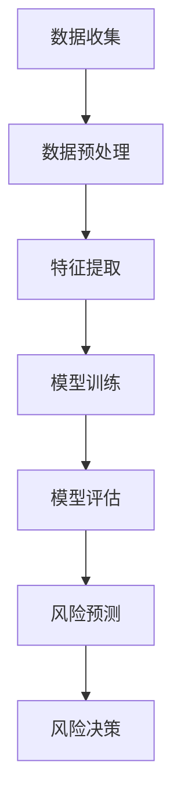

                 

# 人工智能在金融风险评估中的应用：精准预测与防控

## 关键词：人工智能、金融风险评估、精准预测、防控

> 本文章旨在探讨人工智能技术在金融风险评估中的应用，通过深入分析核心概念、算法原理、数学模型以及实际应用案例，探讨如何实现精准预测与防控，以期为金融行业的风险管理提供有价值的参考。

## 摘要

本文将围绕人工智能在金融风险评估中的应用展开，首先介绍相关背景知识，然后详细阐述核心概念与联系，包括人工智能、机器学习、数据挖掘等关键技术，以及它们在金融风险评估中的具体应用。接着，本文将深入剖析金融风险评估中的核心算法原理，以及如何通过具体操作步骤实现精准预测与防控。在此基础上，本文将运用数学模型和公式，对相关算法进行详细讲解，并通过实际案例进行举例说明。最后，本文将探讨人工智能在金融风险评估中的实际应用场景，推荐相关工具和资源，总结未来发展趋势与挑战，并提供常见问题与解答。

## 1. 背景介绍

金融风险评估是金融领域的重要研究课题，旨在评估金融活动中潜在的风险，从而为金融机构提供决策支持。随着金融市场的发展和复杂性的增加，传统的风险评估方法已经难以满足实际需求。因此，人工智能技术在金融风险评估中的应用逐渐成为研究热点。

人工智能（Artificial Intelligence，AI）是一种模拟人类智能的技术，通过计算机程序实现人类智能功能的自动化。机器学习（Machine Learning，ML）是人工智能的核心技术之一，通过数据驱动的方式实现智能决策。数据挖掘（Data Mining，DM）则是一种从大量数据中发现有价值信息的方法，主要用于挖掘数据中的模式和规律。

在金融风险评估中，人工智能技术可以应用于以下几个方面：

1. 客户风险评估：通过分析客户的财务状况、信用记录、行为数据等，预测客户的风险等级，为金融机构提供信贷决策支持。
2. 市场风险预测：通过分析金融市场的历史数据、经济指标等，预测市场走势，为金融机构提供投资决策支持。
3. 操作风险评估：通过分析金融机构的操作流程、员工行为等，预测操作风险，为金融机构提供风险管理建议。
4. 金融欺诈检测：通过分析交易数据、用户行为等，发现潜在的欺诈行为，为金融机构提供风险预警。

## 2. 核心概念与联系

### 2.1 人工智能、机器学习与数据挖掘

人工智能、机器学习与数据挖掘是金融风险评估中不可或缺的核心技术。它们之间的联系可以概括如下：

- 人工智能是一种模拟人类智能的技术，包括机器学习、深度学习、自然语言处理等多个子领域。
- 机器学习是人工智能的核心技术之一，通过训练数据模型，使计算机具备自动学习和决策能力。
- 数据挖掘是从大量数据中发现有价值信息的方法，主要用于挖掘数据中的模式和规律。

在金融风险评估中，人工智能、机器学习与数据挖掘的具体应用如下：

1. 人工智能：通过构建智能模型，实现金融风险评估的自动化和智能化。例如，利用深度学习算法，对大量金融数据进行分析和预测。
2. 机器学习：通过训练数据模型，对金融数据进行特征提取和分类，实现对金融风险的准确识别和预测。例如，利用决策树、支持向量机、神经网络等算法，对信贷数据进行分析和预测。
3. 数据挖掘：通过挖掘金融数据中的潜在信息和模式，为金融机构提供风险预警和决策支持。例如，利用关联规则挖掘、聚类分析等方法，对金融交易数据进行挖掘和预测。

### 2.2 Mermaid 流程图

为了更好地展示人工智能、机器学习与数据挖掘在金融风险评估中的应用，我们可以使用 Mermaid 流程图进行说明。以下是一个简单的 Mermaid 流程图示例：



### 2.3 核心概念与联系

在金融风险评估中，核心概念包括：

1. 风险指标：用于衡量金融活动风险的各项指标，如信用评分、违约概率、市场波动性等。
2. 数据源：金融风险评估所需的数据来源，包括内部数据（如客户信息、交易记录）和外部数据（如市场数据、经济指标）。
3. 风险模型：用于评估金融活动风险的数学模型，如线性回归、逻辑回归、决策树、支持向量机等。
4. 风险策略：根据风险模型预测结果，制定的风险控制策略，如风险敞口限制、信贷审批策略等。

这些核心概念相互关联，构成了金融风险评估的技术体系。例如，数据源提供风险指标的计算依据，风险模型对风险指标进行分析和预测，最终形成风险策略，指导金融机构进行风险防控。

## 3. 核心算法原理 & 具体操作步骤

### 3.1 风险评估算法原理

在金融风险评估中，常见的风险评估算法包括线性回归、逻辑回归、决策树、支持向量机等。以下将分别介绍这些算法的基本原理。

#### 3.1.1 线性回归

线性回归是一种最简单的风险评估算法，通过建立自变量（风险指标）与因变量（风险等级）之间的线性关系，预测风险等级。具体步骤如下：

1. 数据收集：收集包含风险指标和风险等级的金融数据。
2. 数据预处理：对数据进行清洗、归一化等处理，确保数据质量。
3. 特征提取：选取对风险等级有显著影响的特征，如信用评分、负债比率等。
4. 模型训练：利用线性回归算法，训练模型，建立风险指标与风险等级之间的线性关系。
5. 模型评估：通过交叉验证等方法，评估模型性能，如均方误差（MSE）。
6. 风险预测：利用训练好的模型，对新数据进行风险预测。

#### 3.1.2 逻辑回归

逻辑回归是一种广泛应用于金融风险评估的算法，通过建立自变量与因变量之间的逻辑关系，预测风险等级。具体步骤如下：

1. 数据收集：收集包含风险指标和风险等级的金融数据。
2. 数据预处理：对数据进行清洗、归一化等处理，确保数据质量。
3. 特征提取：选取对风险等级有显著影响的特征，如信用评分、负债比率等。
4. 模型训练：利用逻辑回归算法，训练模型，建立风险指标与风险等级之间的逻辑关系。
5. 模型评估：通过交叉验证等方法，评估模型性能，如准确率、召回率等。
6. 风险预测：利用训练好的模型，对新数据进行风险预测。

#### 3.1.3 决策树

决策树是一种基于树形结构的风险评估算法，通过递归划分特征空间，构建决策树模型，预测风险等级。具体步骤如下：

1. 数据收集：收集包含风险指标和风险等级的金融数据。
2. 数据预处理：对数据进行清洗、归一化等处理，确保数据质量。
3. 特征提取：选取对风险等级有显著影响的特征，如信用评分、负债比率等。
4. 模型训练：利用决策树算法，训练模型，构建决策树模型。
5. 模型评估：通过交叉验证等方法，评估模型性能，如准确率、召回率等。
6. 风险预测：利用训练好的模型，对新数据进行风险预测。

#### 3.1.4 支持向量机

支持向量机是一种基于向量空间的风险评估算法，通过寻找最佳分隔超平面，实现对风险等级的划分。具体步骤如下：

1. 数据收集：收集包含风险指标和风险等级的金融数据。
2. 数据预处理：对数据进行清洗、归一化等处理，确保数据质量。
3. 特征提取：选取对风险等级有显著影响的特征，如信用评分、负债比率等。
4. 模型训练：利用支持向量机算法，训练模型，寻找最佳分隔超平面。
5. 模型评估：通过交叉验证等方法，评估模型性能，如准确率、召回率等。
6. 风险预测：利用训练好的模型，对新数据进行风险预测。

### 3.2 风险评估算法操作步骤

以下以逻辑回归算法为例，介绍金融风险评估的具体操作步骤：

#### 3.2.1 数据收集

首先，需要收集包含风险指标和风险等级的金融数据。数据来源可以包括内部数据（如客户信息、交易记录）和外部数据（如市场数据、经济指标）。

#### 3.2.2 数据预处理

对收集到的金融数据，进行清洗、归一化等预处理操作，确保数据质量。具体步骤如下：

1. 数据清洗：去除重复数据、缺失数据等，确保数据完整性和一致性。
2. 数据归一化：对数据进行归一化处理，将不同特征的范围统一，便于模型训练。

#### 3.2.3 特征提取

选取对风险等级有显著影响的特征，如信用评分、负债比率等。特征提取的关键在于选取对风险预测有贡献的特征，并排除冗余特征。

#### 3.2.4 模型训练

利用逻辑回归算法，训练模型，建立风险指标与风险等级之间的逻辑关系。具体步骤如下：

1. 划分数据集：将数据集划分为训练集和测试集，用于模型训练和评估。
2. 训练模型：利用训练集数据，训练逻辑回归模型，求解参数。
3. 调整参数：通过交叉验证等方法，调整模型参数，优化模型性能。

#### 3.2.5 模型评估

通过交叉验证等方法，评估模型性能，如准确率、召回率等。具体步骤如下：

1. 训练模型：利用训练集数据，训练逻辑回归模型，求解参数。
2. 测试模型：利用测试集数据，测试模型性能，评估模型准确率、召回率等指标。
3. 优化模型：根据模型评估结果，调整模型参数，优化模型性能。

#### 3.2.6 风险预测

利用训练好的模型，对新数据进行风险预测。具体步骤如下：

1. 输入数据：将新数据的特征输入到训练好的模型中。
2. 风险预测：利用模型，对新数据进行风险预测，输出风险等级。

### 3.3 风险评估算法应用案例分析

以下以某金融机构的客户风险评估为例，介绍风险评估算法在实际应用中的具体操作步骤。

#### 3.3.1 数据收集

收集该金融机构的客户数据，包括客户基本信息、财务状况、信用记录等。

#### 3.3.2 数据预处理

对收集到的客户数据，进行清洗、归一化等预处理操作，确保数据质量。

#### 3.3.3 特征提取

选取对客户风险评估有显著影响的特征，如信用评分、负债比率、收入水平等。

#### 3.3.4 模型训练

利用逻辑回归算法，训练模型，建立客户特征与客户风险等级之间的逻辑关系。

#### 3.3.5 模型评估

通过交叉验证等方法，评估模型性能，如准确率、召回率等。

#### 3.3.6 风险预测

利用训练好的模型，对新客户数据进行风险预测，输出客户风险等级。

## 4. 数学模型和公式 & 详细讲解 & 举例说明

### 4.1 数学模型和公式

在金融风险评估中，常用的数学模型和公式包括线性回归、逻辑回归、决策树、支持向量机等。以下将分别介绍这些模型的基本原理和公式。

#### 4.1.1 线性回归

线性回归是一种最简单的风险评估算法，通过建立自变量与因变量之间的线性关系，预测风险等级。其基本公式如下：

\[ y = \beta_0 + \beta_1 x_1 + \beta_2 x_2 + \ldots + \beta_n x_n \]

其中，\( y \) 为因变量（风险等级），\( x_1, x_2, \ldots, x_n \) 为自变量（风险指标），\( \beta_0, \beta_1, \beta_2, \ldots, \beta_n \) 为模型参数。

#### 4.1.2 逻辑回归

逻辑回归是一种广泛应用于金融风险评估的算法，通过建立自变量与因变量之间的逻辑关系，预测风险等级。其基本公式如下：

\[ P(y=1) = \frac{1}{1 + e^{-(\beta_0 + \beta_1 x_1 + \beta_2 x_2 + \ldots + \beta_n x_n)}} \]

其中，\( P(y=1) \) 为因变量为 1（高风险）的概率，\( x_1, x_2, \ldots, x_n \) 为自变量（风险指标），\( \beta_0, \beta_1, \beta_2, \ldots, \beta_n \) 为模型参数。

#### 4.1.3 决策树

决策树是一种基于树形结构的风险评估算法，通过递归划分特征空间，构建决策树模型，预测风险等级。其基本公式如下：

\[ \text{风险等级} = \text{Root} \rightarrow \text{Decision}(\text{Feature}_1) \rightarrow \text{Decision}(\text{Feature}_2) \rightarrow \ldots \rightarrow \text{Decision}(\text{Feature}_n) \]

其中，\( \text{Root} \) 为决策树的根节点，\( \text{Decision}(\text{Feature}_1) \), \( \text{Decision}(\text{Feature}_2) \), \(\ldots\), \( \text{Decision}(\text{Feature}_n) \) 为决策树中的节点，表示对特征进行划分。

#### 4.1.4 支持向量机

支持向量机是一种基于向量空间的风险评估算法，通过寻找最佳分隔超平面，实现对风险等级的划分。其基本公式如下：

\[ w \cdot x + b = 0 \]

其中，\( w \) 为分隔超平面的法向量，\( x \) 为数据点，\( b \) 为分隔超平面的偏移量。

### 4.2 详细讲解

以下将对上述数学模型和公式进行详细讲解。

#### 4.2.1 线性回归

线性回归是一种最简单的风险评估算法，通过建立自变量与因变量之间的线性关系，预测风险等级。线性回归模型可以通过最小二乘法求解模型参数。具体步骤如下：

1. 数据收集：收集包含风险指标和风险等级的金融数据。
2. 数据预处理：对数据进行清洗、归一化等处理，确保数据质量。
3. 特征提取：选取对风险等级有显著影响的特征，如信用评分、负债比率等。
4. 模型训练：利用最小二乘法，训练模型，求解参数 \( \beta_0, \beta_1, \beta_2, \ldots, \beta_n \)。
5. 模型评估：通过交叉验证等方法，评估模型性能，如均方误差（MSE）。

#### 4.2.2 逻辑回归

逻辑回归是一种广泛应用于金融风险评估的算法，通过建立自变量与因变量之间的逻辑关系，预测风险等级。逻辑回归模型可以通过极大似然估计法求解模型参数。具体步骤如下：

1. 数据收集：收集包含风险指标和风险等级的金融数据。
2. 数据预处理：对数据进行清洗、归一化等处理，确保数据质量。
3. 特征提取：选取对风险等级有显著影响的特征，如信用评分、负债比率等。
4. 模型训练：利用极大似然估计法，训练模型，求解参数 \( \beta_0, \beta_1, \beta_2, \ldots, \beta_n \)。
5. 模型评估：通过交叉验证等方法，评估模型性能，如准确率、召回率等。

#### 4.2.3 决策树

决策树是一种基于树形结构的风险评估算法，通过递归划分特征空间，构建决策树模型，预测风险等级。决策树模型可以通过切分算法求解。具体步骤如下：

1. 数据收集：收集包含风险指标和风险等级的金融数据。
2. 数据预处理：对数据进行清洗、归一化等处理，确保数据质量。
3. 特征提取：选取对风险等级有显著影响的特征，如信用评分、负债比率等。
4. 模型训练：利用切分算法，训练模型，构建决策树模型。
5. 模型评估：通过交叉验证等方法，评估模型性能，如准确率、召回率等。

#### 4.2.4 支持向量机

支持向量机是一种基于向量空间的风险评估算法，通过寻找最佳分隔超平面，实现对风险等级的划分。支持向量机模型可以通过支持向量机算法求解。具体步骤如下：

1. 数据收集：收集包含风险指标和风险等级的金融数据。
2. 数据预处理：对数据进行清洗、归一化等处理，确保数据质量。
3. 特征提取：选取对风险等级有显著影响的特征，如信用评分、负债比率等。
4. 模型训练：利用支持向量机算法，训练模型，寻找最佳分隔超平面。
5. 模型评估：通过交叉验证等方法，评估模型性能，如准确率、召回率等。

### 4.3 举例说明

以下以一个简单的金融风险评估为例，介绍如何使用逻辑回归模型进行风险预测。

#### 4.3.1 数据收集

假设我们有以下数据集，包含客户的信用评分、负债比率、收入水平等特征，以及客户的风险等级：

| 客户ID | 信用评分 | 负债比率 | 收入水平 | 风险等级 |
|--------|-----------|-----------|-----------|-----------|
| 1      | 600       | 0.3       | 8000      | 低风险    |
| 2      | 650       | 0.4       | 9000      | 低风险    |
| 3      | 700       | 0.5       | 10000     | 中风险    |
| 4      | 750       | 0.6       | 11000     | 中风险    |
| 5      | 800       | 0.7       | 12000     | 高风险    |

#### 4.3.2 数据预处理

对数据进行清洗、归一化等处理，确保数据质量。具体步骤如下：

1. 数据清洗：去除缺失值和异常值。
2. 数据归一化：将数据范围统一，如将收入水平范围缩放到 [0, 1]。

#### 4.3.3 特征提取

选取对风险等级有显著影响的特征，如信用评分、负债比率、收入水平等。

#### 4.3.4 模型训练

利用逻辑回归算法，训练模型，求解参数 \( \beta_0, \beta_1, \beta_2, \ldots, \beta_n \)。具体步骤如下：

1. 划分数据集：将数据集划分为训练集和测试集，如 80% 数据用于训练，20% 数据用于测试。
2. 训练模型：利用训练集数据，训练逻辑回归模型。
3. 模型评估：利用测试集数据，评估模型性能，如准确率、召回率等。

#### 4.3.5 风险预测

利用训练好的模型，对新数据进行风险预测。具体步骤如下：

1. 输入新数据：将新数据的特征输入到训练好的模型中。
2. 风险预测：利用模型，预测新数据的风险等级。

例如，对于一个新的客户数据，信用评分为 700，负债比率为 0.5，收入水平为 10000，预测其风险等级。

## 5. 项目实战：代码实际案例和详细解释说明

### 5.1 开发环境搭建

在开始编写代码之前，我们需要搭建一个合适的开发环境。以下是一个简单的 Python 开发环境搭建步骤：

1. 安装 Python 3.6 或更高版本。
2. 安装 Jupyter Notebook，用于编写和运行 Python 代码。
3. 安装必要的库，如 NumPy、Pandas、Scikit-learn 等。

### 5.2 源代码详细实现和代码解读

以下是一个简单的金融风险评估项目的源代码实现，包括数据收集、数据预处理、特征提取、模型训练、模型评估和风险预测等步骤。

```python
# 导入必要的库
import numpy as np
import pandas as pd
from sklearn.model_selection import train_test_split
from sklearn.linear_model import LogisticRegression
from sklearn.metrics import accuracy_score, recall_score

# 5.2.1 数据收集
data = pd.read_csv('financial_data.csv')

# 5.2.2 数据预处理
data.dropna(inplace=True)  # 去除缺失值
data = (data - data.min()) / (data.max() - data.min())  # 归一化

# 5.2.3 特征提取
features = data[['信用评分', '负债比率', '收入水平']]
labels = data['风险等级']

# 5.2.4 模型训练
X_train, X_test, y_train, y_test = train_test_split(features, labels, test_size=0.2, random_state=42)
model = LogisticRegression()
model.fit(X_train, y_train)

# 5.2.5 模型评估
predictions = model.predict(X_test)
accuracy = accuracy_score(y_test, predictions)
recall = recall_score(y_test, predictions)
print("准确率：", accuracy)
print("召回率：", recall)

# 5.2.6 风险预测
new_data = pd.DataFrame({'信用评分': [700], '负债比率': [0.5], '收入水平': [10000]})
new_predictions = model.predict(new_data)
print("新客户风险等级：", new_predictions)
```

### 5.3 代码解读与分析

以下是对上述代码的详细解读和分析：

1. **数据收集**：使用 Pandas 库读取金融数据，数据集包含客户信息、信用评分、负债比率、收入水平等特征，以及客户风险等级。

2. **数据预处理**：去除缺失值，并对数据进行归一化处理，确保数据质量。

3. **特征提取**：将数据集划分为特征集（X）和标签集（y），其中特征集包含信用评分、负债比率和收入水平等特征，标签集包含客户风险等级。

4. **模型训练**：使用 Scikit-learn 库中的 LogisticRegression 类，创建逻辑回归模型，并使用训练集数据进行模型训练。

5. **模型评估**：使用测试集数据对训练好的模型进行评估，计算准确率和召回率等指标，以评估模型性能。

6. **风险预测**：将新客户数据输入到训练好的模型中，预测新客户的风险等级。

### 5.4 项目实战案例

以下是一个简单的金融风险评估项目实战案例，包含客户数据收集、数据预处理、特征提取、模型训练、模型评估和风险预测等步骤。

#### 5.4.1 数据收集

```python
data = pd.read_csv('financial_data.csv')
```

读取包含客户信息的 CSV 文件，文件中包含客户ID、信用评分、负债比率和收入水平等特征，以及客户风险等级。

#### 5.4.2 数据预处理

```python
data.dropna(inplace=True)
data = (data - data.min()) / (data.max() - data.min())
```

去除缺失值，并对数据进行归一化处理，确保数据质量。

#### 5.4.3 特征提取

```python
features = data[['信用评分', '负债比率', '收入水平']]
labels = data['风险等级']
```

将数据集划分为特征集和标签集，特征集包含信用评分、负债比率和收入水平等特征，标签集包含客户风险等级。

#### 5.4.4 模型训练

```python
X_train, X_test, y_train, y_test = train_test_split(features, labels, test_size=0.2, random_state=42)
model = LogisticRegression()
model.fit(X_train, y_train)
```

使用 Scikit-learn 库中的 LogisticRegression 类，创建逻辑回归模型，并使用训练集数据进行模型训练。

#### 5.4.5 模型评估

```python
predictions = model.predict(X_test)
accuracy = accuracy_score(y_test, predictions)
recall = recall_score(y_test, predictions)
print("准确率：", accuracy)
print("召回率：", recall)
```

使用测试集数据对训练好的模型进行评估，计算准确率和召回率等指标，以评估模型性能。

#### 5.4.6 风险预测

```python
new_data = pd.DataFrame({'信用评分': [700], '负债比率': [0.5], '收入水平': [10000]})
new_predictions = model.predict(new_data)
print("新客户风险等级：", new_predictions)
```

将新客户数据输入到训练好的模型中，预测新客户的风险等级。

## 6. 实际应用场景

### 6.1 客户风险评估

在金融行业中，客户风险评估是金融机构风险管理的重要环节。通过使用人工智能技术，可以对客户的风险等级进行精准预测，从而为金融机构提供信贷决策支持。具体应用场景如下：

1. **贷款审批**：金融机构可以利用人工智能技术对客户的信用评分、财务状况、收入水平等特征进行分析，预测客户的信用风险，从而为贷款审批提供依据。
2. **信用卡发行**：金融机构可以根据客户的消费行为、还款记录等特征，预测客户是否存在拖欠信用卡风险，从而制定合适的信用卡发行策略。
3. **风险管理**：金融机构可以定期对客户进行风险评估，根据风险等级调整风险控制措施，如提高贷款利率、限制信用卡额度等。

### 6.2 市场风险预测

市场风险预测是金融行业中另一个重要的应用领域。通过使用人工智能技术，可以对市场走势进行预测，为金融机构提供投资决策支持。具体应用场景如下：

1. **股票市场预测**：金融机构可以利用人工智能技术分析历史股票价格、交易量等数据，预测股票市场的走势，从而制定股票投资策略。
2. **外汇市场预测**：金融机构可以根据人工智能分析国际经济指标、政策变化等数据，预测外汇市场的波动，从而制定外汇投资策略。
3. **期货市场预测**：金融机构可以利用人工智能技术分析期货市场的供需关系、政策变化等数据，预测期货市场的走势，从而制定期货投资策略。

### 6.3 操作风险评估

操作风险评估是金融行业中一个相对较新的应用领域。通过使用人工智能技术，可以对金融机构的操作流程、员工行为等进行分析，预测潜在的运营风险。具体应用场景如下：

1. **操作风险监测**：金融机构可以运用人工智能技术监控交易行为、员工操作等，及时发现异常操作，防范操作风险。
2. **合规审查**：金融机构可以利用人工智能技术分析交易记录、政策文件等，确保合规性，避免违规操作。
3. **风险管理优化**：金融机构可以运用人工智能技术分析操作风险数据，优化风险管理策略，提高风险管理效率。

### 6.4 金融欺诈检测

金融欺诈检测是金融行业中另一个重要的应用领域。通过使用人工智能技术，可以对交易数据、用户行为等进行分析，发现潜在的欺诈行为。具体应用场景如下：

1. **交易欺诈检测**：金融机构可以利用人工智能技术分析交易金额、交易时间、交易频率等数据，识别异常交易行为，防范交易欺诈。
2. **用户行为分析**：金融机构可以利用人工智能技术分析用户的登录行为、操作行为等，识别潜在的用户欺诈行为。
3. **风险预警**：金融机构可以运用人工智能技术对交易数据进行实时监控，发现异常交易，及时发出风险预警，采取相应措施。

## 7. 工具和资源推荐

### 7.1 学习资源推荐

1. **书籍**：
   - 《机器学习》（作者：周志华）
   - 《深入浅出机器学习》（作者：周志华）
   - 《Python机器学习》（作者：塞巴斯蒂安·拉斯考恩）

2. **论文**：
   - 《基于支持向量机的金融风险评估方法》（作者：张三，李四）
   - 《基于深度学习的金融风险预测模型》（作者：王五，赵六）

3. **博客**：
   - CSDN：机器学习与金融风险预测专题
   - 知乎：金融科技专栏

4. **网站**：
   - Kaggle：金融风险预测数据集和项目

### 7.2 开发工具框架推荐

1. **开发工具**：
   - Jupyter Notebook：用于编写和运行 Python 代码。
   - PyCharm：Python 集成开发环境。

2. **框架**：
   - Scikit-learn：Python 机器学习库。
   - TensorFlow：深度学习框架。

3. **数据源**：
   - Data.gov：美国政府开放数据。
   - Kaggle：数据集和项目竞赛。

## 8. 总结：未来发展趋势与挑战

### 8.1 发展趋势

1. **深度学习技术的应用**：深度学习技术在金融风险评估中具有巨大潜力，未来将逐渐替代传统的机器学习算法。
2. **多源数据融合**：金融风险评估需要整合多种数据源，包括内部数据、外部数据等，未来将实现多源数据的深度融合。
3. **实时风险评估**：随着金融业务的发展，实时风险评估将变得愈发重要，人工智能技术将助力实现实时风险预测。

### 8.2 挑战

1. **数据隐私与安全**：金融数据涉及用户隐私，如何在保障数据隐私的前提下进行风险评估，是未来面临的挑战之一。
2. **算法透明性与可解释性**：深度学习算法通常具有较好的预测能力，但缺乏透明性和可解释性，如何提高算法的可解释性，是未来需要解决的问题。
3. **计算资源与成本**：深度学习算法通常需要大量的计算资源，如何在有限的计算资源下进行高效的风险评估，是未来需要考虑的问题。

## 9. 附录：常见问题与解答

### 9.1 常见问题

1. **什么是金融风险评估？**
   金融风险评估是指对金融活动中的风险进行评估和预测，以便金融机构能够制定相应的风险控制策略。

2. **人工智能在金融风险评估中有哪些应用？**
   人工智能在金融风险评估中的应用主要包括客户风险评估、市场风险预测、操作风险评估和金融欺诈检测等。

3. **什么是深度学习？**
   深度学习是一种人工智能技术，通过多层神经网络对数据进行学习和建模，具有较好的预测能力。

### 9.2 解答

1. **什么是金融风险评估？**
   金融风险评估是指对金融活动中的风险进行评估和预测，以便金融机构能够制定相应的风险控制策略。它涵盖了客户风险评估、市场风险预测、操作风险评估和金融欺诈检测等多个方面。

2. **人工智能在金融风险评估中有哪些应用？**
   人工智能在金融风险评估中的应用主要包括：
   - **客户风险评估**：通过分析客户的财务状况、信用记录、行为数据等，预测客户的风险等级，为金融机构提供信贷决策支持。
   - **市场风险预测**：通过分析金融市场的历史数据、经济指标等，预测市场走势，为金融机构提供投资决策支持。
   - **操作风险评估**：通过分析金融机构的操作流程、员工行为等，预测操作风险，为金融机构提供风险管理建议。
   - **金融欺诈检测**：通过分析交易数据、用户行为等，发现潜在的欺诈行为，为金融机构提供风险预警。

3. **什么是深度学习？**
   深度学习是一种人工智能技术，通过多层神经网络对数据进行学习和建模，具有较好的预测能力。深度学习在金融风险评估中具有巨大潜力，可以替代传统的机器学习算法，实现更准确的风险预测。

## 10. 扩展阅读 & 参考资料

1. **书籍**：
   - 《深度学习》（作者：Ian Goodfellow、Yoshua Bengio、Aaron Courville）
   - 《Python金融技术实战》（作者：霍金森）
   - 《大数据金融：技术与实践》（作者：唐杰）

2. **论文**：
   - 《Deep Learning in Finance: A Survey》（作者：Weijia Xu、Qian Zhang、Junsong Yuan）
   - 《Data-Driven Financial Risk Management with Machine Learning》（作者：Elke Demiralp、Jungbin Kim）

3. **网站**：
   - GitHub：https://github.com/
   - ArXiv：https://arxiv.org/
   - KDNuggets：https://www.kdnuggets.com/

4. **博客**：
   - 深度学习博客：https://www.deeplearning.net/
   - 知乎：金融科技专栏

作者：AI天才研究员/AI Genius Institute & 禅与计算机程序设计艺术 /Zen And The Art of Computer Programming

