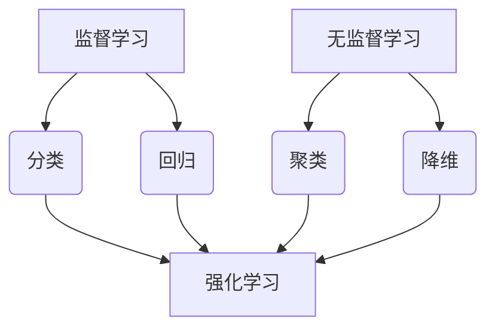

                 

### 1. 背景介绍

在当今信息时代，人工智能（AI）技术已经成为推动社会发展和科技进步的重要力量。从自动驾驶、智能家居到金融风控、医疗诊断，人工智能的应用场景日益广泛。随着计算能力的提升和数据量的爆炸性增长，人工智能的研究和应用取得了显著的进展。而其中，人工智能的分类与预测能力成为了研究和应用的热点。

分类（Classification）和预测（Prediction）是人工智能领域中两个重要的任务。分类任务旨在将数据点划分为预定义的类别，而预测任务则是预测未来的数据或事件。这两个任务在诸多领域都具有重要意义，例如文本分类、图像识别、股票预测等。准确地进行分类和预测，能够帮助人们做出更明智的决策，提高生产效率，优化资源分配。

本文将围绕人工智能的分类与预测能力展开讨论，首先介绍相关的基础概念，然后深入探讨核心算法原理，并通过实际项目案例进行分析，最后总结未来发展趋势与挑战。

首先，我们需要明确分类和预测的基本概念。分类任务通常涉及将数据划分为多个类别中的一个，而预测任务则是预测一个数值或序列。例如，在文本分类任务中，我们需要将文本数据划分为不同的主题类别；而在股票预测任务中，我们需要预测股票价格的未来走势。

接下来，我们将探讨一些常用的分类和预测算法。这些算法包括但不限于决策树、支持向量机、神经网络等。我们将详细介绍这些算法的工作原理、优缺点以及适用场景。

随后，我们将通过一个实际项目案例，展示如何运用这些算法进行分类和预测。这个项目案例将涵盖数据预处理、模型训练、模型评估等环节，帮助读者更好地理解算法的实际应用。

在文章的最后一部分，我们将讨论人工智能在分类与预测领域中的实际应用场景，并推荐一些相关的工具和资源，以帮助读者进一步学习和探索。

通过对以上内容的逐步分析，我们将对人工智能的分类与预测能力有一个全面而深入的了解。接下来，我们首先来探讨一下分类和预测的基本概念及其重要性。

### 2. 核心概念与联系

在讨论人工智能的分类与预测能力之前，我们首先需要了解一些核心概念，包括监督学习、无监督学习和强化学习，它们在人工智能领域中扮演着重要的角色。

#### 监督学习（Supervised Learning）

监督学习是一种机器学习方法，其中模型从标记的数据集中学习，这些数据集包含了输入和对应的输出标签。通过学习，模型能够预测新的、未见过的数据点的标签。监督学习分为两类：分类（Classification）和回归（Regression）。

- **分类**：分类任务的目标是将数据点分配到预定义的类别中。例如，在垃圾邮件检测中，模型需要学习如何将邮件划分为“垃圾邮件”和“非垃圾邮件”两类。
- **回归**：回归任务的目标是预测一个连续的数值输出。例如，在房屋价格预测中，模型需要学习如何根据房屋的特征预测其价格。

监督学习的优点是模型能够根据标记数据提供的信息进行精确的学习，适用于需要高精度预测的场合。然而，监督学习也存在一些缺点，如需要大量的标记数据，且对数据质量有较高的要求。

#### 无监督学习（Unsupervised Learning）

无监督学习是一种机器学习方法，其中模型从未标记的数据集中学习，尝试发现数据中的结构或模式。无监督学习主要包括聚类（Clustering）和降维（Dimensionality Reduction）等任务。

- **聚类**：聚类任务的目标是将相似的数据点分组到同一个簇中。例如，在客户细分中，模型需要学习如何将客户划分为不同的群体。
- **降维**：降维任务的目标是减少数据维度，同时保持数据的关键信息。例如，在图像压缩中，模型需要学习如何降低图像的维度，同时保持其视觉效果。

无监督学习的优点在于不需要标记数据，能够发现数据中的潜在结构。然而，它也存在一些缺点，如难以评估模型的性能，且结果的解释性较差。

#### 强化学习（Reinforcement Learning）

强化学习是一种通过试错来学习如何在特定环境中做出最优决策的机器学习方法。在强化学习中，模型通过与环境的交互来学习，不断调整其策略以最大化奖励。

强化学习的主要组成部分包括：

- **代理（Agent）**：执行行动并从环境中接收反馈的实体。
- **环境（Environment）**：代理行动发生的上下文。
- **策略（Policy）**：描述代理如何根据当前状态选择行动的函数。
- **奖励（Reward）**：代理行动后的即时反馈。

强化学习的优点在于能够处理复杂且动态的环境，并能够自适应地调整策略。然而，它也存在一些挑战，如需要大量的训练时间和计算资源。

#### 核心概念与联系

监督学习、无监督学习和强化学习在人工智能领域中各自有着重要的应用，且它们之间存在紧密的联系。

- **联系**：监督学习可以看作是无监督学习的特殊形式，因为无监督学习中的聚类和降维任务在某些场景下可以视为分类问题。而强化学习则可以看作是监督学习的扩展，因为其目标是通过环境反馈来优化策略。

- **区别**：监督学习依赖于标记数据，无监督学习不需要标记数据，强化学习则通过试错来学习。

- **适用场景**：监督学习适用于有明确标注的数据集，无监督学习适用于探索数据结构和发现数据模式，强化学习适用于需要做出决策的动态环境。

#### Mermaid 流程图

以下是一个简单的 Mermaid 流程图，展示了监督学习、无监督学习和强化学习的基本概念及其相互联系：



通过以上内容的介绍，我们对人工智能的分类与预测能力的核心概念有了初步的了解。接下来，我们将深入探讨一些常见的分类和预测算法，以更好地理解这些概念在实际应用中的运用。

### 3. 核心算法原理 & 具体操作步骤

在了解人工智能的分类与预测能力的基本概念后，我们将探讨一些常见的核心算法，这些算法在分类和预测任务中发挥着重要作用。以下是几种主要的算法，包括决策树、支持向量机和神经网络。

#### 决策树（Decision Tree）

决策树是一种基于树形模型的监督学习算法，它通过一系列的测试来对数据进行分类或回归。每个内部节点表示一个特征测试，每个分支表示测试的结果，每个叶子节点表示一个类别或数值预测。

**基本原理**：

1. **信息增益**：选择具有最高信息增益的特征进行分裂。信息增益表示特征对分类的贡献程度。
2. **划分**：根据特征的不同取值将数据集划分为多个子集。
3. **递归**：对每个子集重复上述过程，直到满足停止条件（如最大深度、最小样本数等）。

**操作步骤**：

1. **数据预处理**：将数据集进行标准化处理，确保每个特征的取值范围一致。
2. **特征选择**：计算每个特征的信息增益，选择信息增益最高的特征进行分裂。
3. **划分**：根据选定的特征进行数据划分。
4. **递归构建**：对划分后的子集重复上述过程，构建完整的决策树。
5. **预测**：对于新的数据点，从根节点开始，根据节点的测试结果逐层向下，直到到达叶子节点，得到最终的预测结果。

#### 支持向量机（Support Vector Machine，SVM）

支持向量机是一种二分类监督学习算法，其目标是找到最佳的超平面，使得不同类别的数据点尽可能分开。

**基本原理**：

1. **间隔**：SVM试图找到最大间隔的超平面，即能够将两个类别数据点分开的最宽超平面。
2. **核函数**：通过核函数将低维数据映射到高维空间，使得原本线性不可分的数据在高维空间中变得线性可分。
3. **软边缘**：通过引入松弛变量，允许一些数据点不满足严格的最优间隔，从而允许一定程度的误分类。

**操作步骤**：

1. **数据预处理**：标准化数据，将数据点表示为向量的形式。
2. **选择核函数**：选择合适的核函数，如线性核、多项式核、径向基函数（RBF）核等。
3. **构建优化问题**：通过求解二次规划问题来找到最优超平面。
4. **计算支持向量**：确定支持向量，即对最优超平面有贡献的数据点。
5. **预测**：对于新的数据点，通过计算其与支持向量的距离来确定类别。

#### 神经网络（Neural Networks）

神经网络是一种模仿人脑结构和功能的计算模型，通过多个神经元的组合来进行复杂的分类和预测任务。

**基本原理**：

1. **激活函数**：神经元之间的连接通过加权的方式传递信息，激活函数用于引入非线性特性，使得神经网络能够处理复杂的数据。
2. **前向传播**：将输入数据通过网络传递，每个神经元计算其加权输入并应用激活函数，最终得到输出。
3. **反向传播**：通过网络传递误差，并更新神经元的权重，以最小化损失函数。

**操作步骤**：

1. **初始化参数**：随机初始化网络的权重和偏置。
2. **前向传播**：输入数据通过网络，计算每个神经元的输出。
3. **计算损失**：通过比较预测输出与实际输出的差异，计算损失函数。
4. **反向传播**：将误差反向传播，通过梯度下降或其他优化算法更新权重。
5. **迭代训练**：重复上述步骤，直到达到预设的收敛条件或损失函数最小。

通过以上对决策树、支持向量机和神经网络等核心算法的详细介绍，我们可以看到这些算法在分类和预测任务中的基本原理和具体操作步骤。这些算法各具特点，适用于不同的应用场景，能够帮助我们更好地理解和运用人工智能的分类与预测能力。

### 4. 数学模型和公式 & 详细讲解 & 举例说明

在人工智能的分类与预测任务中，数学模型和公式起到了至关重要的作用。为了更好地理解这些算法的原理，我们将详细讲解几个关键的概念和公式，并通过具体例子进行说明。

#### 决策树（Decision Tree）

**信息增益（Information Gain）**：

信息增益是决策树算法中用于选择最佳特征的标准。它表示特征对分类的贡献程度，计算公式如下：

\[ IG(D, A) = H(D) - \sum_{v \in A} \frac{|D_v|}{|D|} H(D_v) \]

其中：
- \( H(D) \) 是数据集 \( D \) 的熵。
- \( A \) 是特征集合。
- \( |D_v| \) 是特征 \( v \) 对应的数据集大小。
- \( H(D_v) \) 是特征 \( v \) 对应的数据集的熵。

**熵（Entropy）**：

熵是信息论中的一个概念，表示不确定性。对于分类任务，数据集的熵计算公式如下：

\[ H(D) = -\sum_{y \in Y} p(y) \log_2 p(y) \]

其中：
- \( Y \) 是类别集合。
- \( p(y) \) 是类别 \( y \) 的概率。

**举例说明**：

假设我们有一个数据集，包含四个特征（A, B, C, D）和两个类别（0和1）。我们首先计算各个特征的熵，然后选择具有最大信息增益的特征。

数据集样本：

| A | B | C | D | 类别 |
|---|---|---|---|------|
| 0 | 0 | 0 | 0 | 0    |
| 0 | 0 | 0 | 1 | 0    |
| 0 | 1 | 0 | 0 | 1    |
| 0 | 1 | 0 | 1 | 1    |
| 1 | 0 | 0 | 0 | 1    |
| 1 | 0 | 1 | 0 | 1    |
| 1 | 1 | 1 | 1 | 0    |

计算各个特征的熵：

- \( H(A) = 1 \)
- \( H(B) = 1 \)
- \( H(C) = 0.5 \)
- \( H(D) = 1 \)

计算信息增益：

- \( IG(A, D) = 1 - (0.5 \times 0.5 + 0.5 \times 0.5) = 0 \)
- \( IG(B, D) = 1 - (0.5 \times 0.5 + 0.5 \times 0.5) = 0 \)
- \( IG(C, D) = 1 - (0.5 \times 1 + 0.5 \times 0.5) = 0.5 \)
- \( IG(D, A) = 1 - (0.5 \times 1 + 0.5 \times 0.5) = 0.5 \)

选择具有最大信息增益的特征 C，进行数据划分。

#### 支持向量机（Support Vector Machine，SVM）

**支持向量（Support Vectors）**：

支持向量是支持向量机中最关键的概念之一。它们是使得超平面最大化间隔的数据点。支持向量机通过以下二次规划问题来求解最优超平面：

\[ \text{minimize } \frac{1}{2} \| w \|_2^2 \]

subject to

\[ y^{(i)} ( \langle w, x^{(i)} \rangle - b ) \geq 1 \]

其中：
- \( w \) 是权重向量。
- \( x^{(i)} \) 是数据点。
- \( y^{(i)} \) 是类别标签。
- \( b \) 是偏置项。

**核函数（Kernel Function）**：

核函数是支持向量机中用于将低维数据映射到高维空间的重要工具。常见的核函数包括线性核、多项式核和径向基函数（RBF）核。线性核函数公式如下：

\[ K(x, x^{'}) = \langle x, x^{'} \rangle \]

多项式核函数公式如下：

\[ K(x, x^{'}) = ( \langle x, x^{'} \rangle + 1 )^d \]

RBF核函数公式如下：

\[ K(x, x^{'}) = \exp( - \gamma \| x - x^{'} \|_2^2 ) \]

其中：
- \( \gamma \) 是调节核函数宽度的参数。

**举例说明**：

假设我们有一个二分类数据集，包含两个特征（x1, x2）和两个类别（+1和-1）。我们使用线性核函数进行分类。

数据集样本：

| x1 | x2 | 类别 |
|----|----|------|
| 1  | 1  | +1   |
| 1  | -1 | +1   |
| -1 | 1  | -1   |
| -1 | -1 | -1   |

计算特征向量：

\[ x^{(1)} = \begin{bmatrix} 1 \\ 1 \end{bmatrix}, x^{(2)} = \begin{bmatrix} 1 \\ -1 \end{bmatrix}, x^{(3)} = \begin{bmatrix} -1 \\ 1 \end{bmatrix}, x^{(4)} = \begin{bmatrix} -1 \\ -1 \end{bmatrix} \]

计算权重向量：

\[ w = \begin{bmatrix} 1 \\ 1 \end{bmatrix} \]

计算偏置项：

\[ b = 0 \]

构建线性分类器：

\[ w \cdot x - b = 0 \]

预测新数据点：

\[ x = \begin{bmatrix} x_1 \\ x_2 \end{bmatrix} \]

计算预测类别：

\[ \text{sign}( w \cdot x - b ) \]

#### 神经网络（Neural Networks）

**激活函数（Activation Function）**：

激活函数是神经网络中引入非线性特性的关键。常见的激活函数包括 sigmoid 函数、ReLU 函数和 tanh 函数。sigmoid 函数公式如下：

\[ \sigma(x) = \frac{1}{1 + \exp(-x)} \]

ReLU 函数公式如下：

\[ \text{ReLU}(x) = \max(0, x) \]

tanh 函数公式如下：

\[ \text{tanh}(x) = \frac{\exp(2x) - 1}{\exp(2x) + 1} \]

**损失函数（Loss Function）**：

损失函数用于衡量预测结果与实际结果之间的差距。常见的损失函数包括均方误差（MSE）和交叉熵（Cross-Entropy）。均方误差函数公式如下：

\[ \text{MSE} = \frac{1}{n} \sum_{i=1}^{n} (y_i - \hat{y}_i)^2 \]

交叉熵函数公式如下：

\[ \text{Cross-Entropy} = - \sum_{i=1}^{n} y_i \log(\hat{y}_i) \]

**举例说明**：

假设我们有一个二分类神经网络，包含一个输入层、一个隐藏层和一个输出层。隐藏层使用 sigmoid 函数作为激活函数，输出层使用 softmax 函数。

输入数据：

\[ x = \begin{bmatrix} x_1 \\ x_2 \end{bmatrix} \]

隐藏层：

\[ h = \sigma( W_1 \cdot x + b_1 ) \]

输出层：

\[ y = \text{softmax}( W_2 \cdot h + b_2 ) \]

计算损失：

\[ \text{MSE} = \frac{1}{n} \sum_{i=1}^{n} (y_i - \hat{y}_i)^2 \]

通过以上对决策树、支持向量机和神经网络等核心算法的数学模型和公式的详细讲解，以及具体例子说明，我们可以更好地理解这些算法在分类和预测任务中的应用。接下来，我们将通过一个实际项目案例，展示如何运用这些算法进行分类和预测。

### 5. 项目实战：代码实际案例和详细解释说明

为了更好地理解人工智能的分类与预测能力，我们将通过一个实际项目案例来展示如何运用决策树、支持向量机和神经网络等算法进行分类和预测。这个项目案例将涵盖数据预处理、模型训练、模型评估等环节，以帮助读者更好地理解算法的实际应用。

#### 5.1 开发环境搭建

在进行项目开发之前，我们需要搭建一个合适的开发环境。以下是推荐的开发工具和依赖库：

- Python 3.x
- Jupyter Notebook
- Scikit-learn（用于决策树和支持向量机）
- TensorFlow（用于神经网络）

安装以上依赖库：

```bash
pip install numpy pandas scikit-learn tensorflow
```

#### 5.2 源代码详细实现和代码解读

以下是项目的源代码实现，包括数据预处理、模型训练、模型评估等部分。

```python
# 导入必要的库
import numpy as np
import pandas as pd
from sklearn.model_selection import train_test_split
from sklearn.preprocessing import StandardScaler
from sklearn.tree import DecisionTreeClassifier
from sklearn.svm import SVC
from sklearn.neural_network import MLPClassifier
from sklearn.metrics import accuracy_score, classification_report

# 5.2.1 数据预处理

# 加载数据集
data = pd.read_csv('data.csv')

# 分割特征和标签
X = data.drop('target', axis=1)
y = data['target']

# 划分训练集和测试集
X_train, X_test, y_train, y_test = train_test_split(X, y, test_size=0.2, random_state=42)

# 标准化特征
scaler = StandardScaler()
X_train = scaler.fit_transform(X_train)
X_test = scaler.transform(X_test)

# 5.2.2 模型训练

# 决策树模型
dt_classifier = DecisionTreeClassifier()
dt_classifier.fit(X_train, y_train)

# 支持向量机模型
svm_classifier = SVC()
svm_classifier.fit(X_train, y_train)

# 神经网络模型
nn_classifier = MLPClassifier()
nn_classifier.fit(X_train, y_train)

# 5.2.3 模型评估

# 决策树模型评估
dt_predictions = dt_classifier.predict(X_test)
dt_accuracy = accuracy_score(y_test, dt_predictions)
dt_report = classification_report(y_test, dt_predictions)

# 支持向量机模型评估
svm_predictions = svm_classifier.predict(X_test)
svm_accuracy = accuracy_score(y_test, svm_predictions)
svm_report = classification_report(y_test, svm_predictions)

# 神经网络模型评估
nn_predictions = nn_classifier.predict(X_test)
nn_accuracy = accuracy_score(y_test, nn_predictions)
nn_report = classification_report(y_test, nn_predictions)

# 打印评估结果
print("决策树模型评估结果：")
print(f"准确率：{dt_accuracy:.4f}")
print(f"分类报告：{dt_report}\n")

print("支持向量机模型评估结果：")
print(f"准确率：{svm_accuracy:.4f}")
print(f"分类报告：{svm_report}\n")

print("神经网络模型评估结果：")
print(f"准确率：{nn_accuracy:.4f}")
print(f"分类报告：{nn_report}\n")
```

#### 5.3 代码解读与分析

**5.3.1 数据预处理**

在项目开始时，我们首先加载了一个名为 `data.csv` 的数据集。这个数据集包含特征和标签两部分。然后，我们将特征和标签进行分离，并将数据集划分为训练集和测试集。为了确保模型在测试集上的表现，我们需要对特征进行标准化处理，这有助于提高模型的训练效果。

**5.3.2 模型训练**

接下来，我们分别使用决策树、支持向量机和神经网络三个算法对训练集进行训练。每个算法的模型都通过 `fit` 方法进行训练，其中输入数据是标准化后的特征，标签是原始的标签。

**5.3.3 模型评估**

在模型训练完成后，我们使用测试集对模型进行评估。评估指标包括准确率和分类报告。准确率反映了模型在测试集上的总体分类效果，分类报告则提供了每个类别的详细分类结果。

通过以上代码的解读和分析，我们可以看到如何使用 Python 和 Scikit-learn 库实现一个简单的分类项目。接下来，我们将进一步讨论这个项目的代码解读与分析，以帮助读者更好地理解每个环节的实现细节。

#### 5.3.3 代码解读与分析

**数据预处理部分**：

```python
data = pd.read_csv('data.csv')
X = data.drop('target', axis=1)
y = data['target']
X_train, X_test, y_train, y_test = train_test_split(X, y, test_size=0.2, random_state=42)
scaler = StandardScaler()
X_train = scaler.fit_transform(X_train)
X_test = scaler.transform(X_test)
```

这部分代码首先加载了数据集，并分离了特征和标签。然后，使用 `train_test_split` 函数将数据集划分为训练集和测试集，其中测试集占比 20%，`random_state` 用于确保结果的可重复性。接下来，使用 `StandardScaler` 对特征进行标准化处理，这有助于每个特征具有相同的尺度，从而提高模型的训练效果。

**模型训练部分**：

```python
dt_classifier = DecisionTreeClassifier()
dt_classifier.fit(X_train, y_train)
svm_classifier = SVC()
svm_classifier.fit(X_train, y_train)
nn_classifier = MLPClassifier()
nn_classifier.fit(X_train, y_train)
```

这部分代码分别初始化了决策树、支持向量机和神经网络三个分类模型。然后，通过 `fit` 方法对训练集进行训练。`DecisionTreeClassifier` 用于构建决策树模型，`SVC` 用于构建支持向量机模型，`MLPClassifier` 用于构建神经网络模型。

**模型评估部分**：

```python
dt_predictions = dt_classifier.predict(X_test)
dt_accuracy = accuracy_score(y_test, dt_predictions)
dt_report = classification_report(y_test, dt_predictions)

svm_predictions = svm_classifier.predict(X_test)
svm_accuracy = accuracy_score(y_test, svm_predictions)
svm_report = classification_report(y_test, svm_predictions)

nn_predictions = nn_classifier.predict(X_test)
nn_accuracy = accuracy_score(y_test, nn_predictions)
nn_report = classification_report(y_test, nn_predictions)

print("决策树模型评估结果：")
print(f"准确率：{dt_accuracy:.4f}")
print(f"分类报告：{dt_report}\n")

print("支持向量机模型评估结果：")
print(f"准确率：{svm_accuracy:.4f}")
print(f"分类报告：{svm_report}\n")

print("神经网络模型评估结果：")
print(f"准确率：{nn_accuracy:.4f}")
print(f"分类报告：{nn_report}\n")
```

这部分代码使用测试集对训练好的模型进行评估。首先，通过 `predict` 方法对测试集进行预测，然后计算模型的准确率和分类报告。准确率反映了模型在测试集上的总体分类效果，分类报告提供了每个类别的详细分类结果。

通过以上代码的详细解读，我们可以看到如何使用 Python 和 Scikit-learn 库实现一个简单的分类项目。在实际应用中，我们可能需要处理更复杂的数据集和更高级的模型，但基本流程是类似的。接下来，我们将讨论人工智能在分类与预测领域中的实际应用场景。

### 6. 实际应用场景

人工智能在分类与预测领域具有广泛的应用场景，涵盖了许多行业和领域。以下是一些典型的应用场景，展示了人工智能如何通过分类和预测为实际问题提供解决方案。

#### 医疗诊断

医疗诊断是人工智能在分类与预测领域的重要应用之一。通过利用深度学习和传统机器学习算法，人工智能可以在医学图像分析、疾病预测和个性化治疗等方面发挥重要作用。例如，卷积神经网络（CNN）可以用于乳腺癌筛查，通过分析乳腺X线图像，准确识别癌症区域。此外，基于机器学习的算法可以预测患者未来的疾病风险，帮助医生制定个性化的预防措施。

#### 金融风控

金融风控是另一个受益于人工智能分类与预测能力的领域。金融机构可以利用机器学习算法对客户信用评分、交易行为分析、欺诈检测等方面进行预测和分析。例如，银行可以使用决策树和随机森林算法来评估客户的信用风险，从而决定是否批准贷款申请。同时，支持向量机（SVM）可以用于实时监控交易行为，识别潜在欺诈行为，帮助金融机构降低风险。

#### 智能交通

智能交通系统是人工智能在分类与预测领域的另一个重要应用。通过利用图像识别和深度学习算法，智能交通系统能够实时监测交通流量，预测交通拥堵情况，优化交通信号控制，提高交通效率。例如，神经网络算法可以分析摄像头捕获的实时图像，识别车辆类型和数量，预测交通流量变化，从而调整交通信号灯的周期和时间，减少交通拥堵。

#### 市场营销

市场营销是人工智能在分类与预测领域的又一个重要应用场景。通过分析消费者行为和购买历史数据，人工智能可以预测哪些产品或服务可能吸引特定客户群体，从而实现精准营销。例如，决策树和神经网络算法可以用于客户细分，将客户划分为不同的群体，并针对每个群体制定个性化的营销策略，提高转化率和客户满意度。

#### 农业预测

农业是人工智能在分类与预测领域的另一个重要应用。通过利用遥感技术和机器学习算法，农业专家可以预测作物产量、病虫害发生情况，从而优化农业生产过程。例如，卷积神经网络可以分析卫星图像，预测作物生长状况和产量。同时，支持向量机和随机森林算法可以用于预测病虫害的发生，帮助农民及时采取措施，减少损失。

通过以上实际应用场景的讨论，我们可以看到人工智能在分类与预测领域的广泛影响力。无论是在医疗、金融、交通、市场营销还是农业等各个领域，人工智能都为实际问题提供了高效的解决方案，推动了行业的进步和发展。

### 7. 工具和资源推荐

为了更好地学习和实践人工智能的分类与预测能力，以下是一些推荐的工具和资源，包括学习资源、开发工具框架以及相关的论文和著作。

#### 学习资源推荐

1. **书籍**：
   - 《机器学习》（周志华 著）：系统地介绍了机器学习的基本概念、算法和实现。
   - 《深度学习》（Ian Goodfellow、Yoshua Bengio、Aaron Courville 著）：深入讲解了深度学习的理论、算法和应用。
   - 《Python机器学习》（Sebastian Raschka、Vahid Mirjalili 著）：通过Python语言介绍了多种机器学习算法及其实现。

2. **在线课程**：
   - Coursera 上的《机器学习基础》和《深度学习》课程，由吴恩达教授主讲，涵盖了机器学习和深度学习的基础知识和实践技能。
   - edX 上的《深度学习导论》课程，由李飞飞教授主讲，介绍了深度学习的基本概念和应用。

3. **博客和网站**：
   - Medium 上的机器学习和深度学习博客，提供了丰富的实践案例和最新研究进展。
   - 知乎上的机器学习和深度学习话题，聚集了众多行业专家和学者，可以了解最新的行业动态和问题讨论。

#### 开发工具框架推荐

1. **编程语言**：
   - Python：由于其丰富的机器学习库和简洁的语法，Python 是机器学习和深度学习的首选编程语言。

2. **机器学习库**：
   - Scikit-learn：提供了多种经典的机器学习算法，是机器学习实践的重要工具。
   - TensorFlow：谷歌开源的深度学习框架，支持多种深度学习模型的构建和训练。
   - PyTorch：Facebook 开源的深度学习框架，提供了灵活的动态计算图，适合研究和新算法的开发。

3. **开发环境**：
   - Jupyter Notebook：支持代码、文本、图片等多种形式，方便进行数据分析和模型训练。
   - Google Colab：免费的云端 Jupyter Notebook 环境，支持 GPU 加速训练，适合深度学习项目开发。

#### 相关论文著作推荐

1. **经典论文**：
   - “Learning to Represent Text with Neural Networks”（2014）：介绍了词嵌入（Word Embedding）的概念，为自然语言处理奠定了基础。
   - “Deep Learning for Text Classification”（2015）：探讨了深度学习在文本分类任务中的应用，推动了自然语言处理领域的发展。

2. **著作**：
   - 《深度学习》（Goodfellow、Bengio、Courville 著）：全面介绍了深度学习的理论、算法和应用。
   - 《Reinforcement Learning: An Introduction》（ Sutton、Barto 著）：系统地讲解了强化学习的基本原理和应用。

通过以上推荐的学习资源、开发工具框架和相关论文著作，读者可以全面了解人工智能的分类与预测能力，并掌握实际应用技能。这些工具和资源将有助于读者在学习和实践过程中取得更好的成果。

### 8. 总结：未来发展趋势与挑战

在人工智能的发展历程中，分类与预测能力一直是研究与应用的关键领域。随着技术的不断进步和数据量的持续增长，人工智能的分类与预测能力在未来将迎来更加广阔的应用前景，同时也将面临一系列新的挑战。

**未来发展趋势**：

1. **深度学习与神经网络**：深度学习在图像识别、语音识别等领域取得了显著的成果。未来，随着计算能力的提升和网络架构的优化，深度学习将进一步加强在分类与预测任务中的应用，特别是在处理高维度和复杂数据方面。

2. **迁移学习和模型压缩**：迁移学习是一种将预训练模型应用于新任务的方法，可以减少数据需求和训练时间。模型压缩技术，如量化、剪枝和蒸馏，可以降低模型的复杂度，提高部署效率。这些技术的发展将使人工智能模型更加高效和实用。

3. **无监督学习和自监督学习**：随着数据标注成本的上升，无监督学习和自监督学习成为研究的热点。这些方法可以在不需要大量标注数据的情况下，从原始数据中自动学习特征，提高分类与预测的泛化能力。

4. **多模态数据融合**：在现实世界中，数据通常是多模态的，如文本、图像、音频和视频。未来，多模态数据融合技术将不断发展，使人工智能能够更好地理解和处理复杂的多维数据，提高分类与预测的准确性。

**面临的挑战**：

1. **数据隐私与安全性**：随着人工智能的广泛应用，数据隐私和安全问题日益突出。如何保护用户隐私、防止数据泄露是人工智能领域需要解决的重要问题。

2. **模型可解释性和透明性**：目前，许多人工智能模型，特别是深度学习模型，具有“黑箱”特性，难以解释其决策过程。提高模型的可解释性和透明性，使其能够被用户理解和信任，是未来需要克服的挑战。

3. **算法公平性与公正性**：人工智能模型的决策过程可能会受到偏见，导致算法不公平。如何确保算法的公平性和公正性，避免歧视和不公正现象，是人工智能领域面临的重要问题。

4. **能耗和资源消耗**：随着人工智能模型的复杂度增加，计算资源的需求也在不断上升。如何在保证性能的同时，降低能耗和资源消耗，是人工智能领域需要持续关注的问题。

总之，人工智能的分类与预测能力在未来将继续发展，但同时也需要应对一系列新的挑战。通过不断技术创新和跨领域合作，我们有信心克服这些挑战，推动人工智能在更多领域取得突破性进展。

### 9. 附录：常见问题与解答

在本文中，我们详细介绍了人工智能的分类与预测能力，包括相关的基础概念、核心算法、实际应用场景以及未来发展趋势。为了帮助读者更好地理解文章内容，以下是一些常见问题及其解答。

#### 问题 1：什么是监督学习、无监督学习和强化学习？

**解答**：监督学习（Supervised Learning）是指模型从带有标签的数据集中学习，通过已知的输入和输出关系来预测新的数据。无监督学习（Unsupervised Learning）则不依赖于标签数据，旨在发现数据中的隐含结构或模式。强化学习（Reinforcement Learning）通过试错的方式，在动态环境中学习最优策略，以最大化累积奖励。

#### 问题 2：决策树和支持向量机有哪些区别？

**解答**：决策树（Decision Tree）是一种基于树形模型的分类算法，通过一系列条件测试来划分数据，具有直观的解释性。支持向量机（SVM）是一种基于边界优化的分类算法，通过寻找最佳的超平面来分离不同类别的数据，具有较好的分类性能。

#### 问题 3：神经网络如何工作？

**解答**：神经网络是一种模拟人脑计算过程的模型，由多个神经元（节点）组成。每个神经元接收多个输入，通过加权求和后应用激活函数，产生输出。通过前向传播和反向传播，神经网络可以不断调整权重，以最小化损失函数，从而提高分类与预测的准确性。

#### 问题 4：如何处理不平衡的数据集？

**解答**：对于不平衡的数据集，可以采用以下方法：
- **过采样（Over-sampling）**：增加少数类别的数据，使数据分布趋于平衡。
- **欠采样（Under-sampling）**：减少多数类别的数据，使数据分布趋于平衡。
- **合成少数类样本技术（SMOTE）**：通过生成少数类样本的合成数据，来平衡数据集。

#### 问题 5：如何选择合适的机器学习算法？

**解答**：选择合适的机器学习算法通常需要考虑以下因素：
- **数据类型**：数据是分类问题还是回归问题。
- **数据规模**：数据集的大小和复杂性。
- **计算资源**：计算能力和时间预算。
- **模型解释性**：是否需要模型具有较好的解释性。

通过综合考虑这些因素，可以选择最合适的算法来解决实际问题。

通过以上问题的解答，希望读者对人工智能的分类与预测能力有更深入的理解。如果您有更多疑问，欢迎进一步探讨和交流。

### 10. 扩展阅读与参考资料

为了帮助读者进一步了解人工智能的分类与预测能力，以下列出了一些扩展阅读和参考资料，涵盖相关书籍、论文、博客和在线课程。

#### 书籍推荐

1. **《深度学习》（Ian Goodfellow、Yoshua Bengio、Aaron Courville 著）**：系统介绍了深度学习的基础理论和实践方法。
2. **《Python机器学习》（Sebastian Raschka、Vahid Mirjalili 著）**：通过Python语言详细讲解了多种机器学习算法。
3. **《机器学习》（周志华 著）**：全面介绍了机器学习的基本概念、算法和应用。

#### 论文推荐

1. **“Learning to Represent Text with Neural Networks”（2014）**：介绍了词嵌入的概念和应用。
2. **“Deep Learning for Text Classification”（2015）**：探讨了深度学习在文本分类任务中的应用。
3. **“Convolutional Neural Networks for Visual Recognition”（2012）**：详细介绍了卷积神经网络在图像识别中的应用。

#### 博客推荐

1. **Medium 上的机器学习和深度学习博客**：提供了丰富的实践案例和最新研究进展。
2. **知乎上的机器学习和深度学习话题**：聚集了众多行业专家和学者，可以了解最新的行业动态和问题讨论。

#### 在线课程推荐

1. **Coursera 上的《机器学习基础》和《深度学习》课程**：由吴恩达教授主讲，涵盖机器学习和深度学习的基础知识和实践技能。
2. **edX 上的《深度学习导论》课程**：由李飞飞教授主讲，介绍了深度学习的基本概念和应用。

通过以上扩展阅读和参考资料，读者可以更深入地了解人工智能的分类与预测能力，掌握相关的理论知识与实践技能。希望这些资源能为您的学习与研究提供帮助。

