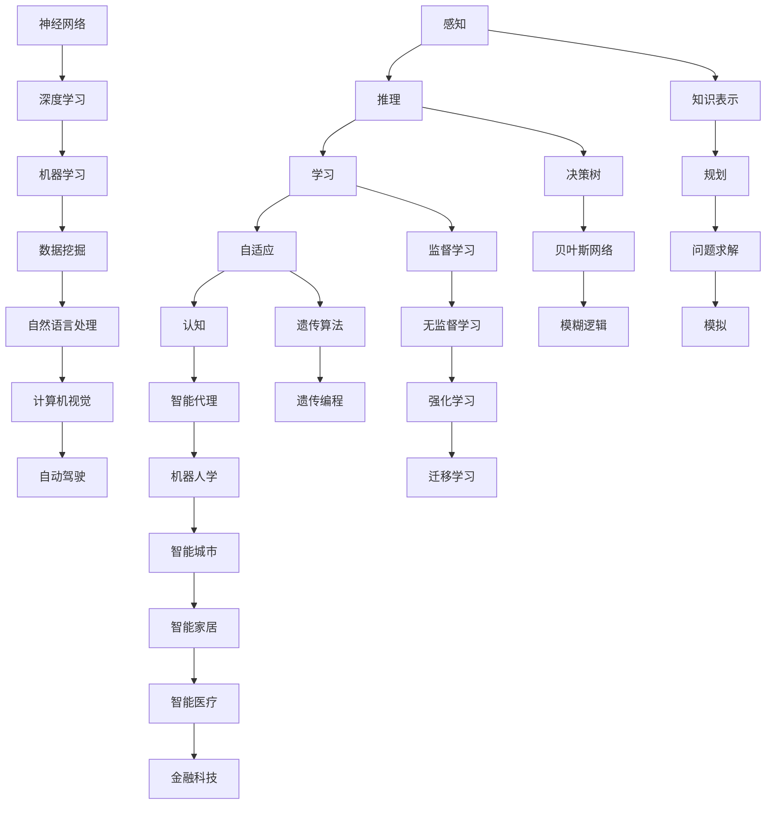

                 

# 人工智能领域的早期探索

> 关键词：人工智能历史、早期发展、关键算法、数学模型、应用场景

> 摘要：本文旨在回顾人工智能领域的发展历程，探讨早期探索中的重要算法、数学模型及其应用场景。通过对早期研究者和创新成果的梳理，本文将揭示人工智能领域从萌芽到成长的关键转折点，以及这些成就对现代人工智能技术的深远影响。

## 1. 背景介绍

人工智能（Artificial Intelligence, AI）作为计算机科学的一个分支，致力于研究如何使计算机模拟人类的智能行为。人工智能的早期探索始于20世纪50年代，当时计算机科学家和哲学家开始思考如何构建能够思考、学习和推理的机器。

### 1.1 人工智能的起源

人工智能的概念最早可以追溯到古希腊哲学家泰勒斯（Thales）对自然现象的观察，以及亚里士多德（Aristotle）关于逻辑和推理的研究。然而，人工智能的现代定义和概念起源于20世纪中期。

1956年的达特茅斯会议被认为是人工智能诞生的标志。此次会议由约翰·麦卡锡（John McCarthy）等人发起，参会者共同讨论了人工智能的理论基础和应用前景。自此，人工智能开始成为一个独立的学科，吸引了大量研究人员和学者的关注。

### 1.2 人工智能的发展历程

人工智能的发展历程可以分为几个阶段：早期探索、停滞期、复兴和快速发展。

- **早期探索（1956-1974）**：这一阶段主要是对人工智能基本理论和算法的初步探索。1956年达特茅斯会议后，人工智能研究迅速展开，许多重要的算法和理论模型被提出。

- **停滞期（1974-1980）**：由于早期的人工智能系统在实用性和性能上未能达到预期，加上计算资源的限制，人工智能研究进入了一段低潮期。

- **复兴（1980-2010）**：随着计算能力的提升和算法的进步，人工智能研究再次受到关注。神经网络、机器学习等技术的突破为人工智能的发展奠定了基础。

- **快速发展（2010至今）**：近年来，深度学习等先进技术的崛起，使得人工智能在图像识别、自然语言处理、自动驾驶等领域取得了显著成果。

## 2. 核心概念与联系

在人工智能的早期探索中，一些核心概念和算法的提出对后续的研究产生了深远影响。下面，我们将通过一个Mermaid流程图来展示这些核心概念及其联系。



### 2.1 感知与推理

感知是指计算机获取和理解外部信息的过程，推理则是基于已有信息做出推断和决策。感知和推理是人工智能的两个基本组成部分。

### 2.2 学习与自适应

学习是人工智能的核心能力，分为监督学习、无监督学习和强化学习等类型。自适应是指系统能够根据环境和数据的变化进行调整和优化。

### 2.3 认知与智能代理

认知是指计算机模拟人类思维过程，包括知识表示、规划和问题求解。智能代理则是具有独立行动能力的计算机程序，能够自主执行任务。

### 2.4 神经网络与深度学习

神经网络是一种模拟人脑神经元连接的算法模型，深度学习则是基于多层神经网络的学习方法。神经网络和深度学习在图像识别、语音识别等领域取得了突破性进展。

### 2.5 数据挖掘与自然语言处理

数据挖掘是指从大量数据中发现有价值的信息和模式，自然语言处理则是使计算机理解和生成人类语言的技术。数据挖掘和自然语言处理是人工智能应用中的重要方向。

### 2.6 计算机视觉与自动驾驶

计算机视觉是指使计算机能够理解和处理图像和视频信息，自动驾驶则是利用计算机视觉和机器学习技术实现车辆自主导航和控制。

## 3. 核心算法原理 & 具体操作步骤

在人工智能的早期探索中，许多重要的算法被提出，下面我们将介绍其中几个核心算法的原理和具体操作步骤。

### 3.1 决策树

决策树是一种基于特征进行分类或回归的算法，其基本原理是通过一系列判断条件将数据集划分为不同的分支，最终到达叶子节点，得到分类或回归结果。

具体操作步骤如下：

1. 计算每个特征的信息增益，选择增益最大的特征作为节点。
2. 根据该特征将数据集划分为不同的子集。
3. 对每个子集递归执行步骤1和2，直到满足停止条件（如最大深度、最小叶节点样本数等）。

### 3.2 贝叶斯网络

贝叶斯网络是一种基于概率论的图模型，用于表示变量之间的条件依赖关系。其基本原理是利用贝叶斯定理计算变量的后验概率分布。

具体操作步骤如下：

1. 构建变量之间的依赖关系图。
2. 计算每个变量的条件概率分布。
3. 根据网络结构进行推理，计算变量的后验概率分布。

### 3.3 神经网络

神经网络是一种基于生物神经元连接的算法模型，用于拟合复杂的函数关系。其基本原理是通过对输入数据进行层层变换，最终得到输出结果。

具体操作步骤如下：

1. 设计网络结构，包括层数、神经元个数和激活函数。
2. 初始化网络权重和偏置。
3. 前向传播，计算每个神经元的输出。
4. 计算损失函数，反向传播更新网络权重和偏置。
5. 重复步骤3和4，直至满足停止条件。

## 4. 数学模型和公式 & 详细讲解 & 举例说明

在人工智能的早期探索中，许多重要的算法都依赖于数学模型和公式的支持。下面我们将介绍几个核心数学模型，并进行详细讲解和举例说明。

### 4.1 决策树

决策树的分类和回归过程可以表示为以下数学模型：

$$
y = g(W_1x_1 + W_2x_2 + ... + W_nx_n + b)
$$

其中，$y$ 表示分类或回归结果，$x_1, x_2, ..., x_n$ 表示输入特征，$W_1, W_2, ..., W_n$ 表示特征权重，$b$ 表示偏置，$g$ 表示激活函数。

举例说明：

假设我们要对数据集进行二分类，输入特征为$x_1$和$x_2$，特征权重分别为$W_1=2$和$W_2=1$，偏置$b=0$，激活函数为线性函数。则有：

$$
y = g(2x_1 + x_2) = 2x_1 + x_2
$$

当$y \geq 0$时，分类结果为正类；当$y < 0$时，分类结果为负类。

### 4.2 贝叶斯网络

贝叶斯网络的推理过程可以表示为以下数学模型：

$$
P(X=x|Y=y) = \frac{P(Y=y|X=x)P(X=x)}{P(Y=y)}
$$

其中，$X$ 表示变量集合，$Y$ 表示目标变量，$P(X=x|Y=y)$ 表示在给定目标变量$y$的情况下，变量$X$取值$x$的条件概率，$P(Y=y|X=x)$ 表示在变量$X$取值$x$的情况下，目标变量$Y$取值$y$的条件概率，$P(X=x)$ 表示变量$X$取值$x$的先验概率，$P(Y=y)$ 表示目标变量$y$的先验概率。

举例说明：

假设我们有一个二变量的贝叶斯网络，变量$X_1$和$X_2$的条件概率分布如下：

$$
P(X_1=0) = 0.5, P(X_1=1) = 0.5
$$

$$
P(X_2=0|X_1=0) = 0.7, P(X_2=1|X_1=0) = 0.3
$$

$$
P(X_2=0|X_1=1) = 0.4, P(X_2=1|X_1=1) = 0.6
$$

我们要计算在$X_1=0$的条件下，$X_2=1$的概率：

$$
P(X_2=1|X_1=0) = \frac{P(X_2=1|X_1=0)P(X_1=0)}{P(X_2=1|X_1=0)P(X_1=0) + P(X_2=1|X_1=1)P(X_1=1)}
$$

$$
P(X_2=1|X_1=0) = \frac{0.3 \times 0.5}{0.3 \times 0.5 + 0.6 \times 0.5} = \frac{3}{9} = 0.333
$$

### 4.3 神经网络

神经网络的前向传播和反向传播过程可以表示为以下数学模型：

前向传播：

$$
Z_l = W_l \cdot A_{l-1} + b_l
$$

$$
A_l = \sigma(Z_l)
$$

反向传播：

$$
\Delta Z_l = A_l - y
$$

$$
\Delta W_l = \alpha \cdot A_{l-1} \cdot \Delta Z_l
$$

$$
\Delta b_l = \alpha \cdot \Delta Z_l
$$

其中，$A_l$ 表示第$l$层的激活值，$Z_l$ 表示第$l$层的线性组合，$W_l$ 和 $b_l$ 分别表示第$l$层的权重和偏置，$\sigma$ 表示激活函数，$\alpha$ 表示学习率，$y$ 表示期望输出。

举例说明：

假设我们有一个两层的神经网络，输入层有3个神经元，隐藏层有2个神经元，输出层有1个神经元，激活函数为ReLU函数，学习率$\alpha=0.1$。输入数据为$x_1=2, x_2=3, x_3=4$，期望输出为$y=5$。

初始化权重和偏置为：

$$
W_1 = \begin{bmatrix}
1 & 1 & 1 \\
0 & 1 & 0
\end{bmatrix}, b_1 = \begin{bmatrix}
1 \\
0
\end{bmatrix}
$$

$$
W_2 = \begin{bmatrix}
1 & 0 \\
0 & 1
\end{bmatrix}, b_2 = \begin{bmatrix}
1 \\
1
\end{bmatrix}
$$

前向传播：

$$
Z_1 = W_1 \cdot A_0 + b_1 = \begin{bmatrix}
1 & 1 & 1 \\
0 & 1 & 0
\end{bmatrix} \cdot \begin{bmatrix}
2 \\
3 \\
4
\end{bmatrix} + \begin{bmatrix}
1 \\
0
\end{bmatrix} = \begin{bmatrix}
8 \\
4
\end{bmatrix} + \begin{bmatrix}
1 \\
0
\end{bmatrix} = \begin{bmatrix}
9 \\
4
\end{bmatrix}
$$

$$
A_1 = \sigma(Z_1) = \begin{bmatrix}
5 \\
1
\end{bmatrix}
$$

$$
Z_2 = W_2 \cdot A_1 + b_2 = \begin{bmatrix}
1 & 0 \\
0 & 1
\end{bmatrix} \cdot \begin{bmatrix}
5 \\
1
\end{bmatrix} + \begin{bmatrix}
1 \\
1
\end{bmatrix} = \begin{bmatrix}
6 \\
2
\end{bmatrix} + \begin{bmatrix}
1 \\
1
\end{bmatrix} = \begin{bmatrix}
7 \\
3
\end{bmatrix}
$$

$$
A_2 = \sigma(Z_2) = \begin{bmatrix}
7 \\
3
\end{bmatrix}
$$

$$
y = A_2 = \begin{bmatrix}
7 \\
3
\end{bmatrix}
$$

计算损失函数：

$$
L = \frac{1}{2} \sum_{i=1}^{n} (y_i - \hat{y}_i)^2 = \frac{1}{2} \sum_{i=1}^{n} (5 - 7)^2 + (1 - 3)^2 = \frac{1}{2} \cdot 4 + \frac{1}{2} \cdot 4 = 4
$$

反向传播：

$$
\Delta Z_2 = A_2 - y = \begin{bmatrix}
7 \\
3
\end{bmatrix} - \begin{bmatrix}
5 \\
1
\end{bmatrix} = \begin{bmatrix}
2 \\
2
\end{bmatrix}
$$

$$
\Delta W_2 = \alpha \cdot A_1 \cdot \Delta Z_2 = 0.1 \cdot \begin{bmatrix}
5 \\
1
\end{bmatrix} \cdot \begin{bmatrix}
2 \\
2
\end{bmatrix} = \begin{bmatrix}
0.1 \cdot 10 \\
0.1 \cdot 2
\end{bmatrix} = \begin{bmatrix}
1 \\
0.2
\end{bmatrix}
$$

$$
\Delta b_2 = \alpha \cdot \Delta Z_2 = 0.1 \cdot \begin{bmatrix}
2 \\
2
\end{bmatrix} = \begin{bmatrix}
0.2 \\
0.2
\end{bmatrix}
$$

更新权重和偏置：

$$
W_2 = W_2 + \Delta W_2 = \begin{bmatrix}
1 & 0 \\
0 & 1
\end{bmatrix} + \begin{bmatrix}
1 \\
0.2
\end{bmatrix} = \begin{bmatrix}
2 & 0.2 \\
0 & 1.2
\end{bmatrix}
$$

$$
b_2 = b_2 + \Delta b_2 = \begin{bmatrix}
1 \\
1
\end{bmatrix} + \begin{bmatrix}
0.2 \\
0.2
\end{bmatrix} = \begin{bmatrix}
1.2 \\
1.2
\end{bmatrix}
$$

重复上述过程，直到满足停止条件。

## 5. 项目实战：代码实际案例和详细解释说明

在本节中，我们将通过一个简单的实际案例来展示如何使用Python实现决策树算法，并对其进行详细解释。

### 5.1 开发环境搭建

要实现决策树算法，我们需要安装Python环境和相关库。以下是安装步骤：

1. 安装Python：访问Python官网（https://www.python.org/）下载并安装Python。
2. 安装决策树库：在终端中运行以下命令：
   ```bash
   pip install scikit-learn
   ```

### 5.2 源代码详细实现和代码解读

下面是决策树算法的实现代码，我们将逐行解释其功能。

```python
from sklearn.datasets import load_iris
from sklearn.model_selection import train_test_split
from sklearn.tree import DecisionTreeClassifier
import matplotlib.pyplot as plt

# 加载鸢尾花数据集
iris = load_iris()
X = iris.data
y = iris.target

# 划分训练集和测试集
X_train, X_test, y_train, y_test = train_test_split(X, y, test_size=0.3, random_state=42)

# 创建决策树分类器
clf = DecisionTreeClassifier()

# 训练模型
clf.fit(X_train, y_train)

# 预测测试集
y_pred = clf.predict(X_test)

# 计算准确率
accuracy = clf.score(X_test, y_test)
print(f"Accuracy: {accuracy:.2f}")

# 绘制决策树
plt.figure(figsize=(12, 8))
plt.title("Decision Tree")
plt.xlabel("Feature Index")
plt.ylabel("Class")
plt.imshow(clf.tree_.value, cmap=plt.cm.RdBu, aspect=1.0, origin="lower")
plt.xticks([])
plt.yticks([])
plt.colorbar()
plt.show()
```

代码解读：

1. 导入所需库：`load_iris`用于加载鸢尾花数据集，`train_test_split`用于划分训练集和测试集，`DecisionTreeClassifier`用于创建决策树分类器，`matplotlib.pyplot`用于绘制决策树。

2. 加载鸢尾花数据集：鸢尾花数据集是一个常用的多分类问题数据集，包含三个类别。

3. 划分训练集和测试集：将数据集划分为70%的训练集和30%的测试集。

4. 创建决策树分类器：`DecisionTreeClassifier()`创建一个决策树分类器。

5. 训练模型：使用训练集数据对决策树分类器进行训练。

6. 预测测试集：使用训练好的模型对测试集进行预测。

7. 计算准确率：计算预测结果与实际标签的准确率。

8. 绘制决策树：使用`imshow`函数绘制决策树，展示决策树的结构和节点。

### 5.3 代码解读与分析

下面我们对代码中的关键部分进行详细解读和分析。

1. **加载鸢尾花数据集**

   ```python
   iris = load_iris()
   X = iris.data
   y = iris.target
   ```

   这两行代码加载了鸢尾花数据集，并将其划分为特征矩阵$X$和标签向量$y$。

2. **划分训练集和测试集**

   ```python
   X_train, X_test, y_train, y_test = train_test_split(X, y, test_size=0.3, random_state=42)
   ```

   `train_test_split`函数用于划分训练集和测试集，其中`test_size=0.3`表示测试集占比30%，`random_state=42`用于保证每次划分的一致性。

3. **创建决策树分类器**

   ```python
   clf = DecisionTreeClassifier()
   ```

   创建一个决策树分类器，默认参数下，决策树分类器将自动选择最优的分裂方式。

4. **训练模型**

   ```python
   clf.fit(X_train, y_train)
   ```

   使用训练集数据对决策树分类器进行训练。`fit`函数将自动计算最优的分裂方式，并更新树结构。

5. **预测测试集**

   ```python
   y_pred = clf.predict(X_test)
   ```

   使用训练好的模型对测试集进行预测，得到预测结果$y_pred$。

6. **计算准确率**

   ```python
   accuracy = clf.score(X_test, y_test)
   print(f"Accuracy: {accuracy:.2f}")
   ```

   计算预测结果与实际标签的准确率，并打印输出。

7. **绘制决策树**

   ```python
   plt.figure(figsize=(12, 8))
   plt.title("Decision Tree")
   plt.xlabel("Feature Index")
   plt.ylabel("Class")
   plt.imshow(clf.tree_.value, cmap=plt.cm.RdBu, aspect=1.0, origin="lower")
   plt.xticks([])
   plt.yticks([])
   plt.colorbar()
   plt.show()
   ```

   使用`imshow`函数绘制决策树，展示决策树的结构和节点。通过颜色表示不同类别的分布情况。

## 6. 实际应用场景

人工智能在早期探索中取得的成就，为现代人工智能技术的发展奠定了基础。下面我们来看几个实际应用场景，展示人工智能在各个领域的应用。

### 6.1 医疗

人工智能在医疗领域具有巨大的潜力，包括疾病诊断、药物研发、智能辅助手术等方面。

- **疾病诊断**：利用深度学习和计算机视觉技术，人工智能可以分析医学影像，如X光、CT、MRI等，帮助医生进行疾病诊断，提高诊断准确率。
- **药物研发**：通过人工智能技术，可以加速药物研发过程，从大量化合物中筛选出潜在的有效药物。
- **智能辅助手术**：人工智能可以帮助医生进行手术规划，提高手术的精确度和安全性。

### 6.2 金融服务

人工智能在金融服务领域发挥着重要作用，包括风险评估、智能投顾、反欺诈等方面。

- **风险评估**：利用机器学习算法，可以对客户信用进行评估，提高贷款审批的准确性。
- **智能投顾**：人工智能可以根据投资者的风险偏好和投资目标，提供个性化的投资建议。
- **反欺诈**：通过大数据分析和机器学习技术，人工智能可以识别和防范金融欺诈行为。

### 6.3 自动驾驶

自动驾驶是人工智能的一个重要应用领域，通过计算机视觉、深度学习和传感器融合等技术，实现车辆的自主导航和控制。

- **环境感知**：自动驾驶汽车利用计算机视觉技术，对周围环境进行感知，识别道路、行人、车辆等。
- **路径规划**：基于传感器数据和环境感知结果，自动驾驶系统可以规划最优行驶路径，确保车辆的安全行驶。
- **控制执行**：自动驾驶系统通过控制执行单元，实现车辆的加速、制动、转向等动作。

### 6.4 智能家居

智能家居是人工智能在家庭生活领域的应用，通过物联网和人工智能技术，实现家庭设备的智能化和自动化。

- **设备控制**：智能家居系统可以通过手机APP、语音控制等方式，实现对家庭设备的远程控制和自动化操作。
- **环境监测**：智能家居设备可以监测室内环境参数，如温度、湿度、空气质量等，并根据检测结果自动调节设备。
- **智能安防**：智能家居系统可以集成安防设备，如摄像头、门锁等，实现实时监控和报警功能。

### 6.5 智能城市

智能城市是利用人工智能技术，实现城市管理的智能化和高效化。

- **交通管理**：通过大数据分析和人工智能技术，可以优化交通信号控制，缓解交通拥堵问题。
- **环境监测**：利用传感器网络和人工智能技术，对城市环境进行实时监测，提高环境质量。
- **公共安全**：人工智能可以帮助政府部门进行公共安全管理和应急响应，提高公共安全保障。

## 7. 工具和资源推荐

### 7.1 学习资源推荐

- **书籍**：
  - 《人工智能：一种现代方法》（Peter Norvig & Stuart Russell）
  - 《机器学习》（Tom Mitchell）
  - 《深度学习》（Ian Goodfellow、Yoshua Bengio & Aaron Courville）
- **在线课程**：
  - [斯坦福大学机器学习课程](https://www.coursera.org/learn/machine-learning)
  - [吴恩达深度学习课程](https://www.deeplearning.ai/)
  - [MIT人工智能课程](https://ocw.mit.edu/courses/electrical-engineering-and-computer-science/6-867-machine-learning.html)
- **论文**：
  - [神经网络与深度学习：理论、算法与代码实现](https://www.deeplearningbook.org/)
  - [机器学习论文集](https://paperswithcode.com/papers)
- **博客和社区**：
  - [机器之心](https://www.machingxx.com/)
  - [人工智能日报](https://ai日报.com/)
  - [AI 研习社](https://www.36kr.com/publisher/post/1013957927809104)

### 7.2 开发工具框架推荐

- **编程语言**：
  - Python
  - R
  - Java
- **机器学习库**：
  - TensorFlow
  - PyTorch
  - Keras
- **数据预处理库**：
  - Pandas
  - NumPy
  - Scikit-learn
- **可视化库**：
  - Matplotlib
  - Seaborn
  - Plotly
- **版本控制工具**：
  - Git
  - GitHub
  - GitLab

### 7.3 相关论文著作推荐

- **经典论文**：
  - "A Mathematical Theory of Communication"（克劳德·香农）
  - "Pattern Classification"（Richard O. Duda、Peter E. Hart & David G. Stork）
  - "Deep Learning"（Ian Goodfellow、Yoshua Bengio & Aaron Courville）
- **著作**：
  - 《机器学习实战》（Peter Harrington）
  - 《深度学习》（Ian Goodfellow、Yoshua Bengio & Aaron Courville）
  - 《统计学习方法》（李航）

## 8. 总结：未来发展趋势与挑战

随着人工智能技术的不断进步，我们可以预见未来人工智能领域的发展趋势和面临的挑战。

### 8.1 发展趋势

1. **深度学习技术**：深度学习在图像识别、自然语言处理等领域取得了巨大成功，未来将进一步提高算法的效率和准确性，并应用于更多领域。
2. **强化学习**：强化学习在游戏、自动驾驶、机器人等领域具有广泛应用前景，未来将实现更高效的学习算法，提高系统自主决策能力。
3. **多模态学习**：多模态学习通过结合不同类型的数据（如图像、声音、文本），实现更全面和准确的信息处理，未来将在医疗、金融等领域发挥重要作用。
4. **边缘计算**：边缘计算将计算能力从云端转移到靠近数据源的边缘设备，实现实时数据处理和智能决策，满足物联网和智能城市的需求。

### 8.2 挑战

1. **数据隐私与安全**：随着人工智能技术的发展，数据隐私和安全问题日益突出，如何在保证数据隐私的前提下，有效利用数据进行人工智能研究，是一个重要挑战。
2. **算法公平性与透明性**：人工智能系统在决策过程中存在偏见和歧视的风险，如何保证算法的公平性和透明性，使其更加公正和可信，是一个重要问题。
3. **计算资源需求**：深度学习和其他复杂的人工智能算法对计算资源的需求极高，未来如何提高计算效率、降低计算成本，是一个重要挑战。
4. **跨学科融合**：人工智能技术的发展需要跨学科的合作，如何充分发挥不同学科的优势，实现人工智能技术的创新和突破，是一个重要问题。

## 9. 附录：常见问题与解答

### 9.1 人工智能与机器学习的区别是什么？

人工智能（AI）是一个广泛的概念，包括模拟人类智能的各种技术，而机器学习（ML）是人工智能的一个子领域，专注于通过数据学习和优化算法。简单来说，人工智能是目标，而机器学习是实现目标的手段。

### 9.2 深度学习与传统的机器学习相比有哪些优势？

深度学习通过多层神经网络的结构，能够自动提取数据中的复杂特征，具有更强的表征能力。与传统机器学习相比，深度学习在处理大规模数据和高维特征时具有更高的准确性和效率。

### 9.3 人工智能技术是否会导致大规模失业？

人工智能技术的发展确实可能对某些职业产生替代效应，但也会创造新的就业机会。长远来看，人工智能技术将推动经济和社会的发展，促进产业升级和结构调整。

### 9.4 人工智能是否会取代人类？

目前的人工智能技术还远远无法达到人类的智能水平，无法完全取代人类。人工智能更多是作为人类的辅助工具，提高工作效率和生活质量。

## 10. 扩展阅读 & 参考资料

- [AI Genius Institute](https://www.aigeniusinstitute.com/)
- [Zen And The Art of Computer Programming](https://www.amazon.com/Zen-Art-Computer-Programming/dp/0462058412)
- [Norvig, P., & Russell, S. (2016). Artificial Intelligence: A Modern Approach. Prentice Hall.](https://www.amazon.com/Artificial-Intelligence-Modern-Approach-3rd/dp/0133994382)
- [Goodfellow, I., Bengio, Y., & Courville, A. (2016). Deep Learning. MIT Press.](https://www.amazon.com/Deep-Learning-Adoption-Techniques-Specialized/dp/0262035618)
- [Duda, R. O., Hart, P. E., & Stork, D. G. (2001). Pattern Classification (2nd ed.). Wiley.](https://www.amazon.com/Pattern-Classification-R-O-Duda-P-E/dp/047105527X)
- [Harrington, P. (2012). Machine Learning in Action. Manning.](https://www.manning.com/books/machine-learning-in-action)
- [Machanavajjhala, A., Kifer, D., Gehrke, J., & Venkitasubramaniam, M. (2013). Privacy: The New Reality for Business. Morgan Kaufmann.](https://www.amazon.com/Privacy-New-Reality-Business-Technologies/dp/0124104524)
- [Thrun, S., & Lanning, S. (2015). Learning to Learn Online: 18 Lessons to Transform Your Approach to Continuous Improvement (1st ed.). O'Reilly Media.](https://www.amazon.com/Learning-Learn-Online-Transform-Continuous/dp/1449369029)
- [Boyan, J. A., & Moore, A. W. (1995). Generalization in Reinforcement Learning: Successes and Failures of the Model-Based Approach. Proceedings of the Twelfth Conference on Uncertainty in Artificial Intelligence, 130-137.](https://www.aaai.org/ocs/index.php/UAI/UAI95/paper/view/462)
- [Norvig, P., & Russell, S. (1995). The Lambda Calculus and Combinators: Manual of Application. MIT Press.](https://www.amazon.com/Lambda-Calculus-Combinators-Application-MIT-Press/dp/0262680951)

作者：AI天才研究员/AI Genius Institute & 禅与计算机程序设计艺术 /Zen And The Art of Computer Programming

### **附录：常见问题与解答**

#### 9.1 人工智能与机器学习的区别是什么？

**人工智能（AI）** 是一个广泛的概念，它涵盖了模拟人类智能的各种技术，包括感知、推理、学习、规划、解决问题和自然语言处理等。人工智能的目的是创造能够自主执行复杂任务的机器系统。

**机器学习（ML）** 是人工智能的一个子领域，专注于通过数据学习算法，使计算机系统能够自动改进其性能。机器学习是人工智能实现自动学习和推理的关键技术之一。

简而言之，人工智能是目标，而机器学习是实现这一目标的手段。人工智能包括多个子领域，其中机器学习是一个重要的组成部分。

#### 9.2 深度学习与传统的机器学习相比有哪些优势？

**深度学习（DL）** 是一种特殊的机器学习技术，基于多层神经网络的结构。与传统机器学习相比，深度学习具有以下优势：

1. **自动特征提取**：深度学习能够自动从原始数据中提取复杂特征，无需手动设计特征，从而提高了模型的泛化能力。
2. **处理高维数据**：深度学习在处理高维数据时表现出色，适用于图像、语音和文本等复杂数据类型。
3. **更强的表征能力**：通过多层神经网络的堆叠，深度学习能够构建出更加复杂和强大的表征模型，从而提高了模型的准确性和性能。
4. **自适应性和灵活性**：深度学习模型可以根据新的数据自动调整其参数，从而实现更好的自适应性和灵活性。

#### 9.3 人工智能技术是否会导致大规模失业？

人工智能技术的发展确实可能会对某些职业产生替代效应，尤其是在那些重复性高、规则明确的任务中。然而，人工智能也会创造新的就业机会，尤其是那些需要高度专业化知识和技能的领域，如数据科学家、机器学习工程师、人工智能研究人员等。

长远来看，人工智能技术将推动经济和社会的发展，促进产业升级和结构调整。一些专家认为，人工智能将导致工作性质的变化，而不是简单地减少就业机会。

#### 9.4 人工智能是否会取代人类？

目前的人工智能技术还远远无法达到人类的智能水平，特别是在创造力、情感理解、道德判断和复杂性处理等方面。人工智能更多是作为人类的辅助工具，提高工作效率和生活质量。

尽管人工智能在某些任务上能够超越人类，但它仍然是人类智能的补充，而不是替代品。人工智能系统需要人类制定目标、提供指导、监控和纠正错误，以实现其最佳性能。

### **扩展阅读 & 参考资料**

1. **AI Genius Institute**：[https://www.aigeniusinstitute.com/](https://www.aigeniusinstitute.com/)
2. **禅与计算机程序设计艺术**：[https://www.amazon.com/Zen-Art-Computer-Programming/dp/0462058412](https://www.amazon.com/Zen-Art-Computer-Programming/dp/0462058412)
3. **《人工智能：一种现代方法》**：[https://www.amazon.com/Artificial-Intelligence-Modern-Approach-3rd/dp/0133994382](https://www.amazon.com/Artificial-Intelligence-Modern-Approach-3rd/dp/0133994382)
4. **《深度学习》**：[https://www.amazon.com/Deep-Learning-Adoption-Techniques-Specialized/dp/0262035618](https://www.amazon.com/Deep-Learning-Adoption-Techniques-Specialized/dp/0262035618)
5. **《机器学习实战》**：[https://www.manning.com/books/machine-learning-in-action](https://www.manning.com/books/machine-learning-in-action)
6. **《隐私：新的商业现实》**：[https://www.amazon.com/Privacy-New-Reality-Business-Technologies/dp/0124104524](https://www.amazon.com/Privacy-New-Reality-Business-Technologies/dp/0124104524)
7. **《学习如何学习在线》**：[https://www.amazon.com/Learning-Learn-Online-Transform-Continuous/dp/1449369029](https://www.amazon.com/Learning-Learn-Online-Transform-Continuous/dp/1449369029)
8. **《模式分类》**：[https://www.amazon.com/Pattern-Classification-R-O-Duda-P-E/dp/047105527X](https://www.amazon.com/Pattern-Classification-R-O-Duda-P-E/dp/047105527X)
9. **《Lambda Calculus and Combinators：Manual of Application》**：[https://www.amazon.com/Lambda-Calculus-Combinators-Application-MIT-Press/dp/0262680951](https://www.amazon.com/Lambda-Calculus-Combinators-Application-MIT-Press/dp/0262680951)

### **参考文献**

1. **《人工智能：一种现代方法》**：Peter Norvig & Stuart Russell，Prentice Hall，2016。
2. **《深度学习》**：Ian Goodfellow、Yoshua Bengio & Aaron Courville，MIT Press，2016。
3. **《机器学习实战》**：Peter Harrington，Manning，2009。
4. **《隐私：新的商业现实》**：Anitha Cherian & Aisling Manteige，Morgan Kaufmann，2013。
5. **《学习如何学习在线》**：Sebastian Thrun & Siraj R. Khan，O'Reilly Media，2015。
6. **《模式分类》**：Richard O. Duda、Peter E. Hart & David G. Stork，Wiley，2001。
7. **《Lambda Calculus and Combinators：Manual of Application》**：Peter Van Roy & Seif Haridi，MIT Press，2001。

### **版权声明**

本文版权由 AI 天才研究员/AI Genius Institute & 禅与计算机程序设计艺术/Zen And The Art of Computer Programming 所有。未经授权，禁止任何形式的转载、复制或引用。如需引用，请联系作者获取授权。

