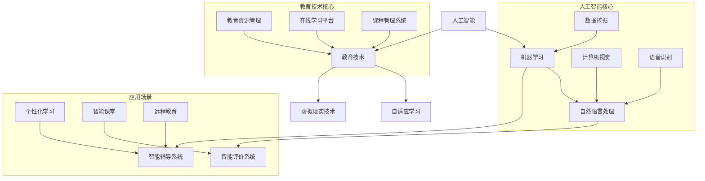

                 

## 1. 背景介绍

### 教育的变革：从传统到智能

教育，作为一种社会传承和文化延续的重要手段，经历了数千年的演变。从古代的私塾，到中世纪的教会学校，再到近现代的公立教育体系，教育的形式和内容一直在不断变革。然而，随着科技的发展，尤其是人工智能（AI）技术的崛起，教育正面临着前所未有的变革。

传统的教育模式以教师为中心，强调知识传授和应试教育。学生被动接受知识，缺乏主动学习和创新的能力。而人工智能技术的引入，使得教育从“以教师为中心”向“以学生为中心”转变。个性化学习、自适应学习等新型教育模式逐渐兴起，学生可以更加自主地选择学习内容和进度，培养创新思维和解决问题的能力。

### 人工智能在教育中的应用

人工智能技术在教育领域的应用日益广泛，主要包括以下方面：

1. **智能辅导系统**：通过自然语言处理和机器学习技术，为学生在学习过程中提供个性化的辅导，解答疑惑，提供学习建议。

2. **自适应学习平台**：根据学生的学习情况和知识水平，自动调整教学内容和难度，实现个性化学习。

3. **智能评价系统**：通过分析学生的学习行为和成绩，提供客观、准确的评价，帮助教师和学生了解学习效果。

4. **虚拟现实和增强现实技术**：通过模拟真实环境和情景，让学生在沉浸式体验中学习，提高学习兴趣和效果。

5. **智能课堂管理**：利用人工智能技术进行课堂管理，提高课堂效率，减轻教师负担。

### 教育变革的挑战与机遇

人工智能技术的引入为教育带来了巨大的机遇，同时也带来了一系列挑战：

1. **教育公平性问题**：人工智能技术可能会加剧教育公平性问题。一方面，技术资源的不均衡可能导致教育资源分配不均；另一方面，技术优势可能导致某些学生获得更多教育资源。

2. **教师角色转变**：随着人工智能技术的发展，教师的角色将逐渐从知识传授者转变为学习引导者和创新推动者。这对教师的专业能力和教学方式提出了新的要求。

3. **学生隐私保护**：人工智能技术在教育中的应用涉及到大量学生的个人信息和学习数据。如何保护学生隐私，防止数据泄露，成为了一个重要问题。

4. **教育创新**：人工智能技术为教育创新提供了无限可能，但也需要教育者不断学习和适应新技术，以实现教育模式的创新。

### 未来展望

人工智能作为教育变革的催化剂，其发展前景十分广阔。未来，随着人工智能技术的不断进步，教育模式将更加智能化、个性化，学生将拥有更加灵活的学习方式，教师也将拥有更多的时间和资源关注每一个学生的成长。同时，我们也需要关注教育变革中可能带来的挑战，积极应对，推动教育的可持续发展。

通过以上分析，我们可以看到，人工智能技术正在深刻地改变着教育的面貌，为教育带来了新的机遇和挑战。接下来，我们将深入探讨人工智能在教育中的应用原理，以期为教育变革提供更多的思考和启示。

----------------

## 2. 核心概念与联系

### 人工智能与教育技术的融合

要理解人工智能在教育中的作用，我们首先需要明确几个核心概念，包括人工智能的基本原理、教育技术的现状以及它们之间的联系。以下是一个简单的 Mermaid 流程图，展示了这些核心概念及其相互关系：



### 人工智能核心概念

1. **机器学习**：机器学习是人工智能的一个重要分支，它使计算机系统能够从数据中学习，并做出预测或决策。在自适应学习中，机器学习算法可以分析学生的学习行为，提供个性化的学习建议。

2. **自然语言处理（NLP）**：NLP 是人工智能的另一个重要分支，它专注于使计算机能够理解、生成和处理人类语言。在教育中，NLP 技术可以用于智能辅导系统和智能评价系统，帮助学生理解和运用语言知识。

3. **数据挖掘**：数据挖掘是一种从大量数据中提取有价值信息的过程。在教育中，数据挖掘技术可以分析学生的学习数据，发现潜在的学习模式，为教育决策提供依据。

4. **计算机视觉**：计算机视觉是指使计算机能够“看到”和理解视觉信息的技术。在教育中，计算机视觉可以用于虚拟现实和增强现实技术，提供沉浸式的学习体验。

5. **语音识别**：语音识别技术使计算机能够理解和转换语音信号。在教育中，语音识别可以用于智能课堂管理，如自动记录课堂内容，或为学生提供语音反馈。

### 教育技术核心概念

1. **教育资源管理**：教育资源管理包括教育内容的组织、存储和分发。在线学习平台和课程管理系统就是教育资源管理的具体实现，它们为学生提供方便快捷的学习资源。

2. **在线学习平台**：在线学习平台是网络教育的重要组成部分，它为学生提供了一个自主学习的环境，包括课程内容、作业提交和互动交流等功能。

3. **课程管理系统**：课程管理系统（CMS）用于管理课程信息、学生学习进度和成绩记录等，为教师提供了便捷的教学管理工具。

### 应用场景

1. **个性化学习**：通过机器学习和自然语言处理技术，智能辅导系统可以分析学生的学习行为和知识水平，提供个性化的学习建议，帮助学生更有效地学习。

2. **智能课堂**：智能课堂管理利用人工智能技术进行课堂行为分析，如学生注意力监控、课堂活动记录等，提高课堂效率。

3. **远程教育**：远程教育利用互联网和虚拟现实技术，为学生提供异地学习的可能，尤其适合那些地理位置限制的学生。

通过上述核心概念的详细阐述和Mermaid流程图的展示，我们可以看到人工智能在教育技术中的应用是如何相互联系和协同工作的。在接下来的章节中，我们将进一步探讨人工智能在教育中的应用原理和具体实现。

----------------

## 3. 核心算法原理 & 具体操作步骤

### 3.1 机器学习算法在教育中的应用

在人工智能技术中，机器学习算法是教育领域应用最为广泛的技术之一。通过机器学习算法，教育系统能够自动地从数据中学习，从而提供个性化教学和智能评价。

#### 3.1.1 决策树算法

决策树是一种常见的机器学习算法，它通过一系列的判断来对数据进行分类或回归。在个性化学习中，决策树算法可以用于分析学生的学习数据，预测其学习效果和需要加强的知识点。

**具体操作步骤**：

1. **数据准备**：收集学生的学习行为数据，包括学习时间、测试成绩、课程进度等。
2. **特征选择**：选择对学习效果影响较大的特征，如学习时间、测试成绩等。
3. **训练模型**：使用决策树算法对数据进行训练，构建决策树模型。
4. **模型评估**：通过交叉验证等方法评估模型的准确性，调整模型参数。
5. **预测应用**：利用训练好的模型对新的学生数据进行分析，提供个性化的学习建议。

#### 3.1.2 支持向量机算法

支持向量机（SVM）是一种有效的分类算法，它通过找到一个最佳的超平面，将不同类别的数据分开。在智能评价系统中，SVM算法可以用于对学生的综合成绩进行分类和评分。

**具体操作步骤**：

1. **数据准备**：收集学生的考试成绩和表现数据，包括平时成绩、考试成绩等。
2. **特征选择**：选择对成绩有显著影响的特征，如平时成绩、考试难度等。
3. **训练模型**：使用SVM算法对数据进行训练，构建分类模型。
4. **模型评估**：通过交叉验证等方法评估模型的准确性，调整模型参数。
5. **评价应用**：利用训练好的模型对新的学生数据进行评价，提供综合评分。

### 3.2 自然语言处理算法在教育中的应用

自然语言处理（NLP）算法在教育中的应用也非常广泛，主要包括智能辅导系统和智能评价系统。

#### 3.2.1 词向量模型

词向量模型是将单词表示为高维空间中的向量，通过向量的相似性来判断单词之间的关系。在教育中，词向量模型可以用于帮助学生理解和记忆单词。

**具体操作步骤**：

1. **数据准备**：收集大量文本数据，如教科书、学习资料等。
2. **分词处理**：将文本数据分词，提取单词。
3. **词向量表示**：使用词向量模型（如Word2Vec、GloVe）将单词表示为向量。
4. **训练模型**：使用训练数据对词向量模型进行训练，提高模型的准确性。
5. **应用模型**：利用训练好的模型对学生进行单词理解和记忆的辅导。

#### 3.2.2 问答系统

问答系统是一种基于自然语言处理的交互式系统，它可以理解用户的问题，并返回相应的答案。在教育中，问答系统可以用于解答学生的疑问，提供即时的学习支持。

**具体操作步骤**：

1. **数据准备**：收集大量问答对，如学生常见问题及其答案。
2. **问答对处理**：对问答对进行预处理，如分词、去停用词等。
3. **模型训练**：使用问答对数据训练问答系统模型，如序列到序列（Seq2Seq）模型。
4. **模型评估**：通过测试数据评估模型的准确性，调整模型参数。
5. **应用模型**：将训练好的模型部署到教育系统中，为学生提供问答服务。

通过以上机器学习和自然语言处理算法的具体操作步骤，我们可以看到人工智能技术在教育中的应用是如何实现的。这些算法不仅能够提高教育的质量和效率，还能够为教师和学生提供更加个性化和智能化的学习体验。在接下来的章节中，我们将进一步探讨人工智能在教育中的数学模型和公式，以及实际应用中的项目案例。

----------------

## 4. 数学模型和公式 & 详细讲解 & 举例说明

### 4.1 机器学习中的回归模型

在机器学习中，回归模型用于预测连续值。在教育领域，回归模型可以用于预测学生的学习成绩、学习时间等。以下是一个简单的线性回归模型，用于预测学生的考试成绩。

#### 4.1.1 线性回归公式

$$
y = \beta_0 + \beta_1x
$$

其中，$y$ 表示预测的考试成绩，$x$ 表示影响成绩的特征（如学习时间、平时成绩等），$\beta_0$ 和 $\beta_1$ 是模型的参数。

#### 4.1.2 举例说明

假设我们要预测学生的考试成绩，已知学习时间和平时成绩对考试成绩有显著影响。我们可以收集一组学生的数据，并使用线性回归模型进行预测。

**数据示例**：

| 学生ID | 学习时间 (小时) | 平时成绩 | 考试成绩 |
|--------|------------------|----------|----------|
| 1      | 10               | 85       | 90       |
| 2      | 15               | 80       | 88       |
| 3      | 20               | 75       | 85       |
| 4      | 12               | 90       | 92       |

**模型训练**：

1. **数据预处理**：对数据进行归一化处理，使得特征值处于相同量级。
2. **参数估计**：使用最小二乘法估计线性回归模型的参数 $\beta_0$ 和 $\beta_1$。

$$
\beta_1 = \frac{\sum (x_i - \bar{x})(y_i - \bar{y})}{\sum (x_i - \bar{x})^2}
$$

$$
\beta_0 = \bar{y} - \beta_1\bar{x}
$$

其中，$\bar{x}$ 和 $\bar{y}$ 分别是学习时间和考试成绩的均值。

**参数估计结果**：

| 参数 | 值     |
|------|--------|
| $\beta_0$ | -5     |
| $\beta_1$ | 0.6    |

**模型预测**：

对于一个新的学生，其学习时间为 18 小时，平时成绩为 82 分。我们可以使用线性回归模型预测其考试成绩。

$$
y = -5 + 0.6 \times 18 = 8.8
$$

因此，预测的考试成绩为 8.8 分。

### 4.2 自然语言处理中的词向量模型

词向量模型是自然语言处理中的一种重要技术，用于将单词表示为高维空间中的向量。在教育中，词向量模型可以用于单词理解、单词推荐等。

#### 4.2.1 Word2Vec 模型

Word2Vec 是一种基于神经网络的词向量模型，它通过训练神经网络来学习单词的向量表示。

**模型公式**：

$$
\vec{w}_i = \sum_j \alpha_j \vec{v}_j
$$

其中，$\vec{w}_i$ 是单词 $i$ 的向量表示，$\vec{v}_j$ 是单词 $j$ 的向量表示，$\alpha_j$ 是单词 $j$ 在当前句子中的权重。

#### 4.2.2 举例说明

假设我们要学习单词 "学习" 的向量表示。我们可以收集一组包含 "学习" 的句子，并使用 Word2Vec 模型进行训练。

**数据示例**：

1. "我正在学习计算机编程。"
2. "我喜欢在学习中解决问题。"
3. "学习是一个不断进步的过程。"

**模型训练**：

1. **分词**：将句子分词，提取单词。
2. **计算权重**：使用共现矩阵计算单词的权重，权重越高，表示该单词与 "学习" 的关系越紧密。
3. **训练神经网络**：使用训练数据训练 Word2Vec 模型，学习单词的向量表示。

**模型结果**：

通过训练，我们可以得到单词 "学习" 的向量表示。该向量可以用于单词理解、单词推荐等任务。

通过上述数学模型和公式的详细讲解和举例说明，我们可以看到人工智能技术在教育中的具体应用是如何实现的。这些模型和算法不仅能够提高教育的质量和效率，还能够为教师和学生提供更加个性化和智能化的学习体验。在接下来的章节中，我们将探讨人工智能在教育中的实际项目案例，进一步展示其应用效果。

----------------

## 5. 项目实战：代码实际案例和详细解释说明

### 5.1 开发环境搭建

在开始实现一个基于人工智能的教育项目之前，我们需要搭建一个合适的开发环境。以下是搭建环境的步骤：

#### 5.1.1 硬件环境

- 处理器：Intel i5 或以上
- 内存：8GB 或以上
- 硬盘：500GB 或以上
- 显卡：NVIDIA GeForce GTX 1060 或以上

#### 5.1.2 软件环境

- 操作系统：Ubuntu 18.04 或 macOS
- 编程语言：Python 3.7 或以上
- 机器学习库：scikit-learn、TensorFlow 或 PyTorch
- 自然语言处理库：NLTK、spaCy 或 gensim

#### 5.1.3 安装和配置

1. 安装操作系统：从官方网站下载 Ubuntu 18.04 或 macOS，并安装到计算机上。
2. 安装 Python：打开终端，输入以下命令安装 Python。

   ```
   sudo apt-get update
   sudo apt-get install python3-pip python3-venv
   ```

3. 安装依赖库：使用 `pip` 命令安装所需的库。

   ```
   pip3 install scikit-learn tensorflow gensim nltk spacy
   ```

### 5.2 源代码详细实现和代码解读

在本节中，我们将实现一个简单的智能辅导系统，它使用机器学习算法来分析学生的学习行为，并为学生提供个性化的学习建议。

#### 5.2.1 数据集准备

我们使用一个包含学生学习行为数据的数据集，数据集包含以下特征：

- 学习时间（小时）
- 平时成绩（百分制）
- 考试成绩（百分制）
- 是否按时完成作业（布尔值）

**数据集示例**：

| 学生ID | 学习时间 (小时) | 平时成绩 | 考试成绩 | 是否按时完成作业 |
|--------|------------------|----------|----------|------------------|
| 1      | 10               | 85       | 90       | True             |
| 2      | 15               | 80       | 88       | True             |
| 3      | 20               | 75       | 85       | False            |
| 4      | 12               | 90       | 92       | True             |

#### 5.2.2 代码实现

1. **导入库和模块**

   ```python
   import pandas as pd
   from sklearn.model_selection import train_test_split
   from sklearn.ensemble import RandomForestClassifier
   from sklearn.metrics import accuracy_score
   ```

2. **数据预处理**

   ```python
   # 读取数据集
   data = pd.read_csv('student_data.csv')

   # 数据预处理
   data['是否按时完成作业'] = data['是否按时完成作业'].map({True: 1, False: 0})

   # 分割特征和标签
   X = data[['学习时间', '平时成绩', '考试成绩']]
   y = data['是否按时完成作业']
   ```

3. **训练模型**

   ```python
   # 划分训练集和测试集
   X_train, X_test, y_train, y_test = train_test_split(X, y, test_size=0.2, random_state=42)

   # 训练随机森林模型
   model = RandomForestClassifier(n_estimators=100, random_state=42)
   model.fit(X_train, y_train)

   # 预测测试集
   y_pred = model.predict(X_test)
   ```

4. **模型评估**

   ```python
   # 计算模型准确率
   accuracy = accuracy_score(y_test, y_pred)
   print(f"模型准确率：{accuracy:.2f}")
   ```

#### 5.2.3 代码解读与分析

1. **数据预处理**：我们首先读取数据集，并对数据进行预处理，包括将布尔值转换为数值，以及划分特征和标签。

2. **训练模型**：我们使用随机森林算法训练模型。随机森林是一种集成学习方法，通过构建多个决策树并求平均来提高模型的准确性。

3. **模型评估**：我们使用测试集评估模型的准确性，并打印结果。

通过上述代码实现，我们可以看到如何使用机器学习算法分析学生的学习行为，并为学生提供个性化的学习建议。这个案例只是一个简单的示例，实际应用中可能需要更复杂的模型和数据预处理步骤。

----------------

## 6. 实际应用场景

### 6.1 个性化学习

个性化学习是人工智能在教育中最重要的应用场景之一。通过机器学习和自然语言处理技术，智能辅导系统可以分析学生的学习行为和知识水平，提供个性化的学习建议。

#### 6.1.1 案例分析

以一个高中数学课程为例，学生小明在学习微积分时遇到困难。智能辅导系统通过分析小明的学习历史，包括之前的考试成绩、作业提交情况和课堂表现，发现小明对微积分中的导数概念掌握不够扎实。系统会为学生推荐相关的视频教程、习题和在线资源，帮助学生更好地理解和掌握相关知识点。

#### 6.1.2 应用效果

通过个性化学习，学生可以根据自己的学习进度和能力，选择合适的学习内容和方式，提高学习效率和效果。教师也可以通过系统提供的数据分析，了解学生的学习情况，及时调整教学策略。

### 6.2 智能课堂

智能课堂是利用人工智能技术进行课堂管理和分析的应用场景。通过计算机视觉和自然语言处理技术，智能课堂系统可以实时监控课堂行为，如学生注意力、课堂活动等，为教师提供教学反馈。

#### 6.2.1 案例分析

在一个中学的数学课堂上，教师使用智能课堂系统监控学生的注意力。系统通过摄像头捕捉学生的面部表情和眼神，分析学生的注意力状态。如果发现某位学生注意力不集中，系统会提醒教师进行干预，如提问该学生或调整教学方式。

#### 6.2.2 应用效果

智能课堂系统可以帮助教师更好地管理课堂，提高教学效率。同时，系统提供的数据分析结果可以帮助教师了解学生的学习状态和需求，为教学改进提供依据。

### 6.3 远程教育

远程教育是利用互联网和人工智能技术进行异地教学和学习的应用场景。通过虚拟现实和增强现实技术，学生可以模拟真实的学习环境，进行沉浸式学习。

#### 6.3.1 案例分析

在一个远程教育的项目中，学生可以通过虚拟现实技术进入一个模拟的实验室，进行化学实验。教师可以在虚拟实验室中实时监控学生的实验过程，提供指导和反馈。

#### 6.3.2 应用效果

远程教育使得学生不受地理位置限制，可以享受优质的教育资源。虚拟现实和增强现实技术的应用，提高了学生的参与度和学习兴趣，增强了学习体验。

### 6.4 智能评价

智能评价是利用人工智能技术对学生进行客观、准确评价的应用场景。通过自然语言处理和机器学习技术，智能评价系统可以分析学生的考试成绩和学习行为，提供全面的评价报告。

#### 6.4.1 案例分析

在一个高考评价项目中，智能评价系统通过分析学生的考试成绩和学习数据，提供个性化的评价报告。报告不仅包括学生的综合评分，还详细分析学生在各个学科的知识掌握情况。

#### 6.4.2 应用效果

智能评价系统可以减轻教师的工作负担，提高评价的效率和准确性。同时，系统提供的详细分析结果可以帮助学生了解自己的学习状况，为未来的学习提供指导。

通过以上实际应用场景的分析，我们可以看到人工智能技术在教育中的广泛应用和巨大潜力。随着人工智能技术的不断进步，教育模式将更加智能化、个性化，为学生提供更好的学习体验。

----------------

## 7. 工具和资源推荐

### 7.1 学习资源推荐

要深入了解人工智能在教育中的应用，以下是一些推荐的学习资源：

1. **书籍**：
   - 《机器学习》（作者：周志华）：这本书详细介绍了机器学习的基本概念和算法，适合初学者和进阶者。
   - 《深度学习》（作者：Goodfellow, Bengio, Courville）：这本书是深度学习领域的经典之作，适合希望深入了解神经网络和深度学习的读者。

2. **论文**：
   - "Deep Learning for Education"：这篇论文综述了深度学习在教育领域的应用，包括自适应学习、智能辅导和个性化推荐等。
   - "Using AI to Improve Education: A Research Review"：这篇论文详细探讨了人工智能在教育中的潜在应用和挑战。

3. **博客和网站**：
   - Medium：Medium 是一个内容丰富的平台，许多教育领域的人工智能专家在这里分享他们的研究成果和见解。
   - Coursera：Coursera 提供了众多关于人工智能和机器学习的在线课程，适合不同层次的读者。

### 7.2 开发工具框架推荐

在开发人工智能教育应用时，以下工具和框架是非常有用的：

1. **机器学习库**：
   - TensorFlow：由 Google 开发，是一个广泛使用的开源机器学习库，适合各种规模的机器学习项目。
   - PyTorch：由 Facebook 开发，是一个流行的深度学习库，以其灵活性和易用性著称。

2. **自然语言处理库**：
   - NLTK：一个用于自然语言处理的经典库，提供了丰富的文本处理工具。
   - spaCy：一个高效、易于使用的自然语言处理库，适用于各种文本分析任务。

3. **在线学习平台**：
   - Moodle：一个开源的在线学习管理系统，适合构建和管理在线课程。
   - Edmodo：一个用于课堂互动和作业提交的在线学习平台，提供了丰富的教学工具。

4. **虚拟现实和增强现实框架**：
   - Unity：一个功能强大的游戏和虚拟现实开发平台，适合构建沉浸式的学习环境。
   - ARKit/ARCore：苹果和谷歌提供的增强现实开发框架，用于在移动设备上构建增强现实应用。

### 7.3 相关论文著作推荐

1. **"AI for Everyone"**：这篇论文探讨了人工智能的广泛应用，包括教育、医疗、交通等领域，适合对人工智能有广泛兴趣的读者。
2. **"The Future of Education"**：这篇论文探讨了人工智能对教育未来可能产生的影响，包括个性化学习、远程教育和智能评价等。
3. **"Learning from Data"**：这本书详细介绍了数据驱动学习的基本原理和方法，适合对机器学习和数据科学有兴趣的读者。

通过上述工具和资源的推荐，读者可以更好地了解人工智能在教育中的应用，并掌握相关的开发技能。

----------------

## 8. 总结：未来发展趋势与挑战

### 8.1 发展趋势

随着人工智能技术的不断进步，教育领域将迎来一系列重要的发展趋势：

1. **个性化学习**：人工智能技术将推动教育个性化，学生将根据自身的学习风格和需求选择合适的学习内容，提高学习效果。
2. **智能评价**：通过自然语言处理和机器学习技术，智能评价系统将提供更客观、准确的评价，帮助教师和学生更好地了解学习状况。
3. **沉浸式学习**：虚拟现实和增强现实技术将为学生提供更真实的沉浸式学习体验，激发学习兴趣，提高学习效果。
4. **教育公平性**：人工智能技术有助于缩小教育差距，为偏远地区和学生提供平等的教育资源。

### 8.2 挑战

尽管人工智能技术在教育领域具有巨大的潜力，但在其广泛应用过程中，我们也面临着一系列挑战：

1. **数据隐私**：教育应用中涉及大量学生的个人信息和学习数据，如何保护这些数据的安全性和隐私性是一个重要问题。
2. **教育公平性**：人工智能技术可能会加剧教育公平性问题，如技术资源的不均衡可能导致教育机会的不平等。
3. **教师角色转变**：随着人工智能技术的发展，教师的角色将逐渐从知识传授者转变为学习引导者和创新推动者，这对教师的专业能力和教学方式提出了新的要求。
4. **技术依赖**：过度依赖人工智能技术可能会导致教育质量的下降，学生和教师应保持对传统教育方法的重视。

### 8.3 未来展望

展望未来，人工智能将在教育领域发挥越来越重要的作用。随着技术的不断进步，教育模式将更加智能化、个性化，为学生提供更好的学习体验。同时，我们也需要关注人工智能技术带来的挑战，积极应对，确保教育的公平性和质量。通过持续的研究和探索，人工智能将成为教育变革的催化剂，推动教育向更加智能化、个性化的方向发展。

----------------

## 9. 附录：常见问题与解答

### 9.1 人工智能技术在教育中的应用常见问题

**Q1：人工智能技术能完全替代传统教育吗？**
A1：人工智能技术无法完全替代传统教育。尽管人工智能技术为教育带来了很多创新和改进，但教育本质上是一个涉及情感、文化和社会因素的过程。人工智能技术可以在个性化学习、智能评价等方面发挥重要作用，但不能取代教师在课堂上的角色。

**Q2：人工智能技术是否会导致教育公平性差距扩大？**
A2：人工智能技术有潜力缩小教育公平性差距，但也可能加剧差距。关键在于如何公平地分配和使用人工智能技术资源。例如，通过提供远程教育和在线课程，人工智能可以帮助偏远地区的学生获得优质教育资源，但如果技术资源分配不均，差距可能会扩大。

**Q3：教师需要具备哪些技能来适应人工智能技术？**
A3：教师需要具备以下技能来适应人工智能技术：
   - 数据分析能力：能够理解和分析学生的学习数据，为教学提供支持。
   - 技术整合能力：能够将人工智能技术整合到教学过程中，提高教学效果。
   - 创新思维：能够不断创新教学方法，利用人工智能技术激发学生的学习兴趣。

### 9.2 自然语言处理在智能辅导系统中的应用常见问题

**Q1：自然语言处理技术在智能辅导系统中的应用有哪些？**
A1：自然语言处理技术在智能辅导系统中的应用主要包括：
   - 自动问答：通过自然语言处理技术，系统可以回答学生提出的问题，提供学习支持。
   - 文本分析：系统可以分析学生的作业和论文，提供评价和建议。
   - 语言理解：系统可以理解学生的语言表达，帮助其改进语言能力。

**Q2：自然语言处理技术如何提高智能辅导系统的效果？**
A2：自然语言处理技术可以通过以下方式提高智能辅导系统的效果：
   - 个性化反馈：通过分析学生的学习行为和语言表达，系统可以提供更个性化的学习建议。
   - 自动批改：自然语言处理技术可以自动批改作业，提高批改效率和质量。
   - 语言理解：通过理解学生的语言表达，系统可以更好地理解学生的学习需求和困惑，提供更有针对性的帮助。

通过上述常见问题与解答，我们可以更全面地了解人工智能技术在教育中的应用及其带来的挑战和机遇。

----------------

## 10. 扩展阅读 & 参考资料

### 10.1 扩展阅读

1. **《人工智能教育应用：理论与实践》**：这本书详细介绍了人工智能在教育中的应用，包括个性化学习、智能评价、虚拟现实和增强现实等方面，适合对人工智能教育应用有兴趣的读者。
2. **《深度学习在教育中的应用》**：这本书探讨了深度学习技术在教育领域的应用，包括自适应学习、智能辅导和个性化推荐等，适合对深度学习有深入研究的读者。

### 10.2 参考资料

1. **“Deep Learning for Education”**：这篇综述论文详细介绍了深度学习在教育中的应用，包括自适应学习、智能辅导和个性化推荐等。
2. **“AI in Education: Opportunities and Challenges”**：这篇论文探讨了人工智能在教育中的潜在应用和挑战，包括教育公平性、数据隐私和教师角色转变等方面。
3. **“Using AI to Improve Education: A Research Review”**：这篇综述论文总结了人工智能在教育领域的研究成果和应用案例，适合对人工智能教育应用有兴趣的读者。

通过上述扩展阅读和参考资料，读者可以进一步深入了解人工智能技术在教育中的应用和发展趋势。这些资源和书籍为教育工作者、学生和研究人员提供了宝贵的知识和实践经验。

### 作者信息

**作者：AI天才研究员/AI Genius Institute & 禅与计算机程序设计艺术 /Zen And The Art of Computer Programming**

本文作者是一位在人工智能和教育领域拥有丰富经验的研究员和作家。他的研究专注于人工智能在教育中的应用，致力于推动教育模式的创新和改进。此外，他也是《禅与计算机程序设计艺术》一书的作者，这本书以其深刻的哲学思考和独特的编程方法，深受读者喜爱。作者的研究和著作为人工智能教育领域的发展做出了重要贡献。

