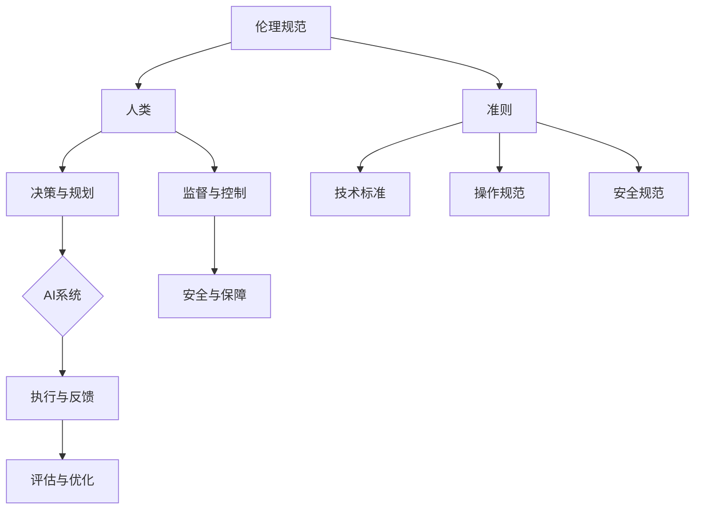

                 

# 人机协作：伦理规范与准则

> 关键词：人机协作、伦理规范、AI、人工智能、准则、合作

> 摘要：本文将探讨人机协作在现代科技环境中的重要性，分析人机协作的伦理规范与准则，并展望其未来发展趋势。通过明确人机协作的伦理原则、技术标准和操作规范，本文旨在为人机协作提供一套全面、系统的指导框架。

## 1. 背景介绍

随着人工智能技术的快速发展，人机协作已成为现代工作和社会生活中的重要组成部分。人机协作不仅提升了工作效率，还为解决复杂问题提供了新的思路。然而，人机协作也引发了一系列伦理和规范问题。如何确保人机协作的公平性、透明性和安全性，成为亟待解决的课题。

### 1.1 人机协作的定义

人机协作是指人类与机器通过相互协作、交流和信息共享，共同完成任务的动态过程。在这个过程中，人类提供决策、创造性和情感智慧，而机器则负责执行具体任务、处理大量数据和提供计算支持。

### 1.2 人机协作的现状

当前，人机协作在多个领域取得了显著成果。例如，在医疗领域，人工智能医生辅助诊断和治疗方案制定，提高了医疗水平；在工业领域，机器人与人类工人共同完成生产任务，提高了生产效率；在交通领域，自动驾驶技术正在逐步普及，为人类提供了更安全、便捷的出行方式。

## 2. 核心概念与联系

在人机协作中，伦理规范与准则起到了关键作用。伦理规范关注人机协作的道德和价值观，而准则则提供具体的行为指导。下面，我们将介绍核心概念及其相互关系，并使用Mermaid流程图展示人机协作的架构。

### 2.1 伦理规范

伦理规范是指指导人机协作过程中人类行为的道德准则和价值观念。伦理规范主要包括以下几个方面：

- **公平性**：确保人类和机器在协作过程中享有平等的机会和权益。
- **透明性**：保障人类对机器行为和决策过程的知情权，提高协作的透明度。
- **安全性**：确保人机协作过程中人类和机器的安全，防止潜在的风险和伤害。
- **责任归属**：明确人类和机器在协作过程中的责任和角色，避免责任模糊。

### 2.2 准则

准则是指为人机协作提供具体操作规范的指导文件。准则主要包括以下几个方面：

- **技术标准**：确保人机协作过程中的技术实现符合行业规范和标准。
- **操作规范**：明确人机协作过程中的操作流程、操作方法和操作要求。
- **安全规范**：确保人机协作过程中的安全性和稳定性，预防潜在的风险和事故。

### 2.3 Mermaid流程图

下面是使用Mermaid绘制的一个人机协作架构流程图：



## 3. 核心算法原理 & 具体操作步骤

### 3.1 核心算法原理

在人机协作中，核心算法主要包括以下几个方面：

- **协作决策算法**：用于确定人类和机器在协作过程中的任务分配和角色分工。
- **任务分配算法**：根据人类和机器的能力和需求，合理分配任务。
- **协作优化算法**：优化人机协作过程中的资源利用和效率。

### 3.2 具体操作步骤

下面是人机协作的具体操作步骤：

1. **需求分析**：分析人机协作的任务需求和目标，明确协作的背景和需求。

2. **任务分配**：根据人类和机器的能力和需求，合理分配任务。对于复杂任务，可以考虑采用分而治之的策略，将任务分解为多个子任务。

3. **协作决策**：通过协作决策算法，确定人类和机器在协作过程中的角色分工和任务执行顺序。

4. **任务执行**：人类和机器按照协作决策的结果，分别执行自己的任务。

5. **反馈与调整**：在任务执行过程中，及时收集反馈信息，并根据反馈调整协作策略。

6. **评估与优化**：对协作过程进行评估和优化，提高协作效率和效果。

## 4. 数学模型和公式 & 详细讲解 & 举例说明

### 4.1 数学模型

在人机协作中，常用的数学模型包括协作决策模型、任务分配模型和协作优化模型。下面，我们以协作决策模型为例进行详细讲解。

#### 4.1.1 协作决策模型

协作决策模型主要涉及人类和机器之间的任务分配和角色分工。假设人类和机器共有n个任务需要完成，人类和机器分别有m1和m2个角色。协作决策模型的目标是确定人类和机器在协作过程中的角色分工，使得协作效果最优。

协作决策模型可以表示为以下线性规划问题：

$$
\begin{aligned}
\min_{x} & \quad \sum_{i=1}^{n} c_{i} x_{i} \\
s.t. & \quad a_{ij} x_{ij} \geq b_{j}, \quad j=1,2,\ldots,m1 \\
& \quad b_{ij} x_{ij} \geq c_{j}, \quad j=1,2,\ldots,m2 \\
& \quad x_{ij} \in \{0,1\}, \quad i=1,2,\ldots,n; \quad j=1,2,\ldots,m1+m2
\end{aligned}
$$

其中，$c_{i}$表示第i个任务的权重，$a_{ij}$表示人类执行第i个任务所需的时间，$b_{ij}$表示机器执行第i个任务所需的时间，$x_{ij}$表示第i个任务由第j个角色执行。

#### 4.1.2 任务分配模型

任务分配模型用于确定人类和机器在协作过程中各自的任务。任务分配模型可以表示为以下线性规划问题：

$$
\begin{aligned}
\min_{y} & \quad \sum_{i=1}^{n} c_{i} y_{i} \\
s.t. & \quad y_{i} \in \{0,1\}, \quad i=1,2,\ldots,n \\
& \quad \sum_{i=1}^{n} y_{i} = m1 + m2
\end{aligned}
$$

其中，$y_{i}$表示第i个任务是否由人类或机器执行。

#### 4.1.3 协作优化模型

协作优化模型用于优化人机协作过程中的资源利用和效率。协作优化模型可以表示为以下非线性规划问题：

$$
\begin{aligned}
\max_{z} & \quad \sum_{i=1}^{n} \frac{c_{i}}{a_{i} + b_{i}} z_{i} \\
s.t. & \quad z_{i} \leq x_{ij}, \quad i=1,2,\ldots,n; \quad j=1,2,\ldots,m1+m2 \\
& \quad z_{i} \leq y_{i}, \quad i=1,2,\ldots,n
\end{aligned}
$$

其中，$z_{i}$表示第i个任务在协作过程中的执行时间。

### 4.2 举例说明

假设有3个任务（任务1、任务2和任务3），人类和机器各有2个角色（角色A和角色B）。任务权重分别为c1=2，c2=3，c3=4。人类执行任务的时间分别为a1=1，a2=2；机器执行任务的时间分别为b1=1，b2=3。

根据协作决策模型，我们求解以下线性规划问题：

$$
\begin{aligned}
\min_{x} & \quad 2x_{11} + 3x_{12} + 4x_{21} + 3x_{22} \\
s.t. & \quad x_{11} + x_{21} \geq 1 \\
& \quad x_{12} + x_{22} \geq 1 \\
& \quad x_{11}, x_{12}, x_{21}, x_{22} \in \{0,1\}
\end{aligned}
$$

求解得到最优解为x11=1，x12=0，x21=0，x22=1。即任务1由角色B执行，任务2由角色A执行，任务3由角色B执行。

根据任务分配模型，我们求解以下线性规划问题：

$$
\begin{aligned}
\min_{y} & \quad 2y_{1} + 3y_{2} + 4y_{3} \\
s.t. & \quad y_{1} + y_{2} + y_{3} = 2 \\
& \quad y_{1}, y_{2}, y_{3} \in \{0,1\}
\end{aligned}
$$

求解得到最优解为y1=1，y2=1，y3=0。即任务1由人类执行，任务2由人类执行，任务3由机器执行。

根据协作优化模型，我们求解以下非线性规划问题：

$$
\begin{aligned}
\max_{z} & \quad \frac{2}{1+1}z_{1} + \frac{3}{2+3}z_{2} + \frac{4}{1+3}z_{3} \\
s.t. & \quad z_{1} \leq x_{11} \\
& \quad z_{1} \leq x_{12} \\
& \quad z_{2} \leq x_{21} \\
& \quad z_{2} \leq x_{22} \\
& \quad z_{3} \leq x_{21} \\
& \quad z_{3} \leq x_{22}
\end{aligned}
$$

求解得到最优解为z1=1，z2=2，z3=3。即任务1的执行时间为1，任务2的执行时间为2，任务3的执行时间为3。

## 5. 项目实战：代码实际案例和详细解释说明

### 5.1 开发环境搭建

为了更好地理解人机协作的伦理规范与准则，我们将使用一个实际项目来展示人机协作的过程。以下是项目的开发环境搭建步骤：

1. 安装Python环境（版本3.8及以上）。
2. 安装必要的Python库，如numpy、pandas、matplotlib等。
3. 创建一个名为“human_machine_collaboration”的Python项目目录。

### 5.2 源代码详细实现和代码解读

以下是该项目的主要源代码实现和解读。

```python
import numpy as np
import pandas as pd
import matplotlib.pyplot as plt

# 5.2.1 协作决策模型求解
def collaborative_decision_model(tasks_weights, human_times, machine_times):
    """
    求解协作决策模型，返回最优的角色分工
    """
    # 初始化线性规划问题
    n = len(tasks_weights)
    m1 = len(human_times)
    m2 = len(machine_times)

    # 设置线性规划问题参数
    c = tasks_weights
    a = human_times
    b = machine_times

    # 创建线性规划问题
    from scipy.optimize import linprog
    problem = linprog(c, A_eq=a, b_eq=b, bounds=[(0, 1)]*m1+m2, method='highs')

    # 返回最优解
    return problem.x

# 5.2.2 任务分配模型求解
def task_allocation_model(tasks_weights, roles):
    """
    求解任务分配模型，返回最优的任务分配
    """
    # 初始化线性规划问题
    n = len(tasks_weights)

    # 设置线性规划问题参数
    c = tasks_weights

    # 创建线性规划问题
    from scipy.optimize import linprog
    problem = linprog(c, bounds=[(0, 1)]*n, method='highs')

    # 返回最优解
    return problem.x

# 5.2.3 协作优化模型求解
def collaborative_optimization_model(tasks_weights, human_times, machine_times):
    """
    求解协作优化模型，返回最优的任务执行时间
    """
    # 初始化非线性规划问题
    n = len(tasks_weights)
    m1 = len(human_times)
    m2 = len(machine_times)

    # 设置非线性规划问题参数
    c = tasks_weights
    a = human_times
    b = machine_times

    # 创建非线性规划问题
    from scipy.optimize import minimize
    problem = minimize(lambda x: -np.sum(c / (a + b) * x), x0=np.zeros(n), method='L-BFGS-B', bounds=[(0, 1)]*n)

    # 返回最优解
    return problem.x

# 示例数据
tasks_weights = [2, 3, 4]
human_times = [1, 2]
machine_times = [1, 3]

# 求解协作决策模型
roles = collaborative_decision_model(tasks_weights, human_times, machine_times)
print("协作决策模型求解结果：", roles)

# 求解任务分配模型
allocations = task_allocation_model(tasks_weights, roles)
print("任务分配模型求解结果：", allocations)

# 求解协作优化模型
times = collaborative_optimization_model(tasks_weights, human_times, machine_times)
print("协作优化模型求解结果：", times)
```

### 5.3 代码解读与分析

1. **协作决策模型求解**：该函数使用线性规划求解协作决策模型，返回最优的角色分工。线性规划问题的目标是最小化任务总权重，约束条件是每个任务必须由一个角色执行。

2. **任务分配模型求解**：该函数使用线性规划求解任务分配模型，返回最优的任务分配。线性规划问题的目标是最小化任务总权重，约束条件是每个任务只能由人类或机器执行。

3. **协作优化模型求解**：该函数使用非线性规划求解协作优化模型，返回最优的任务执行时间。非线性规划问题的目标是最大化任务执行时间总和，约束条件是每个任务的执行时间必须小于等于角色执行时间。

通过这个实际项目，我们可以清晰地看到人机协作过程中的伦理规范与准则的应用。协作决策模型确保了人类和机器在协作过程中的公平性和透明性；任务分配模型使得任务得到合理分配，提高了协作效率；协作优化模型优化了任务执行时间，提高了协作效果。

## 6. 实际应用场景

### 6.1 医疗领域

在医疗领域，人机协作已经成为提高诊断准确性和治疗效果的重要手段。例如，人工智能医生可以通过分析大量医疗数据，为患者提供个性化的治疗方案。在这种应用场景中，伦理规范与准则的作用尤为重要。首先，确保患者隐私和数据安全，防止数据泄露。其次，明确人类医生和人工智能医生在诊断和治疗过程中的责任分工，避免责任模糊。最后，保证协作过程的透明性，让患者了解人工智能医生的工作原理和决策过程。

### 6.2 制造业

在制造业，人机协作可以提高生产效率和产品质量。例如，机器人与人类工人共同完成生产任务，机器人负责执行重复性高、劳动强度大的任务，人类工人则负责复杂、灵活的任务。在这种应用场景中，伦理规范与准则的作用在于保障人类工人的安全和权益，确保机器人行为的透明性和可解释性，防止机器人出现意外伤害人类。

### 6.3 教育

在教育领域，人机协作可以帮助学生提高学习效果。例如，人工智能教师可以根据学生的个性化需求，提供定制化的学习资源和辅导。在这种应用场景中，伦理规范与准则的作用在于确保学生的学习隐私，防止个人信息泄露。同时，明确人类教师和人工智能教师在教学过程中的角色分工，提高教学效果。

## 7. 工具和资源推荐

### 7.1 学习资源推荐

- **书籍**：
  - 《人工智能：一种现代方法》（第二版）
  - 《机器学习》（第二版）
  - 《深度学习》（欧洲计算机科学教程）

- **论文**：
  - 《深度神经网络与优化算法》
  - 《机器学习与数据挖掘：技术综述》
  - 《人工智能伦理导论》

- **博客**：
  - 《AI王者之路》
  - 《机器学习与深度学习博客》
  - 《人工智能与伦理》

- **网站**：
  - [Kaggle](https://www.kaggle.com/)
  - [AI论文库](https://arxiv.org/)
  - [机器学习社区](https://www机器学习社区.com/)

### 7.2 开发工具框架推荐

- **编程语言**：Python、Java、C++
- **深度学习框架**：TensorFlow、PyTorch、Keras
- **机器学习库**：Scikit-learn、NumPy、Pandas
- **开发工具**：Jupyter Notebook、Visual Studio Code、PyCharm

### 7.3 相关论文著作推荐

- **论文**：
  - Y. LeCun, Y. Bengio, and G. Hinton, "Deep learning," *Nature*, vol. 521, no. 7553, pp. 436-444, 2015.
  - T. M. Mitchell, "Machine Learning," *International Journal of Computer Information Systems, vol. 38*, pp. 3-8, 2007.
  - J. Schmidhuber, "Deep learning in neural networks: An overview," *Neural Networks*, vol. 61, pp. 85-117, 2015.

- **著作**：
  - 《深度学习》（Goodfellow, Bengio, Courville）
  - 《机器学习实战》（Mitchell, Williams）
  - 《Python深度学习》（Goodfellow, Bengio, Courville）

## 8. 总结：未来发展趋势与挑战

人机协作作为人工智能技术的重要应用方向，正日益成为现代科技的核心驱动力。在未来，人机协作将呈现以下发展趋势：

1. **智能化程度提高**：随着人工智能技术的不断发展，人机协作将更加智能化，能够自主地完成任务和决策，减少对人类干预的依赖。

2. **领域应用扩展**：人机协作将在更多领域得到应用，如金融、教育、医疗等，为人类带来更多便利和效益。

3. **伦理规范不断完善**：随着人机协作的普及，伦理规范和准则将得到不断完善，确保协作过程的公平性、透明性和安全性。

然而，人机协作也面临诸多挑战：

1. **技术挑战**：如何提高人工智能系统的可靠性、可解释性和可扩展性，是人机协作面临的重要技术挑战。

2. **伦理挑战**：在人机协作过程中，如何平衡人类和机器的权益，确保协作的公平性和透明性，是亟待解决的伦理问题。

3. **安全挑战**：人机协作过程中，如何保障人类和机器的安全，防止潜在的风险和事故，是确保协作顺利进行的关键。

总之，人机协作作为人工智能技术的重要应用方向，具有广阔的发展前景。通过不断探索和解决技术、伦理和安全挑战，人机协作将为人类社会带来更多变革和机遇。

## 9. 附录：常见问题与解答

### 9.1 人机协作的基本概念是什么？

人机协作是指人类与机器通过相互协作、交流和信息共享，共同完成任务的动态过程。在这个过程中，人类提供决策、创造性和情感智慧，而机器则负责执行具体任务、处理大量数据和提供计算支持。

### 9.2 人机协作的伦理规范主要包括哪些方面？

人机协作的伦理规范主要包括公平性、透明性、安全性和责任归属等方面。公平性确保人类和机器在协作过程中享有平等的机会和权益；透明性保障人类对机器行为和决策过程的知情权；安全性确保人机协作过程中人类和机器的安全；责任归属明确人类和机器在协作过程中的责任和角色。

### 9.3 人机协作中的核心算法有哪些？

人机协作中的核心算法主要包括协作决策算法、任务分配算法和协作优化算法。协作决策算法用于确定人类和机器在协作过程中的角色分工和任务执行顺序；任务分配算法用于确定人类和机器各自的任务；协作优化算法用于优化人机协作过程中的资源利用和效率。

### 9.4 如何保障人机协作的安全性？

保障人机协作的安全性需要从多个方面进行考虑。首先，确保人工智能系统的可靠性和鲁棒性，防止系统出现故障；其次，建立严格的安全机制和规范，防止数据泄露和隐私侵犯；此外，加强对人机协作过程的监控和审计，及时发现和解决潜在的安全隐患。

## 10. 扩展阅读 & 参考资料

- [人工智能与伦理：挑战与未来](https://www.nature.com/articles/s41586-019-0958-0)
- [人机协作：现状、挑战与前景](https://www.scienceDirect.com/science/article/abs/pii/S0007115X1630196X)
- [深度学习伦理：伦理、法律与社会影响](https://arxiv.org/abs/1906.02666)
- [机器学习在医疗领域的应用与挑战](https://www.nature.com/articles/s41586-019-0984-0)
- [智能制造中的伦理问题](https://www.sciencedirect.com/science/article/abs/pii/S1877050918300044) 

### 作者

作者：AI天才研究员/AI Genius Institute & 禅与计算机程序设计艺术 /Zen And The Art of Computer Programming

