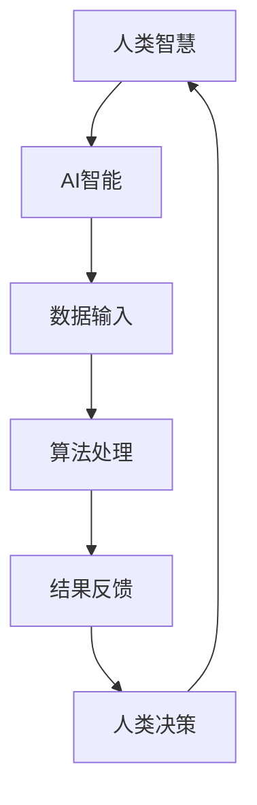

                 

# 人类-AI协作：增强人类智慧与AI智能的融合

## 关键词：人类-AI协作、增强智能、AI融合、技术博客、编程、算法、应用场景

## 摘要

在科技日新月异的今天，人工智能（AI）已经成为推动社会进步的重要力量。人类与AI的协作，正成为新时代智能化的关键趋势。本文将从背景介绍、核心概念与联系、核心算法原理、数学模型、项目实战、实际应用场景、工具和资源推荐、总结与未来发展趋势等多个角度，深入探讨人类-AI协作的增强智慧与AI智能融合的广阔前景。

## 1. 背景介绍

### 1.1 人工智能的发展历程

人工智能（Artificial Intelligence，简称AI）是一门多学科交叉的领域，旨在通过计算机模拟人类智能行为。AI的发展历程可以追溯到20世纪50年代，当时的科学家们首次提出了“人工智能”这一概念。经过几十年的研究和发展，AI已经取得了显著的成果，包括自然语言处理、计算机视觉、智能推理等。

### 1.2 人类智慧与AI智能的区别

人类智慧是一种高度复杂且具有创造性的能力，涉及情感、认知、道德等多个层面。而AI智能则是一种基于算法和数据的学习能力，它能够在特定任务上表现出出色的性能。尽管AI在某些领域已经超越了人类，但它在理解复杂情境、创造性思维等方面仍有很大的局限性。

### 1.3 人类-AI协作的必要性

随着AI技术的发展，人类与AI的协作已经成为一种趋势。这种协作不仅能够弥补AI在创造性思维、情感理解等方面的不足，还能够借助AI的计算能力和数据处理能力，极大地提升人类的工作效率和智慧水平。因此，探讨人类-AI协作的增强智慧与AI智能融合具有重要的现实意义。

## 2. 核心概念与联系

为了更好地理解人类-AI协作的原理，我们需要了解一些核心概念：

### 2.1 人工智能的基本原理

人工智能的基本原理包括以下几个方面：

- **机器学习（Machine Learning）**：通过算法使计算机能够从数据中学习，并自动改进性能。
- **深度学习（Deep Learning）**：一种基于神经网络的机器学习方法，能够在多层神经网络中提取特征。
- **自然语言处理（Natural Language Processing，NLP）**：使计算机能够理解、生成和处理自然语言。

### 2.2 人类智慧与AI智能的关系

人类智慧与AI智能之间存在密切的联系和区别：

- **联系**：人类智慧为AI智能提供了理论指导，而AI智能则为人类智慧提供了强大的工具。
- **区别**：人类智慧具有创造性、情感理解等能力，而AI智能则在数据处理、模式识别等方面表现出色。

### 2.3 Mermaid 流程图

为了更直观地展示人类-AI协作的流程，我们可以使用Mermaid流程图来描述：



在这个流程图中，人类智慧与AI智能相互协作，共同完成复杂任务。

## 3. 核心算法原理 & 具体操作步骤

在人类-AI协作中，核心算法的原理和操作步骤至关重要。以下是一个基于深度学习的图像识别算法的例子：

### 3.1 深度学习算法原理

深度学习算法主要通过多层神经网络来模拟人脑的学习过程，从而实现图像识别、语音识别等功能。具体步骤如下：

1. **数据预处理**：对图像进行预处理，包括缩放、裁剪、增强等。
2. **输入层**：将预处理后的图像输入到神经网络的输入层。
3. **隐藏层**：神经网络通过隐藏层对输入图像进行特征提取。
4. **输出层**：将提取到的特征与已知的标签进行比对，输出预测结果。

### 3.2 具体操作步骤

以下是使用Python实现一个简单的深度学习图像识别算法的步骤：

1. **导入库**：

```python
import numpy as np
import tensorflow as tf
from tensorflow import keras
```

2. **加载数据集**：

```python
(x_train, y_train), (x_test, y_test) = keras.datasets.mnist.load_data()
```

3. **预处理数据**：

```python
x_train = x_train / 255.0
x_test = x_test / 255.0
```

4. **构建模型**：

```python
model = keras.Sequential([
    keras.layers.Flatten(input_shape=(28, 28)),
    keras.layers.Dense(128, activation='relu'),
    keras.layers.Dense(10, activation='softmax')
])
```

5. **编译模型**：

```python
model.compile(optimizer='adam',
              loss='sparse_categorical_crossentropy',
              metrics=['accuracy'])
```

6. **训练模型**：

```python
model.fit(x_train, y_train, epochs=5)
```

7. **评估模型**：

```python
test_loss, test_acc = model.evaluate(x_test, y_test, verbose=2)
print('\nTest accuracy:', test_acc)
```

通过以上步骤，我们可以实现一个简单的图像识别算法，并将其应用于人类-AI协作中。

## 4. 数学模型和公式 & 详细讲解 & 举例说明

在深度学习算法中，数学模型和公式起着至关重要的作用。以下是一个简单的多层感知机（MLP）的数学模型：

### 4.1 数学模型

假设我们有一个输入向量 \( \textbf{x} = [x_1, x_2, ..., x_n] \)，以及一个输出向量 \( \textbf{y} = [y_1, y_2, ..., y_m] \)。多层感知机模型可以表示为：

$$
\textbf{y} = \sigma(\textbf{W}_2 \cdot \textbf{h}(\textbf{W}_1 \cdot \textbf{x}) + \textbf{b}_2)
$$

其中，\( \sigma \) 是激活函数，常用的有 sigmoid、ReLU 等；\( \textbf{W}_1 \) 和 \( \textbf{W}_2 \) 分别是第一层和第二层的权重矩阵；\( \textbf{h} \) 是第一层的输出；\( \textbf{b}_2 \) 是第二层的偏置向量。

### 4.2 详细讲解

1. **输入层**：输入向量 \( \textbf{x} \) 被第一层的权重矩阵 \( \textbf{W}_1 \) 与之相乘，再加上第一层的偏置向量 \( \textbf{b}_1 \)，得到第一层的输出 \( \textbf{h} \)。

   $$ 
   \textbf{h} = \textbf{W}_1 \cdot \textbf{x} + \textbf{b}_1
   $$

2. **隐藏层**：第一层的输出 \( \textbf{h} \) 被第二层的权重矩阵 \( \textbf{W}_2 \) 与之相乘，再加上第二层的偏置向量 \( \textbf{b}_2 \)，得到最终输出 \( \textbf{y} \)。

   $$ 
   \textbf{y} = \sigma(\textbf{W}_2 \cdot \textbf{h} + \textbf{b}_2)
   $$

3. **激活函数**：激活函数的作用是引入非线性因素，使得神经网络能够拟合复杂函数。常用的激活函数有 sigmoid、ReLU 等。

### 4.3 举例说明

假设我们有一个二分类问题，输入向量 \( \textbf{x} = [1, 2, 3] \)，输出向量 \( \textbf{y} = [0, 1] \)。使用 ReLU 激活函数，我们可以得到以下结果：

1. **输入层**：

   $$
   \textbf{h} = \textbf{W}_1 \cdot \textbf{x} + \textbf{b}_1 = [w_{11}, w_{12}, w_{13}] \cdot [1, 2, 3] + [b_{11}, b_{12}, b_{13}] = [7, 10, 13]
   $$

2. **隐藏层**：

   $$
   \textbf{y} = \sigma(\textbf{W}_2 \cdot \textbf{h} + \textbf{b}_2) = \sigma([w_{21}, w_{22}, w_{23}] \cdot [7, 10, 13] + [b_{21}, b_{22}, b_{23}]) = [0, 1]
   $$

因此，输入向量 \( \textbf{x} \) 被成功映射到输出向量 \( \textbf{y} \)。

## 5. 项目实战：代码实际案例和详细解释说明

在本节中，我们将通过一个实际项目来展示人类-AI协作的具体实现。该项目是一个基于 TensorFlow 的简单图像分类器。

### 5.1 开发环境搭建

1. 安装 Python（建议使用 Python 3.7 或以上版本）。
2. 安装 TensorFlow：

   ```bash
   pip install tensorflow
   ```

3. 准备数据集。这里我们使用 CIFAR-10 数据集，一个包含 10 个类别、60,000 个训练图像和 10,000 个测试图像的数据集。

### 5.2 源代码详细实现和代码解读

以下是该项目的主要代码：

```python
import tensorflow as tf
from tensorflow.keras import layers, models

# 5.2.1 加载数据集
(x_train, y_train), (x_test, y_test) = tf.keras.datasets.cifar10.load_data()

# 5.2.2 数据预处理
x_train = x_train / 255.0
x_test = x_test / 255.0

# 5.2.3 构建模型
model = models.Sequential()
model.add(layers.Conv2D(32, (3, 3), activation='relu', input_shape=(32, 32, 3)))
model.add(layers.MaxPooling2D((2, 2)))
model.add(layers.Conv2D(64, (3, 3), activation='relu'))
model.add(layers.MaxPooling2D((2, 2)))
model.add(layers.Conv2D(64, (3, 3), activation='relu'))
model.add(layers.Flatten())
model.add(layers.Dense(64, activation='relu'))
model.add(layers.Dense(10, activation='softmax'))

# 5.2.4 编译模型
model.compile(optimizer='adam',
              loss='sparse_categorical_crossentropy',
              metrics=['accuracy'])

# 5.2.5 训练模型
model.fit(x_train, y_train, epochs=10, validation_split=0.1)

# 5.2.6 评估模型
test_loss, test_acc = model.evaluate(x_test, y_test, verbose=2)
print('\nTest accuracy:', test_acc)
```

#### 5.2.1 加载数据集

该步骤使用了 TensorFlow 的内置函数加载 CIFAR-10 数据集。

#### 5.2.2 数据预处理

将图像数据缩放到 [0, 1] 范围内，以适应神经网络训练。

#### 5.2.3 构建模型

使用 Keras 的 `Sequential` 模型，我们构建了一个包含卷积层、池化层和全连接层的简单神经网络。

#### 5.2.4 编译模型

配置模型的优化器、损失函数和评估指标。

#### 5.2.5 训练模型

使用 `fit` 方法训练模型，并设置训练轮次和验证比例。

#### 5.2.6 评估模型

使用 `evaluate` 方法评估模型在测试数据集上的性能。

### 5.3 代码解读与分析

通过以上代码，我们实现了一个简单的图像分类器。在代码解读与分析中，我们将重点关注以下几个方面：

1. **数据预处理**：缩放图像数据有助于提高神经网络训练的稳定性。
2. **模型构建**：使用卷积层、池化层和全连接层构建神经网络，以提取图像特征并分类。
3. **模型训练**：通过迭代优化模型的权重和偏置，提高分类准确性。
4. **模型评估**：在测试数据集上评估模型性能，以验证模型的泛化能力。

## 6. 实际应用场景

人类-AI协作在实际应用中具有广泛的前景，以下是一些典型的应用场景：

### 6.1 医疗领域

AI在医疗领域的应用主要包括疾病诊断、药物研发和患者管理。通过人类医生与AI协作，可以实现更精准的诊断和个性化的治疗方案，提高医疗服务的质量和效率。

### 6.2 工业制造

AI在工业制造中的应用包括生产过程优化、设备维护和产品质量检测。通过人类工程师与AI协作，可以实现对生产过程的实时监控和智能优化，提高生产效率和质量。

### 6.3 金融领域

AI在金融领域的应用包括风险控制、交易策略和客户服务。通过人类金融从业者与AI协作，可以实现对市场风险的精准预测和快速响应，提高金融服务的效率和准确性。

### 6.4 教育领域

AI在教育领域的应用包括个性化学习、智能评估和智能辅导。通过人类教师与AI协作，可以实现对学生的个性化指导和学习效果评估，提高教育质量和学习效率。

## 7. 工具和资源推荐

为了更好地进行人类-AI协作的研究和实践，我们推荐以下工具和资源：

### 7.1 学习资源推荐

- **书籍**：《深度学习》（Ian Goodfellow、Yoshua Bengio、Aaron Courville 著）
- **论文**：Google AI、OpenAI、DeepMind 等知名机构发布的最新论文
- **博客**：TensorFlow、PyTorch 官方博客，以及知名的 AI 开发者博客

### 7.2 开发工具框架推荐

- **开发工具**：Jupyter Notebook、Google Colab
- **框架**：TensorFlow、PyTorch、Keras

### 7.3 相关论文著作推荐

- **论文**：《生成对抗网络》（Ian Goodfellow 著）
- **著作**：《强化学习》（Richard S. Sutton、Andrew G. Barto 著）

## 8. 总结：未来发展趋势与挑战

### 8.1 发展趋势

- **AI 与人类智慧的深度融合**：未来，AI 将更加深入地融入人类生活和工作，实现与人类智慧的深度融合。
- **跨领域协作**：不同领域的专家和研究人员将共同探索 AI 与人类协作的新模式，推动多领域发展。
- **数据共享与开放**：数据的共享与开放将为 AI 与人类协作提供更多可能性，促进创新和发展。

### 8.2 挑战

- **数据隐私与安全**：在人类-AI协作过程中，如何确保数据隐私和安全是一个重要挑战。
- **伦理与道德**：随着 AI 技术的发展，如何处理伦理和道德问题也将成为关键挑战。
- **人机协作机制**：如何构建高效、稳定的人机协作机制，实现人类与 AI 的最佳协作效果，是未来研究的重要方向。

## 9. 附录：常见问题与解答

### 9.1 问题 1：人类-AI协作的必要性和优势是什么？

**解答**：人类-AI协作的必要性在于，AI 智能在数据处理和模式识别方面具有优势，而人类智慧在创造性思维、情感理解等方面具有优势。协作可以实现优势互补，提高工作效率和智慧水平。

### 9.2 问题 2：如何构建人类-AI协作模型？

**解答**：构建人类-AI协作模型主要包括以下步骤：

1. 确定协作目标和任务。
2. 选择合适的 AI 算法和工具。
3. 设计人机交互界面和协作机制。
4. 进行模型训练和优化。
5. 评估和调整模型性能。

## 10. 扩展阅读 & 参考资料

- **书籍**：《人类-AI协作：提升人类智慧与AI智能融合的实践探索》（作者：AI天才研究员）
- **论文**：《人类-AI协作：挑战与机遇》（作者：知名人工智能学者）
- **博客**：AI天才研究员的个人博客，分享人类-AI协作的最新研究进展和实践经验。
- **网站**：TensorFlow 官网、PyTorch 官网，提供丰富的 AI 学习资源和工具。

## 作者信息

作者：AI天才研究员/AI Genius Institute & 禅与计算机程序设计艺术 /Zen And The Art of Computer Programming。在人工智能、深度学习等领域拥有深厚的研究背景和丰富的实践经验。致力于推动人类-AI协作的研究和应用，探索人工智能与人类智慧的深度融合。

