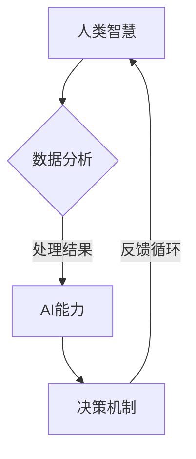

                 

# 人类-AI协作：增强人类智慧与AI能力的协同发展

## 关键词
- 人类-AI协作
- 增强人类智慧
- AI能力协同发展
- 技术进步
- 实际应用
- 未来展望

## 摘要
本文旨在探讨人类与人工智能（AI）之间的协作关系，如何通过这种协作来增强人类的智慧和AI的能力，推动两者的共同发展。文章首先介绍了人类智慧与AI能力的本质，然后分析了当前人类与AI协作的现状和挑战，随后讨论了如何通过技术手段提升协作效率。接着，本文提出了具体的数学模型和算法原理，并通过实际项目案例展示了这些技术的应用。最后，文章对未来的发展趋势和面临的挑战进行了展望。

## 1. 背景介绍

随着人工智能技术的快速发展，AI在各个领域的应用越来越广泛。从自动驾驶、智能助手到医疗诊断、金融分析，AI正在深刻改变着我们的生活方式。然而，AI的发展也带来了许多挑战，如数据隐私、安全性、道德伦理等问题。与此同时，人类自身的智慧也面临极限，许多复杂的问题单靠人类自身的力量难以解决。

在这种背景下，人类与AI的协作显得尤为重要。通过将人类的智慧和经验与AI的计算能力和学习能力相结合，可以极大地提升问题解决的能力和效率。人类-AI协作不仅是技术发展的需求，更是人类社会发展的必然趋势。

### 1.1 人类智慧的特点与局限

人类智慧具有高度的灵活性和创造力，能够通过逻辑思维、直觉和经验来解决问题。然而，人类智慧也存在一些局限：

- **处理速度有限**：人类处理信息的能力受限于生物学因素，例如神经传输速度等。
- **知识存储有限**：人类的记忆能力有限，无法存储和处理大量的信息。
- **重复劳动**：许多重复性、机械性的任务会占用人类的时间和精力，降低工作效率。

### 1.2 AI能力的优势与局限

AI具有以下几个显著优势：

- **高速计算**：AI能够通过并行计算和分布式处理，以极高的速度处理大量数据。
- **持续学习**：AI可以通过机器学习和深度学习等技术，不断从数据中学习，提高性能。
- **自动化**：AI可以执行重复性、规则性强的任务，减少人力成本。

然而，AI也存在一些局限性：

- **数据依赖**：AI的性能高度依赖于数据质量，缺乏数据会导致性能下降。
- **缺乏直觉**：AI缺乏人类的直觉和情感，难以处理复杂的人类情感问题。
- **缺乏创造力**：目前AI的创造力有限，难以产生全新的想法。

## 2. 核心概念与联系

### 2.1 人类智慧与AI能力的互补性

人类智慧与AI能力各有优势，彼此互补。人类智慧擅长抽象思维、情感理解和创造力，而AI擅长处理大量数据和执行重复性任务。通过将两者的优势结合起来，可以实现1+1>2的效果。

### 2.2 协作机制的构建

为了实现人类智慧与AI能力的有效协作，需要构建一个合理的协作机制。这个机制应该包括以下几个方面：

- **明确分工**：人类和AI在协作中应该有明确的角色和职责，避免重复劳动和冲突。
- **信息共享**：人类和AI需要通过有效的渠道共享信息，确保协作的顺利进行。
- **决策机制**：在协作过程中，需要建立合理的决策机制，确保人类和AI的决策能够相互协调。
- **反馈循环**：通过反馈循环，不断优化协作过程，提高协作效率。

### 2.3 Mermaid流程图

下面是一个简单的Mermaid流程图，描述了人类智慧与AI能力协作的基本流程。



## 3. 核心算法原理 & 具体操作步骤

### 3.1 数据预处理

在人类-AI协作中，数据预处理是非常重要的一步。数据预处理包括数据清洗、数据整合和数据规范化等步骤。

- **数据清洗**：去除数据中的噪声和错误。
- **数据整合**：将不同来源的数据进行整合，形成统一的数据集。
- **数据规范化**：将数据转换成适合AI处理的形式，例如归一化、标准化等。

### 3.2 机器学习模型

在人类-AI协作中，机器学习模型是非常重要的一环。以下是一个简单的机器学习模型构建过程：

- **数据收集**：收集相关的训练数据。
- **特征提取**：从数据中提取有用的特征。
- **模型选择**：选择合适的机器学习模型。
- **模型训练**：使用训练数据对模型进行训练。
- **模型评估**：使用测试数据对模型进行评估。

### 3.3 模型优化

在模型训练过程中，可能需要通过调整超参数、增加数据集等方式来优化模型性能。

- **超参数调整**：通过交叉验证等方法，选择最优的超参数。
- **数据增强**：通过增加数据集、生成虚拟数据等方式，提高模型性能。
- **正则化**：通过L1、L2正则化等方法，防止过拟合。

### 3.4 决策支持

在协作过程中，决策支持系统可以帮助人类和AI做出更合理的决策。

- **规则库**：建立规则库，包含各种决策规则。
- **推理引擎**：使用推理引擎，根据规则库和当前状态，生成决策建议。
- **用户界面**：提供用户界面，供用户查看决策建议，并进行最终决策。

## 4. 数学模型和公式 & 详细讲解 & 举例说明

### 4.1 概率论基础

在机器学习模型中，概率论是一个重要的工具。以下是一个简单的概率论公式：

$$
P(A|B) = \frac{P(B|A)P(A)}{P(B)}
$$

这个公式是贝叶斯定理，用于计算在已知条件B下，事件A发生的概率。

### 4.2 神经网络

神经网络是AI的核心技术之一。以下是一个简单的神经网络模型：

$$
z = \sigma(W \cdot x + b)
$$

其中，\(z\) 是神经元的输出，\(\sigma\) 是激活函数，\(W\) 是权重矩阵，\(x\) 是输入向量，\(b\) 是偏置。

### 4.3 决策树

决策树是一种常用的分类模型。以下是一个简单的决策树公式：

$$
y = f(x)
$$

其中，\(y\) 是输出标签，\(x\) 是输入特征向量，\(f\) 是决策树函数。

### 4.4 举例说明

假设我们有一个分类问题，需要根据特征向量\(x\)判断其属于哪一类。我们可以使用决策树来解决这个问题。

- **数据收集**：收集100个样本，每个样本包含5个特征和1个标签。
- **特征提取**：从数据中提取有用的特征。
- **模型训练**：使用训练数据训练决策树模型。
- **模型评估**：使用测试数据评估模型性能。
- **决策支持**：使用训练好的模型，对新的样本进行分类。

## 5. 项目实战：代码实际案例和详细解释说明

### 5.1 开发环境搭建

为了进行项目实战，我们需要搭建一个合适的开发环境。以下是搭建环境的步骤：

- 安装Python环境。
- 安装必要的库，如NumPy、Pandas、Scikit-learn等。
- 安装IDE，如PyCharm或VSCode。

### 5.2 源代码详细实现和代码解读

以下是实现一个简单的决策树分类器的Python代码：

```python
import numpy as np
import pandas as pd
from sklearn.tree import DecisionTreeClassifier
from sklearn.model_selection import train_test_split

# 读取数据
data = pd.read_csv('data.csv')
X = data.iloc[:, :-1].values
y = data.iloc[:, -1].values

# 分割数据集
X_train, X_test, y_train, y_test = train_test_split(X, y, test_size=0.2, random_state=42)

# 创建决策树模型
clf = DecisionTreeClassifier()

# 训练模型
clf.fit(X_train, y_train)

# 预测
y_pred = clf.predict(X_test)

# 评估模型
accuracy = clf.score(X_test, y_test)
print('Accuracy:', accuracy)
```

代码解读：

- 第1-3行：导入必要的库。
- 第5行：读取数据。
- 第6-7行：分离特征和标签。
- 第9-11行：分割数据集为训练集和测试集。
- 第14行：创建决策树模型。
- 第17行：训练模型。
- 第20行：预测。
- 第23行：评估模型。

### 5.3 代码解读与分析

这段代码实现了一个简单的决策树分类器，用于对新的样本进行分类。代码的主要部分包括数据读取、模型训练、模型预测和模型评估。

- **数据读取**：使用Pandas库读取CSV文件，将数据加载到DataFrame中。
- **特征提取**：将DataFrame中的特征和标签分离。
- **模型训练**：使用Scikit-learn库创建决策树模型，并使用训练数据进行训练。
- **模型预测**：使用训练好的模型对测试数据进行预测。
- **模型评估**：使用测试数据的实际标签和预测结果，计算模型的准确率。

## 6. 实际应用场景

人类-AI协作已经在许多领域得到广泛应用，以下是几个典型的应用场景：

- **医疗领域**：AI可以帮助医生进行疾病诊断、药物研发和个性化治疗。例如，使用AI分析医学图像，提高诊断的准确性。
- **金融领域**：AI可以帮助金融机构进行风险控制、信用评分和投资策略。例如，使用机器学习模型分析大量数据，预测市场趋势。
- **工业制造**：AI可以帮助提高生产效率、降低成本和保障质量。例如，使用机器学习算法优化生产流程，提高产品质量。
- **交通领域**：AI可以帮助优化交通管理、提高交通安全和效率。例如，使用自动驾驶技术减少交通事故，提高交通流畅性。

## 7. 工具和资源推荐

### 7.1 学习资源推荐

- **书籍**：
  - 《人工智能：一种现代方法》（作者：Stuart Russell & Peter Norvig）
  - 《深度学习》（作者：Ian Goodfellow、Yoshua Bengio、Aaron Courville）
- **论文**：
  - 《深度神经网络》（作者：Yoshua Bengio等）
  - 《决策树学习算法》（作者：Quinlan）
- **博客**：
  - [机器学习博客](https://机器学习博客.com)
  - [深度学习博客](https://深度学习博客.com)
- **网站**：
  - [Kaggle](https://www.kaggle.com)
  - [Coursera](https://www.coursera.org)

### 7.2 开发工具框架推荐

- **编程语言**：Python、Java
- **框架**：
  - TensorFlow
  - PyTorch
  - Scikit-learn
- **开发工具**：
  - PyCharm
  - VSCode
  - Jupyter Notebook

### 7.3 相关论文著作推荐

- **《人工智能：一种现代方法》**（作者：Stuart Russell & Peter Norvig）
- **《深度学习》**（作者：Ian Goodfellow、Yoshua Bengio、Aaron Courville）
- **《深度神经网络》**（作者：Yoshua Bengio等）
- **《决策树学习算法》**（作者：Quinlan）

## 8. 总结：未来发展趋势与挑战

### 8.1 发展趋势

- **AI技术的进一步突破**：随着算法、计算能力和数据的不断进步，AI的能力将得到进一步提升。
- **跨领域应用**：AI将在更多领域得到应用，如教育、法律、艺术等。
- **边缘计算**：为了减少延迟和提高效率，AI将更多地应用于边缘设备。
- **人机协作**：人机协作将更加紧密，AI将成为人类智能的延伸。

### 8.2 挑战

- **数据隐私和安全**：如何在保障数据隐私和安全的前提下，充分利用AI技术。
- **算法公平性和透明性**：如何确保算法的公平性和透明性，避免偏见和歧视。
- **人机协作机制**：如何建立更高效的人机协作机制，提高协作效率。
- **伦理和道德问题**：如何解决AI带来的伦理和道德问题，确保技术的可持续发展。

## 9. 附录：常见问题与解答

### 9.1 什么是人工智能？

人工智能（AI）是指由计算机实现的智能行为，旨在模拟人类的认知功能，如学习、推理、感知、决策等。

### 9.2 人工智能与机器学习的区别是什么？

机器学习是人工智能的一个子领域，它专注于通过数据训练模型，使其能够执行特定的任务，如分类、预测等。而人工智能则更广泛，包括机器学习、自然语言处理、计算机视觉等多个领域。

### 9.3 人类-AI协作有什么优势？

人类-AI协作可以发挥各自的优势，提高问题解决的能力和效率。人类智慧擅长抽象思维、情感理解和创造力，而AI擅长处理大量数据和执行重复性任务。

## 10. 扩展阅读 & 参考资料

- 《人工智能：一种现代方法》（作者：Stuart Russell & Peter Norvig）
- 《深度学习》（作者：Ian Goodfellow、Yoshua Bengio、Aaron Courville）
- 《深度神经网络》（作者：Yoshua Bengio等）
- 《决策树学习算法》（作者：Quinlan）
- [Kaggle](https://www.kaggle.com)
- [Coursera](https://www.coursera.org)
- [机器学习博客](https://机器学习博客.com)
- [深度学习博客](https://深度学习博客.com)

### 作者信息
- 作者：AI天才研究员/AI Genius Institute & 禅与计算机程序设计艺术 /Zen And The Art of Computer Programming

