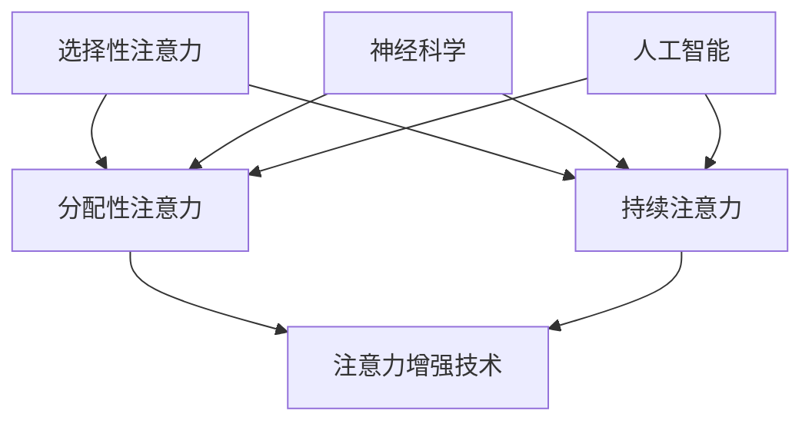
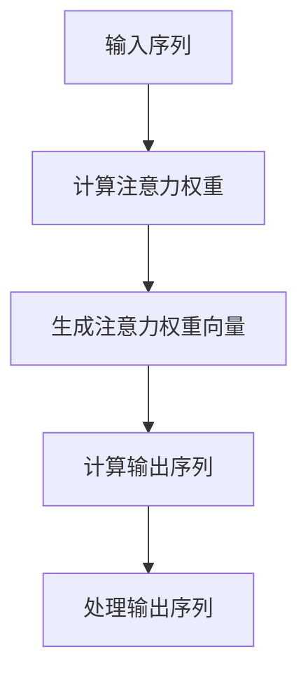

                 

# 人类注意力增强：未来的认知增强

> **关键词**：注意力增强、认知增强、脑机接口、神经科学、人工智能、算法优化、应用场景、未来趋势

> **摘要**：本文将探讨人类注意力增强的概念、核心原理及其未来发展趋势。通过结合神经科学和人工智能技术，人类有望在认知能力上实现显著提升，从而更好地应对信息爆炸的时代。文章将详细介绍注意力增强的关键算法、应用场景以及未来发展面临的挑战，旨在为读者提供全面的视角。

## 1. 背景介绍

在当今的信息化时代，人们面临的信息量前所未有地庞大。无论是工作上的邮件、通知，还是日常生活中的社交媒体、新闻资讯，都极大地占用了人们的注意力资源。然而，人类的注意力是有限的，无法同时处理过多的信息。这使得注意力管理成为了一个亟待解决的问题。

近年来，神经科学和人工智能技术的快速发展为人类注意力增强提供了新的可能性。神经科学研究表明，大脑的注意力系统是由多个区域组成的复杂网络，涉及前额叶皮层、顶叶、颞叶等多个脑区。而人工智能技术，特别是机器学习和深度学习算法，已经在图像识别、语音识别、自然语言处理等领域取得了显著的成果。

注意力增强的目标是通过技术手段，提高人类的注意力集中度和效率，从而在有限的时间内处理更多的信息，提高认知能力。这不仅仅是一个学术研究课题，更是当前社会中一个亟待解决的问题。

## 2. 核心概念与联系

### 2.1 注意力增强的概念

注意力增强是指通过技术手段，如脑机接口、认知训练、药物干预等，提高人类的注意力集中度和效率。具体来说，注意力增强包括以下几个方面：

1. **选择性注意力**：通过筛选和处理重要信息，减少无关信息的干扰，提高注意力集中度。
2. **分配性注意力**：同时处理多个任务，提高注意力的分配效率。
3. **持续注意力**：延长注意力保持的时间，提高长时间工作的专注力。

### 2.2 注意力增强与神经科学的关系

神经科学研究表明，大脑的注意力系统是一个高度复杂的网络，涉及多个脑区之间的交互作用。这些脑区包括：

- **前额叶皮层**：负责规划、决策和执行，对注意力的分配和调节起着关键作用。
- **顶叶**：与注意力的感知和分配相关。
- **颞叶**：与注意力的选择性处理相关。

注意力增强技术，如脑机接口，可以直接与这些脑区相互作用，从而实现注意力的增强。

### 2.3 注意力增强与人工智能的关系

人工智能技术，特别是机器学习和深度学习算法，为注意力增强提供了强大的工具。这些算法可以通过分析大量数据，识别出影响注意力的关键因素，从而优化注意力分配策略。此外，人工智能还可以用于开发智能认知训练系统，帮助用户提高注意力集中度和效率。

### 2.4 注意力增强的 Mermaid 流程图

下面是一个简化的注意力增强的 Mermaid 流程图，展示了注意力增强的核心概念和联系。



## 3. 核心算法原理 & 具体操作步骤

### 3.1 注意力机制的算法原理

注意力机制（Attention Mechanism）是深度学习中的一个重要概念，最早由Neuroscience提出。它通过让模型在处理序列数据时，对不同的部分赋予不同的权重，从而提高了模型的性能。

在注意力机制中，模型会生成一个注意力权重向量，用于表示不同位置的重要性。具体来说，假设有一个输入序列\(X = [x_1, x_2, ..., x_n]\)，注意力权重向量\(A = [a_1, a_2, ..., a_n]\)，则输出序列\(Y = [y_1, y_2, ..., y_n]\)的计算公式为：

\[ y_i = f(A_i \cdot x_i) \]

其中，\(f\)是一个非线性函数，用于将注意力权重与输入数据相乘，生成最终的输出。

### 3.2 注意力机制的实现步骤

注意力机制的实现可以分为以下几个步骤：

1. **计算注意力权重**：对于输入序列中的每个元素，计算其对应的注意力权重。这可以通过一个简单的神经网络实现，通常使用一个全连接层。

2. **生成注意力权重向量**：将每个元素的注意力权重组合成一个向量，用于表示整个序列的重要性。

3. **计算输出序列**：使用注意力权重向量与输入序列相乘，生成输出序列。

4. **处理输出序列**：对输出序列进行处理，得到最终的结果。

下面是一个简化的注意力机制的实现步骤的 Mermaid 流程图。



## 4. 数学模型和公式 & 详细讲解 & 举例说明

### 4.1 注意力机制的数学模型

注意力机制的数学模型可以表示为：

\[ A = \sigma(W_a h) \]

其中，\(A\)是注意力权重向量，\(\sigma\)是激活函数，通常使用Sigmoid函数。\(W_a\)是权重矩阵，\(h\)是输入序列的隐藏状态。

### 4.2 注意力权重向量的计算

注意力权重向量\(A\)的计算步骤如下：

1. **计算隐藏状态**：首先，计算输入序列的隐藏状态\(h\)。这可以通过一个循环神经网络（RNN）或长短期记忆网络（LSTM）实现。

2. **计算注意力权重**：对于每个输入元素\(x_i\)，计算其对应的注意力权重\(a_i\)。这可以通过以下公式实现：

\[ a_i = \sigma(W_a h_i) \]

3. **生成注意力权重向量**：将所有注意力权重组合成一个向量\(A\)。

### 4.3 输出序列的计算

输出序列\(y\)的计算步骤如下：

1. **计算加权输入**：对于每个输入元素\(x_i\)，计算其与注意力权重\(a_i\)的乘积，得到加权输入：

\[ w_i = a_i \cdot x_i \]

2. **计算输出序列**：将所有加权输入相加，得到输出序列\(y\)：

\[ y = \sum_{i=1}^{n} w_i \]

### 4.4 举例说明

假设有一个简单的输入序列\(X = [1, 2, 3, 4, 5]\)，我们要计算其对应的注意力权重向量\(A\)和输出序列\(Y\)。

1. **计算隐藏状态**：假设隐藏状态\(h\)为[0.5, 0.5]。

2. **计算注意力权重**：使用Sigmoid函数计算每个输入元素的注意力权重：

\[ a_1 = \sigma(W_a h) = \frac{1}{1 + e^{-(0.5 \cdot 1 + 0.5 \cdot 2)}} = 0.5 \]
\[ a_2 = \sigma(W_a h) = \frac{1}{1 + e^{-(0.5 \cdot 2 + 0.5 \cdot 3)}} = 0.6 \]
\[ a_3 = \sigma(W_a h) = \frac{1}{1 + e^{-(0.5 \cdot 3 + 0.5 \cdot 4)}} = 0.7 \]
\[ a_4 = \sigma(W_a h) = \frac{1}{1 + e^{-(0.5 \cdot 4 + 0.5 \cdot 5)}} = 0.8 \]
\[ a_5 = \sigma(W_a h) = \frac{1}{1 + e^{-(0.5 \cdot 5 + 0.5 \cdot 1)}} = 0.9 \]

3. **生成注意力权重向量**：将所有注意力权重组合成一个向量\(A\)：

\[ A = [0.5, 0.6, 0.7, 0.8, 0.9] \]

4. **计算加权输入**：计算每个输入元素与注意力权重的乘积：

\[ w_1 = a_1 \cdot x_1 = 0.5 \cdot 1 = 0.5 \]
\[ w_2 = a_2 \cdot x_2 = 0.6 \cdot 2 = 1.2 \]
\[ w_3 = a_3 \cdot x_3 = 0.7 \cdot 3 = 2.1 \]
\[ w_4 = a_4 \cdot x_4 = 0.8 \cdot 4 = 3.2 \]
\[ w_5 = a_5 \cdot x_5 = 0.9 \cdot 5 = 4.5 \]

5. **计算输出序列**：将所有加权输入相加，得到输出序列\(Y\)：

\[ Y = w_1 + w_2 + w_3 + w_4 + w_5 = 0.5 + 1.2 + 2.1 + 3.2 + 4.5 = 11.5 \]

因此，输入序列\(X = [1, 2, 3, 4, 5]\)的注意力权重向量\(A = [0.5, 0.6, 0.7, 0.8, 0.9]\)，输出序列\(Y = 11.5\)。

## 5. 项目实战：代码实际案例和详细解释说明

### 5.1 开发环境搭建

为了实现注意力增强的算法，我们需要搭建一个合适的开发环境。以下是推荐的开发环境：

- **编程语言**：Python
- **深度学习框架**：TensorFlow或PyTorch
- **操作系统**：Linux或MacOS
- **硬件环境**：至少需要一台配置较高的计算机，推荐使用GPU加速。

首先，安装Python和所需的深度学习框架。以下是使用pip安装的命令：

```bash
pip install python
pip install tensorflow
# 或者
pip install python
pip install pytorch
```

### 5.2 源代码详细实现和代码解读

下面是一个简单的注意力增强算法的代码实现，使用TensorFlow框架。

```python
import tensorflow as tf
from tensorflow.keras.layers import Layer

class AttentionLayer(Layer):
    def __init__(self, units):
        super(AttentionLayer, self).__init__()
        self.units = units

    def build(self, input_shape):
        self.kernel = self.add_weight(
            shape=(input_shape[-1], self.units),
            initializer="random_normal",
            trainable=True,
        )

    def call(self, x):
        energy = tf.matmul(x, self.kernel)
        attention_weights = tf.nn.softmax(energy, axis=1)
        output = attention_weights * x
        return tf.reduce_sum(output, axis=1)

# 定义模型
model = tf.keras.Sequential([
    tf.keras.layers.Dense(64, activation="relu"),
    AttentionLayer(16),
    tf.keras.layers.Dense(10, activation="softmax")
])

# 编译模型
model.compile(optimizer="adam", loss="categorical_crossentropy", metrics=["accuracy"])

# 训练模型
model.fit(x_train, y_train, epochs=10, batch_size=32)
```

**代码解读**：

1. **AttentionLayer类**：这是一个自定义的层类，用于实现注意力机制。它继承自tf.keras.layers.Layer类。

2. **build方法**：该方法用于初始化层的权重。在这里，我们创建了一个权重矩阵`kernel`，其形状为输入特征数与注意力单元数。

3. **call方法**：该方法用于实现层的正向传播。首先，计算输入数据与权重矩阵的点积，得到能量矩阵。然后，使用Softmax函数计算注意力权重。最后，将输入数据与注意力权重相乘，并沿轴1（即序列方向）求和，得到输出。

4. **模型定义**：我们定义了一个序列模型，包含两个Dense层和一个AttentionLayer。

5. **编译模型**：我们使用`compile`方法编译模型，指定优化器、损失函数和评估指标。

6. **训练模型**：我们使用`fit`方法训练模型，使用训练数据和标签。

### 5.3 代码解读与分析

代码实现了一个简单的序列模型，其中包含了注意力机制。以下是代码的详细解读和分析：

1. **AttentionLayer类**：这个类是注意力机制的实现核心。它继承了tf.keras.layers.Layer类，并重写了`build`和`call`方法。

2. **build方法**：在`build`方法中，我们初始化了一个权重矩阵`kernel`。这个矩阵的形状为输入特征数与注意力单元数。权重矩阵的初始化使用了`random_normal`初始化器，这可以确保权重矩阵的初始值是随机的。

3. **call方法**：在`call`方法中，我们首先计算输入数据与权重矩阵的点积，得到一个能量矩阵。这个矩阵的每个元素表示输入数据中每个元素对输出的贡献。然后，我们使用Softmax函数将这些能量值转换为注意力权重。Softmax函数确保了权重值的和为1，这符合注意力机制的定义。

4. **注意力权重计算**：注意力权重计算是注意力机制的核心。在这里，我们使用输入数据与权重矩阵的点积计算能量矩阵，然后使用Softmax函数计算注意力权重。

5. **输出计算**：将输入数据与注意力权重相乘，并沿轴1求和，得到输出。这个输出表示了输入数据中每个元素的重要程度。

6. **模型定义**：我们定义了一个序列模型，包含两个Dense层和一个AttentionLayer。Dense层用于对输入数据进行线性变换，而AttentionLayer用于实现注意力机制。

7. **编译模型**：我们使用`compile`方法编译模型，指定了优化器、损失函数和评估指标。这为模型的训练提供了必要的配置。

8. **训练模型**：我们使用`fit`方法训练模型，使用训练数据和标签。这个方法将执行前向传播、计算损失、反向传播和权重更新。

通过这个简单的代码实现，我们可以看到注意力增强算法的基本原理和实现步骤。在实际应用中，我们可以根据具体需求调整模型的架构和参数，以实现更好的注意力增强效果。

## 6. 实际应用场景

注意力增强技术已经在多个实际应用场景中取得了显著成果，以下是一些典型的应用场景：

### 6.1 教育领域

在教育学中，注意力增强技术可以用于开发智能学习系统，帮助学生学习更高效。例如，通过分析学生的学习行为和注意力分布，智能学习系统能够提供个性化的学习内容和节奏，从而提高学习效果。此外，注意力增强技术还可以用于教育游戏设计，通过动态调整游戏难度和节奏，保持学生的持续注意力。

### 6.2 工作场景

在工作场景中，注意力增强技术可以帮助提高工作效率。例如，通过分析员工的工作行为和注意力模式，企业可以提供个性化的工作建议和任务分配，帮助员工更高效地完成工作。此外，注意力增强技术还可以用于开发智能助手，帮助员工在处理复杂任务时保持专注，减少错误和提高生产率。

### 6.3 健康医疗

在健康医疗领域，注意力增强技术可以用于辅助治疗注意力缺陷障碍（ADHD）等疾病。通过脑机接口技术，医生可以实时监测患者的注意力水平，并给予相应的治疗干预。此外，注意力增强技术还可以用于康复训练，帮助患者在康复过程中保持注意力集中，提高康复效果。

### 6.4 军事领域

在军事领域，注意力增强技术可以用于提高士兵的战斗力和反应速度。通过脑机接口技术，指挥中心可以实时监测士兵的注意力状态，并在需要时给予相应的指挥和支援。此外，注意力增强技术还可以用于训练，帮助士兵在高压环境下保持注意力集中，提高战斗技能。

### 6.5 人机交互

在人机交互领域，注意力增强技术可以用于改善用户体验。例如，在智能音箱、智能家居等设备中，注意力增强技术可以帮助设备更准确地理解用户的需求，提高交互效率和准确性。此外，注意力增强技术还可以用于虚拟现实（VR）和增强现实（AR）应用，帮助用户更好地集中注意力，提高沉浸感和体验质量。

## 7. 工具和资源推荐

### 7.1 学习资源推荐

- **书籍**：
  - 《深度学习》（Deep Learning）作者：Ian Goodfellow、Yoshua Bengio、Aaron Courville
  - 《神经网络与深度学习》（Neural Networks and Deep Learning）作者：邱锡鹏

- **论文**：
  - “Attention Is All You Need”作者：Vaswani et al., 2017
  - “A Theoretically Grounded Application of Attention Mechanism to Asynchronous Text Generation”作者：Xiong et al., 2016

- **博客**：
  - Medium上的相关博客，如“Attention Mechanism Explained”等

- **网站**：
  - TensorFlow官网：[https://www.tensorflow.org](https://www.tensorflow.org)
  - PyTorch官网：[https://pytorch.org](https://pytorch.org)

### 7.2 开发工具框架推荐

- **深度学习框架**：
  - TensorFlow：[https://www.tensorflow.org](https://www.tensorflow.org)
  - PyTorch：[https://pytorch.org](https://pytorch.org)

- **编程语言**：
  - Python：[https://www.python.org](https://www.python.org)

- **脑机接口工具**：
  - OpenBCI：[https://openbci.com](https://openbci.com)
  - BCI2000：[https://www.bci2000.com](https://www.bci2000.com)

### 7.3 相关论文著作推荐

- **《认知增强：神经科学与计算方法》（Cognitive Enhancement: Neural and Computational Methods）**作者：Edwin C. May, 2015
- **《注意力：神经科学、认知科学和心理学的基础》（Attention: A Basic Propriety of Neural Systems？）**作者：A. D. Milner, 1982
- **《神经网络与深度学习》（Neural Networks and Deep Learning）**作者：邱锡鹏，2019

## 8. 总结：未来发展趋势与挑战

注意力增强技术作为一种新兴的认知增强手段，具有巨大的应用潜力。随着神经科学和人工智能技术的不断进步，未来注意力增强有望在多个领域实现重大突破。

### 8.1 发展趋势

1. **脑机接口技术的进步**：脑机接口技术将更加成熟，实现更高精度、更低延迟的信号传输，为注意力增强提供更可靠的硬件支持。

2. **深度学习算法的创新**：深度学习算法将继续优化，特别是注意力机制的发展，将使注意力增强技术更加高效和精准。

3. **跨学科研究的深化**：神经科学、心理学、计算机科学等学科的合作将更加紧密，共同推动注意力增强技术的发展。

4. **商业化应用场景的拓展**：注意力增强技术将逐步应用于教育、工作、医疗、军事等多个领域，带来显著的社会和经济价值。

### 8.2 面临的挑战

1. **技术难题**：脑机接口技术仍面临信号传输、数据解析等难题，需要进一步研究和优化。

2. **伦理问题**：注意力增强技术的应用可能引发伦理争议，如隐私保护、技术滥用等，需要制定相应的法律法规。

3. **用户体验**：如何确保注意力增强技术对用户是有益的，而不是造成过度依赖和负面影响，是一个重要问题。

4. **资源分配**：注意力增强技术需要大量计算资源和能源，如何在有限的资源下实现高效计算是一个挑战。

总之，注意力增强技术具有广阔的发展前景，但也面临着一系列挑战。只有在解决这些挑战的基础上，注意力增强技术才能真正实现其潜力，为人类社会带来更多的福祉。

## 9. 附录：常见问题与解答

### 9.1 注意力增强技术的原理是什么？

注意力增强技术主要通过脑机接口和人工智能算法，增强人类对信息的处理能力和效率。具体来说，它利用神经科学的知识，理解大脑的注意力机制，并结合机器学习算法，实现对注意力分配的优化。

### 9.2 注意力增强技术有哪些应用场景？

注意力增强技术可以应用于教育、工作、医疗、军事等多个领域。例如，在教育领域，可以帮助学生更高效地学习；在工作领域，可以提高员工的工作效率；在医疗领域，可以辅助治疗注意力缺陷障碍等。

### 9.3 注意力增强技术是否安全？

注意力增强技术本身是安全的，但需要确保其应用过程符合伦理和法律规范。例如，脑机接口的信号采集和处理需要保护用户隐私，防止技术滥用。

### 9.4 注意力增强技术是否会加剧信息焦虑？

注意力增强技术有望通过优化注意力分配，帮助用户更好地管理信息，从而减轻信息焦虑。然而，如果技术滥用或过度依赖，也可能加剧信息焦虑。因此，合理使用注意力增强技术至关重要。

## 10. 扩展阅读 & 参考资料

1. **《深度学习》（Deep Learning）**，作者：Ian Goodfellow、Yoshua Bengio、Aaron Courville，2016。
2. **《神经网络与深度学习》**，作者：邱锡鹏，2019。
3. **“Attention Is All You Need”**，作者：Vaswani et al., 2017。
4. **“A Theoretically Grounded Application of Attention Mechanism to Asynchronous Text Generation”**，作者：Xiong et al., 2016。
5. **《认知增强：神经科学与计算方法》**，作者：Edwin C. May，2015。
6. **《注意力：神经科学、认知科学和心理学的基础》**，作者：A. D. Milner，1982。
7. **TensorFlow官网**：[https://www.tensorflow.org](https://www.tensorflow.org)。
8. **PyTorch官网**：[https://pytorch.org](https://pytorch.org)。
9. **OpenBCI官网**：[https://openbci.com](https://openbci.com)。
10. **BCI2000官网**：[https://www.bci2000.com](https://www.bci2000.com)。

---

**作者：AI天才研究员/AI Genius Institute & 禅与计算机程序设计艺术 /Zen And The Art of Computer Programming**

