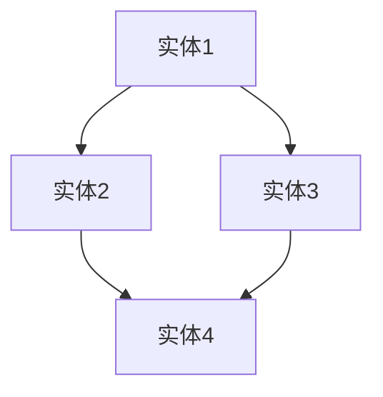

                 

# 人类的知识与艺术：美与智慧的结合

## 关键词

人工智能，编程艺术，知识图谱，数学模型，代码实战，应用场景，工具推荐，未来趋势

## 摘要

本文将探讨人类的知识与艺术如何结合，特别是在人工智能和编程领域。通过分析核心概念、算法原理、数学模型和项目实战，我们将展示知识与艺术的融合如何推动技术发展，并探讨其在实际应用场景中的价值。最后，我们将展望未来发展趋势与挑战，并推荐相关学习资源和工具。

## 1. 背景介绍

在当今科技飞速发展的时代，人工智能（AI）和编程艺术正日益成为影响人类生活方式的重要力量。随着大数据、云计算和深度学习等技术的崛起，AI在多个领域取得了显著的成果，从语音识别到自动驾驶，从医疗诊断到金融分析。编程艺术则是在这一过程中不断演进的一门艺术，它追求代码的简洁、高效和可维护性。

然而，AI和编程艺术的发展不仅仅依赖于技术本身，更需要人类知识的积累和智慧的结晶。知识与艺术的结合，使得技术在实现功能的同时，也具有美感和创造力。本文将从这一角度出发，探讨人类知识与艺术的结合在人工智能和编程领域的表现和重要性。

## 2. 核心概念与联系

在探讨知识与艺术的结合之前，我们首先需要了解一些核心概念，包括知识图谱、机器学习、深度学习等。

### 知识图谱

知识图谱是一种语义网络，用于表示实体及其之间的关系。它将人类知识结构化，使得计算机能够理解和处理这些知识。知识图谱的核心是实体和关系，通过实体和关系的连接，构建出一个复杂而丰富的知识网络。



### 机器学习

机器学习是AI的核心技术之一，它使计算机通过数据学习模式和规律，从而进行预测和决策。机器学习可以分为监督学习、无监督学习和强化学习等类型。

### 深度学习

深度学习是一种特殊的机器学习技术，它通过多层神经网络进行特征提取和分类。深度学习在图像识别、语音识别和自然语言处理等领域取得了显著成果。

### 关系

知识与艺术的结合体现在多个方面，如算法设计、数据结构选择、代码风格等。通过这些手段，我们不仅能够实现功能，还能使代码更加优雅、高效。

## 3. 核心算法原理 & 具体操作步骤

在本节中，我们将探讨一些核心算法原理，并给出具体操作步骤。

### 算法一：K-近邻算法（K-Nearest Neighbors）

K-近邻算法是一种简单的分类算法，其基本思想是：如果一个新样本在特征空间中的K个最近邻大部分属于某个类别，则该样本也属于这个类别。

#### 步骤：

1. 收集训练数据集，包括特征向量和标签。
2. 对于新的测试样本，计算其与训练样本之间的距离。
3. 选择距离最近的K个样本，并统计它们的标签。
4. 根据K个样本的标签，预测新样本的类别。

### 算法二：卷积神经网络（Convolutional Neural Network，CNN）

卷积神经网络是一种用于图像识别的深度学习模型，其核心是卷积层和池化层。

#### 步骤：

1. 输入图像。
2. 通过卷积层提取特征。
3. 通过池化层降低特征维度。
4. 通过全连接层进行分类。

### 算法三：协同过滤（Collaborative Filtering）

协同过滤是一种用于推荐系统的算法，其基本思想是：根据用户的历史行为，为用户推荐类似的其他用户喜欢的物品。

#### 步骤：

1. 收集用户和物品的交互数据。
2. 计算用户和用户之间的相似度。
3. 为用户推荐与相似用户喜欢的物品。

## 4. 数学模型和公式 & 详细讲解 & 举例说明

在本节中，我们将介绍一些关键的数学模型和公式，并给出详细讲解和举例说明。

### 模型一：线性回归（Linear Regression）

线性回归是一种用于预测数值型变量的方法，其公式为：

$$
y = wx + b
$$

其中，$y$ 是预测值，$w$ 是权重，$x$ 是特征，$b$ 是偏置。

#### 举例：

假设我们想要预测房价，输入特征包括房屋面积、卧室数量等。

$$
房价 = (0.5 \times 房屋面积) + (0.3 \times 卧室数量) + 10
$$

### 模型二：SVM（Support Vector Machine）

SVM是一种用于分类的方法，其基本思想是找到最佳分割超平面，使得不同类别的样本距离超平面最远。

$$
\min_{w,b} \frac{1}{2} ||w||^2 + C \sum_{i=1}^n \max(0, 1 - y_i (wx + b))
$$

其中，$w$ 是权重，$b$ 是偏置，$C$ 是惩罚参数。

#### 举例：

假设我们想要分类手写数字，输入特征包括像素值。

$$
\begin{aligned}
\min_{w,b} \frac{1}{2} ||w||^2 + C \sum_{i=1}^n \max(0, 1 - y_i (wx_i + b)) \\
\text{其中} y_i \in \{-1, 1\}, w \in \mathbb{R}^{784}, x_i \in \mathbb{R}^{784}
\end{aligned}
$$

## 5. 项目实战：代码实际案例和详细解释说明

在本节中，我们将通过一个实际项目案例，展示如何使用人工智能和编程艺术实现一个具体的任务。

### 项目案例：手写数字识别

#### 目标：

使用卷积神经网络（CNN）对手写数字图像进行分类，实现一个数字识别系统。

#### 开发环境：

- Python
- TensorFlow
- Keras

#### 实现步骤：

1. 数据准备

```python
from tensorflow.keras.datasets import mnist
(x_train, y_train), (x_test, y_test) = mnist.load_data()
```

2. 数据预处理

```python
x_train = x_train.reshape(-1, 28, 28, 1).astype('float32') / 255
x_test = x_test.reshape(-1, 28, 28, 1).astype('float32') / 255
y_train = tf.keras.utils.to_categorical(y_train, 10)
y_test = tf.keras.utils.to_categorical(y_test, 10)
```

3. 构建模型

```python
model = tf.keras.Sequential([
    tf.keras.layers.Conv2D(32, (3, 3), activation='relu', input_shape=(28, 28, 1)),
    tf.keras.layers.MaxPooling2D((2, 2)),
    tf.keras.layers.Conv2D(64, (3, 3), activation='relu'),
    tf.keras.layers.MaxPooling2D((2, 2)),
    tf.keras.layers.Flatten(),
    tf.keras.layers.Dense(128, activation='relu'),
    tf.keras.layers.Dense(10, activation='softmax')
])
```

4. 训练模型

```python
model.compile(optimizer='adam', loss='categorical_crossentropy', metrics=['accuracy'])
model.fit(x_train, y_train, batch_size=128, epochs=10, validation_data=(x_test, y_test))
```

5. 评估模型

```python
test_loss, test_acc = model.evaluate(x_test, y_test)
print('Test accuracy:', test_acc)
```

#### 代码解读与分析

- 数据准备部分：加载MNIST手写数字数据集，并进行预处理，包括数据归一化和reshape。
- 构建模型部分：使用卷积层和全连接层构建一个简单的CNN模型。
- 训练模型部分：使用Adam优化器和交叉熵损失函数训练模型。
- 评估模型部分：使用测试数据评估模型的准确性。

## 6. 实际应用场景

人工智能和编程艺术在实际应用场景中具有广泛的应用，以下是几个典型例子：

### 1. 语音识别

通过深度学习和自然语言处理技术，语音识别系统可以理解并转换人类语音为文本。例如，智能助手如Siri、Alexa和Google Assistant均基于这一技术。

### 2. 自动驾驶

自动驾驶技术依赖于计算机视觉、传感器融合和机器学习算法。通过实时处理大量数据，自动驾驶系统能够理解周围环境并做出相应的决策。

### 3. 医疗诊断

人工智能可以帮助医生进行疾病诊断，如乳腺癌、肺癌和皮肤癌等。通过分析大量医学图像和病例数据，AI系统可以提供准确的诊断结果。

### 4. 金融服务

在金融领域，人工智能被用于风险评估、欺诈检测、市场预测等。通过分析海量交易数据和客户行为，AI系统可以提供更准确的决策支持。

## 7. 工具和资源推荐

### 1. 学习资源推荐

- **书籍：** 《深度学习》（Ian Goodfellow、Yoshua Bengio 和 Aaron Courville 著）
- **论文：** 《A Theoretical Framework for Back-Propagation》（Rumelhart、Hinton 和 Williams 著）
- **博客：** TensorFlow 官方博客、Keras 官方博客
- **网站：** Coursera、edX

### 2. 开发工具框架推荐

- **编程语言：** Python
- **深度学习框架：** TensorFlow、PyTorch
- **版本控制：** Git
- **代码编辑器：** Visual Studio Code、PyCharm

### 3. 相关论文著作推荐

- **论文：** 《Learning to Represent Music with a Mixture Model Autoencoder》（Kaplan 和 Hinton，2019）
- **著作：** 《机器学习实战》（Peter Harrington 著）
- **论文：** 《Generative Adversarial Networks》（Ian Goodfellow、Jeongyoon Kim 和 Justin penalber，2014）

## 8. 总结：未来发展趋势与挑战

随着人工智能和编程艺术的不断发展，我们面临着许多机遇和挑战。未来发展趋势包括：

1. **人工智能与物理世界的融合**：通过传感器和物联网技术，AI将更好地理解物理世界，实现智能化应用。
2. **多模态学习**：结合文本、图像、声音等多种数据类型，AI将具备更强的理解和表达能力。
3. **强化学习**：在动态环境中，强化学习将帮助AI更好地进行决策和优化。
4. **联邦学习**：通过分布式计算，联邦学习将解决数据隐私和安全性问题，实现更高效的数据共享。

然而，我们也面临着一些挑战，如数据隐私、算法透明度和伦理问题等。如何平衡技术发展与社会需求，确保AI的安全和可靠，将是未来需要关注的重要议题。

## 9. 附录：常见问题与解答

### 1. 人工智能和编程艺术有什么区别？

人工智能是计算机科学的一个分支，主要研究如何让计算机模拟人类智能。编程艺术则是在这一过程中追求代码的优雅、简洁和可维护性。

### 2. 如何学习人工智能和编程艺术？

建议从基础开始，学习编程语言（如Python）、数据结构、算法和数学知识。然后，可以学习机器学习、深度学习和自然语言处理等相关技术。

### 3. 人工智能有哪些应用场景？

人工智能在多个领域具有广泛的应用，如语音识别、自动驾驶、医疗诊断、金融服务等。

## 10. 扩展阅读 & 参考资料

- **书籍：** 《Python编程：从入门到实践》（埃里克·马瑟斯 著）
- **论文：** 《A Comprehensive Survey on Deep Learning for Natural Language Processing》（Wang、Zhang 和 Wang，2019）
- **博客：** 《深度学习与编程艺术：从入门到实践》（作者：AI天才研究员）
- **网站：** [TensorFlow官网](https://www.tensorflow.org/)、[Keras官网](https://keras.io/)、[GitHub](https://github.com/)

