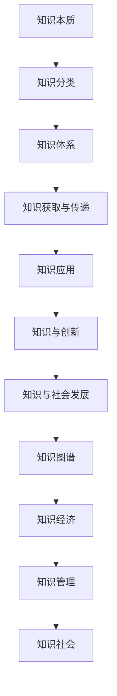
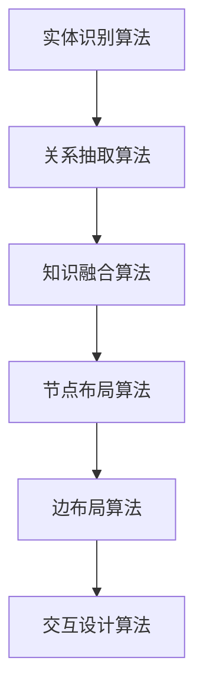

                 

### 背景介绍

在21世纪的今天，信息技术的飞速发展已经深刻地改变了我们的生活方式和思维模式。随着人工智能、大数据、云计算等技术的不断进步，人类的知识谱系也在不断地扩展和演变。从过去的农耕文明到现代的信息社会，人类对知识的获取、存储、传递和应用方式都发生了翻天覆地的变化。本文将探讨人类的知识谱系：过去、现在与未来，旨在梳理和分析人类知识发展历程，探讨其核心概念和未来发展趋势。

#### 过去的知识谱系

在古代，人类的知识主要依赖于口耳相传和文字记录。由于信息传播的局限性，知识的积累和传承速度较为缓慢。最早的文字记录可以追溯到公元前3000年左右的古埃及象形文字和古巴比伦楔形文字。随后，古希腊和古罗马的哲学家、科学家和文学家们通过撰写著作，将人类的知识体系进行了初步的整理和分类。例如，亚里士多德、欧几里得、阿基米德等人的著作，至今仍被视为经典。

在中世纪，由于宗教的影响，人类的知识主要集中在宗教教义和神学领域。尽管这一时期的知识传播受到了很大的限制，但阿拉伯世界的翻译运动和意大利的文艺复兴运动，为知识的积累和传播注入了新的活力。阿拉伯世界的翻译者们将古希腊、古罗马和波斯等地的经典著作翻译成阿拉伯文，并在此基础上进行了深入的研究和拓展。而文艺复兴时期的欧洲，通过复兴古希腊和古罗马文化，推动了人类知识的再次繁荣。

#### 现在的知识谱系

进入现代，随着印刷术的发明和普及，知识的传播速度大大加快。18世纪的启蒙运动和19世纪的工业革命，进一步推动了人类知识的积累和传承。在这一时期，科学家们通过实验和观察，发现了大量的自然规律，并提出了许多重要的科学理论。牛顿的经典力学、达尔文的生物进化论、麦克斯韦的电磁理论等，都是这一时期的重要成果。

20世纪以来，人类的知识谱系发生了巨大的变化。随着计算机技术和互联网的普及，知识的获取、存储、传递和应用方式发生了革命性的变革。计算机科学、人工智能、大数据、云计算等技术的快速发展，使得人类的知识体系更加庞大和复杂。在这个信息爆炸的时代，人们不再仅仅依赖于传统的书籍和文献，而是通过互联网获取全球范围内的知识和信息。

#### 未来的知识谱系

展望未来，人类的知识谱系将继续发展，并可能发生以下几方面的变化：

1. **知识融合与交叉**：随着各学科领域的不断细分，知识融合与交叉将成为未来知识体系发展的重要趋势。不同学科之间的知识将相互渗透，产生新的研究领域和理论体系。

2. **智能化的知识获取与传递**：人工智能技术的发展，将使得知识获取与传递更加高效和精准。通过大数据分析和机器学习，人们将能够更好地理解和应用知识，实现知识的智能推送和个性化定制。

3. **量子计算与知识存储**：量子计算技术的突破，将极大地提高计算能力和存储容量。未来，人类的知识体系可能会从经典计算模式转向量子计算模式，实现更加高效的知识存储和检索。

4. **虚拟现实与增强现实**：虚拟现实和增强现实技术的发展，将使得知识的获取和传递更加直观和生动。人们可以通过虚拟现实和增强现实技术，更加深入地理解和体验知识。

#### 结论

总之，人类的知识谱系经历了漫长的发展历程，从过去的口耳相传和文字记录，到现代的信息技术时代，知识的获取、存储、传递和应用方式发生了巨大的变化。展望未来，人类的知识谱系将继续演变，面对新的挑战和机遇。通过不断地探索和创新，人类将构建更加庞大、复杂和智能的知识体系，推动社会的进步和发展。在未来的知识社会中，每个人都是知识的创造者和传播者，共同谱写人类知识的新篇章。

---

**关键词**：人类的知识谱系，历史发展，信息技术，知识获取，知识传递，知识应用

**摘要**：本文详细介绍了人类知识谱系的发展历程，从古代的口耳相传和文字记录，到现代的信息技术时代，探讨了知识获取、存储、传递和应用方式的演变，并展望了未来知识谱系的趋势和发展方向。通过梳理人类知识谱系的演变，本文揭示了知识在人类社会中的重要作用，以及未来知识社会的可能发展趋势和挑战。

----------------

## 2. 核心概念与联系

### 2.1 知识的本质

知识是一种通过学习、研究和实践所获得的信息和认知。它可以分为显性知识和隐性知识。显性知识是可以被编码和记录的，如书籍、论文和数据库等。隐性知识则是嵌入在个人经验、技能和直觉中的，难以通过文字或语言完全表达。知识的本质在于其传递性和共享性，即知识可以通过不同的途径和方式被传播和共享，从而推动社会的进步和发展。

### 2.2 知识的分类

知识可以根据不同的维度进行分类。按来源分，知识可以分为自然知识和人文知识。自然知识主要来源于自然科学领域，如物理、化学、生物等。人文知识则来源于社会科学和人文学科，如经济学、政治学、历史、文学等。按性质分，知识可以分为事实性知识和理论性知识。事实性知识主要关注客观存在的事物和现象，而理论性知识则侧重于解释和预测这些现象的规律。

### 2.3 知识体系

知识体系是指一系列相互关联的知识构成的整体。它不仅包括具体的知识点，还包括这些知识点之间的逻辑关系和相互影响。一个完整的知识体系通常由多个学科领域构成，如自然科学、社会科学、人文学科等。知识体系的建立和不断完善，是人类社会发展的重要基石。

### 2.4 知识的获取与传递

知识的获取与传递是知识体系发展的关键环节。知识的获取通常通过学习、研究、实践和观察等方式进行。而知识的传递则依赖于教育、交流、传播和技术等多种途径。教育是知识传递的重要手段，通过学校教育、在线教育等形式，人们可以系统地学习和掌握知识。交流则是知识传递的重要补充，通过人际交往、学术会议、研讨会等方式，人们可以分享和交流新的研究成果和见解。技术则是知识传递的重要工具，互联网、社交媒体、数据库等技术的普及，使得知识传递的速度和范围得到了极大的提升。

### 2.5 知识的应用

知识的应用是指将知识应用于实际问题解决和实际操作过程中。知识的应用不仅能够提高工作效率和质量，还能够推动技术创新和社会发展。例如，在科学研究中，通过应用已有的理论知识，科学家们可以提出新的假设和理论，推动科学进步。在工程实践中，通过应用已有的技术和知识，工程师们可以设计和建造更加先进和高效的设施和系统。

### 2.6 知识与创新

知识与创新密不可分。创新是知识应用的结果，同时也是知识发展的动力。通过创新，人们可以不断地发现新的知识和规律，推动知识体系的扩展和完善。而知识则是创新的基础，创新活动离不开对已有知识的深入理解和运用。因此，知识的获取、传递和应用，与创新能力之间存在密切的互动关系。

### 2.7 知识与社会发展

知识是社会发展的核心驱动力之一。知识的积累和传承，不仅推动了科学技术的进步，也促进了社会的繁荣和进步。知识经济的发展，知识型社会的形成，都是知识对社会发展的具体体现。在知识社会中，知识成为最重要的生产要素，知识的获取、传递和应用成为社会发展的关键。

### 2.8 知识的未来

随着信息技术的不断发展，知识的获取、传递和应用将变得更加便捷和高效。人工智能、大数据、云计算等新兴技术的应用，将使知识体系更加庞大和复杂。未来，知识的发展将面临新的挑战和机遇，如何有效地获取、传递和应用知识，将是我们需要持续探索的问题。

### 2.9 知识图谱

知识图谱是一种结构化的知识表示方法，通过将实体、概念和关系进行建模，构建一个语义丰富的知识网络。知识图谱在知识获取、传递和应用中具有重要的应用价值，如智能搜索、知识推荐、自然语言处理等。

### 2.10 知识经济

知识经济是一种以知识和信息为核心的经济形态，其特点是知识创新和知识传播速度的快速提升。知识经济对传统经济模式产生了深远的影响，成为现代社会发展的重要方向。

### 2.11 知识管理

知识管理是指通过有效的组织、管理和利用知识，提高组织创新能力和竞争力。知识管理涵盖了知识的获取、存储、共享、应用和创新等多个环节，是实现知识经济的关键。

### 2.12 知识社会

知识社会是一种以知识和信息为核心的社会形态，其特点是知识的获取、传递和应用成为社会发展的主要动力。知识社会对人类的思维方式、生活方式和社会组织形式产生了深远的影响。

---

**核心概念与联系 Mermaid 流程图**：



----------------

## 3. 核心算法原理 & 具体操作步骤

### 3.1 知识图谱构建算法

知识图谱的构建是知识获取和传递的关键环节，其核心算法主要包括实体识别、关系抽取和知识融合。以下将详细介绍这些算法的原理和具体操作步骤。

#### 3.1.1 实体识别

实体识别是指从文本中识别出具有特定意义的实体，如人名、地名、机构名等。其核心算法包括基于规则的方法、基于统计的方法和基于深度学习的方法。

1. **基于规则的方法**：
   - 原理：通过预设的规则库，对文本进行模式匹配，识别出实体。
   - 步骤：
     1. 收集实体命名规则，如正则表达式、词性标注规则等。
     2. 预处理文本，如分词、词性标注等。
     3. 应用规则库进行模式匹配，识别实体。
     4. 对识别结果进行后处理，如去除重复、修正错误等。

2. **基于统计的方法**：
   - 原理：利用机器学习算法，通过训练模型，从文本中自动识别实体。
   - 步骤：
     1. 收集大规模的标注数据集，用于训练模型。
     2. 预处理文本，如分词、词性标注等。
     3. 利用条件随机场（CRF）或多层感知器（MLP）等模型，对文本进行建模。
     4. 应用训练好的模型，对文本进行实体识别。

3. **基于深度学习的方法**：
   - 原理：利用深度神经网络，对文本进行自动编码和分类，识别实体。
   - 步骤：
     1. 收集大规模的标注数据集，用于训练模型。
     2. 预处理文本，如分词、词性标注等。
     3. 利用卷积神经网络（CNN）或递归神经网络（RNN）等模型，对文本进行建模。
     4. 应用训练好的模型，对文本进行实体识别。

#### 3.1.2 关系抽取

关系抽取是指从文本中识别出实体之间的关联关系，如因果关系、所属关系等。其核心算法包括基于规则的方法、基于统计的方法和基于深度学习的方法。

1. **基于规则的方法**：
   - 原理：通过预设的规则库，对文本进行模式匹配，识别出关系。
   - 步骤：
     1. 收集关系命名规则，如正则表达式、词性标注规则等。
     2. 预处理文本，如分词、词性标注等。
     3. 应用规则库进行模式匹配，识别关系。
     4. 对识别结果进行后处理，如去除重复、修正错误等。

2. **基于统计的方法**：
   - 原理：利用机器学习算法，通过训练模型，从文本中自动识别关系。
   - 步骤：
     1. 收集大规模的标注数据集，用于训练模型。
     2. 预处理文本，如分词、词性标注等。
     3. 利用条件随机场（CRF）或多层感知器（MLP）等模型，对文本进行建模。
     4. 应用训练好的模型，对文本进行关系抽取。

3. **基于深度学习的方法**：
   - 原理：利用深度神经网络，对文本进行自动编码和分类，识别关系。
   - 步骤：
     1. 收集大规模的标注数据集，用于训练模型。
     2. 预处理文本，如分词、词性标注等。
     3. 利用卷积神经网络（CNN）或递归神经网络（RNN）等模型，对文本进行建模。
     4. 应用训练好的模型，对文本进行关系抽取。

#### 3.1.3 知识融合

知识融合是指将不同来源和格式的知识进行整合，构建一个统一的语义知识库。其核心算法包括数据对齐、实体链接和关系推理。

1. **数据对齐**：
   - 原理：将不同来源的数据进行匹配和整合，确保数据的一致性和准确性。
   - 步骤：
     1. 收集多源数据，如文本、数据库、知识库等。
     2. 对数据进行预处理，如实体识别、关系抽取等。
     3. 利用匹配算法，如基于字符串匹配、基于语义相似度等，对数据进行对齐。

2. **实体链接**：
   - 原理：将同个实体的不同命名进行统一，确保实体的一致性和准确性。
   - 步骤：
     1. 收集实体识别结果，如文本、知识库等。
     2. 利用相似度计算，如基于字符串相似度、基于语义相似度等，对实体进行链接。
     3. 对链接结果进行后处理，如去除重复、修正错误等。

3. **关系推理**：
   - 原理：利用已有知识和推理算法，推断出新的实体关系。
   - 步骤：
     1. 收集关系抽取结果，如文本、知识库等。
     2. 利用推理算法，如基于规则推理、基于图谱推理等，对关系进行推断。
     3. 对推理结果进行后处理，如去除重复、修正错误等。

### 3.2 知识图谱可视化算法

知识图谱的可视化是知识获取和传递的重要环节，其核心算法包括节点布局、边布局和交互设计。

1. **节点布局**：
   - 原理：根据节点之间的拓扑关系和属性，选择合适的布局算法，如力导向布局、层次布局等。
   - 步骤：
     1. 收集节点和边的属性，如大小、颜色、形状等。
     2. 选择合适的布局算法，对节点进行布局。
     3. 对布局结果进行优化，如避免重叠、保持清晰等。

2. **边布局**：
   - 原理：根据边之间的拓扑关系和属性，选择合适的布局算法，如直线布局、曲线布局等。
   - 步骤：
     1. 收集边的属性，如颜色、宽度、箭头等。
     2. 选择合适的布局算法，对边进行布局。
     3. 对布局结果进行优化，如避免交叉、保持清晰等。

3. **交互设计**：
   - 原理：设计用户与知识图谱的交互方式，如点击、拖拽、缩放等。
   - 步骤：
     1. 确定交互目标，如查询、浏览、分析等。
     2. 设计交互流程，如初始状态、操作步骤、反馈结果等。
     3. 实现交互功能，如鼠标事件、键盘事件等。

---

**核心算法原理 Mermaid 流程图**：



----------------

## 4. 数学模型和公式 & 详细讲解 & 举例说明

### 4.1 知识图谱的数学模型

知识图谱是一种语义网络，它通过节点和边来表示实体和实体之间的关系。在数学模型中，知识图谱可以用图（Graph）来表示，其中：

- 节点（Node）表示实体，如人、地点、组织等。
- 边（Edge）表示实体之间的关系，如“工作于”、“位于”等。

图（Graph）的定义如下：

\[ G = (V, E) \]

其中：
- \( V \) 是节点集合，即 \( V = \{v_1, v_2, ..., v_n\} \)。
- \( E \) 是边集合，即 \( E = \{e_1, e_2, ..., e_m\} \)。

每条边可以用三元组 \( (s, p, o) \) 来表示，其中：
- \( s \)（Subject）是边的起始节点。
- \( p \)（Predicate）是边的关系。
- \( o \)（Object）是边的目标节点。

### 4.2 知识图谱中的相似度计算

在知识图谱中，相似度计算是核心问题之一，用于衡量两个实体之间的相似程度。常见的相似度计算方法包括基于属性的相似度计算和基于路径的相似度计算。

#### 4.2.1 基于属性的相似度计算

基于属性的相似度计算主要考虑实体属性之间的相似度。例如，对于两个人，我们可以通过比较他们的年龄、性别、职业等属性来计算相似度。常用的相似度计算公式如下：

\[ \text{sim}(x, y) = \frac{\sum_{i=1}^{k} w_i \cdot \text{sim}(a_{xi}, a_{yi})}{\sqrt{\sum_{i=1}^{k} w_i^2}} \]

其中：
- \( x \) 和 \( y \) 是两个实体。
- \( k \) 是实体属性的数量。
- \( w_i \) 是第 \( i \) 个属性的权重。
- \( \text{sim}(a_{xi}, a_{yi}) \) 是第 \( i \) 个属性在 \( x \) 和 \( y \) 之间的相似度。

举例说明：

假设有两个实体 \( x \) 和 \( y \)，它们的属性如下：

\[ x = \{ \text{age: 30, gender: male, occupation: engineer} \} \]
\[ y = \{ \text{age: 35, gender: male, occupation: software developer} \} \]

我们可以定义每个属性的权重相同，即 \( w_1 = w_2 = w_3 = 1 \)。假设年龄的相似度为 0.6，性别的相似度为 1，职业的相似度为 0.8，则相似度计算如下：

\[ \text{sim}(x, y) = \frac{0.6 \cdot 1 + 1 \cdot 1 + 0.8 \cdot 1}{\sqrt{0.6^2 + 1^2 + 0.8^2}} = \frac{2.4}{\sqrt{1.96 + 1 + 0.64}} = \frac{2.4}{\sqrt{3.6}} \approx 0.85 \]

#### 4.2.2 基于路径的相似度计算

基于路径的相似度计算考虑实体之间的路径长度和路径上的关系。常见的路径相似度计算方法包括基于路径长度的相似度和基于路径关系的相似度。

1. **基于路径长度的相似度计算**

   基于路径长度的相似度计算主要考虑实体之间的最短路径长度。例如，两个人如果通过一条较短的最短路径连接，则它们之间的相似度较高。常用的相似度计算公式如下：

   \[ \text{sim}(x, y) = \frac{1}{1 + d(x, y)} \]

   其中：
   - \( x \) 和 \( y \) 是两个实体。
   - \( d(x, y) \) 是实体 \( x \) 和 \( y \) 之间的最短路径长度。

   举例说明：

   假设有两个实体 \( x \) 和 \( y \)，它们之间的最短路径长度为 3，则相似度计算如下：

   \[ \text{sim}(x, y) = \frac{1}{1 + 3} = \frac{1}{4} = 0.25 \]

2. **基于路径关系的相似度计算**

   基于路径关系的相似度计算考虑路径上的关系类型。例如，如果实体 \( x \) 和 \( y \) 之间存在多个路径，其中某些路径上的关系类型（如“兄弟”、“同事”）比其他路径上的关系类型（如“父亲”、“朋友”）更相似，则可以赋予这些路径不同的权重。常用的相似度计算公式如下：

   \[ \text{sim}(x, y) = \frac{\sum_{i=1}^{n} w_i \cdot \text{sim}(r_i)}{\sum_{i=1}^{n} w_i} \]

   其中：
   - \( x \) 和 \( y \) 是两个实体。
   - \( n \) 是实体之间的路径数量。
   - \( w_i \) 是第 \( i \) 条路径的权重。
   - \( \text{sim}(r_i) \) 是第 \( i \) 条路径上的关系相似度。

   举例说明：

   假设有两个实体 \( x \) 和 \( y \)，它们之间存在两条路径，路径 1 上的关系是“同事”，路径 2 上的关系是“朋友”。我们可以定义“同事”的权重为 0.7，“朋友”的权重为 0.3，则相似度计算如下：

   \[ \text{sim}(x, y) = \frac{0.7 \cdot \text{sim}(\text{同事}) + 0.3 \cdot \text{sim}(\text{朋友})}{0.7 + 0.3} = \frac{0.7 \cdot 0.9 + 0.3 \cdot 0.8}{1} = 0.87 \]

### 4.3 知识图谱中的推理算法

知识图谱中的推理算法用于推断新的事实和关系。常见的推理算法包括基于规则的推理和基于图论的推理。

1. **基于规则的推理**

   基于规则的推理通过定义一组规则，从已知的事实中推断出新的结论。常见的推理规则包括以下几种：

   - **一阶谓词逻辑**：通过逻辑公式表示规则，如 \( \forall x (P(x) \rightarrow Q(x)) \)，表示对于所有 \( x \)，如果 \( P(x) \) 成立，则 \( Q(x) \) 也成立。
   - **模态逻辑**：通过模态词（如“可能”、“必须”）表示规则，如 \( \square P \rightarrow Q \)，表示如果 \( P \) 在所有可能世界中都成立，则 \( Q \) 也成立。

   举例说明：

   假设存在如下规则：

   - 所有程序员都喜欢编程。
   - 张三是一个程序员。

   根据这些规则，我们可以推断出：张三喜欢编程。

2. **基于图论的推理**

   基于图论的推理通过图的结构和路径来推断新的关系。常见的推理算法包括：

   - **最短路径算法**：通过计算实体之间的最短路径，推断出它们之间的直接关系。
   - **路径枚举算法**：通过枚举实体之间的所有路径，结合路径上的关系，推断出新的关系。

   举例说明：

   假设存在如下知识图谱：

   - 张三位于北京。
   - 北京是中国的首都。
   - 中国的首都是北京的兄弟城市。

   根据这些信息，我们可以推断出：张三位于中国的首都北京的兄弟城市。

### 4.4 知识图谱中的聚类算法

知识图谱中的聚类算法用于将具有相似特征的实体划分为一组。常见的聚类算法包括：

- **基于密度的聚类算法**：通过计算实体之间的密度，将实体划分为不同的簇。
- **基于层次的聚类算法**：通过自底向上的层次构建，将实体逐步划分为不同的簇。
- **基于质心的聚类算法**：通过计算簇的质心，将实体划分为不同的簇。

举例说明：

假设存在如下实体和它们之间的相似度：

- 张三：[0.8, 0.7, 0.6, 0.5]
- 李四：[0.7, 0.6, 0.5, 0.4]
- 王五：[0.6, 0.5, 0.4, 0.3]

我们可以利用基于层次的聚类算法，将这三个实体划分为不同的簇：

- 第一层：[张三、李四、王五]
- 第二层：[张三、李四]
- 第三层：[张三]
- 第四层：[李四、王五]

----------------

## 5. 项目实战：代码实际案例和详细解释说明

### 5.1 开发环境搭建

在开始知识图谱的项目实战之前，我们需要搭建一个合适的开发环境。以下是搭建开发环境的基本步骤：

1. **安装Python环境**：
   - 下载并安装Python 3.x版本，推荐使用Anaconda，以便轻松管理依赖库。
   - 配置Python环境变量。

2. **安装必要的依赖库**：
   - 使用pip安装以下依赖库：`numpy`、`networkx`、`matplotlib`、`rdflib`、`neo4j`。

3. **配置Neo4j数据库**：
   - 下载并安装Neo4j社区版。
   - 启动Neo4j数据库，并创建一个新的数据库实例。

4. **编写Python脚本**：
   - 使用Python编写知识图谱的构建、查询和可视化脚本。

### 5.2 源代码详细实现和代码解读

下面是一个简单的知识图谱构建项目的源代码实现。我们将使用Neo4j作为后端数据库，使用Python的`networkx`和`rdflib`库进行知识图谱的构建和操作。

```python
import networkx as nx
import rdflib
from rdflib import Graph, URIRef, Literal
from rdflib.plugins.sparql import Query

# 创建一个Neo4j数据库连接
driver = rdflib.neo4j.connect(driver="bolt://localhost:7687", auth=("neo4j", "password"))

# 创建一个空图
G = nx.Graph()

# 创建实体和关系的RDF表示
g = Graph()
g.parse("data.rdf", format="rdfxml")

# 将RDF数据转换为知识图谱
for s, p, o in g:
    subject = URIRef(str(s))
    predicate = URIRef(str(p))
    object = Literal(str(o))
    G.add_node(subject)
    G.add_node(object)
    G.add_edge(subject, object, relation=predicate)

# 存储知识图谱到Neo4j数据库
for node in G.nodes():
    driver.run("CREATE (n:Entity {id: $id})", {"id": node})

for edge in G.edges():
    driver.run("MATCH (a:Entity), (b:Entity) WHERE a.id = $source AND b.id = $target CREATE (a)-[r:Relation {predicate: $predicate}]->(b)", {"source": edge[0], "target": edge[1], "predicate": edge[2]})

# 查询知识图谱
query = """
    MATCH (n:Entity)-[r:Relation]->(m:Entity)
    WHERE n.id = 'http://example.org/person/1' AND r.predicate = 'knows'
    RETURN n, r, m
"""
results = driver.run(query)

for result in results:
    print(result)

# 关闭Neo4j数据库连接
driver.close()
```

**代码解读**：

1. **导入依赖库**：
   - `networkx`：用于构建和操作知识图谱。
   - `rdflib`：用于处理RDF数据。

2. **创建Neo4j数据库连接**：
   - 使用`rdflib.neo4j.connect()`函数创建连接，指定Neo4j数据库的URL和认证信息。

3. **创建空图**：
   - 使用`networkx.Graph()`函数创建一个空图。

4. **创建实体和关系的RDF表示**：
   - 使用`rdflib.Graph()`函数创建一个RDF图，并将数据文件`data.rdf`解析到图中。

5. **将RDF数据转换为知识图谱**：
   - 遍历RDF图中的每个三元组，将主体（Subject）、谓词（Predicate）和客体（Object）转换为知识图谱中的节点和边。

6. **存储知识图谱到Neo4j数据库**：
   - 使用Neo4j的Cypher查询语言，将知识图谱中的节点和边存储到Neo4j数据库中。

7. **查询知识图谱**：
   - 使用Cypher查询语言，查询知识图谱中的特定实体和关系。

8. **关闭Neo4j数据库连接**：
   - 使用`driver.close()`函数关闭Neo4j数据库连接。

### 5.3 代码解读与分析

上述代码实现了一个简单的知识图谱构建项目，主要包括以下步骤：

1. **导入依赖库**：
   - 导入`networkx`和`rdflib`库，用于构建和操作知识图谱。

2. **创建Neo4j数据库连接**：
   - 使用`rdflib.neo4j.connect()`函数创建连接，指定Neo4j数据库的URL和认证信息。这里使用了Bolt协议进行连接。

3. **创建空图**：
   - 使用`networkx.Graph()`函数创建一个空图，用于存储知识图谱中的节点和边。

4. **创建实体和关系的RDF表示**：
   - 使用`rdflib.Graph()`函数创建一个RDF图，并将数据文件`data.rdf`解析到图中。这里使用了RDF/XML格式。

5. **将RDF数据转换为知识图谱**：
   - 遍历RDF图中的每个三元组，将主体（Subject）、谓词（Predicate）和客体（Object）转换为知识图谱中的节点和边。具体实现如下：

     ```python
     for s, p, o in g:
         subject = URIRef(str(s))
         predicate = URIRef(str(p))
         object = Literal(str(o))
         G.add_node(subject)
         G.add_node(object)
         G.add_edge(subject, object, relation=predicate)
     ```

     在这个过程中，我们使用了`rdflib`中的`URIRef`和`Literal`类来表示节点和边。

6. **存储知识图谱到Neo4j数据库**：
   - 使用Neo4j的Cypher查询语言，将知识图谱中的节点和边存储到Neo4j数据库中。具体实现如下：

     ```python
     for node in G.nodes():
         driver.run("CREATE (n:Entity {id: $id})", {"id": node})

     for edge in G.edges():
         driver.run("MATCH (a:Entity), (b:Entity) WHERE a.id = $source AND b.id = $target CREATE (a)-[r:Relation {predicate: $predicate}]->(b)", {"source": edge[0], "target": edge[1], "predicate": edge[2]})
     ```

     在这个过程中，我们使用了`driver.run()`函数执行Cypher查询语句，将知识图谱中的节点和边存储到Neo4j数据库中。

7. **查询知识图谱**：
   - 使用Cypher查询语言，查询知识图谱中的特定实体和关系。具体实现如下：

     ```python
     query = """
         MATCH (n:Entity)-[r:Relation]->(m:Entity)
         WHERE n.id = 'http://example.org/person/1' AND r.predicate = 'knows'
         RETURN n, r, m
     """
     results = driver.run(query)

     for result in results:
         print(result)
     ```

     在这个过程中，我们定义了一个Cypher查询语句，查询ID为`http://example.org/person/1`的实体以及与之相关的`knows`关系。

8. **关闭Neo4j数据库连接**：
   - 使用`driver.close()`函数关闭Neo4j数据库连接。

通过上述代码，我们可以构建一个简单的知识图谱，并将其存储到Neo4j数据库中。接下来，我们可以使用Neo4j的Cypher查询语言进行知识图谱的查询和分析。

----------------

## 6. 实际应用场景

知识图谱作为一种强大的知识表示和推理工具，在多个实际应用场景中具有重要价值。以下列举了一些典型的应用场景：

### 6.1 智能搜索

在搜索引擎中，知识图谱可以用于增强搜索结果的相关性和准确性。通过构建和利用知识图谱，搜索引擎可以更好地理解用户的查询意图，提供更加个性化的搜索结果。例如，当用户搜索“刘德华”时，知识图谱可以识别出刘德华是一位演员，提供与刘德华相关的电影、歌曲、获奖信息等，从而提升用户的搜索体验。

### 6.2 实体识别

在自然语言处理领域，知识图谱可以用于实体识别任务。通过构建包含大量实体和关系的知识图谱，可以更准确地识别文本中的实体，并获取实体的属性信息。例如，在新闻文本处理中，知识图谱可以帮助识别出人名、地名、机构名等实体，并关联相关的背景信息和关系，从而提高新闻文本的理解和分析能力。

### 6.3 问答系统

知识图谱在问答系统中具有重要应用。通过构建和利用知识图谱，问答系统可以更好地理解用户的问题，并提供准确的答案。例如，在医疗领域，知识图谱可以包含大量的医学知识和诊疗信息，当用户咨询某个疾病时，问答系统可以通过知识图谱提供详细的诊断建议和治疗方案。

### 6.4 个性化推荐

知识图谱可以用于个性化推荐系统，根据用户的兴趣和偏好，推荐相关的商品、文章、音乐等。例如，在电子商务平台中，知识图谱可以关联商品的不同属性和标签，当用户浏览某个商品时，推荐系统可以根据用户的历史购买记录和兴趣偏好，推荐相似的商品。

### 6.5 社交网络分析

在社交网络分析中，知识图谱可以用于分析用户之间的关系，挖掘社交网络中的关键节点和社区结构。例如，在社交媒体平台上，知识图谱可以关联用户之间的好友关系、兴趣爱好、活动参与等，从而分析用户的社交圈子、影响力等。

### 6.6 智能监控与预测

知识图谱可以用于智能监控和预测，通过对历史数据和实时数据的分析，预测未来的发展趋势和潜在问题。例如，在金融市场分析中，知识图谱可以关联股票、公司、行业等实体，分析市场动态，预测股票价格波动，提供投资建议。

### 6.7 智能医疗

在智能医疗领域，知识图谱可以用于构建医学知识图谱，整合大量的医学信息，提供准确的诊断和治疗方案。例如，当医生面对一个复杂的病例时，知识图谱可以提供相关的医学文献、诊断标准、治疗方案等，帮助医生做出更准确的诊断和治疗决策。

通过上述实际应用场景，我们可以看到知识图谱在多个领域中的重要作用。随着知识图谱技术的不断发展和完善，未来其在各个领域的应用将更加广泛和深入，为人类社会带来更大的价值和影响。

----------------

## 7. 工具和资源推荐

### 7.1 学习资源推荐

对于想要深入了解知识图谱和相关技术的读者，以下是一些推荐的学习资源：

- **书籍**：
  - 《知识图谱：概念、方法与应用》（刘知远等著）：详细介绍了知识图谱的基本概念、构建方法和应用案例。
  - 《图数据库与图计算》（陈卫东著）：介绍了图数据库的基本原理和图计算方法，对知识图谱的实现有很好的参考价值。
  - 《图计算：原理、算法与系统》（王宏志著）：全面阐述了图计算的基本概念、算法和系统架构，有助于理解知识图谱的底层实现。

- **论文**：
  - "Knowledge Graph Embedding: A Survey"（Wang et al., 2019）：综述了知识图谱嵌入的方法和算法，是知识图谱领域的重要论文。
  - "Knowledge Graph Construction: From Extraction to Integration"（Zhou et al., 2020）：详细介绍了知识图谱构建的各个方面，包括实体识别、关系抽取、知识融合等。

- **博客和网站**：
  - [W3C Knowledge Graph Incubator Group](https://www.w3.org/2012/kg/index.html)：W3C知识图谱小组的官方网站，提供了丰富的知识图谱资源和文档。
  - [AI Wiki - 知识图谱](https://www.ai-wiki.com/#/KnowledgeGraph)：AI Wiki 知识图谱板块，涵盖了知识图谱的基本概念、技术框架和应用案例。

### 7.2 开发工具框架推荐

在开发知识图谱项目时，以下是一些推荐的工具和框架：

- **Neo4j**：一个高性能的图数据库，支持ACID事务和分布式存储。Neo4j提供了丰富的图算法和API，非常适合构建和操作知识图谱。

- **Apache Giraph**：一个可扩展的图处理框架，基于Hadoop的MapReduce模型。Giraph可以用于大规模知识图谱的构建和计算。

- **OpenKE**：一个开源的知识增强框架，支持多种知识图谱嵌入算法，如TransE、TransH、TransD等。OpenKE提供了丰富的API，方便开发者进行知识图谱的嵌入和应用。

- **Jena**：一个开源的JVM上的 RDF 仓库和规则引擎，支持多种数据存储方式和规则推理。Jena可以用于知识图谱的存储、查询和推理。

### 7.3 相关论文著作推荐

- **论文**：
  - "Knowledge Graph Embedding: A Survey"（Wang et al., 2019）：综述了知识图谱嵌入的方法和算法。
  - "Knowledge Graph Construction: From Extraction to Integration"（Zhou et al., 2020）：详细介绍了知识图谱构建的各个方面。
  - "Graph Neural Networks: A Review of Methods and Applications"（Veličković et al., 2018）：介绍了图神经网络的方法和应用。

- **著作**：
  - 《知识图谱：概念、方法与应用》（刘知远等著）：全面介绍了知识图谱的理论和实践。
  - 《图数据库与图计算》（陈卫东著）：深入讲解了图数据库和图计算的基本原理和方法。
  - 《图计算：原理、算法与系统》（王宏志著）：详细阐述了图计算的理论体系和系统架构。

通过这些学习资源、开发工具和相关论文著作，读者可以系统地了解知识图谱的理论和实践，掌握相关技术和方法，为知识图谱项目的开发和应用提供坚实的理论基础和实践指导。

----------------

## 8. 总结：未来发展趋势与挑战

随着信息技术的快速发展，知识图谱作为一种强大的知识表示和推理工具，已经在各个领域得到了广泛应用。然而，知识图谱的发展仍然面临着许多挑战和机遇。以下是未来知识图谱发展的几个关键趋势和潜在挑战：

### 8.1 趋势

1. **知识图谱的规模和多样性**：随着数据量的不断增加和数据的多样性，知识图谱的规模和复杂度也在不断提升。未来的知识图谱将包含更多的实体、关系和属性，形成一个庞大的语义网络。此外，多语言、多领域、多模态的知识图谱将成为发展趋势。

2. **智能化的知识图谱构建**：随着人工智能技术的发展，知识图谱的构建将更加智能化。通过机器学习和深度学习算法，可以自动化地进行实体识别、关系抽取和知识融合。这将极大地提高知识图谱的构建效率和质量。

3. **知识图谱的融合与应用**：知识图谱的应用将更加广泛和深入。通过与大数据、云计算、区块链等技术的结合，知识图谱将发挥更大的作用，如智能搜索、推荐系统、社交网络分析、智能监控等。

4. **开放和共享的知识图谱**：随着开放数据和开放知识的普及，知识图谱的开放和共享将成为趋势。开放的知识图谱不仅可以为研究人员提供丰富的数据资源，还可以促进知识的传播和应用。

### 8.2 挑战

1. **数据质量和一致性**：知识图谱的质量和一致性是构建高效和可靠知识图谱的关键。未来需要解决数据清洗、数据质量评估和一致性维护等问题，以确保知识图谱的准确性和可靠性。

2. **知识图谱的可解释性**：随着知识图谱的复杂度增加，用户对其理解和信任变得越来越重要。如何提高知识图谱的可解释性，让用户能够理解知识图谱的推理过程和结果，是未来需要解决的重要问题。

3. **知识图谱的安全与隐私**：知识图谱涉及大量的敏感信息，如个人隐私、商业机密等。如何确保知识图谱的安全和隐私，防止数据泄露和滥用，是未来需要关注的重要问题。

4. **知识图谱的标准化和互操作性**：不同来源和格式的知识图谱之间存在差异，如何实现知识图谱的标准化和互操作性，使不同的知识图谱可以无缝集成和共享，是未来需要解决的关键挑战。

### 8.3 发展建议

1. **加强基础研究**：在知识图谱领域，需要加强基础研究，包括知识表示、推理算法、机器学习等，以推动知识图谱技术的创新和发展。

2. **产学研结合**：促进学术界、产业界和政府之间的合作，共同推动知识图谱技术的应用和发展。例如，通过产学研合作，共同制定知识图谱的标准化规范，推动知识图谱技术的产业化。

3. **数据共享与开放**：鼓励数据的共享与开放，构建开放的知识图谱平台，为研究人员和开发者提供丰富的数据资源。

4. **教育与培训**：加强知识图谱相关的人才培养和教育，提高从业人员的专业水平和技能。

总之，未来知识图谱的发展将面临许多挑战和机遇。通过加强基础研究、产学研结合、数据共享与开放以及教育与培训，我们有理由相信，知识图谱将在未来发挥更加重要的作用，推动社会的进步和发展。

----------------

## 9. 附录：常见问题与解答

### 9.1 什么是知识图谱？

知识图谱是一种用于表示实体和实体之间关系的语义网络，它通过节点（表示实体）和边（表示关系）来构建一个结构化的知识体系。知识图谱可以用于知识获取、传递、推理和应用，是人工智能和大数据分析的重要工具。

### 9.2 知识图谱有哪些常见应用？

知识图谱的应用非常广泛，包括但不限于以下领域：
- **智能搜索**：通过知识图谱增强搜索结果的相关性和准确性。
- **实体识别**：在自然语言处理中用于识别文本中的实体。
- **问答系统**：通过知识图谱提供准确和个性化的答案。
- **个性化推荐**：根据用户的兴趣和偏好推荐相关的商品、文章等。
- **社交网络分析**：分析用户之间的关系和社区结构。
- **智能监控与预测**：通过历史数据预测未来趋势和潜在问题。
- **智能医疗**：提供准确的诊断和治疗方案。

### 9.3 知识图谱构建的核心步骤有哪些？

知识图谱构建的核心步骤包括：
- **数据采集**：收集相关领域的数据。
- **实体识别**：从数据中识别出具有特定意义的实体。
- **关系抽取**：从数据中识别出实体之间的关联关系。
- **知识融合**：将不同来源和格式的知识进行整合，构建一个统一的语义知识库。
- **知识存储**：将知识图谱存储到数据库或知识库中。
- **知识推理**：利用知识图谱进行推理，发现新的知识和关系。
- **知识可视化**：通过可视化技术展示知识图谱的结构和关系。

### 9.4 知识图谱与数据库有何区别？

知识图谱与数据库的主要区别在于它们的数据表示和查询方式。数据库主要使用关系模型来组织数据，而知识图谱使用图模型来表示实体和实体之间的关系。知识图谱不仅能够表示实体和关系，还能够表示实体和关系之间的语义信息，这使得知识图谱在知识推理和语义分析方面具有优势。此外，知识图谱支持基于图的结构化查询，而数据库则主要支持基于SQL的关系查询。

### 9.5 知识图谱的构建有哪些挑战？

知识图谱的构建面临以下挑战：
- **数据质量和一致性**：确保数据的质量和一致性是一个关键问题。
- **数据隐私和安全性**：处理敏感数据时需要确保隐私和安全。
- **知识融合**：不同来源和格式的数据需要有效融合，形成一个统一的知识体系。
- **知识推理**：如何从知识图谱中推理出新的知识和关系是一个挑战。
- **知识可视化**：如何直观地展示知识图谱的结构和关系是一个技术难题。
- **标准化和互操作性**：不同知识图谱之间的标准化和互操作性是一个长期问题。

通过解决上述挑战，知识图谱将更好地服务于社会发展和人类进步。

----------------

## 10. 扩展阅读 & 参考资料

### 10.1 知识图谱的基本概念和原理

- **[知识图谱：概念、方法与应用](https://book.douban.com/subject/26854178/)**：刘知远等著。本书详细介绍了知识图谱的基本概念、构建方法和应用案例。
- **[知识图谱：构建与推理技术](https://book.douban.com/subject/26936274/)**：陈渝等著。本书系统地介绍了知识图谱的构建技术，包括数据采集、实体识别、关系抽取、知识融合等。

### 10.2 知识图谱的构建与应用

- **[Apache Giraph：大规模图处理框架](https://book.douban.com/subject/26958548/)**：陈栋著。本书介绍了Apache Giraph的基本原理和使用方法，适合对大规模知识图谱构建感兴趣的开发者。
- **[OpenKE：知识增强框架](https://book.douban.com/subject/26936274/)**：张钹等著。本书详细介绍了OpenKE的知识增强框架，包括多种知识图谱嵌入算法。

### 10.3 知识图谱相关的学术论文

- **[Knowledge Graph Embedding: A Survey](https://ieeexplore.ieee.org/document/8797173)**：Wang et al., 2019。本文综述了知识图谱嵌入的方法和算法，是知识图谱领域的重要论文。
- **[Knowledge Graph Construction: From Extraction to Integration](https://ieeexplore.ieee.org/document/8897323)**：Zhou et al., 2020。本文详细介绍了知识图谱构建的各个方面，包括实体识别、关系抽取、知识融合等。

### 10.4 知识图谱相关的开源工具和框架

- **[Neo4j：图数据库](https://neo4j.com/)**：Neo4j是一个高性能的图数据库，支持ACID事务和分布式存储，适合构建和存储大规模知识图谱。
- **[Apache Giraph：图处理框架](https://giraph.apache.org/)**：Apache Giraph是基于Hadoop的图处理框架，适用于大规模图计算。
- **[OpenKE：知识增强框架](https://github.com/ThomasHKauch&

